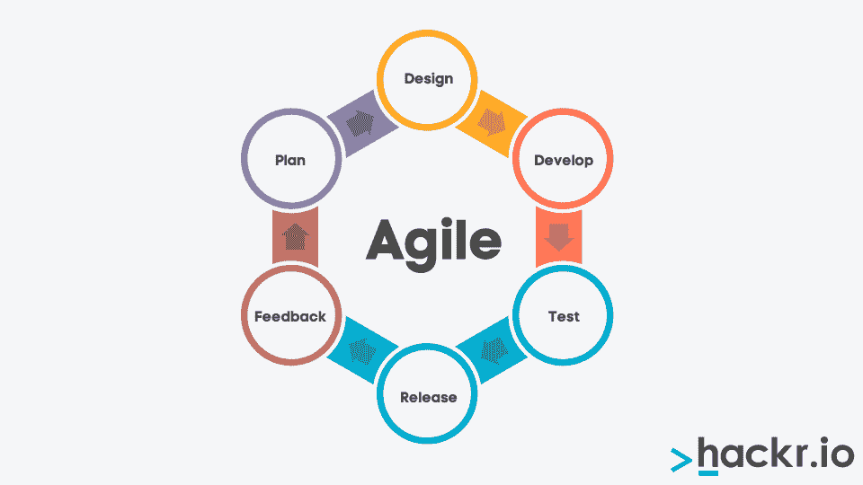
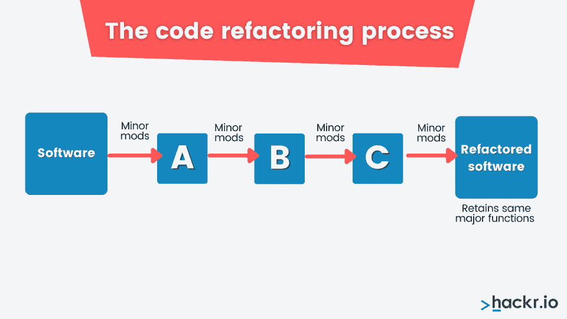
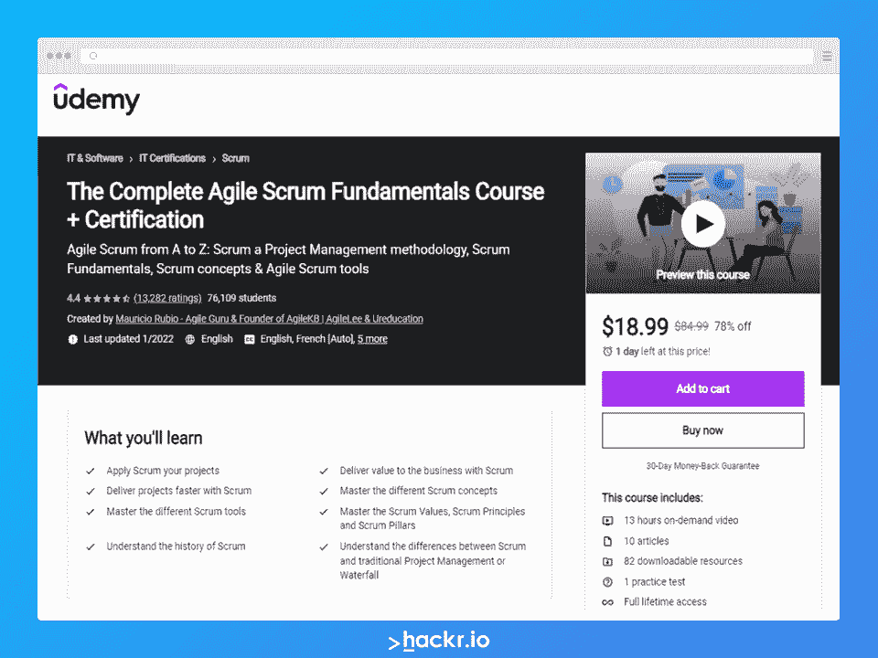
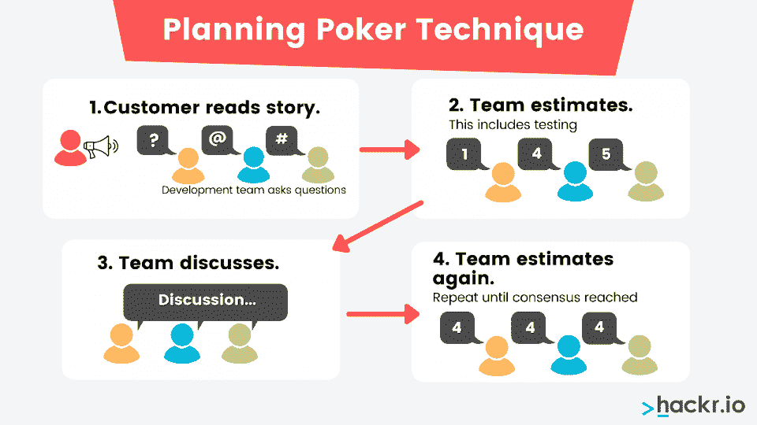

# 40 大敏捷面试问答[2023]

> 原文：<https://hackr.io/blog/agile-interview-questions>

敏捷是软件开发中最广泛使用的项目管理方法之一。这是一种有时间限制的方法，在这种方法中，软件开发团队构建并向客户或利益相关者增量地交付软件*，而不是一旦开发完成就交付软件。*

 *敏捷方法将一个项目分割成小部分的用户功能(用户故事)，对它们进行优先排序，并在两周的周期内持续交付，称为*迭代*。

全球软件公司和企业越来越多地采用敏捷方法,这为许多职业机会打开了大门。也就是如果你知道如何掌握敏捷方法论面试问答。

如果你正在寻找敏捷领域的职业转换或提升，你需要准备一个高度定制的敏捷面试。

我们很乐意帮助你准备这些常见的敏捷面试问题和答案。

## **初学敏捷面试问题**

我们将这些敏捷问答分成了初级和高级两个部分。

让我们从初学敏捷方法的面试问题开始。

#### **1。什么是敏捷方法论？**

敏捷是软件开发中项目管理的迭代和增量方法。在整个开发过程中，随着需求的变化，客户和开发人员协作工作。

使用敏捷方法，软件开发团队将项目分成更小的部分，并对它们进行增量工作，以获得快速的客户反馈和持续的改进。团队使用这些积压来理解最终产品，并帮助开发过程向前推进。这种方法很受欢迎，也很有效，因为它还涉及到客户和他们的反馈，从而可以快速更新。

如果你是一个完全的初学者，在盲目地回答这些关于敏捷的面试问题之前，确保你彻底地研究了敏捷！

#### **2。什么是敏捷测试？**

敏捷测试是这个过程中的一个关键步骤。它测试软件是否存在任何潜在的缺陷、错误或可能危及其功能的问题。

适当的敏捷测试保证了高质量产品的交付。通常执行测试是为了找到软件产品中的漏洞，以便开发人员可以解决该问题，从而获得更好的用户体验。

#### **3。敏捷测试的原则是什么？**

以下是一些被广泛接受的敏捷测试原则:

*   **提供持续的反馈:**敏捷测试人员不仅不断地测试，还与最终用户分享测试结果，收集反馈，并与开发人员分享，以生产出更健壮的产品。
*   **向客户交付价值:**任何敏捷测试人员的最终目标都是为最终客户生成最好的产品。
*   **减少反馈响应时间:**测试人员与业务团队紧密合作，减少反馈响应时间
*   保持简单:敏捷测试人员只执行必要的测试以保持效率。他们试图交付具有最佳价值的简单产品，并在同一次迭代中纠正错误。
*   **实践持续改进:**敏捷测试人员对产品进行持续改进。
*   **应对变化:**敏捷测试人员总是对他们从客户那里得到的反馈做出反应，对产品的每个用户故事做出反应。
*   更少的文档:测试团队应该遵循一套标准的实践来减少文档并简化流程。

#### **4。敏捷过程的优势是什么？**

以下是敏捷流程最显著的优势:

*   增强团队协作
*   适应客户的变化和发展
*   快速交付高质量的产品
*   涉及持续发展
*   接受客户的反馈，促进快速发展
*   在软件开发的最早阶段消除错误
*   通过将复杂的项目分成冲刺或迭代来帮助管理它们
*   适应项目目标未定义的情况

#### **5。敏捷过程的一些缺点是什么？**

以下是使用敏捷过程的一些缺点。

*   没有正式文件
*   难以预先估计完成开发所需的资源
*   对于较小的开发项目来说非常耗时。
*   比其他方法更昂贵

#### **6。敏捷方法有哪些不同的类型？**

软件开发团队可以采用以下任何一种敏捷方法:

*   Scrum: 它创建假设，测试它们，反思经验，并做出调整。它主要关注反馈、自我管理、管理小团队，以及分成小的和相等的冲刺的工作。
*   FDD(特性驱动开发):它有助于在两周内创建软件模型。FDD 是一个轻量级和增量式的软件开发过程，可以确保软件的稳定性。
*   精益软件开发:这种方法使浪费最小化，价值最大化。
*   XP(极限编程): XP 创造高质量、低风险的软件，确保客户的需求。该软件从第一天开始测试，并根据反馈改进开发过程。
*   看板:它使用看板来衡量进度，添加产品的细节，并让所有其他团队成员都可以访问。

**推荐管理软件**
[试试 Monday.com](https://try.monday.com/hackr)

#### **7。一个优秀的敏捷测试人员应该具备哪些素质？**

以下品质定义了一个优秀的敏捷测试人员:

*   很强的沟通技巧
*   适应客户不断变化的需求
*   出色的优先排序技巧
*   强大的问题解决者
*   聚焦的
*   创造性的

#### **8。sprint backlog 和产品 backlog 最大的区别是什么？**

**sprint backlog** 存储了完成特定 sprint 所需的所有细节。这些积压工作包含了关于特定 sprint 的所有必要的特性和需求。

**产品待办事项**带有产品的基本细节和特性，由产品所有者创建和维护。它包含了完成软件开发过程所需的一切，并将这些项目分解成几个步骤以达到最终产品。

#### **9。什么是重构？**

****

重构改变了软件产品的内部结构，而不影响其外部行为。红绿是一种常见的敏捷重构技术。只需要对代码进行一些调整就可以做出改变。

#### 10。采用敏捷方法的挑战是什么？

以下是采用敏捷方法带来的一些关键挑战:

*   它主要关注严格的测试和客户参与。
*   开发人员必须在进入下一个功能之前完成每个功能。
*   它在很大程度上影响了管理。
*   代码需要额外的关注，软件才能按预期工作。
*   在开发开始之前需要更多的规划。

#### **11。敏捷方法和传统方法的区别是什么？**

下表强调了敏捷方法和传统方法的主要区别:

| **敏捷软件开发** | **传统软件开发** |
| 注重团队合作、客户协作、沟通和其他功能 | 关注前期规划和成本计算、范围和期限 |
| 在开发活动的同时进行测试 | 在开发活动结束时进行测试 |
| 开发时测试功能 | 测试开发后的完整应用程序 |
| 在开发过程中吸引利益相关者和客户 | 没有利益相关者的参与 |
| 测试人员和开发人员作为一个团队一起工作 | 测试人员和开发人员的合作不多 |
| 在每个冲刺阶段不断与客户互动 | 仅在需求阶段与客户合作 |
| 灵活的 | *不如*灵活 |
| 适合大型或复杂的项目 | 适合小型或不太复杂的项目 |

#### **12。敏捷中的“速度”是什么？**

速度衡量完成的工作和完成一次冲刺所需的时间。团队使用 velocity 作为校准工具来创建准确高效的时间线。此外，它还帮助团队成员发现问题并衡量改进。

#### 13。敏捷中的冲刺是什么？

冲刺是敏捷方法的核心特征，拥有一个优秀的冲刺有助于团队快速有效地交付产品。sprint 是 scrum 团队完成特定数量的工作所需的一小段时间。每个项目都被分成冲刺阶段，冲刺阶段又被分解成小阶段。一次冲刺的结果会影响下一次的成功。

团队在项目开始时决定冲刺的次数，并根据需要进行调整。

#### **14。敏捷团队如何维护需求？**

敏捷团队使用产品积压来管理客户的需求。他们与利益相关者和产品经理签署协议，快速交付软件并确保高质量。

#### 15。你能解释一下增量和迭代开发吗？

**迭代开发:**软件开发周期不断重复，直到实现最终产品。客户或用户提供的反馈改进了周期，导致新功能的迭代增加。

**增量开发:**这个过程将软件开发划分为增量或片段。增量开发过程为每个增量提供了一组新的功能。变更可大可小，并经过彻底的测试和合并，形成一个单一的软件。

#### 16。敏捷和 Scrum 有什么区别？

敏捷是一种软件开发方法，其中复杂的项目被分解成小的冲刺。Scrum 是一种特殊的[敏捷方法](https://hackr.io/blog/what-is-agile-methodology),它分享了敏捷的相同原则和价值观，同时在其上添加了一些独特的特性。

你可能需要回答更多的 scrum 敏捷面试问题——考虑在面试前参加这两个方面的入门课程。

下表列出了[敏捷和 Scrum](https://hackr.io/blog/agile-vs-scrum) 之间的一些关键区别:

| **敏捷** | **Scrum** |
| 适合小型专家团队的项目 | 适用于需求不断变化的项目 |
| 长期的过程 | 短期过程 |
| 简单的设计 | 需要创新、创造设计和执行 |
| 项目负责人处理每项任务 | 整个团队处理每一项任务 |

#### **17。为什么持续集成在敏捷中很重要？**

以下原因解释了为什么持续集成在敏捷中至关重要:

*   您可以通过按时检测 bug 并在发现时修复它们来维护一个适当的时间表。
*   无论代码交付的频率如何，您都可以确保稳定的产品质量。
*   持续集成确保代码库质量。
*   随着复杂的项目被分解成更小的部分，或者说，分支，随着持续的交付，您可以发现那些分支上的工作对主分支的影响。它还负责自动构建和合并功能。

#### 18。选择敏捷方法的原因是什么？

以下是选择敏捷进行软件开发和测试的主要原因:

*   **它有助于减少技术债务，**包括重构、解决缺陷、测试等维护任务。在传统的方法中，债务会迅速积累，因为主要的焦点是增加新的特性。然而，在敏捷中，每一个缺陷和特性变更都被记录在 backlog 中。
*   **你可以快速适应项目需求的新变化。**它允许团队成员在特定时间工作并管理客户需求，因此他们不必等待很长时间来进行变更、审批或审核。
*   通过促进测试人员、开发人员和利益相关者之间的合作，敏捷方法增强了工作的透明度。它帮助每个人都参与到产品的开发中来，并生产出更稳定的产品，几乎没有出错和沟通不畅的空间。
*   **敏捷方法将风险降至最低**因为团队获得了一致的客户反馈。它允许每个人都在同一页面上，并减少了团队的额外工作。每个 sprint 都以客户为中心，团队成员可以按照客户的期望开发产品。
*   **敏捷方法允许你用时间盒 springs 定义一个暂定的发布日期，**这在传统方法中是不可能的。这使得客户能够判断他们产品的进展。
*   敏捷方法让客户参与整个开发过程。这有助于确保每个人都在同一页面上。

#### **19。什么是结对编程，它的优势是什么？**

在敏捷中，结对编程是两个人一起写代码，要么在同一台机器上，要么在不同的机器上。一个人编写代码，另一个人检查代码的每一行。

以下是敏捷方法中结对编程的一些重要好处:

*   促进更高质量的代码
*   消除出错的风险
*   允许知识共享
*   提高生产力
*   鼓励协作

20。你对敏捷宣言的理解是什么？

敏捷宣言宣布了敏捷软件开发周期的基本价值和原则。它于 2001 年推出，有四个价值和 12 个原则来改进开发过程。它帮助团队成员更有效地工作，增强协作，迭代开发，等等。

#### **21。敏捷宣言的核心价值观是什么？**

敏捷宣言有四个基本价值观:

*   **流程和工具之上的个人和协作:**这强调了一致的客户沟通和协作。
*   在全面的文档之上工作软件:这鼓励项目完成和最终的可交付成果，而不是冗长的文档。
*   **合同谈判中的客户协作:**这鼓励客户参与项目的所有阶段，因此每个人都在同一页面上。
*   与遵循计划相比，适应频繁的变化:这激励整个团队快速适应变化，而不是专注于某个特定的计划。

#### **22。敏捷宣言的原则是什么？**

每一个使用敏捷方法的组织都必须遵守以下原则以获得有效的结果:

*   **顾客满意:**优先满足顾客需求。
*   **欢迎改变:**改变对改善至关重要；因此，必须在整个开发过程中解决这个问题。
*   频繁交付:高质量的产品必须在短时间内交付。
*   **一起工作:**涉众和团队成员在整个开发过程中进行沟通。
*   被激励的团队:激励对于交付高质量的产品至关重要，因此企业领导人应该给员工一个合适的环境，让他们表现出色。
*   面对面:面对面咨询能更好地传达信息。
*   **工作软件:**定期更新和维护的软件测量最终产品的进度。
*   恒定的速度:恒定的速度确保快速交货。
*   好的设计:这有助于提高敏捷性(快速而优雅)。
*   **简单:**将复杂的任务分成更小的任务，使开发更容易。
*   **自组织:**敏捷团队应该是跨职能的、自组织的，不需要依赖经理来分配工作。
*   **反思和调整:**反思如何变得更有效率，定期评估工作方式。这有助于团队从错误中吸取教训，并在下一次冲刺中尝试解决它们。

## **高级敏捷开发面试问题**

想成为敏捷世界的领导者吗？通过这些高级敏捷评估问题和答案做好准备！

#### **23。敏捷中的燃尽图和燃尽图是什么？**

*   **燃耗图:**该图表示特定冲刺或迭代所需的已完成和未完成的工作。
*   **燃尽图:**这代表项目完工的剩余工作。

#### **24。燃尽图有哪些不同的类型？**

以下是不同类型的燃尽图:

*   **产品燃尽图:**显示每个完成的 sprint 的故事点和完成要求。它主要显示已实现的产品目标和剩余工作。
*   **Sprint Burndown 图表:**显示特定 Sprint 的剩余工作。它代表了团队的进展和剩余工作。
*   **Release Burndown Chart:** 显示团队相对于特定发布的总工作的进度。scrum 团队在每个 sprint 期间和结束时用所需的变更更新图表。
*   **缺陷燃尽图:**显示被识别的缺陷总数，随后被修复或移除。

#### **25。短跑会议有哪些不同的类型？**

敏捷方法强调协作，要求为每个 sprint 召开各种会议，以确定什么需要改变或改进。以下是不同类型的 sprint 会议:

*   **Sprint 计划会议:**这里讨论的是特性和产品 backlog 项目(用户故事)。产品负责人、Scrum Master 和 Scrum 团队主持这个会议，讨论 sprint 的要点。这个会议每周举行一次。
*   **冲刺评审会议:**在这里，Scrum 团队演示产品。当团队需要评审产品并进行必要的变更时，这个会议是有用的。产品负责人说明哪些项目已经完成，哪些项目尚未完成。如果需求发生变化，他或她可以向产品待办事项列表中添加项目。
*   Sprint 回顾会议:这个会议在 Sprint 计划会议之后召开，检查决策，讨论过去的错误，并回顾解决它们的方法。这个会议对于改进开发过程是必要的，持续几个小时。

#### **26。敏捷方法中有哪些常用的度量标准？**

敏捷度量对于跟踪已完成的工作和未完成的工作是必不可少的。它帮助团队和利益相关者开发进度报告，并通过协作提高他们的进度。敏捷方法量化了这些概念，如下所述:

*   **速度**:衡量冲刺过程中完成的工作量。
*   **累积流程图:**该流程图衡量正在进行的工作的当前状态，并管理流程稳定性。
*   **缺陷消除意识:**度量开发团队消除缺陷以确保产品质量的能力。
*   **工作类别分配:**定义任务的优先级。
*   **缺陷解决时间:**测量识别和修复缺陷所花费的总时间。
*   **时间覆盖率或代码覆盖率:**测量测试代码所花费的时间。
*   **交付的商业价值:**衡量团队的效率。

#### **27。你对敏捷中的“零冲刺”了解多少？**

零冲刺是指在第一次冲刺之前*进行的第一步。它也被称为第一次冲刺的预备步骤。*

Zero Sprint 包括在开始一个项目之前必须完成的活动，比如设置开发环境、准备 backlog 和其他任务。

#### **28。什么是安全的？**

SAFe 代表可扩展的敏捷框架。它是使用敏捷实践的计划和工作流模式的集合。SAFe 鼓励团队合作、协作以及向大量快速发展的团队交付。

#### **29。敏捷团队如何创建评估？**

您可以使用估算来计算项目的预算。敏捷团队使用这三个层次来创建评估:

1)**项目级**在项目开发初期使用快速功能点分析。

2)**发布标准**将故事点分配给用户问题，以对它们进行优先排序。它还指定了哪些问题来自当前版本。

3)**冲刺阶段**将用户问题从任务中分离出来，说明负责人、工作状态以及任务所需的平均时间，具体取决于严重性。

#### 三十岁。你能解释一下敏捷中的“规划扑克”技术吗？

****

Planning Poker，也称为 Scrum Poker，是一个基于共识的工具，它估计完成产品待办事项中每项任务所需的时间和精力。

这有助于团队提前发现问题。主要用于避免过多的外界影响，鼓励每个成员独立思考。这使得会议更有成效，并且创建了关于整个团队参与的评估。

#### 31。你对敏捷中的术语“用户故事”有什么理解？

用户故事是从用户角度描述软件特性的最小工作单元。这些故事是描述预期结果的简单词汇。用户可以在以后向用户故事中添加新的需求。

#### 32。什么是 Scrum，它的优势是什么？

Scrum 是一个轻量级的过程，它鼓励团队合作并管理产品开发，以确保高质量产品的及时交付。它帮助管理整个开发过程，直到满足客户的所有需求。就像在一般的敏捷过程中一样，产品是在被称为冲刺的最短时间内开发出来的。

以下是 Scrum 的一些显著优点:

*   制作快速版本，并提供给用户和客户
*   确保有效管理时间和资金以节约成本
*   非常适合快速开发项目
*   快速适应项目中的快速变化
*   增强创造力和创新力
*   将复杂的项目分成易于管理的冲刺阶段

#### 33。scrum 中有哪些不同的角色？

以下是 scrum 中的三个不同角色:

*   Scrum Master:Scrum Master 是团队的主管，负责确保团队高效地执行任务
*   **产品负责人:**产品负责人是项目的涉众，负责管理产品待办事项，并为团队定义要构建的内容
*   开发团队:开发团队包括整个团队，他们共同工作来交付最终的软件产品

#### 34。Scrum Master 的职责是什么？

以下是 scrum 主管的职责:

*   保持团队的积极性并专注于他们的任务
*   指导所有团队成员，以便他们高效地实现冲刺目标
*   建立一个有组织、有动力的团队
*   确保团队按预期交付
*   确保坚持 Scrum 的所有价值观、实践和原则
*   为团队消除外部障碍
*   解决一般问题

#### 35。Scrum 中的 timeboxing 是什么？

Timeboxing 是一个关键的时间管理工具，它限制了完成特定任务所花费的时间。

任何时间盒的最大长度为 15 分钟，您可以根据需要进行更改。时间框可以提高注意力和工作效率。以下是 Scrum 中的一些时间框事件:

*   冲刺
*   冲刺规划
*   每日混战
*   冲刺回顾
*   冲刺回顾

#### 36。你对 Scrum 中的障碍了解多少？

障碍是阻碍团队进步的干扰。它们降低了团队的绩效和生产力，从而降低了项目的速度。

scrum 大师必须努力消除障碍以提高性能。

一些常见的障碍包括:

*   资源危机
*   不健康的工作环境
*   技术或操作问题
*   电源或服务器中断
*   缺乏敏捷或 Scrum 知识

#### 37。敏捷测试的一些原则是什么？

驱动敏捷测试的关键原则是:

*   连续测试
*   连续反馈
*   让整个团队参与进来
*   快速反馈
*   高质量的软件
*   较少的文档
*   测试驱动
*   客户满意度

#### 38。成为一名优秀的敏捷测试人员需要具备哪些技能？

一个优秀的敏捷测试人员拥有以下技能:

*   对敏捷及其原则的透彻理解
*   客户和团队协作的沟通
*   分析以了解需求并确定任务的优先级
*   随着变化而变化

#### 39。Scrum 中的故事点是什么？

在 scrum 中，故事点是一个估计完成一个特定任务所需工作的单元。

#### 40。什么是 Scrum 中的 Scrum？

scrum 中的 scrum 是多个 scrum 团队的会议，每个团队都有一个代表。

## **为敏捷面试做准备的额外提示**

还有一些额外的方法来准备敏捷面试。考虑:

*   和朋友一起练习问题
*   阅读关于敏捷的原著，学习[敏捷方法论](https://click.linksynergy.com/deeplink?id=jU79Zysihs4&mid=39197&murl=https%3A%2F%2Fwww.udemy.com%2Fcourse%2Fintroduction-to-agile%2F)
*   参加关于敏捷开发的课程(稍后会详细介绍)。

回顾你自己的开发过程，思考如何更快地交付特性也是值得的。

## **结论**

敏捷方法的巨大好处现在被广泛接受，并被证明是最好的项目管理和软件开发方法之一。

我们希望这些敏捷面试问题能帮助你准备面试。但是不要就此打住！关于敏捷你还有很多要学，但是这些敏捷方法面试问题。问题是一个很好的起点。

有兴趣扩展你的知识面吗？

[学习敏捷方法](https://click.linksynergy.com/deeplink?id=jU79Zysihs4&mid=39197&murl=https%3A%2F%2Fwww.udemy.com%2Fcourse%2Fintroduction-to-agile%2F)

**人也在读:***