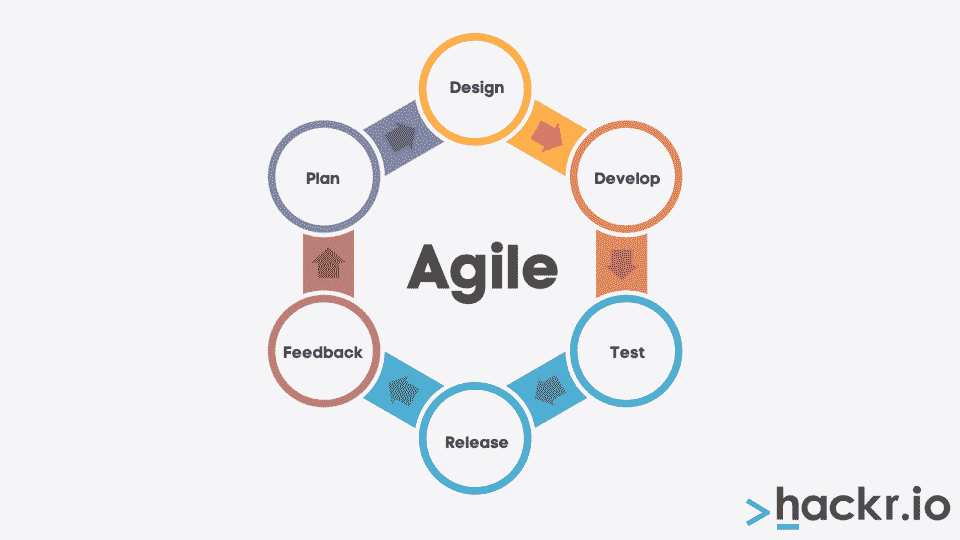
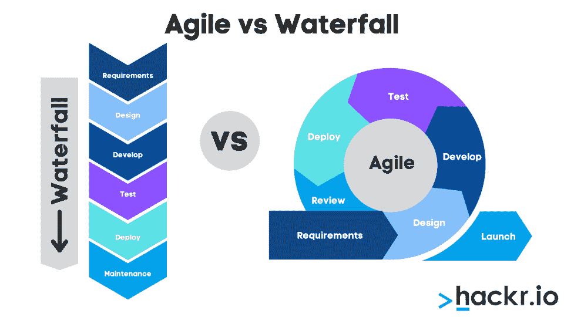
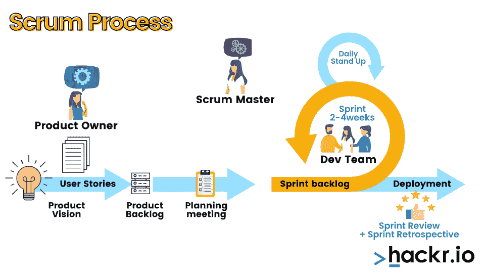

# 敏捷和 Scrum 的区别

> 原文：<https://hackr.io/blog/agile-vs-scrum>

你是一名项目经理或开发人员，想要学习更多关于敏捷和 Scrum 的知识。Scrum 和敏捷有什么区别？你应该使用哪一个？

Scrum 和敏捷都是快速、迭代的项目管理和开发方法。但是当谈到敏捷方法和 Scrum 时，敏捷往往是一种更广泛的哲学，具有更广泛的范围。

让我们来看看敏捷和 Scrum，他们真正擅长什么，以及如何在两者之间做出选择。

## **什么是敏捷？**

敏捷是一种软件开发和项目管理的迭代方法，在这种方法下，更小的变化可以更快地交付给客户。这种更小的迭代方法旨在更快地向客户交付产品。

在敏捷下，客户全程体验产品及其演变；一旦产品完成，他们不太可能不高兴。有更多的时间进行测试，因为产品正在不断推出，大规模的变更订单也更少了。

### **敏捷的利弊是什么？**

敏捷有利也有弊；它不太适合非常大或复杂的项目，因为它很难扩展。

**优点:**

*   团队保持灵活性和适应性
*   项目能够挖掘更高层次的创造力
*   变更请求越少，成本越低
*   产品能够更快地推向市场
*   质量通过迭代过程得到加强
*   顾客往往更满意
*   员工觉得沟通更强了

**缺点:**

*   如果没有合适的结构，敏捷会让人感到忙乱或混乱
*   很难将敏捷方法扩展到更大、更复杂的项目中
*   员工需要接受敏捷方法和哲学的培训

### 敏捷是方法论还是框架？

敏捷两者皆是。作为一种方法论，敏捷是一种更快、更迭代的产品交付哲学。作为一个框架，敏捷宣言对敏捷公司应该如何运作以及敏捷项目管理应该如何运作进行了完整的描述。敏捷既是一种软件开发方法，也是一种适用于许多场景的整体项目管理哲学。

敏捷在很大程度上取代了瀑布项目管理，在瀑布项目管理下，软件被分解成更大的版本。虽然这些版本可能已经非常“完整”，但它们也引入了更大的错误修复和更大的变更单。

在瀑布模式下，产品所有者只被允许在达到重要的里程碑时查看项目，在这一点上可能会有同样重要的变更。同样，项目只在这些大型里程碑之间进行测试，这意味着一次要发现更多的错误。

### 敏捷和 Scrum 孰先孰后？

Scrum 从 1986 年就存在了，而敏捷是在 2001 年发展起来的。在很多方面，敏捷已经脱胎于 Scrum，但是敏捷也有自己的哲学和一套过程。也就是说，Scrum 已经被引入敏捷，并经历了自身的发展。

在敏捷宣言于 2001 年发表后，Scrum 开始融入哲学之中。Scrum 被精炼和改进，并成为实现敏捷过程的方法之一。

**推荐管理软件**
[试试 Monday.com](https://try.monday.com/hackr)

**推荐课程** [敏捷基础:包括 Scrum 和看板- 2023](https://click.linksynergy.com/deeplink?id=jU79Zysihs4&mid=39197&murl=http%3A%2F%2Fhttps%3A%2F%2Fwww.udemy.com%2Fcourse%2Fagile-fundamentals-scrum-kanban-scrumban%2F)

Scrum 是什么？

## 

Scrum 最初在 1986 年被定义为一种强调速度和敏捷性的通用项目管理方法。虽然有时被程式化为“scrum”、“SCRUM”或“Scrum”，但它们都指的是相同的底层框架。与敏捷不同，Scrum 并不总是应用于软件开发。

在 Scrum 下，组织创建了称为“每日 Scrum”的限时会议，这是站立会议的一种形式。这是为了让团队保持良好的协调和一致。

此外，项目是在有时间限制的迭代中创建的，这被称为“冲刺”完成冲刺后，团队会一起分析和改进。

Scrum 是在软件开发不是主要问题的时候引入的，但是敏捷在很大程度上归功于 Scrum 的迭代项目完成思想。

Scrum 有哪些优点和缺点？

### 和敏捷一样，Scrum 更适合于那些很快结束的短期项目。但与敏捷不同，Scrum 也可以是一种时间思维；因为员工需要善于沟通，所以确保每次会议都有价值是很重要的。

**优点:**

员工可以快速周转产品

*   Scrum 确保员工有效沟通
*   大型项目可以分解成更小的冲刺
*   客户和利益相关者可以快速提供反馈
*   团队成员的工作经常受到表扬
*   管道管理的问题立即暴露出来
*   **缺点:**

没有明确的结束日期，scrum 项目可能会比预期的持续更长时间

*   Scrum 非常依赖个人来执行项目
*   就像一般的敏捷一样，当要求扩展时，Scrum 可能会崩溃
*   团队成员在会议期间可能会感到疲劳
*   Scrum 是敏捷的一部分吗？

### 尽管 Scrum 在技术上比敏捷更古老，但它已经融入了一般的敏捷哲学和框架。Scrum 被认为是实现敏捷开发过程的主要方法之一，一些软件开发公司仍然使用敏捷和 Scrum 技术。

**没有敏捷可以使用 Scrum 吗？**

### Scrum 可以在没有敏捷的情况下使用，尤其是对于那些不专注于软件开发的组织。敏捷的非常快节奏的连续迭代过程可能不太适合物理产品，例如，甚至快速原型。Scrum 可以用于比敏捷更多样化的应用。

敏捷有不同的类型吗？

### 除了 Scrum，你可能听说过其他类型的敏捷。有许多方法可以实现敏捷方法。它们包括看板、Scrumban 和 DevOps。

看板:看板是一种精益流程，旨在为小型、离散或直接项目带来敏捷框架。看板的主要基础是看板板，它是一块写满便利贴的白板。团队成员可以在黑板上认领物品，开始处理物品，然后解决它们。

*   Scrumban 是介于 Scrum 和看板之间的混合开发方法。在 Scrumban 中，Scrum 用看板方法进行了修改，使其更容易用于正在进行的项目，而不是快速的一次性项目。
*   DevOps: DevOps 是敏捷方法的最新发展，它进一步加速了敏捷过程。在 DevOps 下，产品是连续交付和部署的，因此系统保持响应性并不断变化。
*   根据您的组织，上述方法之一可能最适合您的组织。许多组织也混合和匹配不同敏捷方法的特性。

**敏捷和 Scrum 有什么区别？**

## 敏捷是一种总体的、健壮的项目管理哲学，它是为特定的任务量身定制的。Scrum 是一种特定类型的项目管理框架，经常在敏捷方法中使用，以使项目管理更容易。

更具体地说，Scrum 创造了“如何”，但是敏捷创造了“为什么”

**敏捷**

| **Scrum** | 项目管理和产品交付的大哲学。 |
| 更好地管理和控制敏捷团队的具体框架。 | 项目被组织成特定的迭代。 |
| 项目被组织成更大的里程碑，称为 sprints。 | 重点是产品的持续交付。 |
| 重点是确保团队成员得到认可，问题得到解决。 | 确保团队成员能够自主工作。 |
| 确保团队成员定期相互联系。 | 你应该使用敏捷还是 Scrum？ |

## 如果你从事软件开发，敏捷最有意义；但是你可以在敏捷中使用 Scrum。许多软件开发人员会在敏捷、Scrumban 或看板之间做出选择，这取决于他们的项目有多长时间，项目是否有一个明确的结局，以及项目真正需要的敏捷程度。

然而，还应该注意的是，公司现在更多的是转向[开发运维](https://hackr.io/blog/what-is-devops)。

敏捷是快速发布的迭代过程，但是开发运维是连续发布的迭代过程。从很多方面来说，DevOps 是敏捷的自然发展。对于许多组织来说，DevOps 更有意义。

**了解更多关于敏捷和 Scrum 的知识**

## 总之，敏捷和 Scrum 的主要区别在于敏捷描述了一个更大的哲学，即使 Scrum 可能实际上是最早起源的。敏捷的 Scrum 方法从此变得错综复杂；你可以使用敏捷 Scrum 框架创建一个敏捷/Scrum 环境，它们可以非常整齐地一起运行。

你如何学习更多关于敏捷和 Scrum 的知识？项目管理课程，尤其是那些专注于软件开发的课程，会经常深入探究敏捷、Scrum 和其他方法。

敏捷、Scrum 甚至 DevOps 并不总是组织的系统开发、交付或部署的最佳选择。但是了解这些选项是很重要的。敏捷和 Scrum 构成了现代项目经理工具集的基础。他们不仅对动员团队非常重要，而且对确保产品的一致性也非常重要。

如果你想学习更多关于敏捷或 Scrum(或者敏捷与 Scrum)的知识，你可以先看看项目管理教程。在此基础上，考虑一门课程甚至一个认证过程。

**人也在读:**

**People are also reading:**