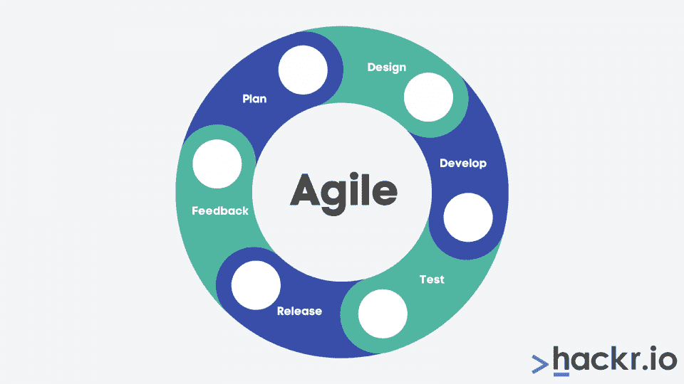
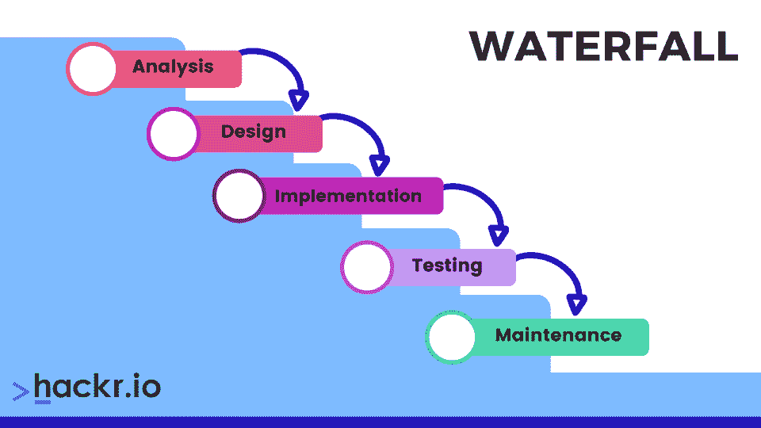

# 敏捷与瀑布:你应该知道的区别

> 原文：<https://hackr.io/blog/agile-vs-waterfall>

软件开发项目的成功与所选择的开发方法密切相关。敏捷和瀑布是目前最流行的 SDLC 方法中的两种。

因此，开发团队可能会问自己这样一个问题，选择哪一个？

敏捷和瀑布方法都是软件开发的成熟方法。

尽管两者有一些相似之处，但是两种 SDLC 模型在几个方面是不同的。所以，在从中挑选时，你应该记住这些。

在比较敏捷和瀑布之前，首先让我们仔细看看它们是什么，然后评估它们的优缺点。

## 什么是敏捷方法论？[定义]

敏捷软件开发方法关注于整个软件开发过程中开发和测试的连续迭代。SDLC 模型增加了客户、开发人员和测试人员之间的交流。

斯科特·安布勒在 2000 年秋天开始开发敏捷方法。虽然最初被称为极限建模(XM)，但后来在罗伯特·塞西尔·马丁的建议下，它被重新命名为敏捷建模。

敏捷方法是一种迭代的、基于团队的软件开发方法。它是[快速应用开发(RAD)模型](https://hackr.io/blog/rapid-application-development-model)的独特类型。虽然不是新的，但与经典的瀑布模型相比，它是相对较新的。

不是创建时间表和任务，而是将敏捷项目的全部可用时间划分成称为冲刺的阶段。每个 sprint 都有一个确定的持续时间，通常是几周，在 sprint 开始的时候计划了一个可交付的列表。

每一个可交付成果都根据商业价值进行优先排序，而商业价值是由客户决定的。敏捷方法在很大程度上依赖于客户在整个软件开发过程中的高度参与。

如果某个特定 sprint 的计划工作由于某种原因不能完成，那么整个工作将被重新排序，而获得的信息将用于即将到来的 sprint 计划。

项目开发团队和客户对完成的工作进行评估和评审。这是通过日常构建和冲刺阶段的演示来完成的。

### 赞成的意见

*   作为一个以客户为中心的过程，它确保客户持续参与整个过程的每一个阶段
*   确保软件开发的质量保持在一个理想的程度甚至更好
*   客户享受早期和频繁的机会看到进展。因此，有可能在整个项目开发过程中改变决策
*   赋予客户强烈的主人翁意识，因为他们与项目开发团队有着直接和广泛的联系
*   它可以产生正在开发的软件的基本版本，该版本可以在后续的迭代中构建。这对于上市时间非常重要的项目非常有帮助
*   可能会产生更好的结果。这是因为，通常情况下，敏捷团队都是非常积极和自组织的
*   降低失败的风险，因为该过程完全基于渐进的进展。因此，客户和开发团队都确切地知道什么是完整的，什么是不完整的

### 骗局

*   如果项目主管对结果不确定，项目脱轨的风险就会增加
*   它需要专家的参与来做出重要的决定
*   不适合小规模项目
*   实现敏捷方法的总成本比其他软件开发方法略高。此外，随着软件开发的进展，总的计划时间可能会增加
*   客户高度参与的特征可能不是一些客户可能要求的

## 哪些组织使用敏捷？

有很多大公司都在使用敏捷方法，比如 IBM、苹果、宝洁，甚至微软。然而，大型科技公司并不是唯一可以使用敏捷的公司。许多领域都可以利用这种方法，包括航空航天、制药、工程、建筑管理和内容管理行业。任何规模的企业都可以使用这种方法，所以即使你是一个三人团队，敏捷也可以为你工作。

## 什么是瀑布方法论？

瀑布模型也被称为软件开发的传统方法，它遵循软件开发的线性方法。因此，它也被称为线性序贯生命周期模型。

虽然来源于瀑布一词，但瀑布模型的第一个正式描述是由温斯顿·w·罗伊斯在 1970 年的一篇文章中引用的。贝尔和塞耶在 1976 年发表的论文被认为第一次使用了术语“瀑布”。

因为瀑布模型遵循严格的顺序，项目开发团队只有在前一个阶段成功完成时才能进入下一个阶段。通常，瀑布方法的每个阶段之间都有一个关卡。

### 赞成的意见

*   有利于管理依赖性
*   在软件开发的所有阶段，客户的参与并不是强制性的
*   根据项目的进行阶段，团队的不同成员可以专注于不同的任务
*   每个阶段都有不同的交付成果和审查过程。因此，很容易管理
*   有一个易于适应的方法来改变团队
*   提供更快的产品交付
*   规划和设计很简单，因为客户和开发团队很早就同意开发软件产品的内容和方式
*   因为事先知道任务的全部范围，所以可以快速评估和测量进展
*   提供一个软件设计，减少零碎效果的机会。这是因为软件从一开始就设计得更加仔细和完整
*   适用于需要设计多个软件组件来与一些外部系统集成的项目
*   记录良好的过程和结果
*   非常适合小规模项目，尤其是那些需求易于理解的项目

### 骗局

*   出现错误和漏洞的几率很高，因为测试过程只有在项目开发结束时才开始
*   对于大型项目不切实际
*   无法适应过程中后来所做的更改
*   当需求在开始时不明确时，效率较低的方法
*   不清楚客户期望最终产品是什么

**推荐课程**
[比较敏捷与瀑布式项目管理](https://click.linksynergy.com/deeplink?id=jU79Zysihs4&mid=39197&murl=https%3A%2F%2Fwww.udemy.com%2Fcourse%2Fagile-vs-waterfall%2F)

## 哪些组织使用瀑布？

由于瀑布的线性性质(及其僵化的倾向)，它并不总是对每个人都是最好的方法。当考虑瀑布模型和敏捷时，观察你的项目的特征以确保方法的适用性是很重要的。许多行业至今仍在使用这种方法，包括银行、建筑、IT 和软件开发。

## 敏捷与瀑布:你应该知道的区别

### 1.灵活度

瀑布模型是一种结构化的软件开发方法。因为它不能适应后来的变化，所以它提供的灵活性很小甚至没有。另一方面，更喜欢敏捷方法的主要原因之一是它的高度灵活性。

敏捷方法允许项目需求的变更，即使在最初的计划完成之后。一旦项目开发开始，瀑布模型就不能改变需求。

### 2.整个过程的划分

敏捷方法将整个开发生命周期分为冲刺阶段。相反，瀑布方法把同样的事情分成不同的阶段。

### 3.资金和资源偏好

由于风险协议是在软件开发过程的最开始制定的，瀑布方法降低了固定价格项目中的整体风险。

敏捷模型对固定价格的项目不太适用。相反，固定价格的场景可能会增加敏捷项目的压力。敏捷方法最适合于非固定或[时间&材料(T & M)类型资金的项目。](https://en.wikipedia.org/wiki/Time_and_materials)

### 4.阶段的出现

由于敏捷模型遵循开发的迭代模式，在软件开发过程的整个运行过程中，像计划、开发和原型开发这样的不同阶段可能会出现不止一次。

在软件开发的瀑布方法中，所有阶段在整个过程中只出现一次。

### 5.要求的准备

为了提出要开发的软件项目的需求，需要按照瀑布方法进行广泛的业务分析。开发团队成员不参与识别项目需求。

遵循敏捷方法，客户和开发团队几乎每天坐在一起准备项目需求。因此，测试团队也可以参与需求的变更。

### 6.主焦点

瀑布方法的主要焦点是完成一个产品。敏捷模型专注于从客户那里获得产品满意度，并根据不断发展或更新的客户需求来改变自己。

### 7.项目详细信息描述

在遵循敏捷方法的整个软件开发过程中，可以随时更改项目细节描述。

瀑布模型则不是这样，在瀑布模型中，一旦项目开发开始，就没有改变项目细节描述的规定。

### 8.项目视图

使用瀑布方法，软件开发项目被视为单个项目。这与敏捷方法形成了鲜明的对比，敏捷方法将开发中的软件项目视为几个子项目。

### 9.团队协作

在瀑布方法中，团队协调或同步是非常有限的。对团队规模没有偏好。相反，敏捷模式更喜欢一个小而专注的团队。因此，其成员之间的协调程度非常高。

### 10.团队互换性

敏捷团队的成员是可以互换的。因此，他们工作得更快。此外，软件开发方法不再需要项目经理，因为整个团队负责管理开发中的软件项目。

项目经理是负责在遵循瀑布方法的软件开发的所有阶段拥有最终发言权的人。此外，团队成员的互换性是不可能的。

### 11.测试

瀑布方法有一个专门的测试阶段，只有在开发阶段成功完成之后才会出现。在敏捷方法中，测试与软件开发同时进行。

此外，在瀑布模型的测试阶段，很少审查测试计划。与此不同的是，敏捷项目的测试计划在每次冲刺后都会被审查。

### 12.需求类型

瀑布方法的需求是明确的，这意味着任何与此相关的变化都是意想不到的。

另一方面，在软件开发过程中，任何项目的需求都有可能改变或发展，这被认为是敏捷开发的理想选择。

### 13.接近方式

敏捷模型遵循软件开发的增量方法。对开发中的软件的添加是以增量的方式进行的，并且有可能在软件开发过程的不同部分之间跳转。

另一方面，瀑布方法遵循顺序设计过程。只有在前一步成功完成后，才能进入开发流程的下一阶段。

## 敏捷与瀑布:面对面的比较

| **参数** | **敏捷** | **瀑布** |
| 开发周期的分离 | 它将项目开发生命周期分成冲刺阶段。 | 软件开发过程分为不同的阶段。 |
| 方法 | 它遵循一种渐进的方法。 | 这种方法是一个连续的设计过程。 |
| 灵活性 | 灵活:需求可以改变。 | 刚性:一旦项目开发开始，需求就不能改变。 |
| 测试计划评审 | 在每次冲刺后审查 | 在测试阶段很少讨论测试计划 |
| 并发 | 测试与软件开发一起进行。 | 测试阶段在构建阶段之后。 |
| 效率 | 它适用于时间和材料或不固定的资金。在固定价格的情况下，这可能会增加压力。 | 通过在流程开始时达成风险协议，降低固定价格合同中的风险。 |
| 团队规模 | 一个由专门人员组成的小团队，以实现高度的协调和同步。 | 团队协调/同步非常有限。 |
| 工作风格 | 在项目过程中，每天都要讨论产品需求。 | 业务分析在项目开始前准备需求 |
| 项目描述 | 在 SDLC 过程中，项目细节的描述可以随时更改。 | 详细描述需要实现瀑布软件开发方法。 |
| 团队成员 | 敏捷团队成员是可以互换的，因此他们工作得更快。也不需要项目经理，因为项目是由整个团队管理的 | 这个过程总是很简单，所以项目经理在 SDLC 的每个阶段都扮演着重要的角色。 |

## 结论

敏捷和瀑布是不同形式的软件开发方法。因此，它们中的每一个在某些场景中都很棒，而在另一些场景中却不切实际。具有不断发展或不确定需求的软件开发项目是使用敏捷方法完成的理想选择。另一方面，具有明确需求的软件开发项目发现瀑布模型是最佳选择。

**推荐管理软件**
[试试 Monday.com](https://try.monday.com/hackr)

如果你想在多个 sprints 上同时获得更多的灵活性和协作，而不需要一个专门的经理，那么选择敏捷。如果你对一个有预定义需求的项目有一个固定的时间表，瀑布方法和敏捷方法可能更适合你——即使你需要一个项目经理。如果这两种方法都不合适，记住你可以将它们结合起来。

我们希望上面的比较能让您在两种流行的 SDLC 模型中做出选择。祝你在软件项目开发中一切顺利。

想开始编程？这里有一些[最好的编程入门教程](https://hackr.io/tutorials/learn-intro-to-programming?ref=hackr-blogpost)可供选择。

**奖金推荐课程**

[2023 敏捷项目管理 Vs 瀑布+ Scrum 简介](https://click.linksynergy.com/deeplink?id=jU79Zysihs4&mid=39197&murl=https%3A%2F%2Fclick.linksynergy.com%2Fdeeplink%3Fid%3DjU79Zysihs4%26mid%3D39197%26murl%3Dhttps%253A%252F%252Fwww.udemy.com%252Fcourse%252Fwaterfall-and-agile-comparison-made-easy-scrum-introduction%252F)

## 常见问题

#### 1.瀑布和敏捷有什么区别？

*   敏捷是一个迭代的过程，而瀑布使用更传统的方法——线性/顺序流程。
*   敏捷是为需要更多灵活性的项目而创建的，而瀑布最适合那些有严格时间表、有良好文档记录和理解需求的项目。
*   敏捷将一个项目中的工作分成“冲刺”，一个 scrum 团队必须在短时间内完成工作。团队可以同时进行几项短跑训练。另一方面，瀑布将项目分成阶段，其中一个阶段必须在另一个阶段开始之前完成。
*   敏捷最适合同时从事许多小项目的团队，而瀑布更适合从事单个项目的团队。
*   敏捷关注客户满意度。瀑布关注软件项目的成功交付。
*   敏捷方法可以随时添加需求，也可以随时更改需求。瀑布方法在项目开始之前建立需求，然后在项目开始后避免对范围的任何改变。
*   敏捷团队可以在没有专门经理的情况下运作，而瀑布团队需要一个。

#### 2.为什么敏捷优于瀑布？

世界各地的团队选择敏捷方法有很多原因，其中一个原因是这种方法是协作的，最适合灵活和自我激励的团队。以下是其他一些原因:

*   敏捷不需要一个专门的经理来让团队成功。
*   这种灵活的方法为团队和项目在项目开发过程中适应和改变留下了足够的空间。额外的变化空间也使得预算更加灵活。
*   当项目更加依赖于研究和测试时，敏捷会更好，因为每次迭代后都可以进行调整。
*   敏捷很适合所有者和利益相关者可能更多地参与到过程中的情况，尤其是当他们不经常检查的时候。

敏捷非常适合那些希望快速前进，同时仍然能够尝试项目发展方向的团队。

#### 3.敏捷测试和瀑布测试的区别是什么？

敏捷测试不是一个独立的阶段。团队在开发冲刺的同时执行测试，通常在每个迭代中执行测试。开发和测试团队在整个过程的每一步都一起工作，测试人员也参与了方法学中需求的创建。敏捷在每次迭代之后都进行回归和验收测试，在编码和测试之间没有延迟。因此，不同的测试级别可能会重叠。

团队将瀑布测试作为一个独立的阶段来执行，不同于开发过程。事实上，在开发完成之前，不会进行任何测试。所有类型的测试，无论是回归测试还是验收测试，都是在开发阶段完成之后进行的。开发人员和测试人员分开工作，测试人员根本不参与确定项目的需求。编码和测试之间会有时间延迟，测试阶段也不会重叠。

#### 4.你能混合敏捷和瀑布吗？

是啊！许多公司将这两种方法的精华部分结合到他们自己的过程中。众所周知，谷歌混合使用了两者。

敏捷和瀑布的结合通常被称为“Agifall ”,因为它通过将敏捷的一些特征注入到一个松散的瀑布式过程中，结合了两个世界的优点。Agifall 的目标是降低项目成本，提高项目质量，同时提高开发速度。

Agile fall 使用以用户为中心的计划过程，并通过使用更类似敏捷的方法来执行瀑布的需求和计划而获得成功。使用这种结合的方法，团队不需要等到一个项目阶段结束后再开始另一个阶段。相反，下一阶段会尽快开始。结果是，即使在计划阶段，项目的组件和模块也是独立开发的。

一个很好的例子是在开发阶段同时进行图形设计和测试。

### 5.敏捷比瀑布便宜吗？

不一定。敏捷比瀑布更便宜或更快，这是一个常见的神话或误解。毫无疑问，这种误解导致了敏捷的迅速流行，但事实并非总是如此。

敏捷可能比它的对手更便宜、更快。需要注意的是，只有当敏捷方法更适合团队和项目时，这种情况才会发生。在适当的情况下，瀑布也有同样的机会变得更便宜和更快。