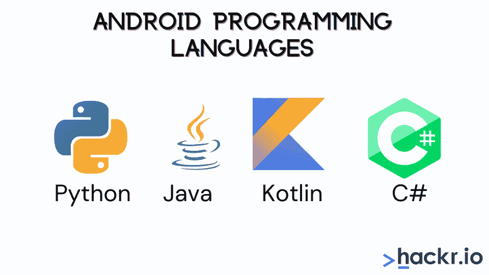
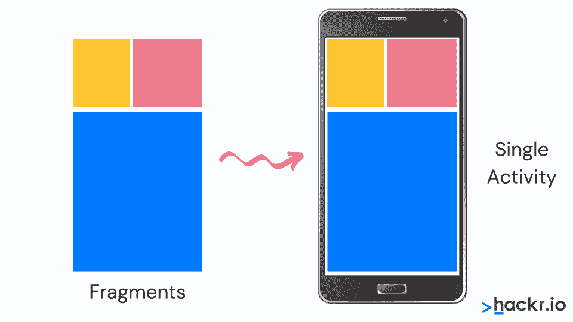

# 2023 年 40+热门安卓面试问答[更新]

> 原文：<https://hackr.io/blog/android-interview-questions>

Android 由谷歌开发，于 2008 年首次发布，此后越来越受欢迎。凭借超过 70%的市场份额，Android 是世界上最受欢迎的移动操作系统，这使得它对于寻求在移动设备上登陆的公司和开发者来说至关重要。Android 开发者仍然需求旺盛。

这个 Android 面试问题和答案的列表将帮助你准备一个 Android 相关的角色。这些问题被分为初级、中级和高级。

在我们开始研究 Android 上的这些面试问题之前，让我们先弄清楚一些常见的 Android 开发人员面试问题。

### Android 面试中会问哪些问题？

在你的 android 面试中，你会被问到一系列问题，从理论到实践。一般来说，你可以预期 Android 面试将包含 2-5 年经验的问题(取决于工作资历)。

幸运的是，这不是非常困难的，所以你应该可以通过一些扎实的准备来赢得面试。

## **热门安卓面试问答**

我们从一些基本的 Android 面试问题开始，然后进入更难的问题。

## **基础水平面试问题**

#### **1。解释 Android 中的构建过程。**

Android 中的构建过程有三个步骤:

*   第一步包括使用 Android 资产打包工具(AAPT)编译资源文件夹。这些被编译成一个名为 R.java 的类文件，该文件只保存常量。
*   第二步，需要将 java 源代码编译成。类文件，然后使用“dx”工具将其转换为 Dalvik 字节码，dx 工具是软件开发工具包中的工具之一。最终的输出文件是 classes.ex。
*   在第三步，也是最后一步，Android apk 构建器需要接受所有输入并构建 Android 打包密钥(apk)文件。

#### **2。说出一些 Android 编程语言。**

以下是可用于开发 Android 应用程序的最流行的编程语言列表:

*   Java:作为[最流行的编程语言之一](https://hackr.io/blog/best-programming-languages-to-learn)，Java 一直是新开发者的起点，并且被许多从事 Android 开发的人所使用。
*   Kotlin 是一种相对较新的、现代的、安全的、面向对象的跨平台编程语言。当 Android Studio 3.0 于 2017 年 10 月发布时，Kotlin 被宣布为 Android 的官方编程语言。许多流行的应用程序，如 Trello、Square 和 Corda，后来都转移到了 Kotlin。
*   **C#** :使用 C#语言开发者可以构建原生的 iOS 和 Android 移动应用。
*   Python 已经成为最近最流行的编程语言之一。Python 是一种动态的面向对象的编程语言，在机器学习领域非常流行。

有多种工具可以帮助 Android 开发人员:

*   **Android 软件开发包(SDK)和虚拟设备管理器:**该工具用于生成和处理 Android 虚拟设备(AVD)和 SDK。通过 AVD 中的模拟器，您可以指定支持的 SDK 版本、SD 卡中的存储、屏幕分辨率以及 GPS 和触摸屏等其他功能。
*   **Android 模拟器:**AE 是 Android 虚拟机的实现，旨在运行虚拟设备本身的进程，可以在开发计算机上使用。该工具主要用于测试和调试 Android 应用程序。
*   **Android Debug Bridge(ADB):**ADB 是 SDK 提供的命令行调试应用程序。它使开发人员能够与设备进行通信，并简化应用程序的安装和调试等操作。
*   **安卓资产打包工具(AAPT):**AAPT 建立了。apk '可分发的 Android 包文件。

#### **4。解释 Android 界面定义语言。**

Android 界面定义语言或 AIDL 促进了客户端和服务之间的通信。对于进程间的通信过程，数据被分割成易于被 Android 平台识别的小部分。

#### **5。描述文件夹、文件&描述安卓应用**

以下是对这些概念的简要解释:

*   **gen** : gen 包含编译器生成的。引用项目中所有资源的 r 文件
*   **src:** src 保存。我们项目中的 java 源文件
*   **bin:** bin 包含。由 ADT 在构建过程中构建的 apk 文件，以及运行 Android 应用程序所需的所有其他东西
*   **AndroidManifest.xml:** 该文件是解释应用程序的基本特性并定义其所有组件的清单文件
*   **res/values:** res/values 是其他各种 XML 文件的目录，这些文件包含诸如字符串、颜色定义等资源
*   **res/drawable-hdpi:** 这是一个为高密度屏幕设计的可绘制对象的目录
*   **res/layout:** 它是定义应用程序 UI 的文件目录

#### **6。什么是“活动”？描述活动的生命周期。**

活动被称为用户界面的窗口。它有助于显示输出，甚至可以要求输入，以便可以执行对话框和其他角色来创建用户界面。活动的生命周期如下

*   **OnCreate():** 视图被创建，数据从包中收集
*   **OnStart():** 如果活动对用户可见，则调用该函数。如果活动到达前台，则可能由 onResume()继承，如果转换为 hidden，则由 onStop()继承。
*   **OnResume():** 当活动开始与用户交互时调用
*   **OnPause():** 当活动将要后台但还没有被杀死时调用
*   **OnStop():** 当用户看不到您时调用
*   **OnDestroy():** 活动结束时调用
*   **OnRestart():** 在活动停止后，再次启动前调用

#### 7 .**。陈述 Android 的一些优势。**

以下是 Android 的一些优势:

*   **低投入高回报:** Android 开发门槛低，适合希望精通[编程领域的新开发者](https://hackr.io/blog/what-is-programming)
*   **免费 SDK:**Android 最突出的一个特点就是软件开发包开源，免费提供，根除了授权分发和开发费的成本
*   易于采用: Android 应用程序是用 Java 编写的，Java 是世界上最常用的编程语言之一
*   **可重用:** Android 组件可以被框架重用甚至替换
*   **多平台支持:**Android 平台支持 Linux、Mac OS、Windows 等主流操作系统
*   **对可穿戴设备的支持:**现在市场上充斥着可穿戴设备，Android 已经成为这类设备的领先支持，这些设备现在在市场上随处可见

#### **8。Android 有哪些缺点？**

以下是 Android 操作系统的一些缺点

*   假冒应用程序:在任何时候，市场上都有成千上万的假冒应用程序，一旦安装，它们可能会试图窃取你的数据。
*   **精简问题:**市场上有各种各样的 Android 设备，屏幕大小和尺寸不同，但更重要的是不同的 Android 操作系统。每个应用程序开发人员都必须不断更新他们的应用程序以适应新的操作系统，但是对于各种操作系统版本和升级，这个过程相当困难。在一个版本的 Android 操作系统上流畅运行的应用程序在另一个版本的 Android 操作系统上可能会崩溃。
*   后台进程:后台运行的大量进程总是一个问题，因为它们会很快耗尽电池。

#### **9。定义 Android 的架构。**

Android 架构由五个组件组成。这些是:

*   **Linux 内核:**Linux 内核构成了 Android 平台的基础，它为诸如内存和电源管理以及各种驱动程序等功能提供了动力。它充当其他层之前的抽象层。
*   **平台库:** Android 的平台库是提供图形和媒体支持的原生 C 和 C++库，以及一个 WebKit 库。这允许开发人员实现图形功能和显示网页内容等。
*   Android 运行时: Android 运行时(ART)和核心库是架构中最重要的部分。它是应用程序框架的基础，具有优化的垃圾收集等特性。
*   **安卓应用:**这是你用手机看到的，是架构的顶级。电子邮件、短信和联系人等核心应用都是预装的。
*   应用程序框架:应用程序框架包含创建应用程序时使用的类。它们提供了用于创建应用程序的构建块，并提供了资源管理器、通知管理器和活动管理器等服务。

#### 10。什么是“仿真器”？

Android 中的一个“[模拟器](https://www.bluestacks.com/)”帮助开发人员使用一个界面来玩游戏，这个界面就像一个真正的移动设备。这样，开发人员就可以更容易地为应用程序编写和测试不同的代码。通过模拟器，调试过程也变得可能。因此，仿真器提供了一个安全的平台，用于在早期阶段测试代码，以及在需要处理错误的后期阶段测试代码。

#### **11。什么是 Activitycreator？**

Activitycreator 是创建 Android 项目的第一步。它由 shell 脚本组成，可用于创建新的文件系统，这是在 Android 系统中编写代码所必需的。

#### **12。什么是 Android 运行时？**

Android 运行时(ART)是 Android 操作系统用作运行时环境的应用程序。它现在已经取代了 Dalvik，一个停产的虚拟机(VM)。ART 将应用程序的字节码翻译成本机指令，由设备的运行时环境执行。

#### 13。解释术语 ANR。

ANR 是应用程序不响应的缩写。每当应用程序在相当长的一段时间内停止响应用户的操作时，它就会显示为 Android 操作系统的一个通知。

#### **14。解释 Android 支持的对话框。**

Android 支持四种对话框:

*   **AlertDialog:** AlertDialog 支持 0-3 个按钮，以及一系列可选项目，如单选按钮和复选框
*   **DatePickerDialog:** 用于用户选择日期
*   **TimePickerDIalog:** 用于用户选择时间
*   **ProgressDialog:** 用于显示进度条，是 AlertDialog 的扩展。它还支持添加按钮。

#### 15。什么是 Android 框架？

Android 框架是一组使开发过程更容易的 API。开发人员可以快速编写应用程序，因为 API 提供了诸如意图、文本字段等工具。它本质上是一个软件工具包，允许快速构建应用程序的框架。

#### 16。Android 中的 API 是什么？

应用程序编程接口(API)只是一组规范或规则，用于确定软件组件如何相互交互。发布 API 的公司这样做是为了让开发者围绕它所提供的服务来设计产品。

#### **17。Android 中的传感器有哪些？**

基于 Android 的设备内置了各种各样的传感器，可以测量某些参数，如运动、方向等。这些传感器有助于高精度地监控设备的定位和移动。它们可以是基于自然的软件和硬件。Android 设备中的三大传感器类别是:

*   **位置传感器:**用于测量 Android 设备的物理位置。这包括方位传感器和磁力计
*   **运动传感器:**这些传感器包括重力、旋转活动和加速度传感器，可测量设备的旋转或加速度等。
*   **环境传感器:**包括测量温度、压力、湿度等环境因素的传感器

#### 18。列举一些真实设备的测试场景，而不是模拟器。

仿真器是用于执行与真实 Android 设备相当的任务的设备，并且用于降低测试成本。

但有些场景只能在真实设备上进行。这些场景包括:

*   信息发送
*   蓝牙
*   安装和卸载存储卡
*   电池场景的验证
*   与内存相关的问题
*   性能验证

#### **19。什么是语境？**

Android 中的上下文，顾名思义，就是你的应用或对象当前状态的上下文。上下文附带了一些服务，比如访问数据库和偏好、解析资源等等。

有两种类型的上下文:

*   **活动上下文:**该上下文附属于活动的生命周期。当您在活动范围内传递上下文，或者您需要其生命周期附加到当前上下文的上下文时，应该使用它。
*   **应用程序上下文:**该上下文与应用程序的生命周期相关联。当您需要一个生命周期独立于当前上下文的上下文时，或者当您传递一个超出活动范围的上下文时，可以使用应用程序上下文。

#### 20。在 Android 平台上，如何发现应用程序中的内存泄漏？

Android 设备管理器(ADM)有助于发现 Android 应用程序中的内存泄漏。当您在 Android Studio 中打开 ADM 时，您可以在运行应用程序时看到堆大小和内存分析等参数。

#### **21。陈述 Android 应用程序的架构。**

任何 Android 应用程序都有以下组件:

*   **通知:**提供灯光、声音、图标等功能。
*   **服务:**执行后台功能
*   **意图:**执行传递数据的活动和机制之间的相互连接
*   **资源外部化:**提供字符串和图形等特性
*   **内容提供商:**在应用程序之间共享数据

#### **22。如何对频繁崩溃的应用程序进行故障诊断？**

以下操作有助于诊断频繁崩溃的 Android 应用程序:

*   **释放内存:**由于移动设备上的空间有限，您可以尝试释放内存空间，以便应用程序正常运行
*   **兼容性检查:**可能不是硬件问题，更多的是软件问题。并不总是能够在所有设备和操作系统上测试一个应用程序。应用程序可能与您的操作系统不兼容，因此请在应用程序的谷歌 Play 商店页面上检查兼容性。
*   **内存管理:**一些应用程序可以在一台移动设备上完美运行，但在其他设备上可能会崩溃。这就是处理能力、内存管理和 CPU 速度发挥作用的地方。如果应用程序经常崩溃，请检查应用程序的内存需求。
*   **应用程序数据使用:**您可以删除应用程序的数据，这将清除其缓存，并在您的设备上释放一些可用空间，可能会提高应用程序的性能

#### **23。简单解释一下 DDMS。**

Dalvik 调试监控服务器(DDMS)是 Android Studio 中的一个调试工具。它具有广泛的调试功能，例如:

*   端口转发
*   位置数据欺骗
*   屏幕捕获
*   对数猫
*   无线电状态信息
*   线程和堆信息

DDMS 工具现在被弃用，Android 现在建议用户使用 Android Profiler。

#### **24。解释隐性和显性意图的区别。**

下面是这两种意图之间的区别

*   **显式意图:**显式意图是您通知系统它应该使用哪个活动或系统组件来生成对此意图的响应。
*   **隐式意图:**隐式意图允许你声明你希望执行的动作，之后 Android 系统将检查哪些组件被注册来处理该特定动作。

#### **25。什么是 AndroidManifest.xml 文件，为什么需要这个文件？**

AndroidManifest.xml 文件包含关于应用程序的信息，然后提供给 Android 系统。这些数据可能包括包名、活动、服务、内容提供者等组件。该文件执行以下任务:

*   为 Java 包提供唯一的名称
*   描述应用程序的各种组件，如活动、服务等。它还定义了实现这些组件的类。
*   声明应用程序将使用的 Android API
*   保存链接到应用程序的库文件详细信息

#### **26。解释 Android 中不同的启动模式。**

以下是 Android 中不同的启动模式:

*   **标准:**这个启动模式在任务中生成一个新的活动实例。可以创建同一活动的多个实例，这些实例可以添加到相同或不同的任务中。
*   **SingleTop:** 这种启动模式类似于标准启动模式，除了如果在堆栈顶部存在活动的前一个实例，则不会创建新的实例，但是意向将被发送到活动的现有实例。
*   **SingleTask:** 这种启动模式将总是创建一个新任务，并将一个新实例作为根实例推送到该任务。
*   **SingleInstance:** 此启动模式与 SingleTask 启动模式相同，但系统不会在同一任务中启动任何新活动。在启动新活动的场景中，它是在单独的任务中启动的。

## **高级水平面试问题**

#### **27。陈述新 Android 项目所需的组件**

创建新的 Android 项目时，需要以下组件:

*   **清单:**包含 XML 文件
*   **Build/:** 包含构建输出
*   **Res/:** 包含位图图像、UI 字符串等非代码资源
*   **Src/:** 包含代码和资源
*   **Assets/:** 包含一个可以转换成。apk 文件

#### **28。Android 应用开发中设置权限的重要性是什么？**

如果任何人都可以不受限制地访问代码，那么可能会出现代码受损的情况，从而导致缺陷泄漏。一旦设置了权限，代码就只对授权用户可用。

#### **29。AIDL 支持哪些不同的数据类型？**

AIDL 或 Android 接口定义语言促进了客户端和服务之间的通信。AIDL 支持的数据类型如下:

*   线
*   目录
*   地图
*   字符序列
*   INT、Long、Char、Boolean (Java 数据类型)

#### 三十岁。说出 Android 平台上可用的不同数据存储选项。

Android 平台提供了多种数据存储选项，可以根据用户的需要来使用。存储选项包括:

*   **SharedPreference:** 将数据存储在 XML 文件中
*   **SQLite:** 在私有数据库中存储结构化数据
*   **内部存储:**将数据存储在设备文件系统中，其他应用程序无法读取这些数据
*   **外部存储:**将数据存储在文件系统中，但设备中的所有应用程序都可以访问这些数据

#### 31。活动和服务有区别吗？

是的，活动和服务有很多不同之处。这些差异如下所述:

| **活动** | **服务** |
| 关闭的 | 打开 |
| 可以随时终止 | 任何时候都不能终止 |
| 不是为在幕后运行而设计的 | 旨在幕后运行 |
| 不独立行动 | 独立行动 |

#### 32。基于 XML 的布局有什么用？

基于 XML 的布局有助于建立 GUI 定义格式的不一致和标准格式。布局细节放在 XML 文件中，其他项目放在源文件中。

#### 33。解释 Android 系统中有哪些容器。

Android 系统中的容器有助于将对象和小部件放在一起，以便完成特定的项目和安排。这些容器包括标签、按钮、字段等。

#### 34。亚行是什么？

ADB 是 [Android 调试桥](https://developer.android.com/studio/command-line/adb)，帮助开发者创建远程 shell 命令。ADB 的主要功能是允许和控制与仿真器端口的通信过程，并从中获得响应。

#### 35。活动中的状态是什么？

一个活动有四种状态。其中包括以下内容。

1.  **活动状态:**活动在前台
2.  **暂停状态:**活动在后台可见
3.  **停止状态:**活动在背景中但不可见，甚至隐藏或遮挡其他活动
4.  **销毁状态:**活动完全终止或被杀死/删除

#### 36。在应用开发过程中有哪些权限？

应用程序开发过程中的权限包括为保护数据和代码而施加的限制。这些权限用于保护应用程序免受危害、病毒攻击、窃取用户信息和引发错误。

#### 37。什么是意图过滤器？

意图过滤器是 Android 系统的重要组件，因为它有助于响应、过滤和接收信息输入。

#### 38。监控活动时是否存在任何关键循环？

是的，在监控一项活动时有三个关键环节。这些是:

*   **循环 1，整个生命周期:**活动发生在 onCreate 和 onDestroy 之间。
*   **循环 2，可见生存期:**活动发生在 onStart 和 onStop 之间
*   **循环 3，前台生存期:**活动发生在 onResume 和 onPause 之间

#### 39。流程基于哪些可能的状态？

流程所基于的可能状态包括:

*   **状态 1:** 前台活动
*   **状态二:**可见活动
*   **状态 3:** 背景活动
*   **状态 4:** 空活动

#### 40。我们能在 Android 系统中防止 ANR 吗？

是的，我们可以在 Android 系统中阻止 ANR。ANR 阻碍 Android 系统结束响应时间很长的代码。可以通过创建子线程来进行预防，在子线程中可以应用代码的大多数实际工作，并且可以显示无响应时间的最小周期。

#### 41。什么是默认资源？它们有什么用？

默认资源包括默认字符串和文件。它们的缺失将导致在屏幕上产生错误，并且还可能阻碍下载的应用程序的运行。它们非常有用，因为它们作为子目录放在项目目录下，支持下载的应用程序的运行。

#### **42。安卓里的碎片是什么？**

****

Android 系统中的一个片段是活动的一部分，某种意义上是模块化的。它们可以四处移动，甚至可以与其他片段结合形成一个单独的活动。碎片可以重复使用。

## **用这些安卓面试问题准备**

这是我们的 Android 开发面试问题列表。别忘了查看我们社区推荐的[最佳 Android 教程](https://hackr.io/tutorials/learn-android-development)，进一步帮助你做好准备。

如果你想为有经验的开发者准备 Android 面试问题的材料，考虑阅读更多的材料和编码。

[Android 书籍](https://hackr.io/blog/best-android-books)是一个很好的选择，你必须看看这本 java 书籍，它将帮助你为即将到来的面试做准备: [Java:绝对初学者的编程基础(循序渐进的 Java 书籍 1)](https://geni.us/4B9Cy) 。如果你想亲身体验学习，你也可以尝试一些[最佳安卓项目](https://hackr.io/blog/best-android-projects)。

你还有其他我们没有回答的问题吗？请通过下面的评论让我们知道。如果你想了解所有关于 Android 12 的知识，也一定要看看下面的课程！

[完整的 Android 12 开发者课程——掌握 Android](https://click.linksynergy.com/deeplink?id=jU79Zysihs4&mid=39197&murl=https%3A%2F%2Fwww.udemy.com%2Fcourse%2Fthe-complete-android-10-developer-course-mastering-android%2F)

**人也在读:**