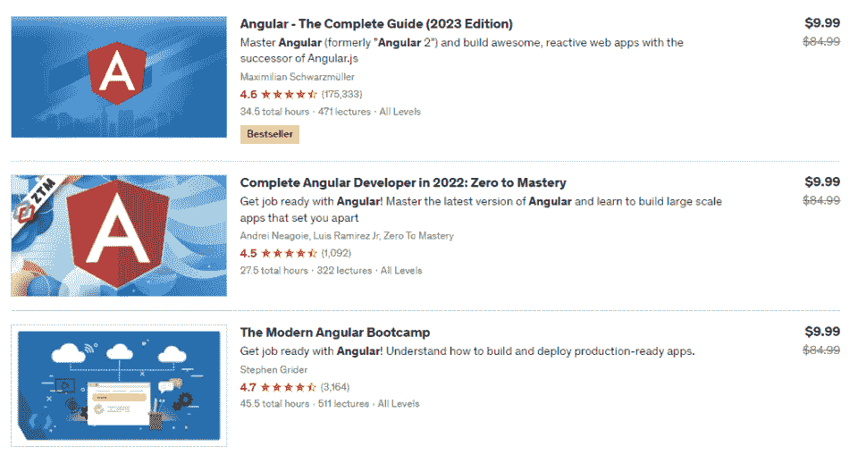

# 下载 2023 年角度备忘单 PDF 更新]

> 原文：<https://hackr.io/blog/angular-cheat-sheet>

开源的 Angular 框架有一个模块化的架构，并带有可重用的 UI 组件——非常适合构建大规模的应用程序。Angular 基于 [TypeScript](https://hackr.io/blog/typescript-vs-javascript) ，一种深受 JavaScipt 影响的编程语言。此外，Angular 利用了一种名为 Ivy 的新技术，这是 Angular 编译和渲染管道的代号。

由于 [Angular](https://hackr.io/blog/why-should-you-learn-angular) 是使用最广泛的框架之一，许多技术专业人士研究它以获得稳定的工作机会。但是你不可能把所有的角度方法和命令都背下来。这就是这个方便的角度小抄的用武之地！

准备好深入 Angular 语法并轻松完成下一个 Angular 项目了吗？使用这个更新的 Angular 4 备忘单来补充你的 web 开发职业。

点击下载完整的角度备忘单 PDF **[。](https://drive.google.com/file/d/1VTqMQBoBDoJ2Az1k6ehyXQwp_3QMtMFC/view?usp=sharing)**

## **棱角分明的小抄**

在我们开始之前，让我们简单地接触一下 Angular JS。背景将帮助你理解在你的工作中使用 Angular 框架背后的更大的目的。

### **什么是 Angular JS？**

谷歌开发了 AngularJS，这是一个 Javascript 框架，帮助开发人员创建完全扩展的单页面 web 应用程序。术语“单页”是指网页需要更新。

单个网页由多个移动部件及其组织结构组成，包括导航栏、页脚、侧边栏等等。为了将这些组件注入到同一个网页中，我们使用 AngularJS。

底线？AngularJS 使网页动态化。AngularJS 不会在用户导航到 URL 时刷新页面，而是将所需的组件注入到同一个页面中。它基本上重用了不变的组件，减少了加载时间，提供了更好的浏览体验。

现在，让我们进入一些角度命令。

### **Angular CLI 备忘单**

Angular 命令行界面(CLI)是一组命令，可帮助您直接从命令外壳初始化、开发和维护高度可扩展和快速的 Angular 应用程序。

在这个 Angular CLI 命令备忘单部分，我们将介绍各种 Angular CI 命令。

#### **1。设置**

以下命令全局安装 Angular CLI:

```
npm install -g @angular/cli
```

#### **2。新应用程序**

以下命令将前缀设置为“best:”

```
ng new best-practises --prefix best
```

该命令检查可用的命令列表。

```
ng new --help
```

该命令模拟“ng new”命令:

```
ng new best-practises --dry-run
```

#### **3。用于格式化的线头**

Lint 命令修复代码气味并纠正不正确的格式。

```
ng lint my-app --fix
```

下一个命令显示警告:

```
ng lint my-app
```

如果想格式化代码，可以使用下面的命令。

```
ng lint my-app --format stylish
```

接下来，该命令验证可访问的命令列表。

```
ng lint my-app --help
```

#### **4。蓝图**

生成规格:

```
--spec
```

检查模板是否为. ts 文件:

```
--inline-template (-t)
```

检查样式是否在. ts 文件中:

```
--inline-style (-s)
```

创建指令:

```
ng g d directive-name
```

创建管道:

```
ng g p init-caps
```

在模型文件夹中创建客户类:

```
ng g cl models/customer
```

无需创建新文件夹即可创建组件。

```
ng g c my-component --flat true
```

分配前缀:

```
--prefix
```

在模型文件夹中创建一个界面:

```
ng g i models/person
```

在模型文件夹中创建枚举性别:

```
ng g e models/gender
```

创建服务:

```
ng g s service-name
```

#### **5。建筑服务**

构建应用程序至/分发文件夹:

```
ng build
```

不使用不必要的代码优化和构建应用程序:

```
ng build --aot
```

为生产创建一个版本:

```
ng build --prod
```

打开浏览器指定服务:

```
ng serve -o
```

发生更改时重新加载:

```
ng serve --live-reload
```

使用 SSL 提供服务:

```
ng serve -ssl
```

#### **推荐课程**

[****](https://click.linksynergy.com/deeplink?id=jU79Zysihs4&mid=39197&murl=https%3A%2F%2Fwww.udemy.com%2Fcourses%2Fsearch%2F%3Fsrc%3Dukw%26q%3Dangular)

#### **6。添加新功能**

将有角度的材料添加到项目中:

```
ng add @angular/material
```

创建材料导航组件:

```
ng g @angular/material:material-nav --name nav
```

### **组件和模板**

组件是最基本的 UI 构件。一棵 Angular 组件树组成一个 Angular app。

#### **样本组件 ts 文件**

```
import { Component } from '@angular/core';

@Component({

// component attributes

selector: 'app-root',

templateUrl: './app.component.html',

styleUrls: ['./app.component.less']

})

export class AppComponent {

title = 'Hello World';

}
```

#### **组件属性**

**变化检测**

用于此组件的更改检测策略。

**viewProviders**

定义对其视图 DOM 子对象可见的可注入对象集。

**模块 Id**

包含组件的模块的模块 ID。

**封装**

模板和 CSS 样式的封装策略。

**插值**

覆盖默认的封装开始和结束分隔符({{和})。

**入口组件**

应与该组件一起编译的一组组件。

**保留白色空间**

True 表示保留，false 表示从编译后的模板中删除可能多余的空白字符。

#### **组件生命周期**

**ngOnInit**

在第一次 ngOnChanges()之后调用一次

**ngOnChanges**

在 ngOnInit()之前以及每当其中一个输入属性发生更改时调用。

**ngOnDestroy**

在 Angular 销毁指令/组件之前调用。

**ngDoCheck**

在每次更改检测运行期间调用。

**ngAfterContentChecked**

在 ngAfterContentInit()和每个后续的 ngDoCheck()之后调用

**ngAfterViewChecked**

在 ngAfterViewInit()和每个后续的 ngAfterContentChecked()之后调用。

**ngAfterContentInit**

在第一个 ngDoCheck()之后调用一次。

**ngaafterviewinit**

在第一个 ngAfterContentChecked()之后调用一次。

#### **模板语法**

```
{{user.name}}
```

插值-生成用户名。

```

```

属性绑定-将用户的图像 url 绑定到 src 属性

```
<button (click)="do()" ... />
```

事件-分配点击事件的功能

```
<button *ngIf="user.showSth" ... />
```

当 user.showSth 为真时显示按钮

```
*ngFor="let item of items"
```

遍历项目列表

```
<div [ngClass]="{green: isTrue(), bold: itTrue()}"/>
```

角度 ngClass 属性

```
<div [ngStyle]="{'color': isTrue() ? '#bbb' : '#ccc'}"/>
```

角度 ngStyle 属性

#### **输入和输出**

Input()将值传递给子组件

子组件实现示例:

```
export class SampleComponent {

@Input() value: any/string/object/…;

...

}
```

父组件用法示例:

```
<app-sample-component [value]="myValue"></app-sampe-component>

Output() Emitting event to parent component

Sample child component:

@Output() myEvent: EventEmitter = new EventEmitter();

onRemoved(item: MyModel) {

this.myEvent.emit(item);

}
```

示例父组件:

```
<app-my-component 

(myEvent)="someFunction()"></app-my-component>
```

子组件中的 **onRemoved** 正在调用父组件中的 **someFunction()** 方法，正如我们在上面两个子组件和父组件中看到的。

#### **内容投影**

Angular 中的内容投影是一种模式，在这种模式中，您将所需的内容注入到特定的组件中。

以下是父组件模板的示例:

```
<component>

<div>

(some html here)

</div>

</component>
```

子组件模板:

```
<ng-content></ng-content>
```

现在让我们在父组件模板中注入以下 HTML 代码:

```
<div well-body>

(some html here)

</div>
```

它看起来会像:

```
<component>

<div well-title>

(some html here)

</div>

<div well-body>

(some html here)

</div>

</component>
```

当我们组合上述父模板和子模板时，您会得到以下结果:

```
<component>

<div well-title>

(some html here)

</div>

<div well-body>

(some html here)

</div>

</component>

<ng-content select="title"></ng-content> 

<ng-content select="body"></ng-content>
```

#### **ViewChild Decorator**

提供对子组件/指令/元素的访问:

```
@ViewChild(NumberComponent)

private numberComponent: NumberComponent;

increase() {

this.numberComponent.increaseByOne(); //method from child component

}

decrease() {

this.numberComponent.decreaseByOne(); //method from child component

}
```

元素的示例:html:

```
<div #myElement></div>
```

组件:

```
@ViewChild('myElement') myElement: ElementRef
```

相反，ElementRef 可用于特定元素，如 FormControl for forms。

对 html 中元素的引用:

```
<button (click)="doSth(myElement)"></button>
```

### **路由**

当用户执行应用任务时，角度路由器能够从一个视图导航到下一个视图。

示例路由 ts 文件:

```
const appRoutes: Routes = [

{ path: 'crisis-center', component: CrisisListComponent },

{ path: 'prod/:id', component: HeroDetailComponent },

{

path: 'products',

component: ProductListComponent,

data: { title: 'Products List' }

},

{ path: '',

redirectTo: '/products',

pathMatch: 'full'

},

{ path: '**', component: PageNotFoundComponent }

];
```

然后，应该将它添加到 Angular.module 导入中:

```
RouterModule.forRoot(appRoutes)
```

您还可以通过添加 enableTracing 来打开路由的控制台跟踪:

```
imports: [

RouterModule.forRoot(

routes,

{enableTracing: true}

)

],
```

使用

```
<a routerLink="/crisis-center" routerLinkActive="active">Crisis Center</a>
```

当链接的路由变为活动时，routerLinkActive="active "将向元素添加活动类

```
//Navigate from code
this.router.navigate(['/heroes']);

// with parameters

this.router.navigate(['/heroes', { id: heroId, foo: 'foo' }]);

// Receive parameters without Observable
let id=this.route.snapshot.paramMap.get('id');
```

#### **可以激活和取消激活**

在角度路由中，两个路由保护可以激活和禁用。前者决定路由是否可以被当前用户激活，后者决定路由器是否可以被当前用户去激活。

**可以激活:**

```
class UserToken {}

class Permissions {

canActivate(user: UserToken, id: string): boolean {

return true;

}

}
```

**可以激活:**

```
class UserToken {}

class Permissions {

canDeactivate(user: UserToken, id: string): boolean {

return true;

}

}
```

### **模块**

Angular 应用程序是模块化的，Angular 有自己的模块化系统，称为 NgModules。NgModules 是专用于应用程序域、工作流或一组密切相关的功能的内聚代码块的容器。

```
import { BrowserModule } from '@angular/platform-browser';

import { NgModule } from '@angular/core';

import { AppRoutingModule } from './app-routing.module';

import { AppComponent } from './app.component';

@NgModule({

declarations: [AppComponent], // components, pipes, directives

imports: [BrowserModule, AppRoutingModule], // other modules

providers: [], // services

bootstrap: [AppComponent] // top component

})

export class AppModule { }
```

### **服务**

组件不应该直接获取或保存数据，当然也不应该故意呈现虚假数据。相反，他们应该专注于呈现数据，并将数据访问委托给服务。

具有一个功能的示例服务:

```
@Injectable()

export class MyService {

public items: Item[];

constructor() { }

getSth() {

// some implementation

}

}
```

当您创建组件类的任何新实例时，Angular 通过查看构造函数中定义的参数来确定该组件所需的服务和其他依赖项，如下所示:

```
constructor(private dogListService: MyService){ }
```

上面的构造函数需要服务:MyService

在 providers 模块中注册 MyService:

```
providers: [MyService]
```

#### **http 客户端**

这个命令处理和使用 http 请求。

将导入添加到模块:

```
import { HttpClientModule} from "@angular/common/http";
```

您可以按以下方式使用上述语句:

```
import {HttpClient} from '@angular/common/http';

...

// GET

public getData(): Observable {

return this.http.get('api/users/2');

}

// POST

public send(val1: any, val2: any): Observable {

const object = new SendModel(val1, val2);

const options = {headers: new HttpHeaders({'Content-type': 'application/json'})};

return this.http.post(environment.apiUrl + 'api/login', object, options);

}
```

#### **依赖注入**

这将一个类注入另一个类:

```
@Injectable({

providedIn: 'root',

})

export class SomeService {}
```

它接受“root”作为一个值或应用程序的任何模块。

#### **声明全局值**

类别:

```
import {InjectionToken} from '@angular/core';

export const CONTROLS_GLOBAL_CONFIG = new InjectionToken('global-values');

export interface ControlsConfig {firstGlobalValue: string;}
```

模块:

```
providers: [{provide: CONTROLS_GLOBAL_CONFIG, useValue: {firstGlobalValue : 'Some value' }},
```

用法(例如在组件中):

```
constructor(@Optional() @Inject(CONTROLS_GLOBAL_CONFIG) globalVlues: ControlsConfig) {
```

### **管道**

管道将数据和值转换为特定的格式。例如:

以短日期格式显示日期:

```
{{model.birthsDay | date:'shortDate'}}
```

管道实施:

```
@Pipe({name: 'uselessPipe'})

export class uselessPipe implements PipeTransform {

transform(value: string, before: string, after: string): string {

let newStr = `${before} ${value} ${after}`;

return newStr;

}

}
```

用法:

```
{{ user.name | uselessPipe:"Mr.":"the great" }}
```

### **指令**

属性指令改变 DOM 元素的外观或行为。例如，[ngStyle]就是一个指令。

自定义指令:

```
import { Directive, ElementRef, HostListener, Input } from '@angular/core';

@Directive({

selector: '[appHighlight]'

})

export class HighlightDirective {

constructor(private el: ElementRef) { }

@Input('appHighlight') highlightColor: string;

@Input('otherPar') otherPar: any; //it will be taken from other attribute named [otherPar]

@HostListener('mouseenter') onMouseEnter() {

this.highlight(this.highlightColor || 'red');

}

private highlight(color: string) {

this.el.nativeElement.style.backgroundColor = color;

}
}
```

用法:

```
<p [appHighlight]="color" [otherPar]="someValue">Highlight me!</p>
```

### **动画**

动画允许您在将 BrowserModule 和 BrowserAnimationsModule 添加到模块之前从一种样式状态移动到另一种样式状态。

实施:

```
animations: [

trigger('openClose', [

state('open', style({

height: '400px',

opacity: 1.5,

})),

state('closed', style({

height: '100px',

opacity: 0.5,

})),

transition('open => closed', [

animate('1s')

]),

transition('closed => open', [

animate('1s')

])

])

]
```

用法:

```
<div [@openClose]="isShowed ? 'open' : 'closed'">
```

### **角形**

在 Angular 4 备忘单的这一部分，我们将讨论不同类型的角形。

#### **模板驱动表单**

表单逻辑(验证、属性)保存在模板中。

html 示例

```
<form name="form" (ngSubmit)="f.form.valid && onSubmit()" #f="ngForm" novalidate>

<div class="form-group">

<label for="firstName">First Name</label>

<input type="text" class="form-control" name="firstName" [(ngModel)]="model.firstName" #firstName="ngModel" [ngClass]="{ 'is-invalid': f.submitted && firstName.invalid }" required />

<div *ngIf="f.submitted && firstName.invalid" class="invalid-feedback">

<div *ngIf="firstName.errors.required">First Name is required</div>

</div>

</div>

<div class="form-group">

<button class="btn btn-primary">Register</button>

</div>

</form>
```

样本组件:

```
@ViewChild("f") form: any;

firstName: string = "";

langs: string[] = ["English", "French", "German"];

onSubmit() {

if (this.form.valid) {

console.log("Form Submitted!");

this.form.reset();

}

}
```

#### **反应形式**

表单逻辑(验证、属性)保存在*组件中。*

示例 HTML:

```
<form [formGroup]="registerForm" (ngSubmit)="onSubmit()">

<div class="form-group">

<label>Email</label>

<input type="text" formControlName="email" class="form-control" [ngClass]="{ 'is-invalid': submitted && f.email.errors }" />

<div *ngIf="submitted && f.email.errors" class="invalid-feedback">

<div *ngIf="f.email.errors.required">Email is required</div>

<div *ngIf="f.email.errors.email">Email must be a valid email address</div>

</div>

</div>

<div class="form-group">

<button [disabled]="loading" class="btn btn-primary">Register</button>

</div>

 </form>
```

样本组件:

```
registerForm: FormGroup;

submitted = false;

constructor(private formBuilder: FormBuilder) { }

ngOnInit() {

this.registerForm = this.formBuilder.group({

firstName: [{{here default value}}, Validators.required],

lastName: ['', Validators.required],

email: ['', [Validators.required, Validators.email]],

password: ['', [Validators.required, Validators.minLength(6)]]

});

}

// convenience getter for easy access to form fields

get f() { return this.registerForm.controls; }

 onSubmit() {

this.submitted = true;

// stop here if form is invalid

if (this.registerForm.invalid) {

return;

}

alert('SUCCESS!! :-)')

}
```

#### **反应式表单的自定义验证器**

功能:

```
validateUrl(control: AbstractControl) {

if (!control.value || control.value.includes('.png') || control.value.includes('.jpg')) {

return null;

}

return { validUrl: true };

}
```

用法:

```
this.secondFormGroup = this._formBuilder.group({

imageCtrl: ['', [Validators.required, this.validateUrl]]

});
```

多字段验证:

```
validateNameShire(group: FormGroup) {

if (group) {

if (group.get('isShireCtrl').value && !group.get('nameCtrl').value.toString().toLowerCase().includes('shire')) {

return { nameShire : true };

}

}

return null;

 }
```

多字段验证用法:*

```
this.firstFormGroup.setValidators(this.validateNameShire);
```

错误处理:

```
<div *ngIf="firstFormGroup.controls.nameCtrl.errors.maxlength">Name is too long</div>

<div *ngIf="firstFormGroup.errors.nameShire">Shire dogs should have "shire" in name</div>
```

#### **模板驱动表单的自定义验证器指令**

简而言之，我们将介绍如何向 NG_VALIDATORS 服务注册我们的自定义验证指令。由于多参数，我们不会覆盖 NG_VALIDATORS，而只是将 CustomValidator 添加到 NG_VALIDATORS 中。

这是你用的:

```
@Directive({

selector: '[CustomValidator]',

providers: [{provide: NG_VALIDATORS, useExisting: CustomValidator, multi:true}]

})
```

示例:

```
@Directive({

selector: '[customValidation]',

providers: [{provide: NG_VALIDATORS, useExisting: EmailValidationDirective, multi: true}]

})

export class CustomValidation implements Validator {

constructor() { }

validate(control: AbstractControl): ValidationErrors {

return (control.value && control.value.length <= 300) ? 

{myValue : true } : null;

}

}

For multiple fields:

validate(formGroup: FormGroup): ValidationErrors {

const passwordControl = formGroup.controls["password"];

const emailControl = formGroup.controls["login"];

if (!passwordControl || !emailControl || !passwordControl.value || !emailControl.value) {

return null;

}

if (passwordControl.value.length > emailControl.value.length) {

passwordControl.setErrors({ tooLong: true });

} else {

passwordControl.setErrors(null);

}

return formGroup;

}
```

#### **自定义组件中的 ng model**

添加到模块:

```
providers: [

{

provide: NG_VALUE_ACCESSOR,

useExisting: forwardRef(() => TextAreaComponent),

multi: true

}

]

Implement ControlValueAccessor interface

interface ControlValueAccessor {

writeValue(obj: any): void

registerOnChange(fn: any): void

registerOnTouched(fn: any): void

setDisabledState(isDisabled: boolean)?: void

}
```

寄存器交换

注册一个函数，告知 Angular 输入值何时改变。

**注册户口〔t1〕**

注册一个函数，告诉 Angular 值何时被触摸。

**写值**

告诉 Angular 如何将值写入输入。

示例实现:

```
@Component({

selector: 'app-text-area',

templateUrl: './text-area.component.html',

styleUrls: ['./text-area.component.less'],

providers: [

{

provide: NG_VALUE_ACCESSOR,

useExisting: forwardRef(() => TextAreaComponent),

multi: true

}

]

})

export class TextAreaComponent implements ControlValueAccessor, OnInit {

@Input() value: string;

private _onChange = (data: any) => { console.log('changed: ' + data); };

private _onTouched = (data?: any) => {console.log('touched: ' + data); };

ngOnInit(): void {

const self = this;

}

constructor() {}

writeValue(obj: any): void {

this.value = obj;

}

registerOnChange(fn) {

this._onChange = fn;

}

registerOnTouched(fn: any): void {

this._onTouched = fn;

}

}
```

### **测试**

开发中的每个软件应用程序都需要测试以验证其正确性，Angular 应用程序也是如此。测试意味着对应用程序执行各种测试或测试用例，以验证其功能和正确性。

### 单元测试

一般来说，单元测试是一种软件测试级别，它分别检查应用程序的各个组件。在 Angular 中，默认的单元测试框架是 Jasmine。在使用 CLI 开发 Angular 项目时，它被广泛使用。

服务:

```
describe('MyService', () => {

let service: MyService;

beforeEach(() => service = new MyService();

it('#fetch should update data', () => {

service.fetchData();

expect(service.data.length).toBe(4);

expect(service.data[0].id).toBe(1);

});

});
```

对于异步功能:

```
it('#fetch should update data', (done: DoneFn) => {

// some code

done(); // we need 'done' to avoid test finishing before date was received

// some code

});
```

异步测试示例:

```
it('http client works', (done: DoneFn) => {

service.getUser().subscribe((data) => {

expect(data).toBe('test');

done();

});

 });
```

### 间谍和存根

当您在测试过程中进行呼叫时，存根会提供所有这些呼叫的固定答案。它不响应被测程序之外的任何东西。

spy 是一个存根，它根据您在测试期间拨打的电话记录信息。

**间谍:**

```
// create spied object by copy getDataAsync from HttpService

const valueServiceSpy =

jasmine.createSpyObj('HttpService', ['getDataAsync']);
```

**存根:**

```
const stubValue = of('StubValue');

valueServiceSpy.getDataAsync.and.returnValue(stubValue);
```

单元测试的试验台模拟整个模块/环境:

```
beforeEach(() => {

let httpClientMock = TestBed.configureTestingModule({ providers: [{ provide: MyService, useValue: new MyService(httpClientMock)}] });

});
```

然后像这样使用测试对象(例如服务):

```
service = TestBed.get(MyService);
```

我们可以添加模式:[NO_ERRORS_SCHEMA]。这意味着我们不必模仿这个组件的子组件依赖，因为 Angular 不会因为我们不包含它们而大喊大叫！

### **杂项**

### Http 拦截器

HTTP 拦截器可以处理任何给定的 HTTP 请求。

类别:

```
@Injectable()

export class MyInterceptor implements HttpInterceptor {

constructor() { }

intercept(request: HttpRequest, next: HttpHandler): Observable> {

// do sth (like check and throw error)

return next.handle(request); //if want continue

}

}
```

参数:

1.  req:http request<any>——它是处理传出请求的对象。</any>
2.  下一个:HttpHandler——它表示行中的下一个拦截器，或者在没有拦截器的情况下表示后端。

退货:

HTTP 拦截器返回事件流的可观察对象。

可观察的<httpevent>></httpevent>

## **结论**

这里我们已经到了角度备忘单的末尾。我们讨论了各种领域，如表单、管道、指令、路由等。以及它们的用法和例子。

Web 开发工作大部分时间都很漫长，所以快速参考 Angular 命令和语法大有帮助。

有兴趣查找更多参考资料以加快您的工作吗？尝试另一个备忘单！

[探索 JavaScript 备忘单](https://hackr.io/blog/javascript-cheat-sheet)

## **常见问题解答**

#### **1。什么是有棱角的小抄？**

Angular cheat sheet 是一套简短的笔记，涵盖了从管道到指令的所有 Angular 主题，可以方便地快速参考。

#### **2。Angular 中的分量是什么？**

角度组件是任何角度应用的最基本构件。

#### **3。Angular 中的问号是什么？**

角形问号指的是“安全导航操作员”它确保当我们试图访问一个对象的属性时，在角度应用程序中没有空值或未定义的值。

#### **4。Angular 中的 Ng 是什么？**

在 Angular 中，“ng”是 Angular 附带的所有内置指令的前缀。