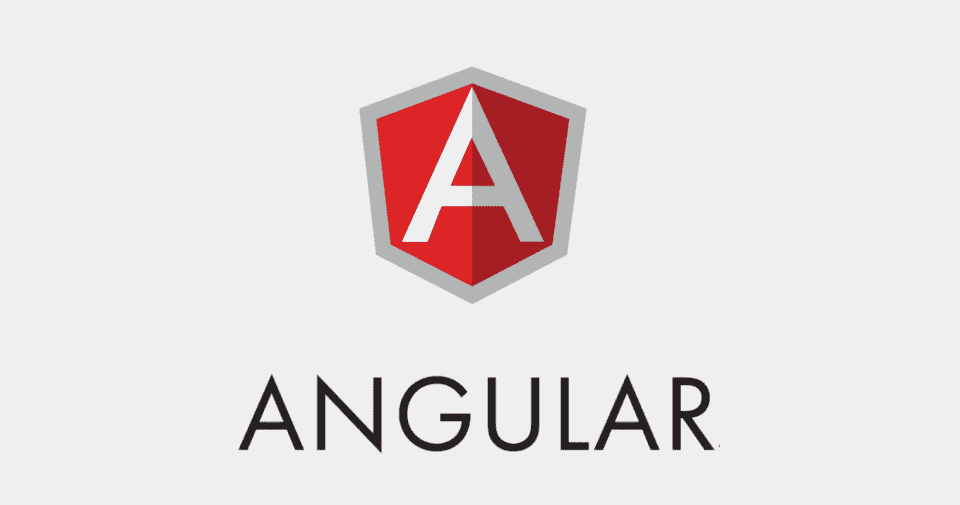
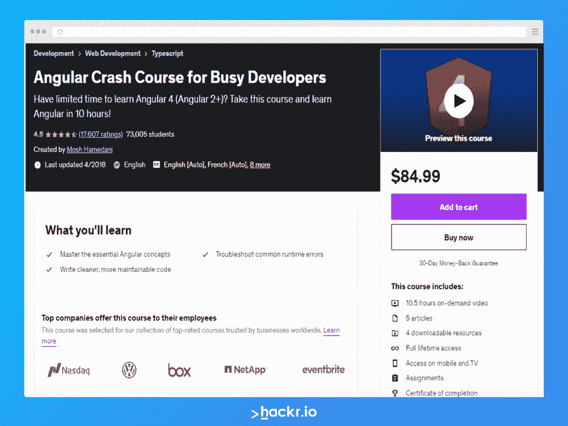
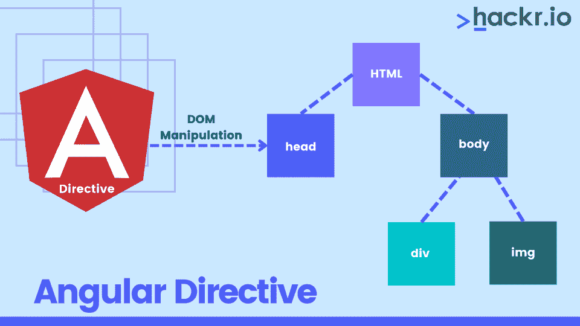
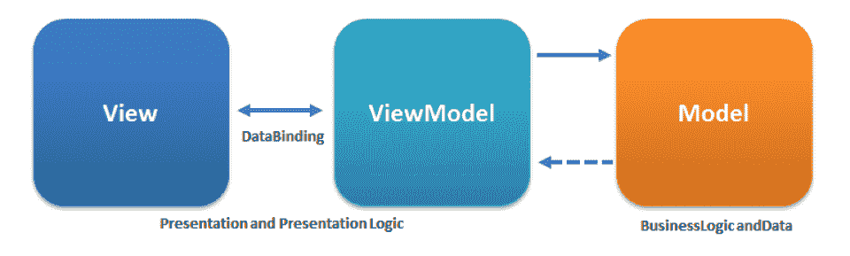
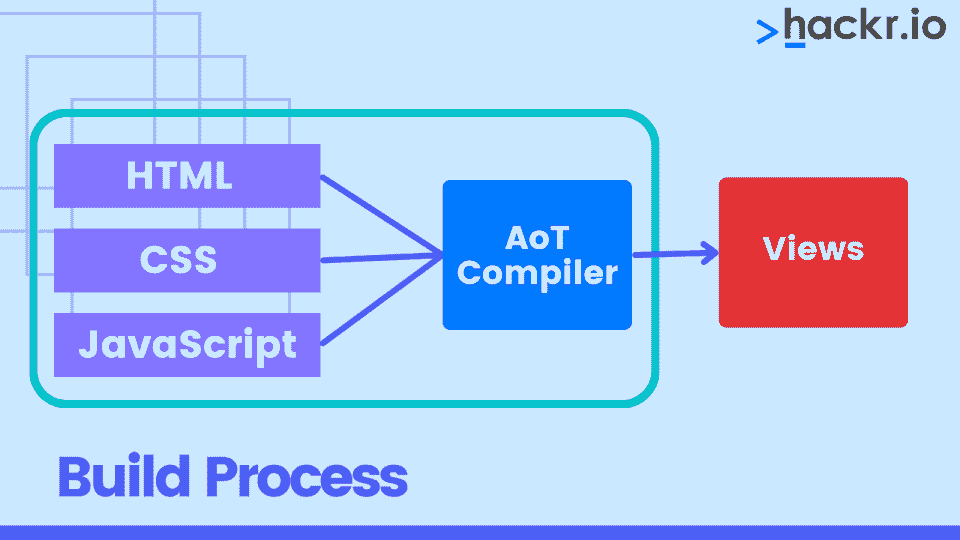
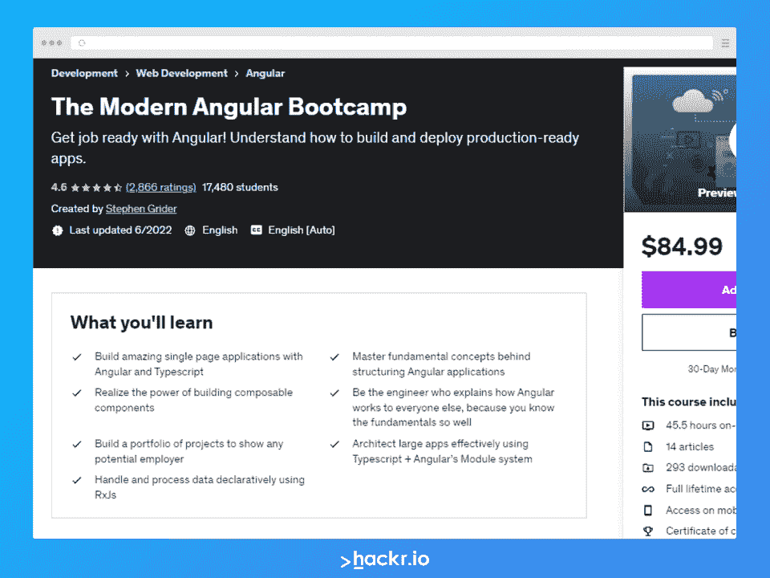

# 2023 年热门角度面试问答[更新]

> 原文：<https://hackr.io/blog/angular-interview-questions>

如果你打算成为一名 Angular 开发者，你必须在面试中胜出。如果你想在面试中胜出，你必须彻底理解基本和高级的角度概念。在这篇文章中，我们将看看你在面试中可能会遇到的尖锐问题。

记住，除了理论问题，还会问一些编码问题。我们在这里列出了一些基本的和高级的角度面试问题，这会给你面试打下坚实的基础。

## **顶角面试问答**

首先，我们涵盖基本的角度面试问题。之后，我们切换到更高级的问题。Angular 上的这些面试问题应该给你准备面试的理论知识，但当然你也希望其中一些得到一些编码实践。

### **基本角度面试问题**

#### **1。什么是有角？**

****

Angular 是一个基于 TypeScript 的[开源 web 应用框架](https://hackr.io/blog/web-development-frameworks)，由 Google 开发和维护。它提供了一种简单而强大的方式来构建基于 web 的前端应用程序。

Angular 集成了一系列特性，如声明性模板、依赖注入和端到端工具，这些特性促进了 web 应用程序的开发。

#### **2。为什么 Angular 被作为客户端框架引入？**

传统上，开发人员使用 VanillaJS 和 jQuery 来开发动态网站。随着网站变得越来越复杂，增加了新的特性和功能，开发人员发现维护代码变得越来越困难。此外，jQuery 没有提供跨视图的数据处理工具。

Angular 就是为了解决这些问题而构建的，通过将代码分成更小的信息片段(在 Angular 中称为组件),使开发人员更容易理解。客户端框架允许开发像 SPAs 这样的高级 web 应用程序，如果由 VanillaJS 开发，这个过程会比较慢。

#### **3。Angular 有哪些特点？**

Angular 有几个特性使它成为一个理想的前端 JavaScript 框架。其中一些最重要的是:

*   **可访问性应用:** Angular 允许使用支持 ARIA 的组件、内置的 a11y 测试基础设施和开发人员指南来创建可访问性应用。

*   Angular CLI: Angular 提供对命令行界面工具的支持。这些工具可用于添加组件、测试和即时部署等。

*   **动画支持:** Angular 的直观 API 允许用很少的代码创建高性能、复杂的动画时间线。

*   **跨平台应用开发:** Angular 可用于构建桌面、原生、渐进式 web 应用。它为使用 Cordova、Ionic 或 NativeScript 构建原生[应用程序开发](https://hackr.io/blog/how-to-become-a-mobile-app-developer)提供支持。它还可以用于构建 Linux、macOS 和 Windows 的桌面应用程序。

*   **代码生成:** Angular 能够将模板转换成高度优化的代码，用于现代 JavaScript 虚拟机。

*   **代码分割:**组件路由器提供自动代码分割，以便只加载呈现用户请求的视图所需的代码。

*   **与流行的代码编辑器和 ide 的协同作用:** Angular 通过流行的源代码编辑器和 ide 提供代码完成和即时错误检测。

*   **模板:**允许用简单而强大的模板语法创建 UI 视图。

*   **测试:** Angular 允许您使用 Karma 进行频繁的单元测试。量角器允许在稳定的情况下更快地运行场景测试。

### 推荐的角度航向

[](https://click.linksynergy.com/deeplink?id=Qouy7GhEEFU&mid=39197&murl=https://www.udemy.com/course/angular-crash-course/)

#### **4。陈述 Angular 相对于其他框架的一些优势。**

Angular 相对于其他框架的一些优势是:

*   **开箱即用特性:**路由、状态管理、rxjs 库和 HTTP 服务等几个内置特性从一开始就可用。
*   **声明式 UI:** Angular 使用 HTML 来呈现应用程序的 UI，因为它是一种声明式语言，这比使用 JavaScript 要容易得多。
*   谷歌的长期支持:谷歌计划坚持 Angular，并进一步扩大其生态系统，因为它为该框架提供了长期支持。

#### **5。AngularJS 和 Angular js 有什么区别？**

AngularJS 和 Angular js 之间的差异如下:

*   **架构:** AngularJS 支持 MVC 设计模式。Angular 依赖于组件和指令。
*   **依赖注入(DI):** Angular 支持带有单向基于树的变化检测的分层依赖注入。AngularJS 不支持 DI。
*   **表达式语法:**在 AngularJS 中，图像或属性以及事件需要特定的 ng 指令。另一方面，Angular 使用()和[]分别隐藏事件和完成属性绑定。
*   **移动支援:** AngularJS 没有移动支援，Angular 有。
*   **推荐语言:**虽然 JavaScript 是 AngularJS 的推荐语言，但 TypeScript 是 Angular 的推荐语言。
*   **路由:**对于路由，AngularJS 使用$routeprovider.when()而 Angular 使用@RouteConfig{(…)}
*   **速度:**由于 AngularJS 支持双向数据绑定，开发工作量和时间显著减少。尽管如此，由于升级的功能，Angular 速度更快。
*   **结构:**Angular 通过简化的结构，让大型应用的开发和维护变得更加容易。相比之下，AngularJS 的结构不太容易管理。
*   **支持:【AngularJS 没有官方支持或更新。相反，Angular 积极支持不时推出的更新。**

#### **6。我们可以在服务器端渲染一个 Angular 应用程序吗？**

是的，我们可以，有角宇宙。使用角度通用的好处是:

*   **更好的用户体验:**允许用户即时看到应用程序的视图。
*   更好的 SEO: Universal 确保内容在每个搜索引擎上都可用，从而带来更好的 [SEO](https://hackr.io/blog/what-is-seo) 。
*   **加载更快:**浏览器可以更快地获得渲染页面，因此服务器端应用程序加载更快。

#### **7。解释依赖注入。**

依赖注入是一种应用程序设计模式，由 Angular 实现，构成了 Angular 的核心概念。

Angular 中的依赖是简单地具有一些功能的服务。应用程序中的组件和指令可能需要这些功能。Angular 提供了一种平滑的机制，通过这种机制，这些依赖关系被注入到组件和指令中。

#### **8。Angular 中的服务是什么？**

Angular 中在应用程序的生命周期中只实例化一次的单例对象被称为服务。角度服务包含在应用程序的整个生命周期中维护数据的方法。

Angular 服务的主要目的是组织并与 Angular 应用程序的各种组件共享业务逻辑、模型或数据和功能。

角度服务提供的功能可以从任何角度组件调用，比如控制器或指令。

#### **9。使用 Angular 有什么好处和坏处？**

下表解释了角度的优点和缺点:

| **优势** | **缺点** |
| 可以添加自定义指令 | 复杂的矿泉疗养地由于它们的规模，使用起来会不方便和滞后 |
| 卓越的社区支持 | 动态应用程序并不总是表现良好 |
| 遵循 MVC 模式架构 | [学习角度](https://hackr.io/blog/how-to-learn-angular)需要时间和努力 |
| 支持静态模板和角度模板 |   |
| 支持双向数据绑定 |   |
| 支持依赖注入、RESTful 服务和验证 |   |

#### 10。Angular 7 有哪些特点？

与之前的 Angular 版本不同，第 7 个主要版本对@angular/core 进行了拆分。这样做是为了减小尺寸。不是每个模块都是 Angular 开发者所需要的。因此，在 Angular 7 中,@angular/core 的每个拆分不会超过 418 个模块。

Angular 7 具有拖放和虚拟滚动功能。最后，它还有一个新的增强版本的 ng 编译器。

#### **11。什么是角度中的字符串插值？**

也称为 mustache 语法，Angular 中的字符串插值是指一种特殊类型的语法，它利用模板表达式来显示元件数据。这些模板表达式用双花括号括起来，即{{ }}。

由 Angular 执行的 JavaScript 表达式被添加到花括号中，相应的输出被嵌入到 HTML 代码中。通常，这些表达式像手表一样作为摘要循环的一部分被更新和注册。

#### **12。解释角度认证和授权。**

用户登录凭证被传递给服务器上的经过身份验证的 API。在凭证的服务器端验证之后，会返回一个 JWT (JSON Web Token)。JWT 具有关于当前用户的信息或属性。然后用给定的 JWT 识别用户。这就是所谓的认证。

登录成功后，不同的用户有不同的访问权限。虽然有些人可以访问所有内容，但其他人的访问可能仅限于某些资源。访问级别是授权。

#### 13。如何在 Angular 7 中使用 CLI 生成类？

```
ng generate classDummy [options]
```

这将生成一个名为 Dummy 的类。

#### **14。解释一下 Angular 和 Backbone.js 的区别？**

以下是 Angular 和 Backbone.js 的区别

*   **架构:** Backbone.js 利用 MVP 架构，不提供任何数据绑定过程。Angular 在 MVC 架构上工作，并利用双向数据绑定来驱动应用程序活动。

*   **社区支持:**得到 Google 的支持，大大提升了 Angular 框架获得的社区支持。还提供了大量文档。尽管 Backbone.js 有一些社区支持，但它只记录了下划线. js 模板，没有其他的。

*   **数据绑定:** Angular 使用双向数据绑定过程，因此有点复杂。Backbone.js 没有任何数据绑定过程，因此有一个简单的 API。

*   **DOM:**Angular JS 的主要焦点是有效的 HTML 和动态元素，它们模拟底层数据，按照指定的规则重建 DOM，然后处理更新的数据记录。Backbone.js 遵循直接 DOM 操作方法来表示数据和应用程序架构的变化。

*   **性能:**得益于其双向数据绑定功能，Angular 为小型和大型项目提供了有效的性能。在小数据集或小网页中，Backbone.js 在性能上明显优于 Angular。

*   **模板化:** Angular 支持通过动态 HTML 属性进行模板化。这些被添加到文档中，以便在功能级别开发一个易于理解的应用程序。与 Angular 不同，Backbone.js 使用的[下划线. js](https://en.wikipedia.org/wiki/Underscore.js) 模板并不完全具备 Angular 模板的特性。

*   测试方法:【Angular 和 Backbone.js 的测试方法差别很大，因为前者更适合构建大型应用程序，而后者更适合开发较小的网页或应用程序。对于 Angular，单元测试是首选的，通过框架测试过程更顺畅。在 Backbone.js 的例子中，数据绑定过程的缺失允许对单个页面和小型应用程序进行快速测试。
*   **类型:** Angular 是一个开源的基于 JS 的前端 web 应用框架，用新的属性扩展了 [HTML](https://hackr.io/tutorials/learn-html-5) 。另一方面，Backbone.js 是一个轻量级的 JavaScript 库，具有 RESTful JSON 接口和 MVP 框架。

#### 15。Angular 中的模板是什么？

用 HTML 编写，Angular 中的模板包含特定于角度的属性和元素。结合来自控制器和模型的信息，模板随后被进一步渲染，以迎合具有动态视图的用户。

#### 16。用 Angular 解释注释和装饰器的区别。

在 Angular 中，注释用于创建注释数组。它们是使用[反射元数据库的类的唯一元数据集。](https://www.npmjs.com/package/reflect-metadata)

Angular 中的 Decorators 是设计模式，用于在不改变原始源代码的情况下，对某个类进行分离修饰或修改。

#### **17。Angular 中的指令是什么？**

****

指令是 Angular 的核心特性之一。它们允许开发人员编写新的特定于应用程序的 HTML 语法。实际上，指令是 Angular 编译器在 DOM 中找到它们时执行的函数。指令有三种类型:

*   属性指令
*   组件指令
*   结构指令

#### 18。Angular 和 jQuery 有什么区别？

#### Angular 和 jQuery 之间最大的区别是前者是一个 JS 前端框架，后者是一个 JS 库。尽管如此，两者之间还是有一些相似之处，比如两者都具有 DOM 操作功能，并且都提供对动画的支持。

尽管如此，Angular 和 jQuery 之间的显著区别是:

Angular 有双向数据绑定，jQuery 没有

*   Angular 提供了对 RESTful API 的支持，而 jQuery 没有
*   jQuery 不提供深度链接路由，尽管 Angular 支持它
*   jQuery 中没有表单验证，而 Angular 中有
*   **19。你能解释一下角度表达式和 JavaScript 表达式的区别吗？**

#### 尽管角度表达式和 JavaScript 表达式都可以包含文字、操作符和变量，但两者之间有一些显著的不同。角度表达式和 JavaScript 表达式之间的重要差异列举如下:

角度表达式支持过滤器，而 JavaScript 表达式不支持。

*   可以在 HTML 标签中编写角度表达式。相反，JavaScript 表达式不能写在 HTML 标签中。
*   JavaScript 表达式支持条件、异常和循环，而 Angular 表达式不支持。
*   20。什么是有角的物质？

#### 它是一个 UI 组件库。 [Angular Material](https://material.angular.io/) 有助于创建有吸引力的、一致的、功能齐全的网页以及网络应用程序。它遵循现代网页设计原则，包括浏览器的可移植性和优雅的降级。

**21。为什么在 Angular 中优先考虑 TypeScript 而不是 JavaScript？**

#### [TypeScript](https://hackr.io/tutorials/learn-typescript) 是 Javascript 的超集，因为它是 Javascript 和额外的特性，如变量类型转换、注释和变量范围等。它是纯面向对象的编程，并提供了一个编译器，可以将其转换成 Javascript 等效代码。

**高级角度面试问题**

### **22。定义 ng-content 指令。**

#### 传统的 HTML 元素在标签之间有一些内容。例如:

现在考虑以下在角度标签之间具有自定义文本的示例:

```
<p>Put your paragraph here</p>
```

然而，这样做并不像 HTML 元素那样有效。为了让它像上面提到的 HTML 例子一样工作，我们需要使用 ng-content 指令。此外，它有助于构建可重用的组件。

```
<app-work>This won’t work like HTML until you use ng-content Directive</app-work>
```

了解更多关于 [ng-content 指令](https://blog.angular-university.io/angular-ng-content/)的信息。

**23。描述一下 MVVM 的建筑。**

#### ****

MVVM 架构消除了每个组件之间的紧密耦合。它有三个部分:

这种架构允许孩子们通过可观察的事物而不是直接与他们的父母交流。

**模型:**它代表应用程序的数据和业务逻辑，或者我们可以说它包含实体的结构。它由业务逻辑组成——本地和远程数据源、模型类和存储库。

*   **视图:**视图是应用程序的可视层，因此由 UI 代码(在组件的 Angular- HTML 模板中)组成。).它将用户动作发送到 ViewModel，但不直接返回响应。它必须订阅 ViewModel 向它公开的 observables 以获得响应。
*   **ViewModel:** 它是应用程序的抽象层，充当视图和模型(业务逻辑)之间的桥梁。它不知道哪个视图必须使用它，因为它没有对视图的直接引用。视图和视图模型通过数据绑定连接，因此视图中的任何变化视图模型都会注意到并改变模型中的数据。它与模型交互，并公开视图可以观察到的可观察对象。
*   **24。演示角度应用程序中不同路线之间的导航。**

#### 以下代码演示了如何在名为“某搜索应用”的 Angular 应用中导航不同的路线:

**25。什么是 AOT(超前)编译？它的优点是什么？**

```
import from "@angular/router";
.
.
.
@Component({
 selector: 'app-header',
 template: `
<nav class="navbar navbar-light bg-faded">
 <a class="navbar-brand" (click)="goHome()">Some Search App</a> 
 <ul class="nav navbar-nav">
   <li class="nav-item">
     <a class="nav-link" (click)="goHome()">Home</a> 
   </li>
   <li class="nav-item">
     <a class="nav-link" (click)="goSearch()">Search</a> 
   </li>
 </ul>
</nav>
`
})
class HeaderComponent {
 constructor(private router: Router) {} 
 goHome() {
   this.router.navigate(['']); 
 }
 goSearch() {
   this.router.navigate(['search']); 
 }
} 
```

#### 

Angular 应用程序由浏览器无法理解的组件和模板组成。因此，每个 Angular 应用程序都需要在浏览器内部运行之前进行编译。Angular 编译器接受 JS 代码，编译它，然后生成一些 JS 代码。它被称为 AOT 编译，每个用户每次只进行一次。

Angular 提供了两种编译方式:

**JIT(Just-in-Time)编译:**应用在运行时在浏览器内部编译。

*   **AOT(提前)编译:**应用程序在构建期间进行编译。
*   **AOT 编译的优势:**

**快速渲染:**浏览器加载可执行代码，并在应用程序编译后立即渲染，然后在浏览器内运行。

*   **更少的 AJAX 请求:**编译器将外部 HTML 和 CSS 文件与应用程序一起发送，消除了对这些源文件的 Ajax 请求。
*   **最小化错误:**在构建阶段易于检测和处理错误。
*   **更好的安全性:**在浏览器内部运行一个应用之前，AOT 编译器在 JS 文件中加入 HTML 和模板，这样就没有多余的 HTML 文件需要读取，从而为应用提供了更好的安全性。
*   **26。解释 Angular 中作用域层次结构的概念。**

#### Angular 将$scope 对象组织成视图通常使用的层次结构。这就是 Angular 中的作用域层次结构。它有一个根作用域，可以进一步包含一个或几个称为子作用域的作用域。

在范围层次结构中，每个视图都有自己的$scope。因此，由一个视图的视图控制器设置的变量将对其他视图控制器保持隐藏。以下是范围层次结构的典型表示:

Root $scope

*   控制器 1 的$范围

*   控制器 2 的$范围
*   …
*   ..
*   。
*   控制器 n 的$scope
*   **27。可观察到的和承诺有什么不同？**

#### 一旦[承诺](http://andyshora.com/promises-angularjs-explained-as-cartoon.html)做出，执行就开始了。然而，可观测量却不是这样，因为它们很懒。这意味着在订阅完成之前什么都不会发生。

虽然承诺处理单个事件，但可观察是一个允许传递多个事件的流。对可观察对象中的每个事件进行回调。

**28。Angular 的积木是什么？**

#### 角度应用程序基本上有 9 个构建模块。这些是:

**组件:**一个组件控制一个或多个视图。每个视图都是屏幕的某个特定部分。组件包含在类中定义的应用程序逻辑。这个类负责通过属性和方法的 API 与视图进行交互。

1.  数据绑定:模板的各个部分与组件的各个部分相协调的机制被称为数据绑定。为了让 Angular 知道如何连接双方(模板及其组件)，在模板 HTML 中添加了绑定标记。
2.  **依赖注入(DI):** Angular 利用依赖注入为新组件提供所需的依赖。通常，组件所需的依赖项是服务。组件的构造函数参数告诉 Angular 组件需要的服务。因此，依赖注入提供了一种方式来提供一个类的新实例所需的完全形式的依赖。
3.  **指令:**Angular 使用的模板本质上是动态的。指令负责指示 Angular 在呈现模板时如何转换 DOM。实际上，组件是带有模板的指令。其他[类型的指令](https://angular.io/guide/attribute-directives)是属性和结构指令。
4.  **元数据:**元数据让 Angular 知道如何处理一个类。
5.  **模块:**也称为 NgModules，模块是具有特定功能集的有组织的代码块。它有特定的应用程序域或工作流。像组件一样，任何角度应用程序都至少有一个模块，称为根模块。
6.  **路由:**Angular 路由器负责将浏览器 URL 解释为导航到客户端生成视图的指令。路由器绑定到页面上的链接，告诉 Angular 当用户点击它时导航应用程序视图。
7.  **服务:**服务是一个非常广泛的类别，可以是从价值和功能到 Angular 应用程序所需的功能。从技术上讲，服务是一个具有明确定义的目的的类。
8.  **模板:**每个组件的视图都与它的伙伴模板相关联。Angular 中的模板是 HTML 标签的一种形式，它让 Angular 知道如何呈现组件。
9.  通过这个训练营更快地学习 Angular

### [](https://click.linksynergy.com/deeplink?id=Qouy7GhEEFU&mid=39197&murl=https://www.udemy.com/course/the-modern-angular-bootcamp/)

**29。什么是数据绑定？有多少种方法可以执行？**

#### 数据绑定用于将应用程序数据与 DOM(数据对象模型)连接起来。它发生在模板(HTML)和组件(TypeScript)之间。有三种方法可以实现数据绑定:

**事件绑定:**使应用程序能够响应目标环境中的用户输入。

1.  **属性绑定:**支持将应用程序数据计算出的值插入到 HTML 中。
2.  **双向绑定:**应用程序状态的改变会自动反映到视图中，反之亦然。ngModel 指令用于实现这种类型的数据绑定。
3.  三十岁。比较一下 service()和 factory()函数。

#### 用于应用程序的业务层，service()函数作为构造函数运行。该函数在运行时使用 new 关键字调用。

尽管 factory()函数的工作方式与 service()函数非常相似，但是前者更加灵活和强大。实际上，factory()函数是设计有助于创建对象的模式。

31。用角度来解释消化周期。

#### 为了跟踪监视变量值的变化而监视监视列表的过程被称为以角度为单位的摘要周期。在每个摘要周期中，比较范围模型值的先前和当前版本。

尽管 digest cycle 过程是隐式触发的，但也可以使用$apply()函数手动启动它。

32。解释 AngularJS 中各种类型的过滤器。

#### 为了格式化 expression 的值以便显示给用户，AngularJS 有过滤器。可以将这些过滤器添加到控制器、指令、服务或模板中。AngularJS 还支持创建自定义过滤器。

使用筛选器可以组织数据，使其仅在满足特定条件时才显示。使用竖线“|”字符将筛选器添加到表达式中。

一些角度滤波器有:

**货币:**将数字格式化为货币格式

*   **日期:**将数据格式化为某种特定的格式
*   **filter:** 从数组中选择项目的子集
*   **json:** 将对象格式化为 json 字符串
*   **limitTo:** 将数组或字符串限制为指定数量的字符或元素
*   **小写:**将字符串格式化为小写
*   **数字:**将数字格式化为字符串
*   **orderBy:** 通过表达式对数组进行排序
*   33。什么是 SPA **(单页申请)？对比 SPA 技术和传统 web 技术。**

使用 SPA 技术，尽管 URL 不断变化，但只维护一个页面——index.HTML。SPA 技术比传统的 web 技术更快、更容易开发。

在传统的 web 技术中，只要客户机请求一个网页，服务器就发送资源。但是，当客户端再次请求另一个页面时，服务器会再次发送所请求的资源进行响应。这项技术的问题是它需要大量的时间。

34。创建装饰器的代码是什么？

#### 我们创建了一个名为 Dummy 的装饰器:

35。什么是视图封装，在 Angular 中有多少种方法可以实现？

```
functionDummy(target) {

 dummy.log('This decorator is Dummy', target);

 }
```

#### 简单地说，ViewEncapsulation 决定了特定组件中定义的样式是否会影响整个应用程序。Angular 支持 3 种类型的视图封装:

**仿真:**其他 HTML 中使用的样式传播到组件。

*   **Native:** 其他 HTML 中使用的样式不会传播到组件。
*   **None:** 组件中定义的样式对应用程序的所有组件都是可见的。
*   36。Angular 中的生命周期钩子是什么？解释一些生命周期挂钩。

#### 角形零部件进入其生命周期的时间是从它被创建到它被销毁。角度挂钩提供了进入这些阶段的方法，并在生命周期的特定阶段触发变更。

**ngOnChanges():** 每当组件的一个或多个输入属性发生变化时，就会调用这个方法。钩子接收一个 SimpleChanges 对象，该对象包含属性的以前和当前值。

*   这个钩子在 ngOnChanges 钩子之后被调用一次。
*   它初始化组件并设置组件的输入属性。
*   **ngDoCheck():** 它在 ngOnChanges 和 ngOnInit 之后被调用，用于检测和处理 Angular 无法检测到的变化。
*   我们可以在这个钩子中实现我们的变化检测算法。
*   ngAfterContentInit(): 它在第一个 ngDoCheck 钩子之后被调用。这个钩子在内容被投射到组件内部后做出响应。
*   **ngAfterContentChecked():** 它在 ngAfterContentInit 和每个后续 ngDoCheck 之后被调用。它会在检查投影内容后做出响应。
*   **ngafterviewit()**:组件视图或子组件视图初始化后响应。
*   **ngAfterViewChecked():** 在 ngAfterViewInit 之后被调用，在组件的视图或者子组件的视图被检查之后响应。
*   **ngOnDestroy():** 它在 Angular 销毁组件之前被调用。这个钩子可以用来清理代码和分离事件处理程序。
*   **如何准备棱角分明的面试？**

## 为了准备一个有角度的面试，你应该了解 web 开发过程各个方面的最新标准和实践。这包括了解 TypeScript、JavaScript、HTML，以及这些技能的应用。

你还想对你申请的特定公司进行研究。这会让你对他们的期望有所了解，你可以据此做好准备。

不要忘记实际的编码和构建也是非常重要的。你应该准备好展示你的知识，这最好通过动手实践来实现。可以查角度编码题帮助练习。

**结论**

## 在进行有角度的面试时，你需要自信。此外，如果你被问到一个你不知道答案的问题，一个简单的“这是一个好问题，我会在那个问题上回答你，”比给出一些随机的不回答和添加不必要的细节要好。

直率诚实的候选人比那些假装无所不知的人更受青睐！

此外，除非被要求，否则不要透露你的个人信息。面试官更有兴趣了解作为技术人员的你。

所以，一切顺利！一定要让我们知道你在采访中遇到的这里没有涉及的 Angular 问题，这样我们就可以为了 Angular 社区的利益在这里添加这些问题。

这些问题和 Angular JS 面试问题也有关系吗？是的，这些问题在准备 AngularJS 面试时很有帮助。Angular 是顶级编程语言，被大多数 web 开发人员使用。

如果你正在寻找更多的面试问题，你可以为即将到来的面试购买这个伟大的课程:[完整的角度课程:初级到高级](https://click.linksynergy.com/deeplink?id=jU79Zysihs4&mid=39197&murl=https%3A%2F%2Fwww.udemy.com%2Fcourse%2Fthe-complete-angular-master-class%2F&u1=blog%2Fangular-interview-questions_amcid-rVegZNY7J7UZeOApzYBJm)。在一般的编程面试中，还会问另一个问题，所以这里有一本很棒的书，里面有顶级的[编程问题](https://hackr.io/blog/programming-interview-questions)和答案:[破解编程面试:189 个编程问题和解决方案](https://geni.us/MmRP)。

**常见问题解答**

## **1。有哪些基本的角度面试问题？**

#### 上面列出的基本角度面试问题几乎涵盖了框架的所有基本概念。其中包括 Angular 的特性，以及它的优缺点。此外，架构、服务和指令等概念也很重要。

**2。Angular 中的 Ng 是什么？**

#### Ng 代表下一代，它与 Angular 中的内置指令有关。指令是向元素添加行为的类。

**3。有角的管道是什么？**

#### 管道是一种转换角度模板中的值的功能。它们只是接受一个值，对它执行一个函数，然后产生一个输出。

**人也在读:**

**People are also reading:**