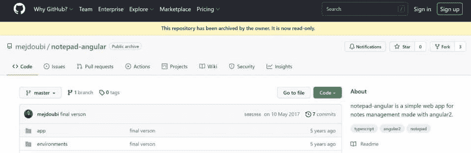
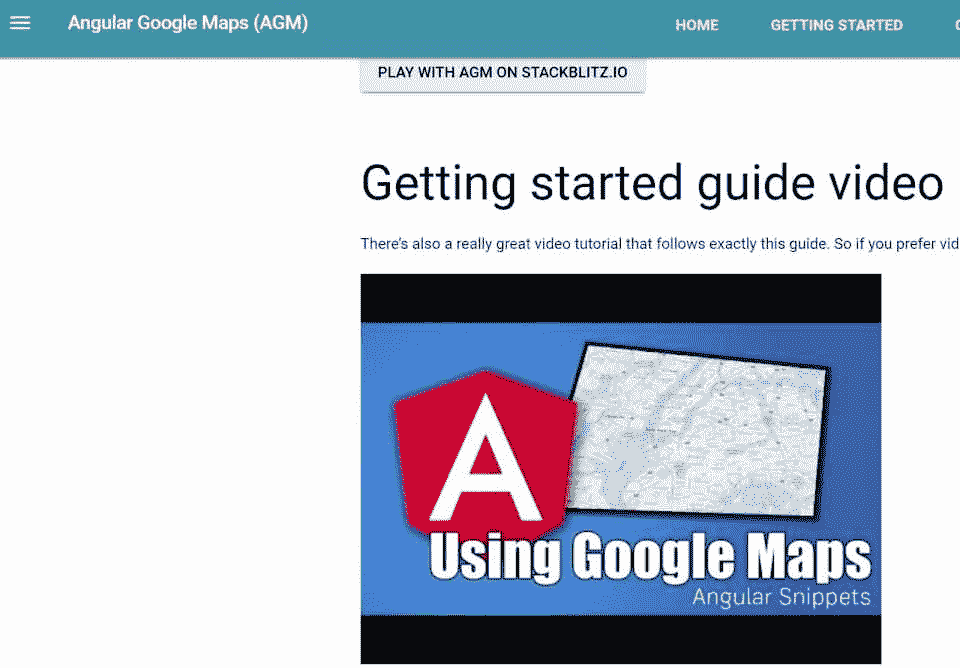
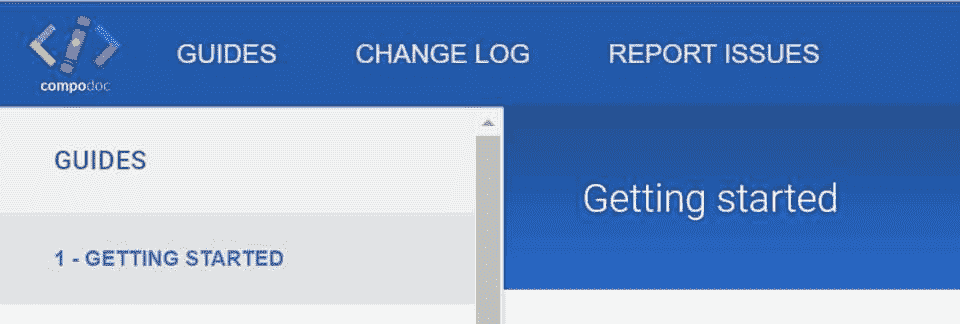
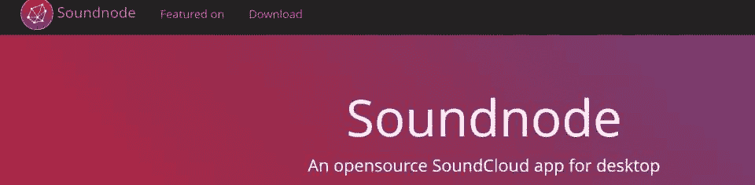
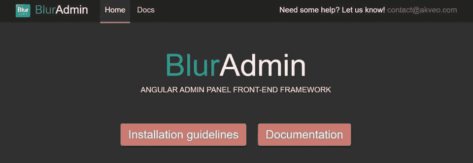
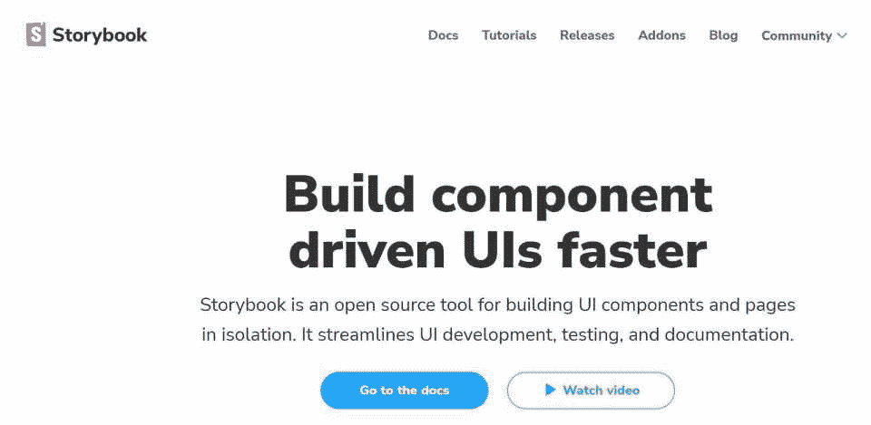

# 酷，有趣和简单的初学者角度项目(带源代码)

> 原文：<https://hackr.io/blog/angular-projects>

如今， [棱角分明](https://angular.io/guide/what-is-angular) 知识是软件行业的高需求技能。如果你正在寻找一个快速启动你的编程生涯的方法，深入 Angular 可以帮助你实现你的目标。

理论阅读和理解不足以让你快速起步——实践经验对你获得所需知识至关重要。你需要通过实际的角度项目来磨练你的角度技能。

现在，我们来看看 Angular 最突出的特点。借助 Angular 的 HTML 和 Typescript 功能，您可以构建单页面客户端应用程序，并掌握这个强大的 web 框架来构建实时应用程序。

如果你是一个 Angular 的初学者，你可能想要头脑风暴一些 Angular 项目的想法来开始。我们已经为你做了头脑风暴！

这里有一些很棒的角度项目，你可以从这里开始积累经验:

****

裸机项目是一个面向初学者的 Angular 项目，包含 npm(节点包管理器)模块、配置、脚本、文件夹和路由。要使用该项目，您必须首先下载 node.js。该项目以两种方式教授您角度路由:使用多个组件或作为一个简单的服务。这个应用程序是所有初学者的最爱，因为它简单易懂。

## **3。标准聊天应用程序**

初学者的最爱，标准聊天应用程序是一个基本的 Angular 演示项目，也是平台新手的有趣应用程序。要构建这个应用程序，您将使用 Angular CLI、RxJS 和 Typescript。并且，您将使用 Angular 2、Node.js 等编写可注入的服务。

普通的聊天应用程序由三个模型组成:消息、线程和用户。Message 保存单个聊天消息，Thread 托管消息组的元数据，User 包含单个用户数据。

**推荐课程**

[【棱角分明-完全指南(2023 版)](https://click.linksynergy.com/deeplink?id=jU79Zysihs4&mid=39197&murl=https%3A%2F%2Fwww.udemy.com%2Fcourse%2Fthe-complete-guide-to-angular-2%2F)

对于初学者来说，URL shortener 是一个有趣且有趋势的项目。首先，您可以使用 Polr 作为您的 URL 缩写程序的主机。

Polr 是一个开源应用，它使用 [MySQL](https://hackr.io/tutorials/learn-mysql) 来组织你的链接。该工具还可以帮助您添加主题，为您的 URL 添加品牌。您还可以使用 TypeScript、Express 和 MongoDB 的支持来创建自己的 URL 缩写程序。

AGM 是最好的 AngularJS 实时项目之一，你可以作为初学者尝试一下。它使用[coffee script](https://hackr.io/tutorials/learn-coffeescript)和 Javascript 将谷歌地图整合到你的 Angular 应用中，帮助你追踪任何位置。对于这种特定的 AngularJS 项目，您可以在 GitHub 上找到 AGM 源代码，但是在继续之前，我们建议您首先安装 Node.js。

对于 Angular 文档和搜索功能，Compodoc 是解决方案。该工具帮助您为各种 API(如模块、组件、管道和路由)创建文档。你会毫不费力地掌握 Compudoc 的窍门，因为它有类似于 Gitbook、Stripe 和 vagger 等熟悉工具的主题。

这个开源项目帮助 Windows、Linux 和 Mac 用户使用 Soundcloud API 播放音乐。您可以使用 Soundnode 轻松收听音轨，创建播放列表，并与平台上的关注者进行互动。其他一些功能包括:

*   原生媒体键盘快捷键
*   简单导航
*   从您的流、喜欢、曲目、关注或播放列表中欣赏歌曲
*   喜欢并保存歌曲
*   完整播放列表功能
*   关注/取消关注用户

管理面板框架是一个让你接触棱角分明的项目的好方法。使用 AngularJS，您可以使用 BlurAdmin 项目来设计一个完全可定制的管理面板框架。

【BlurAdmin 的一些优秀特性包括:

*   轻松定制
*   响应式布局
*   高分辨率模板
*   负担能力(免费)

****

Storybook 是一款独特的开源工具，专为基于 Angular、React 和 Vue 的应用开发 UI 组件。Storybook 的伟大之处在于，你可以在其他应用程序之外同时运行它。通过 Storybook 构建组件提高了应用程序的速度、可重用性和可测试性。

Storybook 配有用户友好的 API，通过其简单的配置和附加功能帮助您满足动态需求。

## 10。Angular - Hello World

“Hello World”Angular 项目非常适合 Angular 和 Typescript 的新手。使用 package.json 和 npm，它加载角度模块并为您提供项目结构的基本概述。因为它只有一个模块和组件，所以您可以自由地试验和使用它的不同特性。

## **结论**

看了 10 个最好的 kickstart Angular 项目后，现在是时候卷起袖子，动手实践 Angular 了。记住要不断学习，因为在这个多角度的世界里，许多新的发展和变化在不断发生。

## **了解更多:**