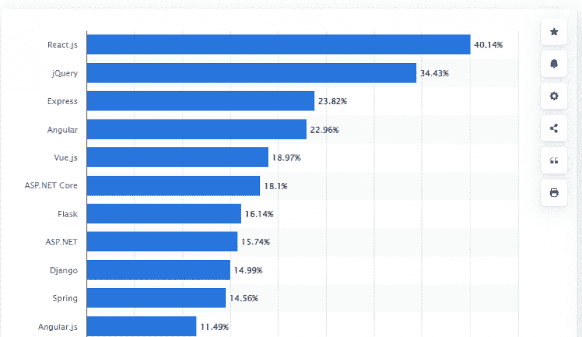
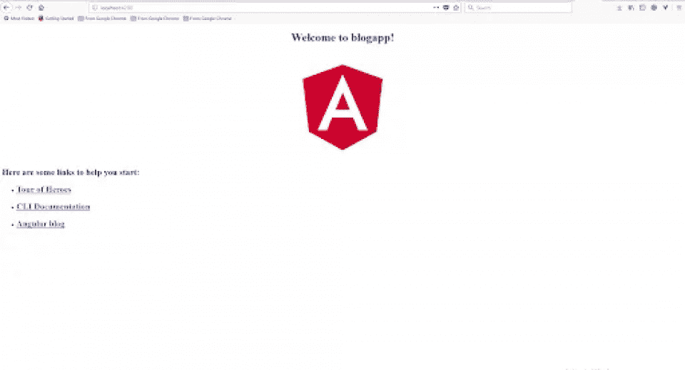
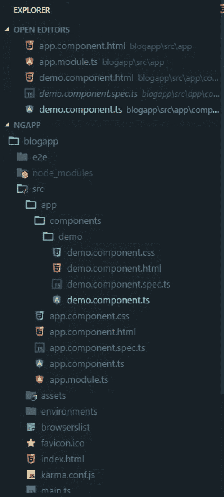
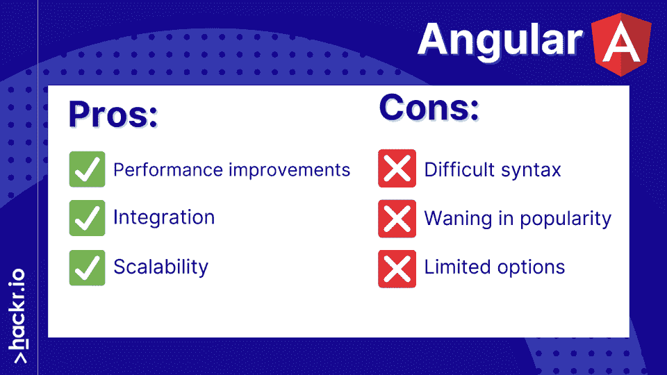
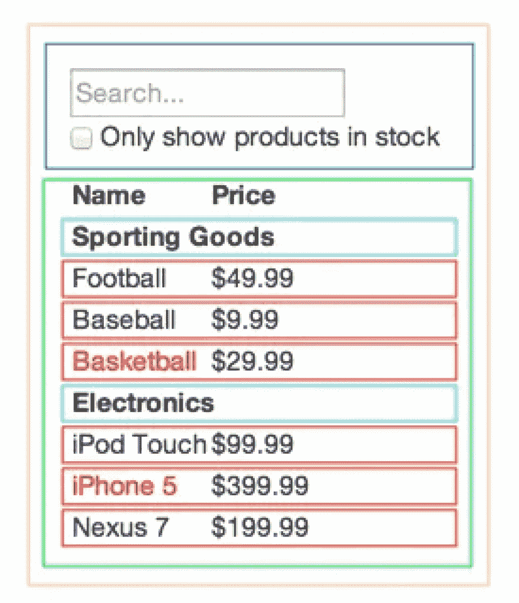
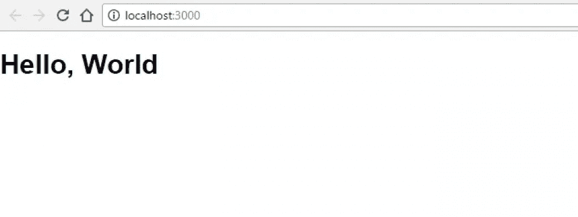
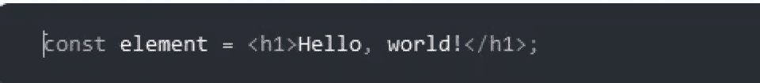

# angular vs React:2023 年哪个更好？[已更新]

> 原文：<https://hackr.io/blog/angular-vs-react>

我们生活在 Javascript 的年代，这种语言在 Github 上迅速攀升至第一位，并在不同的应用程序中不断获得动力，而不仅仅是前端应用程序开发。现在 Javascript 被用在前端，后端，构建移动应用，甚至用于构建 AI 应用。chrome V8 引擎正在提升其在服务器端的性能，就像它在浏览器上所做的一样。

框架使得用 Javascript 创建应用程序变得更加容易。最受欢迎的两个是角和反应。

*   Angular 是一个可伸缩的、基于组件的 Javascript 应用框架。这是一个完整的重写 AngularJS。谷歌、微软、福布斯、PayPal 和 Upwork 都在使用 Angular。
*   React 是一个用于用户界面开发的开源前端 JavaScript 库。Meta、网飞、优步、Airbnb 和纽约时报都使用 React。

今天，我们将深入探讨这两个问题。

## **角度对比反应:正面对比**

| **技术** | **角度** | **反应** |
| 技术类型 | 使用类型脚本的基于组件的框架 | 使用 Javascript 的基于组件架构的用户界面库 |
| 数据绑定 | 双向数据绑定 | 单向数据绑定 |
| 大小 | 相当大，因为它需要被运送到客户端，这增加了初始加载时间 | 体积很小的，尤其是与角形相比 |
| 学习曲线 | 很陡，给定的功能和选项的数量，你有角度 | 这很容易掌握和学习 |
| 表演 | 堪比 React，Angular 2 和 4 都是有的 | 由于虚拟 DOM，比 Angular 更快 |
| 简单 | 复杂的 | 简单的 |
| 可量测性 | 由于 power CLI 和生成工具，易于扩展，它也被许多大公司使用 | 相当容易缩放并且非常可测试，这有助于缩放过程 |

## 单页应用程序与多页应用程序？

应用程序开发正从桌面转移到浏览器，因为它提供了更好的 UX，并且可以在许多设备上共享。在开发基于 web 的应用程序时，有两种主要的范例或模式可供选择。

这两种模式分别是单页面应用程序(简称 SPA)和多页面应用程序(MPA)。现在，这并不意味着你不能在同一个网站上同时拥有这两者，事实上，在大多数情况下，你会想把两者的页面混合在一起，以获得最佳的 UX，这取决于具体情况。

SPA 是一种不需要重新加载的服务，因为所有的组件都被发送到客户端，所以它的性能更加流畅和快速。Gmail 是 SPA 的一个很好的例子。SPA 独立地请求应用程序外壳或标记以及数据，这使得开发更加容易。

使用 Chrome 也很容易调试。然而， [SEO](https://hackr.io/blog/what-is-seo) 对于 SPA 来说有点复杂，因为它可能需要执行服务器端渲染或者使用一些渲染服务来避免混淆爬虫。此外，如果用户关闭了 JS，您还需要在服务器端呈现页面，这将是完全低效的，并且会打乱整个 SPA 的想法。

MPA 是我们习惯看到的传统页面，其中大多数操作通过 ajax 请求数据，甚至整个页面重新加载，这要复杂得多，前端和后端通常是紧密耦合的，然而，它们更有 SEO 效率。

**推荐课程**

[棱角分明-完整指南(2023 年版)](https://click.linksynergy.com/deeplink?id=jU79Zysihs4&mid=39197&murl=https%3A%2F%2Fwww.udemy.com%2Fcourse%2Fthe-complete-guide-to-angular-2%2F)

## **应用开发的基础:React 与 Angular**

既然我们已经了解了什么是 SPA 和 MPA，我们可以开始思考什么是 React 和 Angular，并选择最适合我们应用的一个。

框架和库通过利用由其他专业开发人员创建的工具的能力以及他们对常见问题的解决方案来加速开发过程。因此，为了更有效地使用这些工具，我们必须了解它们是如何工作的以及它们能提供什么，以便只选择最适合我们的功能性和非功能性软件需求的工具。



来源: [Statista](https://www.statista.com/statistics/1124699/worldwide-developer-survey-most-used-frameworks-web/)

如今， [React](https://hackr.io/blog/react-courses) 是最流行的框架。但是 jQuery 和 Angular 紧随其后。

Angular 最初是一个 MV*框架，也就是说，它可以用作 MVC 或 MVVM 架构。它非常灵活，许多人认为这种灵活性是一种难度，因为没有一种特定的做事方式。它由 Google 创建，被许多公司使用，如 Autodesk、Apple 和 Microsoft。Angular 专注于构建 rich SPA，当它在 2010 年左右首次发布时，它引入的许多新概念震惊了世界。

另一方面，React 是一个 Javascript 库，用于构建丰富的用户界面。

尽管 React 对于许多开发人员来说感觉像是一个框架，但它并不是一个框架。React 是由脸书创建和维护的，他们在应用程序中大量使用它。React 充当 MVC 架构中的视图，但除此之外，它还引入了一种新的基于组件的架构。

## **整合角度和反应与其他技术**

如果您不考虑从已经设定好的架构中进行迁移，这里有一个要点需要提及:集成。

如果你正在运行一个完整的 Ruby on Rails MVC 服务器，你可以使用 Angular 或者 React。但是角度可能更难。

Rails Angular 有一些精华，但是它们已经过时了，并且没有得到很好的维护，当然，原因是 Angular 并不是真正为服务器端运行和开发的，尽管有在服务器端使用 Angular 的方法和技术，但是我们不会在这里深入讨论。

另一方面，将 React 与你的后端技术集成是相当容易的，即使是严格的 MVC，React 对服务器端渲染和客户端渲染都很好。对于 rails 来说，react-rails gem 得到了很好的维护，并且会定期更新，所以如果您想保留整个后端功能，而只是调整视图，react 绝对是您要找的人。

然而，好消息是，如今的大多数后端框架，包括 Rails，都可以在 API 模式下运行和创建，并且在许多包或库的帮助下比以前更容易。这确实有助于为你的网站构建任何你想要的架构，而且你很可能熟悉均值和 MERN 堆栈，因为它们在今天相当流行。

## **角度:一个深入的概述**

在其核心，Angular 扩展了浏览器的功能，通过扩展和拦截事件循环，并增强处理器完成的 HTML 解析。首先，我们来看一个简单的角度应用，在这次演示中，我将使用角度 6。

为了开始使用 Angular，我们将通过 npm 安装 Angular 命令行。为此，我们将运行:

```
npm install -g @angular/cli
```

接下来，我们将使用以下内容创建一个新的应用程序:

```
ng new [applicationname]
```

Angular 使用基于组件的架构，基本上每个组件由 4 个文件组成，一个定义和实现组件的 typescript 文件，一个呈现视图的 HTML 文件，一个用于样式的 CSS 文件和一个用于测试的 spec 文件。在我们对应用程序进行任何更改之前，运行命令 ng serve，您将看到默认创建的应用程序正在端口 4200 上运行。



现在，在 src/app 里面，清除 app.component.html 的内容。让我们创建自己的新组件。

Angular CLI 提供了一个强大的生成器，要创建一个组件，我们将使用 ng g component componentes/demo。现在，我们的应用程序结构将如下所示:



在 demo.component.ts 中，我们将开始实现简单的双向绑定应用程序。我们将定义一个简单的消息，它应该以一个默认消息开始，然后在视图上被改变和显示。@component 定义了组件的元数据。选择器是我们将用来包含该组件的自定义 HTML 名称。我们将在演示组件类中添加一个消息变量，并将其类型定义为字符串。在 ngOnInit 方法内部，我们将赋予它一个默认值。ngOnInit 是一个在组件挂载之前执行的生命周期方法，我们也可以使用构造函数来实现这个目的，对于这个应用程序，它们会给出相同的结果。

```
import { Component, OnInit } from '@angular/core';

@Component({
  selector: 'app-demo',
  templateUrl: './demo.component.html',
  styleUrls: './demo.component.scss'
})

export class DemoComponent implements OnInit {
  message: string,
  constructor: () {}

  ngOnInit {
    this.message = "Hello"
  }
}
```

接下来，我们将创建 HTML，我们将使用 H1 标签来显示消息变量的当前值。双括号用于插入消息的值。我们还将创建一个没有动作的表单，它由一个标签和一个文本类型的输入字段组成。要创建双向绑定，我们需要使用 ngModel，它允许我们更改消息变量的值，然后 name 属性将在输入字段中显示变量的值。因此，在我们输入任何内容之前，应该将默认值“Hello”写入其中。

来源: [Github](https://gist.github.com/hackrio1/d21a3346ec5df2ed4e30f48eb4ea9e5e#file-demo-component-ts)

```
<h1>{{ message }}</h1>
<form>
  <div>
    <label for="message">essage: </label>
    <input type="text" [(ngModel)]="message" name="message">
  </div>
</form>
```

为了完成这个迷你应用程序，我们需要在 app.component.html 中包含 app-demo 组件，这是我们应用程序的主要组件，实际上，在 app.module.ts 中包含 FormsModule，以便能够使用 ngModel。

来源: [Github](https://gist.github.com/hackrio1/6a8cb916539ac043313ff846816c2e5a#file-demo-component-html)

```
import { BrowserModule } from '@angular/platform-browser';
import { NgModule } from '@angular/core';
import { FormsModule } from '@angular/forms';
import { AppModule } from './app/component';
import { DemoComponent } from './components/demo/demo.component';

@NgModule({
  declarations: [
    AppComponent,
    DemoComponent
  ],
imports: [
  BrowserModule,
  FormsModule
],
providers: [],
bootstrap: [AppComponent]
})
export class AppModule { }
```

现在，当我们保存并返回浏览器时，我们会发现我们的应用程序正在以双向绑定的方式运行。

来源: [Github](https://gist.github.com/hackrio1/2fb05e5bfa732e0d258f5c92fe09505b#file-app-module-ts)

### **角度数据绑定**

事实上，Angular 提供了 3 种装订方法，而不是一种。每个都在这个代码片段的一行中演示。

第一个是我们之前谈到的双向数据绑定，它会立即反映数据的任何变化，如果用户更改了数据，应用程序会立即看到，反之亦然。

第二种方法是单向数据绑定，在这种方法中，只有应用程序能够更改数据，并且数据也会立即反映出来。

最后一种方法是一次性数据绑定，在这种方法中，数据属性在其整个生命周期中只被观察改变一次，并且只有这种改变是可见的，如果它改变了，否则我们不会在应用程序中发现它。

### **高级角度功能**

Angular 将向您介绍许多其他概念，实际上您可以使用 Angular 做很多事情，例如，我们已经提到 Angular 已经扩展为更像 React is 那样的组件驱动，您可以在 Angular 中创建自定义过滤器，使用表单验证和执行单元测试，以及许多其他很酷的事情，您可以在官方文档中查看。

Angular 还引入了依赖注入，这在发布时是开创性的，改变了开发中许多事情的处理方式，因为依赖注入是一种增加代码可重用性和增强开发过程的有用模式。

### **有角 5 还是有角 6？**

角度历史相当混乱。只有 5 个主要版本以 2018 年 5 月 3 日推出的 Angular 6 结尾。

Angular 1.x 与后来的任何版本都不兼容，因为 Angular 2 完全重写了框架。组件和指令取代了控制器和作用域，以跟上 React 导致的吸收。此外，从 Angular 2 开始，框架开始使用 Typescript，这是 Javascript 的超集，提供静态类型和一些常规 Javascript 中没有的引人注目的特性。

值得一提的是，在 Angular 1.5+中，组件也被引入到框架中。由于某些兼容性问题，Angular 3 被跳过。接下来是 Angular 4，接着是 Angular 5，介绍了 Angular 服务人员，然后是 Angular 6。也不建议从角度 2 跳到角度 6，尽管这是可能的。我们还是坚持角度 6。

## **Angular JavaScript 框架的利与弊**



**优点:**

1.  性能改进。Angular 提供了许多超越其他类似框架的性能改进，使其成为开发大型复杂 web 应用程序的理想选择。其中包括更快的渲染时间、更小的应用程序大小以及更高的整体速度和响应能力。
2.  整合。Angular 与其他流行的工具和插件无缝集成，使得向您的 web 应用程序添加新的特性和功能变得容易。这包括像 TypeScript、React 和 Node.js 这样的工具。
3.  可扩展性。Angular 对于大型网站和网络应用程序具有极强的可扩展性，这也是它成为谷歌和微软等公司首选技术的原因。

**缺点:**

1.  复杂的语法。与 React 等其他选项相比，Angular 的语法可能很难学习。这是因为 Angular 使用了大量复杂的代码和术语，对于刚接触这个框架的开发人员来说可能是不熟悉的。
2.  声望下降。Angular 不再像 React 和 JQuery 等其他流行的 JavaScript 框架那样被广泛使用。
3.  有限的选择。与其他框架相比，Angular 只提供了有限的选项和工具。这可能会限制想要充分利用这个框架的开发人员。例如，Angular 在路由或动画方面没有提供很大的灵活性。因此，如果开发人员在使用这个框架时想要更多的选择和灵活性，他们可能需要寻找其他工具或框架。

总的来说，尽管 Angular 确实有一些缺点，但它仍然是开发复杂 web 应用程序的绝佳选择。

## **反应**

React 是一个由脸书创建和维护的界面制作库。这是他们的开源项目之一，已经被许多其他公司采用，如 Instagram、雅虎、WordPress、沃尔玛等。

React 为游戏带来了基于组件的架构，这彻底改变了 web 开发，并影响了 Angular 等其他框架跟随它的脚步。在 web 开发中，基于组件的架构比其他架构更易维护，甚至更容易维护。它还通过创建可重用的组件来加速开发过程，使开发人员能够专注于页面上的每个细节。

这就是 React 如何看到你的应用程序的页面，以及你应该如何在 React 中思考。



也就是说，您可以将 React 配置为 MV*架构中的 V。让我们通过一个简单的 Hello World 程序来看看基于组件的体系结构是如何工作的

### **在 React 中创建一个简单组件。**

我已经创建了一个名为 Hello 的简单组件，其默认函数 render 只返回标题标签“Hello World”。

```
import React, { Component } from 'react';
import './App.css';

  class Hello extends Component {
    render() {
      return (
        <h3>Hello World!</h3>
      ); 
    } 
  } 
export default Hello;
```

在 Index.js 中，我们只是用 ReactDOM.render()方法调用该组件，并传入该组件及其应该插入的位置，在本例中，它将被插入到 index.html 页面的根 div 中。

来源: [Github](https://gist.github.com/hackrio1/13cc1b7a8d901420686f12ac994da57f#file-hello-world-js)

```
import React from 'react';
import ReactDOM from 'react-dom';
import './index.css';
import Hello from './App'
import registrationServiceWorker from './registrationServiceWorker';

ReactDOM.render('Hello', document.getElementById('root'));
registrationServiceWorker();
```

当我们点击 npm start 时，组件被渲染，神奇的事情发生了。



然而，并不是基于组件的架构让 React 如此出名；React 的虚拟 DOM 是它所提供的最好的特性之一。简而言之，文档对象模型是浏览器对网页的表示，React 拥有自己的虚拟 DOM 来操纵浏览器的实际 DOM，但由于它比浏览器的 DOM 快得多，所以它大大提高了性能。React 的虚拟 DOM 每秒能够创建超过 200，000 个节点，这超过了大多数网站的需求。

不仅如此，它还为每次更改重新创建 DOM，并且通过它使用的 Diffing 算法，它能够将差异计算的复杂度从 O(n3)减少到 O(n)。diffing 算法是一个独立的丰富主题，它揭示了 React 的一些神奇之处，这里是 React 官网上的完整文档。

### **JSX 又反应过来**

React 漂亮的特性之一是引入了 Javascript 语法扩展 JSX。这个奇怪而有趣的片段说明了这一点。



虽然这不是 HTML，但也不是 Javascript。JSX 的美妙之处在于，它帮助开发人员可视化页面内容，并且比传统的 Javascript 更容易编写，注意，您可以忽略 JSX，编写传统的 JS，React 也可以工作得很好，但是这里有一个有和没有 JSX 的代码的比较。

与 JSX:

```
ReactDOM.render( 
<h3>
Hello World!
</h3>
,document.getElementById('root') ); 
```

没有 JSX:

```
ReactDOM.render(React.createElement(

 'h1',

 null,

 'Hello World!'

), document.getElementById('root'));
```

React 也是一个非常丰富的库，我们还没有提到 React 带来的道具、事件和表单以及一系列令人惊叹的功能，你可以在他们的官方文档页面上深入查看。

## **React JavaScript 框架的利与弊**


**优点:**

*   简单。React 是一个简单易懂的框架。
*   性能。React 使用虚拟 DOM，它通过支持更快的 DOM 更新来帮助提高 web 应用程序的性能。
*   易于集成。React 可以轻松地用于开发大型 web 应用程序，没有任何麻烦。
*   代码可重用性。React 组件可以重用，这有助于节省开发时间和精力。

**缺点:**

*   相对较差的文档。React 的一个主要缺点是，与 Angular 和 Meteor 等其他流行框架相比，它的文档很差。
*   僵化的建筑。与 Angular 或 Meteor 等其他框架相比，React 中数据流的方式非常不同。在使用 React 时，您需要学习一种新的做事方式，这会增加学习曲线。
*   尺寸。库本身的大小相当大，如果您开发的应用程序只需要 React 的一些功能，这可能会有问题。不推荐使用 React，除非您已经承诺广泛使用它。

也就是说，React 现在是当今最流行的 JavaScript 框架。在某种程度上，这是因为进入门槛低和易于使用。

## **结论**

如果我们有赢家，Web 开发会容易得多，但遗憾的是我们没有。这真的取决于你想做什么，你想怎么做。

在以下情况下使用 React:

*   你需要一个简单的框架来构建用户界面。
*   您希望构建快速、轻量级的 web 应用程序。
*   你主要关注前端设计。

使用角度，如果:

*   你不会被 Angular 的复杂性吓倒。
*   你需要一个更深入的框架和模型。
*   你必须建立健壮的、可伸缩的网站。

无论你选择 Angular 还是 React，Hackr.io 都有最好的社区推荐的编程教程给你。

## **常见问题解答**

#### **1。React 接管有角度吗？**

React 和 Angular 之间没有明显的赢家。虽然 React 近年来越来越受欢迎，但 Angular 仍然被许多大公司使用，如谷歌和微软。就哪个框架更受欢迎而言，就看你问谁了。一些开发人员更喜欢 React，因为它的简单性和易于理解的语法。这更适合小型开发人员和个人商店，但不一定更适合大型、可伸缩的企业级系统。

#### **2。是有棱角还是反应更好？**

React 和 Angular 都有各自的优缺点，并且都有可能在未来几年继续发展。最终，您选择哪个框架将取决于您的特定项目需求，以及您自己的偏好和对不同框架的体验。对于一个 JavaScript 开发人员来说，理解这两者可能是值得的。

#### **3。反应比角度快吗？**

React 由于其轻量级的性质，在渲染速度和应用程序大小方面往往更快，而 Angular 提供了许多性能改进，使其成为大型复杂 web 应用程序的理想选择。

#### **4。React 和 Angular 有什么不同？**

虽然它们有一些相似之处，例如它们都关注性能和可伸缩性，但 React 以其简单性和易于理解的语法而闻名，而 Angular 提供了更广泛的功能和灵活性。此外，React 在呈现页面方面往往更快，并且更专注于前端开发。

#### **5。我该学 React 还是 Angular？**

为什么不两者都要？两者都是强大的框架，可用于构建复杂的 web 应用程序，因此您的选择很可能取决于您特定的项目需求和使用不同技术的经验。如果您刚开始从事 JavaScript 开发，从 React 开始可能是值得的，因为它更容易。

#### **6。公司用 React 还是 Angular？**

现在的公司都用 React 和 Angular，虽然 React 更受欢迎一点。看看你感兴趣的工作列表，注意哪一个更容易出现。有可能这两者在你的行业中更受欢迎。

**人也在读:**