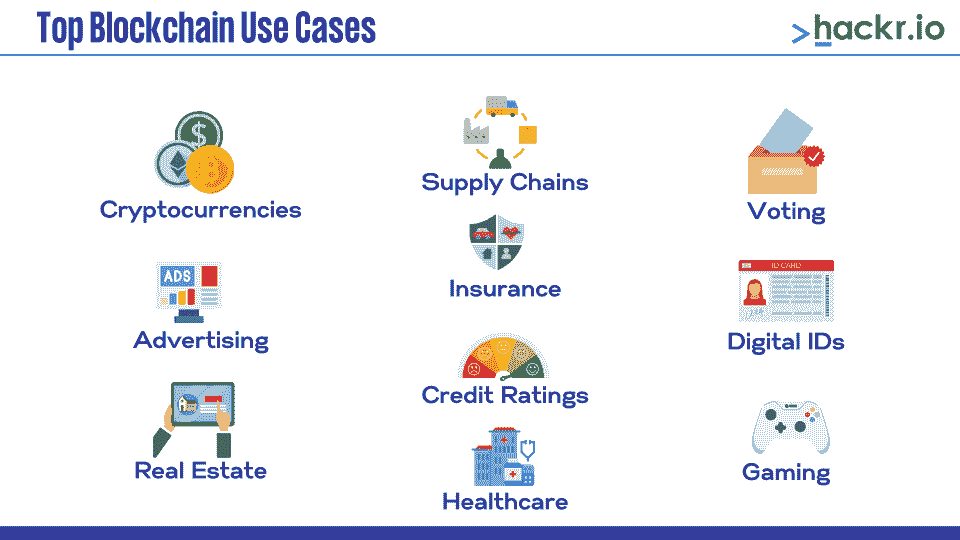

# 十大区块链应用和用例[2023]

> 原文：<https://hackr.io/blog/applications-and-use-cases-of-blockchains>

近年来，许多技术的受欢迎程度迅速增长，包括人工智能、机器学习、AR/VR——当然还有区块链技术。出于各种原因，初创公司和银行、保险公司等大公司都在实施这项技术。

区块链技术的第一个实现，比特币，因其作为支付和价值储存手段的使用而受到了很多关注。在这里，我们提供了一个关于该技术的初级读本，以及对区块链理工大学的流行应用的解释。

## **什么是区块链技术？**

区块链是一种数据结构，允许以分散的方式存储和验证数据。它类似于对等体系结构，其机制提供数据安全性。要了解更多关于区块链技术如何工作的信息，请阅读我们关于初学者的**区块链编程的文章。**

 **## **区块链的好处**

区块链技术提供了一些关键的好处，正是因为这些好处，公司对这项技术如此兴奋。我们在下面描述这些优势。

### **1。消除中间商**

通过分散数据存储，区块链理工大学消除了中间商，从而降低了成本。这方面的一个经典例子是加密货币。加密货币不受任何银行管理。比特币交易中没有中间人。交易以完全对等的模式进行，没有中介。

### **2。信任**

由于不涉及任何中间人，并且每一方都可以看到区块链中的数据，因此它在参与方之间提供了更多的信任。在集中式架构中，所有的参与者都必须信任中间人，这导致了对参与者的依赖。

例如，当您使用网上银行时，您必须相信您的银行会按计划将资金发送给收款人。万一你的银行违约，你真的无能为力。

### **3。可用性**

区块链遵循去中心化的架构，因此不存在单点故障。因此，与集中式系统相比，它提供了更高的可用性。在集中式系统中，如果系统崩溃，所有参与方都将完全失去可用性。

举个例子，如果你的银行核心银行系统瘫痪，你就无法交易。

### 检查本课程

[区块链 A-Z:了解如何构建您的第一个区块链](https://click.linksynergy.com/deeplink?id=jU79Zysihs4&mid=39197&murl=https%3A%2F%2Fwww.udemy.com%2Fcourse%2Fbuild-your-blockchain-az%2F)

### **4。数据安全**

通过实现哈希机制，区块链提供了高度的数据安全性。如果任何一方试图破坏区块链的数据，整个链条就会崩溃。

## **顶级区块链应用**

****

区块链可以用于几乎所有涉及中间人的情况。以下是目前正在实施区块链的一些有趣的区块链用例:

### **1。加密货币**

这是区块链理工大学最广为人知的用途。加密货币在早期的应用至少主要集中在支付上。各方能够在没有任何银行参与的情况下相互交易。例如，一个坐在美国的人可以在没有银行参与的情况下将比特币转移给印度的某人。

### **2。广告**

目前，像谷歌和脸书这样的公司控制了几乎所有的数字广告流量。在这里，谷歌和脸书本质上是控制广告生态系统的中间人。使用区块链，生产者和消费者可以通过一个分散的系统直接连接。

### **3。房地产**

就像广告业一样，在房地产行业，也有以经纪人形式出现的中间人，他们通常为买卖双方牵线搭桥收取高额费用。使用区块链，这些中间人可以从过程中删除。基本上，不依赖于集中的广告/列表门户，可以使用区块链，其中生产者(广告商或房地产销售者)可以提供他们的广告/列表，并且消费者可以直接看到它们，而不需要任何中间人。

### **4。供应链**

国际递送必须经过许多步骤。例如，它通过快递服务提供商(如 DHL)，然后通过发送国的海关，再通过接收国的海关，最后通过接收国的当地快递服务提供商。这个供应链中最大的问题是跟踪货物的状态。

各公司正计划在这些参与方之间实施区块链，以便所有参与方都可以将状态实时放入区块链，客户可以轻松跟踪。使用区块链消除了一方的管理负担，有助于将负载分散到各方。

### **5。保险**

保险公司可以使用区块链管理提交欺诈性保险索赔的人的数据。这有助于他们在签发保险索赔时验证申请人的真实性。例如，如果申请人 A 在 B 公司申请保险，B 可以很容易地使用区块链来检查 A 过去是否在 c 公司提交过欺诈性索赔。如果发生了这种情况，B 可以决定不为 A 签发保险，因为 A 可能会再次在 B 公司提交欺诈性索赔。该系统最大的优点是没有任何一家保险公司需要负责维护这些数据。

### **6。信用评级**

数据分散在各个公司，这在各个公司之间建立了很多信任。就像保险业一样，同样的逻辑也适用于银行业，银行正在创建违约者数据。目前，这是由信用评级机构。银行正试图通过使用区块链来消除这些信用评级机构，在那里它们将以安全的方式共享违约者的数据。

### **7。医疗保健**

患者的健康记录可以安全地存储在区块链中，以便当患者拜访另一位医生时，他/她可以直接与新医生共享这些记录。在这里使用区块链最大的好处是不需要一个集中的门户来存储这些记录。因此，可以显著降低成本。

### **8。投票**

在这个时代，投票问题仍然是一个令人担忧的问题。虽然数字系统在使整个过程更加简化方面取得了很大进步，但它仍然远非理想。一个基于区块链的投票系统确保没有欺诈，同时完全透明。现在有很多平台在研究这个解决方案，一旦完善，整个投票技术可能会流行起来。

### **9。数字身份证**

作为区块链的不可变分类账提供了个人文档的防篡改记录-只有在授权实体请求时才可访问。在一个日益数字化的世界中，对数字身份的安全和私密访问是至关重要的。甚至像微软这样的公司也跃跃欲试，数字身份将是未来十年区块链理工大学的一个主要话题。

### 10。游戏

视频游戏行业正在迅速采用区块链技术，特别是不可替代令牌(NFT)。游戏经常利用游戏中的经济和独特的物品，而 NFTs 提供了一种促进经济的方式，并确保玩家可以跨游戏访问他们的物品。视频游戏行业是一个价值数十亿美元的行业，因此该技术在这里有很多机会展示其潜力。

## **区块链应用的列表正在增长**

区块链技术应用种类繁多，功能强大。它具有在大量用例中应用的潜力。

因此，许多创业公司正在使用它来为银行、保险公司、供应链公司等提供解决方案。事实上，一些创业公司正在使用多种技术的组合来提供可扩展的解决方案。

可以查看我们编程社区推荐的 [**区块链编程教程**](https://hackr.io/tutorials/learn-blockchain-programming?ref=blog) 。

**人也在读:****