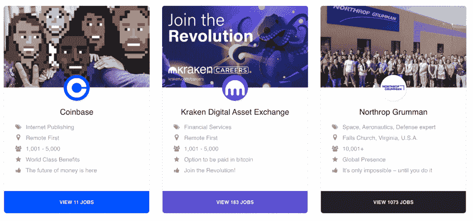
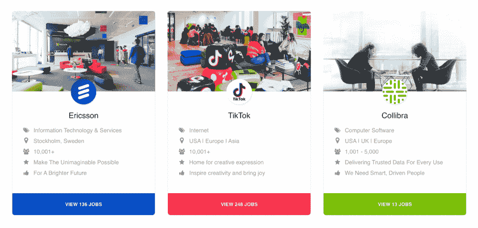
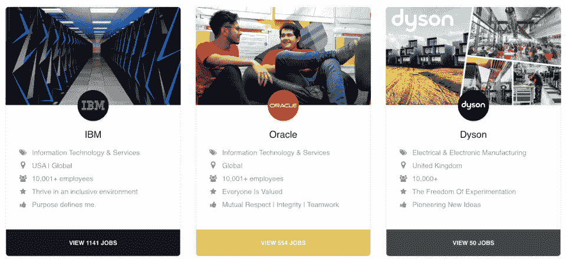

# 你应该在只匹配 70%技能的情况下申请工作

> 原文：<https://hackr.io/blog/apply-for-job-when-you-match-70-percent-of-skills>

这些是我们经常看到流传的统计数据:男性只满足 60%的条件就申请工作，而女性只有满足 100%的条件才会申请。这一发现最初来自惠普的一份内部报告，尤其是女性不申请某个职位的原因之一就是那句老话:自信，除非她们觉得自己能做工作要求清单上的所有事情。

男性也有这种想法，但不像女性那样多——所以这里突出的一点是，每个人都需要努力了解招聘人员真正想要的是什么。

在招聘过程的开始，人力资源专业人员或招聘经理通常会创建一个职位描述，这基本上是一个幻想员工的愿望清单，他们拥有他们可能需要的所有技能，甚至更多。然而，在现实中，一个公司或组织期望你拥有他们在招聘广告中列出的每一项技能、证书或能力并不常见。

有迹象表明，这个领域正在变得稍微平稳。如今，为了鼓励你申请，公司通常会在他们的列表中添加一些说明，比如恳求:“如果你达到了 70%的要求，我们很乐意收到你的来信。”或者，“我们知道自信差距和冒名顶替综合症可能会阻碍遇到出色的候选人，所以请不要犹豫申请——我们希望收到你的来信。”

您甚至不需要担心满足 70%的需求。2018 年的一项调查评估了数百份工作清单，发现尽管满足要求很重要，但当你符合 50%的列出技能时，你获得面试的可能性与你符合 90%的技能时一样大。

所以，如果你正在寻找一个新的职位，那么我们有三个值得一试的职位，另外还有几千个在 [Hackr.io 工作论坛](https://jobs.hackr.io/)上。

## IT 基础设施工程师-华盛顿州、DC、抖音

地点:DC 华盛顿州。

**角色:**作为短格式移动视频的主要目的地，抖音的使命是激发创造力和带来快乐。它正在寻找一名 [It 基础设施工程师](https://jobs.hackr.io/job/it-infrastructure-engineer-washington-dc-at-tiktok-2)来构建和发展它的 IT 环境。你将非常博学，并将成为基础设施建设的联系人。你不仅要专注于解决事故，还要找到潜在的问题并制定长期的解决方案。

职责:你将管理和维护现有的网络和系统基础设施，评估和设计新的系统和网络设备。您将对与 IT 服务和运营、业务系统以及相关流程和程序相关的全球政策提出建议，并与管理层合作确定新系统和修改的要求。

要求:你需要五年以上的用户硬件/软件/外设支持，以及支持微软 Windows 和 macOS 的经验。您还需要在电脑故障排除、部署和资产管理方面的成熟技能。

**了解有关** [**IT 基础设施工程师**](https://jobs.hackr.io/job/it-infrastructure-engineer-washington-dc-at-tiktok-2) **职位的更多信息，并在抖音** **寻找其他** [**机会。**](https://jobs.hackr.io/company/tiktok-2)

### **推荐课程**

**[IT 基础知识——你需要知道的一切](https://click.linksynergy.com/deeplink?id=jU79Zysihs4&mid=39197&murl=https%3A%2F%2Fwww.udemy.com%2Fcourse%2Fit-fundamentals-everything-you-need-to-know-about-it%2F)**

VMware 管理员，Amadeus

## **地点:**德克萨斯州奥斯汀。

**角色**:VMware 管理员[向 Austin 站点经理汇报工作](https://jobs.hackr.io/job/vmware-administrator-at-amadeus-1)将提供思科路由器和交换机、VMware ESXi、vCenter、SAN 设备和虚拟网络的实际操作经验和培训，并将主要负责融合虚拟网络和基础架构的实际操作支持。

**职责:**您将负责所有 SUPPS 虚拟和物理基础设施、服务器及相关设备的安装、配置、维护和支持，重点是客户支持。

**要求:**要求学士学位或同等工作经验，以及三到五年的网络和 VMware 相关经验和/或培训。你也将是一个有能力的问题解决者，及时发现和解决问题；熟练收集和分析信息，并开发替代解决方案。

**查看有关** [**VMware 管理员**](https://jobs.hackr.io/job/vmware-administrator-at-amadeus-1) **角色的更多信息，并在 Amadeus** **此处寻找其他** [**机会。**](https://jobs.hackr.io/job/vmware-administrator-at-amadeus-1)

FPGA 设计工程师-早期职业生涯，ASML

## **地点:**加州圣地亚哥。

**角色:**早期职业生涯中为 ASML EUV 系统公司的高可靠性电子产品中的 FPGAs 的规格、设计、实施和验证做出贡献的机会。[FPGA 设计工程师](https://jobs.hackr.io/job/fpga-design-engineer-early-career-at-asml-2)将参与跨职能团队，与多个工程团队合作，概述并创建 FPGA 设计和相关工程文档。

**职责:**您将根据规范和系统要求整合现有设计的新功能和增强功能，设计和开发新协议，以确保利用现有设计限制覆盖新模块的通信，并在现有设计接口上开发新协议，增强现有设计，以包括模块间中继的新指标。

**要求:**两年以上的 FPGA 设计、设计约束、设计验证和资格认证经验，以及 BSEE 或相关工程学位。

**更多关于** [**FPGA 设计工程师**](https://jobs.hackr.io/job/fpga-design-engineer-early-career-at-asml-2) **关于** [**关于 ASML**](https://jobs.hackr.io/company/asml-2) **的附加空缺。**

****

****