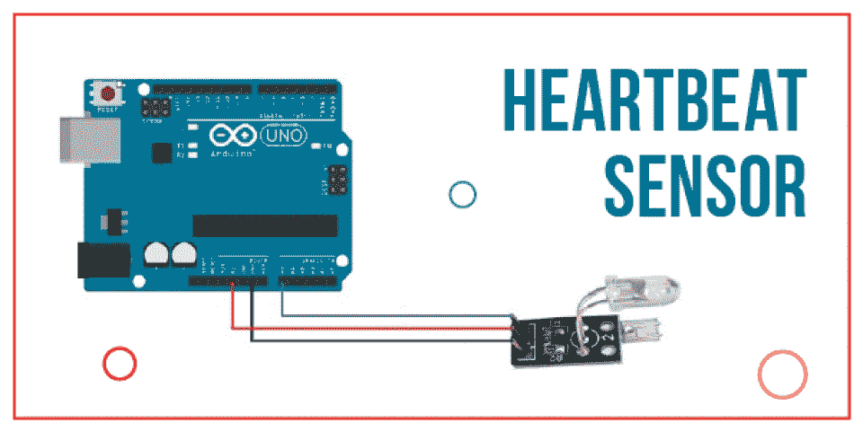
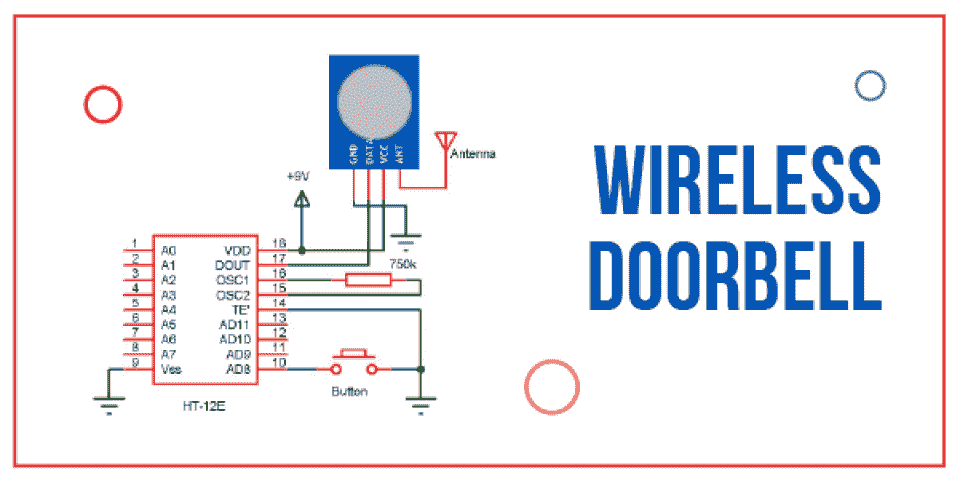
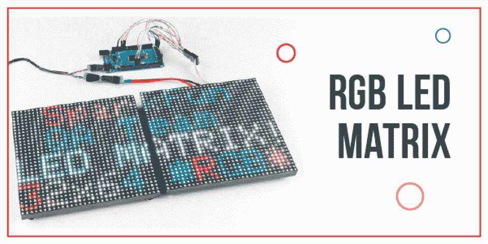
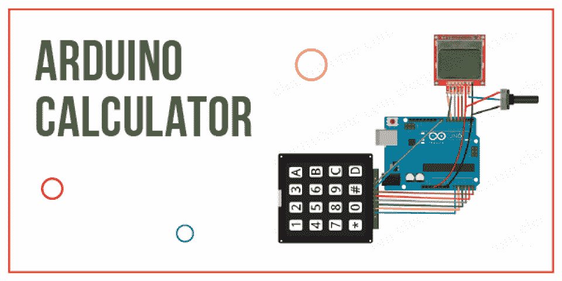
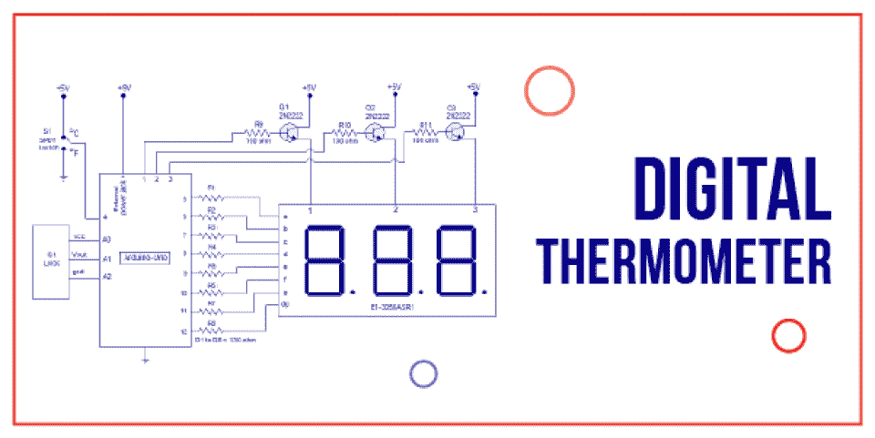
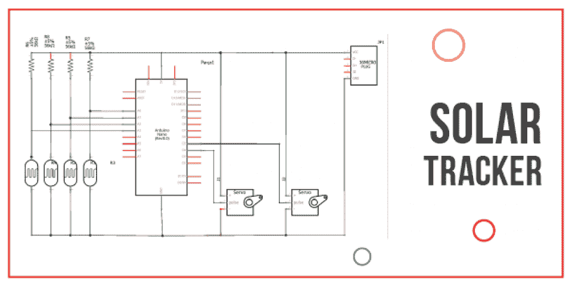
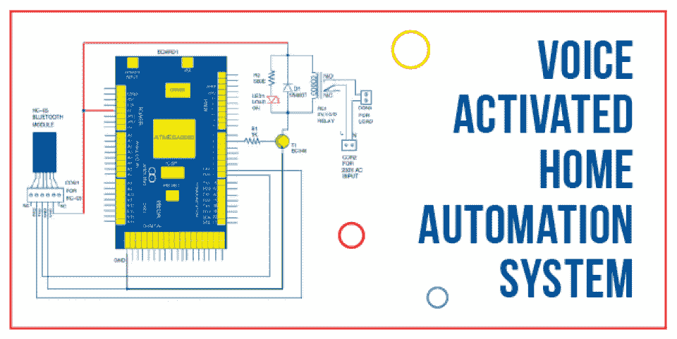
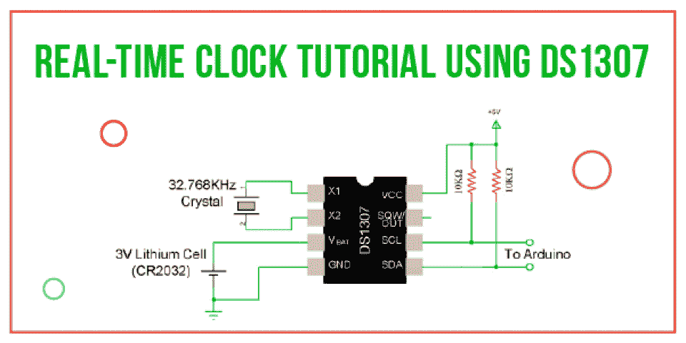
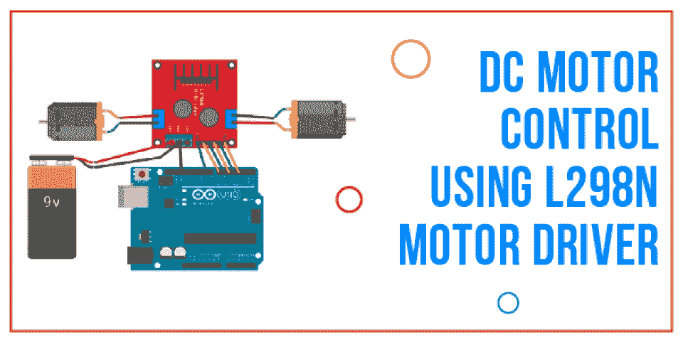

# 适合初学者的酷、有趣且简单的 Arduino 项目[排名- 2023]

> 原文：<https://hackr.io/blog/arduino-projects>

如果你对编码和编程硬件感兴趣，那么你一定知道流行的工具 Arduino，因此，你来这里是为了在这个工具上进一步提高你的技能。我们陈述了一些最好的 Arduino 项目，您可以开始编码以获得硬件的风格并将它们添加到您的配置文件中。

为了让这个旅程更顺利，我们先来解释什么是 Arduino，以及它为什么有用。我们还将指导你如何对 Arduino 编程，这样开始任何项目对你来说都不会有麻烦。建议尝试列表上的每个项目，因为这将帮助你掌握概念，因为每个项目都将提供一些不同的和新的东西供你学习。  所以让我们开始学习酷、有趣、简单的 Arduino 项目吧。

## **Arduino 是什么？**

Arduino 是一款面向微控制器设备的开源电子平台，可简化嵌入式编程。Arduino 诞生于 Ivrea Interaction Design，其硬件板可以读取输入，手指在按钮上，将其转化为输出，点亮传感器，激活 LED，等等。

Arduino 板通过向板上的微控制器发送一组指令进行编程。Arduino 平台由以下部分组成:

**Arduino 编程与框架:** Arduino 使用 ARM、AVR 等 C/C++框架。

**设备引导程序:** 这是指在硬件微控制器上预先编程的程序。该程序在启动时提供从内存加载代码的帮助。引导加载程序还提供了使用 USB 电缆将代码加载到设备上的功能。

Arduino IDE:IDE 是一个美化了的文本编辑器桌面应用程序，用于编写、编译和加载 Arduino 代码。

接下来，让我们看看你为什么选择 Arduino 以及它能提供什么。

## **Arduino 为什么有用？**

Arduino 多年来一直是数千个项目的大脑。它被包括学生、教师、科学家、专业人员和程序员在内的广大社区所使用，因为它是开源的、廉价的、易于使用的。请继续阅读，了解为什么它如此受欢迎，以及它提供了哪些功能。

*   **便宜:** 与其他微控制器平台相比，Arduino 板的价格要低得多，最便宜的一块还不到 50 美元。如果你还是想要便宜点的，那就去找最低配的 Arduino 版本，可以手动组装。
*   **跨平台**:Arduino IDE 被大多数操作系统支持，如 Macintosh OSX、Linux、Windows 等。
*   **简单、清晰的编程环境:** Arduino 软件 IDE 灵活适用于所有类型的用户。它易于初学者使用，但也为专业人士提供了先进的功能。
*   **开源可扩展软件:** 该软件是开源的，可以通过 C++库进行扩展。
*   **开源和可扩展的硬件:** 电路设计者可以修改硬件，使他们的模块版本扩展它或进一步改进它，如果需要的话。初学者甚至可以玩这个设备，并从中构建不同的模块来了解它的工作原理。

让我们看看你可以一试身手的 Arduino 项目；如果你想提高你的 Arduino 技能，你可以查阅最好的 Arduino 书籍，在你尝试这些项目时快速参考这些概念。

### **推荐课程**

[Arduino 初学者- 2023 完整教程](https://click.linksynergy.com/deeplink?id=jU79Zysihs4&mid=39197&murl=https%3A%2F%2Fwww.udemy.com%2Fcourse%2Farduino-for-beginners-complete-course%2F)

## **值得尝试的最佳 Arduino 项目**

### **1。心跳传感器**

****

心电图是医疗领域中测量心率的精确且受欢迎的方法之一。监测心率对于运动员和患者确定心脏状况至关重要。

随着技术的进步，心跳传感器是测量心率的一种简单而智能的方式。这些传感器可以安装在手表、智能手机和胸带上，以检查一个人的心率。

#### **心跳传感器原理**

光电容积描记法是一种测量器官中血液体积变化的原理。它通过测量穿过器官的光的强度变化来实现这一点。这个原理是心跳传感器工作的基础。

心率传感器通常采用红外 LED 作为光源，也可以使用光电二极管、光敏电阻或 LDR 等光电探测器。

可以用两种方式排列组件，即光源和光电探测器:

*   **透射式传感器:** 在此，光源与探测器相对。患者必须将手指放在发射器和接收器之间。
*   **反射式传感器:** 在这种布置中，光源和探测器彼此相邻。人的手指放在传感器前面以读取心率。

#### **心跳传感器电路**

#### **所需组件**

*   Arduino UNO x 1 [ [在此购买](https://geni.us/X7MH)】
*   16×2 液晶显示屏×1[[在此购买](https://geni.us/X7MH)
*   10kω电位器
*   330ω电阻(可选–用于 LCD 背光)
*   按钮
*   带探针的心跳传感器模块(基于手指)
*   迷你试验板
*   连接线

#### **应用程序**

这个项目是智能手表和其他昂贵的心率监测器的廉价替代品。

#### **代码**

```
#include <LiquidCrystal.h>
LiquidCrystal lcd(6, 5, 3, 2, 1, 0);
int data=A0;
int start=7;
int count=0;
unsigned long temp=0;
byte customChar1[8] = {0b00000,0b00000,0b00011,0b00111,0b01111,0b01111,0b01111,0b01111};
byte customChar2[8] = {0b00000,0b11000,0b11100,0b11110,0b11111,0b11111,0b11111,0b11111};
byte customChar3[8] = {0b00000,0b00011,0b00111,0b01111,0b11111,0b11111,0b11111,0b11111};
byte customChar4[8] = {0b00000,0b10000,0b11000,0b11100,0b11110,0b11110,0b11110,0b11110};
byte customChar5[8] = {0b00111,0b00011,0b00001,0b00000,0b00000,0b00000,0b00000,0b00000};
byte customChar6[8] = {0b11111,0b11111,0b11111,0b11111,0b01111,0b00111,0b00011,0b00001};
byte customChar7[8] = {0b11111,0b11111,0b11111,0b11111,0b11110,0b11100,0b11000,0b10000};
byte customChar8[8] = {0b11100,0b11000,0b10000,0b00000,0b00000,0b00000,0b00000,0b00000};
void setup() 
{
lcd.begin(16, 2);
lcd.createChar(1, customChar1);
lcd.createChar(2, customChar2);
lcd.createChar(3, customChar3);
lcd.createChar(4, customChar4);
lcd.createChar(5, customChar5);
lcd.createChar(6, customChar6);
lcd.createChar(7, customChar7);
lcd.createChar(8, customChar8);
pinMode(data,INPUT);
pinMode(start,INPUT_PULLUP);
}
void loop() 
{
 lcd.setCursor(0, 0);
 lcd.print("Place The Finger");
 lcd.setCursor(0, 1);
 lcd.print("And Press Start");
 while(digitalRead(start)>0);
 lcd.clear();
 temp=millis();
 while(millis()<(temp+10000))
 {
 if(analogRead(data)<100)
 {
 count=count+1;
         lcd.setCursor(6, 0);
 lcd.write(byte(1));
 lcd.setCursor(7, 0);
 lcd.write(byte(2));
 lcd.setCursor(8, 0);
 lcd.write(byte(3));
 lcd.setCursor(9, 0);
 lcd.write(byte(4));
 lcd.setCursor(6, 1);
 lcd.write(byte(5));
 lcd.setCursor(7, 1);
 lcd.write(byte(6));
 lcd.setCursor(8, 1);
 lcd.write(byte(7));
 lcd.setCursor(9, 1);
 lcd.write(byte(8));
 while(analogRead(data)<100);
 lcd.clear();
 }
 }
 lcd.clear();
 lcd.setCursor(0, 0);
 count=count*6;
 lcd.setCursor(2, 0);
 lcd.write(byte(1));
 lcd.setCursor(3, 0);
 lcd.write(byte(2));
 lcd.setCursor(4, 0);
 lcd.write(byte(3));
 lcd.setCursor(5, 0);
 lcd.write(byte(4));
 lcd.setCursor(2, 1);
 lcd.write(byte(5));
 lcd.setCursor(3, 1);
 lcd.write(byte(6));
 lcd.setCursor(4, 1);
 lcd.write(byte(7));
 lcd.setCursor(5, 1);
 lcd.write(byte(8));
 lcd.setCursor(7, 1);
 lcd.print(count);
 lcd.print(" BPM");
 temp=0;
 while(1);
}
```

### **2。无线门铃**

****

在更早的时候，敲门声就像门铃一样，要求允许进入。这个概念进一步发展到电子门铃，它是固定在一个地方的有线设备。随着 WiFi 概念的引入，许多设备变得无线和便携。因此，有线门铃的想法被不需要固定门铃或开关位置的无线门铃设备所取代。

#### **无线门铃原理**

该项目使用简单的硬件，通过 Arduino UNO 板构建一个无线门铃。该项目演示了用于无线通信的 RF 模块的实现和用于分析数据的 UNO Arduino 板。

#### **电路图**

#### **所需组件**

**用于变送器**

*   434 MHz 射频发射机模块
*   HT–12E 编码器 IC
*   750kω电阻
*   按钮
*   电源
*   连接线
*   原型板(试验板)

**用于接收器**

*   Arduino UNO
*   434 MHz 射频接收器模块
*   HT–12D 解码器 IC
*   33kω电阻
*   小蜂鸣器
*   电源
*   连接线
*   原型板(试验板)

#### **代码**

```
int buz=11;
int sen=2;
void setup() 
{
 pinMode(buz,OUTPUT);
 pinMode(sen,INPUT);
 digitalWrite(buz,LOW);
 digitalWrite(sen,HIGH);
}
void loop() 
{
 while(digitalRead(sen)==HIGH);
 digitalWrite(buz,HIGH);
 while(digitalRead(sen)==LOW);
 digitalWrite(buz,LOW);
}
```

#### **应用程序**

*   这个想法可以进一步扩展到实时无线门铃系统。
*   由于通信模式是射频，其范围比其他无线技术大得多，因为该型号使用射频。
*   本项目适用于家庭、商店、车库、医院、办公室等。

### **3。RGB LED 矩阵**

****

### 构建 RGB LED 矩阵是一个深受学生欢迎的项目。LED 矩阵有多种用途，如带有信息的广告牌、显示动画、同步音乐频谱等。构建 RGB LED 矩阵包括设计电路、构建矩阵、组装元件和编码。

#### **RGB LED 矩阵原理**

该项目将使用 Arduino Nano、HC-06 蓝牙模块和带有自定义应用程序的 Android 手机构建一个 8x6 RGB LED 矩阵。所以让我们从这个 Arduino 的 DIY 项目开始。

#### **电路图**

下图展示了移位寄存器的连接。移位寄存器连接到 Arduino Nano，源晶体管连接到列，吸收晶体管连接到 R、G 和 B LEDs 行(阴极)。

第二张图显示了 RGB LEDs 的布局。它们被组织成 8 行阴极端子和 6 列阳极端子。每行还包括用于红色、绿色和蓝色 led 的 3 个阴极端子。

#### **所需组件**

*   Arduino Nano
*   蓝牙模块 HC-06
*   48 个共阳极 RGB 发光二极管
*   6 个 BD136 功率 PNP 晶体管
*   30 个 BC337 NPN 晶体管
*   4 个 74HC595N 移位寄存器 IC
*   36 个 10KΩ电阻(W)
*   LM35 温度传感器
*   电源
*   许多电线和胶合板、聚苯乙烯板等材料

#### **应用**

用作带有信息的广告牌，显示动画、同步音乐谱等

### **4。Arduino 计算器**

****

众所周知，计算器是一种方便的设备，可以进行简单的算术运算，也可以进行复杂的数学计算。科学计算器也已经发展到可以进行复杂的计算。人们非常依赖安装在手表、手机和笔记本电脑上的设备作为应用程序。

#### **计算器原理**

该项目使用 Arduino UNO、16x2 LCD 和 4x4 矩阵键盘进行设计。

#### **电路图**

#### **所需组件**

*   Arduino UNO [ [在此购买](https://geni.us/BDuM)】
*   16×2 液晶显示屏[ [在此购买](https://geni.us/X7MH)
*   4 x 4 矩阵键盘模块或 16 个按钮
*   10kω电位器
*   面包板(原型板)
*   连接线

#### **代码**

```
#include <LiquidCrystal.h>
#include <Keypad.h>
LiquidCrystal lcd(0, 1, 2, 3, 4, 5);
const byte ROWS = 4;
const byte COLS = 4;
char keys [ROWS] [COLS] = {
 {'7', '8', '9', '/'},
 {'4', '5', '6', '*'},
 {'1', '2', '3', '-'},
 {'C', '0', '=', '+'}
};
byte rowPins[ROWS] = {13 ,12 ,11 ,10};
byte colPins[COLS] = {9, 8, 7, 6};
Keypad myKeypad = Keypad( makeKeymap(keys), rowPins, colPins, ROWS, COLS );
boolean presentValue = false;
boolean next = false;
boolean final = false;
String num1, num2;
int answer;
char op;
void setup()
{
 lcd.begin(16,2);
 lcd.setCursor(0,0);
 lcd.print("Electronics Hub ");
 lcd.setCursor(0,1);
 lcd.print("    Presents    ");
 delay(5000);
 lcd.setCursor(0,0);
 lcd.print(" Arduino based  ");
 lcd.setCursor(0,1);
 lcd.print("  Calculator"    );
 delay(5000);
 lcd.clear();
}
void loop(){
 char key = myKeypad.getKey();
 if (key != NO_KEY && (key=='1'||key=='2'||key=='3'||key=='4'||key=='5'||key=='6'||key=='7'||key=='8'||key=='9'||key=='0'))
 {
 if (presentValue != true)
 {
 num1 = num1 + key;
 int numLength = num1.length();
 lcd.setCursor(15 - numLength, 0); //to adjust one whitespace for operator
 lcd.print(num1);
 }
 else
 {
 num2 = num2 + key;
 int numLength = num2.length();
 lcd.setCursor(15 - numLength, 1);
 lcd.print(num2);
 final = true;
 }
 }
 else if (presentValue == false && key != NO_KEY && (key == '/' || key == '*' || key == '-' || key == '+'))
 {
 if (presentValue == false)
 {
 presentValue = true;
 op = key;
 lcd.setCursor(15,0);
 lcd.print(op);
 }
 }
 else if (final == true && key != NO_KEY && key == '='){
 if (op == '+'){
 answer = num1.toInt() + num2.toInt();
 }
 else if (op == '-'){
 answer = num1.toInt() - num2.toInt();
 }
 else if (op == '*'){
 answer = num1.toInt() * num2.toInt();
 }
 else if (op == '/'){
 answer = num1.toInt() / num2.toInt();
 }
 lcd.clear();
 lcd.setCursor(15,0);
 lcd.autoscroll();
 lcd.print(answer);
 lcd.noAutoscroll();
 }
 else if (key != NO_KEY && key == 'C'){
 lcd.clear();
 presentValue = false;
 final = false;
 num1 = "";
 num2 = "";
 answer = 0;
 op = ' ';
 }
}
```

**应用**

该项目可以扩展以执行复杂的计算。这甚至可能导致开关数量的增加。

### **5。数字温度计**

****

我们都知道温度计是一种温度测量仪器。我们最近在 Covid 时间大量使用这种方法，因为每个地方在让人们进入他们的房屋时都会检查一个人的体温，作为他们检查的一部分。测量温度或保持对温度的检查也是除了医学之外的其他领域的重要部分，例如恒温箱、储藏室、实验室等。

#### **数字温度计原理**

测量温度依赖于各种原理，如固体或液体的热膨胀、气体压力、红外能量测量等等。温度计的结构和功能取决于其原理。

#### **电路图**

#### **所需组件**

#### **代码**

```
#include<LiquidCrystal.h>
LiquidCrystal lcd(7,6,5,4,3,2);
const int Sensor = A0; 
byte degree_symbol[8] = 
 {
 0b00111,
 0b00101,
 0b00111,
 0b00000,
 0b00000,
 0b00000,
 0b00000,
 0b00000
 };
void setup()
{
 pinMode(Sensor, INPUT);
 lcd.begin(16,2);
 lcd.createChar(1, degree_symbol);
 lcd.setCursor(0,0);
 lcd.print("    Digital    ");
 lcd.setCursor(0,1);
 lcd.print("  Thermometer   ");
 delay(4000);
 lcd.clear();
}
void loop()
{
 float temp_reading=analogRead(Sensor);
 float temperature=temp_reading*(5.0/1023.0)*100;
 delay(10);
 lcd.clear();
 lcd.setCursor(0,0);
 lcd.print("Temperature in C");
 lcd.setCursor(4,1);
 lcd.print(temperature);
 lcd.write(1);
 lcd.print("C");
 delay(1000);
}
```

**应用程序**

*   温度计用于工业、气象研究、医药领域和科学研究。
*   该项目可以监控温度在-550 摄氏度到+1500 摄氏度之间的房间，读数非常准确。
*   使用的温度传感器(LM35)是一种精密的摄氏温度传感器。使用华氏温度传感器(LM34)读取华氏温度。
*   这种温度计可以由 9V 电池供电，是一种便携式设备。
*   它可用于车辆中，以确定道路的结冰情况。
*   根据温度计的读数，空调系统、加热和冷却系统可以手动或自动控制。

### **6。太阳能跟踪器**



太阳能追踪器是将有效载荷朝向太阳的装置。有效载荷为

通常是太阳能电池板、抛物面槽、菲涅尔反射镜、透镜或定日镜的反射镜。

#### **太阳能跟踪器原理**

太阳能追踪器根据太阳的位置调整太阳能电池板的朝向。更多的阳光照射到太阳能电池板上；通过保持面板垂直于太阳，反射的光更少，因此吸收的能量更多。这种能量被转换成动力以供使用。

#### **电路图**

#### **所需组件**

#### **代码**

```
#include <Servo.h>
//defining Servos
Servo servohori;
int servoh = 0;
int servohLimitHigh = 160;
int servohLimitLow = 20;
Servo servoverti; 
int servov = 0; 
int servovLimitHigh = 160;
int servovLimitLow = 20;
//Assigning LDRs
int ldrtopl = 2; //top left LDR green
int ldrtopr = 1; //top right LDR yellow
int ldrbotl = 3; // bottom left LDR blue
int ldrbotr = 0; // bottom right LDR orange
 void setup ()
 {
 servohori.attach(10);
 servohori.write(0);
 servoverti.attach(9);
 servoverti.write(0);
 delay(500);
 }
void loop()
{
 servoh = servohori.read();
 servov = servoverti.read();
 //capturing analog values of each LDR
 int topl = analogRead(ldrtopl);
 int topr = analogRead(ldrtopr);
 int botl = analogRead(ldrbotl);
 int botr = analogRead(ldrbotr);
 // calculating average
 int avgtop = (topl + topr) / 2; //average of top LDRs
 int avgbot = (botl + botr) / 2; //average of bottom LDRs
 int avgleft = (topl + botl) / 2; //average of left LDRs
 int avgright = (topr + botr) / 2; //average of right LDRs
 if (avgtop < avgbot)
 {
 servoverti.write(servov +1);
 if (servov > servovLimitHigh)
 {
 servov = servovLimitHigh;
 }
 delay(10);
 }
 else if (avgbot < avgtop)
 {
 servoverti.write(servov -1);
 if (servov < servovLimitLow)
 {
 servov = servovLimitLow;
 }
 delay(10);
 }
 else
 {
 servoverti.write(servov);
 }
 if (avgleft > avgright)
 {
 servohori.write(servoh +1);
 if (servoh > servohLimitHigh)
 {
 servoh = servohLimitHigh;
 }
 delay(10);
 }
 else if (avgright > avgleft)
 {
 servohori.write(servoh -1);
 if (servoh < servohLimitLow)
 {
 servoh = servohLimitLow;
 }
 delay(10);
 }
 else
 {
 servohori.write(servoh);
 }
 delay(50);
}
```

#### **应用程序**

太阳能跟踪器是用于将光伏板、反射镜、透镜或其他光学设备朝向太阳的设备。

### 7 .**。** **声控家庭自动化系统**

****

人工智能和自然语言处理技术在家庭自动化中的应用已经越来越受欢迎。它减少了人类控制诸如灯、风扇、电视、空调等家用电器的努力。安全设计的自动化系统集成了警报、安全摄像头和应急系统。除了声控自动化，设备还可以通过蓝牙、互联网、遥控器以及其他工具和技术进行控制。

#### **声控家庭自动化系统的原理**

语音激活家庭自动化项目使用 Arduino UNO、蓝牙和智能手机来控制语音命令设备。

#### **电路图**

#### **所需组件**

*   Arduino UNO–1
*   HC–05 蓝牙模块–1
*   智能手机或平板电脑–1
*   2N2222 NPN 晶体管–4
*   12V 继电器–4 个
*   1kω电阻–4 个
*   1N4007 PN 结二极管–4
*   电源
*   连接线
*   试验板(原型板)
*   向蓝牙传输语音的 App

#### **代码**

```
#include <SoftwareSerial.h>
const int rxPin = 2;
const int txPin = 3; 
SoftwareSerial mySerial(rxPin, txPin);
int ac=4;
int light=5;
int fan=6;
int tv=7;
String data;
void setup() 
{
 Serial.begin(9600);
 mySerial.begin(9600);
 pinMode(ac, OUTPUT);
 pinMode(light, OUTPUT);
 pinMode(fan, OUTPUT);
 pinMode(tv, OUTPUT);
 digitalWrite(ac, LOW);
 digitalWrite(light, LOW);
 digitalWrite(fan, LOW);
 digitalWrite(tv, LOW);
}
void loop() 
{
 int i=0;
 char ch=0;
 data="";
 while(1)
 {
 while(mySerial.available()<=0);
 ch = mySerial.read();
 if(ch=='#')
 break;
 data+=ch;
 }
 Serial.println(data);
 if(data=="*turn on AC")
 {
 digitalWrite(ac,HIGH);
 Serial.println("ac on");
 }
 else if(data=="*turn off AC")
 {
 digitalWrite(ac,LOW);
 Serial.println("ac off");
 }
 else if(data=="*turn on light")
 {
 digitalWrite(light,HIGH);
 Serial.println("light on");
 }
 else if(data=="*turn off light")
 {
 digitalWrite(light,LOW);
 Serial.println("light off");
 }
 else if(data=="*turn on fan")
 {
 digitalWrite(fan,HIGH);
 Serial.println("fan on");
 }
 else if(data=="*turn off fan")
 {
 digitalWrite(fan,LOW);
 Serial.println("fan off");
 }
 else if(data=="*turn on TV")
 {
 digitalWrite(tv,HIGH);
 Serial.println("tv on");
 }
 else if(data=="*turn on TV")
 {
 digitalWrite(tv,LOW);
 Serial.println("tv off");
 }
 else if(data=="*turn on all")
 {
 digitalWrite(ac,HIGH);
 digitalWrite(light,HIGH);
 digitalWrite(fan,HIGH);
 digitalWrite(tv,HIGH);
 Serial.println("all on");
 }
 else if(data=="*turn off all")
 {
 digitalWrite(ac,LOW);
 digitalWrite(light,LOW);
 digitalWrite(fan,LOW);
 digitalWrite(tv,LOW);
 Serial.println("all off");
 }
}
```

**应用程序**

*   声控家庭自动化系统将帮助我们通过简单的语音命令控制不同的负载(电器)。
*   这种制度对残疾人有益。
*   不同的传感器，如光线、烟雾等。，可以添加以进一步扩展项目。

### **8。使用 DS1307** 的实时时钟教程



实时时钟是作为集成电路(IC)存在于计算机、服务器和其他嵌入式系统中的计时设备。它们可以用在任何用来保持准确时间的地方。RTC 由电池供电，即使没电也能记录时间。

#### **RTC 原理**

该项目旨在通过将 Arduino 与 IC DS1307 或 DS3231 接口作为计时设备，构建基于 Arduino 的 RTC。

#### **电路图**

**Arduino 实时时钟 DS1307 接口电路图**

**典型 DS1307 实时时钟模块电路**

#### **所需组件**

*   Arduino UNO [ [在此购买](https://geni.us/EzzKAF)】
*   DS1307 RTC 模块
*   16×2 液晶显示屏[ [在此购买](https://geni.us/F5FDlX)
*   线路板
*   连接线
*   电源

#### **代码**

```
// Date and time functions using a DS1307 RTC connected via I2C and Wire lib
#include <Wire.h>
#include <LiquidCrystal.h>
#include "RTClib.h"
RTC_DS1307 etc.;
LiquidCrystal lcd(7, 6, 5, 4, 3, 2); // (rs, e, d4, d5, d6, d7)
char daysOfTheWeek[7][12] = {"Sun", "Mon", "Tue", "Wed", "Thu", "Fri", "Sat"};
void setup () 
{
 Serial.begin(9600);
 lcd.begin(16, 2);
 if (! rtc.begin())
 {
 lcd.print("Couldn't find RTC");
 while (1);
 }
 if (! rtc.isrunning())
 {
 lcd.print("RTC is NOT running!");
 }
 rtc.adjust(DateTime(F(__DATE__), F(__TIME__)));//auto update from computer time
 //rtc.adjust(DateTime(2014, 1, 21, 3, 0, 0));// to set the time manualy
}
void loop () 
{
 DateTime now = rtc.now();
 lcd.setCursor(0, 1);
 lcd.print(now.hour());
 lcd.print(':');
 lcd.print(now.minute());
 lcd.print(':');
 lcd.print(now.second());
 lcd.print("   ");
 lcd.setCursor(0, 0);
 lcd.print(daysOfTheWeek[now.dayOfTheWeek()]);
 lcd.print(" ,");
 lcd.print(now.day());
 lcd.print('/');
 lcd.print(now.month());
 lcd.print('/');
 lcd.print(now.year());
}
```

#### 应用程序

*   使用 Arduino 实时时钟接口，我们可以实现与数据记录、警报、时钟等相关的多个项目。
*   由于 RTC 模块 DS1307 有备用电池，即使断电，它也能继续计时。

### **9**T2。 **DC 电机控制采用 L298N 电机驱动**

****

我们在高中都学过 DC 汽车；正是旋转电机将电能转化为机械能。电机操作简单:将电机的两根导线接到电池的两端，电机开始转动。如果我们调换导线，电动机将反向转动。

转速由 PWM DC 电机控制控制，这允许控制输送到电机的平均电压。

#### **采用 L298N 电机驱动器的 DC 电机控制原理**

在这个项目中，我们尝试使用 Arduino 和 L298N 电机驱动器来控制 DC 电机。

#### **电路图**

#### **所需组件**

*   Arduino UNO [ [在此购买](https://geni.us/BDuM)】
*   L298N 电机驱动模块 [在此购买](https://geni.us/qrSAu)
*   12V DC 电机
*   100kω电位器
*   按钮
*   12V 电源
*   试验板
*   连接线

#### **代码**

**Adruino MOFSET DC 电机控制**

```
int PWMPin = 10;
int motorSpeed = 0
void setup() 
{
}
void loop() 
{
 for (motorSpeed = 0 ; motorSpeed <= 255; motorSpeed += 10)
 {
 analogWrite(PWMPin, motorSpeed);
 delay(30);
 }
 for (motorSpeed = 255 ; motorSpeed >= 0; motorSpeed -= 10)
 {
 analogWrite(PWMPin, motorSpeed);
 delay(30);
 }
}

```

```
Arduino L298N DC Motor Control

int mot1 = 8;
int mot2 = 9;
int en1 = 10;
int dir = 6;
bool state = true;
int nob = A0;
int val=0;
void setup() 
{
 pinMode(mot1,OUTPUT);
 pinMode(mot2,OUTPUT);
 pinMode(en1,OUTPUT);
 pinMode(dir,INPUT_PULLUP);
}
void loop() 
{
 val = analogRead(nob);
 analogWrite(en1, val / 4);
 if(digitalRead(dir)==LOW)
 {
 state=!state;
 while(dir==LOW);
 delay(300);
 }
 if(state)
 {
 digitalWrite(mot1,HIGH);
 digitalWrite(mot2,LOW);
 }
 else
 {
 digitalWrite(mot1,LOW);
 digitalWrite(mot2,HIGH);
 }
}
```

**应用程序**

*   使用 L298N 电机驱动器项目的 Arduino DC 电机控制可以扩展到更高级的项目。
*   任何基于 Arduino 的机器人都可以使用 L298N 实现这种类型的电机控制，因为所有机器人都有轮子，我们需要控制连接到这些轮子的电机。

### 10。颜色检测器

颜色传感器是一种通过感应或检测颜色来给出物体准确颜色的装置。颜色传感器使用外部光源(如白色 led 阵列)发光，以分析物体的反射光，从而确定其颜色。

#### **颜色传感器原理**

我们设计了一个简单的 Arduino 颜色传感器应用程序，它可以检测不同的颜色。为此，我们使用 TCS3200 颜色传感器和 Arduino 板。

#### **电路图**

#### **所需组件**

*   Arduino Mega [ [在此购买](https://geni.us/xVStW5)】
*   TCS3200 (RGB +透明)颜色传感器模块
*   试验板(原型板)
*   电源
*   连接线

**代码**

```
/*Arduino Mega*/
#include<LiquidCrystal.h>
LiquidCrystal lcd(42,43,44,46,48,50);
const int S0 = 7;
const int S1 = 6;
const int outPut= 5;
const int S2 = 4;
const int S3 = 3;
unsigned int frequency = 0;
void setup()
{
Serial.begin(9600);
pinMode(S0, OUTPUT);
pinMode(S1, OUTPUT);
pinMode(S2, OUTPUT);
pinMode(S3, OUTPUT);
pinMode(OutPut, INPUT);
digitalWrite(S0,HIGH);
digitalWrite(S1,HIGH);
}
void loop()
{
Serial.print("R=");
digitalWrite(S2,LOW);
digitalWrite(S3,LOW);
frequency = pulseIn(outPut, LOW);
Serial.print(frequency);
Serial.print("\t");
delay(500);
Serial.print("B=");
digitalWrite(S2,LOW);
digitalWrite(S3,HIGH);
frequency = pulseIn(outPut, LOW);
Serial.print(frequency);
Serial.print("\t");
delay(500);
Serial.print("G=");
digitalWrite(S2,HIGH);
digitalWrite(S3,HIGH);
frequency = pulseIn(outPut, LOW);
Serial.print(frequency);
Serial.print("\t");
delay(500);
Serial.print("\n"); 
}  
```

#### **应用程序**

*   应用广泛:图像处理、数字信号处理、物体检测、颜色识别等。
*   在工业中，用于根据颜色对物体进行分类。

## **结论**

这就完成了关于构建 Arduino 项目的详细指南。我们已经提供了

构建项目的所有主要细节。大部分项目都是 DIY 项目，自己试试吧。尽管如此，如果你觉得卡住了，你可能想检查一些 Arduino 课程作为指导。一个建议是一次性购买组件，并尝试用类似的组件构建项目，以节省资金并培养您的兴趣。

在你精通 Arduino 概念之后，你可能想要参加 Arduino 认证。如果你觉得有什么地方卡住了，请在下面给社区或我们留下评论。

**人也在读:**