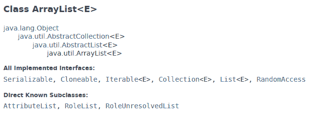
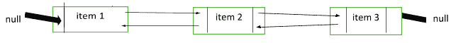
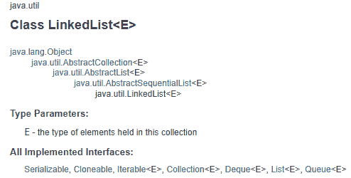

# ArrayList 和 LinkedList 的区别[更新]

> 原文：<https://hackr.io/blog/arraylist-vs-linkedlist>

你想知道数组列表和链接列表的区别吗

列表提供了操作、存储和检索数据的简单方法。列表在所有编程语言中广泛使用，如 C、C++、Java、Python 等。…列表是从通用集合接口扩展而来的接口。

在本文中，我们将通过示例了解 Java 中使用的 ArrayList 和 LinkedList，然后继续比较它们，以了解它们在不同情况下的用法。

## **什么是数组列表？**

ArrayList 是最简单的列表，可以存储不同类型的数据。要理解 ArrayList，请考虑存储在数组中的以下数据

```
String[] names = new String[5];
names[0] = "Mac";
names[1] = "Jony";
names[2] = "Mary";
names[3] = "Donald";
names[4] = "Phoebe";
```

其中，Student 是一个保存大学学生信息的类，如姓名、年龄、科目、平均分数、电子邮件 id、性别，以及他们是否有明显的标志。

每个学生的详细资料都存储在一个名为。数组大小固定为 5。但是，如果学生超过 5 个会怎么样呢？

有了 ArrayList，这个问题就不会出现了。ArrayList 是一个动态数组，它的大小会随着元素数量的增加而增加。

```
ArrayList<String> namesList = new ArrayList();
namesList.add("Mac");
namesList.add("Jony");
namesList.add("Mary");
namesList.add("Donald");
namesList.add("Phoebe");
```

如我们所见，列表没有初始大小。它可以随着列表的增长添加元素。事实上，使用 ArrayList，任何类型的操作都很容易。如果您想要访问列表中的任何元素，您可以使用索引轻松地获得它。第一个索引始终为零。假设您想将姓名“Mary”替换为“Maryln ”,您可以执行以下操作

```
namesList.remove(namesList.get(2));
namesList.add(2, "Maryln");
```

我们已经删除了以前的名称，并在同一位置添加了新名称。您也可以在任何位置添加元素。举个例子，

```
namesList.add(2, "Joseph");
```

这不会替换' Maryln ',但会将其移动到下一个索引。如果您打印该列表，您将获得–

```
[Mac, Jony, Joseph, Maryln, Donald, Phoebe]
  0   1 2       3 4        5
```

这意味着容纳“约瑟夫”，所有其他元素已被转移到右边。同样的，当我们移除 Mary 时，所有其他元素都必须移到左边。

在 ArrayList 中重复值是完全可以接受的。如果我们添加另一个同名的元素，列表的大小将会增加，值将会显示出来而不会有任何问题。

ArrayList 实现了 List 接口，该接口又扩展了接口集合。集合由 Iterable 接口扩展。数组列表的层次结构如下



来源: [Javadocs](https://docs.oracle.com/javase/8/docs/api/java/util/ArrayList.html)

使用 Java .util.Collections 类的 sort 方法，用 ArrayList 对对象进行升序或降序排序也很容易。

ArrayList 是不同步的，这意味着如果多个线程同时更改一个列表，结果可能是不可预知的。我们也可以给一个 ArrayList 加一个 null 的值，这个值会在它的位置显示为“null”。

### **推荐课程**

[JavaScript 数组方法和对象数据结构](https://click.linksynergy.com/deeplink?id=jU79Zysihs4&mid=39197&murl=https%3A%2F%2Fwww.udemy.com%2Fcourse%2Fjavascript-arrays%2F)

## **什么是** **LinkedList？**

LinkedList 是一种线性数据结构，其中列表的每个元素都被称为一个节点，该节点包含元素值以及指向上一个和下一个节点的指针。在 Java 中，LinkedList 在内部实现为双向链表(虽然，Java 也支持单向链表)。在双向链表中，除了包含节点的实际值之外，每个节点都有对其下一个和上一个节点的引用。下面是一个表示双向链表的简图——



每个项目左边的分界线表示上一个指针，右边的分界线表示下一个指针。项目 1 的前一个节点指针为空，而下一个指向列表中的项目 2。项目 2 具有指向项目 1 的前一个指针和项目 3 的下一个指针。因为项目 3 是最后一个元素，所以(项目 3 的)下一个指针为空，并且(项目 3 的)前一个指针与项目 2 的下一个指针相同。这意味着两者都是相同的值，并决定了列表的顺序。

其他类型的链表是单向链表和循环链表。

LinkedList 与 ArrayList 具有相同的功能。例如，您可以使用 get( <index>)方法使用 index 来获取 can 对象，您可以添加、删除元素并根据需要存储任意多的对象。编码时，你不会看到 ArrayList 和 LinkedList 有太大的区别。我们前面的例子，当用 LinkedList 执行时如下所示</index>

```
LinkedList<String> lnkdlst = new LinkedList<String>();
lnkdlst.add("Mac");
lnkdlst.add("Jony");
lnkdlst.add("Mary");
lnkdlst.add("Donald");
lnkdlst.add("Phoebe");
lnkdlst.add("Mac");
System.out.println("The first element is - " + lnkdlst.get(0));
System.out.println("The last element is - " + lnkdlst.get(lnkdlst.size()-1));
Collections.sort(lnkdlst);
System.out.println("Sorted linked list - " + lnkdlst);
lnkdlst.add(1, "Joana");
lnkdlst.remove("Mac");
System.out.println("After additions and deletions - " + lnkdlst);
```

您会注意到，我们可以添加重复项，并且在索引位置“1”添加了名称“Joana”。如果我们不指定任何索引，元素将被添加到列表的末尾。可以在 LinkedList 中的任何地方进行插入，而不必改变每一项的索引——只需要更新指针——因此速度更快。

如果您运行上面的代码，下面是示例输出-

```
The first element is - Mac
The last element is - Mac
Sorted linked list - [Donald, Jony, Mac, Mac, Mary, Phoebe, Steve]
After additions and deletions - [Donald, Jony, Mac, Mary, Phoebe, Steve, Joana, null]
```

就像 ArrayList 一样，LinkedList 也是不同步的，可以保存空值。

下面是 LinkedList 的层次结构——



来源—[Javadocs](https://docs.oracle.com/javase/7/docs/api/java/util/LinkedList.html)

这是第一个区别 ArrayList 只实现 List，LinkedList 同时实现 List 和 Queue！因此，LinkedList 是 dequee 和 List 的实现，它也继承了 dequee 的某些方法。一个常见的例子是 descendingIterator()方法，它在 ArrayList 中不存在。这个方法颠倒了列表的顺序并返回一个迭代器，即元素将从头到尾显示

```
Iterator itr = lnkdlst.descendingIterator();
while (itr.hasNext()) {
             System.out.println("Value is : " + itr.next());
      }
```

然而，这并没有改变原来的链表。

### 什么是德雀？

Deque 是一个双端队列。通过实现 Deque，LinkedList 可以用作堆栈、列表或队列。如果你想了解更多 LinkedList 的附加功能，[这个页面](https://dzone.com/articles/linked-list-journey-continues)提供了一些很好的见解。

### 什么时候使用数组列表？

如果项目或应用需要更多的搜索操作，而不是执行像添加或删除这样的更新，那么必须使用数组列表而不是链表，因为它需要一个常数时间，即搜索操作的时间复杂度为 O(1 ),而链表的复杂度为 O (n/2)。

### 什么时候使用链表？

如果项目或应用程序需要更多的更新操作，如添加或删除元素，而不是执行搜索，则必须使用链表而不是数组列表，因为更新操作需要恒定的时间。链表连同操作也提供了一个出列

数组列表没有实现的操作。链表类有一个 Deque 接口来获得 Linked List 中双端队列的功能。ArrayList 类不实现 Deque 接口。

## **头头比较:Java 中的 Arraylist vs linked list**

现在我们对两者都有了一些了解，让我们来看看它们的区别:

| **阵列列表** | **链接列表** |
| 实现为动态数组，使用对象数组按顺序存储元素 | 实现为双向链表(在 Java 中)，由指向上一个和下一个节点的指针组成。 |
| 实现列表接口 | 实现 List 和 Deque(双端队列),这为它提供了额外的功能 |
| 使用索引更快地存储和访问数据 | 检索和存储有点慢，因为列表必须遍历每个节点来识别正确的节点。 |
| 移除和添加很慢，因为所有其他项目都必须相应地向左或向右移动。 | 更快、更有效地进行数据操作，如在列表的任何部分添加和删除元素 |
| 在遍历列表时删除一个项目会比较慢，因为所有其他元素都必须被打乱，以填充被删除元素在列表中造成的空隙 | 迭代时删除元素很简单，只需调整下一个和上一个节点。 |
| 可以使用 ArrayList(int capacity)构造函数指定初始 ArrayList 的大小。该大小仍然可以在以后增长，但是，可以设置一个初始数量。如果不超过指定的容量，ArrayList 的工作速度甚至会更快。 | LinkedList 仅支持无参数构造函数–linked list() |
| 没有提供 Queue 或 Deque 方法。 | 实现了 Deque，它提供了 descendingIterator()，该函数返回具有逆序列表值的迭代器。类似 peek()、poll()和 offer()(及其变体)这样的方法也是可用的，这样列表就像一个队列。 |
| ArrayList 不能用作堆栈。 | 由于 Deque 还支持 push()、peek()和 pop()方法，因此 LinkedList 可以用作堆栈。 |

## **结论**

虽然这个问题没有正确或错误的答案，但它肯定取决于您的要求。如果你不打算在列表创建后修改太多，ArrayList 是一个更好的选择。如果涉及大量操作，LinkedList 会更快。LinkedList 还有许多其他特性，因为它实现了一个 Deque 接口，这是一个额外的优势。这两种数据结构在其他语言中遵循相同的原则，如 [C 或 C++](https://hackr.io/blog/difference-between-c-and-cplusplus) 。点击了解更多关于数据结构[的信息。](https://hackr.io/tutorials/learn-data-structures-algorithms?ref=blog-post)

**人也在读:**