# 2023 年 12 门最佳人工智能课程

> 原文：<https://hackr.io/blog/artificial-intelligence-courses>

人工智能是世界的未来。这些天来，每个应用程序和每个网站都在使用人工智能来实现其大部分功能。它们被用于面部识别锁，注册和验证你的交易安全性，最近，甚至将你的脸放在游戏和非游戏应用程序的各种角色上。人工智能让这一切成为可能，甚至更多。

人工智能是你需要掌握的一项有用技能，尤其是因为它现在风靡一时，就像几年前的[网络热潮](https://en.wikipedia.org/wiki/Dot-com_bubble)。雇主正在寻找拥有不同技能的人，特别是那些能够帮助他们的公司进入下一代的人。

如果你正在考虑学习人工智能和机器学习，不妨试试下面的人工智能课程。

## **最佳人工智能课程**

我们编制了一份由顶级大学和在线论坛提供的最佳人工智能课程(最佳人工智能课程)列表，以帮助你获得这一专业知识，并在巨大的飞跃中进一步实现你的职业目标。

[**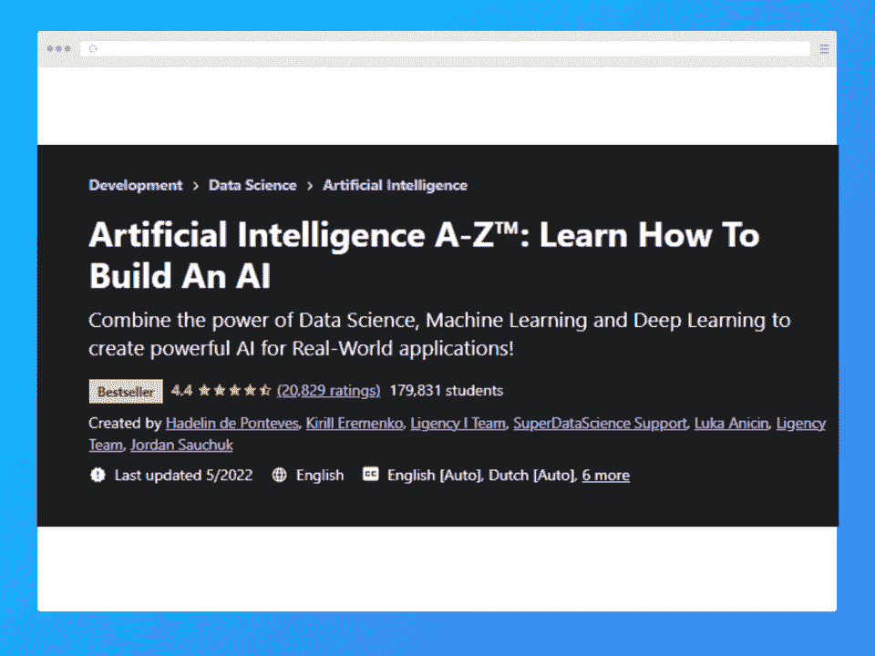**](https://click.linksynergy.com/deeplink?id=jU79Zysihs4&mid=39197&murl=https%3A%2F%2Fwww.udemy.com%2Fcourse%2Fartificial-intelligence-az%2F&u1=blog%2Fartificial-intelligence-courses_amcid-bs6NZZbgxBO2O2mxbxrPi)

这门课程提供了人工智能的全面知识，如机器学习、数据科学和深度学习，以创建现实世界应用的人工智能设计。

本课程涵盖以下主题:

*   人工智能及其应用。
*   人工智能设计。
*   直觉 Q 学习、深度 Q 学习和深度卷积 Q 学习。
*   学习使用 A3C。
*   控制高级人工智能模型。
*   建造虚拟自动驾驶汽车。
*   人工智能编程来测试游戏并击败它们。
*   利用各种 AI 设计积极解决世界上的现实问题。

候选人可以应用他们在人工智能方面的广泛知识来设计现实世界的应用程序，并在课程结束后进行销售。他们还可以申请高级人工智能编程的工作，并在现实世界中帮助开发人工智能技术。

如果你是全新的人工智能，这个人工智能培训课程可以帮助你从头开始。

**必备:**Python 和高中数学基础知识。

**等级:**初学者到专家

**评级:** 4.3

**时长:** 16 小时 30 分钟

**价格:**

*   常规全价为 129.99 美元。打折时，这门课的价格大约在 25 美元到 30 美元之间。
*   该课程也可通过 Udemy 的个人订阅计划获得，费用为 29.99 美元(在最初的七天试用后)。

[查看课程](https://click.linksynergy.com/fs-bin/click?id=jU79Zysihs4&offerid=1045023.20079&type=3&subid=0)

[**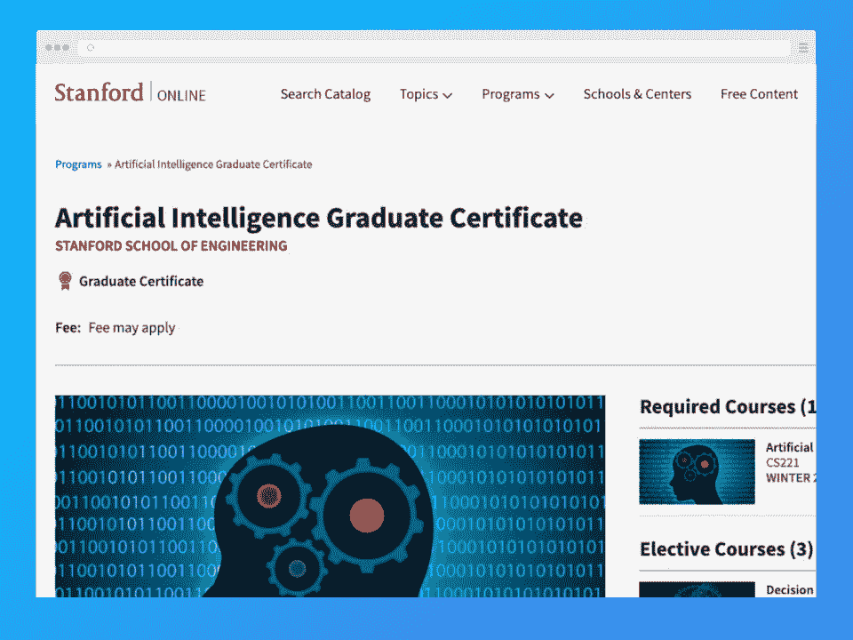**](https://online.stanford.edu/programs/artificial-intelligence-graduate-certificate)

这是最好的人工智能课程，是计算机编程和语言编程学生以及最终从事人工智能工作的软件工程师的理想选择。你可以在著名教授吴恩达的指导下获得斯坦福大学的 AI 认证。

本课程涵盖以下主题:

*   [机器学习](https://hackr.io/blog/what-is-machine-learning-definition-types)，知识表示。
*   逻辑和概率模型。
*   机器人学、自然语言处理和视觉学习。

(建议将这些课程与涉及高级[统计学和概率](https://hackr.io/blog/statistics-for-data-science)的课程配对，以便更好地理解主题)

完成该课程后，学习者可以申请人工智能编程、机器人工程、构建实用人工智能及其在商业模块中的应用的工作。

可以说，如果你想从一个著名的机构获得你的课程，这是在争夺最佳人工智能课程。

**先决条件**

*   平均绩点 3.0 或更高的学士学位。
*   对高等概率的理解。
*   高等统计和高等线性代数。
*   具有用 C/C++、Java、Python 或其他类似语言对进行编程的经验。

**等级:**中级

**评级:** 4.8

**持续时间:**取决于选择的单位数量。

**价格:** [见此链接](https://online.stanford.edu/graduate-education-tuition-admission)

[查看课程](https://online.stanford.edu/programs/artificial-intelligence-graduate-certificate)

[**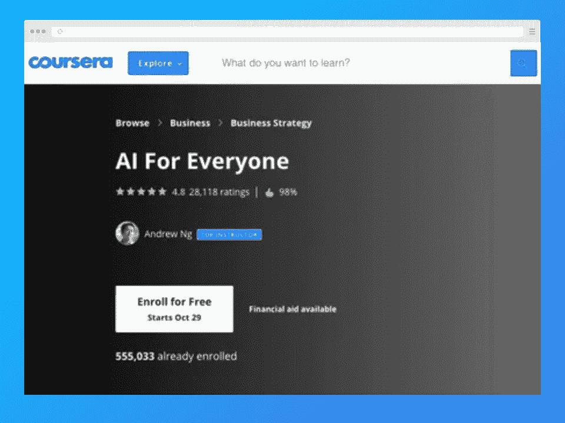**](https://click.linksynergy.com/deeplink?id=jU79Zysihs4&mid=40328&murl=https%3A%2F%2Fwww.coursera.org%2Flearn%2Fai-for-everyone&u1=blog%2Fartificial-intelligence-courses_amcid-seeibYbegppYUeBxq7eme)

这门课程由 deeplearning.ai 提供，由谷歌大脑的创始领导人、斯坦福大学著名兼职教授 Andre Ng 建立。这是最好的在线人工智能课程之一，一旦你完成，就会给你一个证书。

本课程涵盖以下主题:

*   机器学习及其功能。
*   机器学习的技术诀窍和深度学习的非技术解释。
*   有助于掌握新的和困难的概念的小测验

课程完成后，学生可以评估他们参加人工智能深入教育的进一步课程的选择，以获得更好的工作机会，并与未来技术合作。

**先决条件:**无

**等级:**初学者

**评级:** 4.8

**持续时间:** 6 小时

**价格:**

*   以 49 美元的一次性费用(包括证书)购买课程，或
*   仅审核的免费访问(访问除评分项目之外的所有课程材料)

[查看课程](https://click.linksynergy.com/deeplink?id=jU79Zysihs4&mid=40328&murl=https%3A%2F%2Fwww.coursera.org%2Flearn%2Fai-for-everyone&u1=blog%2Fartificial-intelligence-courses_amcid-seeibYbegppYUeBxq7eme)

[**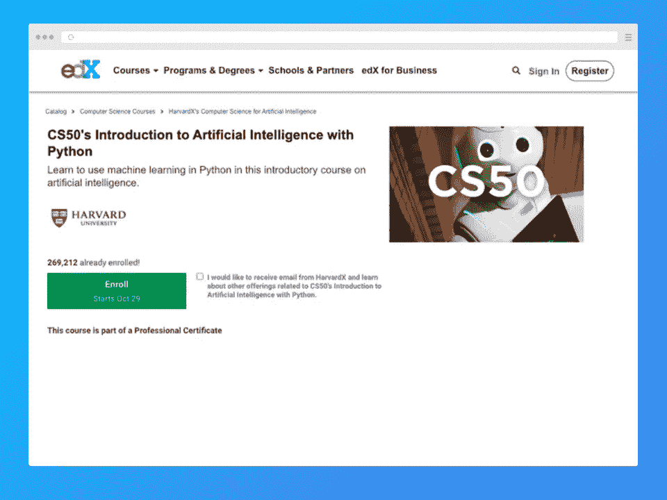**](https://edx.sjv.io/c/2890636/1598007/17728?u=https%3A%2F%2Fwww.edx.org%2Fcourse%2Fcs50s-introduction-to-artificial-intelligence-with-python)

哈佛大学带来了这个不可思议的机会，获得了使用 Python 理解和实现使用复杂数学概念的人工智能技术的认证证书。

本课程涵盖以下主题:

*   概率论和逻辑推理来理解创造人工智能驱动设备的过程。
*   机器学习、强化学习、神经网络和各种其他技术的知识，以处理用于构建人工智能的数据。
*   使用贝叶斯网络和马尔可夫模型。
*   使用图形搜索算法。
*   创建约束满足设计。

你最后得到哈佛的验证认证，帮助学生申请 AI 编程、数据科学等方面的工作。薪水更高。如果你想加入一些 AI 课程，这当然是一个不错的选择。

**先决条件:**有 Python 编程经验，最好是 CS50。

**等级:**初学者

**评级:** 4.8

**持续时间:** 7 周，每周 10 小时

价格:免费，但可以选择升级(通常是为了获得证书)

[查看课程](https://www.awin1.com/cread.php?awinmid=6798&awinaffid=428263&ued=https%3A%2F%2Fwww.edx.org%2Fcourse%2Fcs50s-introduction-to-artificial-intelligence-with-python)

[**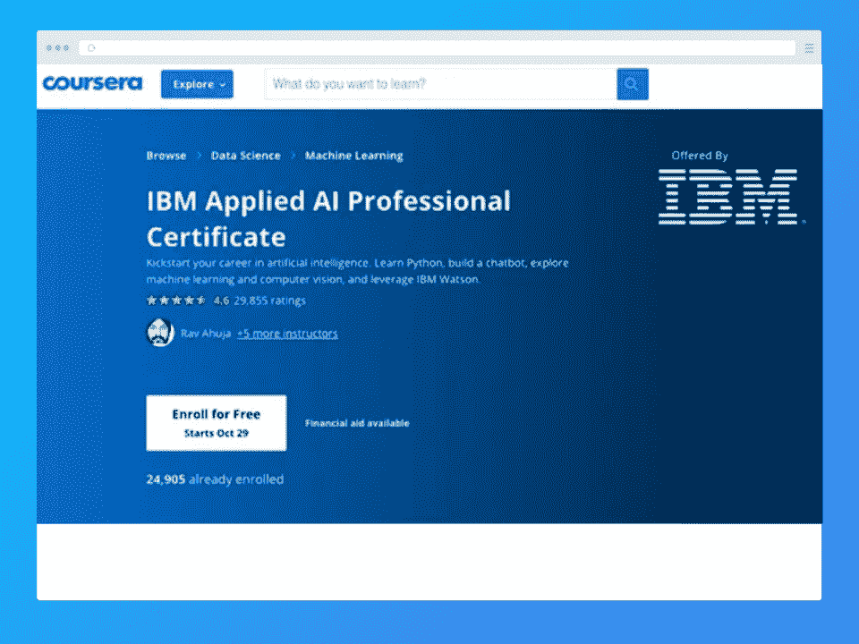**](https://coursera.pxf.io/b3rOqb?subId3=blog%2Fartificial-intell_amcid-IxOzZIprJ6zUiYqgMVleM)

IBM 提供了这个绝佳的机会来指导人们使用 Python，为他们的业务创建虚拟助手和聊天机器人，并了解神经网络、机器学习和深度学习。

本课程涵盖以下主题:

*   通过 API、Python 和 IBM 的 Watson AI 服务，使用最少的编码创建人工智能驱动的程序。
*   虚拟助理和聊天机器人，在没有实体客户支持的情况下为客户提供帮助。
*   应用视觉技术上传各种设计和分类模型。

在本认证课程结束时，学习者将获得深入的人工智能知识。他们可以申请数据科学、机器响应、人工智能生成等方面的工作。此外，获得 IBM Watson AI 并学习使用它可以支持在他们的业务中创建更好的人工智能辅助水平。

**先决条件:**本程序无先决条件。

**等级:**初学者

**评级:** 4.6

**持续时间** : 7 个月，每周 4 小时

价格:七天免费试用，然后每月 39 美元，直到你完成(包括证书)

[查看课程](https://coursera.pxf.io/b3rOqb?subId3=blog%2Fartificial-intell_amcid-IxOzZIprJ6zUiYqgMVleM)

[**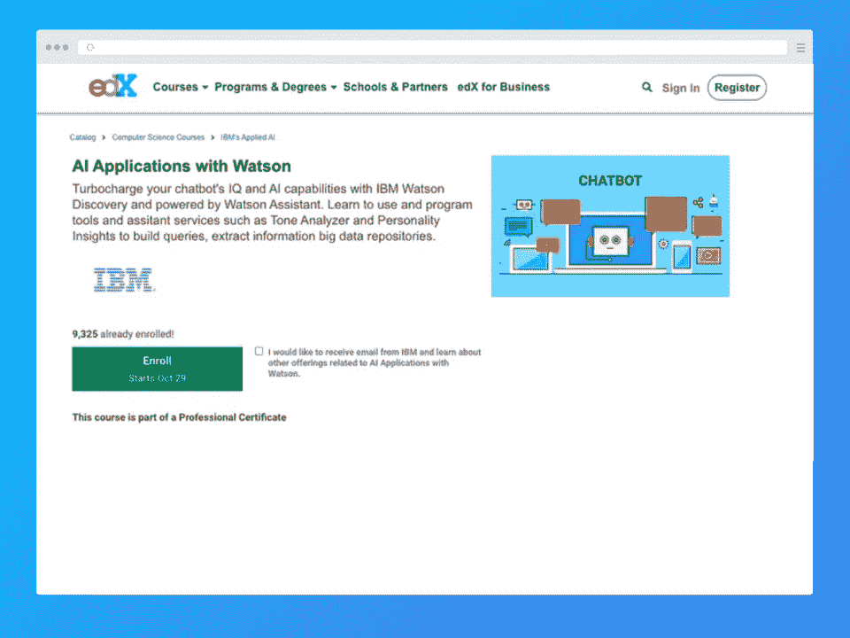**](https://www.awin1.com/cread.php?awinmid=6798&awinaffid=428263&ued=https%3A%2F%2Fwww.edx.org%2Fcourse%2FAI-applications-with-watson)

本课程提供了对 IBM 的沃森的彻底理解和应用，以创建更智能的人工智能程序，实现更真实和人性化的响应和功能。

本课程涵盖以下主题:

*   编程 AI 来转录和评估大数据集，并应用特定的功能来提高效率。
*   聊天机器人通过沃森的发现自动提高智商，从而抓住不满。
*   设计 Watson 来分析音调和客户偏好。

完成课程后，报名参加该课程的人可以设计高级聊天机器人和虚拟助理来解决客户和获取必要的数据。对 IBM Watson 的全面了解会给你的简历和履历增加额外的分数，同时获得 IBM 的认证。

**先决条件:**无

**等级:**中级

**评级:** 4.6

**持续时间:** 3 周，每周 2-4 小时

价格:免费，但可以选择升级(通常是为了获得证书)

[查看课程](https://www.awin1.com/cread.php?awinmid=6798&awinaffid=428263&ued=https%3A%2F%2Fwww.edx.org%2Fcourse%2FAI-applications-with-watson)

[**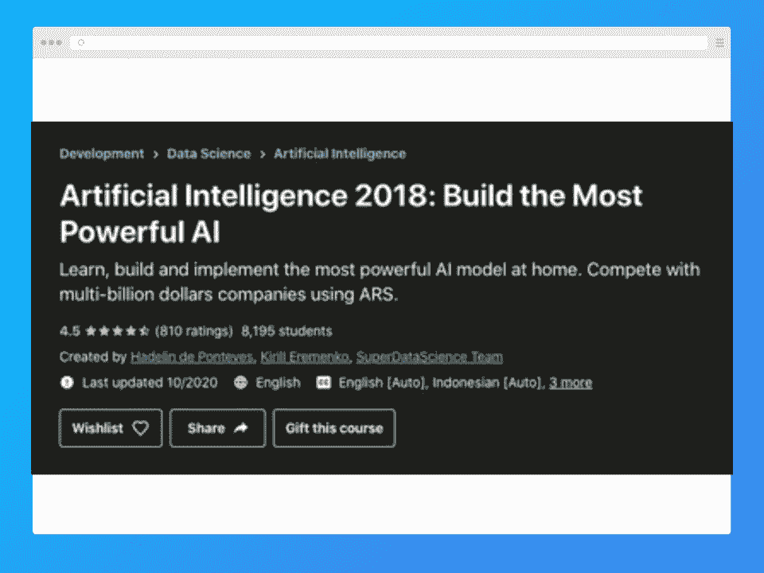**](https://click.linksynergy.com/deeplink?id=jU79Zysihs4&mid=39197&murl=https%3A%2F%2Fwww.udemy.com%2Fcourse%2Fartificial-intelligence-ars%2F&u1=blog%2Fartificial-intelligence-courses_amcid-PxNJb3eOYU7ZmzoZbZOUF)

本课程提供了跨国公司用于构建高级人工智能模型的增强随机搜索(ARS)知识

本课程涵盖以下主题:

*   学习构建人工智能编程。
*   编写强大的人工智能算法。
*   ARS 的理论和应用以及如何在现实世界中使用该算法。
*   准备 AI 模型执行类似 Google Deep Mind 的任务，解决各种问题。

课程结束后，候选人可以申请人工智能编程的工作，或者将知识应用于创建人工智能程序，与谷歌 Deep Mind 竞争解决复杂问题。

**先决条件:**Python 编码和脚本的知识，基础数学，以及运行 Anaconda 的兼容 PC。

**等级:**中级

**评级:** 4.5

**持续时间:** 5 小时

**价格:**

*   常规全价是 109.99 美元。打折时，这门课的价格大约在 10 美元到 15 美元之间。
*   该课程也可通过 Udemy 的个人订阅计划获得，费用为 29.99 美元(在最初的七天试用后)。

[查看课程](https://click.linksynergy.com/deeplink?id=jU79Zysihs4&mid=39197&murl=https%3A%2F%2Fwww.udemy.com%2Fcourse%2Fartificial-intelligence-ars%2F&u1=blog%2Fartificial-intelligence-courses_amcid-PxNJb3eOYU7ZmzoZbZOUF)

[**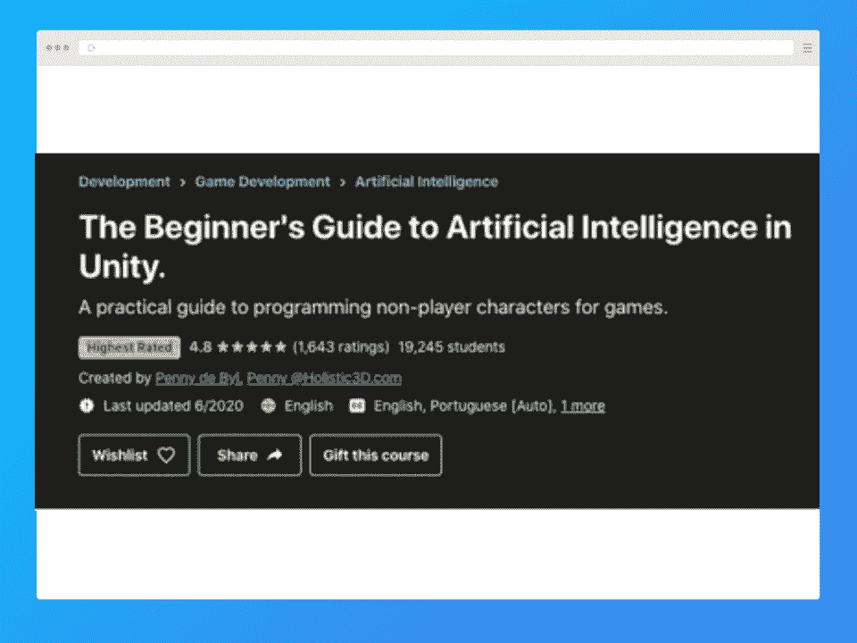**](https://click.linksynergy.com/deeplink?id=jU79Zysihs4&mid=39197&murl=https%3A%2F%2Fwww.udemy.com%2Fcourse%2Fartificial-intelligence-in-unity&u1=blog%2Fartificial-intelligence-courses_amcid-7PF2VmEJ7lVNIxJzleJI3)

本课程解释了如何使用 C#在 Google Play 和 App store 游戏中创建和导航非玩家角色。本课程包括编程 NPC 并在现有软件中实现它们，以及学习导航 NPC 和程序决策能力。

本课程涵盖以下主题:

*   向量数学。
*   实现向不同方向移动角色和导航到目标位置的向量。
*   Unity 的车辆系统和航路点系统来导航汽车和创建赛车程序。
*   通过图形和路径搜索深入了解路点，并在 2D 创建路点。
*   从航路点穿越到导航网格，学习在导航网格上制作动画，并同步不同大小的代理速度。
*   流浪、逃离、躲藏、寻求追求等复杂的行为模式。
*   人群模拟变出城市人群，并引导他们完成各种挑战。
*   将有限状态机转换为在 NavMesh 上运行。
*   介绍行为树，通过精心设计节点来影响行为痛苦。
*   面向目标的动作游戏和添加动作，以执行全局状态和多个主机。

完成课程后，你可以在游戏编程中应用这些技术，或者修改现有游戏中的 NPC 行为。然后你可以申请游戏设计、游戏测试等方面的工作。

**先决条件:**有 C#使用经验，熟悉 Unity 游戏开发引擎。

**等级:**初学者

**评级:** 4.5

**时长:** 10 小时 50 分钟

**价格:**

*   常规全价是 19.99 美元。打折时，这门课的价格大约在 10 美元到 12 美元之间。
*   该课程也可通过 Udemy 的个人订阅计划获得，费用为 29.99 美元(在最初的七天试用后)。

[查看课程](https://click.linksynergy.com/deeplink?id=jU79Zysihs4&mid=39197&murl=https%3A%2F%2Fwww.udemy.com%2Fcourse%2Fartificial-intelligence-in-unity&u1=blog%2Fartificial-intelligence-courses_amcid-7PF2VmEJ7lVNIxJzleJI3)

[**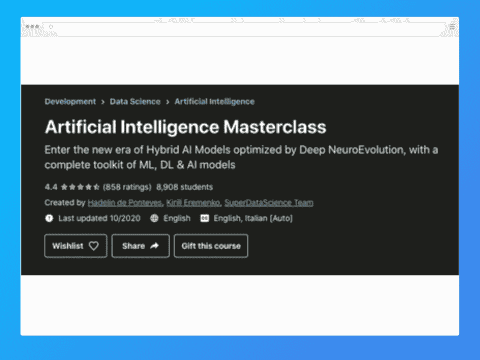**](https://click.linksynergy.com/deeplink?id=jU79Zysihs4&mid=39197&murl=https%3A%2F%2Fwww.udemy.com%2Fcourse%2Fartificial-intelligence-masterclass%2F&u1=blog%2Fartificial-intelligence-courses_amcid-3Is6s3EAVOzer7UNJIQiE)

本课程是学习如何构建强大的人工智能和混合人工智能模型的终极包。

本课程涵盖以下主题:

*   理解和实现全连接神经网络。
*   使用遗传算法、进化策略和政策梯度。
*   递归神经网络和神经进化的深度学习
*   练习混合密度网络和更高级的公式，让你成为一个 apt AI 程序员。
*   构建混合智能系统。

随后，学生将具备执行创新和进步的编程的能力，以满足技术不断变化的需求。他们可以获得最有用的工具来创建高级人工智能模型，并将其应用于数据科学和人工智能中更关键的工作角色。

**先决条件**

*   高中数学知识
*   编码经验

**等级:**高级

**评级:** 4.4

**持续时间:** 12 小时

**价格:**

*   常规全价是 109.99 美元。打折时，这门课的价格大约在 10 美元到 15 美元之间。
*   该课程也可通过 Udemy 的个人订阅计划获得，费用为 29.99 美元(在最初的七天试用后)。

[查看课程](https://click.linksynergy.com/deeplink?id=jU79Zysihs4&mid=39197&murl=https%3A%2F%2Fwww.udemy.com%2Fcourse%2Fartificial-intelligence-masterclass%2F&u1=blog%2Fartificial-intelligence-courses_amcid-3Is6s3EAVOzer7UNJIQiE)

[**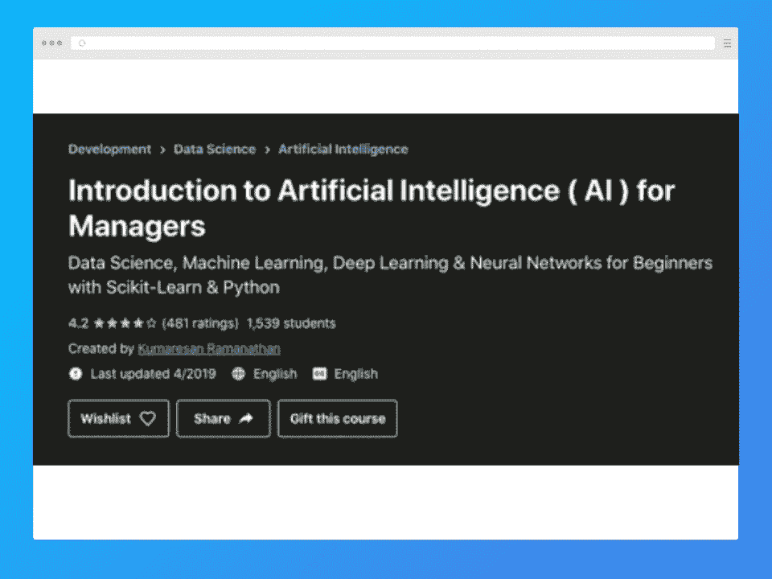**](https://click.linksynergy.com/deeplink?id=jU79Zysihs4&mid=39197&murl=https%3A%2F%2Fwww.udemy.com%2Fcourse%2Fintro-ai-for-managers%2F&u1=blog%2Fartificial-intelligence-courses_amcid-slsVgiegxsEMbx6JlgU2I)

你想知道多层神经网络是如何自动学习和适应的吗？这门课程通过深入的机器学习和深度学习算法，让你完整地洞察 AI 的技术层面。

本课程涵盖以下主题:

*   识别机会和使用人工智能来推进你的商业项目的技术。
*   教授如何更有效地管理人工智能项目以获得优异的结果。
*   防止各种适合度不足和过度适合度的候选资格问题，并规范业务模块
*   用 Python 编码并使用 Scikit 库更高效地编程。
*   卷积神经网络、多层神经网络、递归神经网络和深度学习过程

完成本课程后，学生将学习优化他们的业务环境，以获得最大的效用和产出。他们也将擅长管理人工智能项目。

**必备:**数学和算法的基础知识及其技术描述。

**等级:**初学者

**评级:** 4.3

**持续时间:** 1 小时 50 分钟

**价格:**常规全价 29.99 美元。减价时，这道菜的价格约为 10 美元。

[查看课程](https://click.linksynergy.com/deeplink?id=jU79Zysihs4&mid=39197&murl=https%3A%2F%2Fwww.udemy.com%2Fcourse%2Fintro-ai-for-managers%2F&u1=blog%2Fartificial-intelligence-courses_amcid-slsVgiegxsEMbx6JlgU2I)

[**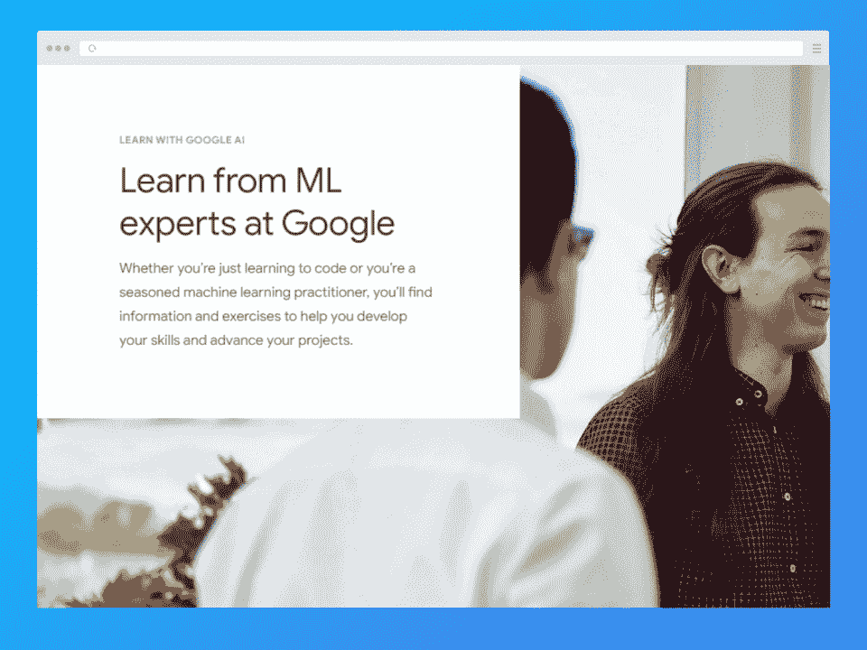**](https://ai.google/education/)

谷歌设计了一个教育计划，帮助人们识别人工智能的使用，以推动我们各个社区的社会议程。

本课程涵盖以下主题:

*   对机器学习、人工智能探索、推荐系统和数据聚类有基本的理解。
*   如何测试调试机器学习，准备数据？
*   负责任地使用人工智能造福社会。

学生能够熟练地帮助社交媒体网站防止基层的各种差异。它使人们具备个人防止黑客攻击和侵犯的知识，并识别系统中的不一致性。

**先决条件:**本课程无先决条件。

**等级:**初学者

**评级:** 4.0

**时长:**约 4 小时/主题

**价格:**免费

[查看课程](https://ai.google/education/)

[**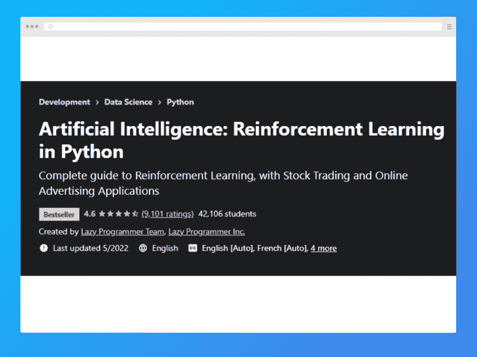**](https://click.linksynergy.com/deeplink?id=jU79Zysihs4&mid=39197&murl=https%3A%2F%2Fwww.udemy.com%2Fcourse%2Fartificial-intelligence-reinforcement-learning-in-python&u1=blog%2Fartificial-intelligence-courses_amcid-VmE6IJAmbYUZQIJJAOVmz)

如果你是一个股票交易者或希望简化你的金融投资，这个课程是为你量身定做的。

本课程涵盖以下主题:

*   理解强化学习以避免机器学习中的琐碎任务。
*   设计强盗程序。
*   贝尔曼方程和 UCB1 代码的使用。
*   理解心理学和它如何影响强化学习的关系。

学生将能够编写自己的机器人来观察和分析股票市场的模式，从而在完成课程后获得更高的回报。这是一个特别有用的工具，可以获得很大的投资回报。

**先决条件**

*   彻底理解微积分，线性回归，概率，梯度下降。
*   Python 和 Numpy 编码知识。

**等级:**中级

**评级:** 4.6

**时长:** 12 小时 30 分钟

**价格:**常规全价 79.99 美元。打折时，这门课的价格大约在 10 美元到 15 美元之间。

[查看课程](https://click.linksynergy.com/deeplink?id=jU79Zysihs4&mid=39197&murl=https%3A%2F%2Fwww.udemy.com%2Fcourse%2Fartificial-intelligence-reinforcement-learning-in-python&u1=blog%2Fartificial-intelligence-courses_amcid-VmE6IJAmbYUZQIJJAOVmz)

## **结论**

这里我们列出了最好的人工智能课程。人工智能正在迅速接管世界。它的技术已经在游戏和个人家居维护中使用。智能汽车和无人机已经在进行部署测试。这是获得这种不可思议的技能并一头扎进革命进程的时候了。你可以成为创造突破性技术的人，让人类今天就走向未来。

## **常见问题解答**

#### **1。哪个人工智能课程最好？**

这取决于你的偏好和需求，以及你具体想学习人工智能的哪些方面。这也取决于你是从什么样的知识水平开始的。这份名单上的 12 门课程包括了一些目前最好的人工智能课程。

#### **2。什么是人工智能课程？**

人工智能课程涵盖了人工智能和机器学习的所有知识。这些课程教授人工智能所需的原理和实用知识，包括自然语言处理、计算机科学、Python、心理学、数学、机器学习和数据科学。

#### **3。人工智能难吗？**

由于涉及到各种组件，如广泛的数学、编程和数据科学，它当然可以。这也涉及到一些复杂性，所以开始学习这个领域可能相当具有挑战性。好消息是，有人工智能培训课程可以提供帮助。

#### **4。谁能学一门人工智能课程？**

几乎任何人！如果你愿意付出努力，你就能学会。但是，某些课程也有一些先决条件。在注册人工智能在线课程之前，确保你有资格，如果你没有，那么首先开始努力达到要求可能是个好主意。

**人也在读:**