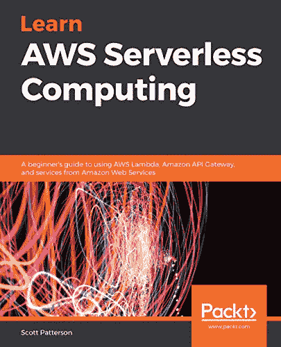
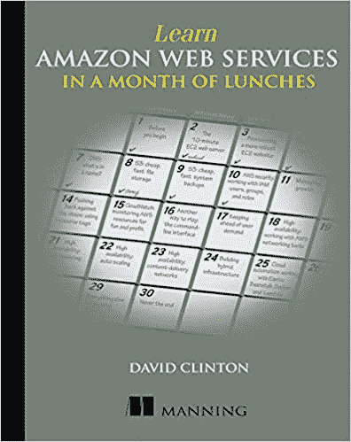
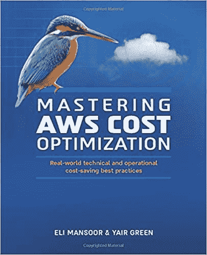

# 初学者和高级程序员的 10 本最佳 AWS 书籍

> 原文：<https://hackr.io/blog/aws-books>

## **什么是 AWS？**

AWS 或**亚马逊网络服务**是最流行的云计算平台。它目前提供大约 175 个功能齐全的服务中心。AWS 是安全的，并提供计算能力、数据库存储、分析、物联网、内容交付和其他功能来帮助企业发展。

AWS 于 2002 年首次推出这项服务。截至 2019 年，它提供了近 100 个**云服务**。AWS 的云计算服务有 EC2(弹性计算云)、LightSail、Elastic beanstalk、AWS Lambda、EKS。

AWS 用于各种应用程序，如应用程序托管、网站托管、媒体共享、搜索引擎、存储、备份和灾难恢复、社交网络、移动应用程序等。

许多顶级公司，如 Pinterest、网飞、Dropbox、Instagram，都使用 AWS。

通过这些课程了解更多关于 AWS [的信息。](https://hackr.io/tutorials/learn-amazon-web-services-aws?ref=blog-post)

## **AWS 学习方法**

AWS 非常庞大，您可能会被它提供的众多特性和服务所淹没。要知道作为初学者，只需要学习几个核心服务就可以了。多练习，专注于你的学习——例如，EC2、S3 和 IAM。首先将你的学习集中在这三个领域，然后再转向其他主题。这样会给你的学习指明方向，让学习变得更容易。

## **最佳 AWS 书籍**

在这里，我们为初学者到高级开发人员列出了 10 本最好的 AWS 书籍:

 这是一本适合初学者以及中级云学习者的好书。它从基础概念开始，然后快速构建复杂的解决方案。作者的语气很容易理解，你会有‘哦，AWS 就是这么回事’的感觉。一边看书。这本书主要关注 AWS Lambda、Amazon API Gateway 和 AWS 的一些服务。

**等级:**初级
**等级:** 5.0

**特性:**

*   这本书从无服务器计算开始，深入到使用 AWS Lambda 的事件驱动应用程序的细节。
*   作者解释了用所有顶级语言编写 Lambda 函数，如 [Java](https://hackr.io/blog/what-is-java) ，C#，Python 和 Node.js。
*   这本书深入到技术细节，所以它更适合开发者和架构师，而不是商业用户。
*   您应该熟悉 Node.js、 [Python](https://hackr.io/blog/python-programming-language) ，并对公共云架构模式、IaaS 有所了解，最好具备 AWS 的工作知识。

你可以在这里买到这本书。

这是对初学者来说最好的书之一。它概括介绍了云计算，然后详细介绍了 AWS。这本书结构严谨，你可以根据需要跳到任何一章。然而，按顺序从一章跳到另一章会帮助你获得更多的知识和概念。这本书不适合有经验的 AWS 用户，因为它只在高层次上涵盖了所有的服务。

**等级:**初级
**等级:** 4.5

**特性:**

*   关于 AWS 的大部分服务的好信息和例子(WordPress)。
*   作者语气和蔼，从他们的亲身经历入手，颇有趣味。
*   为每个概念提供了许多好的和相关的例子。
*   这本书有专门的章节介绍 AWS 的每个重要特性和优势，例如，灵活性、ElastiCache、DynamoDB 等。
*   如果你对云计算完全陌生，甚至不知道术语，这本书是正确的起点。

你可以在这里买到这本书。

 这是一本内容广泛的书，涵盖了 AWS Lambda 及其与无服务器 AWS 服务(S3、DynamoDB 等)的集成。).它适用于 AWS Lambda 的初学者和中级用户。作者更注重概念的解释，而不是代码本身。每一章的最后都有练习，以供实际操作。

**等级:**初级到中级
等级: 4.4

**特性:**

*   书中给出的例子使用了 Java、XML、Maven 和基于 REST 的服务，所以建议了解这些。
*   作者还解释了构建可靠稳定的应用程序所需的最佳实践和工具。
*   作者解释了许多使用 Lambda 的方法和解决方案，并从成本、性能和其他最佳实践等方面对它们进行了比较。

你可以在这里买到这本书。

虽然这本书主要是为清算认证考试而写的，但你可以把它作为参考。它很好地解释了 AWS 的核心原则，并提供了关于网络基础知识的见解。你可以用一些在线(YouTube)视频来补充阅读，详细学习书中解释的概念。您还可以访问在线模拟测试，如果您没有参加考试，它们将有助于测试和增强您的知识。

**等级:**中级
**等级:** 4.4

**特性:**

*   每章末尾都有大量的练习和练习题。
*   用透彻的解释和专家的见解解释关键的考试题目。
*   您还将获得为期一年的 Sybex 在线互动学习环境和学习工具的完整访问权限，包括章节测试、抽认卡、练习考试、题库和词汇表，以方便您的准备并跟踪您的进度。
*   每章都有复习练习，例题场景，以及考试要记住的具体点。
*   直接的导航，因为每一章都有明确的目的和目标，还有详细的索引。

你可以在这里买到这本书。

 这是一本帮助初学者和中级专业人士的综合性基础书籍。作者还提供了从 AWS 获得最佳结果的技巧和诀窍。本书辅以在线培训视频，帮助您设置 AWS 计算、存储、规模、安全性、自动化、网络等。这本书大多是技术性的，所以你应该专注于阅读，慢慢掌握内容。

**等级:**初级
**等级:** 4.3

**特性:**

*   在线培训视频支持全部内容。
*   如果你打算申请 AWS 认证，这本书也是一个不错的选择。
*   AWS 服务、集成和安全操作的实际案例研究。

你可以在这里买到这本书。

 这本书对于那些对 AWS 完全没有概念，从零开始学习，但是很深入的人来说很好。它假设读者是一个新手。如果你有工作知识或了解 AWS 产品，这可能是一个缓慢的阅读，你可以跳过一些章节，作者在书中也提到了。对于新手来说，亚马逊的 AWS 文档并不太清晰，同样的信息被作者以简洁易懂的方式呈现出来。

**等级:**初级
**等级:** 4.1

**特性:**

*   AWS 浩如烟海，但这本书提供了很好的介绍，甚至有趣地解释了干巴巴的话题。
*   即使版本不是很新，一些概念可能已经过时，但核心原则仍然有效，这就是为什么这本书仍然适合初学者。
*   这本书遵循循序渐进的方法，其中前两部分有点理论性，解释了云计算和 AWS 的概念和产品。第 3 部分介绍如何使用 AWS，第 4 部分解释 AWS 和云应用程序的好处。

你可以在这里买到这本书。

 这本书是给初学者的，但你应该对数据库、网络和文件系统的工作原理有所了解。这本书内容丰富，但水平很高。所以，你可以用博客&视频等在线材料来补充你的学习。这本书只关注核心工具。作者不会填鸭式地给你或给你灌输例子；相反，他试图引导你去思考和弄清楚如何做事。

**等级:**初级
**等级:** 4.1

**特性:**

*   这些章节很短，节奏很快，提供了很好的参考。
*   每种工具及其功能都作为一章进行解释，并附有练习(实验)。
*   这本书结构严谨，步步为营，逐一介绍主题。
*   这不是一本纯粹的技术书籍，它为您开始从事 AWS 项目提供了大量的实践机会。

你可以在这里买到这本书。

这本书提供了学习 AWS 的实用方法，作者鼓励你边学边练。这本书还关注一些 DevOps 概念，如 CI/CD 实践及其好处。您将能够学习如何使用 EC2 部署应用程序，以及如何将 AWS 集成到代码管道中。这是一本面向 AWS 开发人员、系统管理员以及 DevOps 工程师的综合性书籍。最好对 Jenkins 和 AWS 有所了解。

**等级:**中级到高级
等级: 3.9

**特性:**

*   技术知识和实用解释的良好结合。
*   快节奏；自始至终没有使用冗长的语言，作者的语气很中肯。
*   涵盖了整整一章关于 Git 的内容，以及为什么它比其他 VCS 更有益。
*   作者在最后一章中介绍了重要的最佳实践和故障排除技巧。
*   读者需要一个 Linux 系统(红帽)和 AWS 账号，才能充分实践书中的内容。

你可以在这里买到这本书。

### **高级 AWS 书籍**

 这是一本结构严谨的实用书籍，有关于成本控制和优化的真实例子和提示。该书提供了技术和运营方面的良好平衡，并详细介绍了如何最佳地优化云基础架构和客户的成本。作者主要关注 AWS 提供的计算存储和网络服务。

**等级:**高级
**等级:** 4.7

**特性:**

*   这本书不仅解释了每个服务是什么，还强调了做出更好的架构选择。
*   这本书向读者介绍了一种名为“KAO”的基础方法，这有助于理解如何优化云服务成本。
*   这本书理论少，实际执行多。
*   对于架构师、开发人员、管理员、经理和商业用户来说都是一本好书。

你可以在这里买到这本书。

虽然这本书侧重于 AWS 云认证考试，但它是一个循序渐进的概念学习的伟大指南。AWS 非常庞大，这本书是一个很好的开始，因为作者确切地知道在 AWS 上启动一个项目并成功实现它需要什么。有许多关于云技术、架构和应用的实际案例研究和深入报道。

**等级:**高级
等级: 4.6

**特性:**

*   细节非常丰富，内容详尽。
*   作者在整本书中给出了大量的插图和例子。
*   案例研究非常出色，提供了 AWS 在各种医疗保健、教育、交通系统等领域的实际应用。
*   第一部分完全集中在核心概念和技术上，包括 Python、Django、REST 等。第二部分涵盖了更高级的安全性、存储和分析概念。第三部分涵盖了 AWS 的架构良好的框架，包括操作、安全性、可靠性、性能和成本优化的最佳实践。

你可以在这里买到这本书。

## **结论**

我们已经讨论了一些学习 AWS 的最佳书籍。我们重复一遍，专注于你想在 AWS 学到的东西；否则，亚马逊提供的这么多服务会让你不知所措。如果你是一个初学者，没有太多的时间学习或者需要立即开始一个项目，“AWS 自动化食谱”或者“Amazon Web Services For Dummies”是一个很好的开始。如果你更喜欢学习，并且想广泛阅读,《云计算解决方案架构师:实践方法》和《学习亚马逊网络服务(AWS ): AWS 云基础实践指南》是不错的选择。学习 AWS，你最喜欢哪本书？下面评论！

[终极 AWS 认证解决方案架构师助理 SAA-C03](https://click.linksynergy.com/deeplink?id=jU79Zysihs4&mid=39197&murl=https%3A%2F%2Fwww.udemy.com%2Fcourse%2Faws-certified-solutions-architect-associate-saa-c03%2F)

**人也在读:**