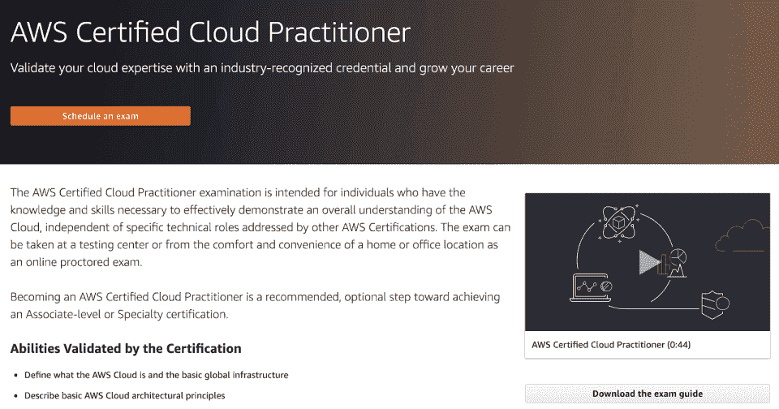
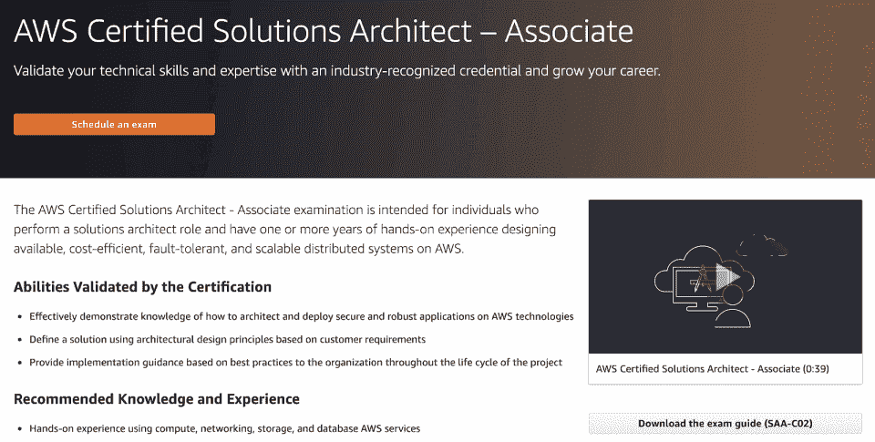
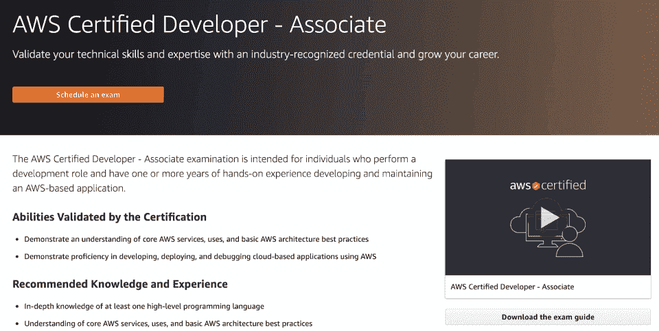
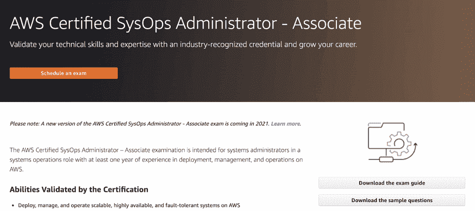
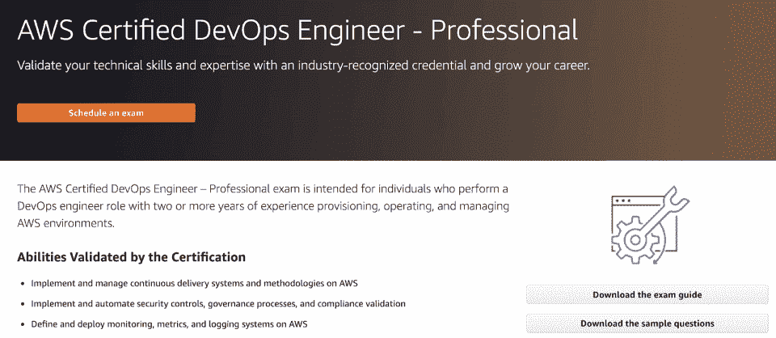
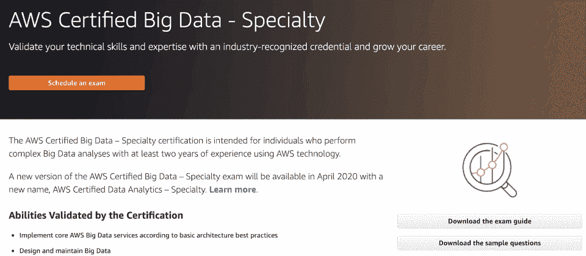
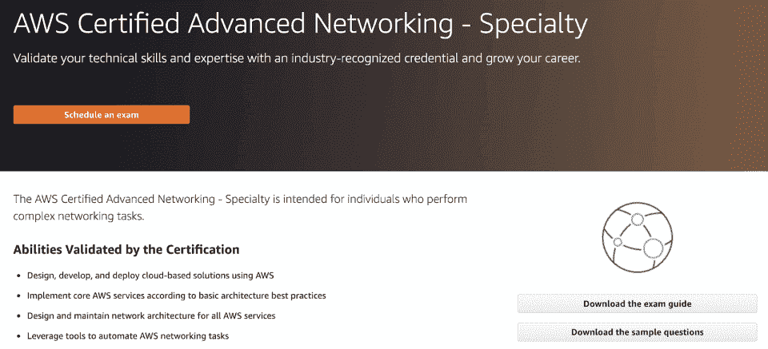
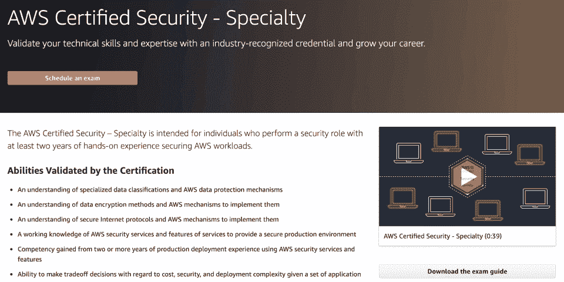
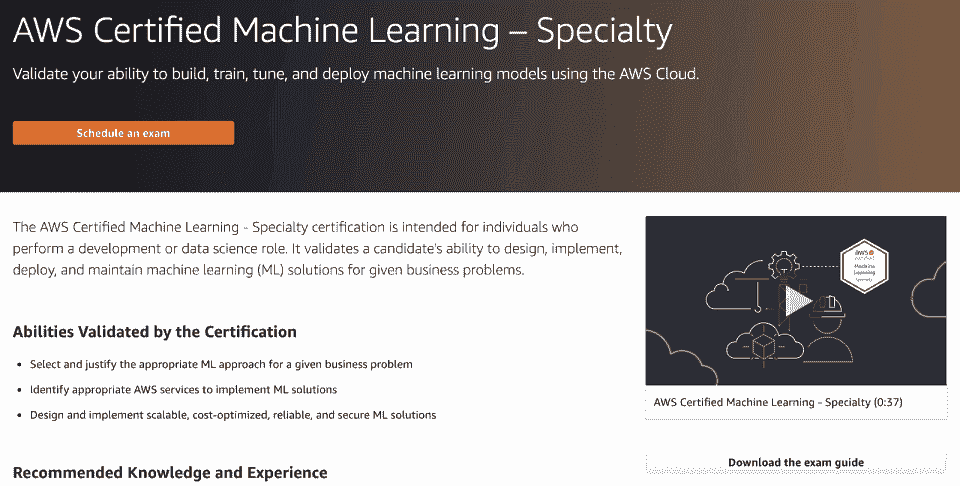
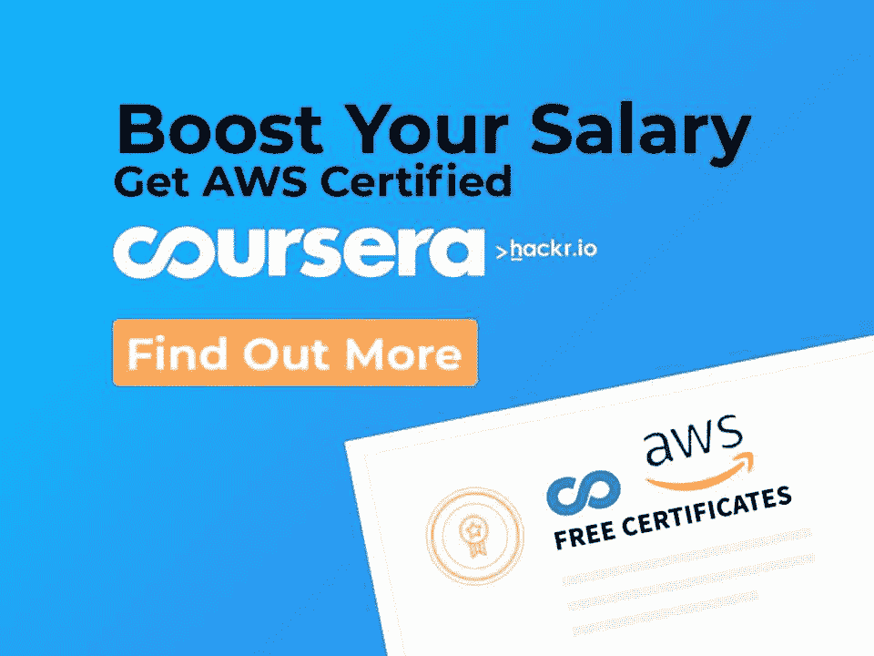

# 2023 年最佳 AWS 认证:选择正确的认证

> 原文：<https://hackr.io/blog/aws-certifications>

随着越来越多的组织将其工作负载转移到公共云，云计算已经从一种可选的珍贵商品发展成为一种必备服务。为您的 AWS 之旅选择最佳的 AWS 认证途径。

仅亚马逊网络服务(AWS)就拥有超过 60%的公共云市场 。因此，不可否认的事实是，AWS 平台是获得认证的最佳平台之一。

在这里，我们涵盖了 2023 年最好的 AWS 认证，列出了一系列各有利弊的选项。

## **2023 年最佳 AWS 认证汇总**

| **认证** | **级别** | **成本** | **考试时长** | **值** |
| AWS 认证云从业者 | 基础 | 100 美元 | 90 分钟 | 好云认证切入点 |
| AWS 认证解决方案架构师 | 关联 | 150 美元 | 130 分钟 | 最佳综合成绩 |
| AWS 认证开发者 | 关联 | 150 美元 | 130 分钟 | 最适合基于云的开发初学者 |
| AWS 认证系统管理员 | 关联 | 150 美元 | 130 分钟 | 做好专业课的准备 |
| AWS 认证解决方案架构师 | 专业 | 300 美元 | 170 分钟 | 最适合云架构师 |
| AWS 认证 DevOps 工程师 | 专业 | 300 美元 | 170 分钟 | 最适合 DevOps 工程师 |
| AWS 认证大数据 | 专业 | 300 美元 | 170 分钟 | 最适合大数据分析 |
| AWS 认证高级网络 | 专业 | 300 美元 | 170 分钟 | 最佳网络解决方案 |
| AWS 认证安全 | 专业 | 300 美元 | 170 分钟 | 应用安全实践的最佳选择 |
| AWS 认证机器学习 | 专业 | 300 美元 | 170 分钟 | 最适合机器学习应用 |

## **什么是 AWS 认证？**

AWS 认证进一步提高了受欢迎的 [云计算](https://hackr.io/blog/what-is-cloud-computing-beginners-guide) 人员的技能，支持公司使用 AWS 为云计划建立有效和创新的团队。这些认证计划包含一系列考试供选择，这些考试基于角色和专业，旨在帮助各个团队和个人实现其独特的目标。

提供的不同基于角色的认证有:

*   云从业者
*   建筑师
*   开发者
*   操作
*   工程师
*   管理员

尽管每项认证考试的考试时间和考试费用各不相同，但所有考试都采用多项选择、多项回答的考试形式。 **认证有效期为两年** ，因此 **专业人员需要在认证期满后重新认证** 。

此外，除了 AWS 认证的 Alexa 技能构建者-专业认证仅提供英语版本外，所有认证测试都提供一些非英语语言版本。AWS 云认证(亚马逊网络服务认证)中的每一个都详细解释如下:

## **为什么 AWS 认证很重要？**

云计算是信息技术行业最热门的趋势。每个组织，无论其规模大小，都热衷于将其应用程序、基础架构、遗留系统转移到云中。这导致行业对云计算专业人才的需求很高。AWS 目前持有大部分股份，获得 AWS 证书会给你带来以下好处:

| **AWS 认证的好处** |
| **数字徽章** | 获得带有认证的数字徽章，您可以在社交媒体和电子邮件签名中使用。您还可以立即参加 AWS 赞助的独家认证活动。 |
| **考试折扣** | 获得 50%折扣券，可用于重新认证或任何其他考试。 |
| **事件识别** | 收到地区答谢酒会的邀请。您还可以使用您的数字徽章获得 AWS 认证休息室的独家访问权，并选择 AWS 峰会活动。 |
| **AWS 认证全球社区** | 访问 AWS 认证的 LinkedIn 社区，与您的同行建立联系。 |
| **自由练习考试** | 使用实践考试优惠券为您的下一次 AWS 认证做准备。 |
| **AWS 认证商店** | 解锁独家 AWS 认证商品。 |

## 哪种 AWS 认证最受欢迎？

坦率地说，目前所有的 AWS 认证都非常抢手。然而，AWS 认证 DevOps 工程师认证和 AWS 认证安全认证似乎是目前最受追捧的。一个侧重于 DevOps 角色，而另一个是教授您云安全最佳实践的专业考试。

## **报酬最高的 AWS 认证是什么？**

这个问题没有直接的答案，因为它取决于工作角色、你的经验和公司本身——就像任何工作机会一样。然而，在 2021 年，一名 AWS 认证解决方案架构师的 [平均工资最高](https://www.globalknowledge.com/us-en/resources/resource-library/articles/how-to-earn-a-top-paying-aws-certification-salary/) 为 161，000 美元。记住，其他认证和相关职位的平均年薪在几千美元以内。

## **2023 年 AWS 认证值得吗？**

AWS 是云计算领域的市场领导者，多家公司都在使用该平台的产品和服务。它将持续增长到 2023 年，因此获得 AWS 认证是绝对值得的。

你有多种认证和专业可供选择，所以你不会受到任何限制。此外，持续学习和发展是 IT 领域职业发展的关键部分，因此 AWS 认证大有帮助。

## 有 AWS 认证就能找到工作吗？

单单一个 AWS 证书本身并不足以获得一份工作，但是几个证书加上实际经验肯定会让你更有竞争力。拥有 IT 领域的经验很重要，但幸运的是，许多雇主愿意接受那些有独立工作经验的人，而不是在公司工作过的人。

[终极 AWS 认证解决方案架构师助理 SAA-C03](https://click.linksynergy.com/deeplink?id=jU79Zysihs4&mid=39197&murl=https%3A%2F%2Fwww.udemy.com%2Fcourse%2Faws-certified-solutions-architect-associate-saa-c03%2F)

## **2023 年最佳 AWS 认证**

目前，AWS 认证级别分为四个类别，共有 11 种认证。

| **基础** | **关联** | **专业** | **专业** |
| 云从业者 | 开发者 | 开发工程师 | 数据分析 |
| 解决方案架构师 | 解决方案架构师 | 数据库 | 系统运行管理员 |
| 机器学习 | 安全 | **基础** | [****](https://aws.amazon.com/certification/certified-cloud-practitioner/) |
| AWS 认证云从业者是一项入门级认证，旨在验证候选人对 AWS 云的理解。这是 AWS 基础认证，您将从这里开始。 | **AWS 认证云从业者需要** 才能获得 AWS 专业认证或助理认证。 | **优点** | **缺点** |

#### 学习 AWS 基础知识的良好基础课程

你需要更多的证明才能被认为是可雇佣的

实惠

从开始需要一些 AWS 方面的经验

|  | **先决条件:** |
| 基本了解 AWS 云平台中的 IT 服务及其应用 | 至少 6 个月的普通 AWS 云经验，担任任何职位:财务、管理、采购、销售或技术 |
| **考试详情:** | **成本** |

100 美元

**可用语言**

*   英语/日语/韩语/简体中文
*   **时间**

90 分钟

| **主题:** | 底层安全性和合规性，安全的共同责任模式 |
| 核心部署和工作原理 | 基本 AWS 服务及其日常使用案例 |
| 基本 AWS 架构原理知识 | AWS 云的价值主张 |

您可以在下面报名参加 AWS 认证云从业者认证。

[查看认证](https://aws.amazon.com/certification/certified-cloud-practitioner/)

*   **关联**
*   [****](https://aws.amazon.com/certification/certified-solutions-architect-associate/)
*   AWS 认证解决方案架构师认证专为在 AWS 上开发经济高效、容错且可扩展的分布式系统方面有一定经验的候选人设计。助理级认证验证以下能力:
*   根据客户需求，利用建筑设计原则提出有效的解决方案
*   在项目的整个生命周期中为雇主组织提供实施指导

基于 AWS 技术设计和部署安全可靠的应用程序的专业知识

**优点**

**缺点**

### 学习如何构建解决方案的全面基础

比基础课程的难度更上一层楼

实惠

*   **先决条件:**
*   充分了解 AWS 全球基础设施、基于 AWS 云构建的基本架构原则、网络技术以及 AWS 提供的安全功能和工具
*   使用计算、数据库、网络和存储 AWS 服务以及 AWS 部署和管理服务的实践经验

能够识别哪些 AWS 服务满足给定的技术要求，并为基于 AWS 的应用程序定义要求

| 了解在 AWS 上构建安全可靠的应用程序的推荐最佳实践 | **考试详情:** |
| **成本** | 150 美元 |
| **可用语言** | 英语/日语/韩语/简体中文 |

**时间**

130 分钟

**主题:**

*   AWS 相关数据安全实践、灾难恢复技术和故障排除
*   在 AWS 平台上构建安全可靠的应用
*   部署具有内部数据中心和 AWS 组件的混合系统
*   设计高度可用和可扩展的系统

了解如何:

| 基于 AWS 的应用程序工作 | 客户端接口连接到 AWS |
| 在 AWS 中实施和部署 | 网络技术及其在 AWS 平台中的工作方式 |
| 您可以在下面注册 AWS 认证解决方案架构师认证。 | [查看认证](https://aws.amazon.com/certification/certified-solutions-architect-associate/) |

[****](https://aws.amazon.com/certification/certified-developer-associate/)

*   AWS 认证开发者认证与基于 AWS 的应用程序的开发和维护相关。这是为在开发和维护基于 AWS 的应用程序方面拥有 **一年或一年以上专业经验** 的个人准备的。
*   以下是 AWS 认证开发者认证所验证的技能:
*   对基础 AWS 架构、核心 AWS 服务和用途以及最佳实践的工作理解
*   熟练使用 AWS 开发、调试和部署基于云的应用
*   **优点**

*   **缺点**
*   您将精通 AWS 应用程序的设计、开发、部署和维护

*   需要 1 年以上的 AWS 应用经验
*   实惠

需要对一门高级编程语言的高度了解

**先决条件:**

能力:

应用对云原生应用的良好理解来编写代码

编写、调试和维护 AWS 上的代码模块

*   确定 AWS 服务的关键特性
*   使用 CI/CD 管道在 AWS 上部署应用

使用 AWS 服务并与之互动

| 使用 AWS 服务 API、CLI 和 SDK 编写应用程序 | 在遵循 AWS 安全最佳实践的同时编写代码 |
| 充分了解基础 AWS 架构最佳实践、AWS 服务和用途、AWS 共享责任模型、应用程序生命周期管理以及开发流程中容器的使用 | 深入了解至少一门高级 [编程语言](https://hackr.io/blog/what-is-programming-language) |
| 熟练使用 AWS 开发、调试和部署基于云的应用 | 擅长为无服务器应用编写代码 |

**考试详情:**

**成本**

*   150 美元

*   **可用语言**
*   英语/日语/韩语/简体中文
*   **时间**
*   130 分钟
*   **主题:**
*   使用基本 AWS 服务的应用程序开发，包括数据库、通知、存储和变更管理以及工作流服务
*   基本 AWS 架构

*   核心 AWS 服务
*   设计、开发、部署和维护应用
*   您可以在下面报名参加 AWS 认证开发者认证。
*   [查看认证](https://aws.amazon.com/certification/certified-developer-associate/)

| [****](https://aws.amazon.com/certification/certified-sysops-admin-associate/) | 唯一专注于系统管理员的认证是 AWS 认证的 SysOps 管理员认证。它是为拥有至少一年**AWS 部署、管理和运营经验的专业人士设计的。** |
| 通过 AWS 认证系统运行管理员考试需要具备 AWS 平台运行方面的概念知识和技术专长。AWS 认证验证候选人: | 在 AWS 上部署、管理和操作高可用、容错、可扩展的系统 |
| 估算 AWS 使用成本并确定成本控制机制 | 确定 AWS 操作最佳实践的合适用途 |

实施和控制来自和流向自动气象站的数据流

根据计算、数据和/或安全要求做出最佳 AWS 服务选择

*   将内部工作负载迁移到 AWS
*   **优点**
*   **缺点**
*   扩展您的技能和发展您的职业生涯的可靠认证

要求透彻理解各种主题

实惠

最难的协理考试

**先决条件:**

健全的认识:

*   网络概念，如 DNS、防火墙和 TCP/IP
*   网络技术及其与 AWS 的关系
*   AWS 原则——云架构
*   各种安全概念以及实施合规要求和安全控制的实践经验
*   虚拟化技术
*   翻译架构需求的能力

| 经历: | 监控和审计系统 |
| AWS CLI 和 SDKs/API 工具 | **考试详情:** |
| **成本** | 150 美元 |

**可用语言**

英语/日语/韩语/简体中文

*   **时间**

*   130 分钟
*   **主题:**
*   应用程序部署到 AWS 平台
*   根据组织需求选择最合适的 AWS 服务
*   在数据中心和 AWS 之间交换数据

*   在 AWS 环境中管理、供应和保护系统
*   您可以在下面报名参加 AWS 认证系统管理员认证。

*   [查看认证](https://aws.amazon.com/certification/certified-sysops-admin-associate/)
*   **专业**

[****](https://www.google.com/url?q=https://aws.amazon.com/certification/certified-solutions-architect-professional/&sa=D&source=editors&ust=1644341069568958&usg=AOvVaw3a6duqILbbDQ4PFx-Gjp1n)

| 拥有 AWS 认证解决方案架构师证书的个人可以评估组织的需求，为在 AWS 上实施和部署应用程序提出架构建议。AWS 认证解决方案架构师认证是本课程的必修课。 | AWS 认证解决方案架构师认证面向拥有**一年或一年以上经验的专业人士，他们是 AWS 上管理和操作系统的专业解决方案架构师。它验证了以下技能:** |
| 根据给定要求选择合适的 AWS 服务来设计和部署应用程序 | 在 AWS 上设计和部署动态可伸缩、容错、高可用和可靠的应用程序 |
| 在 AWS 上设计和使用企业级可扩展操作 | 实施成本控制策略 |

在 AWS 上迁移复杂的多层应用

**优点**

*   **缺点**
*   促进职业发展的绝佳认证
*   需要多年的经验和学习才能从事

比较贵

**先决条件:**

### AWS 认证解决方案架构师助理认证(强制性)

能力:

设计持续集成和部署流程

评估云应用需求，提出在 AWS 上部署、实施和供应应用的架构建议

*   为跨多个企业应用和项目的架构设计提供最佳实践指导
*   使用关键 AWS 技术设计混合架构
*   解释并应用 AWS 良好架构框架的五大支柱
*   熟悉:
*   一种脚本语言

| AWS CLI、AWS APIs、AWS 云信息模板、AWS 计费控制台和 AWS 管理控制台 | Windows 和 Linux 环境 |
| 将业务目标映射到应用或架构需求 | 两年或两年以上在 AWS 上设计和部署云架构的经验 |
| **考试详情:** | **成本** |

300 美元

**可用语言**

*   英语/日语/韩语/简体中文
*   **时间**

*   170 分钟
*   **主题:**
*   在 AWS 上设计应用程序的最佳实践

*   根据应用需求选择理想的 AWS 服务
*   成本优化策略的诀窍
*   复杂应用系统向 AWS 的迁移

*   您可以在下面注册 AWS 认证解决方案架构师认证。
*   [查看认证](https://aws.amazon.com/certification/certified-solutions-architect-professional/)

*   ****
*   AWS Certified DevOps 工程师认证面向拥有**两年或两年以上 devo PS 工程师经验并参与操作、管理和供应 AWS 环境的专业人员。它要求获得 AWS 认证开发人员认证或 AWS 认证系统管理员认证。**

 **AWS 认证 DevOps 工程师认证是关于在 AWS 平台上管理、操作和配置应用程序的认证。AWS 认证验证以下能力:

| 在 AWS 上定义和部署指标、监控和日志系统 | 设计、管理和维护自动化运营流程的工具 |
| 实施: | 以及自动化安全控制、合规性验证和治理流程 |
| 以及在 AWS 上管理连续交付系统和方法 | AWS 平台上的高可用性、可扩展、自我修复系统 |

**优点**

**缺点**

*   对于希望提高技能的开发人员来说是个好消息
*   比较贵
*   如果您拥有 AWS 认证开发人员或 AWS 认证 SysOps 管理员认证，则可以参加认证
*   比较难

**先决条件:**

AWS 认证开发者 **或** AWS 认证 SysOps 管理员认证(必填)

对现代开发和运营相关流程和方法有很好的理解

经历于:

管理操作系统

*   建设高度自动化的基础设施
*   用高级编程语言开发代码
*   **考试详情:**

*   **成本**
*   300 美元
*   **可用语言**

| 英语/日语/韩语/简体中文 | **时间** |
| 170 分钟 | **主题:** |
| 现代 CD 方法论基础 | 设计和管理自动化生产操作的工具 |

在 AWS 上实现高度可用、可扩展的系统

实施 CD 系统的诀窍

*   在 AWS 上设置监控和记录系统
*   下方 可报名 AWS 认证 DevOps 工程师认证。
*   [查看认证](https://aws.amazon.com/certification/certified-devops-engineer-professional/)

*   **专业**
*   [****](https://aws.amazon.com/certification/certified-big-data-specialty/)
*   AWS Certified Big Data Certified 是为那些拥有数据分析**背景的人设计的，是为那些拥有至少两年经验**使用 AWS 技术并执行复杂的大数据分析的人设计的。****

 ****AWS 认证大数据认证验证候选人在以下方面的知识:

| 设计和维护大数据 | 根据底层架构最佳实践实施核心 AWS 大数据服务 |
| 利用自动化数据分析工具 | **优点** |
| **缺点** | 有助于在大数据应用中应用 AWS |

你必须在处理大数据方面有一定的经验

如果你有几个助理认证中的一个，你就有资格获得这个认证

*   比较贵

*   **先决条件:**
*   AWS 认证云从业者/AWS 认证解决方案架构师/AWS 认证开发人员/AWS 认证系统运营管理员
*   定义和构建 AWS 大数据服务的背景知识，以及对 AWS 大数据服务如何适应数据生命周期中的收集、接收、存储、处理和可视化的理解

设计经济高效且可扩展的架构来处理数据的经验

**考试详情:**

**成本**

### 300 美元

**可用语言**

英语/日语/韩语/简体中文

**时间**

*   170 分钟
*   **主题:**
*   设计实施核心 AWS 大数据服务的最佳实践

| 设计和维护大数据 | 自动化数据分析的 AWS 工具 |
| 了解 AWS 服务，包括 Athena、Kinesis、Quicksight 和 Rekognition | 大数据解决方案的安全最佳实践 |
| 可以在下面报名参加 AWS 认证大数据认证。 | [查看认证](https://aws.amazon.com/certification/certified-big-data-specialty/) |

****

*   AWS 认证高级网络认证面向参与执行复杂网络任务的专业人员。对 AWS 认证 **感兴趣的候选人必须具有在 AWS 上设计和实施网络解决方案的背景** 。
*   以下能力通过了 AWS 认证的高级网络认证:
*   使用 AWS 设计、开发和部署基于云的解决方案

为所有 AWS 服务创建和维护网络架构

| 根据底层架构最佳实践实施核心 AWS 服务 | 利用自动化 AWS 网络任务的工具 |
| **优点** | **缺点** |
| 适合那些希望将 AWS 纳入其网络职责的人 | 比较贵 |

如果你有几个助理认证中的一个，你就有资格获得这个认证

*   **先决条件:**
*   AWS 认证云从业者/AWS 认证解决方案架构师/AWS 认证开发人员/AWS 认证系统运营管理员
*   开发自动化脚本和工具的能力
*   对 AWS 网络概念和技术的深入了解

能够为网络安全特性提出通用解决方案，如 DDoS 保护、EDoS、IDS、IPS 和 WAF

了解 OSI 模型中的网络技术以及它们如何影响实施决策

了解高级网络架构和互联选项

了解 IPv6 过渡挑战，以及 CIDR 和子网划分

**考试详情:**

**成本**

*   300 美元
*   **可用语言**
*   英语/日语/韩语/简体中文
*   **时间**

| 170 分钟 | **主题:** |
| 自动化网络部署的 AWS 任务 | 利用 AWS 平台设计、开发和部署云解决方案 |
| 实现关于架构最佳实践的核心服务 | 网络优化和故障排除 |

安全合规设计及实施

您可以注册下面的 AWS 认证高级网络认证。

*   [查看认证](https://aws.amazon.com/certification/certified-advanced-networking-specialty/)

*   [****](https://aws.amazon.com/certification/certified-security-specialty/)
*   **AWS Certified Security**认证提供了安全专业人员和团队遵循最佳实践、捍卫安全基础知识以及深入了解有关 AWS 平台的关键服务所需的主题。
*   AWS 认证安全认证面向在 **担任两年或两年以上** 安全角色的专业人员，具有保护 AWS 工作负载的实践经验，可验证以下能力:
*   很好理解:
*   数据加密方法和 AWS 机制实现相同

安全互联网协议和相应的 AWS 实施机制

| 安全运营和风险 | 专门的数据分类以及 AWS 数据保护机制 |
| 使用 AWS 安全服务和功能进行生产部署的能力 | 了解 AWS 安全服务和服务特性，以提供安全的生产环境 |
| 根据一组应用程序要求，在成本、部署复杂性和安全性方面做出适当的权衡决策 | **优点** |

**缺点**

教你如何部署 AWS 的安全服务和功能

*   要求至少 5 年的 IT 安全经验

*   比较贵

*   **先决条件:**

至少 5 年的 IT 安全经验以及设计和实施安全解决方案的知识

至少两年保护 AWS 工作负载的经验

AWS 上工作负载的安全控制知识

**考试详情:**

**成本**

300 美元

*   **可用语言**

*   英语/日语/韩语/简体中文
*   **时间**
*   170 分钟
*   **主题:**

*   Amazon CloudWatch、Amazon Inspector、Amazon GuardDuty、Amazon Key Management Service、AWS CloudTrail、AWS Config、AWS Identity and Access Management 和 AWS Trusted Advisor
*   实施日志记录和监控解决方案，以检测和分析基础设施中的安全漏洞
*   选择合适的数据保护技术，如加密机制

| 使用各种 AWS 服务，根据部署和数据敏感度选择最佳安全级别 | 可以在这里 报名参加 AWS 认证安全认证 [。](https://aws.amazon.com/certification/certified-security-specialty/) |
| [查看认证](https://aws.amazon.com/certification/certified-security-specialty/) |  |
| [****](https://aws.amazon.com/certification/certified-machine-learning-specialty/) | AWS Certified Machine Learning 认证是为承担开发或数据科学角色的个人设计的。AWS 认证验证以下能力: |

为一组给定的业务需求选择合适的 ML 方法

设计和实现经济高效、可靠、可扩展且安全的机器学习解决方案

*   **优点**
*   **缺点**
*   了解如何根据场景实施最佳 ML 方法

比较贵

| 提供了在 ML 中使用云计算的可靠途径 |  |
|  | **先决条件:** |
| 两年或两年以上在 AWS 云上开发、设计和/或运行 ML 或深度学习工作负载的经验 | 使用深度学习和 [ML 框架的经验](https://hackr.io/blog/machine-learning-frameworks) |

能力:

表达基本 ML 算法背后的直觉

*   遵循模型-培训、部署和运营最佳实践
*   执行基本超参数优化
*   **考试详情:**
*   **成本**

300 美元

**可用语言**

英语/日语

**时间**

170 分钟

*   **主题:**
*   设计并实施成本优化、可靠且安全的 [机器学习](https://hackr.io/tutorials/learn-machine-learning-ml?ref=blog-post) 解决方案
*   Identifying the best AWS services for implementing optimum ML solutions

    确定创建和部署最佳 ML 解决方案的相关 AWS 解决方案

| 为某些给定的业务问题选择和论证最佳 ML 方法 | 可以在下面报名参加 AWS 认证的机器学习认证。 |
| [查看认证](https://aws.amazon.com/certification/certified-machine-learning-specialty/) |  |
| **奖励 AWS 认证** | 对于具有 Alexa 技能构建者角色的个人，AWS 认证的 Alexa 技能构建者认证是理想的选择。该认证确认以下能力: |

对声音价值的理解

设计最佳的用户体验和架构以建立技能

*   开发、测试、故障排除和验证技能
*   遵循 Alexa 和 AWS 安全技能最佳实践
*   管理:

*   技能发布流程以及与 Alexa 开发者控制台的合作
*   技能操作和生命周期
*   **优点**

**缺点**

| 了解如何开发、测试和排除 Alexa 技能故障 | 比较贵 |
| 还教你用户体验设计 |  |
|  | **先决条件:** |

使用 [Alexa 技能套件](https://hackr.io/tutorials/learn-alexa-skills-kit-ask?ref=blog-post) 建立 Alex 技能的六个月或更长时间的经验，包括整合来自 AWS 云的服务的能力

发表过至少一个 Alexa 技能

*   了解至少一种编程语言
*   **考试详情:**
*   **成本**

300 美元

**可用语言**

英语

## **时间**

170 分钟

*   **主题:**
*   Alexa 和 AWS 的安全最佳实践
*   创建、测试和验证技能
*   Alexa 开发者控制台
*   声音的价值

*   用户体验设计
*   您可以在 下方报名参加 AWS 认证的 Alexa 技能建造师认证。

| [查看认证](https://aws.amazon.com/certification/certified-alexa-skill-builder-specialty/) |  |
| AWS 功能和服务的总数每年都在增加。因此，为了展示 AWS 服务和最佳实践的最新知识，认证持有者需要每两年**重新认证一次。** | AWS 认证有两种重新认证的方式: |
| 通过同一认证的专业级考试 | 通过现有认证的重新认证考试 |

每项再认证考试的总时长为 80 分钟，费用为 75 美元。  [查看认证](https://aws.amazon.com/certification/recertification/) 

*   **如何获得 AWS 认证**
*   [****](https://coursera.pxf.io/NKv9eb)
*   虽然没有获得认证的具体步骤，但下面的步骤会让你大致了解如何获得认证。

首先，参加 AWS 培训班可以增加你对云计算和 AWS 的了解。接下来，学习复习考试指南，自测。这包括多个可用的 AWS 白皮书，因为它们包含一些非常有价值的信息。最重要的是，尽量多练！模拟考试将帮助你为考试日做准备和训练。

| 一旦你做好准备，就安排考试。根据经验和你所追求的证书，通常需要 80-120 小时的练习/学习来为考试做好充分准备。 | **AWS 认证能给你的职业生涯带来改变** |
| 亚马逊网络服务在产品和功能方面不断扩展。因此，任何想通过 AWS 做大的人都必须跟上最新的发展。 | 在你的简历中加入 AWS 认证会让你在竞争中遥遥领先，从而获得一个有利可图的 AWS 机会。 [最佳 AWS 项目](https://hackr.io/blog/best-aws-projects) 也将帮助您准备 AWS 认证考试，并立即开始练习！ |
| **人也在读:** | 170 minutes |

**Topics:**

*   Alexa and AWS best practices for security
*   Creating, testing, and validating the skill
*   The Alexa Developer Console
*   The value of voice
*   User experience design

You can sign up for the AWS Certified Alexa Skill Builder certification below.

[View Certification](https://aws.amazon.com/certification/certified-alexa-skill-builder-specialty/)

The total number of AWS features and services increases every year. Therefore, to demonstrate an up-to-date knowledge of AWS services and best practices, certification holders need to **recertify every two years**.

There are two ways to recertify for an AWS certification:

*   Pass the professional-level exam for the same certification
*   Pass the recertification exam for the existing certification

Every recertification exam has a total time duration of 80 minutes and costs 75 USD.  [View Certification](https://aws.amazon.com/certification/recertification/) 

## **How to Become AWS Certified**

[****](https://coursera.pxf.io/NKv9eb)

Although there are no specific steps to get certified, the following steps will give you a general idea of how to go about it.

First, enrolling in an AWS training class increases your knowledge of cloud computing and AWS. Next, study and review the exam guides and test yourself. This includes the multiple AWS whitepapers that are available, as they hold some invaluable information. Most importantly, practice as much as you can! Practice exams will help you prepare and train you for exam day.

Schedule the exam once you are done with your preparation. It typically takes anywhere from 80-120 hours of practice/studying to be prepared enough for the exam, based on experience and the certification you are pursuing.

## **AWS Certifications Can Make A Difference to Your Career**

Amazon Web Services is continuously expanding in terms of products and features. As such, anyone aiming to make it big with AWS must stay abreast with the latest developments.

Having an AWS certification on your resume will put you a distance ahead of your peers to grab a lucrative AWS opportunity. The [best AWS projects](https://hackr.io/blog/best-aws-projects) will also help you prepare for your AWS certification exam, and get practicing today!

**People are also reading:********