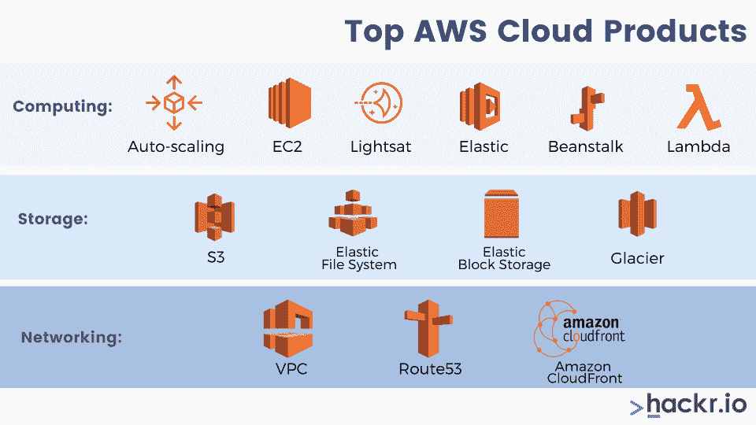
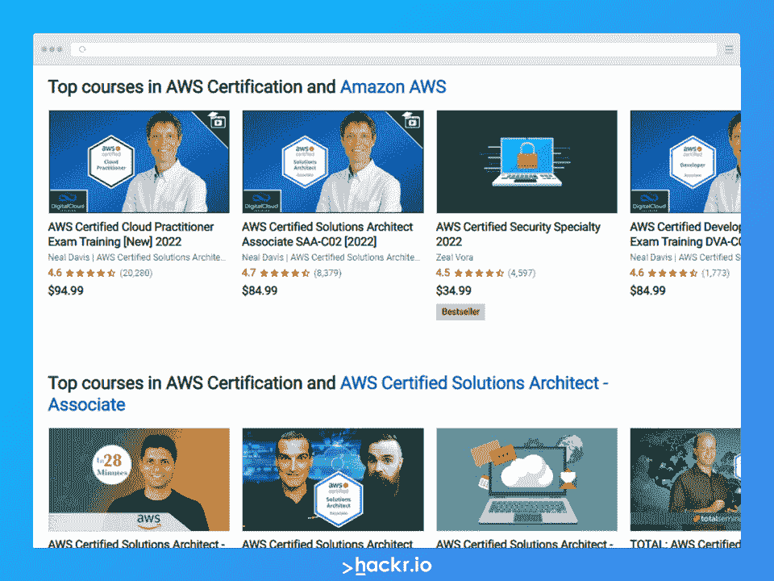

# 2023 年前 50+ AWS 面试问答[更新]

> 原文：<https://hackr.io/blog/aws-interview-questions>

AWS 于 2006 年推出，现已成为按需云计算服务的领先提供商。截至 2018 年最后一个季度，云计算服务提供商获得了令人震惊的 32%的云计算市场份额。

每一个希望在云计算领域大展拳脚的有抱负的开发人员都必须对 AWS 有很好的了解。如果你正在关注 AWS 开发人员的角色，那么我们在这里列出的 AWS 面试问题将帮助你为未来做好准备。

AWS 上的面试问题分为基本问题和高级问题，可以让你对云计算提供商有一个全面的了解。

## **基本 AWS 面试问题**

### **1。什么是 AWS？**

亚马逊网络服务(AWS)是一个向用户提供安全云服务、数据存储设施、计算平台、内容交付和各种其他相关服务的平台。

### **2。AWS 云产品的各种类型有哪些？**

****

AWS 产品提供的云服务类型主要有三种。这些是:

*   **计算:** 自动缩放、EC2、Lightsat、弹性豆茎和 Lambda
*   **存储:** S3，弹性文件系统，弹性块存储，冰川
*   **联网:** VPC、Route53、亚马逊 CloudFront

### **3。什么是自动缩放？**

自动伸缩是一种在识别需求后支持提供和启动新实例的功能。通过这种方式，用户可以根据需求的变化增加或减少资源容量。

### **4。区域和可用性区域之间有区别吗？**

是的。地区是不同的地理位置，比如美国的西加利福尼亚或北加利福尼亚，亚洲的南加利福尼亚或孟买。可用性区域是这些区域的一部分，通常是隔离的区域，可以在需要时自我复制。

### **5。你对 CloudFront 中的地理定位有何理解？**

CloudFront 中的地理定位支持根据特定地理区域的需求和需要为目标受众创建定制内容。这有助于企业向不同地理位置的目标受众展示其个性化内容，而无需更改其 URL。

### **6。CloudFront 涉及到哪些步骤？**

CloudFront 涉及四个步骤。这些是:

*   **第一步:** 创建 YAML 或 JSON 格式的云模板
*   **步骤 2:** 将代码保存在 S3 桶中，以便它为代码库服务
*   **步骤 3:** 使用 AWS CloudFormation 调用 bucket，从而在模板上创建一个新的栈
*   **步骤 4:** CloudFormation 读取该文件，从而理解所调用的所需服务及其订单详情、与服务的关系以及相关规定

AWS 中有四种这样的工具。这些是:

1.  检查顶层服务表
2.  AWS 预算
3.  成本分配标签
4.  成本管理器

### **8。AWS 中的 S3 是什么？**

S3 被称为简单存储服务。它用于通过网络随时随地存储和检索任意数量的数据。要使用这项服务，开发的支付模式是“现收现付”。

### **9。AMI 是什么？**

Amazon Machine Image 是一个模板，它提供启动一个实例所需的信息，该实例充当 AMI 的副本，在云中作为虚拟服务器运行。所提供的信息是关于操作系统、应用程序和应用服务器本身的。根据您的指示，可以同时从不同的 ami 启动许多实例。

### 10。AMI 和 Instance 是什么关系？

实例可以由 AMIs 启动。一个 AMI 可以根据需要启动任意多的实例。实例类型定义主计算机的硬件，包括关于计算机及其存储能力的信息。在启动一个实例后，它作为一个传统的主机工作，可以像与任何其他计算机一样进行交互。

### **11。AMI 中有哪些内含物？**

AMI 中有三种内含物，包括以下:

*   实例的根卷模板
*   阻止设备映射，这有助于在启动后连接到实例后确定卷
*   启动权限，帮助决定哪个 AWS 帐户可以使用 AMI 来启动实例

### **12。我们可以向亚马逊 S3 发送请求吗？**

是的，我们可以通过使用 REST API 或 AWS SDK 包装库向亚马逊 S3 发送请求，这些包装库包装了底层的亚马逊 S3 REST API。

### 13。EC2 和 S3 的主要区别是什么？

EC2 和 S3 之间的主要区别如下所述。

**EC2**

| **S3** | 云网络服务 |
| 数据存储系统 | 用于托管网络应用 |
| 用于存储数据 | 作为一个巨大的电脑机器工作 |
| 是休息界面 | 它可以运行 LINUX 或 Windows，也可以处理 PHP、Python、Apache 和其他各种数据库 |
| 应用安全认证密钥，如 HMAC-SHA1 | **14。可以在 AWS 帐户中创建存储桶吗？** |

### 是的，可以在 AWS 帐户中创建存储桶。默认情况下，AWS 帐户中最多可以创建 100 个存储桶。

15。什么是 T2 实例？

### T2 实例专门设计用于提供中等基准性能，并能够根据工作负载的需求突然提高性能。

16。有哪些不同种类的实例？

### 不同种类的实例包括如下。

加速计算实例

1.  内存优化实例
2.  存储优化实例
3.  计算机优化实例
4.  通用实例
5.  **17。亚马逊 VPC 支持广播或组播属性吗？**

### 不，亚马逊 VPC 不支持广播或组播属性。

18。我们能在 AWS 中创建弹性 IP 吗？

### 是的，我们可以在 AWS 中创建弹性 IP。每个 AWS 账户下允许大约 5 个 VPC 弹性 IP 地址。

**19。S3 的默认存储类别是什么？**

### S3 的默认存储级别被称为标准的频繁访问。

20。AWS 中的角色是什么？

### AWS 中的角色用于向 AWS 帐户中可信任的实体提供权限。它们类似于用户，不需要创建用户名和密码就可以与 AWS 中的各种其他资源一起工作。

**21。AWS 中的边缘位置是什么？**

### AWS 中的边缘位置是提供尽可能低的延迟的数据中心，即这些数据中心在物理上靠近客户端。当用户试图访问内容时，搜索会自动在边缘位置搜索最快的响应。

**22。什么是 VPC？**

### VPC 的完整形式是虚拟私有云。VPC 帮助定制网络配置过程。它作为一个网络，在逻辑上与云中的各种其他网络相隔离。VPC 允许用户有一个 IP 地址范围，安全组，子网和互联网网关。

**23。什么是雪球？**

### AWS 中的雪球是一个数据传输选项。它使用安全设备将大量数据传入传出云端。雪球可以用于将大量数据从一个地方转移到另一个地方，并有助于降低联网成本。

**24。什么是红移？**

### Redshift 是一款快速而强大的数据仓库产品，可执行数据分析和大规模数据库迁移。每个红移数据仓库都包含一组节点，这些节点排列成一个集群。客户端可以使用异常快速的查询结果从大量数据中获得洞察力。最常见的应用是实时分析、商业智能和日志分析。

**25。什么是子网？**

### 子网是 IP 地址的大段，可以划分成块。每个 VPC 可以有 200 个子网。

**26。什么是 SQS？**

### 简单队列服务提供分布式队列服务，充当两个控制器的中介。

**27。什么是 SimpleDB？**

### SimpleDB 是支持数据怀疑和索引 S3 以及 EC2 的数据存储库结构记录。

**28。亚马逊 ElastiCache 是什么？**

### [亚马逊 elastic cache](https://aws.amazon.com/elasticache/)是一项网络服务，有助于在云中轻松部署、扩展和存储数据。

**29。什么是 AWS Lambda？**

### AWS Lambda 是亚马逊提供的一项计算服务，可以在 AWS 云中运行代码，而无需管理服务器。

三十岁。什么是亚马逊 EMR？

### Amazon EMR 是一个幸存的集群阶段，有助于解释不同数据结构在发布前的工作情况。Amazon EMR 的各种组件是 Apache Hadoop、Apache Spark、Apache Hive 和其他各种组件。他们帮助调查大量数据，准备数据分析目标，并使用开源设计营销智能工作负载。

31。停止和终止实例有什么区别？

### 停止和终止都是 EC2 实例中的状态:

**停止:** 实例一旦停止，它就会执行正常关闭并转换到停止状态。您可以在以后启动该实例，它的所有 Amazon EBS 卷仍保持连接状态。当实例处于停止状态时，不会产生额外的实例时间。

*   **终止:** 一个实例一旦终止，它就执行正常的关闭并转换到终止状态。附加的 Amazon EBS 卷将被删除，除非该卷的 deleteOnTermination 属性设置为 false。由于实例本身已被删除，因此不可能在以后的某个时间再次启动该实例。
*   **高级 AWS 面试问题**

## 32。您将如何使用 c4.8xlarge 实例上可用的处理器状态控制功能？

### 处理器状态控制有两种状态，即:

**C 状态:** 代表睡眠状态。从 c0 到 c6 不等，其中 c6 是处理器的最深睡眠状态。

*   **P 状态:** 代表性能状态。在 p0 至 p15 范围内变化，其中 p15 为可能的最低频率。
*   处理器有多个内核，每个内核都需要散热空间来提升性能。因此，温度需要保持在最佳水平，以便内核能够发挥最高性能。

当内核进入睡眠状态时，会导致处理器整体温度降低。这为其他内核提供了获得更好性能的机会。因此，可以通过适当地将一些内核置于睡眠状态，而将其他内核置于性能状态来设计策略，以从处理器获得整体性能提升。

类似 c4.8xlarge 的实例允许定制 C 和 P 状态，以便根据工作负载定制处理器性能。

33。哪种实例类型可用于在 AWS 中部署 Hadoop 的 4 节点集群？

### 虽然 c4.8xlarge 实例将是主机的首选，但 i2.large 实例似乎也适合从机。另一种方法是启动自动配置服务器的 Amazon EMR 实例。

因此，在使用 Amazon EMR 实例时，您无需手动配置实例和安装 [Hadoop](https://hackr.io/tutorials/learn-hadoop-big-data?ref=blog-post) 集群。只需将数据转储到 S3 进行处理。EMR 从那里拿起它，进行同样的处理，然后把它倒回 S3。

34。您能区分即时实例和按需实例吗？

### 现货实例和按需实例都是定价模型。spot 实例允许客户购买计算能力，无需预先承诺。此外，即时实例的每小时费率通常低于为按需实例设置的费率。

现货实例的投标价格被称为现货价格。它根据现货实例的供应和需求而波动。如果现货价格高于客户指定的最高价格，EC2 实例将自动关闭。

35。提高 Amazon EC2 安全性的一些最佳实践是什么？

### 以下是提高 Amazon EC2 安全性的一些最佳实践:

仅允许受信任的主机或网络访问您的实例上的端口

*   通过 AWS 身份和访问管理(IAM)控制对 AWS 资源的访问
*   对从 AMI 启动的实例禁用基于密码的登录
*   经常查看安全组中的规则
*   36。亚马逊 S3 可以和 EC2 实例一起使用吗？请详细说明。

### 是的，可以在 EC2 实例中使用亚马逊 S3。它可用于具有由本地实例存储支持的根设备的实例。Amazon 提供了一系列工具来将 ami 加载到 Amazon S3，并在 Amazon S3 和 Amazon EC2 实例之间移动它们。

通过 [亚马逊 S3](https://en.wikipedia.org/wiki/Amazon_S3) ，AWS 开发人员享受着访问亚马逊用来运营其自己的全球网站和服务网络的同样高度快速、可靠、廉价和可扩展的数据存储基础设施。

37。你将如何加快亚马逊雪球的数据传输速度？

### 亚马逊雪球的数据传输可以通过以下方式增强:

从不同的工作站复制到同一个雪球

*   创建一批小文件或传输大文件以减少加密开销
*   消除不必要的跳跃
*   同时执行多个复印操作
*   38。能否解释一下亚马逊 RDS 和亚马逊 DynamoDB 的区别？

### 亚马逊 RDS 是一项针对关系数据库的数据库管理服务。它允许自动化一些与关系数据库相关的操作，如备份、修补和升级。该服务仅处理结构化数据。

另一方面，亚马逊 DynamoDB 是一个 NoSQL 数据库服务。与 Amazon RDS 相反，它只处理非结构化数据。

阅读我们关于[NoSQL vs SQL](https://hackr.io/blog/nosql-vs-sql)的指南，了解 SQL 和 NoSQL 数据库之间的重要区别。

39。哪些 AWS 服务适合电子商务数据的实时分析？

### DynamoDB 是收集电子商务数据的合适选择，因为它是一种非结构化形式的数据。可以使用 Amazon Redshift 对收集的电子商务数据进行实时分析。

40。如果删除数据库实例，备份和数据库快照会发生什么情况？

### 删除数据库实例时，有一个创建最终数据库快照的选项。它可以在以后用于恢复数据库。

一旦实例被删除，Amazon RDS 会保留用户创建的数据库快照以及其他手动创建的数据库快照。所有自动备份都会随实例一起删除。

41。如何将数据从不同的数据源加载到 Amazon Redshift，比如 Amazon EC2、DynamoDB 和 Amazon RDS？

### 从不同数据源加载数据到亚马逊红移有两种方式，分别是:

**使用 AWS 数据管道:** 提供高性能、容错和从一系列 AWS 数据源加载数据的可靠方式。它允许指定数据源、数据转换，然后执行预先编写的导入脚本来加载数据

1.  **使用 COPY 命令:** 直接从 Amazon DynamoDB、Amazon EMR 或任何其他支持 SSH 的主机并行加载数据
2.  **42。弹性和可伸缩性有什么不同？**

### 当需求增加时，系统通过简单地增加硬件资源来处理工作负载增加的能力，当没有需求时，系统通过回滚缩减的资源来处理工作负载增加的能力，被称为弹性。

另一方面，可伸缩性是系统增加硬件资源以应对需求增长的能力。这可以通过增加硬件规格或增加处理节点的数量来实现。

**43。什么是连接排水？**

### 连接排出负责将流量从实例重新路由到其他可用的实例。这种情况会发生在需要更新的实例或运行状况检查失败的实例中。这是一项持续监控实例运行状况的 ELB 服务。

**44。假设用户设置了一个自动扩展组，但该组在超过 24 小时内未能启动一个实例。在这种情况下，自动缩放会发生什么？**

### 在这种情况下，自动缩放将暂停缩放过程。自动缩放功能允许暂停和恢复属于自动缩放组的一个或多个进程。

当需要调查 web 应用程序的配置或其他问题时，该特性非常有用。

**45。如何在不中断现有网络流量的情况下，将现有域名注册迁移到 Amazon Route 53？**

### 获取域名的 DNS 记录数据列表。它通常以区域文件的形式提供，可以从现有的 DNS 提供商那里获得。

*   收到 DNS 记录数据后，使用 Route 53 管理控制台或简单网络服务界面创建托管区域，用于存储域名的 DNS 记录，并继续迁移流程。在这里，您还可以包括其他非必要的步骤，例如将域名的名称服务器更新为与托管区域相关联的名称服务器。
*   联系您向其注册域名的注册商，然后遵循迁移流程。一旦注册服务商传播了新的域名服务器授权，DNS 查询将开始得到答复。
*   **46。使用经典负载均衡器和应用负载均衡器的理想情况是什么？**

### 经典负载均衡器是跨多个 EC2 实例进行简单负载均衡的正确选择。

相反，应用负载平衡器适用于基于容器或微服务的架构，在这种架构中，要么需要将流量路由到不同的服务，要么需要在同一个 EC2 实例上的多个端口之间执行负载平衡。

**47。能否解释一下 AWS Elastic Beanstalk 是如何应用更新的？**

### 在更新原始实例之前，AWS Elastic Beanstalk 准备好实例的副本。此后，它将流量路由到复制实例，以避免更新应用程序失败的情况。

如果更新过程中出现故障，AWS Elastic Beanstalk 将使用它在开始更新过程之前创建的完全相同的副本切换回原始实例。

**48。如果应用程序停止响应 AWS Elastic Beanstalk 中的请求会发生什么？**

### 即使底层基础设施看起来很健康，Beanstalk 也能够检测应用程序是否在自定义链接上没有响应。然后，它将这种情况记录为环境事件，然后可以对其进行详细检查，并据此采取行动。

AWS Elastic Beanstalk 应用程序有一个内置系统，用于避免底层基础设施故障。Beanstalk 使用自动伸缩特性在 Amazon EC2 实例失败时自动启动一个新实例。

49。AWS CloudFormation 和 AWS OpsWorks 有什么不同？

### 虽然 AWS CloudFormation 和 AWS OpsWorks 都为应用程序建模、部署、配置和管理活动提供支持，但两者在抽象级别和关注领域方面有所不同。

AWS CloudFormation 是一个构建块服务，它允许通过基于 JSON 的领域特定语言管理几乎任何 AWS 资源。即使没有规定开发和运营的独特模型，CloudFormation 也为 AWS 提供了基础功能。

借助 AWS CloudFormation，客户可以定义模板，然后使用这些模板来配置和管理 AWS 应用程序代码、资源和操作系统。

另一方面，AWS OpsWorks 是一项高级服务，致力于为 IT 管理员和面向运营的开发人员提供高度可靠和高效的开发运维体验。OpsWorks 具有配置管理模型，并为自动扩展、自动化、部署和监控等活动提供集成体验。

与 CloudFormation 相比，OpsWorks 支持更少数量的面向应用的 AWS 资源类型，包括 Amazon CloudWatch metrics、EBS volumes、EC2 实例和 Elastic IPs。

50。当在 AWS OpsWorks 中不能成功创建堆栈中的一个资源时会发生什么？

### 当无法在 AWS OpsWorks 中成功创建堆栈中的某个资源时，会启用出错时自动回滚功能。该功能会删除所有成功创建的 AWS 资源，直到出现错误。

这样做可以确保不会留下任何导致错误的数据，同时遵守堆栈要么完全创建，要么根本不创建的原则。

出错时自动回滚功能非常有用，尤其是在用户可能无意中超出弹性 IP 地址总数限制或无法访问 EC2 AMI 的情况下。

**关注这些 AWS 面试问题**

## 以上总结了 AWS 技术面试问题清单。这些应该给你一个坚实的 AWS 基础，尽管你应该读更多。我们收集了 [AWS 教程](https://hackr.io/tutorials/learn-amazon-web-services-aws?ref=blog-post) 来帮助你学习更多关于云计算服务的知识。

AWS 面试问答绝不是一份详尽的清单。这就是为什么你应该做更多的谷歌搜索和阅读，这样你才能在面试中胜出。AWS 上的面试问题可以是任何问题，因为这是一个相当广泛的话题，所以要确保你对这个话题有尽可能广泛的理解。

**AWS 认证和亚马逊 AWS 顶级课程**

**人也在读:**