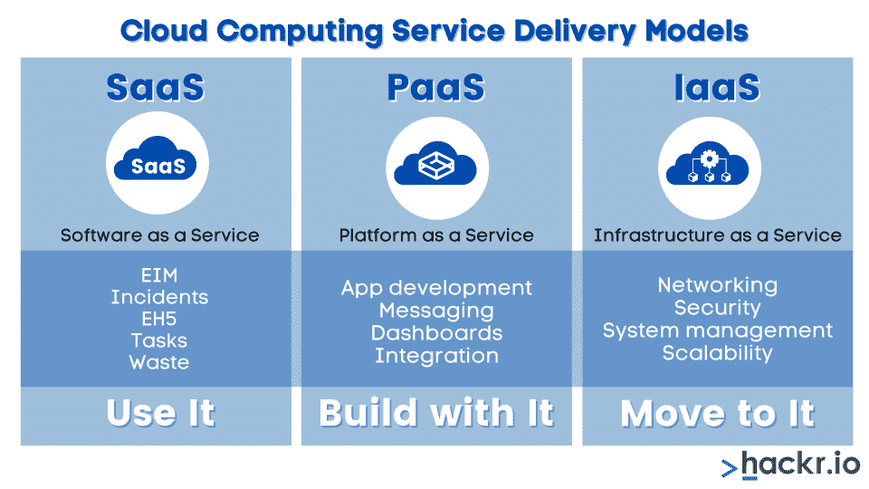
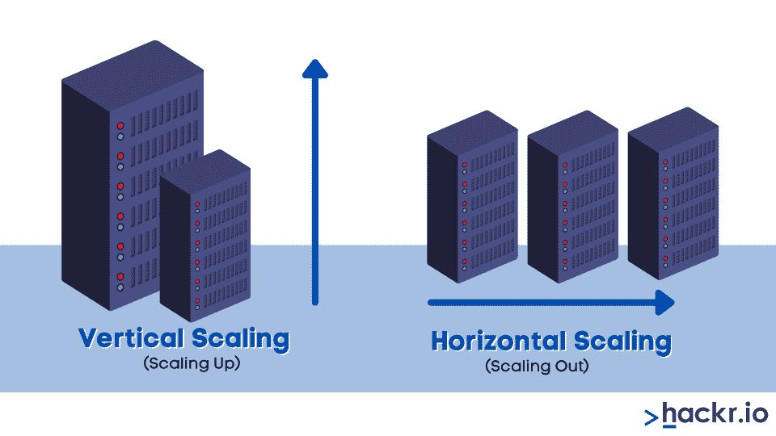
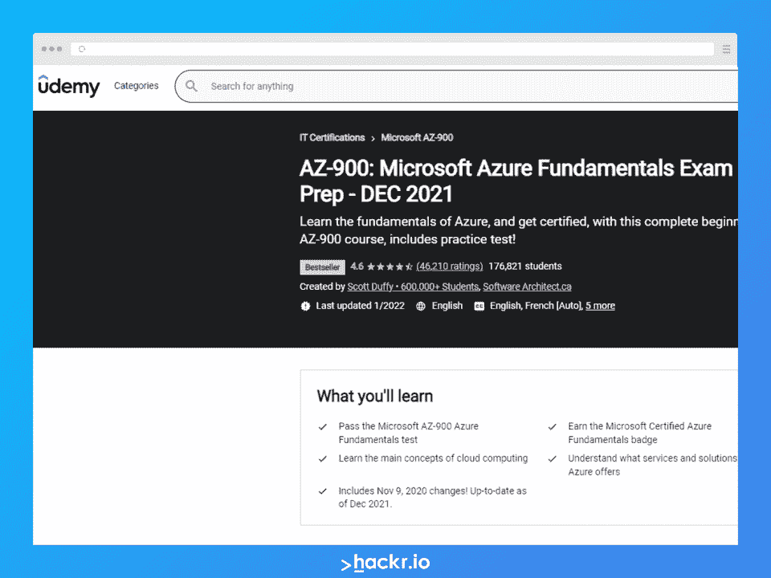

# 2023 年 Azure 面试热门问答[更新]

> 原文：<https://hackr.io/blog/azure-interview-questions>

微软 Azure 是市场领先的云平台之一，它正日益成为科技公司军火库的一部分。它提供了几个好处，并具有广泛的应用，这可能会让一些人望而生畏。

然而，作为一个越来越常见的工具，开发人员或潜在开发人员应该了解云计算平台的所有基础知识。在招聘过程中，面试官肯定会用 Azure 面试问题来测试你的知识，所以你应该尽最大努力做好准备。

在这里，我们会给你一个什么是微软 Azure 的分类，并回顾最受欢迎的 Azure 面试问题和答案。这将包括一些对 Azure 开发的解释，以及一些针对有经验的开发人员的 Azure 面试问题——因此初学者和老手都可以受益。

## **微软 Azure 是什么？**

微软 Azure 是由微软开发的云计算平台，被世界各地的公司用来构建和管理他们的应用程序。Azure 平台有 200 多种产品和服务，为公司今天可能面临的不同问题提供解决方案。可以根据业务需求定制、构建和部署应用程序。

Azure 是一个真正的混合平台，具有独特的功能，例如:

*   支持 PaaS 和 IaaS
*   混合就绪，即您可以在公共云和私有云之间进行选择，使存储、备份和恢复变得简单快捷
*   可扩展且经济实惠，提供随用随付选项
*   支持 C#、Java、Python 之类的语言；以及像 Windows、Linux、Oracle、SQL Server 等操作系统。
*   移动服务和移动参与收集实时分析数据
*   通过 SQL 数据仓库处理数据密集型查询，实现高效的数据管理
*   通过 CDN(内容交付网络)和微软机器学习提供安全的媒体服务

## **为什么要学 Azure？**

除了关于微软 Azure 的技术信息，面试官还会问你一些与业务相关的问题，比如为什么要用 Azure？在 [AWS](https://hackr.io/tutorials/learn-amazon-web-services-aws) 如此受欢迎的情况下，你为什么会使用 Azure？

第一个原因是，如果 AWS 是第一，Azure 是市场上非常接近的第二。此外，一个聪明的企业不会只依赖一个提供商——如果 AWS 宕机，整个企业会关门吗？

这让我们想到了另一个问题:Azure 的市场份额是多少？Azure 是第二大最受欢迎的提供商，拥有 28.4%的份额，仅次于拥有 37.1%份额的 AWS。接下来是 GoogleCloud。

在阅读这些 Azure 云面试问题之前，你必须已经对 Azure 有了相当的了解——至少完成了一些教程和认证。你应该熟悉 Azure 是什么，Azure dashboard 是什么样子等等。如果您已经看到了仪表盘、虚拟机、SQL 数据库、负载平衡器、流量管理器、数据仓库等资源。，都列在左边，所有的任务都可以在右边完成。仪表板是在 Azure 门户上查看所有云资源的一种更有组织的方式。

Azure 很庞大，有很多组件。作为一名开发人员，您可能并不关心一切是如何工作的。但是，如果您是管理员，您应该知道如何使用仪表板、授予权限、访问服务等。你应该从阅读一些关于云服务的知识开始你的 Azure 学习之旅，然后是核心概念和服务，然后继续学习更高级的概念，如安全性、网络。

## **一般面试小技巧**

只要你透彻理解这些概念，回答技术性的 Azure 面试问题并不困难——大多数问题不需要详细的答案。面试官大多是从问基本问题开始，然后后面的问题是前面问题的延续。

你给出的答案越详细，你得到的问题就越多。简明扼要，只回答你完全知道的问题。如果你对某件事不确定，就承认吧。记住，没有人期待一个完美的候选人。他们想要一个能够学习和成长的人。

## **顶级 Azure 面试问答**

### **1。你对云计算平台了解多少？**

通过云计算，我们可以在远程服务器而不是本地机器和服务器上存储和处理数据。使用云来管理软件、数据库、网络、服务器等。，使可访问性更快、更灵活、更具可伸缩性。存储在“云”上的资源可以按需获得，并通过互联网交付。在云计算中，资源就是服务——基础设施即服务，平台即服务，软件即服务。

### **2。云服务模式有哪些不同类型？**

****

有三种云计算服务模式:

1.  **IaaS:**IaaS 是最底层也是最重要的一层，它通过互联网提供网络硬件和基础设施。虚拟机就是这种资源的一个很好的例子。您只需登录 IaaS 平台，使用虚拟机安装所需的操作系统、软件、数据库和其他程序。虚拟机充当虚拟数据中心。因此，如果数据中心由于某种原因崩溃，基础架构不会受到影响。硬件维护成本也大大降低。
2.  **PaaS:** 它是堆栈中的中间层，提供运行云应用的平台。您可以使用 PaaS 供应商提供的预构建工具和 API 定制您的应用程序。PaaS 的好处是，您可以只为想要使用的服务付费，基于 PaaS 构建的应用程序可以在多种平台上兼容，并且 PaaS 允许动态扩展。
3.  **SaaS:** 在这种模式中，云提供商通过互联网为您提供应用所需的软件。你不需要在你的服务器上安装任何额外的软件，因此没有任何前期费用，你可以使用用户界面享受服务。任何升级都由供应商以最低的成本负责。

### **3。云计算系统的优势是什么？**

云计算系统的主要优势是降低运营和 IT 维护成本，加快开发速度，从而缩短产品和服务的上市时间。云计算系统允许快速应用程序开发，而无需企业担心其基础设施、软件和硬件需求。有无限的存储容量和高可用性。云系统经济高效、灵活且安全。故障转移和备份过程非常简单。

### **4。各种提供商提供的云服务有哪些类型？**

有四种类型的服务:

1.  **Public:** 在这项服务中，整个基础设施位于提供云服务的公司场所，使他们能够访问数据
2.  **Private:** 您独自托管所有资源，拥有最高级别的安全性和控制力。高度关键的数据通常托管在私有云上
3.  **混合:**根据目的不同，公共云服务和私有云服务以混合方式使用
4.  **社区:**拥有共同目标或适合特定社区的组织在社区云中共享基础设施

### **5。提及私有云和公共云之间的一些差异。**

| **公有云** | **私有云** |
| 不完全可定制 | 完全可定制 |
| 适合不太敏感的内容 | 适用于高度机密的数据 |
| 支持多个客户 | 支持一群专门的客户 |
| 虚拟化资源是公开共享的 | 虚拟化资源是私下共享的 |
| 通过互联网连接 | 通过专用网络和光纤连接 |
| 由于服务由提供商管理，运营成本更低 | 由于定制和控制，价格较高 |

### **6。哪种云服务类型最好？用理由支持你的答案。**

你可以在这个 Azure 面试问题上提出自己的观点。这个答案应该有正当的理由。

例如，您可以说公共云更适合存储不太敏感的数据，因为它具有成本效益并且由提供商自己管理。但是，私有云提供了更大的灵活性和控制力，并且可以定制。也更有保障。您也可以支持混合模式，说明它具有公共和私有的优势，即您可以为您使用的服务付费，但仍拥有对数据的完全控制和安全性。

### **7。什么是水平缩放？它与垂直缩放有什么不同？**

****

在水平扩展模式中，我们通过在网络中添加更多机器以及在所有设备间共享内存和处理工作负载来添加必要的额外基础设施。这也称为“向外扩展”。

| **水平缩放** | **垂直缩放** |
| 添加更多的机器(实例)来为系统提供更多的动力 | 增加现有机器的功率以改善基础设施要求。例如，增加 RAM、CPU、内存等。 |
| 也称为向外扩展 | 也称为放大 |
| 向网络添加新机器时不会停机 | 由于现有的机器需要升级，所以在升级过程完成之前，服务器必须关闭 |

### **8。什么是 Azure？它有什么好处？**

Azure 是微软提供的云计算服务，于 2010 年正式发布。微软提供了构建、测试、管理和部署应用程序的数据中心。Azure 提供 SaaS、PaaS 和 IaaS。总共有 600 多种服务，它是领先的云服务提供商，仅次于 AWS。

Azure 的一些优势包括:

*   灵活性和敏捷性
*   数据库、HDInsight、CDN、VPN、分析、媒体、移动服务等多种服务的强大功能。
*   免费设置和帐户创建，功能有限
*   按需可扩展性
*   数据的高安全性和可靠性
*   分析和大数据洞察
*   混合模式因此提供最佳服务

### **9。Azure 有哪些用途？**

Azure 的一些重要用途/应用是 Web 应用开发、测试、应用托管、创建虚拟机、集成和同步功能、收集和存储指标、虚拟硬盘、大数据分析和机器学习。

### 10。有哪些管理 Azure 资源的服务？

一些 Azure 服务有:Azure DevOps、虚拟机、Azure Cosmos DB、Azure active directory 和 Azure 内容交付网络(CDN)。

### **11。解释云计算管理中不同类型的角色。**

我们需要不同的角色来顺利执行各种功能。这些角色是:

*   **Web 角色:**该角色用于部署使用 IIS 平台支持的语言、为特定 Web 应用定制的网站。
*   **虚拟机角色:**用于调度 Windows 任务和服务
*   **工作者角色:**执行部署网站时运行的后台进程

### **12。你能提到 AWS 和 Azure 的一些主要区别吗？**

| **蔚蓝色** | **AWS** |
| Azure 于 2010 年推出，比 AWS 晚了几年 | 它于 2006 年推出 |
| 11-12%的市场份额 | 约 31%的市场份额 |
| 提供与所有微软工具和开源支持的集成，提供混合云，包含一系列广泛的功能 | 成熟和广泛的产品，具有许多功能，如监控、安全、配置等。开放而灵活，具有更好的全球影响力 |
| 与 AWS 相比，它不是那么适合企业 | 选项太多，难以使用；需要广泛的成本管理 |
| 按照每分钟使用量按需定价 | 基于每小时的按需定价 |
| 虚拟机中的最大内存为 3800 GB | 虚拟机中的最大内存为 3904 GB |
| 虚拟服务器使用虚拟机和规模集进行管理 | 使用弹性计算云(EC2)管理虚拟服务器 |
| 码头集装箱注册处:集装箱注册处 | Docker 容器注册表:使用 EC2 容器注册表 |
| Blob 存储 | 简单存储服务(S3) |

### 13。什么是中断修复问题？

中断修复问题是使用 Azure 服务时出现的技术问题。它们由 Azure 技术使用 Azure 支持计划提供支持。

### **14。企业仓储的好处是什么？**

企业仓储有几个好处:

*   **数据集成:**集中式数据放置确保更高的数据可用性，并节省时间和资源
*   **风险降低:**如果数据杂乱、肮脏，可能会导致很多解释和处理上的错误。拥有整洁有序的数据可以降低风险并提高生产率。
*   **简化报告:**数据可以轻松访问并转换为高准确性的报告
*   **更好的收入和利润:**由于集中存储，数据输入和报告可以实现自动化，从而节省资金并更专注于业务

### 15。未连接查找和连接查找之间有什么区别？

| **连接查找** | **未连接查找** |
| 可以使用静态或动态缓存 | 使用静态缓存 |
| 直接从管道接收输入 | 输入是作为某个其他变换中的 LKP 表达式的结果而接收的 |
| 支持用户定义的值(默认) | 不支持默认的用户定义值 |
| 如果查找条件没有匹配的结果，服务将返回默认值 | 如果不匹配，则返回空值 |

### 16。如何从 Azure 获得更具可扩展性的结果？

我们可以通过使用 service fabric 来做到这一点，service fabric 是一个分布式系统平台，可以在其中轻松部署和管理微服务和容器。许多微软服务，如 Azure SQL DB、Cortana、Power BI、Cosmos DB 等。由服务结构提供动力。

### **17。Azure 中有哪些 API 应用？**

API 应用程序允许开发人员使用标准 API 特性托管 web 应用程序，而不必编写代码。API 应用程序使混合连接、安全性、访问控制和集成变得无缝和简单。您可以使用 Visual Studio 轻松创建 API，并在 Azure API 应用程序中托管它们。

### 18。Azure 活动目录的目的是什么？

Azure Active Directory 是用于登录和内部及外部资源访问的身份和访问管理服务。AD 使用单点登录(SSO)方法。

管理员还可以根据业务需求使用 AD (active directory)来控制和管理应用和资源。

### **19。Azure 中提供了哪些计算选项？**

Azure 中的主要计算选项有:

*   **虚拟机(VM):** 我们可以在虚拟网络中部署虚拟机，这是一种 IaaS 服务
*   **应用服务:**这是一种 PaaS 服务，提供托管 web 应用、RESTful APIs、移动应用后端或自动化业务流程
*   **Azure 容器实例:**运行 Azure 容器的最快方式，无需虚拟机或高级服务
*   **服务架构:**用于创建&管理跨集群机器的微服务
*   **云服务:**使用 PaaS 托管模式，运行云应用
*   **Azure 功能:**提供“按需计算”的无服务器计算服务

### 20。Azure 提供了哪些网络服务？

Azure 提供不同类型的网络服务:

*   Azure DNS、虚拟广域网、VPN 网关、ExpressRoute 等连接服务。
*   应用保护服务，如专用链路、防火墙、NSG(网络安全组)、虚拟网络端点、DDoS 等。
*   应用交付服务，如内容交付网络(CDN)、负载平衡器、应用网关、流量管理器等。
*   网络监控，如 Azure Monitor、ExpressRoute Monitor、网络监视器、VNet TAP(终端接入点)等。

### **21。Azure 提供了哪些存储服务？**

*   **Blob 存储:**存储所有非结构化数据，如媒体对象、文档、日志数据以及元数据
*   **文件存储:**用于遗留系统
*   **队列存储:**用于组件之间交换消息
*   **表格存储:**将数据存储为表格，可扩展且易于使用
*   **虚拟机磁盘:**数据存储在固态硬盘(SSD)中，以获得更好的输出和清晰度

前四项是标准存储服务，而虚拟机磁盘是高级存储服务。

### **22。blob 存储和队列存储有什么区别？**

| **斑点存储** | **队列存储** |
| Azure 云的对象存储解决方案 | 存储大量可通过 Http 或 Https 身份验证调用访问的消息 |
| 可以存储任何数据模型和类型的非结构化数据 | 队列只占用消息 |
| 可以无限制地存储大量非结构化数据 | 一条队列消息最大为 64KB，根据存储帐户的容量限制，队列可以有一百万条消息 |
| 示例:媒体文件、流式音频和视频以及日志文件 | 示例:通过云进行消息处理和文件共享 |

### **23。如何在使用 Azure 虚拟网络的同时保证安全性？**

使用虚拟网络禁止用户通过互联网直接访问 Azure 功能。同一虚拟网络(VNet)内的应用程序可以使用公共 IP 地址或公共负载平衡器提供访问。

### **24。你还记得如何创建一个免费的 Azure 帐户吗？**

在 Azure 网站上，点击创建一个‘免费账户’。在这一页的右上角。在下一个屏幕上，你应该点击“免费开始”。

您将被要求提供电子邮件地址。输入尚未注册任何 Azure 帐户的新地址。创建安全密码。接下来，选择你的国家和出生日期。

在下一页，您将被要求提供更多关于您自己的信息，如姓名、电话号码、电子邮件地址等。你必须输入卡的详细信息，尽管他们不会在第一年向你收费。

最后，同意条款和条件，就这样！成功创建帐户后，您将能够看到您的 Azure 门户。

### **25。Azure 的 PaaS 服务有哪些例子？**

PaaS 服务的一些例子是移动应用、Azure WebJobs、服务逻辑应用、Web 应用和 Azure 功能。

### **26。什么是 SQL Azure？它有什么特点？**

SQL Azure 是微软提供的云数据库服务。组织可以在云上存储关系数据，并根据其业务需求扩大或缩小数据库。

SQL Azure 的特性有:

*   快速灵活
*   基于 SQL Server 技术
*   托管基础设施和平台
*   动态可扩展性

### **27。如何使用 Azure 构建大数据解决方案？**

Azure 为大数据分析提供完整的解决方案。这解释了:

*   我们从各种数据源获得大量非结构化、结构化或两种类型的数据
*   一旦从各种来源获得数据，就必须将其集成并处理到一个存储中。微软的 Azure HDInsight 是基于 Apache Hadoop 的大数据解决方案，可以轻松处理海量数据。
*   使用数据模型和分析对数据进行分析。Azure 有大约 50 项服务专门用于 AI(人工智能)、物联网和分析。例如，Azure 分析服务、日志分析、Azure 数据块、数据湖分析等。
*   可视化和报告是大数据解决方案的最后步骤。一些服务是 PowerBI、SQL Server reporting services、SharePoint 等。

### **28。Azure Stream analytics 有什么好处？**

Azure stream analytics 同时分析和处理来自不同来源(物联网设备)的大量快速流数据。它有各种设备、传感器、点击流、社交媒体源和应用程序来识别模式。

好处是:

*   **易于使用:**只需点击几下，您就可以连接到多个信号源和接收器
*   **用于事件处理和实时分析的工具:**使用 SQL 查询语言和其他工具，如 Azure PowerShell、CLI、stream analytics Visual Studio 工具等，提高开发人员的工作效率。
*   Azure 上完全托管的 PaaS 产品，这意味着不需要额外的硬件或基础设施
*   可靠且安全
*   高性能，每秒可处理数百万个事件

在官方 [MS 文档页面](https://docs.microsoft.com/en-us/azure/stream-analytics/stream-analytics-introduction)上了解更多信息。

### **29。什么是网络安全组？**

网络安全组为具有相同安全状态的资源提供虚拟防火墙。NSG 包含允许或拒绝进出各种 Azure 资源的入站或出站网络流量的安全规则。我们可以为每个定义的安全规则指定源、目的地、协议和端口。

### 三十岁。如何在 Azure 服务中实现高可用性和高响应性？

Azure traffic manager 在 Azure 服务中提供了高可用性和高响应性。它是一个基于 DNS 的流量负载平衡器。DNS 基于流量路由方法将特定的客户端请求定向到正确的服务端点。它还为每个端点提供健康的监控，在一个端点出现故障时提供高可用性和自动故障转移。

### 31。天蓝色的桌子是什么？它是用来做什么的？

Azure table storage 是一种服务，通过它可以将结构化的 NoSQL 数据存储在云中，在无模式的设计设置中提供一个键属性存储。这是存储数据的好方法，不需要复杂的连接、存储过程、外键等。表存储提供者是 Azure 表存储的一部分，也用作集中会话信息的会话提供者。

### 32。Azure 中管理会话状态的其他方法有哪些？

管理会话状态的一些其他方法有:

*   **Windows Azure AppFabric 缓存:**这是一种分布式内存缓存服务，提供快速访问，由微软官方支持。不过略贵。Microsoft 建议使用此选项，并基于 Windows Server AppFabric 缓存技术进行自动配置。
*   **InProc session:** 它将会话存储在 web 服务器的内存中，从而提供更快的访问速度。它具有成本效益，但只对单个实例有效。

### 33。你知道如何使用 Azure 构建 CI/CD 管道吗？

是的。我们可以使用 Azure DevOps 来做到这一点。这是一个自动化 CI/CD 流程的工具。为此，您应该:

*   使用 AzureDevOps Starter 资源创建一个示例 DevOps 项目(ASP.NET)
*   检查启动器配置的 Azure CI/CD 管道
*   将项目复制(克隆)到系统中
*   提交代码
*   执行 CI/CD

### 34。**Azure devo PS 有哪些组件？**

Azure DevOps 的一些组件是 Azure Repos、Azure Pipelines、Azure Boards、Azure 测试计划和 Azure 工件。

### 35。什么是 Azure 数据工厂？

Azure data factory 是一个托管云服务，专为复杂混合的 ETL、ELT 和数据集成任务而构建。我们可以为大规模的数据转换和移动创建数据驱动的管道。这种转换后的数据可以发布到 Azure Synapse Analytics 等数据存储中进行进一步处理。

### 36。Azure 服务管理器和 Azure 资源管理器有什么区别？

| **Azure 服务管理器(ASM)** | **Azure 资源管理器(ARM)** |
| 主要为 IaaS 工作负载和特定的 PaaS 工作负载提供云服务 | 为所有 IaaS 和 PaaS 工作负载提供服务的新门户 |
| XML 驱动的 REST API | JSON 驱动的 REST API |
| 删除资源有点乏味 | 通过使用资源组，资源删除变得简单而容易 |
| 部署是使用 PowerShell 脚本完成的 | 部署是使用 ARM 模板完成的 |
| 许多功能在 ASM 中不可用 | 许多功能，如资源标记、同一区域内的资源移动、基于角色的访问控制功能等。有空吗 |

### 37。什么是资源组？

[资源组](https://docs.microsoft.com/en-us/azure/azure-resource-manager/management/manage-resource-groups-portal)存储关于资源的元数据。它是一个保存与特定 Azure 解决方案相关的资源的容器。资源组可以包含所有资源，也可以只包含您希望作为一个组来管理的资源。

### 38。使用资源管理器有什么好处？

将资产安排在一个逻辑组中，可以实现简单、自动的供应、监控、更好的成本管理和资源访问控制。这是由 Azure 资源管理器完成的。它提供了一组在 Azure 中提供资源的 API。

ARM 可以管理要配置的资源的依赖关系，以及在创建虚拟机之前必须配置这些资源的顺序——完全独立。在 ARM 出现之前，开发人员必须这样做。

此外，可以使用 JSON 以声明方式提供资源，这为管理属于资源组的资源提供了灵活性和方便性。在 GitHub 或 Azure marketplace 等存储库上，也有一些模板可用于提供不同的资源。

### 39。你知道 Azure 安全中心吗？解释它如何解决一些主要的安全挑战。

Azure security 通过为云上的所有工作负载提供高级威胁保护来加强数据中心的安全性，即使它们不是 Azure。这是一个统一的安全管理系统，可确保所有工作负载的安全。它通过以下方式应对最重要的安全挑战:

*   通过评估工作负载、发出警报和威胁防范建议来防范威胁
*   通过评估环境和了解资源的安全状态来加强安全态势
*   Azure Security center 是集成的，可以轻松部署，因此速度更快，更安全

### 40。什么是 Azure 机器学习？它包含什么？

Azure 机器学习可以在云环境中训练、部署、管理、自动化和跟踪机器学习模型。您可以将它用于经典的 ML、深度学习、监督或无监督学习算法。Azure machine learning 包含许多工具，如 Azure machine learning designer、Jupyter/R notebooks、Machine learning CLI、TensorFlow、scikit-learn、PyTorch 等。

### 41。什么是事件网格？陈述由事件网格处理的事件示例。

事件网格从各种来源读取事件，如 Azure ML 和其他服务。然后，事件被发送到逻辑应用、Azure 函数、Azure 事件中心等处理程序。

一些例子是:注册和部署模型，在运行成功/失败时发送电子邮件，一旦注册了模型就使用 Azure 函数，以及在检测到漂移时触发机器学习管道。

### **42。什么是 Azure 服务结构？是 PaaS 还是 IaaS？**

服务结构提供了一个运行时平台，通过该平台，您可以打包、部署和管理微服务和容器。它是 PaaS，并为微软今天的许多服务提供支持，如 PowerBI、Azure IoT Hub、Azure event hub、Skype for Business、Dynamics 365 等。

### **43。什么是 ARM 模板？它的优点是什么？**

ARM 模板允许我们自动化部署，并将基础设施作为 Azure 解决方案中的代码来实现。这样做是为了让团队能够将基础设施代码和应用程序代码作为一个统一的过程来管理。一些优点是:

*   模板使用声明性语法，这意味着您可以创建和部署虚拟机、网络基础架构、存储系统等。，声明性地
*   相同的模板可以部署多次，以获得相同状态的相同资源
*   资源管理器负责部署顺序，并在其认为合适的时候并行部署资源

### **44。什么是 SAS 令牌？如何以编程方式生成它？**

SAS(共享访问签名)令牌是在客户端生成的字符串。这是一种控制客户端可以访问多少 Azure 数据的方法。Azure 存储不跟踪 sa。您可以控制令牌的有效时间、客户端可以访问的资源、授予客户端的权限等。使用 Azure 门户生成 SAS 令牌更容易，但我们也可以通过编程来实现。参见 MS docs 页面上的[实现。](https://docs.microsoft.com/en-us/rest/api/eventhub/generate-sas-token)

### **45。Azure Cosmos DB 是什么？存储过程是用哪种语言编写的？**

它是一个多模式的微软云数据库，可以支持不同的数据存储和处理方式。它取代了 [NoSQL](https://searchdatamanagement.techtarget.com/definition/NoSQL-Not-Only-SQL) 面向文档的数据模型，并使用称为“集合”的容器来存储数据。存储过程用 JavaScript 编写，并作为单个事务执行。

### **46。哪个对象允许您访问 Azure Cosmos DB 存储过程中可以执行的操作？举个例子。**

可以使用 getContext()方法通过上下文对象访问所有操作。它还提供对请求、响应和容器对象的访问。举个例子，

var context = getContext();

var response = context . getresponse()；

response.setBody("欢迎使用 hackr . io ")；

### **47。Azure PowerShell 是什么？**

PowerShell 是一组 cmdlets，为自动化提供了许多功能。我们可以从 Powershell 命令行创建、测试、部署和管理 Azure 资源和服务。它是 Windows PowerShell 的扩展。

### **48。cmdlet 是什么？它的目的是什么？**

cmdlet 是一个. net framework 类对象，可以通过 Windows PowerShell APIs 以编程方式调用或创建。执行操作后，cmdlets 将. NET 对象返回给下一个命令。cmdlet 是一个轻量级命令，在 Windows PowerShell 中使用。

### 49。如何在 Azure 中连接两个或更多虚拟网络？Azure 支持哪些类型的对等？

Azure 中的虚拟网络可以使用虚拟网络对等连接。这些网络显示为一个单一的连接网络。我们可以使用虚拟网络对等连接同一个 Azure 区域内的虚拟网络。另一种类型的对等是全球虚拟网络对等，其中虚拟网络跨 Azure 区域连接。

### 50。什么是集成运行时？

Azure data factory 使用集成运行时来支持跨网络环境的各种数据集成功能。集成运行时有三种类型:

*   **Azure integration 运行时间:**它可以在云数据存储之间复制数据，并可以将活动分派给各种计算服务，如 SQL server 或 HDInsight，以进行数据转换
*   **自托管集成运行时:**用于在云数据存储和私有网络数据存储之间复制数据。它还在内部或虚拟网络资源上分派转换活动。
*   Azure SSIS 集成运行时:使用它，我们可以在托管环境中本地执行 SSIS 包。这对于将 SSIS 包转移到 Azure 数据工厂非常有用。

## **赢得 Azure 面试的时间到了**

Azure 是一个广阔的平台，有许多方面的开发我们没有在这里介绍，但本指南将让您对实际的 Azure 面试问题有一个公平的想法。

对于 Azure 开发来说，实践经验是最重要的。面试官将关注你的概念性知识以及使用该技术的经验。他们不指望你给出完美的定义，但你应该知道正确的行话来解释答案。

微软有关于所有 Azure 概念的详尽文档，是学习 Azure 的好地方。还有，看看 Hackr.io 为[学习微软 Azure](https://hackr.io/tutorials/learn-microsoft-azure) 整理的一些推荐课程。

## **需要获得 Azure 认证？参加这个课程！**

## 

**人也在读:**