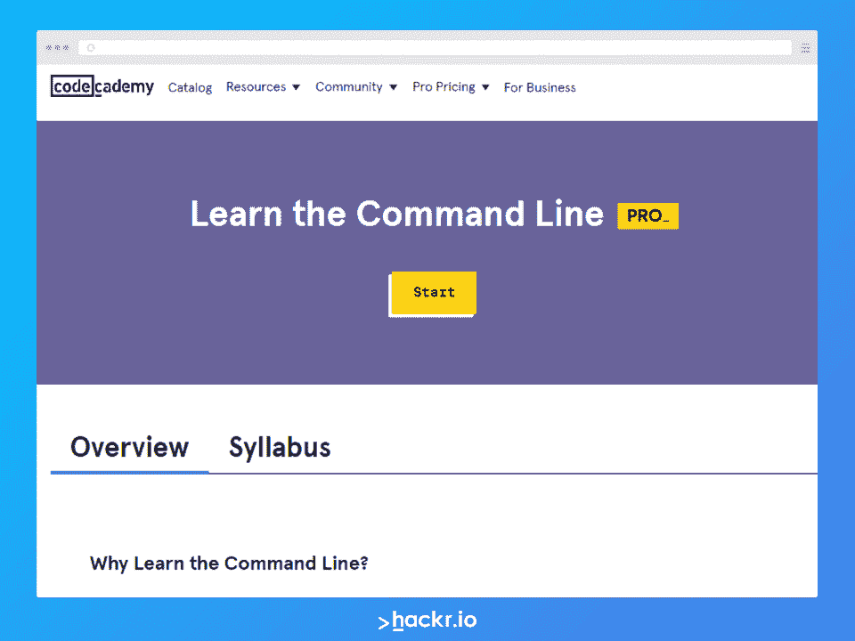

# 适用于初学者的 25 个基本 Linux 命令[推荐]

> 原文：<https://hackr.io/blog/basic-linux-commands>

Linux 是一个功能强大的操作系统，今天被广泛使用，尽管你可能不太明白。来自 TOP500 的数据显示，Linux 为世界 500 强超级计算机提供了 100%的动力，这是一个惊人的统计数据。

Linux 无处不在，它出现在手机、汽车、冰箱和 Roku 设备中。它运行大部分互联网和几台超级计算机。事实上，全世界几个国家的证券交易所都运行 Linux。

Linux 如此受欢迎的原因是它是最可靠、最安全、最健壮的操作系统之一。在这里，我们列出并解释了一些重要的基本 Linux 命令，以便您可以轻松地学习如何使用 Linux。

[点击这里](https://drive.google.com/file/d/1yc1Go6ztfvwsXl6inoehLOWdeWIZn6U3/view?usp=sharing)下载 Hackr.io 的免费基本 Linux 命令 PDF。

## **基本 Linux 命令**

我们在这里列出了 25 个最常见的 Linux 命令。它们不是你需要知道的全部，但它们是最常见的一些。记住， **Linux 命令是区分大小写的。**

### **1。ls**

此命令列出目录内容。如果您使用过 Windows 命令提示符，那么您应该知道命令 dir 用于列出目录中的内容。这就是 ls 命令在 Linux 中的作用——它列出文件和目录。有些版本可能支持颜色编码。蓝色的名称代表目录的名称。

命令*ls-l | more*–帮助对输出进行分页，以便您可以逐页查看。否则列表会快速向下滚动。您可以随时使用 ctrl + c 返回命令行。

```
$ ls -l filename
```

### **2 . CD/var/日志**

这将更改当前目录。请注意，它使用了正斜杠。这里使用的示例将位置更改为所有版本的 Linux 中都存在的 Linux 目录。

当您使用*ls–I*时，您将能够看到目录中内容的更多细节。它列出了以下内容:

*   与文件相关联的权限
*   文件的所有者
*   与文件关联的组
*   文件的大小
*   时间戳
*   文件的名称

```
$ cd /var/log
```

### **3\. grep**

这将在文件中查找文本。grep 命令一次搜索许多文件，以找到您正在寻找的一段文本。

*grep 特征码[文件]*

*grep failed transaction . log*

上述命令将在文件中查找与单词“failed”匹配的所有单词。

```
$ grep ‘failed’ transaction.log
```

【Linux 命令大师推荐教程
[](https://www.pjatr.com/t/TUJGR0lLR0JHRklKSkdCR0ZISk1N?url=https%3A%2F%2Fwww.codecademy.com%2Flearn%2Flearn-the-command-line)

### **4。su / sudo 命令**

有些命令需要提升权限才能在 Linux 系统上运行。您必须以系统管理员的身份运行这些程序。

su 命令更改 shell，以便将其用作超级用户。在使用 exit 命令之前，您可以继续作为超级用户。

sudo 命令用在你只是需要作为超级用户运行某个东西的时候，你可以使用 sudo 命令。这将允许您以提升的权限运行该命令，一旦该命令被执行，您将恢复正常的权限。

关闭计算机系统的关机命令就是一个例子。

*   ***须藤关机 2*:**2 分钟后电脑关机并关机。
*   ***sudo 关机–R2***:2 分钟后关机重启。
*   **使用 *ctrl C* 或*关机**–C*:**帮助停止关机过程。

```
$ sudo shutdown 2
$ sudo shutdown –r 2
```

### **5。密码**

识别您正在工作的目录的一种方法是 pwd 命令。它显示当前的工作目录路径，在目录频繁更改时非常有用。

```
$ pwd
```

### **6。密码**

虽然它看起来类似于 pwd 命令，但是这个命令非常不同。此命令用于更改用户帐户密码。

您可以更改您的密码或其他用户的密码。请注意，普通系统用户只能更改自己的密码，而 root 用户可以修改任何帐户的密码。

*passwd[用户名]* -更改用户的密码。

```
$ passwd admin
```

### 7 .**。mv**

mv 命令移动文件或重命名文件。这里，文件名从 first.txt 更改为 second.txt。

```
$ mv first.txt second.txt
```

键入 *ls* 查看更改。

### **8。cp**

此命令复制文件。 *cp* 命令在同一个目录下发布文件 *second.txt* 的副本。

```
$ cp second.txt third.txt
```

您可以使用*ls–l*来查看创建的新文件。

### **9。rm**

此命令用于删除目录中的文件或目录本身。如果目录不为空，则无法删除。

*rm【文件名】*

*RM–r*删除一个目录中的所有内容以及该目录。

```
$ rm file1
$ rm -r myproject
```

### 10。mkdir

mkdir 命令创建一个目录。命令的写法如下: *mkdir【目录名】*

```
$ mkdir myproject
```

### **11\. chmod**

此命令更改文件系统对象的模式。文件可以具有读、写和执行权限。

例如:

*   *chmod 模式文件*
*   *chmod 744 script.sh*
*   第一个数字代表与文件相关联的用户
*   第二个数字是与文件相关的组
*   第三个数字与不属于用户或组的其他人相关联

```
$ chmod 744 script.sh
```

### **12。chown**

该命令用于更改指定用户/组的文件/文件夹，甚至多个文件/文件夹的所有权。

*chown 所有者名称文件名*

```
$ chown user1 script.sh
```

假设您是一个名为 *user1* 的用户，并且您想要将所有权更改为 *root* ，请使用“sudo”。

```
$ sudo chown root script.sh
```

### 13。猫

*cat* 命令(concatenate 的缩写)是 Linux 中最常用的命令之一。 *cat* 命令允许您创建单个或多个文件，查看文件内容，连接文件(合并文件)，并在终端或文件中重定向输出。

```
$ cat file.txt
$ cat file1.txt file2.txt
```

输出将是文件的全部内容。

### **14。回声**

该命令用于在标准输出或文件中显示文本或字符串。

$ echo“这是一篇关于基本 linux 命令的文章”

输出将是“这是一篇关于基本 linux 命令的文章”，没有引号。

*echo–e*选项作为反斜线转义字符的解释。\n 换行符由 echo–e 命令解释。

```
$ echo –e “This is an article is for beginners. \nIt is on basic linux commands
```

上面命令的输出将是:

```
This is an article is for beginners.
It is on basic linux commands
```

### 15。wc

*wc* (字数)命令用于找出文件参数指定的文件中的新行数、字数、字节数和字符数。

WC[选项]文件名。

```
$ wc –l readme.txt
```

将输出显示为- 120 readme.txt

*   **wc -l** :打印一个文件的行数。
*   **wc -w** :打印一个文件的字数。
*   **wc -c** :显示文件中的字节数。
*   **wc -m** :打印文件中的字符数。
*   **wc -L** :仅打印文件中最长一行的长度。

### 16。男人

该命令用于查看命令/程序的在线参考手册页。

```
$ man grep
$ man mkdir
```

**17。历史**

该命令用于显示以前使用的命令或获取用户执行的命令的信息。

```
$ history
```

### 18。清除

该命令清除终端屏幕。

```
$ clear
```

### **19。apt–get**

apt -get 是 Debian/Ubuntu 系统的一个强大的免费前端包管理器。它用于安装新软件包、删除可用软件包、升级现有软件包以及升级整个操作系统。apt–代表高级打包工具。

```
$ sudo apt-get update
```

### 20。重启

该命令停止、关闭或重新启动系统。

```
$ reboot
```

### **21。找到**

与 find 命令不同， *locate* 命令用于查找文件并在后台运行。

```
$ locate file1.txt
```

### **22。差异**

*diff* 命令逐行比较两个文件，找出不同之处。输出将是不同的行。

```
$ diff file1.txt file2.txt
```

### **23。useradd**

*useradd* 命令创建一个新用户。用户名添加在 useradd 命令之后，如下所示:

```
$ useradd John
```

### **24。退出**

*退出*命令退出当前外壳。当你按下回车键时，你将被带出终端。

```
$ exit
```

### **25。杀死**

*kill* 命令用于结束一个进程，通常是一个没有响应的进程。 *kill* 命令还包括进程 ID 或程序名，如下所示:

```
$ kill 522551
```

## **结论**

我们希望这个 Linux 命令列表能帮助你开始。这只是几个命令，随着时间的推移，您会发现自己会使用更多的命令，但这是一个很好的起点。学习 Linux 的最好方法是亲自尝试这些命令，也可以参加课程。下面我们列出了你今天可以参加的最好的 Linux 课程！

[Linux 管理:2023 年完整的 Linux 训练营](https://click.linksynergy.com/deeplink?id=jU79Zysihs4&mid=39197&murl=https%3A%2F%2Fwww.udemy.com%2Fcourse%2Fmaster-linux-administration%2F)

## **常见问题解答**

#### **1。如何获得 Linux 中所有命令的列表？**

键入 compgen -c 以获取可以运行的所有命令的列表。您将看到一个接一个的命令列表。

#### **2。什么是 Linux 外壳/终端？**

Linux Shell 或终端是命令解释器，它允许您运行操作系统服务和任务。它是 Unix 系统的一个接口，可以帮助你运行程序。这是一个强大的特性，在 Linux 中，bash 是最常用的 shell。

#### **3。什么是 Shell 命令？**

shell 是 Linux 中的命令解释器。通过输入某些 Linux 终端命令，您可以执行特定的任务并使用操作系统服务。

#### **4。在 Linux 中如何编写命令？**

要在 Linux 中编写命令，首先需要打开 Linux 终端。然后，您只需输入命令，其中许多命令在上面已经解释过了

#### **5。如何学习基本的 Linux 命令？**

基本的 Linux 命令很容易掌握，在上面的列表中有解释，它涵盖了初学者的所有 Linux 命令。它们并不复杂，使用它们会很快成为你的第二天性。

**人也在读:**