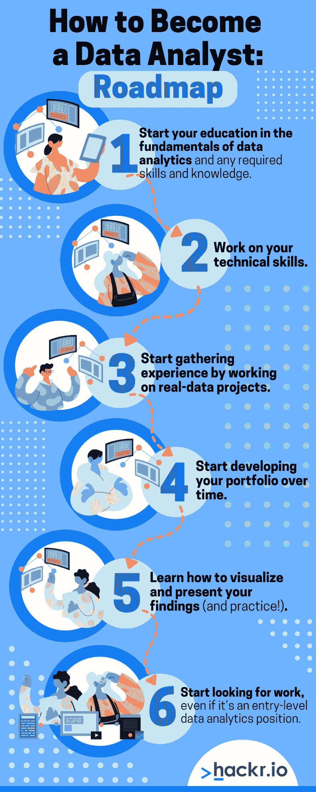

# 2023 年如何成为一名没有经验的数据分析师

> 原文：<https://hackr.io/blog/become-data-analyst-with-no-experience>

所有企业都依赖数据来做出决策。例如，一家咖啡店可能会查看不同时期的销售额，以决定假日的营业时间。类似地，一家软件公司可能会比较劳动力成本和利润来决定来年的人员配备。

无论是哪个行业，[数据分析](https://hackr.io/blog/what-is-data-analysis-methods-techniques-tools)和分析都是战略规划的重要组成部分。如果你喜欢使用数据(或线索、证据或信息)来解决问题并做出明智的预测和决策，你可能会喜欢数据分析师这一职业。事实是，成为一名数据分析师不需要和许多其他 T2 科技职业一样的学校教育。数据分析师的要求甚至不总是包括直接认证，尽管这肯定是有帮助的。

本指南将向您介绍数据分析师的角色，以及如何在 2023 年成为一名拥有或不拥有学位的数据分析师。

在我们进入如何成为一名数据分析师的步骤之前，让我们看看数据分析师的具体工作职责。

## **一览:如何成为数据分析师**

如果你想知道如何成为一名数据分析师，这些步骤可以帮助你:

1.  **开始学习数据分析的基础知识**以及任何必要的技能和知识。
2.  努力提高你的技能。
3.  **通过从事真实数据项目开始积累经验**。
4.  随着时间的推移，开始发展你的投资组合。
5.  学习如何想象和展示你的发现(并练习！).
6.  **开始找工作**，哪怕是入门级的数据分析岗位。

最后，你也可以考虑获得一个高级学位或专业证书，因为这两者都有助于推进你的事业发展。

## **什么是数据分析？**

数据分析涉及分析或审查数据，以得出有意义和可操作的见解。你可以从几乎任何数据集中得出这些见解，包括市场趋势、市场研究、各种统计数据和金融历史。

数据分析有点像拼图，数据(拼图)放在一起，最终向您展示整体情况。然而，数据分析比这稍微复杂一些。数据分析包括清理数据、分析数据，然后将其可视化为更容易理解的信息。

## **什么是数据分析师？**

数据分析师是负责收集、整理和分析数据的专业人员。分析师还使用数据可视化工具，以更容易理解的方式呈现这些信息。数据分析师通常有很强的统计学、数学甚至计算机科学背景。

由于企业转向数据驱动战略，对数据分析师的需求只会继续增长。

## **成为一名数据分析师需要多久？**

没有单一的答案。事实是，你花的时间和别人花的时间是不一样的。考虑这些关键因素:

*   **你的起点:**你是完全从零开始，还是有一些相关的技能和知识帮助你更快的拿起东西？如果你完全从零开始，你可能自然需要更长的时间才能对自己的技能足够自信，从而找到数据分析师的工作。从头开始也意味着你可能要花更多的时间去学习别人已经知道的某些东西，这进一步减缓了你的进步。

*   你的背景:数据分析需要数学和统计学的知识和理解。如果你没有任何背景，你仍然可以成为一名数据分析师！然而，你可能要花更长的时间去理解别人可能更容易理解的概念、技术和课程。

*   你对数据分析师教育的选择:当你开始学习数据分析师职业所需的技能时，你有几个选择。你可以通过自学或参加在线课程和训练营来完全自学。或者，你可以上大学并获得学位。

以上因素影响你成为一名数据分析师需要多长时间。这可能需要短短几个月的时间，尤其是如果你已经有了相关的背景和起点。然而，如果你从零开始，去大学获得这个领域的学位，你可能需要几年时间。

## **数据分析师是做什么的？**

公司收集每项业务活动和支出的数据，包括运营成本、销售数据、库存和供应数据等。但是一旦他们有了这些数据，他们就需要将它们转化为能够为决策提供依据的信息。

数据分析师将来自客户、产品、绩效和成本的数据转化为指导战略决策的宝贵见解。例如，他们可以帮助企业规划产品开发，并预测哪些受众最有可能获得成功。

*备选:数据分析师角色图*

## **数据分析师的角色和职责**

以下是数据分析师的职责细分:

1.  **收集数据:**分析师从调查、网络分析和购买数据集收集数据。然而，分析师不必自己收集所有的数据—有时，企业可以为他们提供这些数据。
2.  **识别数据错误:**分析师纠正任何数据错误，包括重复数据。他们还识别异常值和异常值。此外，分析师使用 Microsoft Excel、商业智能工具或编程语言等工具来确保一致性，以保持解释的准确性。
3.  **创建模型:**数据分析师通常也负责数据建模，他们设计数据库结构，并确定如何存储和比较数据类别。
4.  **解读:**然后，数据分析师在经过处理的数据中发现趋势和模式，将其转化为有价值的见解。
5.  **语境化:**然后，分析师将在更大的业务背景中找到与解释数据的联系，包括本地和国际层面的整体市场和行业趋势。
6.  **演示:**最后但并非最不重要的一点是，分析师必须使用图形、图表和其他工具向利益相关者、客户、管理层和同事传达数据发现和解释。

## **数据分析师资质**

许多数据分析师追求专业认证，以获得该角色的知识并找到工作机会。这可能看起来像是数学、科学、计算机科学、商业或统计学的四年制学士学位。或者，它可能看起来像一个**专业证书项目**，允许学习中有更多的灵活性。两者都提供额外津贴，如人际关系网和更有条理的教育。

但是，专业认证和学位并不是成为数据分析师的必要条件。

## **数据分析师技能**

数据分析师拥有容易转移的[技能](https://hackr.io/blog/top-data-analyst-skills)。也就是说，要成为一名成功的数据分析师，你不一定需要学位。但是，以下资格和知识肯定会帮助您成为一名数据分析师:

1.  **编程语言:**数据分析师使用统计编程语言来呈现、分析和解释数据。通常，数据分析师的职位描述会指出他们希望候选人掌握的[编程语言](https://hackr.io/blog/which-programming-language-is-best-for-getting-a-job)。但是，如果你有 [Python 或 R](https://hackr.io/blog/r-vs-python) 知识，你就安全了，因为它们是最常见的。
2.  **数据工具:**数据分析师使用各种软件和工具来完成工作。Google Sheets 和 Excel 在所有行业都很常见，而 [SQL](https://hackr.io/blog/sql-certifications) 则是处理大量数据的更高级工具。
3.  **可视化和演示技巧:**数据分析师必须让复杂的数据易于理解。良好的沟通技巧对这个角色来说至关重要，可视化和演示工具如 Tableau 和 Jupyter Notebook 也有帮助。
4.  **统计:**大多数数据分析师对数学和统计有广泛的理解，这有助于识别数据错误并更有效地解释数据。

作为一名数据分析师，意味着学习、了解和使用您所掌握的工具，从海量数据中找到可操作的见解。这些工具让数据分析师的生活变得更加轻松和高效。

但是这些到底是什么工具呢？我们列出了以下几项，包括但不限于:

1.  **商业智能工具**:商业智能工具是一些最流行的数据分析工具。顾名思义，BI 工具在业务分析中最常用于分析和监控数据以及提取关键见解。这些工具也经常帮助分析师报告他们的重要发现。BI 工具有各种风格和类型，因此几乎任何技能水平都有适合的。
2.  **编程语言**:由于数据分析和数据科学的持续发展，仅使用电子表格程序进行数据处理的日子已经一去不复返了。许多数据分析师学习一些数据分析和数据可视化工具中使用的各种编程语言。此外，为了与[数据科学家](https://hackr.io/blog/data-analyst-vs-data-scientist)，工程师，开发人员和其他团队成员合作，可能有必要了解某些编程语言。一些更流行的语言是 R、Python 及其框架和 SQL。
3.  电子表格程序:电子表格程序，最流行的是行业标准的 Microsoft Excel，是数据分析中使用的一些最古老的传统工具。这些程序最好的一点是，所有技能水平的人都更容易使用它们，不管他们是不是数据分析师。例如，Excel 不需要几个月或几年的培训，甚至带有一些内置的数据可视化工具，如图表和图形。
4.  **数据清理工具**:数据清理工具负责帮助数据分析师准备海量数据进行分析，同时最大限度地减少甚至消除错误、不一致和数据重复。诸如此类的工具有助于数据分析师更准确、更高效地工作。
5.  **统计分析工具**:这些工具使用统计分析技术来探索、操作和分析数据，以便提取和生成可操作的见解。统计分析工具往往更具技术性，需要更多的学习。
6.  **SQL 控制台**:这些控制台允许用户编写和执行 SQL 语句。SQL 是一种编程语言，用于查询和管理关系数据库中的数据。它非常擅长处理结构化数据，通常用于业务情况和其他数据场景。
7.  **特定于行业的分析工具**:一些数据分析工具是特定于行业的，这意味着它们仅在特定行业内可用。如果你正在寻找一份特定行业的数据分析师工作，考虑研究你需要学习的特定行业工具，以便抢占先机。
8.  **数据建模工具**:数据建模工具帮助分析师创建模型来设计系统和构建数据库。这些工具通常看起来像线框工具，因为它们使用相似的形状、箭头和图形来描述数据将如何流动和连接。
9.  **数据可视化工具或平台**:数据可视化工具创建原始数据的可视化描述或表示。它们可以帮助将数据转化为易于理解、消化和记忆的信息，即使是外行人也能理解、消化和记忆。
10.  **自动化工具**:正如我们已经讨论过的，数据分析工具让分析师的生活变得更轻松、更高效。自动化工具也是类似的，它们帮助分析师执行数据分析任务，同时在此过程中几乎不需要人工输入或交互。自动化可以将分析师从其他任务中解放出来，从而进一步提高生产率。

这些只是数据分析中使用的许多工具中的一部分。毫无疑问，在不久的将来，会有更多的东西供分析师学习和使用。随着工具变得越来越复杂，很容易理解数据分析师角色对计算机科学的日益重视。

## **如何成为一名数据分析师:一步一步的指南**

我们已经非常详细地讨论了数据分析师工作的要求。现在，让我们来看看成为数据分析师的步骤——从头开始！

### **1。开始您的数据分析基础教育**

如果你是数据分析的新手，你可以从学习基础知识开始。基础知识是至关重要的，因为接受这种教育可以帮助你更容易地获得可能随着时间的推移而发展的新概念、工具和方法。基础教育还可以让你更广泛地了解数据分析，帮助你确定这个领域是否适合你。

过去，即使是初级职位也可能需要学士学位。今天的大多数职位仍然要求学士学位。但随着技术的进步，越来越多的公司开始取消这一要求，这意味着无论你的教育程度如何，你都可以找到工作——只要你能证明你拥有所需的知识和技能。

### **2。提高你的技能**

数据分析需要各种技能，取决于工作和你进入的行业。然而，大多数工作都需要一套特定的技术技能，你应该尽快开始培养和提高这些技能。不管你是如何学习数据分析的，有一些重要的技能是你不能跳过的。

你可以从以下几个方面开始提高你的知识和实践你的技能:

*   统计数字
*   数据清理和准备
*   Python 及其数据分析框架，如 Matplotlib、Scikit-learn 等等
*   编程语言
*   SQL(编程语言)

开始学习一些最流行的数据分析和可视化工具也可能是有益的。

### **3。通过从事真实数据项目开始积累经验**

学习和真正理解一件事情的最好方法之一是通过经验。从事真实数据项目可以帮助您获得一些实践经验，同时还可以教会您如何在现实世界中处理数据。您可以加入项目或设计自己的项目，方法是访问一些免费提供的公共数据集，并围绕它们创建您的项目。

一个提供真实数据集的资源是 NOOA 国家海洋和大气管理局。甚至 NASA 也有公开的数据集。

如果你不完全确定你在做什么或如何开始一个项目，你可以寻找指导项目(通常在在线课程中提供)。

### **4。随着时间的推移发展您的投资组合**

数据分析师角色的要求之一是投资组合。通常情况下，当你申请时，公司会问你要你的文件夹，因为文件夹有助于显示你对该领域的理解，同时展示你的技能。强大的投资组合会让你比其他申请者更有优势。

尽快开始收集你最好的作品。当你最终整理好你的投资组合时，它会给你更多的选择。你可以使用像 [GitHub](http://github.io) 这样的服务来存放你的项目。

但是仅仅放在一起是不够的——你还应该选择展示基本数据分析技能的项目，例如从各种来源收集数据或清理和标准化原始数据。你还应该展示你将数据可视化成可访问的、吸引人的格式的能力，如彩色图形和图表。

你甚至可以包括你参与过的小组项目，因为它们可能有助于展示你的协作能力。

### **5。学习如何想象和展示你的发现(并练习！)**

没有可视化，数据分析是不完整的。数据可视化允许您清晰易懂地展示您的发现，即使是对那些技术知识不太丰富的人。您可以学习各种各样的数据可视化工具，包括许多免费选项，如 [Tableau Public](https://public.tableau.com/app/discover) 。

学会如何展示你的发现也很重要。如果你不擅长公开演讲或在会议上控制自己，一点点练习可能对你有好处。

### **6。开始找工作吧！**

一旦你积累了一些经验和强大的投资组合，下一步就是开始找工作。你可能需要从一些入门级的职位开始，直到你可以开始晋升并寻找更高级的职位。你也可以开始准备工作面试，给自己一个更好的成功机会。这些[数据分析师面试问题](https://hackr.io/blog/data-analyst-interview-questions)可以有所帮助。

### **推进您的职业发展:继续教育和认证**

最后，一旦你找到了工作，你就可以继续你的学业。如果你还不知道编程语言和框架，那就去学吧。你也可以学习更多关于数据分析工具的知识，寻求专业认证，或者考虑更高的学位。

更多的技能、认证和高级学位有助于推进你的职业生涯。此外，它们可能会帮助你最终转变为一名数据科学家。

## **如何成为一名没有经验或学位的数据分析师**

不是每个人都能负担得起学位课程或专业认证。如果你缺乏成为数据分析师所需的经验和技能，但负担不起上学所需的时间或金钱，以下是如何成为数据分析师的方法。遵循这些步骤，获得成为数据分析师的必要知识。

1.  **从自学开始**

互联网上有丰富的知识，你可以免费获取。如果你有纪律和动力，考虑自己学习数据分析技能。您想要学习的一些技能包括 Python、R、数据可视化、统计学和 SQL。你可以考虑从 [Python 教程](https://hackr.io/tutorials/learn-python)开始！

2.  **试用数据分析项目**

是时候将你的知识应用到实际项目中了。收集了一些技术技能后，你可能会考虑以下 [10 门最佳在线数据分析课程](https://hackr.io/blog/data-analytics-courses)或数据分析师认证。确保你选择的课程或证书允许你设计数据项目并展示你的发现。

另一种处理项目的方法是寻找免费的数据集，比如从公共存储库中，来进行你自己的解释和实践。

3.  **创建投资组合**

一旦你有了几个项目的经验，你就可以把它们放在一起组成一个投资组合。你的投资组合展示了雇主在聘用你担任数据分析师之前希望看到的能力。

GitHub 是展示你作品的好地方。你可以看看其他的专业作品集来寻找灵感，拓宽你的人脉，甚至找到工作机会。

4.  **申请实习和工作**

整理简历，润色作品集，申请入门级数据分析师职位。你可以考虑接触你通过项目、课程和自学建立的网络。像 Indeed 这样的招聘网站也是寻找潜在工作机会的好地方。

成为数据分析师需要的时间由你决定。这可能需要几个月到几年的时间，取决于你的投入程度、每周工作时间、教育途径和人际关系网能力。

## **成为数据分析师后的工作前景**

数据分析师有需求吗？当然——数据分析师都有一个充满希望的工作前景。预计未来十年市场将至少增长 20%。例如，市场研究分析师的工作增长率预计为 22%，运营研究分析师为 25%，统计学家为 33%。即使是 22%，这个增速也是全国平均水平的好几倍。

*Alt:数据分析师工作前景图表*

看看这张谷歌趋势图，可以追溯到 2004 年的“数据分析师”一词。正如你所看到的，从 2011 年左右开始有一个稳定的增长。你在最后看到的大跳跃是谷歌改进数据收集技术的结果。然而，人们的兴趣很明显，对数据分析师的需求也在持续增长。

然而，进入数据分析师的大门仅仅是个开始。随着越来越多的公司采用数据驱动战略并投资于数据专业人员和大数据项目，数据分析师的角色继续变得更加复杂。在这个领域，新的策略、工具和进步源源不断，这意味着在你的职业生涯中，你将不得不继续学习新的东西。

作为一名数据分析师，你的主要职责将包括实际处理大量数据，以检索一些可操作的见解。然而，随着技术的发展和工具变得越来越复杂，分析师的角色也是如此。

越来越多的分析师发现他们不得不学习如何使用预测分析和数据建模来提取洞察力和数据可视化来显示它们。

虽然你可能会进入一个数据分析师的职位，但随着时间的推移，你的职责可能会发生变化。随着您不断学习新的工具和技术，您可能会慢慢成为一名数据科学家。

## 作为一名数据分析师，你期望的薪水是多少？

据 Glassdoor 报道，在美国，数据分析师的平均年薪约为 71，884 美元。

根据美国劳工统计局的数据，在美国，数据分析师的薪水在 65，000-86，000 美元之间。工资范围涵盖了各种类型的数据分析师，某些类型可以期待更积极的就业前景。

## **推荐数据分析师课程**

如果你已经做到了这一步，并且你非常确定你想成为一名数据分析师，那么最好的起点之一就是注册一门在线课程。在线课程通常比其他课程更便宜，同时也提供了更多的灵活性，可以帮助你根据现有的时间表进行学习。

*Hackr.io 整理了一份* [*最佳数据分析课程*](https://hackr.io/blog/data-analytics-courses) *的清单，帮助你入门。*

有许多很棒的课程可供选择，每个课程都有不同的技能水平和起点。以下是我们的一些主要建议:

## **结论**

想知道如何进入数据分析领域？你挑吧。

如何成为数据分析师的答案对每个人来说都不一样。你可以通过学位来获得更多的结构，或者选择自学和网络来节省成本和时间。

当然也可以走网络课程方向，比全自学更有结构性。无论如何，我们希望这个指南能帮助你找到成为数据分析师的最佳途径！

希望扩展您的数据分析知识和资格？

**查看** [**数据分析师认证**](https://hackr.io/blog/best-data-analytics-certification) **。**

## **常见问题解答**

#### **1。3 个月能成为数据分析师吗？**

成为一名数据分析师需要的时间取决于你的起点，每周的时间投入，以及你选择的教育途径。你可以在三个月内成为一名数据分析师，但如果你是从零开始，并且没有相关技能的背景，你可能需要(长得多)的时间。

#### **2。成为一名数据分析师很难吗？**

如果你有数据分析师工作所需的数学和计算机科学背景，就不会。如果你已经有了扎实的背景和一些相关的经验，转行可以相对容易。另一方面，从头开始学习可能是一个艰难的过程。

#### **3。成为数据分析师需要编码吗？**

数据分析师的职业生涯可能需要一些编码和编程知识。一些数据分析师是经验丰富的熟练程序员，而其他人可能使用分析软件或电子表格软件(如 Microsoft Excel)来完成工作。最好是学编程，以保证将来更好的职业生涯，但截至目前，可能仍有不要求编码经验的招聘信息。

#### **4。数据分析师在家工作吗？**

数据分析师经常在家工作，尤其是远程工作越来越受欢迎。

#### **5。成为一名数据分析师应该学些什么？**

尽管数据分析师通常受益于 STEM 或计算机科学学士学位，但学位并非绝对必要。

甚至一门课程就足够了，尤其是许多公司会寻找有技能的员工，而不是纸上的证书。除了一些编程语言和其他数据分析和可视化工具，你还应该学习一些最好的和最流行的商业智能软件。

#### **6。数据分析师有需求吗？**

毫无疑问，越来越多的公司正在采用数据驱动的业务方法。看看这篇 [2017 福布斯文章](https://www.forbes.com/sites/louiscolumbus/2017/05/13/ibm-predicts-demand-for-data-scientists-will-soar-28-by-2020/?sh=557a2f817e3b)讨论 IBM 如何预测数据专业人员的需求增长。这些预测中的许多都成为了现实，而需求只会继续增长。

**人也在读:**