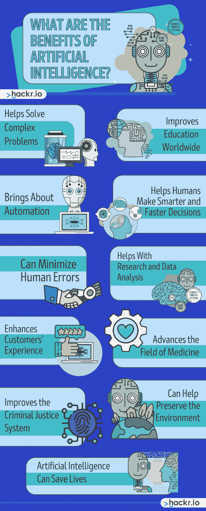
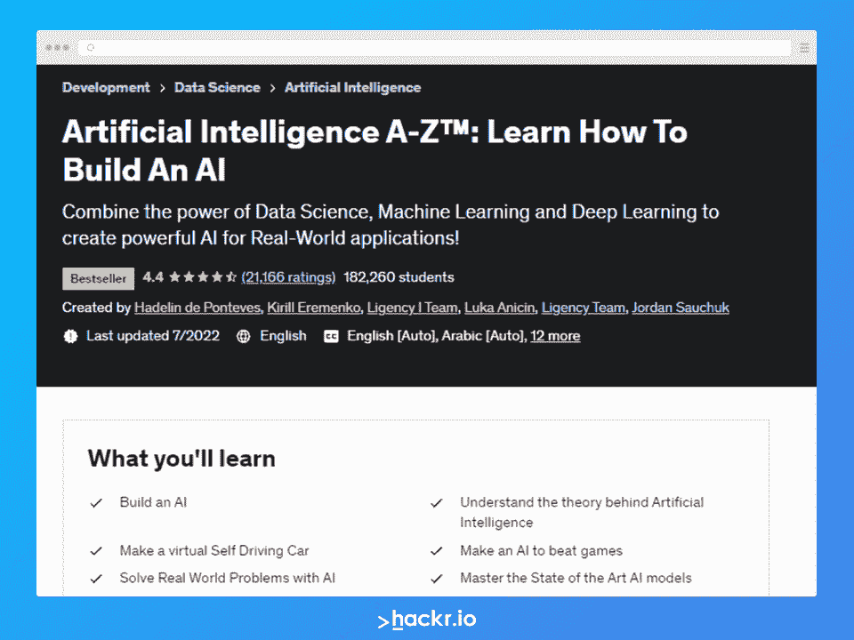

# 2023 年人工智能的 11 大好处

> 原文：<https://hackr.io/blog/benefits-of-artificial-intelligence>

人工智能(AI)是未来的一部分吗？Statista 显示，仅在 2021 年，全球就有 935 亿美元投入人工智能。数十亿美元的现金和快速的技术突破给了我们一个人工智能似乎可行的未来。超智能可能会发生，也可能不会发生，就看你问哪个专家了。但是今天，我们正在使用某种形式的人工智能来驱动我们的日常任务。

智能手机拥有人工智能，可以帮助处理日常事务、搜索和拍照。车辆还配备了一种人工智能，可以帮助停车，碰撞，行人，甚至巡航控制。尽管人们担心人工智能会接管人类或者根本不会发生，但从这一切中有一点可以得出:这项技术有许多好处和几乎无穷无尽的应用。

但是人工智能在当前这一年到底有什么好处呢？如果有的话，缺点是什么？

## **什么是人工智能？【定义】**

从 Cortana 到自动驾驶汽车，人工智能发展的快速进展没有放缓的迹象。人工智能可以涵盖从搜索引擎算法到机器人技术的几乎任何东西。

这里有一个更详细的 AI 定义:人工智能(AI)是计算机科学的一个跨学科分支，可以构建智能机器。这些机器能够完成复杂的任务，甚至是需要人类智慧的任务。人工智能使用多种方法，如深度学习和机器学习，让工作变得更自然。这两种能力的巨大进步已经在科技行业的所有领域引起了一场范式转变。

人工智能有两种类型:狭义人工智能(弱人工智能)和广义人工智能(AGI 或强人工智能)。

### **1。狭义人工智能**

这种类型的人工智能是今天每个人都在使用的。窄人工智能的设计参数是它只能执行“特定的小任务”例如，面部识别软件“只”用于识别面部，而不是汽车或其他物体。这种类型的人工智能可以在特定的任务上胜过人类，如国际象棋，但除此之外别无其他。

### **2。通用人工智能**

艾将军(AGI)是每一个研究者的目标。虽然狭义的人工智能处理特定的任务，但 AGI 的范围要广得多。当涉及到认知任务时，这种类型的人工智能将使人类大吃一惊。想想看，机器人看起来像人类，但更聪明、更快、更强壮。

现在，我们对它有了更多的了解，让我们深入研究一下人工智能的利弊。

## **人工智能有什么好处？**

人工智能能够全天候工作，没有停机时间。相对于需要时间休息、进食和睡眠的人类来说，这本身就是一个显著的进步。当人类需要休息时，人工智能可以代替他们。人工智能还可以在全球范围内和广阔的市场上部署，这使得在任何地方采用智能解决方案成为可能。

该技术有无数的好处，但人工智能的积极影响到底是什么？

### **1。人工智能帮助解决复杂问题**

所有专注于人工智能开发的企业，以及投入该技术的所有投资，都有助于实现重大进步。现在，机器和深度学习模型帮助 AI 解决一些复杂的问题。

例如，一些商业部门现在使用人工智能来做一些事情，如检测欺诈或与客户进行个性化互动。在许多情况下，客户甚至不需要与人交谈就可以解决他们的问题！

### **2。人工智能可以帮助改善全球教育**

每个人都以自己喜欢的方法和自己的速度学习。现有的教育体系和方法是可行的，但并不适合所有人。目前的教育无法满足每个人的特定需求，因此学生可以以最适合他们的方式学习。AI 在这方面受益于教育。

人工智能可以帮助确定学生的学习风格。它还可以帮助准备有效的个性化课程或教案。

人工智能的这种特殊应用和优势仍在探索中，但我们毫不怀疑在不久的将来会取得进展。有了人工智能，优质教育在世界范围内成为可能。

### **3。人工智能带来自动化**

AI 最大的优势之一就是自动化。IBM 称，自动化是程序、技术或机器人的应用，以最少的人力投入实现结果。自动化对运输和通信等行业产生了重大影响。它也有助于改善服务和计算机产品行业。

自动化消除了许多重复性和繁琐的任务，这些任务经常会导致人为错误或伤害。由于提高了效率，它可以提高生产率和生产率。有了自动化，工作进行得更快、更安全，同时更有效地使用原材料。

最终结果是，人工智能可以带来业务效率、增加产量、缩短交付周期、提高产品质量以及改善工作场所(和产品)安全。

你可以在一家公司的客户支持系统中看到自动化的例子。在许多情况下，聊天机器人或人工智能处理许多客户的投诉，减少了对客户服务代表等人力的需求。

**推荐 AI 课程**

### **4。人工智能可以帮助人类做出更聪明、更快速的决定**

人类的情感和思想倾向于以多种方式影响决策。另一方面，人工智能运行在纯逻辑和数据上，不涉及任何情感。结果是人工智能的另一个优势:人工智能可以帮助人类更快地做出更明智的决定。

人工智能可以帮助协调数据交付和发展一致性。它还能够分析数据、注意趋势、提供预测以及量化风险和不确定性。最棒的是，人工智能一般是不偏不倚的(如果它是那样创造出来的)。人工智能的最终报告可以帮助公司高管和领导者为他们的组织做出最佳决策。

你可以在金融和贸易领域看到这一点。如今，算法交易已经成为常态，帮助人类做出更明智的决定，决定何时买入或卖出什么股票。

### **5。人工智能可以最大限度地减少错误**

无论任何人多么小心，人的失误总是会在某个时候发生。然而，在人工智能的帮助下，人类的错误可以被最小化，在某些情况下，可以被消除。

例如，自动化工具可以处理许多数据输入或处理工作，使后端系统运行更顺畅，因为数据处理错误在很大程度上被消除了。

### **6。人工智能有助于研究和数据分析**

人工智能的主要好处之一是它对研究和数据分析有多大帮助。任何行业都可以使用人工智能来帮助进行数据分析，但毫不奇怪，受益最大的领域是科学。在研究环境中使用人工智能可以帮助科学家发现数据中的趋势和结果，否则这些趋势和结果是不可能注意到的。人工智能不仅有助于提取和分析数据，还可以检测任何模式并预测可能发生的事情。

比如人工智能已经在[人类基因组研究](https://www.labmate-online.com/news/news-and-views/5/breaking-news/laboratory-ai-how-does-it-help-scientific-research/56823#:~:text=The%20100%2C000%20Genomes%20Project)中使用了相当一段时间。在这样的研究中，人工智能被用来预测蛋白质结构可以获得的形状。AI 然后被用来预测这些蛋白质结构如何影响人体。通过这种人工智能辅助的研究，科学家能够改善医疗诊断程序，并开发出突破性的新治疗方法。

### **7。人工智能有助于提升客户体验**

你是否曾经需要与一家公司取得联系，却发现一个聊天机器人已经准备好解决你的每一个问题？这可能会令人沮丧，尤其是如果该公司使用的是一种原始或“廉价”版本的人工智能，本质上是一种自动回复功能。

然而，毫无疑问，人工智能越来越智能，越来越好——一些聊天机器人可以帮助快速解决客户的担忧。在这种情况下，客户的问题会很快得到解决，让他们感到满意。另一方面，企业可能需要更少的客户服务代表，因为人工智能只会升级需要人工干预的票证。

人工智能辅助客户体验的另一个例子是，一家公司让客户更容易重新订购。例如，客户订购了一种消费品。他们需要一定的时间来用完，然后再订购。然后，该公司将回忆起客户订购了什么以及订购的频率，以便他们可以发送一封温和的电子邮件提醒(或移动推送通知)，让他们知道何时该再次订购。

### **8。人工智能可以帮助推进医学领域**

我们已经讨论了人工智能如何帮助研究和数据分析，以及它如何导致医学领域的进步。事实上，人工智能对社会的最大好处之一是人工智能如何帮助医疗和保健行业取得进步。

这些进步的例子是患者监测技术，该技术允许远程护理和诊断，而患者不必去医院。这项技术仍在探索中，但 Fitbit 和 Apple Watch 等可穿戴设备正朝着这个方向发展。2021 年被谷歌收购的 Fitbit 开始探索健康指标和趋势等功能，告知用户他们的基线，以便他们可以注意到异常。

[深度学习人工智能算法](https://hackr.io/blog/best-online-deep-learning-course)正在探索其帮助早期癌症诊断的潜在能力。早期癌症诊断通常对良好的预后至关重要。

### **9。人工智能在刑事司法系统中有一席之地**

今天，侧写师、行为心理学家和法医心理学家提供了对犯罪行为和动机的洞察。然而，人工智能也开始在刑事司法系统中找到自己的位置。当以公正的方式创建时，人工智能可以处理和分析数据，并检测人类可能会错过的模式。人工智能的预测性质已经导致执法和刑事司法的许多领域采用它，例如在算法风险评估的情况下。

值得一提的是，人工智能在执法中的应用还有很长的路要走。这是至关重要的人工智能在这方面的使用是不偏不倚的，因为人类的生命处于危险之中。考虑到在一些司法管辖区，人工智能现在被用来协助确定保释、刑事判决和假释事宜，这一点尤其如此。

### 10。人工智能可以帮助保护环境

人工智能的另一个好处是它可以帮助保护环境。结合机器人领域，人工智能有可能帮助改善全球的回收系统——特别是通过更好地分类可回收物。

人工智能还可以通过帮助管理可再生能源(最大限度地提高效率)、预测能源需求和改善全球农业实践来帮助减少气候变化的影响。

### **11。人工智能可以拯救生命**

人工智能最好的优势之一是它有可能帮助拯救生命。它可以通过帮助更准确地预测洪水、龙卷风和飓风等自然灾害来做到这一点。早期检测可以帮助当地政府决定是否将人们撤离危险区域。人工智能甚至被用于帮助确定地震余震可能发生的时间和地点。

**准备好成为人工智能专家了吗？查看本课程:**

[牛津人工智能项目](https://getsmarter.sjv.io/c/2890636/1143816/13499)

## **人工智能有哪些缺点？**

每个硬币都有两面。自然，人工智能也有优点。但是，你知道人工智能的缺点吗？下面我们来讨论一下。

### **1。人工智能造价昂贵**

开发人工智能*不便宜*。它需要技术—硬件和软件—需要不断更新以保持有效性和相关性。人工智能非常复杂，需要维护，除了最初创建之外，还会产生持续的成本。

### **2。人类可能会变懒**

随着人工智能完成大部分工作，人类*可能*变懒——这是反对全球采用人工智能的最大论据之一。这可能会导致蝴蝶效应，人类可能不会费心学习某些事情和过程，因为人工智能已经完成了这项工作。结果可能意味着失去艺术、知识等等——以及可能变得懒惰和自满的后代。

### **3。人类可能会失业**

AI 最大的利弊之一就是自动化。正如自动化可以简化流程、增加产量和降低成本一样，它也可能导致人类在某些行业失业。当人工智能接管重复性和/或乏味的工作时，它可能会导致人们意识到一份工作是不必要的，以前从事这项工作的人可能会失业。

## **结论**

人工智能可以提高生产力，让生活变得更容易，甚至提高安全性，并有可能挽救生命。

即使在今天，人工智能已经对人类的日常生活产生了巨大的影响。你可能正在使用某种形式的人工智能来让你的生活变得更加轻松，甚至没有意识到这一点！

人工智能作为一项技术还有很长的路要走，但这并不意味着它已经不是主流了。随着如此多的人选择投资于它的发展，人类在技术上取得更多突破只是时间问题。

我们希望这篇关于人工智能好处的文章能够帮助您更好地了解这项技术。你是人工智能及其好处的支持者还是担心其风险？留下评论，让我们知道。

## **常见问题解答**

#### **1。AI 如何改善我们的生活？**

人工智能给我们的日常生活带来了很多好处。在目前的世界状态下，以今天的现有技术，我们已经看到了 AI 技术带来的改进。现在，我们有像谷歌助手和 Alexa 这样的家庭助手，让家里的事情变得更容易。我们的手机通过面部识别解锁，这是一个“简单”的人工智能。AI 在日常生活中最大的优势是自动化、提高生产力、安全效益等等。

#### **2。AI 如何造福经济？**

无论是办公效率还是生产效率，人工智能都可以帮助企业改善和简化流程。该技术还可以帮助保护员工安全和防止受伤，做出更快、更明智的业务决策，并创建业务应急计划，即使在发生意外事件时也能保持正常运行。借助人工智能，企业可以更智能地工作，并提高产品和服务的质量。

#### **3。人工智能在日常生活中的重要性是什么？**

人工智能有许多影响日常生活的好处。自动化本身已经是一个很好的优势。但除此之外，其他行业已经开始使用人工智能。例如，医疗领域正在探索使用人工智能来改善疾病诊断的选项。人工智能也可以让企业和经济受益。人工智能还有助于更准确地预测天气和自然灾害。

**人也在读:**