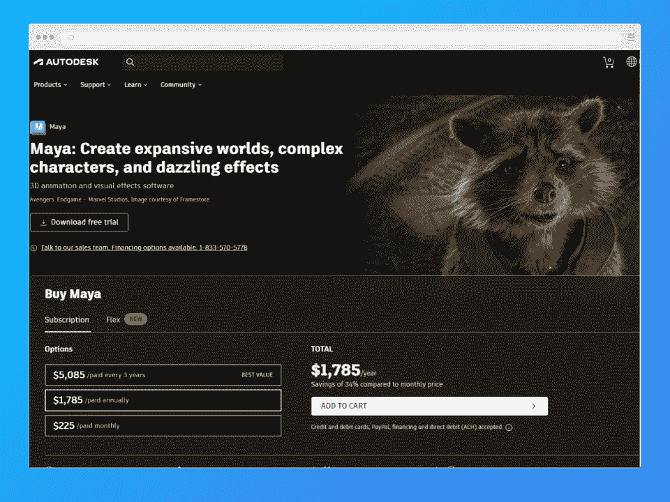
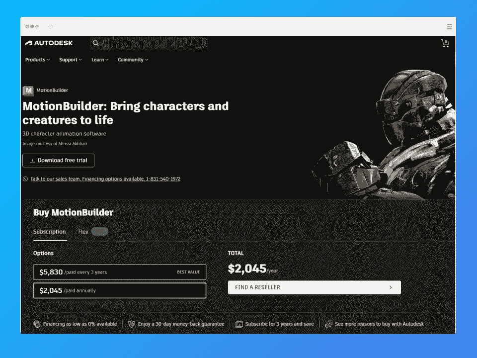
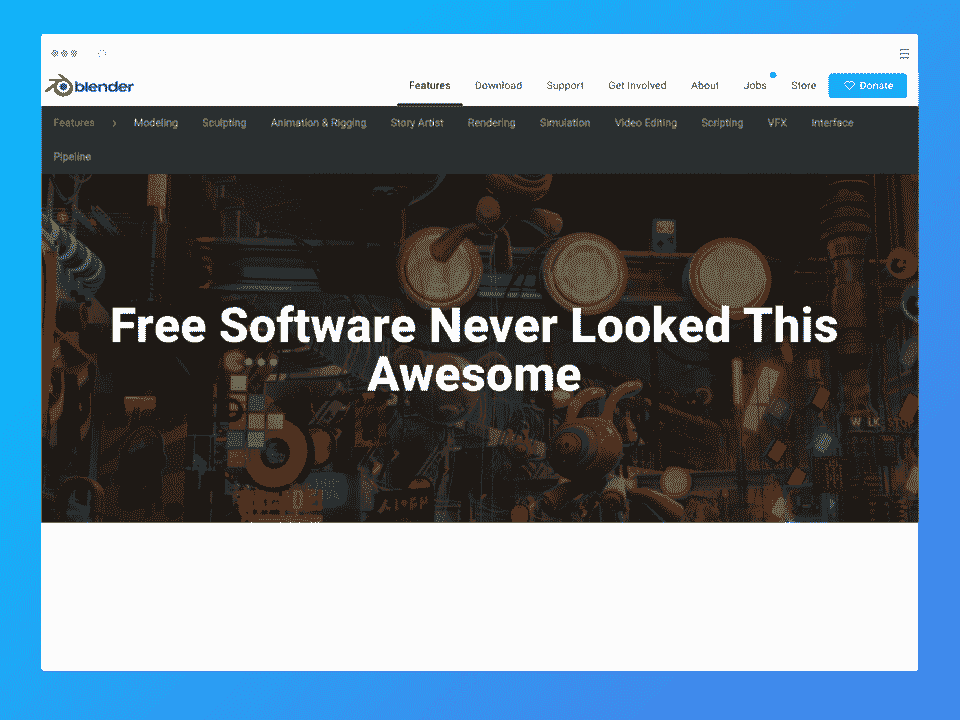
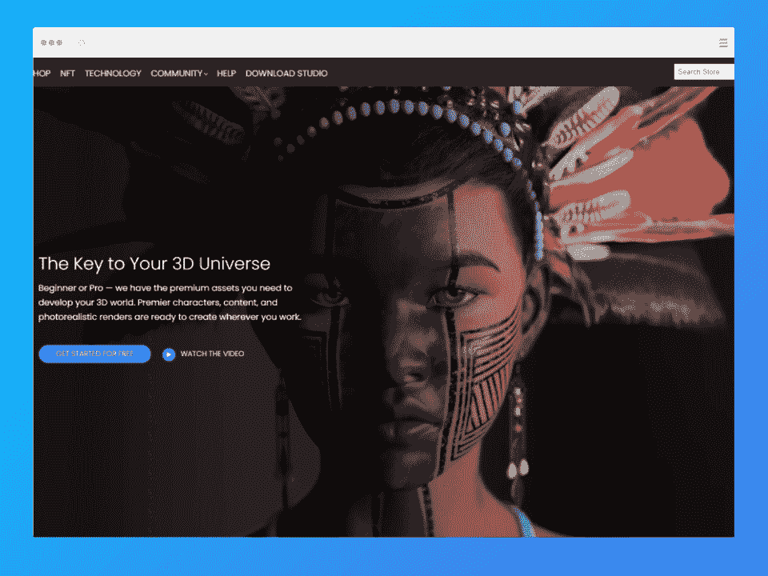
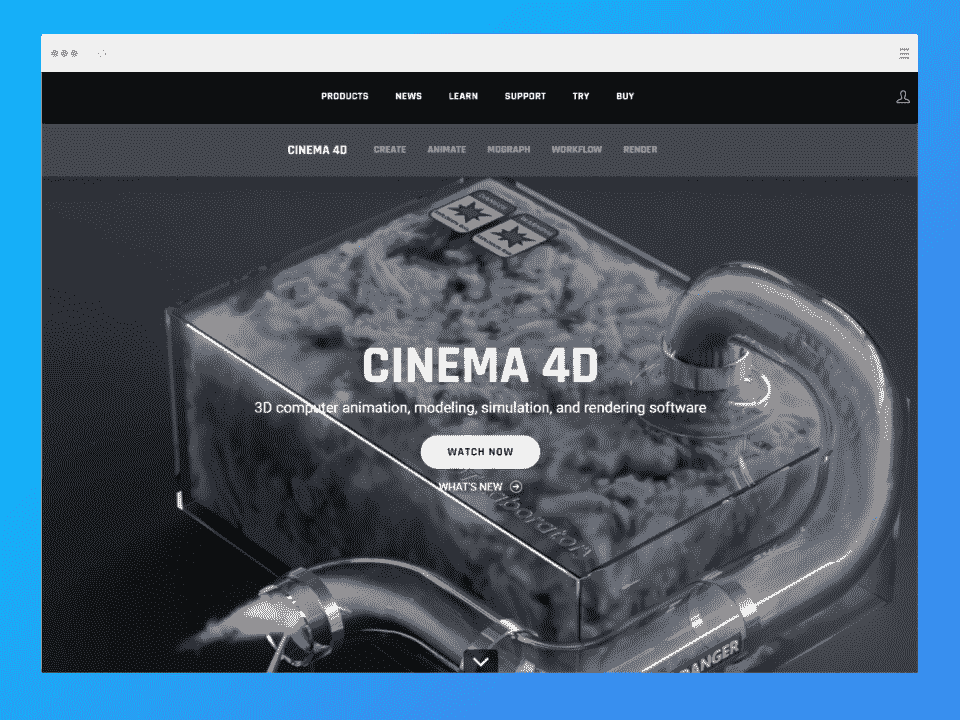
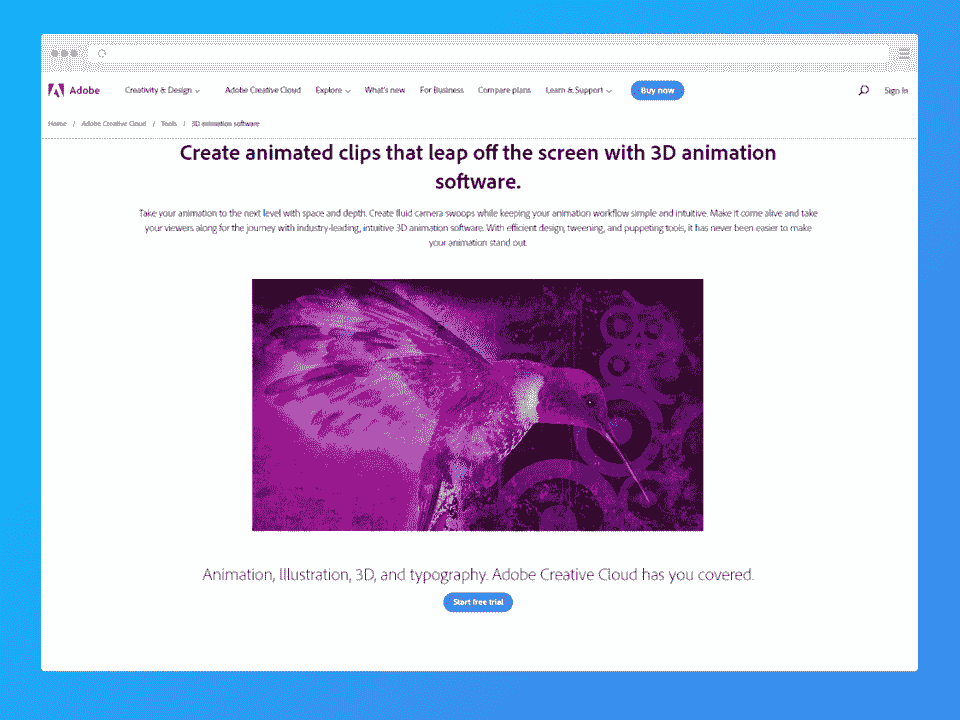
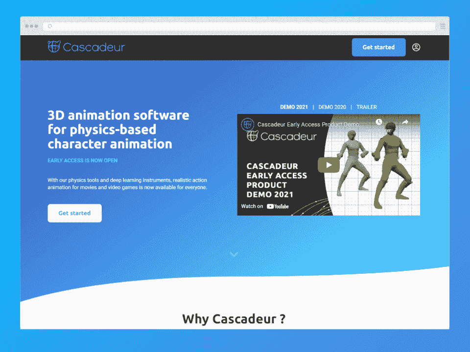
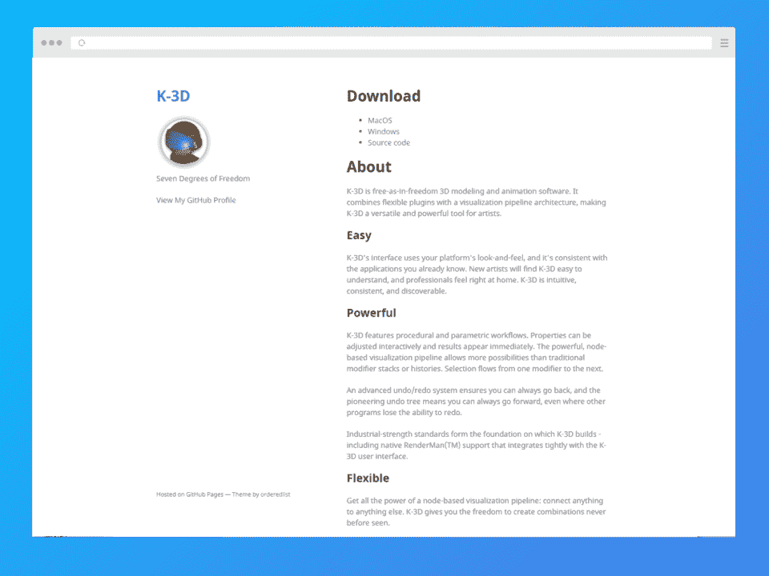
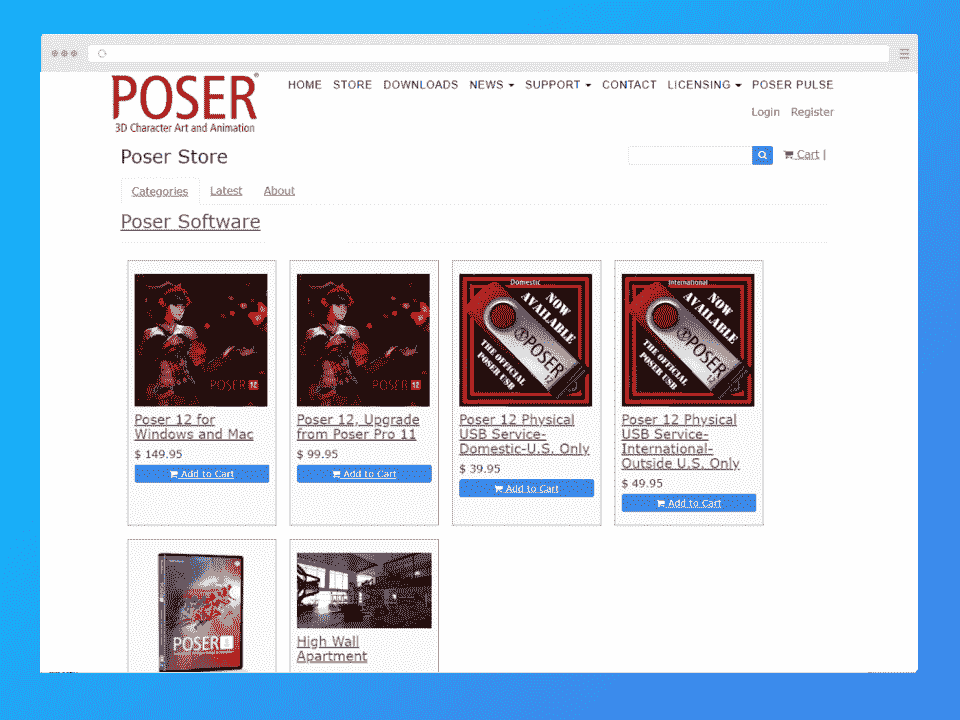
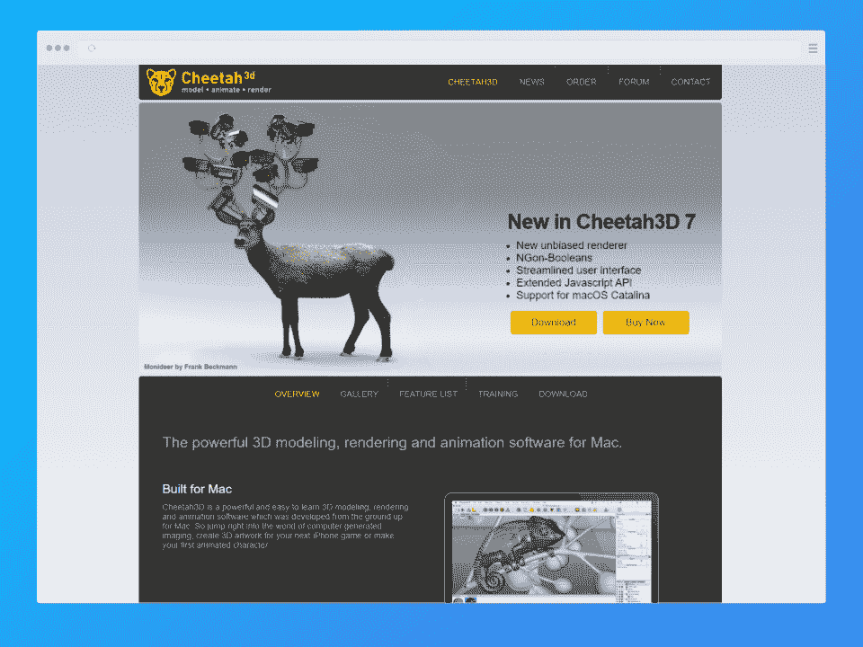

# 2023 年 10 款最佳 3D 动画软件【免费和付费】

> 原文：<https://hackr.io/blog/best-3d-animation-software>

3D 动画在每个设计师心中都有一个特殊的位置。《玩具总动员》和《海底总动员》的怀旧记忆可能会掠过你的脑海，还有你可以用 3D 动画软件做的无限可能。

但是伴随着兴奋而来的是严峻的挑战。几秒钟的 3D 动画需要数小时的工作，更不用说关于不同模型、构图和创造性交流技巧的专业知识了。

除此之外？你需要一个漂亮、直观的用户界面，以及高效的角色创建。听起来很贵，对吧？不总是这样，尤其是如果你是学生的话！在一些[设计书籍](https://hackr.io/blog/design-books)和 [UX 教育](https://hackr.io/blog/ux-design-courses)的帮助下，你可以使用 3D 动画程序来实现你最大的创意愿景。找 3D 动漫电影制作人？或者你最新的视频游戏软件？继续读。

我们将介绍 3D 动画中使用的最新、最流行的计算机程序，并探索价格、功能、评论等等。让那部动画电影在你的脑海中保持新鲜——你很快就会把它变成现实！

首先，我们将从基础开始。

## **如何使用三维动画软件**

没有 [3D 动画](https://infographicworld.com/what-is-3d-animation/)软件的工作原理完全一样。即使是经验丰富的设计师也面临着进入新的动画技术堆栈的学习曲线。

不过，一般来说，这个过程是从用 3D 模型创建对象开始的。有时候，3D 动画软件有预设的模型让你入门。否则，你需要自己做。你可以把一个物体扫描到电脑上来创建这些模型。

然后，您可以使用该软件的工具来操纵每个对象的纹理、线条、颜色和运动。我们知道你在想什么:这和 2D 动画有什么不同？

3D 动画提供了更多的深度，以及沿第三个 z 轴的移动。另一方面，2D 动画仅移动 x 和 y 轴。

现在我们已经解决了这个问题，下面是使用 3D 动画软件的四个步骤:

*   **建模:**由软件或外部扫描生成的具有面的多边形。
*   **动画:**操纵模型创建动画。创建骨架后，可以添加动画变量(Avars)，即角色身体上可以移动的点。接下来是关键帧(不要与[线框](https://hackr.io/blog/best-wireframe-tools)混淆)，在这里你可以移动你的动画角色。

*   **布局:**在这里，你决定每个对象之间有多少空间。

*   渲染:这是你把所有东西放在一起的地方。你的角色和物体被摆好姿势，上色，点亮，然后你的动画序列开始。

现在，大多数 3D 动画软件处理所有这些步骤。但是最好的 3D 动画软件可以解放你的思想，让你专注于你的创意天才，并处理你将愿景付诸行动所需的所有细节。

## **最佳 3D 动画软件**

[****](https://www.autodesk.com/products/maya/overview?term=1-YEAR&tab=subscription)

一个常见的动画挑战是使角色看起来尽可能真实，尽管它是动画。Autodesk 的 Maya 3D 动画软件以其非线性的、基于视频的编辑器来完成这项任务。结果呢？模拟真实生活的动画。

另外，很容易导入和导出 SVG 文件以备后用。

动画师评论称赞 Maya 的平滑过渡、3D 建模、纹理和有用的更新；然而，许多人对该平台的高价格和频繁的崩溃发表了评论。

**功能** : Windows 7 或更高版本，macOS

*   使用新工具定期更新
*   运动图形
*   装备
*   管道集成
*   精确的布料模拟
*   三维建模
*   织构化
*   照明设备
*   翻译

**价格:**$ 205/月

**OS:** Windows 7 及以上；马科斯

[点击此处查看更多。](https://www.autodesk.com/products/maya/overview?term=1-YEAR&tab=subscription)

[Maya 初学者:Maya 3D 动画完全指南](https://click.linksynergy.com/deeplink?id=jU79Zysihs4&mid=39197&murl=https%3A%2F%2Fwww.udemy.com%2Fcourse%2Fautodesk-maya-3d-animation-course%2F)

[****](https://www.autodesk.com/products/motionbuilder/overview?term=1-YEAR&tab=subscription)

Autodesk 的另一个杰作， [MotionBuilder](https://www.autodesk.com/products/motionbuilder/overview?term=1-YEAR&tab=subscription) 是为视频游戏动画师设计的顶级 3D 动画程序。设计师可以通过动作捕捉和关键帧动画实时创建角色。

如果你是一个完美主义者呢？Motionbuilder 为您提供了无尽的工具，让您轻松调整最小的细节。此外，它的切割功能无缝流畅，让你的每个动作都能自然过渡。

每年 1，950 美元有点贵。然而，许多动画师称赞该软件的高质量和功能，使其物有所值。

**特性:**

*   实时动画
*   动作捕捉数据
*   关键帧动画
*   切割和缝合
*   平滑过渡

**价格:**$ 1.950/年

**OS:**Windows 10；Linux 红帽；Linux Centros

[点击此处查看更多。](https://www.autodesk.com/products/motionbuilder/overview?term=1-YEAR&tab=subscription)

[****](https://www.blender.org/features/)

寻找免费的 3D 动画软件？Blender 是一个很好的选择，而且是开源的。我们喜欢它对所有经验水平的动画师和爱好者的易访问性，展示了一个视觉上吸引人的、高度用户友好的界面。您将可以访问 Cycles，这是一个路径跟踪引擎，可以帮助您实现更真实的渲染，即使是在 VR 中。动作捕捉甚至延伸到了*面部*动作捕捉。

当然，Blender 仍然有强大的雕刻和 3D 绘画工具。虽然一些动画师抱怨它在效果上的局限性，但如果你有足够的经验来实现它，它支持 Python 来提供更多的可定制性。

**特性:**

*   脚本语言(Python)
*   光栅图形
*   织构化
*   索具和剥皮
*   视频编辑
*   建筑可视化
*   流体和烟雾模拟
*   默认路径跟踪引擎
*   更现实的循环
*   雕刻工具
*   3D 绘画工具

**价格:**免费

操作系统: Linux，macOS，Windows

[点击此处查看更多。](https://www.blender.org/features/)

[****](https://www.daz3d.com/)

一些评论家可能会称这个 3D 动画程序带有预设的现成模型，有点千篇一律。但是请将 [Daz Studio 的](https://www.daz3d.com/)预设模型视为流程中支持您的工作流程的一个节省步骤。预设模型让匆忙的动画师、随意的设计师和极其细致的艺术家的事情变得简单。此外，来自多个流派的预设道具可以帮助您定制您的角色，以及服装、面部特征、姿势和视觉属性。

需要支持？工作室的大量教程涵盖了照明，纹理，索具，渲染，下载，以及你可能想在动画旅程中采取的每一个可能的行动。

Daz 工作室也是一个极好的工作资源，因为它的 3D 市场可以帮助你在世界各地买卖动画角色。一些动画师哀叹该软件速度太慢，但最近的升级已经纠正了大部分问题。

总而言之，对于有效率的、商业头脑的动画师来说，这是最好的免费 3D 动画软件之一。

**特性:**

*   多类型道具库
*   木偶工具
*   预设模型
*   道具库
*   出售作品的 3D 市场
*   额外收费的网络研讨会和资源

**价格:**免费

**OS:**MAC OS；Windows 操作系统

[点击此处查看更多。](https://www.daz3d.com/)

[****](https://www.maxon.net/en/cinema-4d)

对于高度专业的动画师来说，4D 电影院是一个极好的选择。与高端或高要求的客户合作？请他们每一步的方式与预览渲染和频繁更新。该平台的场景管理器还可以帮助您组织项目。至于你的工作流程？通过将实时电影集成到 3D 动画序列中，您可以进一步简化这一过程。

现在，动作捕捉在 4D 电影院是极好的。您可以记录鼠标光标的移动来反映角色的位置。无穷无尽的工具可以帮助你进一步定制运动，比如参数和独特的肌肉系统。将所有这些与直观的界面相结合，Cinema 4D 在我们的列表中是一款有竞争力的软件。

如果您正在制作汽车动画，4D 电影院独特的汽车装备可以帮助您将它们变得栩栩如生。卡通装备也是一样——赋予角色可以与卡通相媲美的戏剧性特征！

**特点**:

*   场景重建
*   跟踪
*   子弹动力学
*   汽车钻机，卡通钻机
*   面部和身体动作捕捉
*   资产浏览器
*   过程建模
*   运动图形

**价格:**$ 58/月

**OS:**Windows 10；macOS 或更高版本；Linux 操作系统

[点击此处查看更多。](https://www.maxon.net/en/cinema-4d)

[****](https://www.adobe.com/creativecloud/tools/3d-animation-software.html)

如果你正在为你能想到的动画的每个方面寻找一个一站式商店，Adobe 是你最好的选择。全套服务包括:

*   Adobe Animate
*   Adobe 角色动画师
*   Adobe Illustrator 中
*   Adobe Illustrator 绘图
*   Adobe Photoshop 草图

Adobe Animate 涵盖了关于深度的一切。您可以使用其要素创建空间、深度和自定义空间放置。最重要的是，它允许你结合多件艺术品来创建一个丰富的三维绘图。

使用专门的角色动画师将事情带到下一个级别，为每个创作赋予更多纹理和独特的设计。我们尤其喜欢轻松导出到脸书直播和 YouTube，以及轻松分享到在线图书馆。如果你正在寻找所有与动画相关的应用程序，你需要以每月 54.99 美元的价格购买 Adobe 的 Creative Cloud 软件包。我们的意见？这比名单上的许多其他人都要便宜得多。然而，要准备好一个急剧的学习曲线。

**特性:**

*   矢量动画
*   运动图形和合成
*   可扩展和适应性强的显卡
*   音频同步
*   导出格式
*   洋葱皮
*   轻松过渡
*   颜色校正
*   副标题

**价格:**多个 3D 动画应用每月 54.99 美元

操作系统: Windows 10

[点击此处查看更多。](https://www.adobe.com/creativecloud/tools/3d-animation-software.html)

[****](https://cascadeur.com/)

人们可能不总是认为现实主义是动画的重中之重。毕竟，一部卡通片可能比一个好莱坞名人有更多非凡的动作，对吗？但是如果你渴望有真实动作的动画， [Cascadeur](https://cascadeur.com/) 是最佳竞争者。

该软件使用受物理定律启发的人工智能工具来命令角色移动。当你重新开始创作时，时间和轨迹会自动排序以模拟超现实主义。

动画师称赞 Cascadeur 的用户友好的界面和简单的装配系统。然而，图形不像其他软件那样清晰。总而言之？一个伟大的初级 3D 动画软件，但不适合下一个皮克斯明星。

**特性:**

*   物理定律人工智能工具
*   可定制的钻机
*   人形和非人形工具

**价格:**免费

**OS:** Windows 7 及更高版本；人的本质

[点击此处查看更多。](https://cascadeur.com/)

[****](http://www.k-3d.org/)

你是初级动画师吗？也许你刚刚开始学习设计课程，或者正在考虑转行。如果是这样的话， [K-3D](http://www.k-3d.org/) 是一款你不得不尝试的无承诺、无成本的 3D 动画软件。

该平台简单而直观，具有用户友好的界面，任何初学者都可以轻松掌握。K-3D 具有基于节点的可视化管道。考虑到它的基本结构，K-3D 的建模由于其镜像视图和实时组合而特别令人满意。

在你职业生涯的早期，你可能会犯错误。K-3D 通过先进的撤销/重做功能缓解了压力。这使得尝试不同的场景和快速克服错误变得容易。

**特性:**

*   基于节点的可视化
*   可定制的工作流程
*   灵活的撤销/重做
*   本机 RenderMan 支持

**价格:**免费

**OS:**Windows；马科斯

[点击此处查看更多。](http://www.k-3d.org/)

[****](https://www.posersoftware.com/store)

你的动画视觉是以动态的人形、舞蹈、奔跑和跳跃为特征的吗？ [Poser](https://www.posersoftware.com/store) 是一款专门做人形的 3D 角色动画软件。

如果想要经典软件，Poser 是个强配。该平台于 1995 年推出，拥有完整的内容和附件库。您可以从 3D 人物、灯光、服装、配件和其他功能的整个生态系统中进行选择，帮助您在幻想、现实、历史或现代的时代中构思故事。

唯一的缺点是错误和缓慢的加载时间。此外，一些用户抱怨界面不直观且复杂。

**特性:**

*   无尽的数字生态系统
*   精心制作的主题模型，从历史到科幻
*   多样的人类表情
*   漫画、印刷品、游戏、故事板

**价格:** $149.95，不同身材、型号和风格的额外“捆绑”

**OS:**Windows；马科斯

[点击此处查看更多。](https://www.posersoftware.com/store)

[****](https://www.cheetah3d.com/)

你是 macOS 类型的人吗？Cheetah3D 是专为 macOS 开发的——一款 3D 建模软件，具有强大的 UV 编辑器、光线跟踪和简单的导入/导出功能等丰富功能。

Cheetah3D 因巨大的定制潜力而加分。其强大的 JavaScript API 允许您根据自己的独特需求扩展功能。动画师们称赞 Cheetah3D 的现实创作，但希望在未来看到与 Windows 的集成。

**特性:**

*   三维建模
*   人格操纵
*   基于关节的角色动画
*   全局照明渲染器
*   基于节点的材料系统
*   UV 展开
*   肌理绘画

价格: $99

操作系统:苹果操作系统

[点击此处查看更多。](https://www.cheetah3d.com/)

## **结论**

最好的 3D 动画软件取决于你独特的设计倾向、预算和经验水平。你在找什么

许多 3D 动画软件程序提供免费试用。我们强烈建议您尝试几个，以了解它在您的工作流程中会是什么样子。此外，一定要联系每家软件公司获取入职文档。如有必要，他们甚至会提供一名客户经理或联系人进行进一步培训。

但是如果你还没有准备好，你有足够的运动设计资源可以先学习。

**[了解运动中的 UX](https://hackr.io/blog/ux-in-motion)**

## **常见问题解答**

#### **1。制作 3D 动画用哪个软件最好？**

最好的 3D 动画软件能很好地满足你的预算和创作目标。但是一个重要的方面是你对动画的控制程度。如果你正在寻找一个具有广泛功能的高级动画软件，MotionBuilder 是一个受经验丰富的动画师欢迎的工具。

#### **2。3D 动画师用什么软件？**

3D 动画师使用广泛的工具，从 Cascadeur 这样的基本免费工具到 Autodesk Maya 或 MotionBuilder 这样的高端软件。

#### **3。新手用什么 3D 动画软件最好？**

Cascadeur 和 Daz Studio 是用户友好界面和预设模型的绝佳初学者工具。

#### **4。有没有免费的动画软件？**

是的。Cascadeur 和 Daz Studio 是免费的动画软件，拥有成千上万的用户。