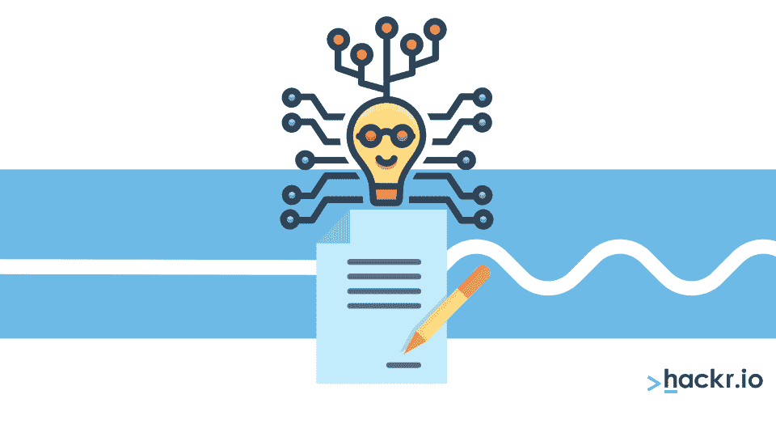
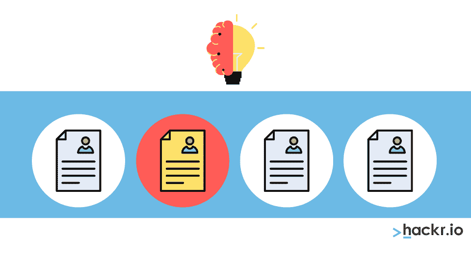
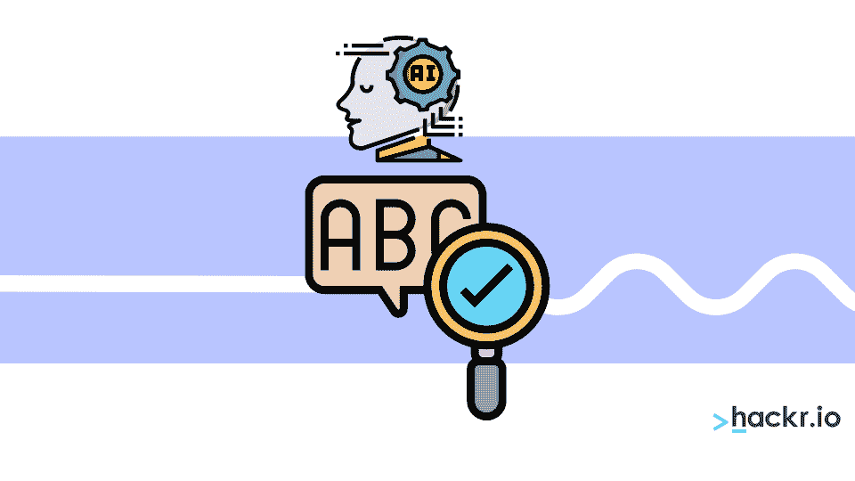
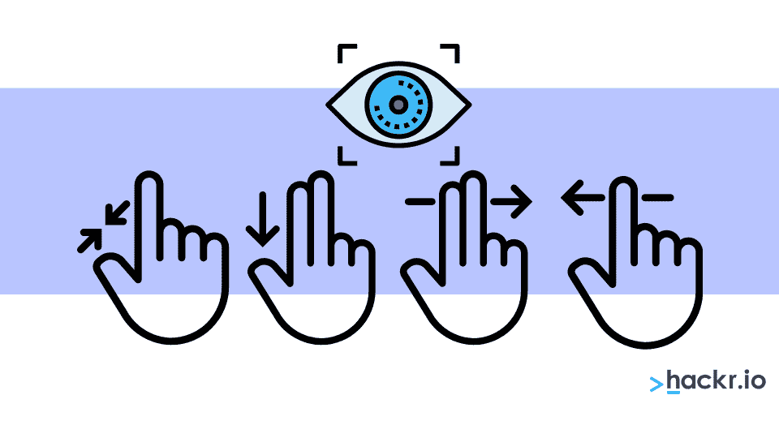
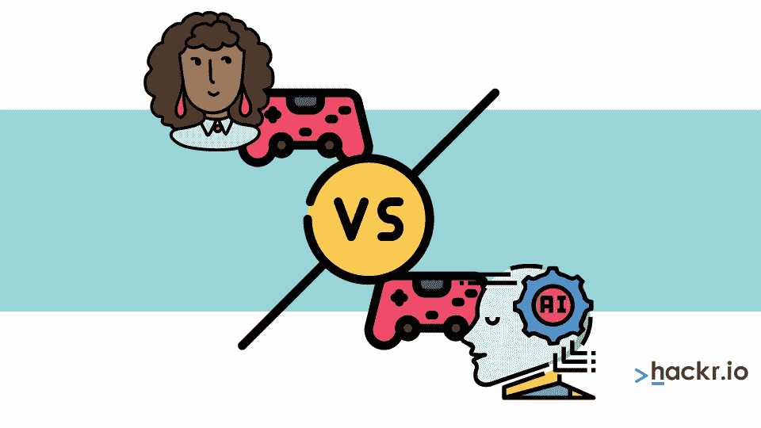
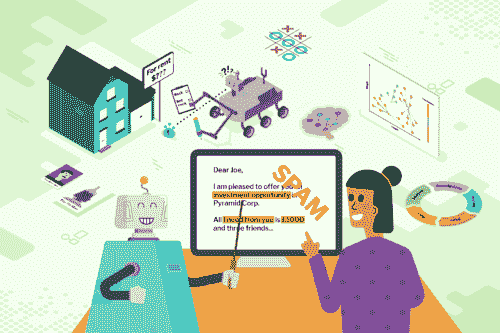

# 2023 年最佳 AI 项目及源代码

> 原文：<https://hackr.io/blog/best-ai-projects>

好奇如今的生活是如何变得如此便捷？从瞬间的谷歌结果到 Youtube 上的推荐视频，[人工智能和机器学习](https://hackr.io/blog/ai-vs-machine-learning) (ML)技术出现在生活的许多方面。

人工智能并不是世界科技巨头的专利。幸运的是，许多小规模企业可以通过创新的人工智能想法来利用人工智能技术的力量。用于构建和部署人工智能的软件程序是如此的便宜，以至于一个店主 T2 都可以用人工智能技术来跟踪他的库存。

研发是赋予人工智能更高学习和评估能力的一个领域，预测了人工智能在未来不可避免的持续增长和存在。如果你对科技感兴趣，这是开始人工智能项目的时候了。

我们将介绍一些人工智能项目创意来帮助你理解人工智能是如何工作的。我们还将讨论常见的人工智能和人工智能误解。我们开始吧！

## **什么是 AI？**

AI 代表人工智能，赋予机器独立评估和执行任务的能力，无需人类的帮助。人工智能通过机器学习方法使设备自给自足和自动化。

有四种人工智能:

**1。无功机**

****

无功机遵循 AI 的基本原理。从名字中，你可以看出反应性设备是为了感知和反应他们面前的世界，或者从他们周围的人那里接收到的任何互动而开发的。

反应式机器没有任何内置内存。因此，它不能储存任何过去的经验，只能执行特定的、专门的任务。但是，反应式机器是一些最可靠的人工智能形式，因为它们每次都对相同的事件做出相同的反应。

IBM 在 20 世纪 90 年代开发的深蓝是一台反应式机器，它学会了如何在自己的游戏中击败国际象棋大师。如果你从未从事过人工智能项目，那么反应式机器是最好的人工智能项目之一！

**2。有限记忆人工智能机器**

****

有限内存人工智能机器拥有与反应式机器相同的能力，除了现在有限的内存。有了这个新功能，内存有限的反应式机器可以存储数据并进行预测。

这些机器可以通过查看它们的记忆来权衡潜在的决定，寻找下一步需要做什么的线索。因此，有限内存机器比反应式机器提供了更大的部署范围。

有限的人工智能项目需要训练一个模型来不断分析和使用数据。或者，您可以创建一个自动训练和更新模型的 AI 环境。此外，当你使用有限内存的人工智能机器时，你必须创建训练数据和机器学习模型，以便它可以执行预测。此外，机器必须接收人类和环境的反馈，这些反馈可以存储在它的存储器中。

**3。心理理论**

****

人工智能的第三个层次是思维理论，但这个版本还没有被科技专业人士完善。

心理论的概念是赋予 AI 心理推理和理解的能力。有了这些功能，他们就可以了解其他生物对他们的看法，以及机器如何在情感上影响他人。

人工智能机器可以独立思考，并根据他们的所见所感做出决定。如果你想起了终结者，我们不怪你！

**4。自我意识人工智能**

****

一旦你给人工智能机器一个头脑，它就可以有自我意识，并发展出接近人类的意识。

具有自我意识的人工智能机器无需任何提示或命令就能理解人们的需求。例如，如果一个人需要医疗援助，具有自我意识的人工智能机器人可以自己打电话。

## **为什么要学 AI？**

为什么要学 AI？更好的问题是为什么 *不会* 你学 AI！以下是学习人工智能的一些好处:

**1。更好的职业选择**

人工智能的发展需要编程和工程。你需要扎实的训练和纪律来结合这两个领域的知识，但是大量的职业选择和有竞争力的薪水是值得的回报。

[人工智能专业人员的平均工资](https://www.payscale.com/research/US/Skill=Artificial_Intelligence_(AI)/Salary) 为每年 12.5 万美元，提供各种各样的角色，如机器学习工程师、数据科学家或商业智能开发员。如果；你对学习人工智能的基础感兴趣，我们强烈推荐像这样的课程。

 [人工智能简介](https://imp.i115008.net/QOJQdo) 

**2。AI 多才多艺**

人工智能并不局限于计算机或航天工业。你可以在你的智能电视、手机甚至扬声器中找到人工智能。人工智能几乎涉及每一个行业，为你提供项目创意和职业选择的极端多功能性。

**3。AI 是世纪技能**

人工智能有可能在某些角色上取代人类。但是，随着这些替代者的出现，该领域也需要人工智能专业人员。这使得 AI 成为世纪技能，我们人类仍在寻找使用它的新方法。

**4。接受大量数据的能力**

人类每天创建 2.5 万亿字节的数据，但没有办法手动管理所有这些数据。想想政府、公司和企业需要管理的所有数据！有了人工智能机器，我们可以管理大量数据，并利用分析做出决策。

**5。更好的灾难管理**

当一场自然灾害摧毁一个地区或一个国家时，公民们会通过社交媒体寻求帮助。他们录制视频、照片，如果可能的话，还会直播分享受灾地区的信息。

这些社交平台是人工智能支持的搜索程序。人工智能有助于将新闻传播给更多的人，并帮助视频病毒式传播，以达到更多的观众，有助于当局和非政府组织团体更快地提供援助。

让我们深入了解人工智能在我们职业生活中的一些好处！

## **AI 在工作场所的好处**

以下是人工智能为你的企业带来巨大优势的几种方式:

**1。提高生产率**

企业正在使用人工智能来提高员工的生产力。人工智能可以通过自动化处理重复性任务，让员工有更多时间专注于重要的工作任务，而不是琐碎的工作。

例如，聊天机器人是一种很好的人工智能工具，可以帮助企业从客户那里收集信息，从而帮助员工快速解决他们的需求。聊天机器人改善了许多企业的整体客户体验，减少了人为错误的机会。

**2。将大数据分析成可访问的见解**

没有数据分析，现代竞争企业就无法运营和发展。但是数据分析占用了宝贵的时间，这就需要大公司的全职数据分析师。即便如此，数据科学家和分析师也是企业劳动力成本的负担，他们通常需要更多的技术支持和帮助来完成分析。无论你是用 AI 来补充你的数据劳动，还是用它来替代，你处理和分析数据的速度都要比没有 AI 快得多。

**3。更好的信息安全和漏洞管理**

我们不时会听说公司和政府的安全漏洞导致数百万用户的个人数据涌入公共存储库。现实是，公司不断受到信息攻击的轰炸。

人工智能帮助公司识别实施数据攻击的肇事者，并使黑客更难窃取信息。此外，人工智能通过从攻击中学习、分析安全措施和识别任何系统漏洞来帮助企业提高安全性。

许多人将人工智能和机器学习(ML)混淆为可互换的，但事实并非如此。

人工智能可以通过多种方式实现。例如，您可以编写一个计算机程序，该程序可以实现由领域专家决定的一组特定规则。但是话说回来，手工制定规则是一项令人厌倦的工作，而且大多数时候，它需要花费大量的时间，但仍然不能完全发挥作用。这就是 ML 发挥作用的地方:ML 让 AI 机器更加自给自足。

假设我们正在寻找一种方法来开发一个能够识别图像中手写数字的程序。

一种方法是查看所有的图像，并形成一个嵌套的 if-this-then 规则，以查看哪些文本应该与特定的图像一起显示。另一种方法是使用机器学习算法，根据数据库样本中的 1000 张标记图像来使用预测模型。

最后一种方法是 深度学习 ，这是机器学习的一个子领域，用于指代执行图像识别和自然语言处理等特定任务的特定模型子集。

所以从这个例子中，我们看到机器学习让 AI 更有效率。但是，人工智能不一定需要用机器学习来开发——它更像是一个美好的必需品，而不是必需品。

## **机器学习和 AI 的区别**

机器学习有助于人工智能变得更有效率，但它对人工智能的使用并不重要。虽然这两个术语都起源于计算机科学领域，但两者之间有几个不同之处:

| **人工智能** | **机器学习(ML)** |
| AI 代表人工智能，其中机器的智能是通过获取知识来定义的。 | ML 代表机器学习，它基本上是由部署了机器学习的系统获取知识或特定技能。 |
| 随着人工智能的实施，我们期待的是成功率的提高，而不是机器所做工作的准确性。 | ML 的目的是增加准确性，但它并不关心成功率是否已经达到。 |
| 人工智能基本上是一个聪明地完成工作的计算机程序。 | 机器学习的工作依赖于简单地接收数据，然后从特定的数据中学习。 |
| 人工智能的主要目标是激发自然智能，然后用它来解决复杂的问题。 | 部署 ML 的主要目标是从数据中学习，以执行特定的任务，从而使正在工作的机器发挥最大性能。 |
| AI 也是复杂任务中的决策者，然后据此工作。 | 当你在 ML 机器上输入数据时，它会读取数据并从中学习。 |
| 人工智能会找到给定任务的最佳解决方案，然后完成它。 | 在创建类似机器学习的流程的方法中，你首先需要写下自学习算法。 |
| 最终，人工智能将导致机器的智慧和智能。 | 不管它是否是最优解，Ml 学到的东西都将伴随着这个解。 |
| 它用来模仿人类在那种情况下的反应 | 当你致力于机器学习时，它会带来知识。 |

## 【2023 年 15 大人工智能项目

现在，你已经知道了你需要知道的关于人工智能的一切，让我们深入了解一些关于初学者的人工智能项目的想法:

**1。房价预测**

****

许多因素都会影响房价——平方英尺、邻里关系、通货膨胀和房间数量就是几个例子。借助人工智能，你可以一次分析各种数据集，并输入多个变量来帮助评估房价。

**2。股票价格预测**

****

对于刚接触人工智能的人来说，最简单的项目想法之一是股票价格预测器。股票市场一直是人工智能专业人士感兴趣的领域。为什么？因为股票市场有太多拥挤的信息。您可以获取多个数据集进行处理。

此外，这个项目对希望从事金融工作的学生来说是一个极好的机会，他们希望了解金融业是如何运作的。此外，请记住，股市的反馈回路相对较短。这将验证您用于人工智能的预测算法。

你可以从使用公共存储库数据和股票历史通胀率预测股票 3 个月的价格波动开始。这两个将是构建你的算法的主要来源。你也可以使用 LSTM 模型，OTOH，Plotly dash [Python 框架](https://hackr.io/blog/python-frameworks)，它可以帮助你建立你的股票预测器。

**3。数字识别**

****

手写数字识别系统是着手识别模式的人工智能项目的一种方式。在这个项目中，您将使用卷积神经网络(CNN)，这是一种用于图像识别及其处理的人工神经网络。

然后，你可以通过添加识别英语字母的能力来进一步推进这个项目，这些字母可以用于构词。

**4。简历解析器**

****

人力资源经理花几个小时浏览一堆简历，寻找一个职位的最佳人选。但是有了 AI，很容易找到最好的简历。

创建一个基于人工智能的简历解析器，使用关键词识别来评估候选人的简历。你可以在人工智能系统中包含关键词来捕捉某些经验和认证。

请记住，这种筛选过程也有缺点。由于许多候选人知道关键字匹配算法，他们试图在简历中添加尽可能多的关键字，击败系统。

最好的做法是创建一个人工智能系统，不仅检查关键词，还检查它们在简历中被使用的次数，以寻找任何可疑的东西。为此，您可以使用 Kaggle 开发的数据集来创建这个项目的模型。数据集只有两列，标题和简历中候选人的信息。

要预处理数据，可以使用 NLTK Python 库。之后，您可以构建聚类算法，该算法允许您将密切相关的单词和候选人获得工作所需的技能进行分组。

**5。假新闻检测器**

****

如果处理不当，假新闻会在短时间内造成混乱。许多社交媒体平台，如脸书、推特和其他平台，都在努力让他们的人工智能完全能够检测假新闻。

要创建假新闻检测器，首先需要访问 [Kaggle 数据集](https://www.kaggle.com/clmentbisaillon/fake-and-real-news-dataset?select=True.csv) 。

之后，使用基本的数据科学家入门包，如 sklearn、pandas、NumPy 等，以及像 transformers 和 pycaret 这样的库来完成这个 AI 项目。

你开发的系统将开始发现模式，证明一篇新闻或消息来源是否是假的。

**6。Instagram 垃圾邮件检测**

****

许多 Instagram 用户报告了数不清的垃圾信息，这些信息来自试图向他们推销某种东西的人，无论是 MLL 还是产品。

Instagram 垃圾邮件检测器可以帮助您捕捉这些垃圾评论和消息；但是，互联网上没有合适的数据集来帮助您的应用程序了解垃圾评论。

首先使用 Python 访问 Instagram[API](https://hackr.io/blog/what-is-api-testing)来获取 insta gram 上呈现的未标记评论。使用 Kaggle 的 YouTube 垃圾邮件收集数据集来训练人工智能，然后使用关键词来分类哪些评论应该被标记为垃圾邮件。

你也可以使用 N-Gram 技术，为垃圾邮件评论中更频繁使用的词分配权重。然后，您可以将这些单词与网上可用的转义注释进行比较。或者，您可以使用基于距离的算法，如余弦相似度。基于您首先应用的预处理类型，这些可以得到更准确的结果。

7 .**。葡萄酒质量预测**

****

葡萄酒的质量取决于许多因素，比如葡萄的种类、产地和年份。人工智能机器学习可以根据某些输入来预测葡萄酒质量，如年份、地点、风味、pH 值、酸度等。

最精彩的部分？这个创新的人工智能项目需要不超过 2 个月的持续发展。

**8。聊天机器人**

****

当顾客访问一家企业的网站时，聊天机器人会给他们提供即时服务。你可以使用已经被各种跨国公司用于其网站的成熟框架来创建一个人工智能聊天机器人。

要制作一个有效的聊天机器人，就要勾画出不同的对话流程，并找出用户最常问的问题。在 chatbot 对话中集成模块之前添加逻辑。现在，一旦聊天机器人制作完成，如果你想把它发布到公共领域之前，要对它进行彻底的测试。请人们测试它，寻找潜在的问题。训练你的 AI 聊天机器人的功能，并决定展示它的最佳平台！

**9。垃圾邮件警报**

****

你的邮箱是如何将无用的邮件分离出来，添加到你的垃圾文件夹的？在 AI 的帮助下！你也可以创建一个垃圾邮件警报，通过使用人工智能来捕捉垃圾邮件中的常见关键字。

10。 **电子商务产品推荐系统**

****

你可能会注意到社交媒体页面上的电子商务产品广告。为什么？因为 AI。

人工智能算法依靠你以前的购买和页面访问来创建电子商务推荐。另一方面，许多企业现在提出即时建议。因为他们使用人工智能来分析他们网站上的每个用户是如何互动和选择产品的。

为了创建一个电子商务产品推荐人工智能项目，你首先需要一个已经建立的使用机器学习算法的框架。

推荐系统的机器学习算法有两类。首先是协作，其次是基于内容的过滤。但是，如果你正在寻找创新的版本，你一定要结合两者。

**11。密码检查器**

****

很难找到一个好的密码来保护你的数据免受黑客攻击。现在，网站要求用户输入一个密码，该密码由一个独特的字符、一个数字、一个小写字母和一个大写字母组成。

一些网站有密码检查器来测量你的密码的安全性，这是一个很酷的人工智能项目想法，你可以试试！

您的应用程序可以测试密码的安全性，同时还可以找到使密码变弱的模式。

**12。自动更正工具**

****

你的手机上可能有一个自动更正工具，可以在你输入文字时更正错别字。Google Docs 和 Microsoft Word 中也有自动更正工具。Grammarly 是一个可下载的自动更正工具，你可以用它来编辑任何文章。

以下是你如何创建一个自动更正工具作为人工智能项目。首先，您需要使用 Python，在这里 TextBlob 库会派上用场。这个库附带了一个名为“correct()”的函数。

如果你在一个单词或一行上使用这个功能，它会告诉你文本是否正确，并用正确的单词替换不正确的单词。

请记住，TextBlob 不是一个完美的库，有时它在查找拼写错误的单词时会有问题。在某些情况下，在最初的单词正确之前，算法无法找到拼写错误的单词。

13。手势识别模型

****

这个项目是新手的最爱，使用 Python 很容易开发 web 应用程序。从 Kaggle 上的手势数据库开始。这个数据库有超过 20，000 个带标签的手势！

使用 VGC-16 训练您的应用程序，您还可以添加 OpenCV 来采集视频数据的实时流。这些视频数据将被用于实时检测和预测手势。

**14。比价应用
**

你有没有在商店里看到一件衣服，想知道在哪里可以买到价格最低的？

嗯，这个人工智能项目将帮助你找到你衣服上最划算的地方。

但是，项目的复杂程度取决于你想要投入多少努力。你可以让这个应用程序扫描产品，然后用“最低价”过滤器在网上找到它。或者你可以简单地输入产品，应用程序会在网站上以升序搜索产品的价格。

使用能够识别图像上出现的特定对象的算法或库。例如，如果有人上传一件礼服的照片，该算法应该能够识别衣服的颜色和风格。你也可以使用 VGG-16，预先存在的项目描述数据库。一旦你建立了一个模型，你就可以让用户选择添加关于产品的额外细节(品牌、季节、尺寸等等)。)

15。创建一个游戏

****

游戏中的人工智能机器人从用户的动作中学习。例如，如果你与计算机下棋，AI 机器人可以变得越来越好，更难击败。尝试创建一个简单的游戏作为你最终的人工智能项目。

**Python AI 项目和 Raspberry AI 项目**

## **Python for AI**

### Python 是一种流行的编程语言，广泛用于 web 开发、人工智能、机器学习、操作系统、视频游戏和移动应用程序开发。它有广泛的预建库，使人工智能项目的开发更加容易和简单。

Python 的 Numpy 库用于科学计算，Scipy 用于高级计算，Pybrain 用于机器学习。因此，Python 被认为是人工智能最好的语言之一。此外，它是在各种技术和平台中使用的最灵活和最流行的语言之一，代码改动最少。

kickstart 人工智能项目的一些流行的 Python 库是 Matplotlib、Pandas、Numpy、scikit-learn 和 iPython Notebook。Numpy 库用作存储通用数据的容器，如 N 维数组对象、傅立叶变换、集成 C/C++代码的工具、随机数功能和许多其他功能。

Pandas 是一个开源的 Python 库，它提供了易于使用的数据结构和分析工具，可以在你的人工智能项目中使用。Matplotlib 是一个 2D 绘图库，用于生成出版物质量数字。您最多可以将这个 Python 库用于 6 个图形用户界面工具包、Python 脚本和 web 应用服务器。

下面是利用 Python 的 5 大人工智能项目列表:

**1。假审查检测器**

#### 假审核检测器是一个初级的 Python AI 项目。您可以通过创建一个能够识别虚假评论的分类器来构建一个虚假评论检测器。这个虚假评论检测器确保一个网站没有虚假评论。

**2。流量分析器**

#### 流量分析器是另一个最好的 Python 人工智能项目想法。在这个项目中，您需要构建一个流量分析器，它可以建议到达特定目的地的最佳路径。此外，它在建议最佳路径时会考虑各种因素，如交通密度、出行方式和路径长度。流量分析器的一个最好的例子是谷歌地图。

**3。手写识别器**

#### 要构建一个手写识别器，了解计算机视觉是必不可少的。计算机视觉是人工智能的一个核心方面。手写识别系统可以识别书写内容。

**4。扰流板拦截器**

#### 在剧透拦截项目中，你必须开发一个工具来检测垃圾邮件并自动拦截它们。您应该对自然语言处理(NLP)有深入的了解，才能构建一个剧透拦截器。

**5。通过摄像机进行火灾探测和定位**

#### 另一个最好的 Python AI 项目是面向中级开发人员的火灾探测和摄像机定位。你需要建立一个工具，它可以探测火灾，并通过摄像头定位火灾。开发这个项目需要对卷积神经网络(CNN)有很强的理解。

**人工智能的树莓派**

## ****

*图片来源:[树莓派基金会](https://www.raspberrypi.org/blog/fundamentals-ai-machine-learning-free-online-course/)*

当谈到人工智能和机器学习时，Raspberry Pi 被认为是最强大的工具之一。Raspberry Pi 是一台信用卡大小的计算机或一系列单板计算机，可以插入计算机显示器或电视。由于其处理能力、低功耗要求以及与小尺寸相匹配，它是嵌入式项目和智能机器人的绝佳选择。

Raspberry Pi 在许多领域都有应用，例如家庭自动化、物联网、机器学习、人工智能等等。下面是一些流行的树莓人工智能项目的想法，适合初学者和经验丰富的专业人士。

Twitter Bot 是广泛使用的社交媒体平台之一。对于许多人来说，处理他们的 Twitter 账户可能是一项繁琐的任务。Raspberry Pi bot 使处理 Twitter 帐户的繁琐任务变得更加简单，可以在 Twitter 上自动发送推文。

**2。智能电视**

#### 智能电视是另一个最佳的树莓人工智能项目创意。使用 Raspberry Pi 和显示器可以构建全功能智能电视。Kodi 是开发这个项目的最佳选择。它是一个开源的媒体播放器软件应用软件。

**3。人工智能助手**

#### 我们可以用树莓派来构建一个人工智能助手。此外，还可以使用谷歌助手和谷歌云 SDK。首先，你需要在谷歌助手上注册，并为你的账户设置音频。但是你需要确保你使用的 Pi 板应该被授权用于这个项目。

**4。打印服务器**

#### 使用 Raspberry Pi，您可以将简单的打印机转换成无线打印机。您可以将该无线打印机与连接到它的任何设备配合使用。要构建这个 Raspberry AI 项目，需要一个通用的 Unix 打印系统(CUPS)。还有，你需要最新版本的树莓 Pi，也就是树莓 Pi 3。

**5。气象站**

#### 如果你是初学者，用树莓 Pi 搭建气象站是最好的 AI 项目创意。有可能把你的树莓皮板变成一个完整的气象站。为此，您需要一个 BME280 传感器，它可以分析温度、压力和其他天气参数。此外，您将获得 Oracle Raspberry Pi 气象站的 API。

[人工智能 A-Z:学习如何构建人工智能](https://click.linksynergy.com/deeplink?id=jU79Zysihs4&mid=39197&murl=https%3A%2F%2Fwww.udemy.com%2Fcourse%2Fartificial-intelligence-az%2F)

**结束**

## 人工智能是一个令人兴奋的技术领域，它将继续在我们的日常生活中掀起波澜。尝试上面的人工智能项目，以适应该工具并扩展您的知识。

对于很酷的 AI 项目，你还有其他想法吗？请在评论区告诉我们！在那之前，继续编程，继续创新。

**相关文章:**

**Related Articles:**