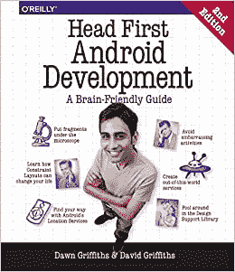
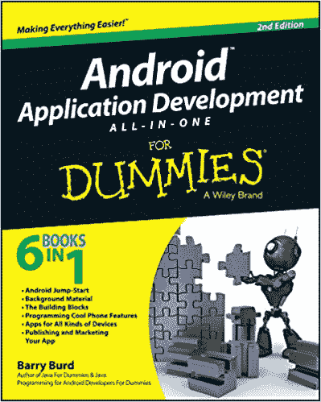
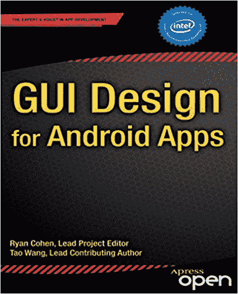
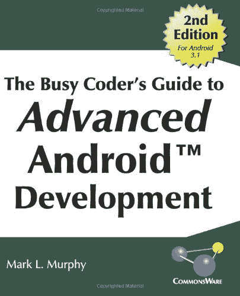
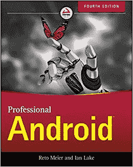
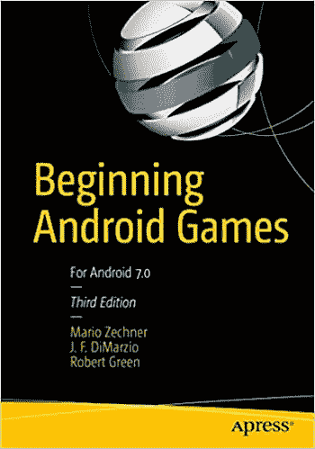

# 2023 年 10 本最佳安卓应用开发书籍【排名】

> 原文：<https://hackr.io/blog/best-android-books>

你一定听说过它——或许现在它就在你的手中！大约 85%售出的设备使用 Android 作为其操作系统。

Android 是谷歌开发的一款流行的移动操作系统。像三星、谷歌 Nexus、索尼 Xperia 等大多数受欢迎的手机都是基于 Android 的。Android 是开源的。开发者可以根据手机定制操作系统。

Android 基于 Linux 内核。Android 程序是使用 ASDK (Android 软件开发工具包)用 Java 编写的，并通过针对移动优化的 Java 虚拟机(JVM)运行。

如果你正在准备一个 android 面试，看看[个 android 面试问题](https://hackr.io/blog/android-interview-questions)和详细的答案。

## **Android 的优势和特性**

Android 是使用最广泛的操作系统之一，除了手机自带的内置应用程序之外，还有许多应用程序可以从 Google play 商店下载。Android 的一些功能和优势包括:

*   开源和免费——便于小型企业开发他们选择的应用程序
*   巨大的社区和支持
*   丰富的开发环境
*   开发应用程序非常划算
*   直观的 UI
*   广泛的连接选项。
*   广泛支持媒体文件格式。
*   使用 SQLite 的数据存储
*   可调整大小的小部件
*   多点触控和多任务处理

## **如何学习 Android**

Android 开发简单快捷，可以通过培训班、视频、教程，当然还有好书来学习！虽然有些人声称你可以在一个月内学会，但我们建议你花时间一步一步地理解这些概念，将你在书中或教程中看到的内容应用到实践中，并关注 android 开发者网站以获取文档、更新和支持。[学习 Android 需要 Java 基础知识](https://hackr.io/blog/what-is-java)。

[完整的 Android 12 &科特林开发大师班](https://click.linksynergy.com/deeplink?id=jU79Zysihs4&mid=39197&murl=https%3A%2F%2Fwww.udemy.com%2Fcourse%2Fandroid-kotlin-developer%2F)

## **最佳安卓书籍**

我们选出了 2023 年 Android 开发更新的 10 本最佳 Android 书籍。下面让我们看看。

对于初学者来说，这是一本很好的书和参考指南，即使你有一些经验，你也会从这本书中学到很多新东西。该书从活跃度、线程、主题、视图、碎片、网络传播等方面涵盖了 Android 的所有本质概念。这本书没有一个字是多余的。每一章，每一段都为读者打开了一个新的世界。

**特性:**

所有重要概念和 API 的详细解释

*   你应该知道 Kotlin(最新版)的基础知识，虽然作者涵盖了它的一些部分；以前的版本是基于 Java 的
*   给出了许多实际例子，你可以更好地练习学习
*   这本书更新了 Android studio 和其他工具的最新变化
*   作者在整本书中保持了良好的节奏
*   **评分:4.6** **费用:** Kindle: $24.10 平装:$23.75

你可以在这里买到这本书。

 这是 android 开发和初学者以及下一级程序员的最佳书籍。在看这本书之前，你应该先了解 Java。如果你已经对 Android 编程有了一些了解，你可能会觉得这本书有点慢且重复，但它将是你已经知道的所有知识的一个很好的复习。作者语气风趣诙谐，有通俗易懂的解释和代码示例。

**特性:**

循序渐进的方法。

涵盖了很多话题，虽然你从来不会因为作者的做法而感到负担。

*   伟大的项目，向您介绍基础知识，并为下一个级别做准备。
*   手写的注释，书的正文之间的空间给人一种适当指导的良好感觉。
*   详细介绍了基础知识。
*   对于有经验的人来说有点啰嗦。
*   **评分:** 4.5
    **费用** : Kindle: $15.09 平装:$24.77
*   你可以在这里买到这本书。

这不是一本你会被灌输所有概念的书。作者提到了很多术语和概念，并鼓励你通过在线内容阅读更多相关内容；例如，android 模拟器以及如何在其上运行应用程序。也就是说，作者付出了很多努力来轻松地同时学习 Java 和 Android。如果你已经了解 Java，你可以跳过 Java 入门，因为你可能会觉得它很冗长。

**特性:**

涵盖了 Java 和 Android 的基础知识。

作者的笔调诙谐风趣，使阅读成为一种享受。

有些 Java 概念没有详细解释，作者期望您从其他来源寻找细节。

*   这本书组织得很好，从介绍 Java 和 Android 开始，然后解释了两者如何通过创建现实世界的应用程序来协同工作。
*   强调在一个地方创建较小的代码块并在其他地方重用它们的重要性。
*   **评分** : 4.5
    **费用**:Kindle:$ 18.39 平装:$19.99
*   你可以在这里买到这本书。
*    一本整洁且结构严谨的书《傻瓜的安卓》，一定会让你对安卓的兴趣更上一层楼。它是一本初学者的书，带你了解所有的核心概念。作者解释了作为一个初学者开发人员需要知道的内容，并没有用更多你可以理解的信息来让你过载。

**特性:**

该书从 Android 的基础知识开始，从仿真器到 Android studio 然而，它期望你有一些编程语言知识。

边栏和其他地方的许多提示、观察和技巧使这本书具有互动性，读起来很有趣。

作者让你在给出最终答案之前思考一个问题及其可能的解决方法。这有助于读者思考，而不仅仅是复制粘贴代码使其工作。

简单的演示，没有冗长，只有乐趣，智慧和信息

*   如果你是软件编程的新手，这本书可能很难读懂。
*   **评分** : 4.4
    **费用** : Kindle: $20.79 平装:$23.78
*   你可以在这里买到这本书。
*   如果你已经完成了几个 android 项目，并且正在寻找更多的知识和复杂的项目，这是你的完美伴侣。没有赘言，内容清晰简洁，这本书解释了所有的功能-即使是最新的，非常好。如果你想探索你的创造力，寻找挑战，这是你必须阅读和探索的书。诸如线程、JUnit、性能调优等主题将与其他核心概念一起深入探讨。
*   **特性:**

一本独一无二的书，它的内容是你在任何其他书中都找不到的。

基本概念和高级概念的良好结合。

这本书不仅解释了应该做什么，还解释了为什么要做某事。

这本书正确地指导你从发展的角度来看哪些主题是最重要的，以及你需要对每个主题了解多少。

快节奏，内容丰富，既有基础的也有高级的。

*   **评分** : 4.2
    **费用**:Kindle:$ 26.39 平装:$29.70
*   你可以在这里买到这本书。
*    对于想从头开始学习 Android 的人来说，这是一本好书。这本书的 Kindle 版本是免费的，所以对于那些不知道该期待什么或者你是否想学习 Android 的人来说，这本书可能是一个起点。这本书并不详细，但涵盖了你构建简单的 android 应用程序的所有重要概念。有许多代码示例、案例研究和教程可以帮助您轻松理解 UI 设计，否则这将是一项艰巨的任务。
*   **特性:**
*   从关于 Android 的非常基础的信息开始，读者应该了解 Java 和 XML 以充分理解内容。

为新的 Android 开发者打下坚实的基础。

通过书中使用的代码例子可以看出作者的经验和专业知识。

如果你已经有了一些 android 开发的经验，这本书不会有太大用处。

**评分** : 4.1
**费用** : Kindle: $0.0
平装:$16.99

你可以在这里买到这本书。

*    这是一本高级水平的书，在你抢到这本书之前，你必须会写简单的 app 和程序。它是一个全面的指南和参考，您可以在您的工作场所中保留，以便在您的项目工作中参考，或用作学习高级 Android 的详细资料。作者不仅谈到了技术方面，还提到了 Android 最初是如何开发出可遵循的最佳实践和详细的代码示例的。
*   **特性:**
*   面向专业 android 开发人员的高级书籍
*   这本书结构良好，一步一步地介绍一个接一个的概念

一个完整的参考书，清晰，简洁的例子代码和现实生活中的应用

如果你购买 Kindle(数字)版本，你会得到补充书籍，增强你的学习体验。数字版也由作者定期更新，所以它更新更准确

这本书没有涵盖任何基础知识或介绍，而是直接从更高级的主题开始

这本书还涵盖了 NFC、动态片段、创建基于列表的应用程序小部件等主题。

**评分** : 3.8
**费用** : 平装:$47.96

你可以在这里买到这本书。

*    一本给中级到专家级 Android 开发者的神奇的书。这本书涵盖了所有的最佳实践，并且理解了 Android 的架构、生命周期、UI 以及更多的东西。这些例子简单而有力，解释得非常好。这本书遵循的实践方法使它从市场上的其他书籍中脱颖而出。你应该了解 Java 的基础知识来学习这本书。
*   **特性:**
*   很多项目涵盖了 Android 的所有新功能。
*   帮助您快速创建真实应用程序的实用方法。
*   关于 Android Studio IDE 和 Kotlin 的大量信息。
*   包括 firebase 和 google play 服务，如谷歌地图、基于位置的服务、感知 API 等。

深入介绍数据绑定、作业调度器、体系结构组件。

书中介绍了一些没有详细涉及的话题，你可以用[在线教程或者博客来补充你的学习。](https://hackr.io/tutorials/learn-android-development?q=android)

**评分** : 3.7
**费用** : Kindle: $26.39
平装:$26.54

你可以在这里买到这本书。

 了解任何语言的开发设计模式都可以节省你大量的时间和精力，帮助你用最佳实践和更简洁的代码构建应用。这本书试图借助 58 种不同的模式来做同样的事情。这本书分为几个部分，慢慢地从手机应用程序开发、Android OS、Android 碎片化、反模式(指出常见错误)，最后是设计模式。每章解释一种模式。

**特性:**

*   包括移动应用和平板电脑专用应用的模式。
*   这本书没有任何代码，但是给出了如何使用每个设计模式的一步一步的指导。
*   关于做某事的正确和不正确方法的解释清楚的提示和技巧。
*   大约 70 种 UI 设计模式，包括 58 种模式和 12 种反模式。
*   这本书包含了关于 Android、iOS 和其他移动界面的深入信息。
*   书中使用的例子来自真实世界的应用程序，您也可以自己探索。

大量有用的图片、演示和讨论让你好奇想了解更多关于 Android 的信息。

**评分** : 3.5
**费用** : Kindle: $22.50
平装:$36.05

你可以在这里买这本书。

对于那些想开始使用 Android 平台开发游戏的人来说，这是一本不错的入门书。它涵盖了基本的游戏基础知识，Android 和 Java 的基础知识；但是，建议在阅读这本书之前，先了解一些 Java 的知识。这本书温和地向读者介绍了 Android 平台，并转向创建游戏引擎，以及使用 OpenGL ES 和 Canvas API 开发 2D 和 3D 游戏。

**特性:**

*   即使你已经对游戏有了一个基本的概念，这本书也会很有帮助，因为它提供了关于 Android 平台的特性和缺陷的有用见解。
*   作者没有解释代码的某些部分，以便读者可以调试、测试和填补空白，这鼓励了自学。
*   这本书提供了对 libGDX 的全面解释，并提供了外部参考资料，以便更好地学习。
*   **评分** : 3.0
    **费用** : Kindle: $39.99
    平装:$41.65
*   你可以在这里买到这本书。
*   **结论**
*   您可以在 Windows、Mac 或 Linux 上开始 Android 应用程序开发，并且需要 Java JDK5 或更高版本以及 Android studio。我们的列表包含了所有类型的书籍，以迎合初学者、中间用户和有经验的程序员。如果你刚刚开始，《android 应用开发一体机傻瓜版》和《Android 应用的 GUI 设计》将是最适合你的书。如果你只是在寻找一个快速，方便的参考指南，“Android 编程:大书呆子牧场指南”或“忙碌的程序员高级 Android 开发指南”应该是你理想的选择。对于高级开发人员来说，《Android 编程:挑战极限》和《忙碌的程序员高级 Android 开发指南》是一些最好的书籍。让我们知道你今天要开始读哪本书！

**人也在读:**

You can buy this book [here](https://geni.us/Bm7Y).

This is a nice primer for those who want to start developing games using the Android platform. It covers basic gaming fundamentals, basics of Android and Java; however, it is recommended to have some prior knowledge of Java before reading this book. The book gently introduces readers to the Android platform and moves towards creating a game engine, and developing 2D and 3D games using OpenGL ES and Canvas API.

**Features:**

*   Even if you already have a basic idea about gaming, the book will be helpful as it provides useful insights about the peculiarities and pitfalls of the Android platform.
*   The author leaves some portion of the code unexplained so that the reader can debug, test, and fill the gaps, which encourages self-learning.
*   The book provides a thorough explanation of libGDX and gives external references for better learning.

**Rating**: 3.0
**Cost**: Kindle: $39.99
Paperback: $41.65

[You can buy the book here.](https://geni.us/1HzQZA0)

## **Conclusion**

You can start Android app development on Windows, Mac, or Linux and will need Java JDK5 or later and Android studio. Our list contains all types of books catering to beginners, intermediates, and experienced programmers. If you are just starting, "Android application development all-in-one for dummies" and "GUI design for android apps" will be the best books for you. If you are just looking for a quick, handy reference guide, "Android programming: The big nerd Ranch guide" or "The Busy Coder's Guide to Advanced Android Development" should be your ideal choice. For advanced developers, "Android Programming: Pushing the limits" and "The Busy Coder's Guide to Advanced Android Development" are some of the best books. Let us know which book you are going to start today!

**People are also reading:**