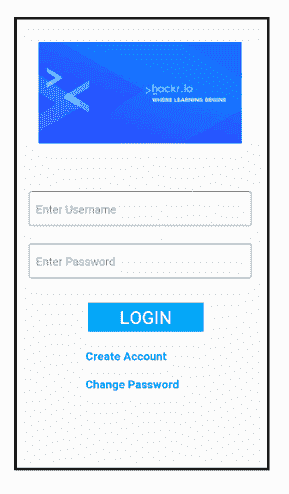
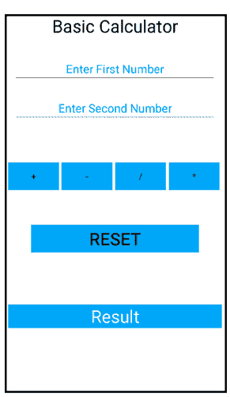

# 2023 年最佳安卓项目带源代码[更新]

> 原文：<https://hackr.io/blog/best-android-projects>

## **安卓是什么？**

Android 是基于 Linux 的开源操作系统，适用于智能手机和平板电脑等移动设备。然而，如今，许多其他设备正在将 android 集成到其中，以将其转变为智能设备，如智能电视、智能车载 GPS 接口、电器等。这款软件于 2007 年发布&第一款 Android 设备于 2008 年 9 月推出。从那以后，安卓的赞助商谷歌几乎每年都会发布软件更新版本。

Android 还提供了几个功能:

1.  NFC(近场通信):NFC 允许电子设备轻松地进行短距离交互。
2.  可选关键字:它支持多种键盘，使它们易于安装。
3.  漂亮的交互式用户界面
4.  存储:SQLite 是一个轻量级关系数据库，用于数据存储。
5.  多语言:支持单向和双向。

## **构建 Android 项目的路线图**

第一步也是最重要的一步是学习 Android 工具，但在此之前，我会建议你学习 Android 兼容语言，如 Kotlin 或 Java，XML 的基础水平。Android Studio 工具利用这些语言来构建其应用程序。这些是在 [Hackr](https://hackr.io) 和其他各种平台上推荐的各种 android 课程和教程。最后，保持动力，不要放弃实践以使你的项目成功。尽可能多地建造。

## **Kotlin vs Java:选择哪种语言？**

Kotlin 已经被宣布为 Android 的官方语言，它是健壮的、静态的&比 Java 冗长得多。但很难否认的事实是，Java 已经存在了 20 年，Android 从最初的日子就建立在 Java 之上。那么，对于您的项目开发，应该使用 Java 和 Kotlin 中的哪一个呢？

1.  Kotlin 提供了许多优点，比如编写速度更快，不像 Java 是一种笨重的语言，因此代码更多，出错的机会也更大。
2.  由于 Android 是基于 Java 构建的，因此有大量的 Java 库。多亏了 Java 字节码，Kotlin 使用这些 Java 库和 [Java 框架](https://hackr.io/blog/java-frameworks)。
3.  Java 应用程序更轻更紧凑，从而带来更快的应用程序体验。

这两种语言还有许多其他的优点和缺点需要了解。但是，如果你是一个初学者或编程新手，建议你构建 Java&。你的选择完全取决于你项目的需要和要求&也取决于你最感兴趣的是什么。

[完整的 Android 12 &科特林开发大师班](https://click.linksynergy.com/deeplink?id=jU79Zysihs4&mid=39197&murl=https%3A%2F%2Fwww.udemy.com%2Fcourse%2Fandroid-kotlin-developer%2F)

## **面向初学者的 Android 项目**

让我们先看看一些简单的 Android 项目想法和源代码。

### **1。登录页面**

几乎每个 Android 应用程序都要求用户通过提供其凭据(如姓名、电子邮件地址、电话号码)来创建注册页面，然后生成用户密码以便以后登录。这是最基本的项目，因为无论你制作什么应用程序，登录屏幕都是必不可少的，无论领域是健康，食品，制药，购物，社交媒体，游戏每个应用程序都要求你创建一个帐户，以便用户可以保存其详细信息，并从他们的最后一次会议开始。



**XML 文件:**

登录页面 XML 文件包含一个用户友好的活动页面，该页面显示了供用户输入所需信息的编辑文本字段。它还包含一个按钮和两个可点击的文本字段，分别用于登录、创建帐户和更改密码。最后，它包含一个可供新用户注册的可点击文本字段。

**Java 文件**

登录页面 Java 文件接收来自用户的输入，验证数据，然后将信息存储到本地数据库中。

**样本代码**

### **XML 文件**

```
<?xml version="1.0" encoding="utf-8"?>
<LinearLayout xmlns:android="http://schemas.android.com/apk/res/android"
    xmlns:app="http://schemas.android.com/apk/res-auto"
    xmlns:tools="http://schemas.android.com/tools"
    android:layout_width="match_parent"
    android:layout_height="match_parent"
    android:orientation="vertical"
    android:id="@+id/content"
    tools:context=".MainActivity">
    <!--<TextView-->
        <!--android:layout_width="wrap_content"-->
        <!--android:layout_height="wrap_content"-->
        <!--android:text="Login Page"-->
        <!--android:textSize="52dp"-->
        <!--android:textColor="#FFF"-->
        <!--android:textAlignment="center"-->
        <!--android:background="#03A9F4"-->
        <!--android:layout_marginRight="30dp"-->
        <!--android:layout_marginLeft="70dp"-->
        <!--android:layout_marginTop="30dp"-->
        <!--android:textStyle="bold"/>-->
    <ImageView
        android:layout_width="match_parent"
        android:layout_height="wrap_content"
        android:src="@drawable/hackr"
        android:layout_marginTop="50dp"/>
    <android.support.design.widget.TextInputLayout
        android:id="@+id/et_username"
        android:layout_width="match_parent"
        android:layout_height="wrap_content"
        android:layout_marginLeft="30dp"
        android:layout_marginRight="30dp"
        android:layout_marginTop="70dp"
        app:boxStrokeColor="#223CD6"
        style="@style/Widget.MaterialComponents.TextInputLayout.OutlinedBox">
        <android.support.design.widget.TextInputEditText
            android:layout_width="match_parent"
            android:layout_height="wrap_content"
            android:hint="Enter Username"
            android:inputType="text"
            android:maxLines="1"/>
    </android.support.design.widget.TextInputLayout>
    <android.support.design.widget.TextInputLayout
        android:id="@+id/et_password"
        android:layout_width="match_parent"
        android:layout_height="wrap_content"
        android:layout_marginLeft="30dp"
        android:layout_marginRight="30dp"
        android:layout_marginTop="20dp"
        app:boxStrokeColor="#223CD6"
        style="@style/Widget.MaterialComponents.TextInputLayout.OutlinedBox">
        <android.support.design.widget.TextInputEditText
            android:layout_width="match_parent"
            android:layout_height="wrap_content"
            android:hint="Enter Password"
            android:inputType="text"
            android:maxLines="1"/>
    </android.support.design.widget.TextInputLayout>
    <Button
        android:id="@+id/login_button"
        android:layout_width="189dp"
        android:backgroundTintMode="multiply"
        android:layout_height="wrap_content"
        android:layout_marginLeft="120dp"
        android:layout_marginRight="120dp"
        android:layout_marginTop="30dp"
        android:backgroundTint="#03A9F4"
        android:text="Login"
        android:textColor="#FFFFFF"
        android:textSize="28dp" />
    <TextView
        android:id="@+id/create"
        android:layout_width="wrap_content"
        android:layout_height="wrap_content"
        android:layout_marginLeft="120dp"
        android:layout_marginRight="120dp"
        android:textAlignment="center"
        android:layout_marginTop="20dp"
        android:textSize="18dp"
        android:textStyle="bold"
        android:textColor="#03A9F4"
        android:text="Create Account"/>
    <TextView
        android:id="@+id/change_password"
        android:layout_width="wrap_content"
        android:layout_height="wrap_content"
        android:layout_marginLeft="120dp"
        android:layout_marginRight="120dp"
        android:textAlignment="center"
        android:layout_marginTop="20dp"
        android:textSize="18dp"
        android:textStyle="bold"
        android:textColor="#03A9F4"
        android:text="Change Password" />
</LinearLayout>
```

### **Java 文件**

```
package com.skarora.loginpage;
import android.content.Intent;
import android.database.Cursor;
import android.support.design.widget.TextInputLayout;
import android.support.v4.app.FragmentManager;
import android.support.v4.app.FragmentTransaction;
import android.support.v7.app.AlertDialog;
import android.support.v7.app.AppCompatActivity;
import android.os.Bundle;
import android.view.View;
import android.widget.Button;
import android.widget.TextView;
import android.widget.Toast;
public class MainActivity extends AppCompatActivity {
    TextInputLayout username,password;
    TextView create,change_pass;
    Button login;
    LoginData ld;
    @Override
    protected void onCreate(Bundle savedInstanceState) {
        super.onCreate(savedInstanceState);
        setContentView(R.layout.activity_main);
        getSupportActionBar().hide();
        username = findViewById(R.id.et_username);
        password = findViewById(R.id.et_password);
        login = findViewById(R.id.login_button);
        create = findViewById(R.id.create);
        change_pass = findViewById(R.id.change_password);
        ld=new LoginData(this);
        createUser();
        loginUser();
        changePassword();
    }
    public void loginUser(){
        login.setOnClickListener(new View.OnClickListener() {
            @Override
            public void onClick(View v) {
                String name = username.getEditText().getText().toString();
                String pass = password.getEditText().getText().toString();
               showMessage("Name",name);
               showMessage("Pass", pass);
                Cursor loginStatus= ld.validate(name,pass);
                if(name.equals("") || pass.equals(""))
                {
                    showMessage("     ERROR!! ", "EMPTY FIELDS");
                }
                else
                    if(loginStatus.getCount()==0)
                    {
                        Toast.makeText(getApplicationContext(),"hello",Toast.LENGTH_LONG).show();
                      //  showMessage("Login Successful" , "You have successfully logged in :) ");
                        Intent in = new Intent(getApplicationContext(),Home.class);
                        startActivity(in);
                    }
                    else
                        {
                        Toast.makeText(getApplicationContext(),"hiii",Toast.LENGTH_LONG).show();
                        showMessage("ERRR...", "TRY AGAIN!!!!!");
                }
            }
        });
    }
    public void createUser()
    {
        create.setOnClickListener(new View.OnClickListener() {
            @Override
            public void onClick(View v) {
                Intent i = new Intent(getApplicationContext(),Create_Acc.class);
                startActivity(i);
            }
        });
    }
    public void changePassword()
    {
        change_pass.setOnClickListener(new View.OnClickListener() {
            @Override
            public void onClick(View v) {
               Intent i = new Intent(getApplicationContext(),ChangePass.class);
               startActivity(i);
            }
        });
    }
    public void showMessage(String title, String message)
    {
        AlertDialog.Builder builder = new AlertDialog.Builder(this);
        builder.setCancelable(true);
        builder.setTitle(title);
        builder.setMessage(message);
        builder.show();
    }
}
```

### **2。基本计算器应用**

计算器应用程序也是开始构建 Android 项目的一个好决定，因为它存在于每部手机和平板电脑中。该应用程序帮助您了解前端设计应用程序所需的不同布局，即通过 XML 文件，从而定义按钮应用程序，即以数字和操作作为输入，并在 Java 文件中显示结果作为输出。

下面的示例构建了一个非常基本的应用程序，用户在两个不同的文本字段中输入两个数字，然后通过单击按钮选择操作，结果就会显示出来。单击重置按钮，计算器重置，用户可以再次输入数值。



**XML 文件:**

XML 文件使用线性布局来显示文本字段和操作按钮。

**Java 文件:**

Java 文件描述了每个按钮的功能，计算并显示结果。

**样本代码:**

### **XML 文件**T2


```
<?xml version="1.0" encoding="utf-8"?>
<LinearLayout xmlns:android="http://schemas.android.com/apk/res/android"
    xmlns:app="http://schemas.android.com/apk/res-auto"
    xmlns:tools="http://schemas.android.com/tools"
    android:layout_width="match_parent"
    android:layout_height="match_parent"
    tools:context=".MainActivity"
    android:orientation="vertical"
    android:background="#FFF">
    <LinearLayout
        android:layout_width="match_parent"
        android:layout_height="wrap_content"
        android:layout_marginTop="10dp"
        android:layout_marginBottom="30dp"
        android:layout_marginLeft="0dp"
        android:layout_marginRight="0dp"
        android:background="#FFF">
        <TextView
            android:layout_width="match_parent"
            android:layout_height="wrap_content"
            android:layout_gravity="center"
            android:text="Basic Calculator"
            android:textAlignment="center"
            android:textColor="#000"
            android:textSize="30dp" />
    </LinearLayout>
    <LinearLayout
        android:layout_width="match_parent"
        android:layout_height="wrap_content"
        android:layout_marginBottom="20dp"
        android:layout_marginLeft="0dp"
        android:layout_marginRight="0dp"
        android:background="#FFF"
        android:layout_gravity="center">
        <EditText
            android:id="@+id/firstVal"
            android:layout_width="0dp"
            android:layout_height="match_parent"
            android:layout_weight="1"
            android:hint="Enter First Number"
            android:textColorHint="#03A9F4"
            android:textAlignment="center"
            android:textSize="20dp"
            android:textColor="#000"
            android:inputType="numberDecimal"
            android:layout_marginLeft="30dp"
            android:layout_marginRight="30dp"
            />
    </LinearLayout>
    <LinearLayout
        android:layout_width="match_parent"
        android:layout_height="wrap_content"
        android:layout_marginBottom="50dp"
        android:layout_marginLeft="0dp"
        android:layout_marginRight="0dp"
        android:background="#FFF"
        android:layout_gravity="center">
        <EditText
            android:id="@+id/secondVal"
            android:layout_width="0dp"
            android:layout_height="match_parent"
            android:layout_weight="1"
            android:hint="Enter Second Number"
            android:textColorHint="#03A9F4"
            android:textAlignment="center"
            android:textSize="20dp"
            android:textColor="#000"
            android:inputType="numberDecimal"
            android:layout_marginLeft="30dp"
            android:layout_marginRight="30dp"/>
    </LinearLayout>
    <LinearLayout
        android:layout_width="match_parent"
        android:layout_height="wrap_content"
        android:layout_marginBottom="30dp"
        android:layout_marginLeft="0dp"
        android:layout_marginTop="20dp"
        android:layout_marginRight="0dp"
        android:background="#FFF"
        android:layout_gravity="center"
        >
        <Button
            android:id="@+id/add"
            android:layout_width="wrap_content"
            android:layout_height="wrap_content"
            android:layout_marginLeft="20dp"
            android:background="#03A9F4"
            android:onClick="add"
            android:text="+"
            android:textSize="15dp" />
        <Button
            android:id="@+id/sub"
            android:layout_width="wrap_content"
            android:layout_height="wrap_content"
            android:layout_marginLeft="5dp"
            android:background="#03A9F4"
            android:onClick="add"
            android:text="-"
            android:textSize="15dp" />
        <Button
            android:layout_width="wrap_content"
            android:layout_height="wrap_content"
            android:layout_marginLeft="5dp"
            android:background="#03A9F4"
            android:onClick="add"
            android:text="/"
            android:textSize="15dp" />
        <Button
            android:layout_width="wrap_content"
            android:layout_height="wrap_content"
            android:layout_marginLeft="5dp"
            android:background="#03A9F4"
            android:onClick="add"
            android:text="*"
            android:textSize="15dp"/>
    </LinearLayout>
    <LinearLayout
        android:layout_width="match_parent"
        android:layout_height="wrap_content"
        android:layout_marginBottom="30dp"
        android:layout_marginLeft="0dp"
        android:layout_marginRight="0dp"
        android:background="#FFF"
        android:layout_gravity="center">
        <Button
            android:id="@+id/reset"
            android:layout_width="match_parent"
            android:layout_height="wrap_content"
            android:layout_marginLeft="60dp"
            android:layout_marginRight="60dp"
            android:textAlignment="center"
            android:layout_marginTop="30dp"
            android:background="#03A9F4"
            android:onClick="reset"
            android:text="Reset"
            android:textSize="30dp" />
    </LinearLayout>
    <LinearLayout
        android:layout_width="match_parent"
        android:layout_height="wrap_content"
        android:layout_marginBottom="0dp"
        android:layout_marginLeft="0dp"
        android:layout_marginRight="0dp"
        android:layout_marginTop="10dp"
        android:background="#FFF"
        android:layout_gravity="center">
        <TextView
            android:id="@+id/result"
            android:background="#03A9F4"
            android:layout_width="match_parent"
            android:layout_height="match_parent"
            android:hint="Result"
            android:textSize="30dp"
            android:layout_marginRight="20dp"
            android:layout_marginLeft="20dp"
            android:textColor="#FFF"
            android:textColorHint="#FFF"
            android:textAlignment="center"
            android:layout_marginTop="50dp"/>
    </LinearLayout>
</LinearLayout>
```

### **Java 文件**

```
package com.skarora.basiccalculator;
import android.support.v7.app.AppCompatActivity;
import android.os.Bundle;
import android.view.View;
import android.widget.Button;
import android.widget.EditText;
import android.widget.TextView;
public class MainActivity extends AppCompatActivity {
    EditText et1,et2;
    TextView t1,result;
    Button b1,b2,b3,b4;
    @Override

    protected void onCreate(Bundle savedInstanceState) {
        super.onCreate(savedInstanceState);
        setContentView(R.layout.activity_main);
        et1 = findViewById(R.id.firstVal);
        et2 = findViewById(R.id.secondVal);
        b1 = findViewById(R.id.add);
        b2 = findViewById(R.id.sub);
        b3 = findViewById(R.id.div);
        b4 = findViewById(R.id.times);
        result = findViewById(R.id.result);
    }
    public void add(View view) {
        String firstVal = et1.getText().toString();
        String secondVal = et2.getText().toString();
        double x = Double.parseDouble(firstVal);
        double y = Double.parseDouble(secondVal);
        result.setText(""+(x+y));
    }
    public void sub(View view) {
        String firstVal = et1.getText().toString();
        String secondVal = et2.getText().toString();
        double x = Double.parseDouble(firstVal);
        double y = Double.parseDouble(secondVal);
        result.setText(""+(x-y));
    }
    public void div(View view) {
        String firstVal = et1.getText().toString();
        String secondVal = et2.getText().toString();
        double x = Double.parseDouble(firstVal);
        double y = Double.parseDouble(secondVal);
        result.setText(""+(x/y));
    }
    public void times(View view) {
        String firstVal = et1.getText().toString();
        String secondVal = et2.getText().toString();
        double x = Double.parseDouble(firstVal);
        double y = Double.parseDouble(secondVal);
        result.setText(""+(x*y));
    }
    public void reset(View view) {
        String firstVal = et1.getText().toString();
        String secondVal = et2.getText().toString();
        et1.setText(null);
        et2.setText(null);
    }
}
```

在这里，我们为中级开发人员列出了最好的 android 项目创意:

### **3 .TIC-tac-toe〔t1〕**

用 Android 开发游戏是掌握这个工具的一个很好的步骤，增加一个 Android 游戏项目也为那些寻求 Android 开发职业的人提供了很好的机会。

井字游戏是最容易也是最受欢迎的游戏。这是一个双人游戏，每个玩家用一个“X”和“O”来代表。每个玩家被要求将“X”或“O”排成一条直线(水平或垂直)或对角线&其他玩家必须做出自己的尝试，并试图阻止其他玩家的尝试。


**XML 文件:**

该布局包含嵌套线性布局中的 9 个按钮，玩家点数和重置按钮显示在相对布局中。

**Java 文件:**

该文件包含一个 2D 按钮数组和一个指定的 on check 监听器，用于处理播放器的点击。该文件还实现了检查获胜者的方法。如果任意 3 个按钮有 3 个匹配的区域，则在每回合结束时获胜。

一个整数变量计算并跟踪范围，并在 9 轮后或如果他们打成平局时宣布赢家。重置按钮重置棋盘并清除玩家的所有点数。

**样本代码:**

**XML 文件**

```
<?xml version="1.0" encoding="utf-8"?>
<LinearLayout xmlns:android="http://schemas.android.com/apk/res/android"
    xmlns:app="http://schemas.android.com/apk/res-auto"
    xmlns:tools="http://schemas.android.com/tools"
    android:layout_width="match_parent"
    android:layout_height="match_parent"
    android:orientation="vertical"
    android:background="#03A9F4"
    tools:context=".MainActivity">
    <RelativeLayout
        android:layout_width="match_parent"
        android:layout_height="wrap_content">
        <TextView
            android:id="@+id/text_view_p1"
            android:layout_width="wrap_content"
            android:layout_height="wrap_content"
            android:text="Player 1: 0 "
            android:textSize="30sp"
            android:layout_marginLeft="10dp"
            android:layout_marginBottom="5dp"/>
        <TextView
            android:id="@+id/text_view_p2"
            android:layout_width="wrap_content"
            android:layout_height="wrap_content"
            android:layout_below="@+id/text_view_p1"
            android:text="Player 2: 0"
            android:textSize="30sp"
            android:layout_marginLeft="10dp" />
        <Button
            android:id="@+id/button_reset"
            android:layout_width="wrap_content"
            android:layout_height="wrap_content"
            android:layout_alignParentEnd="true"
            android:layout_centerVertical="true"
            android:layout_marginEnd="33dp"
            android:text="reset"
            android:background="#FFF"
            android:layout_marginRight="33dp"
            android:layout_alignParentRight="true" />
    </RelativeLayout>
    <LinearLayout
        android:layout_width="match_parent"
        android:layout_height="0dp"
        android:layout_weight="1"
        android:layout_marginBottom="5dp">
        <Button
            android:id="@+id/button_00"
            android:layout_width="0dp"
            android:layout_height="match_parent"
            android:layout_weight="1"
            android:textSize="60sp"
            android:background="#B2EBF2"
            android:layout_marginBottom="5dp"
            android:layout_marginLeft="5dp"
            android:layout_marginRight="5dp"
            android:layout_marginTop="5dp"/>
        <Button
            android:id="@+id/button_01"
            android:layout_width="0dp"
            android:layout_height="match_parent"
            android:layout_weight="1"
            android:textSize="60sp"
            android:background="#B2EBF2"
            android:layout_marginBottom="5dp"
            android:layout_marginLeft="5dp"
            android:layout_marginRight="5dp"
            android:layout_marginTop="5dp"/>
        <Button
            android:id="@+id/button_02"
            android:layout_width="0dp"
            android:layout_height="match_parent"
            android:layout_weight="1"
            android:textSize="60sp"
            android:background="#B2EBF2"
            android:layout_marginBottom="5dp"
            android:layout_marginLeft="5dp"
            android:layout_marginRight="5dp"
            android:layout_marginTop="5dp"/>
    </LinearLayout>
    <LinearLayout
        android:layout_width="match_parent"
        android:layout_height="0dp"
        android:layout_weight="1"
        android:layout_marginBottom="5dp">
        <Button
            android:id="@+id/button_10"
            android:layout_width="0dp"
            android:layout_height="match_parent"
            android:layout_weight="1"
            android:textSize="60sp"
            android:background="#B2EBF2"
            android:layout_marginBottom="5dp"
            android:layout_marginLeft="5dp"
            android:layout_marginRight="5dp"
            android:layout_marginTop="5dp"/>
        <Button
            android:id="@+id/button_11"
            android:layout_width="0dp"
            android:layout_height="match_parent"
            android:layout_weight="1"
            android:textSize="60sp"
            android:background="#B2EBF2"
            android:layout_marginBottom="5dp"
            android:layout_marginLeft="5dp"
            android:layout_marginRight="5dp"
            android:layout_marginTop="5dp"/>
        <Button
            android:id="@+id/button_12"
            android:layout_width="0dp"
            android:layout_height="match_parent"
            android:layout_weight="1"
            android:textSize="60sp"
            android:background="#B2EBF2"
            android:layout_marginBottom="5dp"
            android:layout_marginLeft="5dp"
            android:layout_marginRight="5dp"
            android:layout_marginTop="5dp"/>
    </LinearLayout>
    <LinearLayout
        android:layout_width="match_parent"
        android:layout_height="0dp"
        android:layout_weight="1"
        android:layout_marginBottom="5dp">
        <Button
            android:id="@+id/button_20"
            android:layout_width="0dp"
            android:layout_height="match_parent"
            android:layout_weight="1"
            android:textSize="60sp"
            android:background="#B2EBF2"
            android:layout_marginBottom="5dp"
            android:layout_marginLeft="5dp"
            android:layout_marginRight="5dp"
            android:layout_marginTop="5dp"/>
        <Button
            android:id="@+id/button_21"
            android:layout_width="0dp"
            android:layout_height="match_parent"
            android:layout_weight="1"
            android:textSize="60sp"
            android:background="#B2EBF2"
            android:layout_marginBottom="5dp"
            android:layout_marginLeft="5dp"
            android:layout_marginRight="5dp"
            android:layout_marginTop="5dp"/>
        <Button
            android:id="@+id/button_22"
            android:layout_width="0dp"
            android:layout_height="match_parent"
            android:layout_weight="1"
            android:textSize="60sp"
            android:background="#B2EBF2"
            android:layout_marginBottom="5dp"
            android:layout_marginLeft="5dp"
            android:layout_marginRight="5dp"
            android:layout_marginTop="5dp"/>
    </LinearLayout>
</LinearLayout>
```

**Java 文件**

```
package com.skarora.tictactoe;
import android.support.v7.app.AppCompatActivity;
import android.os.Bundle;
import android.view.View;
import android.widget.Button;
import android.widget.TextView;
import android.widget.Toast;

public class MainActivity extends AppCompatActivity implements View.OnClickListener {
    private Button[][] buttons = new Button[3][3];
    private boolean player1Turn = true;
    private int roundCount;
    private int player1Points;
    private int player2Points;
    private TextView textViewPlayer1;
    private TextView textViewPlayer2;

    @Override

    protected void onCreate(Bundle savedInstanceState) {
        super.onCreate(savedInstanceState);
        setContentView(R.layout.activity_main);
        textViewPlayer1 = findViewById(R.id.text_view_p1);
        textViewPlayer2 = findViewById(R.id.text_view_p2);
        for (int i = 0; i < 3; i++) {
            for (int j = 0; j < 3; j++) {
                String buttonID = "button_" + i + j;
                int resID = getResources().getIdentifier(buttonID, "id", getPackageName());
                buttons[i][j] = findViewById(resID);
                buttons[i][j].setOnClickListener(this);
            }
        }
        Button buttonReset = findViewById(R.id.button_reset);
        buttonReset.setOnClickListener(new View.OnClickListener() {
            @Override
            public void onClick(View v) {
                resetGame();
            }
        });
    }
    @Override

    public void onClick(View v) {
        if (!((Button) v).getText().toString().equals("")) {
            return;
        }
        if (player1Turn) {
            ((Button) v).setText("X");
        } else {
            ((Button) v).setText("O");
        }
        roundCount++;
        if (checkForWin()) {
            if (player1Turn) {
                player1Wins();
            } else {
                player2Wins();
            }
        } else if (roundCount == 9) {
            draw();
        } else {
            player1Turn = !player1Turn;
        }
    }
    private boolean checkForWin() {
        String[][] field = new String[3][3];
        for (int i = 0; i < 3; i++) {
            for (int j = 0; j < 3; j++) {
                field[i][j] = buttons[i][j].getText().toString();
            }
        }
        for (int i = 0; i < 3; i++) {
            if (field[i][0].equals(field[i][1])
                    && field[i][0].equals(field[i][2])
                    && !field[i][0].equals("")) {
                return true;
            }
        }
        for (int i = 0; i < 3; i++) {
            if (field[0][i].equals(field[1][i])
                    && field[0][i].equals(field[2][i])
                    && !field[0][i].equals("")) {
                return true;
            }
        }
        if (field[0][0].equals(field[1][1])
                && field[0][0].equals(field[2][2])
                && !field[0][0].equals("")) {
            return true;
        }
        if (field[0][2].equals(field[1][1])
                && field[0][2].equals(field[2][0])
                && !field[0][2].equals("")) {
            return true;
        }
        return false;
    }
    private void player1Wins() {
        player1Points++;
        Toast.makeText(this, "Player 1 wins!", Toast.LENGTH_SHORT).show();
        updatePointsText();
        resetBoard();
    }
    private void player2Wins() {
        player2Points++;
        Toast.makeText(this, "Player 2 wins!", Toast.LENGTH_SHORT).show();
        updatePointsText();
        resetBoard();
    }
    private void draw() {
        Toast.makeText(this, "Draw!", Toast.LENGTH_SHORT).show();
        resetBoard();
    }

    private void updatePointsText() {
        textViewPlayer1.setText("Player 1: " + player1Points);
        textViewPlayer2.setText("Player 2: " + player2Points);
    }

    private void resetBoard() {
        for (int i = 0; i < 3; i++) {
            for (int j = 0; j < 3; j++) {
                buttons[i][j].setText("");
            }
        }
        roundCount = 0;
        player1Turn = true;
    }

    private void resetGame() {
        player1Points = 0;
        player2Points = 0;
        updatePointsText();
        resetBoard();
    }

    @Override
    protected void onSaveInstanceState(Bundle outState) {
        super.onSaveInstanceState(outState);
        outState.putInt("roundCount", roundCount);
        outState.putInt("player1Points", player1Points);
        outState.putInt("player2Points", player2Points);
        outState.putBoolean("player1Turn", player1Turn);

    }

    @Override
    protected void onRestoreInstanceState(Bundle savedInstanceState) {
        super.onRestoreInstanceState(savedInstanceState);
        roundCount = savedInstanceState.getInt("roundCount");
        player1Points = savedInstanceState.getInt("player1Points");
        player2Points = savedInstanceState.getInt("player2Points");
        player1Turn = savedInstanceState.getBoolean("player1Turn");
    }
}
```

## **高级 Android 项目**

### **4。智能报警系统**

这个应用程序的设计目的是提醒你，如果你在睡觉，就叫醒你；如果你在听音乐，就提醒你，等等&在通勤时通知你你的站点，这样你就不会错过一个站点。打开应用程序时，您需要输入或设置到达时需要发出警报的目的地。


可以通过在地图上定位来设置位置，其中蓝色标记指向当前位置。两个按钮“保存和放弃”允许用户保存或放弃更改。顶部的切换按钮打开跟踪器，算法计算到目的地的剩余距离并更新设备网络连接状态，因此应用程序跟踪当前位置并在您足够接近目的地时通知您。

你可能想在 GitHub 查看源代码。

## **结论**

这就把我们带到了 Android 项目的结尾，你可以尝试从不同的层次开始学习。我还建议您在构建项目后，尝试将其发布到谷歌 Play 商店，因为这是学习如何发布应用程序的一个很好的练习。虽然互联网上有数以百万计的 Android 项目创意，但通过你的想象力构建一些开箱即用的东西将足以值得一试，你永远不知道你最终可能会制作出一个受欢迎的用户友好的应用程序，这将为你打开一扇机会之门。如果你在 Android 方面需要任何帮助，你可能会想参加这些[最佳 Android 课程](https://hackr.io/blog/best-java-courses)，如果你正在准备面试，我们为你推荐这些 [**Android 面试问题**](https://hackr.io/blog/android-interview-questions) 。所以保持动力，开始构建你的应用吧。

快乐发展！

**人也在读:**