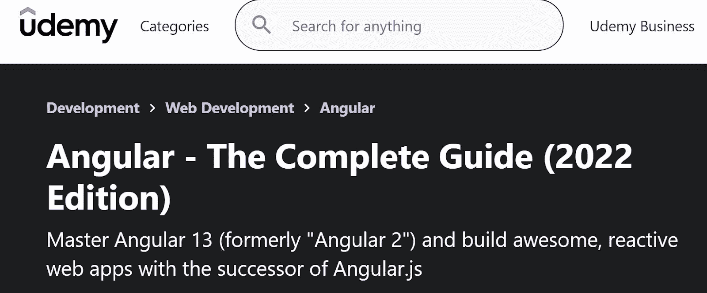
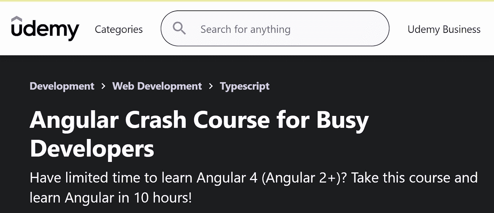
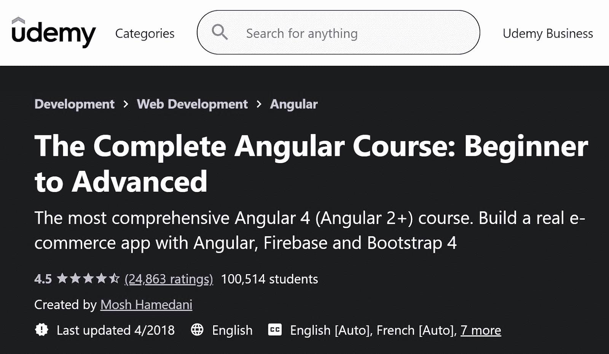
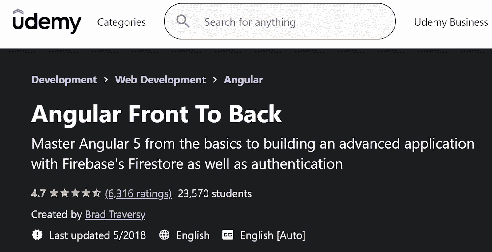
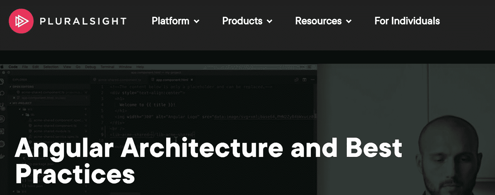
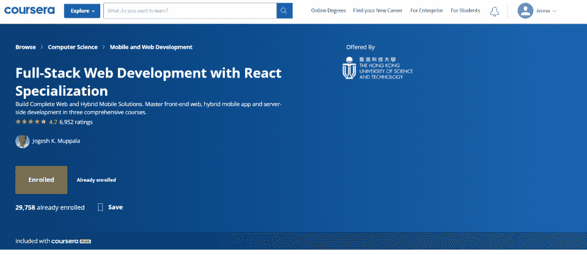
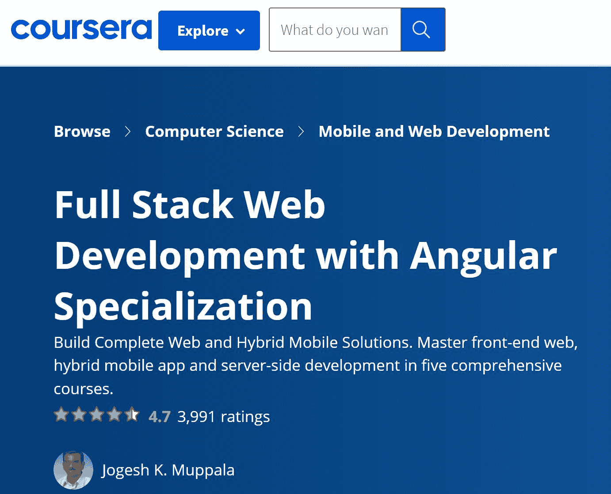
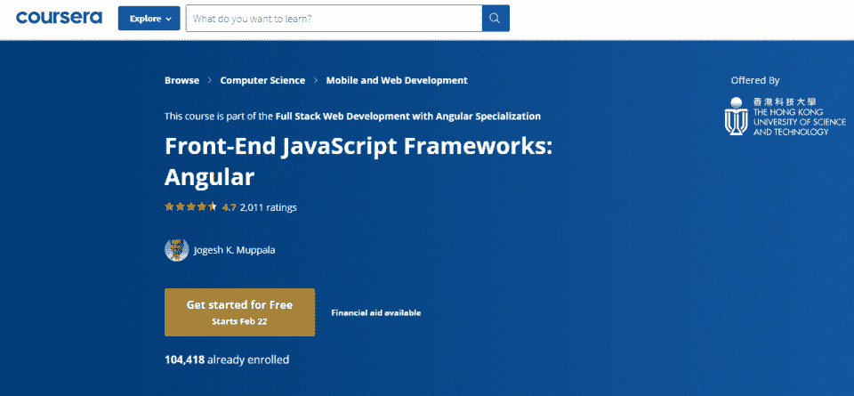
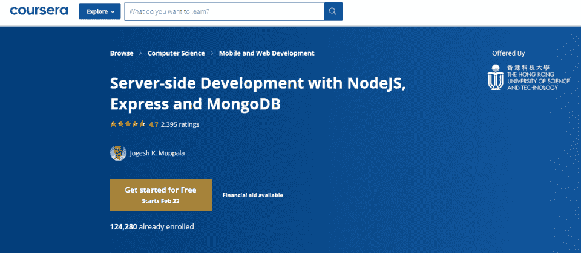
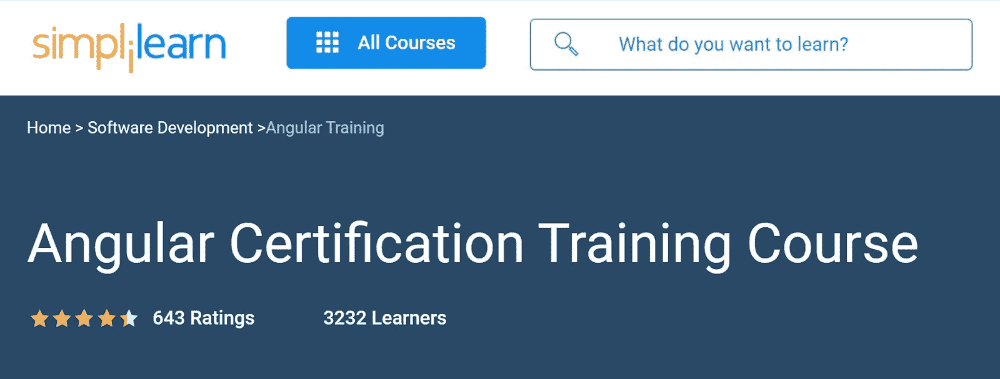

# 你应该在 2023 年注册的 7 个最佳角度在线课程

> 原文：<https://hackr.io/blog/best-angular-courses-online>

Angular 是技术领域的新术语，也是最流行和最热门的 web 框架之一，其中包括 jQueryandReactjs。几家财富 500 强公司，如微软、三星、Paypal 和达美航空公司，都在他们的前端网络应用程序中使用语言。

根据 Angular 的官方文档发布:***“Angular 或多或少是一个构建 dynamicweb 应用的结构框架。它是一个使用 HTML 和 TypeScript 构建单页面客户端应用程序的平台和框架。***

Angular 提供了一系列核心特性，如双向数据绑定、跨平台、高速性能、更少的代码、更快的应用程序开发、高效的设计架构以及其他独特的功能。

## 最佳角度课程

如果你渴望成为 Angular web 开发人员全球社区的一员，考虑通过注册 Angular 课程来提升你的技能。选择最适合你需要的角度课程！

由 Udemy 提供的这个角度速成课程是由优秀的讲师 Maximilian Schwarzüller 创建的。本课程共 32 节，461 讲，持续时间超过 34 小时。

在本课程中，您将学习:

*   如何在短时间内使用 Angular 12 开发可伸缩且响应迅速的 web 应用程序
*   如何成为一名对角度基础有深刻理解的前端开发者
*   角度应用程序背后的架构
*   如何创建单页应用程序

你不需要知道 Angular、 [HTML](https://medium.com/hackr-io/learn-html-5-best-html-5-tutorials-for-beginners-cea2bc68db71) 、 [CSS](https://hackr.io/blog/css-cheat-sheet) 或者 TypeScript 来上这门课。但是，预先了解这些概念会有所帮助。最重要的是， [JavaScript](https://hackr.io/blog/how-to-learn-javascript) 的实际工作知识是必不可少的。

有关本课程的更多信息，请查看我的网页。

[查看课程](https://click.linksynergy.com/deeplink?id=SeYHzlfZEmI&mid=39197&murl=https%3A%2F%2Fwww.udemy.com%2Fcourse%2Fthe-complete-guide-to-angular-2%2F)

如果你是一名 web 开发人员，想学习如何使用 Angular 构建应用程序，Udemy 提供的这个速成课程就是为你准备的。在短短的 10 个小时内，你可以学会 Angular 的所有重要概念。本课程有 11 个部分和 137 堂课。如果你能每天花一个小时来学习，你可以在一周内完成你的 Angular 应用程序。

本课程将帮助您磨练以下技能:

*   角度大师最重要的概念
*   编写可维护的代码
*   轻松纠正常见错误

对于这个课程，你不需要了解 Angular，但是 HTML、CSS 和 JavaScript 的基础知识是必不可少的。

欲了解更多信息，请查看[课程网页](https://click.linksynergy.com/link?id=jU79Zysihs4&offerid=1045023.719002&type=2&murl=https%3A%2F%2Fwww.udemy.com%2Fcourse%2Fangular-crash-course%2F)。

[查看课程](https://click.linksynergy.com/deeplink?id=SeYHzlfZEmI&mid=39197&murl=https%3A%2F%2Fwww.udemy.com%2Fcourse%2Fangular-crash-course%2F%3FLSNPUBID%3DJVFxdTr9V80%26ranEAID%3DJVFxdTr9V80%26ranMID%3D39197%26ranSiteID%3DJVFxdTr9V80-zDw9nKANghg2maoT77u3dw%26utm_medium%3Dudemyads%26utm_source%3Daff-campaign)

另一个来自 Udemy 的课程，这个课程很全面，是初学者寻找入门角度课程的一个很好的选择。本课程的优势在于，您将获得实践经验，并使用 Angular、Firebase 和 Bootstrap 4 开发一个真正的电子商务应用程序。

本课程有 25 个部分和 376 场讲座，时长 29 小时 33 分钟。

通过本课程，您将学会如何:

*   无需帮助构建角度应用程序
*   产生干净、优雅的代码
*   学习角度最佳实践

本课程的一个优势是，您不需要了解 TypeScript 或 Angular 的任何早期版本。该课程将教你从零开始打字和角度。

有关本课程的更多信息，请查看[课程网页](https://click.linksynergy.com/link?id=jU79Zysihs4&offerid=1045023.1247828&type=2&murl=https%3A%2F%2Fwww.udemy.com%2Fcourse%2Fthe-complete-angular-master-class%2F)。

[查看课程](https://click.linksynergy.com/deeplink?id=SeYHzlfZEmI&mid=39197&murl=https%3A%2F%2Fwww.udemy.com%2Fcourse%2Fthe-complete-angular-master-class%2F%3FLSNPUBID%3DJVFxdTr9V80%26ranEAID%3DJVFxdTr9V80%26ranMID%3D39197%26ranSiteID%3DJVFxdTr9V80-f_nf9V6LGAgzpquJZTkyag%26utm_medium%3Dudemyads%26utm_source%3Daff-campaign)

虽然 Angular 12 是最新的版本，但是您可以通过这个为所有级别的开发人员设计的课程赶上并学习 Angular 5。

评论者对课程深入角度框架表示满意。本课程有 10 个部分，共 73 节课，时长 11 小时 25 分钟。

在本课程中，您将学习如何:

*   使用 Angular 5+构建单页应用程序
*   熟悉角度应用文件和文件夹结构
*   使用 Firebase 的 Firestore 构建一个客户端管理应用程序
*   在非正规项目中使用引导程序 4

不需要任何先决条件，因此任何想学习 Angular 5 的人都可以报名参加该课程。

有关本课程的更多信息，请查看 Udemy 上的[课程网页](https://click.linksynergy.com/link?id=jU79Zysihs4&offerid=1045023.1277924&type=2&murl=https%3A%2F%2Fwww.udemy.com%2Fcourse%2Fangular-4-front-to-back%2F)。

[参加课程](https://click.linksynergy.com/deeplink?id=SeYHzlfZEmI&mid=39197&murl=https%3A%2F%2Fwww.udemy.com%2Fcourse%2Fangular-4-front-to-back%2F%3FLSNPUBID%3DJVFxdTr9V80%26ranEAID%3DJVFxdTr9V80%26ranMID%3D39197%26ranSiteID%3DJVFxdTr9V80-QeIKYPcO_CfPnvRlCqTz9w%26utm_medium%3Dudemyads%26utm_source%3Daff-campaign)

这门来自 Pluralsight 的课程帮助学生全面理解角度架构概念、最佳实践、组件通信技术、状态管理、代码组织、性能考虑等。这将帮助您构建一个易于重构和维护的可靠的应用程序架构。

该课程由 Wahlin Consulting 的创始人 Dan Wahlin 指导，为中级和高级开发人员提供 5 小时 21 分钟的课程。

该课程有 10 天的免费试用期，你甚至可以通过 Pluralsight 的 [Angular 2 在线培训](https://www.pluralsight.com/courses/angular-2-end-to-end?aid%3D701j0000001heIoAAI%26promo%3D%26utm_source%3Dnon_branded%26utm_medium%3Ddigital_paid_search_google%26utm_campaign%3DUS_Dynamic%26utm_content%3D%26cq_cmp%3D175953558%26gclid%3DCj0KCQiAip-PBhDVARIsAPP2xc2V8400ZhcnVHF1eDWUUEy3Y64z3dAUUG1MLi__UhKOUbN-HS0Hws0aAvDoEALw_wcB&sa=D&source=editors&ust=1645562077438802&usg=AOvVaw1HHRi_pfK7fV3cjL2_mRlM)继续学习。

[查看课程](https://pluralsight.pxf.io/DVey1n)

### 

这是一个 Coursera 专业，它有一系列的课程帮助你掌握一项特殊的技能。您可以暂停专业中的一门课程，也可以完成所有课程。

本课程帮助您学习 UI 前端框架和混合移动开发，以及实现多平台解决方案的服务器端支持。

[查看课程](https://coursera.pxf.io/P0vOAN)

### 本角专精课程共有 3 门课程。

Coursera 建议您按照以下顺序进行最佳学习:

本课程集中在前端 UI 框架的客户端。本课程结束后，您将能够:

*   使用 Bootstrap 4 及其组件设计网页
*   创建一个响应式网页设计
*   使用网络工具设计、设置和管理网站。

注册这门课程的先决条件是对 HTML、CSS 和 JavaScript 有很好的了解。

本课程关注基于 Javascript 的框架。本课程结束后，您将熟悉客户端 Javascript 框架和 Angular 框架，了解如何在 Angular 中构建单页应用程序，使用 Angular 的各种功能，包括指令、组件和服务，设计响应式 Angular 应用程序，以及使用 Observables 和 RxJS。

注册这门课程的先决条件是具备良好的 JavaScript 工作知识，尤其是 ES 5。

以上两个课程专门针对客户端，而本课程则全部针对后端，即服务器端。整个课程围绕 [NodeJS 平台](https://nodejs.org/en/)展开。在数据库方面，它涵盖了基本的 CRUD 和 REST 操作、NoSQL 数据库，特别是用于从 NodeJS 访问 MongoDB 的 MongoDB 和 Mongoose。您还可以为前端构建一个 RESTful API 来访问后端服务

通过查看[课程网页](https://coursera.pxf.io/qnLz0N)了解更多关于专业化的信息。

SimpliLearn 的这个认证课程帮助你理解 Angular 架构来设计单页应用程序。本课程涵盖了诸如类型脚本、服务依赖注入、MVC、定制管道、CLI、引导、可观察性和单元测试等概念。

这门课程没有先决条件，非常适合开发人员、项目经理、架构师和学生。

查看[课程网页](https://www.simplilearn.com/angular-certification-training)了解更多信息。

## 结论

在选择角度路线时，您有许多选择！另一项荣誉奖是 [Codecademy Angular course](https://www.codecademy.com/learn/learn-angularjs) ，大约需要 15 个小时完成。

既然你对一些最好的角度课程有了一个大致的概念，是时候加入进来，拓宽你的知识面了。慢慢来，给自己足够的空间来吸收信息。并且，一旦你有了一些经验，请随意查看我们关于棱角项目的文章。

**人也在读:**