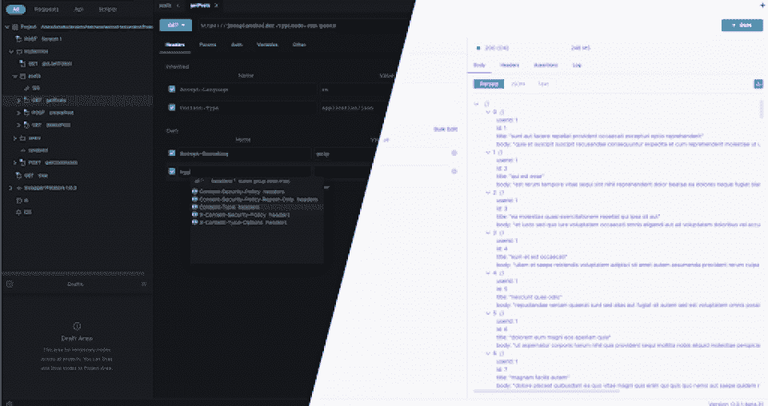
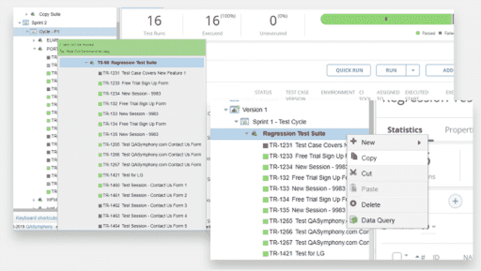
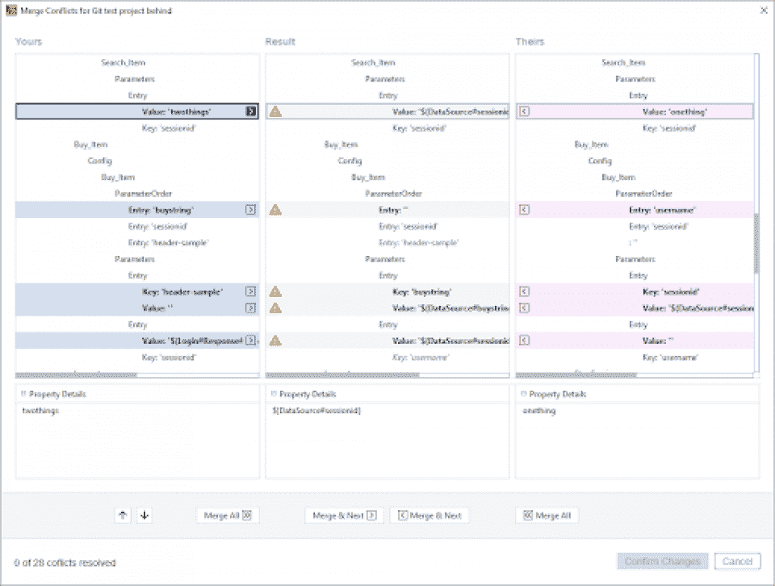
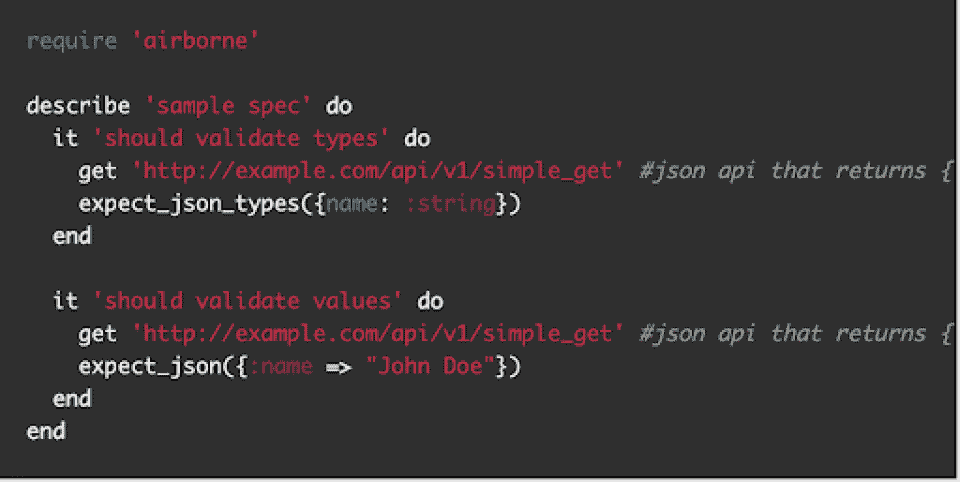
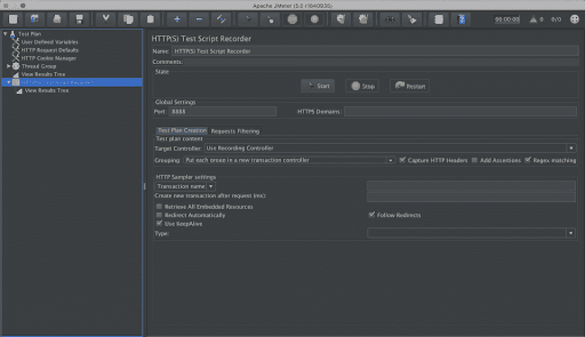
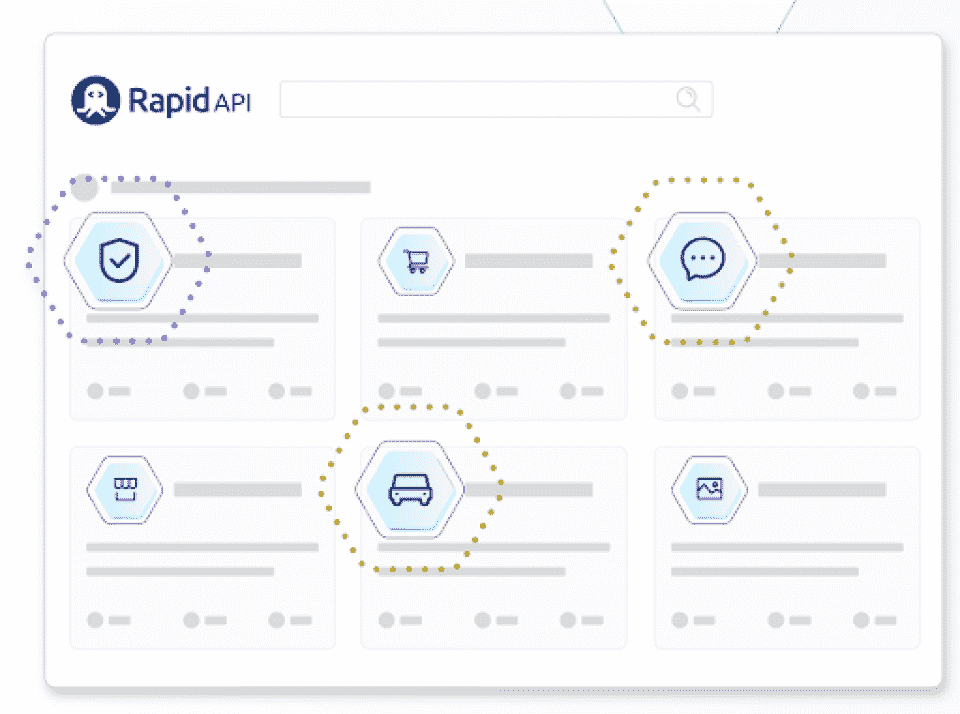
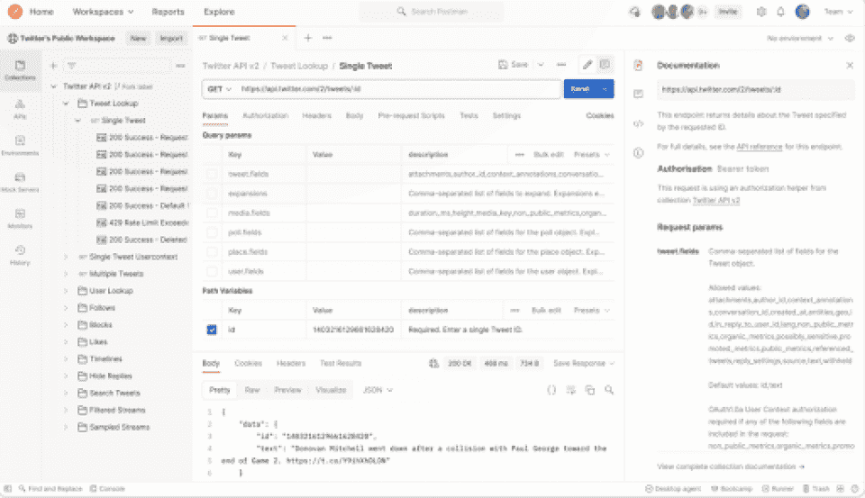
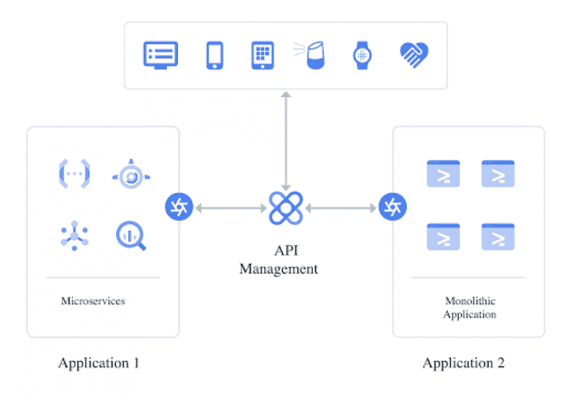
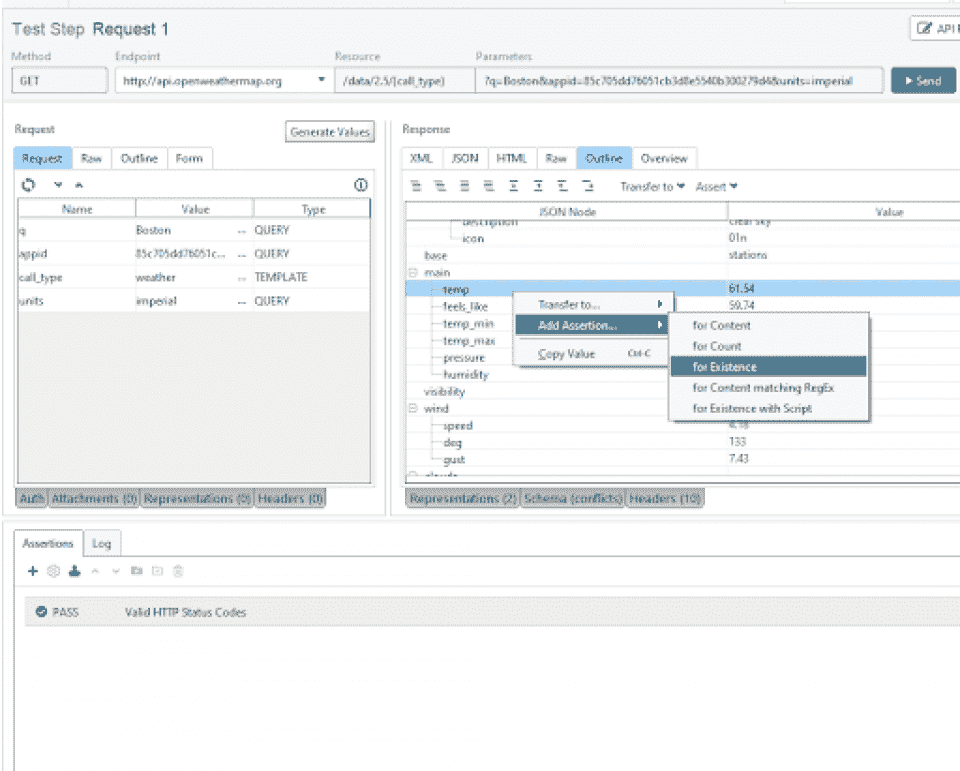
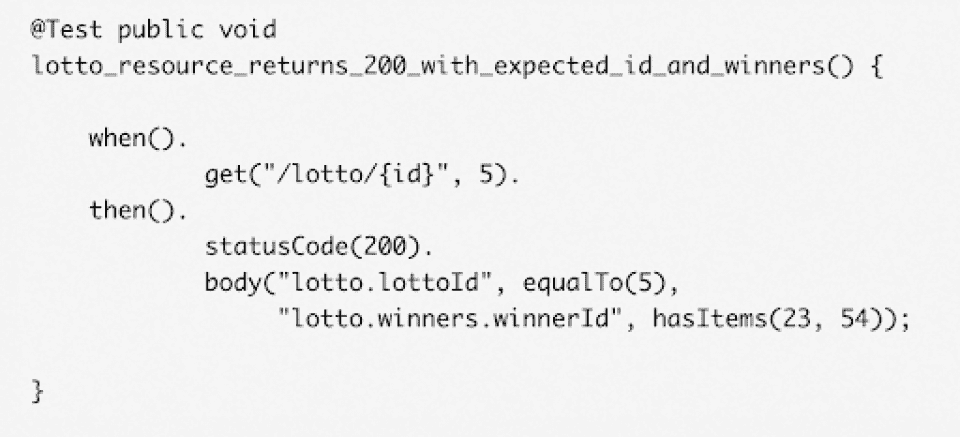

# 2023 年您需要使用的最佳 API 测试工具[更新]

> 原文：<https://hackr.io/blog/best-api-testing-tools>

API(应用编程接口)测试是在消息层测试 API 的软件测试，如 [SOAP](https://github.com/topics/soap-api) web 服务、REST API 等。

API 不能手工测试。他们的功能不能使用 [前端](https://hackr.io/blog/how-to-become-a-front-end-developer) 进行测试，因为界面中没有用户。因此，我们需要 API 测试工具。

API 测试在敏捷开发中特别有用，因为开发周期很短；因此，自动化测试成为了当务之急。

API 是描述两个或多个软件实体之间交互的计算接口。API 定义了从一个系统到另一个系统的调用和请求、这些调用是如何进行的、数据的格式、要遵循的约定等等。

API 已经成为软件开发的重要组成部分，需要对性能、功能、安全性和可靠性进行全面测试。

因为所有的应用组件大多是松散耦合的，所以测试 API 是很重要的。API 驻留在业务层，业务层可能会改变很多次。通过自动化的 API 测试工具，您可以在测试阶段的早期检测请求/响应中的任何格式变化，或者 API 本身是否有任何变化。这简化了集成和回归测试阶段，有助于缩短软件测试生命周期。

API 测试工具还执行负载测试、可重用性、可伸缩性、安全性测试和功能测试。应该选择哪种 API 工具？继续阅读，看看我们最喜欢的选择！

[****](https://testmace.com/)

**成立时间:2018 年**

**开发商:**【testmace.com 

**支持的平台:** Windows、Mac、Linux

TestMace 是对开发人员和测试人员有用的最强大、最现代、跨平台的自动化 API 工具之一。开发人员可以使用身份验证、变量、语法突出显示和自动完成特性来创建复杂的模拟场景和请求。UI 非常容易理解，您可以轻松地在环境之间切换。TestMace 提供了详尽的文档来支持它的特性。

在工具的图形编辑器的帮助下，测试人员可以很容易地编写测试用例。只需一次点击就可以测试测试用例！该工具还提供了[JavaScript](https://hackr.io/blog/how-to-learn-javascript)代码编辑器来编写复杂的自定义场景。

**亮点:**

*   它支持版本控制系统和组织良好的项目结构。
*   有不同的计划——基本计划为商业用途提供免费的 API 测试工具，并附带项目所需的大部分基本功能。其他计划包括个人、团队和企业。
*   嵌入式认证方式。
*   自动完成变量头，语法高亮，协议。
*   参数化测试和调试。
*   支持计划、报告、分析、缺陷跟踪和持续集成。

[****](https://www.tricentis.com/)

**成立:**2020 年 12 月(Tricentis 于 2007 年开发)

**开发商:**【tricentis.com 

**支持的平台:** Windows、Mac、Linux

Tricentis 鼓励自动化测试，这是一种完全无代码、人工智能驱动的智能方法。它是一款经过验证的工具，适用于云和 [DevOps](https://hackr.io/blog/what-is-devops) 并极大地增强了软件交付和企业应用程序的质量。

Tricentis Tosca 允许测试人员使用商业可读界面快速创建 API 测试，从而简化了 API 测试。它使用基于模型的 API 自动化测试工具(即创建应用程序模型)来消除编写脚本的需要。还有像 API 扫描这样的生产力特性，使用户能够使用自动版本化的可重用资产快速构建测试存储库。这使得测试用例具有弹性。

**亮点:**

*   自动识别、管理和消除触发假阳性的测试元素。
*   测试用例的零维护或非常低的维护——如果需求发生变化，模型需要更新一次，所有其他的变化都会自动同步。
*   即使是非程序员和非技术人员也易于使用。
*   融入开发运维与敏捷周期。
*   丰田、星巴克、沃达丰等顶级品牌使用它进行 API 和端到端测试。

[****](https://www.soapui.org/)

**成立:** 2005 年

**开发者:** SmartBear

**支持的平台:** Windows、Mac

SoapUI 是一个开源的、跨平台的 API 测试工具，它允许测试人员执行自动化的回归、功能、负载、安全性和合规性测试。您可以测试所有 API，因为 SoapUI 支持许多标准协议，如 SOAP/WSDL、JMS、REST、AMF、JDBC 等。

它有一个简单的 [UI](https://hackr.io/tutorials/learn-user-interface-design) 带有拖放功能，即使是非技术人员也能轻松理解。它还支持调试，并允许测试人员创建数据驱动的测试场景。测试人员也可以为复杂的场景创建他们的定制脚本(代码)。SoapUI 还可以与许多流行的自动化工具集成，如 Maven、Junit、Hudson 等。

**亮点:**

*   商业版是 SoapUI Pro，有生产力特性
*   完全建立在 [Java](https://hackr.io/blog/java-certification-courses) 平台上；将 Swing 用于用户界面。
*   核心功能包括模拟、调用、检查以及功能和安全测试。
*   用于漏洞测试的优秀工具，并提供保护网站免受黑客攻击的选项。
*   克隆特性，复制现有的测试套件以放入其他项目中。

[****](https://brooklyndev.github.io/airborne/)

**创办:** 2016

**开发者:** RubyGems

**支持的平台:** Windows

Airborne 是一个为 API 编写自动化测试的开源框架。它在 Rspec 和 RestClient 之上测试 API。Airborne 专门针对 Ruby，提供简单的响应检查。

空降没有很大的文档；但是，写测试很容易，一旦熟悉了就要做好充分的准备。除了创建代码和运行测试的文本文件之外，它没有其他用户界面。但是对于那些以前没有写过任何代码的人来说，这是非常容易理解的。

**亮点:**

*   Airborne 可以执行 API 测试工具应该执行的所有强制任务——断言、链接、包装等。
*   它与 RSpec 一起使用，RSpec 是一个用于行为驱动开发(BDD)小组的 Ruby 测试框架。
*   这是一个编程框架，因此很容易执行 CI(持续集成)和 CD(持续交付)操作。
*   免费开源。
*   适合结对编程和极限编程(协作)方法。

[API 和 Web 服务介绍](https://click.linksynergy.com/deeplink?id=jU79Zysihs4&mid=39197&murl=https%3A%2F%2Fwww.udemy.com%2Fcourse%2Fapi-and-web-service-introduction%2F)

[****](https://jmeter.apache.org/)

**成立:** 1998 年；2021 年 1 月 22 日最新版本 5 . 4 . 1

**开发者:** 阿帕奇软件基金会

**支持的平台:** Windows、Linux、Mac(任何支持 JVM 的环境)

JMeter 用于不同类型的测试，包括负载测试、功能测试和单元测试。它的主要焦点是 web 应用程序，也可以用于基本的性能监控。JMeter 支持许多协议和服务器，如 HTTP、HTTPS、SOAP、LDAP、FTP 等。它是开源的，可以免费获得。最后，JMeter 有一个交互式且易于使用的 UI。

**亮点:**

*   独立于平台，高度可扩展。
*   支持多线程框架，允许不同线程组并发采样。
*   以 XML 格式存储测试计划。
*   许多插件和扩展。
*   可以与 Java、 [PHP](https://hackr.io/tutorials/learn-php) 等多种编程语言配合使用。

[****](https://rapidapi.com/)

**成立:** 2014

**开发者:**RapidAPI([Iddo Gino](https://www.bing.com/search?q=Iddo+Gino&filters=ufn%3a%22Iddo+Gino%22+sid%3a%2299e6b816-0cde-f817-651c-8349f520d88f%22+catguid%3a%2205b14f84-65d2-3ab8-3706-f0c14c443a41_e5e87803%22+segment%3a%22generic.carousel%22+gsexp%3a%2205b14f84-65d2-3ab8-3706-f0c14c443a41_bXNvL29yZ2FuaXphdGlvbi5vcmdhbml6YXRpb24uZm91bmRlcnxUcnVl%22&FORM=SNAPST)，[Mickey Hasalvsky](https://www.bing.com/search?q=Mickey+Hasalvsky&filters=ufn%3a%22Mickey+Hasalvsky%22+sid%3a%22c3e1be30-349a-d861-23a8-c4bb2e3da604%22+catguid%3a%2205b14f84-65d2-3ab8-3706-f0c14c443a41_e5e87803%22+segment%3a%22generic.carousel%22+gsexp%3a%2205b14f84-65d2-3ab8-3706-f0c14c443a41_bXNvL29yZ2FuaXphdGlvbi5vcmdhbml6YXRpb24uZm91bmRlcnxUcnVl%22&FORM=SNAPST))

**支持的平台:** Windows

RapidAPI 用于测试、设计、监控等等。它有一个非常直观的 UX，并支持任何 API 类型。开发人员和测试人员可以轻松地为更深入的 API 验证创建详细的功能测试。它提供集中式(全局)监控，并且可以集成到 CI/CD 管道中。您还可以使用它来测试所有 REST APIs、SOAP 和 GraphQL APIs。

**亮点:**

*   开发人员可以从一个地方管理所有的 API 交互。
*   你可以注册一个免费账户，看看这个工具是如何工作的。
*   基于云的 API 测试工具，用于全面测试。
*   用户可以使用测试仪表板查看连接到其账户的所有 API。

[****](https://www.postman.com/)

**成立:** 2012

**开发者:** 阿比纳夫·阿斯塔那

**支持的平台:** Windows、macOS、Linux

Postman 简化了 API 测试，并将其快速集成到 CI/CD 管道中，从而加快了开发、测试和监控的速度。Postman API 开发环境有三个部分:集合、内置工具和工作区。您可以运行请求、调试、测试、创建和记录模拟场景，并监控集合的 API。您可以使用工作区共享收藏、分配权限和协作。

**亮点:**

*   基本计划是免费的，包含各种团队规模所需的所有功能。
*   支持各种 API 调用类型，如 SOAP、REST 和 HTTP，并支持不同的数据格式，如 RAML 和 GraphQL。
*   可扩展可定制通过 [【纽曼】](https://learning.postman.com/docs/postman/collection-runs/command-line-integration-with-newman/) 、命令行收藏 runner
*   巨大的社区支持。
*   对开发人员、测试人员和产品经理有用，取决于他们的需求和用例。

[****](https://cloud.google.com/apigee)

**成立:** 2010 年

**开发者:**2016 年被谷歌收购

**支持的平台:** Windows、macOS、Linux

Apigee 是一个 API 网关管理工具，用于跨 [云](https://hackr.io/blog/what-is-cloud-computing-beginners-guide) 应用和服务交换数据。它通过代理层提供服务，从而抽象出后端服务 API。

Apigee 有两个主要组成部分。首先是 Apigee 服务，它允许您创建、部署和管理 API 代理。第二个是 Apigee 运行时，所有的 API 流量都通过它进行传递和处理。API 监控是人工智能驱动的，因此，只需点击几下鼠标就可以发现任何问题。

**亮点:**

*   四个计划——免费版、团队、业务和企业。
*   企业计划包含所有高级功能，如 Apigee Sense 高级安全、流量隔离等。
*   为所有 API 提供治理和安全策略。
*   支持[node . js .](https://nodejs.org/en/)
*   开发人员可以通过可定制的门户网站轻松跟踪响应时间、API 错误率等。
*   跨云 API 测试的最佳工具之一。

**成立:**2019 年 3.0 版本，2014 年发布 1.0 版本

**开发者:** SmartBear

**支持的平台:** Windows、macOS、Linux

通过 ReadyAPI，您可以在 CI/CD 管道中快速测试 SOAP、RESTful、GraphQL 和更多 web 服务的功能、负载和安全性。它有一个集中的界面，帮助开发人员和敏捷团队提高 API 质量。团队只需点击几下鼠标，就可以创建数据驱动的测试并轻松添加安全扫描。ReadyAPI 还提供 SOAP、RESTful、TCP 等的虚拟化。和 web 服务来移除测试管道依赖性。

**亮点:**

*   交互式仪表盘，可快速提供见解和指标。
*   【HTML、CSV 等各种格式的详细报告和分析。
*   您可以创建合成数据或从各种数据源导入数据并共享。不同类型测试的数据，如负载、功能、安全性等。，用现实数据检查边界条件。
*   它本质上是由 SmartBear 开发的 SoapUI 的付费版本——它拥有 SoapUI 的所有功能，甚至更多。

[****](https://rest-assured.io/)

**成立:**2010 年 12 月首次发布(1.0)

开发者: 约翰·哈莱比

**支持的平台:** Windows、macOS、Linux

放心是一个基于 Java 的 DSL，通过它你可以为 RESTful APIs 编写可读且强大的测试，但是 *不是*OAP API。它是一个 Java 库，所以与 Junit、TestNG 或其他 Java 框架集成很容易，集成到 CI/CD 也很快。代码是人类可读的形式(像英语一样)，因为它支持类似于 if-else 的 Given-when-then 符号。

**亮点:**

*   支持数据驱动的测试和认证机制，如基本用户名-密码认证和 OAuth 认证。
*   提供对所有 HTTP 方法的支持，无需编写样板代码来设置 HTTP 连接、发送请求和解析响应。
*   开源。
*   提供了许多其他特性，比如 XPath 验证、规范重用、简单的文件上传等。
*   最适合 JSON 响应类型。

[****](https://www.katalon.com/?utm_medium=search&utm_source=google&utm_campaign=IN_KS_Katalon_Brand_Exact&utm_content=540785056941_c_&utm_term=katalon%20studio&gclid=CjwKCAiAp8iMBhAqEiwAJb94zwtECYAIRMz6LsV0Fi_DhHmIeLetY11BOzjwvKAaqsOo4poK8x8bgRoCRe4QAvD_BwE)

作为奖励，Katalon 工作室在我们的名单中值得一提。Katalon LLC 开发了一个双可互换接口来创建测试用例，如脚本视图和手动视图。这意味着技术人员和非技术人员都可以使用它。

它遵循页面对象模型模式，其中为使用 recorder 应用程序捕获的 web UI 元素创建一个对象存储库。

Katalon Studio 有三个版本:免费版、企业版和运行时引擎，这样团队可以根据他们的预算和运营需求进行定制。

## **结论**

以上所有的 API 测试工具都有各自的优点，我们不能说一个比另一个好。您选择的 API 测试器取决于您的业务案例和您的项目需要的特性。

既然您已经了解了一些最好的 API 测试工具，那么是时候升级您的软件知识了！ [探索十大软件测试课程](https://hackr.io/blog/software-testing-course) 。