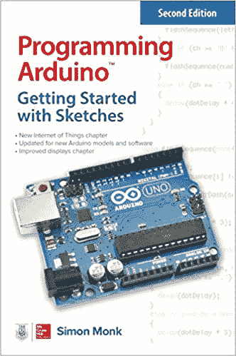
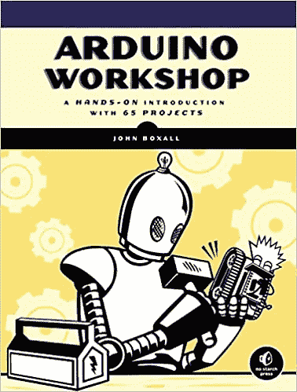
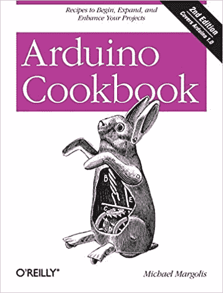
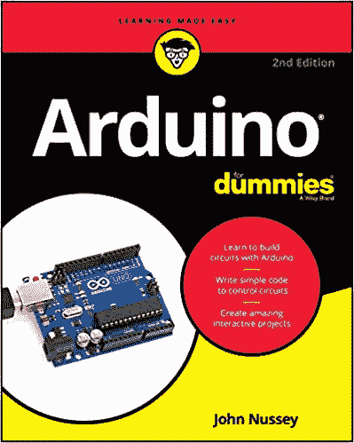
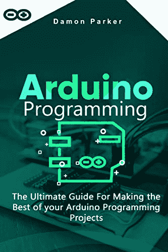
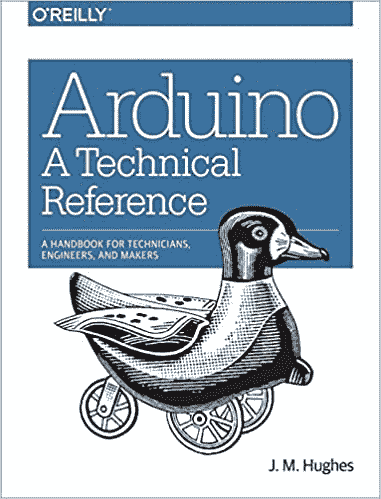

# 2023 年最适合初学者的 10 本 Arduino 书籍【排名】

> 原文：<https://hackr.io/blog/best-arduino-books>

如果你正在寻找最好的 Arduino 书籍，你可能已经知道 Arduino 是什么以及它的用途。尽管如此，我们还是会向您简单介绍一下，作为快速复习。

Arduino 是一个开源平台，具有易于使用的硬件和软件。这是一个可以读取各种输入的板，如按钮按压、感应灯、twitter 消息等。并产生一个输出——比如打开一个马达，打开一盏灯，在网上发布一些东西，等等。该板由一个微控制器组成，可以对该微控制器进行编码，以指示对特定输入应该做什么。这段代码是用 Arduino 编程语言(连线)和 IDE(处理)编写的。

Arduino 即使对孩子来说也很容易学习和使用。如果你想开始学习[编程](https://hackr.io/blog/what-is-programming)和机器人学，这就是你想要开始学习的语言！

## **Arduino 的特性和优势**

Arduino 不同于[其他编程语言](https://hackr.io/blog/best-programming-languages-to-learn)，因为它简单易学，通过提供一个简化和包装所有重要细节的包，隐藏了在微控制器中编写程序的所有困难。Arduino 的一些主要特性和优势如下:

*   用户友好的环境
*   性价比高
*   开源且可扩展
*   跨平台

要开始了解基础知识，我们建议您浏览他们的[网站页面](https://www.arduino.cc/en/Guide/HomePage)，那里有很好的信息。这将大大补充你的学习以及书籍。

## **10 本最好看的 Arduino 书籍**

这里有一些不错的 Arduino 书籍可供你阅读:

 拥有 Arduino Uno 板、Mega 2560 套件或其他流行板的人可以使用这本书。它涵盖了大量的基础和高级 C 语言，是学习 Arduino 的基础。有些题目解释得很好；然而，一些像物联网这样的高级主题并没有写得那么好。作者似乎在匆忙地浏览代码和其中的概念。然而，对于初学者和中级程序员来说，这是一本很棒的书。如果您正在处理一个项目，它也可以作为一个方便的参考。作者在边栏中提供了很多额外的信息，如果你愿意，你可以谷歌一下获得更多的细节。

#### **特性**

*   从简单的概念开始，系统地介绍更复杂的主题
*   涵盖了 C 语言的基础知识，足以让读者从 Arduino 开始
*   代码示例可以在线获得(GitHub ),并且可以随时访问。
*   有些概念只是提了一下，没有详细解释——虽然你可以参考互联网获得更多解释。
*   这不是一本深入的书，但涵盖了 Arduino 编程的所有重要方面。
*   虽然这些项目并非来自现实世界，但读者可以从中了解到使用这些项目背后的意图和想法。

**评分** : 4.6
**费用** : Kindle: $8.92
平装:$11.92

你可以在这里买到这本书。

 这本书是学习 Arduino 的非常实用的方法。这将是一种有趣的阅读体验，就像你在读小说一样。前几页只是一个基本介绍，如果你对 Arduino 有所了解可以跳过。一旦你开始做项目，你就会全神贯注于核心。每个项目都不一样，作者也解释了项目的整个过程和目标。每一行代码都有很好的解释，所以随着你继续进行更多的项目，你将能够自己编写代码。

#### **特性**

#### 详细的解释，包括目标，过程，代码和每个项目背后的概念

*   作者一点一点地介绍了 C 语言，这样你就可以看到这种语言的实际应用。
*   该书涵盖了与不同 Arduino 屏蔽和电子设备的集成。
*   出色的项目演示和概念解释
*   作者谈到了电学的基础知识，包括如何阅读电气图，这是理解电路板的一个重要部分
*   这些项目相当广泛；但是，您可以将您的想法添加到项目中，并进一步扩展它们以进行更多的学习
*   **评分** : 4.6
    **费用** : Kindle: $17.99
    平装:$18.79

你可以在这里买到这本书。

**推荐课程**

### [Arduino 初学者- 2023 完整教程](https://click.linksynergy.com/deeplink?id=jU79Zysihs4&mid=39197&murl=https%3A%2F%2Fwww.udemy.com%2Fcourse%2Farduino-for-beginners-complete-course%2F)

 这本食谱名副其实。它遵循解决问题的方法；然而，它不像教程或结构化的书籍。作者假设您对 Arduino 有很好的基本了解。大约有 200 个任务或问题，相关的电路图，样本代码和描述。这些问题涵盖了 Arduino 的硬件和软件两个方面，并且实际上涵盖了独特的概念。作者文笔清晰，没有赘言。一旦你开始练习每一个细节问题，你就会进入同样的思维模式，开始自己解决问题的某些部分，甚至整个问题。

**特性**

#### 这本书没有解释为什么用一种特殊的方式做某事；它只是给你一个解决问题的方法。

#### 虽然作者给出了关于特定食谱的足够的技术细节，但它并不广泛或全面。

*   这本书使用了最佳的代码实践，所以如果你开始写你的代码并且想要比较，这本书将作为一个优秀的导师。
*   无论你是初学者还是有经验的程序员，这本书都会以不同的方式帮助你，为简单到复杂的问题编写代码，理解电子和电气工程概念，微调代码，组装电路板，等等。
*   **评分** : 4.6
    **费用** : Kindle: $29.85
    平装:$45.78
*   你可以在这里买到这本书。

 这本书声称要在 24 小时内教会你，Arduino，这是对的。每一章都是由一系列可以在一个小时内涵盖的主题组成。这本书从头开始教你 Arduino 的设置和编程。它的节奏很快，包含了很多信息，如果你想了解更多的细节，你需要研究这些信息。作者涵盖了 C，虽然在购买这本书之前了解 C 会更好。

**特性**

这本书涵盖了 Arduino 的所有重要概念，包括如何使用库和创建新的定制库。

#### 最后几章涵盖了一些高级主题，如网络编程、文件处理和从头开始创建项目，包括设计试验电路板电路。

#### 这本书比你想象的更详细——从微控制器到 C 和 Arduino，它写得很好，详细地涵盖了所有这些。

*   允许您将您的想象力添加到各种代码示例中，这样您就可以最终构建您想要的东西
*   作者解释了做同样事情的许多方法，然后也解释了为什么其中一个是最好的方法。
*   这本书不适合那些编程新手。此外，关于 Arduino 的一些知识(如他们官网上的基本信息)对更快的学习有很大帮助。
*   **评分** : 4.5
    **费用** : Kindle: $10.84
    平装:$29.84
*   你可以在这里买到这本书。
*    这是一本高级书，尽管初学者在一些指导下也能使用。这本书很好地展示了 Arduino 的真正能力，并帮助你理解你如何控制事情以及为什么！每个项目都让你着迷，有趣且容易制作。作者鼓励你购买自己选择的主板——uno、Leonardo、mega、due 等。

**特性**

作者在解释所有概念时都考虑到了 Windows 然而，代码在 Mac 和 Linux 上都可以工作(需要时间)

这本书以章节的形式涵盖了各种主题——每一章都定义了项目的主题。比如第一章讲了如何用 Arduino 控制 LED。然而，你将能够学习所有的基础知识，包括编写你的第一个代码。

#### 有许多有用的策略可以遵循硬件和软件中的最佳实践。

#### 这本书可以被专业人士以及业余爱好者用来学习新的有趣的东西。

*   **评分** : 4.5
    **费用** : Kindle: $4.99
    平装:$19.99
*   你可以在这里买到这本书。
*    一如既往,“傻瓜书”是互动和机智的。作者构建了一个坚实的基础，涵盖了广泛的主题，包括如何获得不同的部分，与电机，焊接，改善您的代码，以及硬件和软件之间的集成。你甚至不会意识到你已经走了多远；你永远不会对这本书感到厌烦。这本书涵盖了 Arduino 的硬件和软件两个方面。如果你已经知道二极管、电路、门、微控制器和其他电子概念，这本书对你来说可能太容易了。
*   **特性**

对于绝对的初学者或那些在大学期间学过电子学，但现在忘了大部分的人来说，这是一个不错的选择。

有大量的外部参考资料和其他材料可以帮助你在阅读的过程中进一步增强知识。

作者提供了许多带描述的代码示例——有时，描述可能需要一段时间才能被理解，但在接下来的几页中，您将能够理解它。

#### 作者提到了一些高级话题；然而，它并没有太多的细节。

*   **评分** : 4.4
    **费用** : Kindle: $14.39
    平装:$19.06
*   你可以在这里买到这本书。
*    这本书涵盖了基本机器人和高级机器人的分步说明。它能帮助你增强想象力，让你自己定制硬件和布置 PCB。书中给出的代码示例可在网站上找到。这本书理论少，实践多，节奏快。这对任何人都有好处——学生、It 专业人员、爱好者——他们想学习新东西，可以用不同的方式思考。
*   **特性**

在深入研究机器人技术之前，作者简要解释了电气概念，如电气属性、电路和不同类型的连接。作者然后讨论了基本的电子学——二极管、门、集成电路、半导体等。

概念的流程很好，每个主题都有代码示例和描述

晶体管、继电器和电机控制器等许多主题都有基本的介绍。然而，更多的信息，你可以谷歌一下。

#### 由于这是一本高级、实用的书，所以推荐阅读我们列表中的其他基础书籍，或者通过免费的在线教程来学习。这将帮助您更快地理解高级主题。

#### 这些项目真的很好，并提供了一个良好的平衡电子以及编程语言知识。

*   **评分** : 4.4
    **费用** : Kindle: $27.99
    平装:$47.80
*   你可以在这里买到这本书。
*    虽然是一本初学者指南，但无论你是初级、中级还是高级 Arduino 程序员，这本书都是必购之物。这是一个伟大的教材，参考手册，等等。作者在每一章中都给出了许多有用的提示。这本书建立了一个坚实的基础，非常容易理解和遵循。文笔简洁有效。如果你计划在未来进入机器人领域，这是一本你一定要读的书。
*   **特性**
*   这本书的重点是用 Arduino 构建项目，这就像一个实践训练，你必须自己做事情(没有填鸭式的)，但要有正确的指导。

任何人都可以阅读这本书——从电子，微控制器，C 语言，机器人等概念。从头开始简洁明了地解释。

这本书组织得很好，概念的流动是自然的，一个接一个，所以你可以理解为什么一个特定的想法首先会出现。

书中有很多细节足以让你开始各种项目。

#### **评分** : 4.3
**费用** : Kindle: $9.99
平装:$17.95

#### 你可以在这里买到这本书。

*    这是一本全面的参考指南，从头到尾解释了 Arduino。这是一本适合中高级学习者的好书。书中涵盖的硬件细节的深度令人惊叹。这不仅仅是一本基于项目的实践书籍，还提供了大量的技术细节和对 Arduino 编程语言 API 的描述。还有很多链接可以额外参考。作者在 Arduino 项目中的经验和专业知识在整本书中都表现得很好。
*   **特性**
*   kindle 版本有彩色图表，更加清晰，更具视觉吸引力。
*   如果你是初学者，你可以谷歌一些关于 Arduino 的基本信息，一旦你知道了基本概念和术语，就可以从这本书开始。

作者快速浏览了一些基本概念，但当他开始解释更高级的概念时，速度就慢了——所以你需要有耐心阅读前几章。

这本书深入介绍了如何创建库，如何使用现有的库，如何使用 API 和 IDE。

作者还介绍了 Arduino 与物联网设备的接口控制。

#### **评分** : 4.1
**费用** : Kindle: $24.99
平装:$49.88

#### 你可以在这里买到这本书。

*   对于希望能够理解为什么他们需要学习 Arduino 或编程的初学者来说，这是一本非常棒的书！作者的语气相当友好，引人入胜。他鼓励你使用 Arduino 构建疯狂的东西，就像你的想象力没有止境一样。这本书涵盖了软件和硬件，为初学者提供了适量的细节。这本书将在你身上播下想象力的种子，同时向你介绍机器人、编程和电子世界。
*   **特性**
*   精彩的介绍从微控制器和 Arduino 是如何开发的开始，以及一些创建正确思维框架的实验
*   这些例子写得非常简单，使初学者能够更快地掌握它。
*   作者从简单的应用程序开始，然后转向更复杂的应用程序，并很好地解释了这两者。

如果你有一些 Arduino 或编程的经验，这本书不适合你。

图表和图片(手绘)整洁清晰，传达了主题的更多深度。

**评分** : 3.9
**费用** : Kindle: $8.69
平装:$31.51

#### 你可以在这里买到这本书。

*   **结论**
*   Arduino 可能是最受欢迎的机器人和物联网平台，市场上有大量的书籍可供学习，更不用说免费的教程和网络上的其他资源了。你可以从“Arduino for dummies”或“Arduino workshop”开始，作为第一步。如果你预算不足，目前只打算看一本书，那么《Arduino，技术参考》或《Arduino Robotics》可以提供丰富而全面的信息。Arduino Cookbook 和 Arduino Programming:终极指南是一些你可以购买一次并永远参考而不会厌倦的书。
*   在购买一本书之前，我们会鼓励你从 Arduino 官方网站上阅读基础知识。Hackr.io 还提供了一些关于 [IoT 和 Arduino](https://hackr.io/tutorials/learn-arduino) 的精彩课程，包括免费、付费、特色和最受欢迎的课程。
*   **人也在读:**
*   The diagrams and pictures (that are drawn by hand) are neat and clear and convey much more depth to the topic.

**Rating**: 3.9
**Cost**: Kindle: $8.69
Paperback: $31.51

[You can buy the book here.](https://www.amazon.com/Getting-Started-Arduino-Make-Projects/dp/B008SMKPW0)

## **Conclusion**

Arduino is perhaps the most popular platform for robotics and IoT, and there are plenty of books in the market to learn, not to mention the free tutorials and other resources over the web. You can start with ‘Arduino for dummies’ or ‘Arduino workshop’ as your first step. If you are low on budget and targeting just one book for the time being, ‘Arduino, A technical reference’ or ‘Arduino Robotics’ are informative and comprehensive. Arduino Cookbook and Arduino Programming: The Ultimate Guide are some books that you can buy once and refer forever without getting bored.

Before buying a book, we would encourage you to read the basics from the Arduino official website. Hackr.io also provides some brilliant courses on [IoT and Arduino](https://hackr.io/tutorials/learn-arduino), including free, paid, featured and most popular courses.

**People are also reading:**