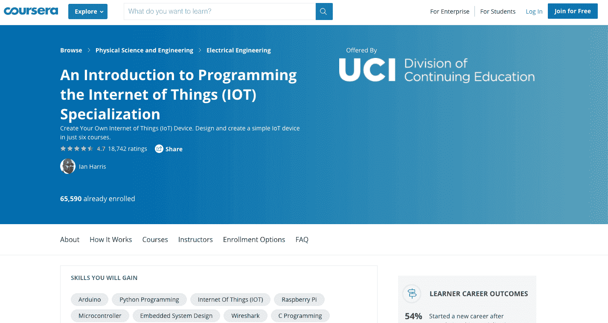
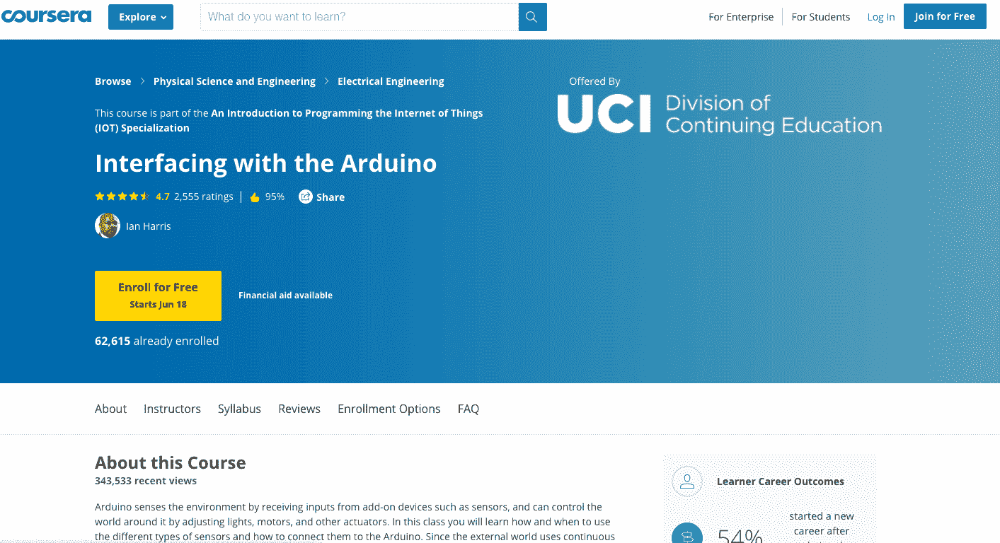
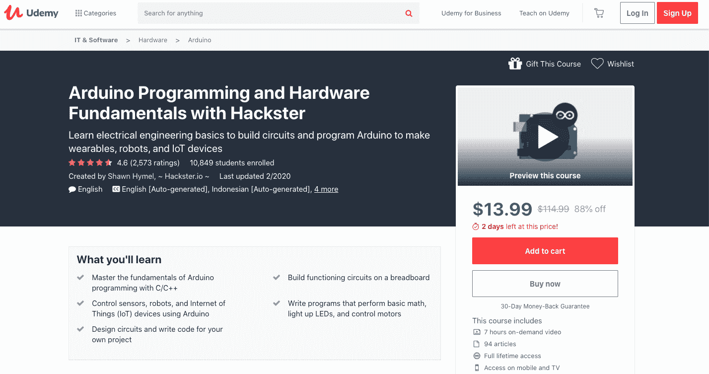
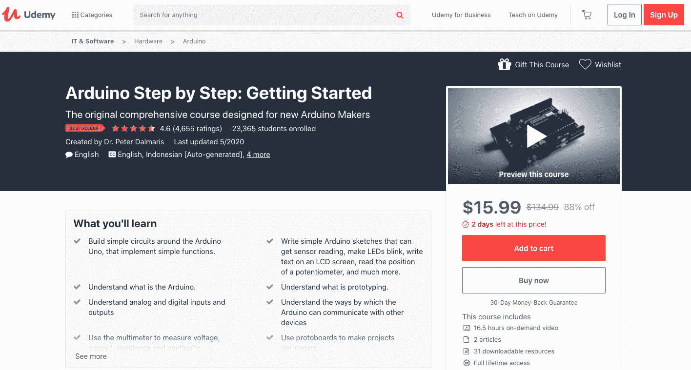
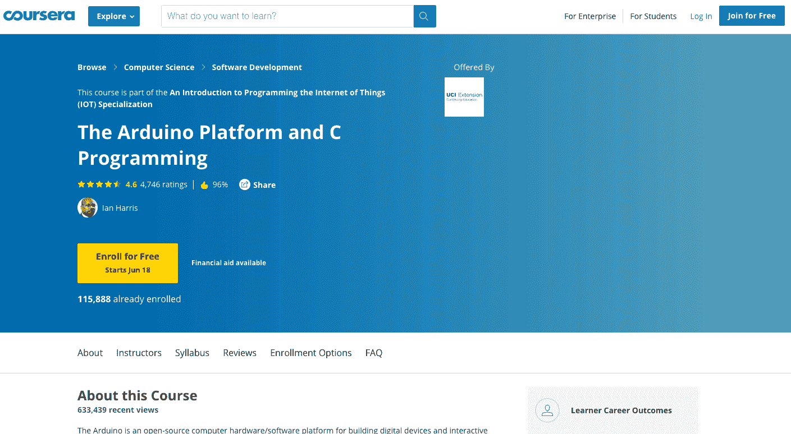
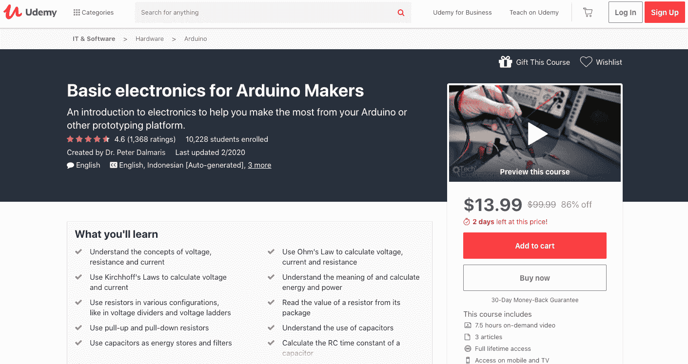
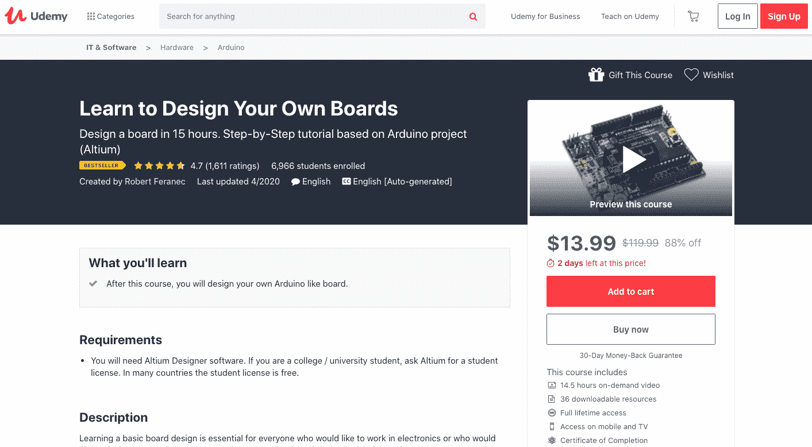
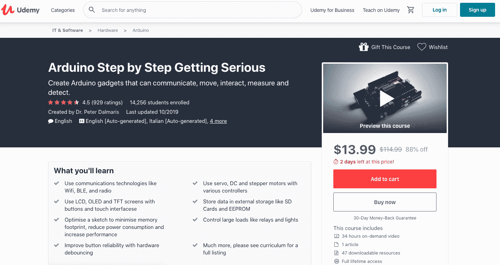
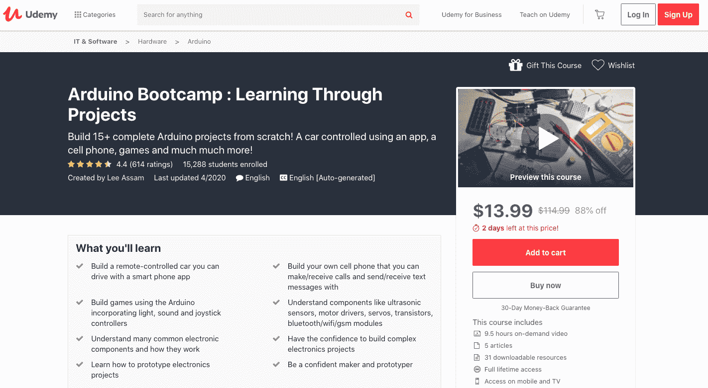

# 2023 年最值得学习的 Arduino 课程[更新]

> 原文：<https://hackr.io/blog/best-arduino-courses>

作为一个流行的开源软件和硬件平台，Arduino 是创建交互式对象和能够控制和感知周围环境的数字设备的完美工具。

幸运的是，我们开设了几门课程来帮助有志成为一名顶尖的 Arduino 程序员。许多在线资源的可用性使得人们很难根据自己的具体需求找到合适的教程。为了您的方便，我们列出了该主题中值得您花费时间和金钱的顶级 Arduino 课程。

## **10 个最受欢迎的 Arduino 在线课程**

[****](https://coursera.pxf.io/Gj4jK9)

该认证涵盖了 Raspberry Pi 和嵌入式系统等关键主题，将教您如何在 Arduino 环境下构建设备。顶点项目允许学生应用通过测试、设计和创建基于微控制器的嵌入式系统而学到的知识和技能。

下面列出了该培训计划的核心主题:

*   阿尔杜伊诺
*   物联网
*   [Python 编程](https://hackr.io/blog/python-programming-language)
*   嵌入式系统设计
*   树莓派
*   Wireshark
*   微控制器
*   计算机编程
*   c 程序设计
*   应用编程接口
*   排除故障

本课程将提高您在加州大学计算机科学系本科生教育副主席 Ian G. Harris 教授的主题中的技能。完成此学习计划后，学生将学习探索不同设计、创建标准布局和测试计划的艺术。

**先决条件:**无！然而，对物联网、计算机软件和硬件的兴趣将丰富学生的学习经验。

**等级:**初级
**等级:** 4.7
**费用:**免费报名
**时长:** 6 个月/每周 4 小时(约)

你可以在这里注册。

[****](https://coursera.pxf.io/Zdv6mg)

《Arduino 接口》是专为希望学习掌握使用 Arduino 专用屏蔽的专业知识的学生而设计的，是在线顶级课程之一。学习者将有机会获得处理涉及硬件和软件组合的物联网设备的实际经验。本课程还深入介绍了如何使用多个传感器，以及如何与 Arduino 建立连接。

本课程详细阐述了下列主题:

*   布线基础
*   使用试验板进行电路布线。
*   设计与基本执行器和传感器交互的电路
*   连接执行器和传感器

通过这个培训项目，你将获得在构建电路中有用的布线和硬件设计技能。本课程还详细阐述了基本组件及其功能。讲师伊恩·哈里斯一步一步地解释所有的主题，以便学生们能够快速掌握概念。

先决条件:先前的经验和知识并不是强制性的。

**等级:**初级
**等级:** 4.7
**费用:**免费报名
**时长:** 14 小时(约)

你可以在这里注册。

 报名参加本次 Udemy [学习编程](https://hackr.io/blog/how-to-learn-programming)如果你想掌握使用硬件的技能和[编程基础](https://hackr.io/blog/programming-paradigms)创造独特的艺术展示、机器人、家庭自动化工具等，此外，本课程将增强您对建筑电子设备的实践知识，这些电子设备能够对周围环境做出反应和感知。

通过本课程，您将有机会学习将数据远程记录到物联网平台的成熟技术。此外，您将学习如何使用互联网随时随地控制您的 Arduino。该认证使学生能够熟练掌握建筑规范和电路，这将使他们足够专业，以创造性地完成他们的项目。

以下是本学习计划中解释的不同主题:

*   用 C/C++进行 Arduino 编程的基础
*   使用 Arduino 控制物联网、机器人和传感器
*   设计电路
*   编写控制电机和点亮 led 的程序

本教程的不同部分包含具有挑战性的练习，非常适合测试他们在学习过程中获得的技能和知识。学生、工程师、手工艺者和企业家可以利用这个学习项目。

先决条件:不需要有[编程](https://hackr.io/blog/what-is-programming)和电子学的背景，但是学生应该能够熟练地解决代数问题和操作计算机。

**等级:**初级
**等级:** 4.6
**费用:** $126(终身访问)
**时长:** 7 小时(大约)

你可以在这里注册。

 这个 Udemy 课程是为 Arduino 新手设计的，作者是 Peter Dalmaris 博士——一位王牌教育家和电气工程师。这是学习 Arduino 原型开发平台所需编程技术的理想证书。此外，学生还可以接触到微控制器编程原理，同时了解如何通过 Arduino 连接互联网进行控制和报告。

以下是本专业中详细介绍的核心主题:

*   Arduino 基础知识
*   数字和模拟输出和输入
*   Arduino IDE
*   噪声检测
*   写 Arduino 草图
*   样机研究
*   Arduino 编程

这些概念用简单的语言解释，使学习者更容易掌握 Arduino 生态系统、屏蔽、传感器、配件、编程和电子设计的基本原则。此外，该计划还使用 Arduino 来解密通信和互联网集成。最棒的是，有方便的提示和 DIY 项目供学生练习技能。

**先决条件:**

*   一台 Arduino Uno，Linux/Mac/Windows 电脑
*   传感器、电阻、跳线、迷你试验板等课程必备工具。

**等级:**初级-中级
**等级:** 4.6
**费用:** $126 左右。(终生访问)
**持续时间:** 16.5 小时(大约)

你可以在这里注册。

这个 Coursera 培训项目是想要深入了解 Arduino 平台的个人的最佳选择之一。该计划从基础开始，并阐述其工作方面的图书馆，物理板，和集成开发环境。此外，学员还将了解防护罩以及它们如何与 Arduino 板结合使用，以执行诸如感应热量、光线、GPS 跟踪等功能。

本课程涵盖广泛的主题，包括:

*   Arduino 开发板
*   c 程序设计
*   排除故障
*   Arduino 程序
*   安装 Arduino IDE
*   c 变量和类型
*   循环和条件句
*   调试嵌入式软件
*   Arduino 草图结构和更多

导师们还借助 C 代码详细阐述了 Arduino 编程的完整过程。此外，您将学习如何使用软件工具来控制外部设备，编译和上传程序。该认证还描述了调试架构，解释了 UART 串行通信协议的工作原理。

**先决条件:**不需要编程方面的专业知识。
**等级:**初级
**等级:** 4.6
**费用:**免费报名
**时长:** 16 小时(约)

你可以在这里注册。

 该课程对电子学进行了详细的概述，并向学生介绍了使用各种原型开发平台(包括 Arduino)的技巧和技术。你将有机会彻底了解制作 Raspberry Pi 和 Arduino 的组件和原理，因为所有的主题都有详细的解释。该认证最适合在 Arduino 领域拥有必要经验和知识的个人，期待提高他们在该领域的技能。

通过本学习计划，您将学习以下概念:

*   电流、电压和电阻
*   计算电流、电阻和电压的欧姆定律
*   计算功率和能量
*   下拉和上拉电阻
*   了解二极管及更多

为了方便学生，课程附带点播视频和文章。这种专业化使个人能够深入理解 Arduino，计算压降和晶体管电流。

**先决条件:**

*   电子学和 Arduinos 的基础知识**。**
*   本课程的一些工具——电池、电阻器、LED、晶体管、电容器和二极管。
*   准备好跳线、万用表和小试验板。

**等级:**中高级
**等级:** 4.6
**费用:** $84 左右。(终生访问)
**持续时间:** 7.5 小时(大约)

你可以在这里注册。

 在本学习计划中，学生将学习使用 Altium Designer 软件的技巧和技术，该软件用于设计不同类型的电路板。此外，学生还将获得处理主板和其他服务器试验板的实践经验。如果你打算在电子行业发展，这门课程将会非常有用。

点播视频一步一步地详细介绍了所有概念，以便学生可以毫无困难地了解这些主题。您将学习创建构建电路板所需的基本文档。

该专业涵盖以下主题:

*   选择组件的提示
*   创建示意图、元件和绘制原理图符号
*   创建电路板的三维模型
*   创建物料清单
*   装配图等

该课程将使你成为处理电子相关要求的专家，如设计先进和复杂的电子产品。它将打开电子领域无数机会的大门。

**先决条件:**学生需要安装 Altium Designer 软件来开始学习课程。

**等级:**初级
**等级:** 4.6
**费用:** $122 左右。(终生访问)
**持续时间:** 14.5 小时(大约)

你可以在这里注册。

Udemy 提供的  这是另一门精彩的课程，涵盖了广泛的主题，使学生能够对该主题有更深入的理解。您将获得原理图代码布线演示和其他电路场景的实践经验。

Peter Dalmaris 博士是本课程的设计者和讲师，他将通过真实的例子帮助您理解电路和代码布线。通过此学习计划，您将了解以下概念:

*   无线电、BLE、WiFi 和其他通信技术
*   优化草图以提高性能并最小化内存占用
*   使用带有步进电机、DC 和伺服系统的控制器
*   控制灯、继电器和其他大型负载

培训计划的存储库提供外部资源链接、草图代码和布线示意图，以便学习者能够很好地理解该主题。为了方便学生，本课程还提供了一个讨论论坛。

**先决条件:**

*   Arduino 基础知识，写简单的草图，并在船上创建电路。
*   Arduino IDE 副本和基本工具，如试验板、万用表、Arduino Uno 板和电线。

**等级:**中高级
**等级:** 4.5
**费用:** $169(终身免费使用)
**时长:** 34 小时(大约)

你可以在这里注册。

 在 Udemy 上名列前茅的节目中，这个学习节目从头开始涵盖了所有的主题。它为学生提供构建手机控制的汽车、游戏、应用程序等所需的知识和技能。此外，本学习计划中有超过 10 个 Arduino 项目，因此您将有机会获得该主题的实践经验。

您将精通以下主题:

*   发光二极管
*   擀面板
*   移位寄存器
*   无源和有源蜂鸣器
*   电位器
*   开关
*   晶体管
*   操纵杆
*   8×8 矩阵 led
*   超声波传感器
*   红外接收器等等。

除上述内容外，学习者将对电子学原理有更深刻的理解。此外，你将学习每个主题的电气操作的各种组件。另外，本课程还包括阐述工程布局的电路图。

点播视频包含详细说明与主题相关的原型项目的组件组装和布线方法的分步视频。

**先决条件:**无！
**等级:**初级
**等级:** 4.4
**费用:** $126 约。(终生访问)
**持续时间:** 9.5 小时(大约)

你可以在这里注册。

## **结论**

这是关于 Arduino 的顶级课程，可以帮助你深入了解 Arduino 和相关概念。建议在根据您的具体要求选择课程之前，比较不同的因素，如价格、难度、持续时间、讲师。

如果你有任何其他 Arduino 课程推荐给社区，请在下面的评论中分享！

**人也在读:**