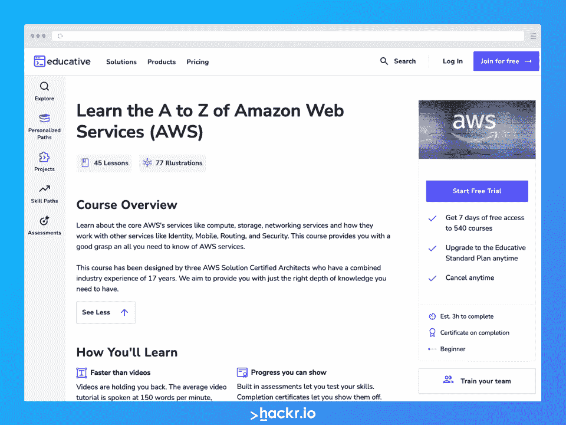
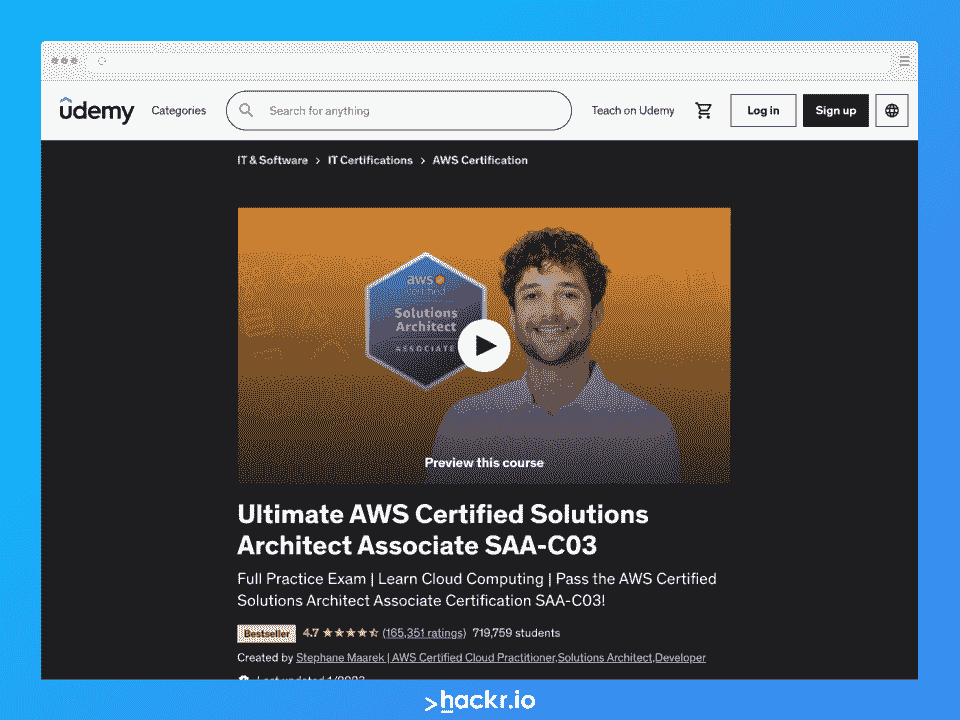
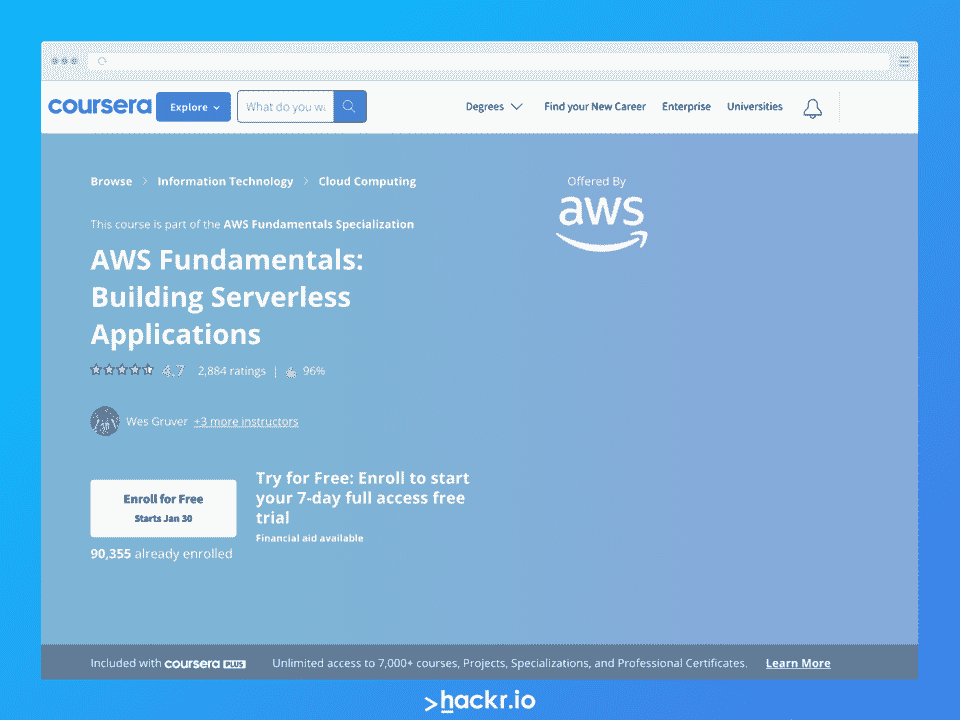
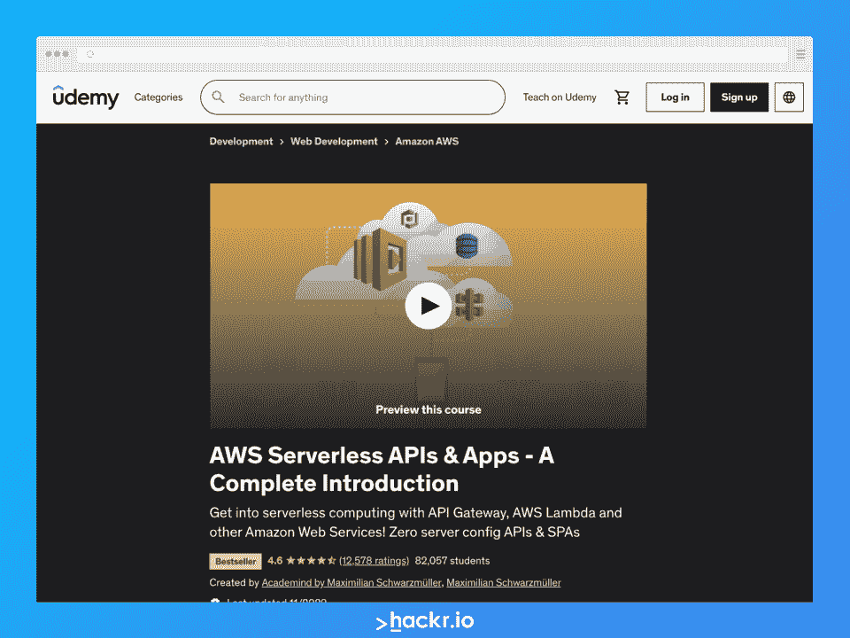
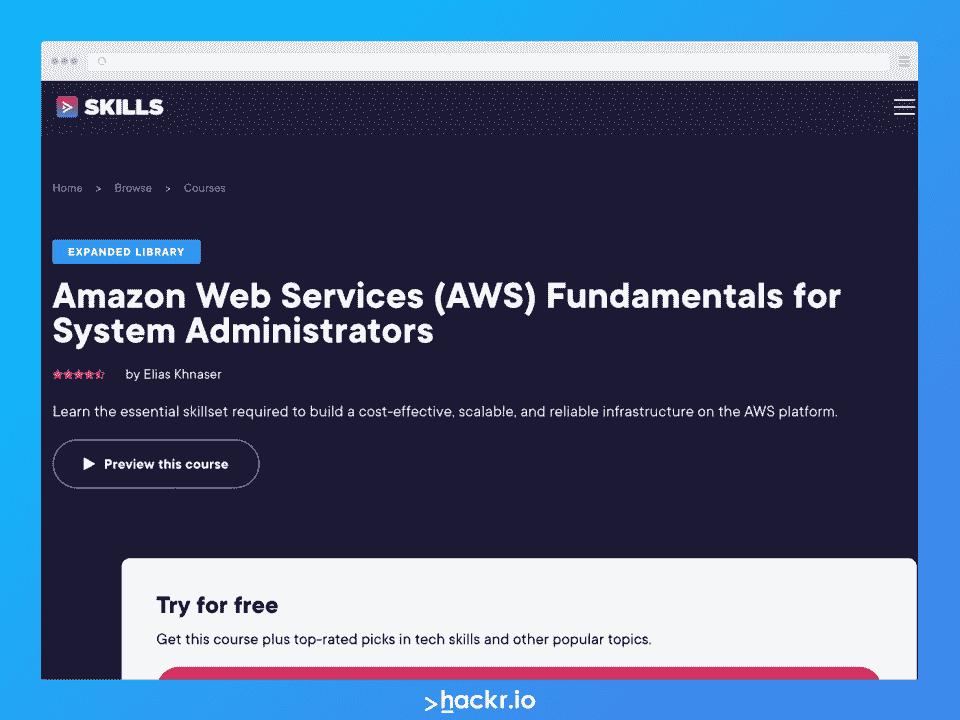
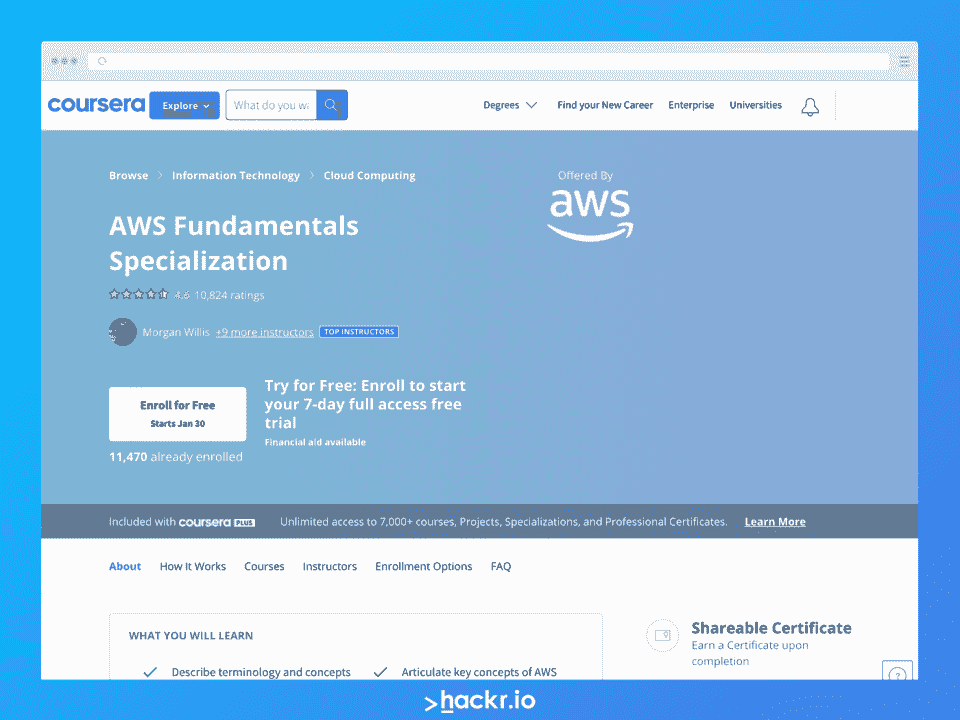
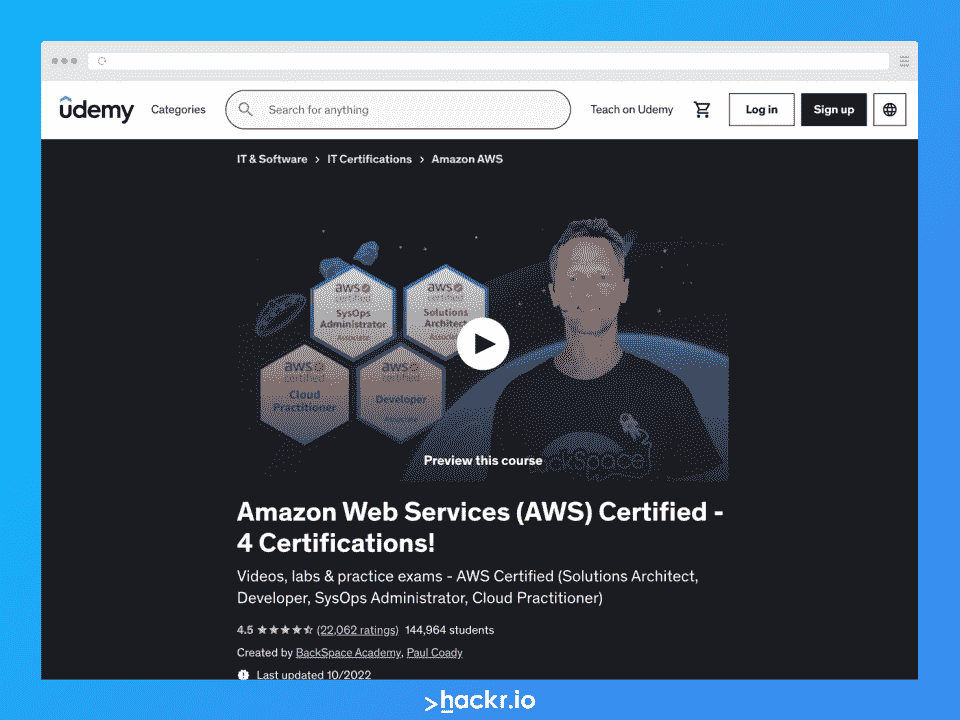
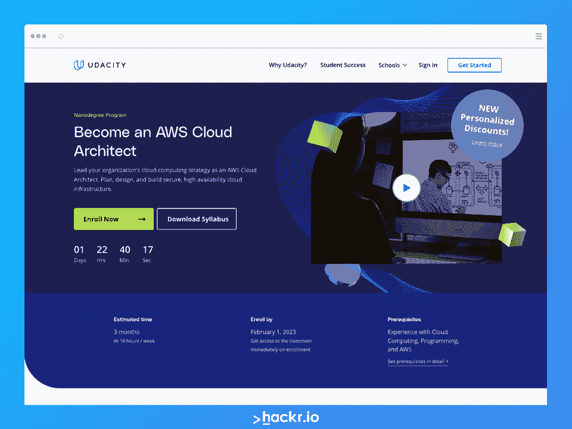
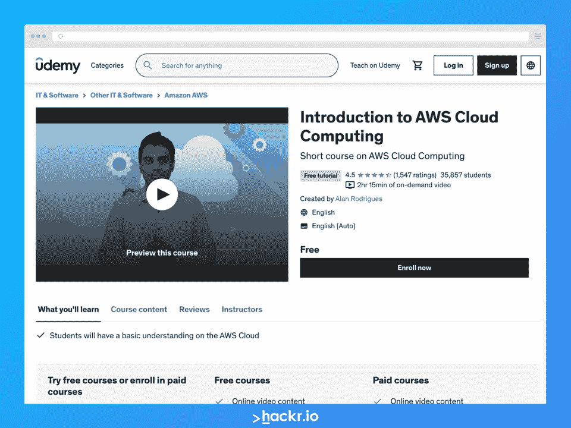

# 最佳在线 AWS 课程:排名前 10[2023]

> 原文：<https://hackr.io/blog/best-aws-courses>

AWS 或亚马逊网络服务是一个可扩展的、廉价的、可靠的云计算平台，由亚马逊于 2006 年推出。它通过帮助企业满足云计算需求来促进企业发展。AWS 融合了先进的基础设施，为企业提供高端云功能，如计算能力、内容交付、AWS 认证的数据库存储、云安全、云存储等。

如今，AWS 云专业人员非常吃香。如果你想转行，学习成为 AWS 云从业者的必要技能可以极大地影响你的成功机会。你可以从一些关于 AWS 的[最佳书籍](https://hackr.io/blog/aws-books)中学习，但是学习 AWS 的最好方法是参加 AWS 课程。

专业的 [AWS 学习项目](https://hackr.io/tutorials/learn-amazon-web-services-aws)为对云从业者的工作角色和许多相关职位感兴趣的个人提供了无限的机会。幸运的是，在这个领域有太多的认证培训课程。

如果你想找到最适合你的 AWS 课程，请继续阅读我们的 10 大推荐！

## **2023 年最佳 AWS 课程:十大推荐**

## 一门 AWS 课程值得吗？

在 AWS 成为一名熟练的专业人士，无论是什么样的工作角色，都是值得的，因为就业机会没有放缓的迹象。

请记住，这是一项完全可以在网上学习的技能，所以如果你想巩固你的职业生涯或开始一个新的职业生涯，你不能错过 AWS 课程。

大多数财富 500 强公司都使用 AWS，这项服务本身[占据了市场](https://www.statista.com/statistics/967365/worldwide-cloud-infrastructure-services-market-share-vendor/)的主导地位，截至 2021 年拥有 33%的市场份额。

**相关** : [10 个最好的 AWS 项目，帮助你更好地学习](https://hackr.io/blog/best-aws-projects)

## **10 门最佳 AWS 在线课程**

****

**[了解更多](https://click.linksynergy.com/deeplink?id=jU79Zysihs4&mid=47764&murl=https%3A%2F%2Fwww.educative.io%2Fcourses%2Flearn-the-a-to-z-of-amazon-web-services-aws)**

**关键信息**

*   **讲师/课程创建者:教育性**

*   持续时间:预计三小时

*   要求:计算机和互联网连接

*   AWS 的基本构件
*   AWS:杂项服务
*   AWS:身份和访问管理(IAM)
*   AWS:计算产品
*   AWS:存储
*   AWS:数据库产品
*   AWS:工艺路线
*   AWS:虚拟专用云(VPC)
*   AWS:应用服务
*   AWS 架构良好的框架

学习亚马逊网络服务(AWS)是一门教育性的课程。这个 AWS 亚马逊培训项目不是以视频格式提供内容，而是以文本格式教你一切。他们的理由是，在基于文本的阅读中，你可以学得更快，这确实有道理——但如果你更喜欢通过视频学习，你可能需要一门不同的课程。

也就是说，本课程是由三位专业人士共同完成的:AWS 解决方案认证架构师，他们总共有 17 年的经验。为了确保你得到最好的学习，本课程包括巩固你的学习的项目。

****

[了解更多信息](https://click.linksynergy.com/deeplink?id=jU79Zysihs4&mid=39197&murl=https%3A%2F%2Fwww.udemy.com%2Fcourse%2Faws-certified-solutions-architect-associate-saa-c03%2F)

**关键信息**

*   **讲师/课程创建者:夏羽·马瑞克**

*   时长:27 小时视频点播

*   IT 基础知识
*   AWS 自由层帐户
*   不要求有使用 AWS 云的经验
*   一台电脑

*   AWS 入门
*   IAM 和 AWS CLI
*   EC2 基础
*   EC2 -解决方案架构师助理级别
*   EC2 -实例存储
*   高可用性和可扩展性:ELB 和 ASG
*   AWS 基础:RDS、Aurora、ElastiCache
*   53 号公路
*   经典解决方案架构讨论
*   AWS SDK、IAM 角色和策略
*   基本和高级亚马逊 S3
*   亚马逊 S3 安全
*   AWS 中的数据库
*   数据和分析
*   机器学习
*   …以及更多

如果你想成为 AWS 专业人员，你很可能需要认证。如果你想和其他申请人竞争相同的职位，AWS 培训和认证实际上是一项要求。像这样的 AWS 认证课程可以帮助你获得最好的 AWS 认证培训。如果您完成了本课程，您通过 AWS 认证考试的机会将会增加。

也就是说，Udemy 上的最终 AWS 认证解决方案架构师助理 SAA-C03 课程旨在完美地帮助您准备通过与此计划相关的 AWS 认证。该课程最近更新了所有新信息，以确保您尽可能为最新的 SAA-C03 评估做好准备。

****

[了解更多信息](https://coursera.pxf.io/3PqJXk?subId3=blog%2Fbest-aws-courses_amcid-EipAIi66Z6oFBQVPlJ62M)

**关键信息**

*   **指导老师/课程创建者:AWS 韦斯·格鲁弗、里克·赫斯特、鲍比·阿特里斯坦、亚当·贝克尔**

*   时长:约 8 小时

*   亚马逊 API 网关
*   亚马逊 Lex
*   亚马逊 Dynamodb
*   自动气象站λ
*   无服务器架构解决方案

AWS 基础:构建无服务器应用程序课程将向您介绍 Amazon Web Services (AWS)无服务器架构。通过演示和动手练习，您将学习构建和部署无服务器解决方案的技能。

这个学习计划最大的好处是，您可以获得处理与 AWS 无服务器架构和框架相关的真实企业问题的实践经验。你将通过聊天机器人和无服务器网站的真实例子来学习。

****

[了解更多信息](https://click.linksynergy.com/deeplink?id=Qouy7GhEEFU&mid=39197&murl=https%3A%2F%2Fwww.udemy.com%2Fcourse%2Faws-serverless-a-complete-introduction%2F&u1=blog%2Fbest-aws-courses_amcid-bUUViYBOBx3lebolsIrPb)

**关键信息**

*   **讲师/课程创建者:马克西米连·施瓦兹米勒学院**

*   级别:中级到高级

*   时长:7.5 小时的视频点播

*   对 AWS 的基本了解
*   用于创建 AWS 帐户的信用卡
*   对 SPAs(单页应用程序)和 API 有基本的了解

*   无服务器开发
*   AWS 权限
*   自动气象站λ
*   身体映射模板
*   Dynamodb
*   扫描和创建项目
*   自定义授权人
*   AWS S3
*   Cloudfront 分发设置和更多
*   [Web 应用部署](https://squareboat.com/services/web-development)
*   无服务器应用安全性
*   高级开发工作流

该课程由广受欢迎的网站开发讲师 Maximilian Schwarzüller 创建，非常适合学习在 API Gateway 和 AWS Lambda 等亚马逊 Web 服务中使用无服务器计算。您还将学习 Lambda 代码的执行以及在没有手动数据库服务器管理的情况下将信息存储在数据库中的方法。

此外，这一专业使学生能够学习将用户身份验证纳入其当前前端应用程序的不同方法。它还包括从未经授权的用户设置 REST API 配置。

****

[了解更多信息](https://pluralsight.pxf.io/aBWeY?subId3=blog%2Fbest-aws-courses_amcid-sJEFFFANlAe7ElBJzJMoY)

**关键信息**

*   **讲师/课程创建者:Elias Khnaser**

*   要求:本课程面向初学者，没有任何要求

*   AWS 认证跟踪
*   云计算简介和历史
*   AWS-详细概述
*   全球基础设施
*   安全措施
*   S3 和短命
*   EBS 和冰川
*   自动扩展、联网和云监控
*   Lambda、API 和数据库
*   云的形成，云锋，云迹和弹性豆茎

这门 AWS 课程主要是为新手设计的，帮助学生成为认证的 AWS 专业人员。它涵盖了从基础到一切，包括核心主题，如全球 CloudTrail、存储和基础架构。

完成本课程后，您将对虚拟化、云计算和网络基础知识有很好的理解。在满足不同需求的同时，您还将能够构建可扩展、经济高效且可靠的基础设施。

这个奇妙的项目为学生准备了高级认证，如 SysOps 管理员和 AWS 认证解决方案架构师。

此外，学员将了解通过本培训课程所学概念的实际实施。最重要的是，你可以在资深 IT 专家、GTP(Gartner for Technical Professionals)研究副总裁 Elias Khnaser 的指导下学习。

****

[了解更多信息](https://imp.i384100.net/c/2890636/1347618/14726?u=https%3A%2F%2Fwww.coursera.org%2Fspecializations%2Faws-fundamentals&partnerpropertyid=2722169)

**关键信息**

*   **指导老师/课程创建者:AWS 这里见教官**

*   持续时间:如果每周学习三个小时，则为四个月

*   没有 AWS 经验是必要的

*   电脑和互联网连接

*   AWS 云技术要点
*   AWS 基础:应对安全风险
*   AWS 基础:迁移到云
*   AWS 基础:构建无服务器应用程序
*   动手项目

AWS 基础专业化是 AWS 在 Coursera 在线学习平台上创建并认可的课程。对于那些想开始学习 AWS 的人来说，这无疑是最好的 AWS 培训课程之一，尤其是因为它是从最基础的开始。参加这个亚马逊网络服务培训项目会教你你需要知道的东西。除了讲课之外，你还会做一个动手项目，将你的知识付诸实践。

该课程由 10 名 AWS 专业人员创建和组织，其中包括 Coursera 上的两名顶级讲师。你可以对这个项目的质量和你将接受的教育感到更加安全。如果你正在寻找 AWS 认证的课程，AWS 本身提供的课程是不会错的！

****

[了解更多信息](https://click.linksynergy.com/deeplink?id=jU79Zysihs4&mid=39197&murl=https%3A%2F%2Fwww.udemy.com%2Fcourse%2Fultimate-aws-certified-sysops-administrator-associate%2F)

**关键信息**

*   **讲师/课程创建者:保罗·科亚迪，退格空间学院**

*   级别:中级到高级

*   时长:46 小时视频点播

*   对计算机和网络有基本的了解
*   完成实践练习的 AWS 帐户
*   电脑(Windows、macOS 或 Linux)

*   AWS 软件开发
*   AWS 命令行套件

这是一个全面的 AWS 准备课程，最适合掌握软件开发、架构设计和管理开发等方面的技能。如果你想从事 AWS 云管理员、开发人员或解决方案架构师的职业，那么这个课程会很有用。

这个 Udemy 程序的内容包括 AWS 软件开发和 AWS 命令行工具包。此外，您还可以获得通过几项 AWS 认证培训考试所需的专业技能和知识，包括:

*   AWS 认证解决方案架构师助理考试
*   AWS 认证系统管理员助理考试
*   AWS 认证开发人员助理考试
*   AWS 认证云从业者考试

****

[了解更多信息](https://click.linksynergy.com/deeplink?id=jU79Zysihs4&mid=39197&murl=https%3A%2F%2Fwww.udemy.com%2Fcourse%2Fintroduction-to-cloud-computing-on-amazon-aws-for-beginners%2F&u1=blog%2Fbest-aws-courses_amcid-o2P6F2mFJP72Ib7O7JmQY)

**关键信息**

*   **讲师/课程创建者:尼尔·戴维斯，数字云培训**

*   时长:7 小时视频点播

*   要求:没有先前的经验是必要的

*   储存；储备
*   数据库，
*   建立工作关系网
*   虚拟化
*   容器
*   云架构
*   使用 AWS CloudFormation 部署基础设施
*   Lambda 上的无服务器事件驱动架构

这门关于云计算的 AWS 入门课程非常适合学习使用 AWS 的基础知识。您仍将有机会发展实践技能，并且所涉及的编码是可访问的。

教学大纲涵盖了各种各样的主题和所有的核心主题。您将学习如何创建平台即服务、启动关系数据库、创建和配置存储服务等概念。

课程创建者最近更新了 2023 年的课程。2023 年 1 月更新是一门全新的课程，包括适应最新 AWS 控制台/服务更新的活动。使用此最新更新更轻松地学习 AWS！

****

[了解更多信息](https://imp.i115008.net/c/2890636/1227136/11298?u=https%3A%2F%2Fwww.udacity.com%2Fcourse%2Faws-cloud-architect-nanodegree--nd063&partnerpropertyid=2722169)

**关键信息**

*   **讲师/课程创建者:Udacity**

*   级别:中级到高级

*   持续时间:3 个月，每周学习 10 小时

*   云计算、AWS 和编程经验

*   有关课程前提条件的完整列表，请访问[此链接](https://www.udacity.com/course/aws-cloud-architect-nanodegree--nd063)

Udacity 以提供由各自领域的权威专家和专业人士创建的高质量课程而闻名。成为一名 AWS 云架构师 Nanodegree 计划也不例外，这一密集的计划将向您传授成为云架构师所必需的技能和知识，并提供一些最佳的 AWS 培训。这个项目需要相对较大的资金投入，但对中级到高级的学习者非常有益。

如果您选择参加此 AWS 课程培训计划，您将需要确保在三个月内投入必要的时间来完成培训，并且不会超出成本。你可以花更长时间，但你需要支付更多费用才能继续。

****

[了解更多信息](https://click.linksynergy.com/deeplink?id=jU79Zysihs4&mid=39197&murl=https%3A%2F%2Fwww.udemy.com%2Fcourse%2Fintroduction-to-aws-cloud-computing%2F)

**关键信息**

*   **讲师/课程创建者:艾伦·罗德里格斯**

*   时长:2 小时 15 分钟的视频点播

*   要求:只有一台计算机和互联网连接

*   AWS 云
*   云计算
*   虚拟私有云
*   简单存储服务
*   弹性计算云服务
*   DynamoDB
*   弹性豆茎服务
*   Lambda 计算服务
*   Opswork 服务
*   云的形成

如果你想学习 AWS 的基础入门课程，这个免费的 Udemy 选项是一个很好的起点。只有两个小时十五分钟，AWS 云计算介绍将作为入门，帮助您继续学习其他更高级的 AWS 在线课程。

虽然本课程不会为你赢得结业证书，你也不会有机会接触到像导师直接信息和问答这样的东西，但很难击败免费的价格！如果你有两个小时的空闲时间来学习初级水平的 AWS，考虑参加这个课程吧！

## **结论**

上面列出的 AWS 课程最适合那些想在这个领域有一个良好开端的人。建议在注册前检查每个培训计划下涵盖的所有主题。不要一次学太多课程——如果你是初学者，就从基础开始。

这些课程不仅会帮助您获得基本 AWS 概念的知识，还会通过实验和动手实践教会您基本的技能。祝你好运，我们希望你找到最适合你的 AWS 课程！

作为一名 AWS 专业人员，你准备好找工作了吗？可以考虑看看这些 [*顶级 AWS 面试问题*](https://hackr.io/blog/aws-interview-questions) *来帮你准备！*

## **常见问题解答**

#### **1。AWS 有需求吗？**

作为最受欢迎的云服务，AWS 中的知识和技能肯定是有需求的。事实上，根据[一些报道](https://www.linkedin.com/pulse/aws-certifications-worth-2021-neal-davis#:~:text=AWS%20Skills%20Demand%20Is%20Outstripping%20Supply&text=According%20to%20a%20recent%20report,to%20be%20in%20the%20future.)，AWS 技能供不应求。

#### **2。哪个 AWS 课程最好？**

有许多顶尖的 AWS 课程，包括这个列表中的课程。可以从这里推荐的一门课程开始！此外，如果你真的想确定你接受的教育质量，确保你参加的课程是亚马逊认可的。

#### **3。新手上哪个 AWS 课程好？**

这个列表中的任何 AWS 初级在线课程都是一个很好的起点。就教学大纲而言，它们在很大程度上都是相似的。你不会错过任何重要的信息。只需专注于选择一个全面的 AWS 在线培训计划。

#### **4。在家怎么练 AWS？**

你所需要的只是一个 AWS 账户，知识和技能，以及实践的动力。如果你能参加在线课程或参与一些 AWS 项目，那就更好了！你将在不知不觉中获得 AWS 认证！

#### **5。3 个月能学会 AWS 吗？**

虽然亚马逊推荐[六个月到两年](https://aws.amazon.com/certification/faqs/#:~:text=The%20best%20preparation%20for%20certification%20exams%20is%20practical%20experience.)的实践经验来学习 [AWS 进行认证](https://hackr.io/blog/aws-certifications)，但是在三个月的时间内学习当然是可能的。如果你在学习中投入足够的时间，并参加高质量的 AWS 服务在线课程，你可以更快地学习 Amazon Web Services。

**人也在读:**