# 要读的区块链书籍

> 原文：<https://hackr.io/blog/best-blockchain-books>

区块链技术在不断变化，很难知道哪些书、[教程和课程](https://hackr.io/blog/best-cryptocurrency-blockchain-tutorials)仍然相关，甚至值得你花费时间。

在阅读了超过 15 本区块链的书籍，并在网上搜索世界上最大的密码专家的推荐后，我策划了一份 2023 年区块链最佳书籍的名单。

开始给 Kindle 充电，然后继续阅读，找出哪些书成功了！

| 

### **时间上短？我们 2023 年关于区块链的前 3 本书**

 |
| **书名&作者** | **为什么你需要阅读它** |
| 1.Don 和 Alex Tapscott 的区块链革命 | 对于我们向 Web3 世界的转变，这是一个诚实和令人耳目一新的视角。 |
| 2.纳撒尼尔·波普的《数字黄金》 | 对比特币和区块链技术崛起的戏剧性描述。 |
| 3.本·阿姆斯特朗的《追上密码》 | 数字货币的应用和未来指南。 |

## **如何挑选一本很棒的区块链书**

无论您是需要一个总体概述，对未来的状态感到好奇，还是希望在投资 crypto 之前获得坚实的知识基础，书籍可能都是了解区块链的最佳方式。

以下是我的建议，告诉你如何找到满足你特定需求的关于区块链的最佳书籍。

#### **1。诚实地说出你需要从哪里开始。**

如果你对区块链几乎一无所知，那么在阅读它对未来的影响时，你可能会感到茫然。挑选一本与你的技术知识和对手头主题的理解相匹配的书。当有疑问时，从一本概述区块链的书开始，然后进入更具体的话题。

#### **2。对作者做背景调查。**

每位作者对区块链都有不同程度的了解或专业知识。有些甚至可能与某些加密货币相关联。在买下一本区块链的书之前，花几分钟在网上研究一下作者，并得出你自己的结论。

#### **3。不要害怕在书上做笔记。**

如果你正在阅读多本区块链的书，这一点尤其重要——你想记住你学到的信息。就我个人而言，我会选择平装本而不是电子书，因为我喜欢这种把一本书变成自己的感觉。折起边角，在纸上或便利贴上记下你自己的想法，保存在你的书架上，以备日后参考。

## **12 本最好的区块链书籍【2023】**

[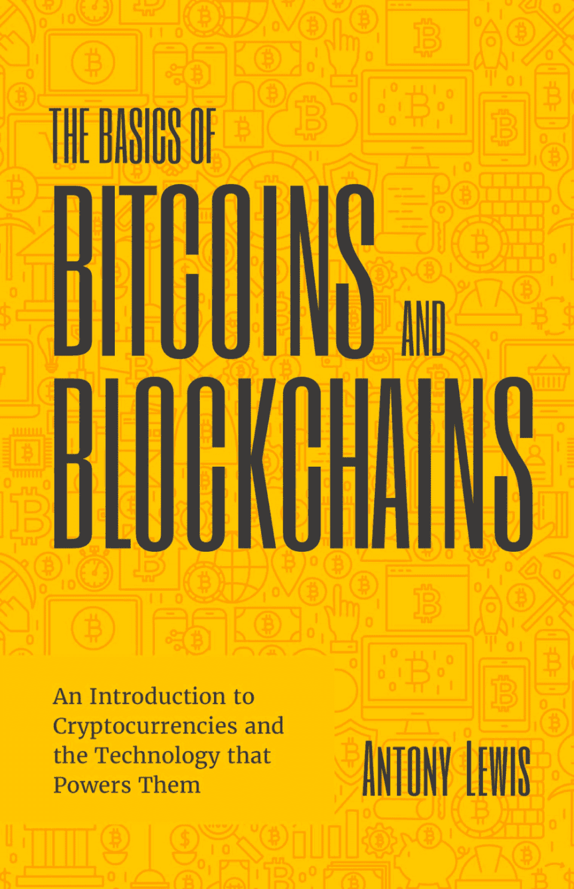](https://geni.us/ArJ52)

*   **作者:**安东尼·刘易斯
*   **发布者:**芒果
*   **阅读水平:**初学者
*   **涵盖的主题:**加密货币、技术和风险管理

许多关于区块链的书声称它们对初学者友好，但却没有以一种让真正的初学者容易理解的方式解释复杂的术语。

从这个意义上来说，比特币和区块链的基础名副其实。这本书有超过一半的篇幅致力于解释我们银行系统的历史，这对于全面理解区块链将如何改变我们的未来是必要的。每一个术语和概念都被完全分解，以便你能真正理解正在讨论的内容。

[检查价格](https://geni.us/ArJ52)

[****](https://geni.us/fVnmD)

*   **作者:**本·阿姆斯特朗
*   出版商:威利
*   **阅读水平:**初学者
*   **涵盖的主题:**比特币、去中心化和金融政策

我认为可以肯定地说，在投资(或完全理解)加密货币及其运行的底层技术方面，许多金融专业人士感到落后了。

这本书是加密货币的一体化指南，包括它的起源、重要性，以及它如何有望彻底改变我们的经济。本·阿姆斯特朗(Ben Armstrong)是一位知名的加密影响者，自 2018 年以来一直在该行业工作。《追赶加密》有望成为 2023 年最畅销的区块链书籍之一。

[检查价格](https://geni.us/fVnmD)

[**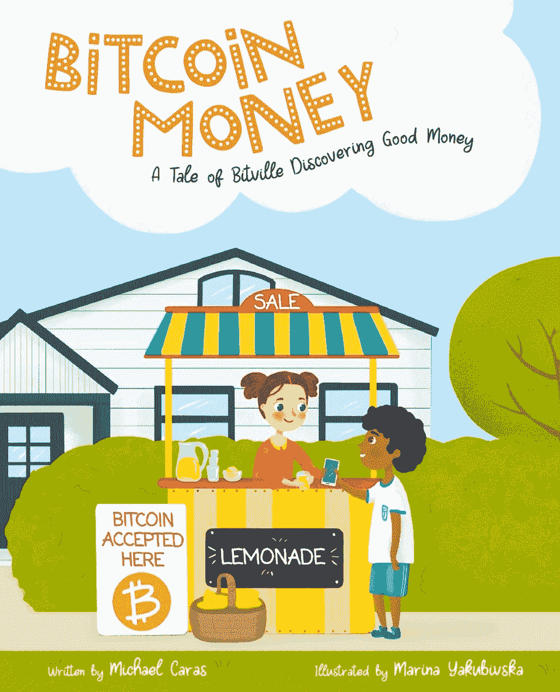**](https://geni.us/CmZwo)

*   **作者:**迈克尔·卡拉斯和玛丽娜·雅库比夫斯卡
*   **出版商:**自行出版(迈克尔·卡拉斯)
*   **阅读水平:**初学者(适合儿童)
*   **涵盖的主题:**数字货币和比特币

比特币货币无疑是关于区块链和加密货币的最独特的书籍之一。

这是一个关于住在一个叫“比特维尔”的小镇的孩子们想出了一个互相交易的方法的故事。对于父母可能在该行业工作的儿童来说，这是一本完美的书——尽管一些成年人肯定会从这本“像我 5 岁一样解释”比特币、加密货币和区块链的介绍中受益。

[检查价格](https://geni.us/CmZwo)

[**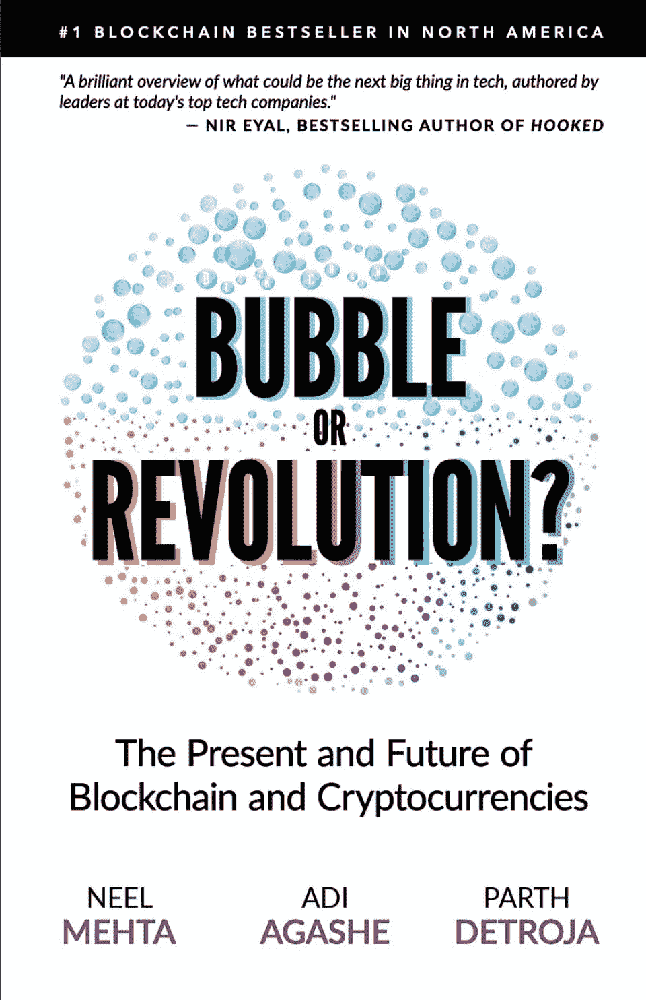**](https://geni.us/RA5j67K)

*   作者: Aditya Agashe，Neel Mehta 和 Parth Detroja
*   发布者:扫雷器风险投资公司
*   **阅读水平:**初级/中级
*   **涵盖的主题:**公共与私有区块链、加密货币和去中心化技术

任何读过多本区块链书籍的人(嗨，是我)都知道，围绕这个话题的信息可能会有点重复。除了区块链概念的一般概述，这本书包括一些令人惊讶的独特的案例研究，故事，和每个特定主题背后的应用场景。

《区块链泡沫或革命》(Blockchain Bubble or Revolution)由来自硅谷的一个领导小组撰写，是那些在学校研究数字金融或想要建立强大知识源泉的人的完美书籍。

[检查价格](https://geni.us/RA5j67K)

**要成为一名真正的区块链专家，你应该考虑参加经济学人的课程:**

**[Fintech 与金融的未来。](https://getsmarter.sjv.io/c/2890636/1384142/13499)**

[**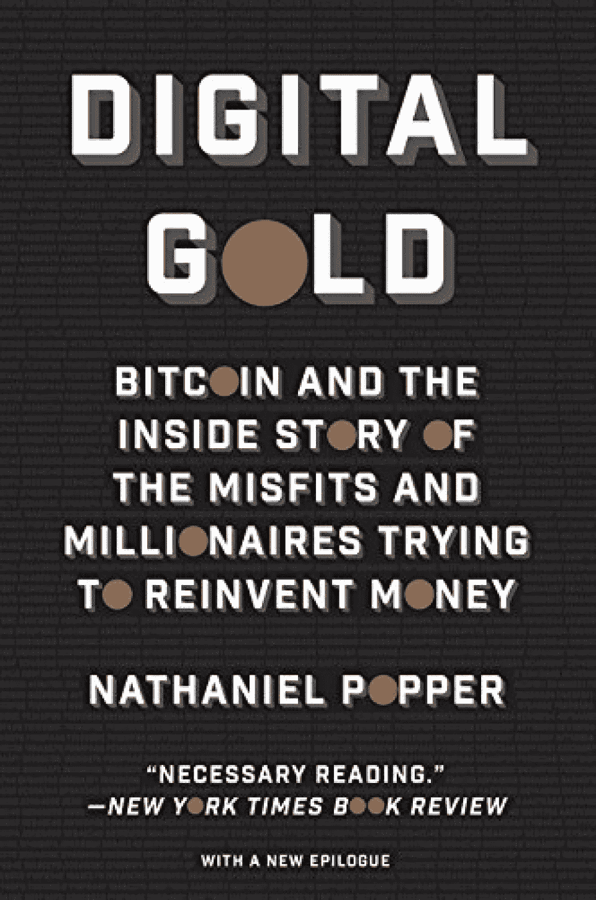**](https://geni.us/hq4q)

*   **作者:**纳撒尼尔·波普尔
*   出版商:哈珀
*   **阅读水平:**初级/中级
*   **涵盖的主题:**加密货币和犯罪

你喜欢恐怖片吗？如果是这样的话，你可能想读一读 Digital Gold。虽然这本书不适合任何希望投资加密货币的人，但它确实提供了一个有趣的关于加密货币演变的视角。

作者以一种让你感觉像在调查犯罪的方式写下了比特币的历史——包括大牌加密先驱对这个如今蓬勃发展的行业的黑幕的第一手详细描述。

[检查价格](https://geni.us/hq4q)

[**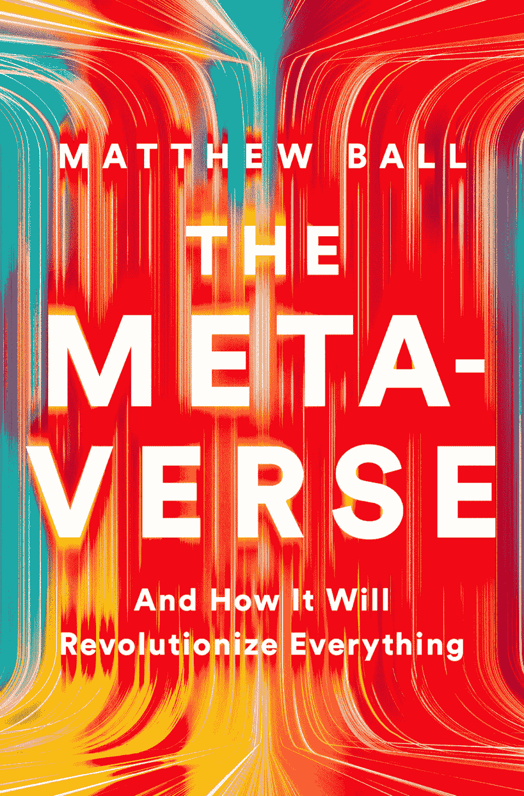**](https://geni.us/G434w)

*   **作者:**马修·波尔
*   **发布者:** Liveright
*   **阅读水平:**初级/中级
*   **涵盖的主题:** Web3、NFTs 和元宇宙的应用

马修·鲍尔以其围绕元宇宙的深度论文而闻名，他写了这本书作为元宇宙基金会的入门指南。

我在科技界注意到，没有两个关于元宇宙的定义是相同的，所以请记住，这本书是基于作者自己对媒体的定义。他分享了他的个人想法，如它将如何建造，谁将控制它，以及我们何时可以看到它成为现实。

它在关于区块链的最佳书籍名单中赢得一席之地，因为它解决了元宇宙的挑战，包括区块链的作用，Web3 和 NFTs。

[检查价格](https://geni.us/G434w)

[**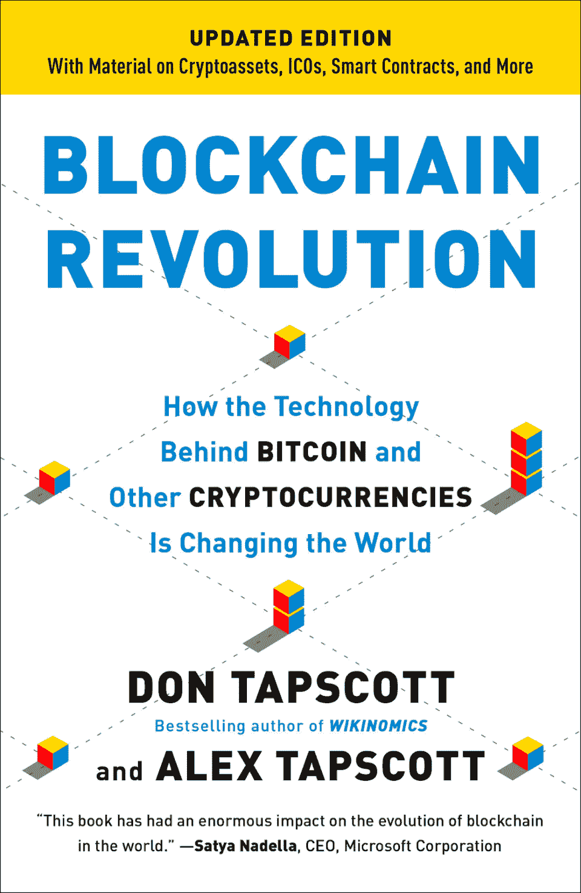**](https://geni.us/9Jq34)

*   **作者:**唐·塔斯考特和亚历克斯·塔普斯科特
*   **出版商:**作品集
*   **阅读水平:**初级/中级
*   **涵盖的主题:**加密资产、Web3 和智能合约

区块链革命为我们目前所知的互联网向我们通常称为 Web3 的区块链互联网的转变提供了一个令人耳目一新的视角。

它非常诚实地描述了当前的金融垄断(及其陈旧的原则)是如何受到快速变化的技术的挑战的。这是一本很棒的书，适合那些过去读过关于区块链的书，并且想了解更少关于投资和更多关于未来的人。

作者是最有影响力的商业理论家之一唐·塔斯考特和他的儿子唐·塔斯考特，他是区块链一家建筑咨询公司的首席执行官。他们的热情和对区块链的了解为技术的未来提供了实用有效的指导。

[检查价格](https://geni.us/9Jq34)

[**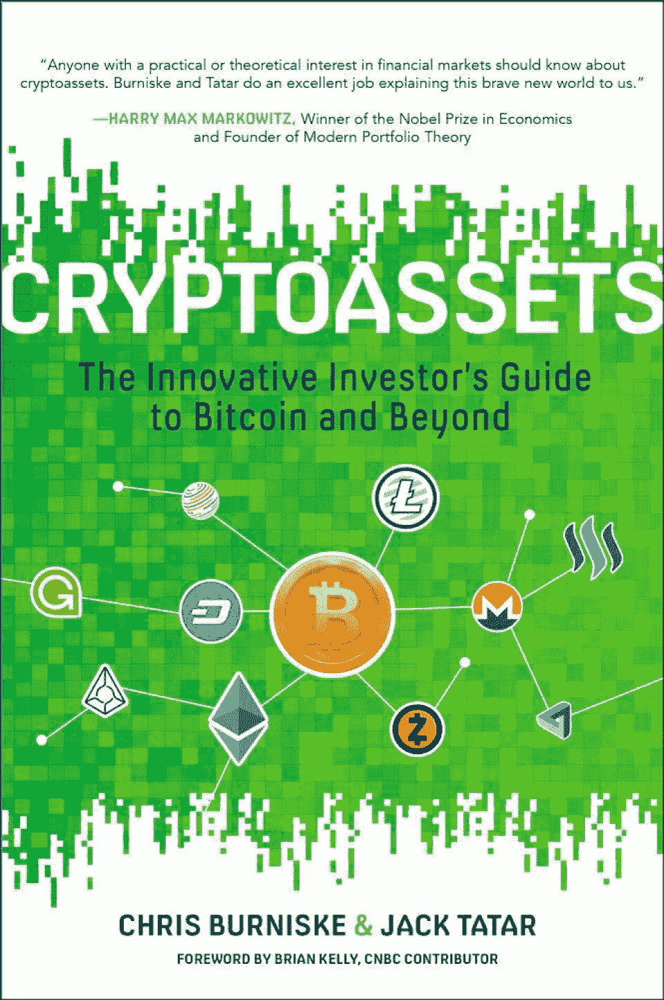**](https://geni.us/tuAv)

*   **作者:**杰克·塔塔尔和克里斯·伯尼斯克
*   出版商:麦格劳·希尔，第一版
*   **阅读水平:**初级/中级
*   涵盖的主题:投资组合管理、历史背景和预测

不要让标题迷惑了你——尽管这本书对于想要了解更多关于加密货币和区块链的传统投资者或有经验的金融专业人士来说是理想的，但它写得如此清晰简洁，即使是初学者也能理解。

作者简要概述了加密资产背后的历史，描述了什么是区块链，并介绍了当今市场上的各种货币。这不是一本技术性很强的书，而是对这个领域的一个很好的介绍。

[检查价格](https://geni.us/tuAv)

[**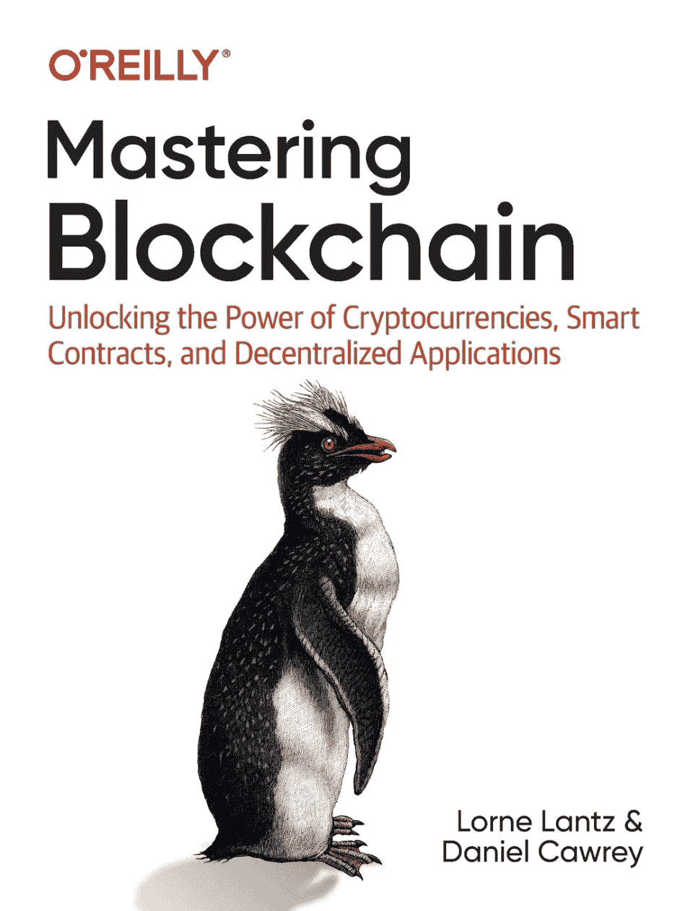**](https://geni.us/oRBKa3f)

*   **作者:**洛恩·兰茨和丹尼尔·考瑞
*   **出版商:**奥莱利媒体，第一版
*   **阅读水平:**中级
*   **涵盖的主题:**比特币、以太坊和犯罪

如果你想深入了解区块链技术，这本书是最好的起点之一。

这本书由两位在该领域工作了十年的区块链专家撰写，涵盖了区块链、加密货币和智能合约背后的各种想法。对于那些正在决定是否投资该行业或想要获得该主题知识基础的人来说，这是理想的读物。

[检查价格](https://geni.us/oRBKa3f)

**为了真正提升你的知识水平，你也可以参加这个:**

麻省理工学院媒体实验室的加密货币课程。

[**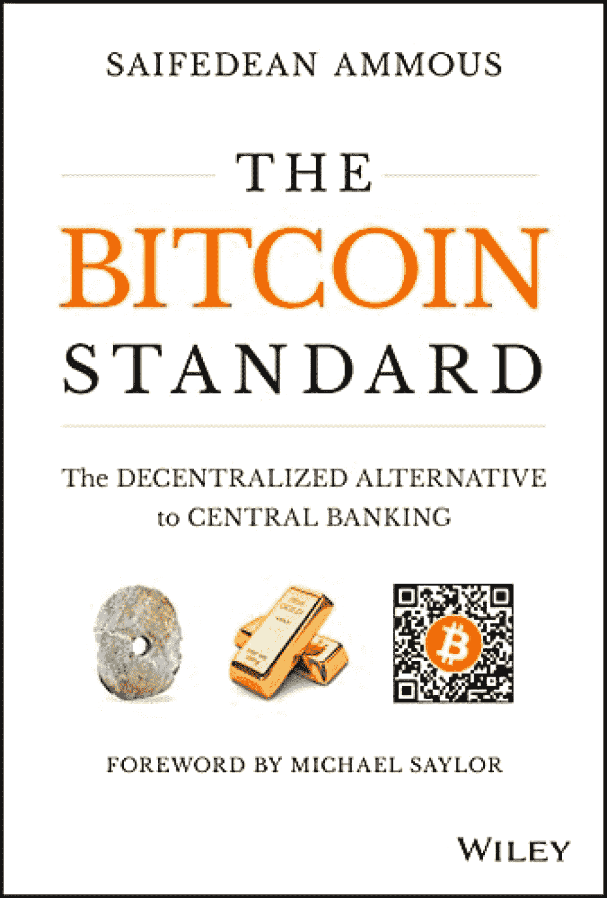**](https://geni.us/tqrV)

*   **作者:**Saifedean ammus
*   出版商:威利出版社，第一版
*   **阅读水平:**中级
*   **涵盖的主题:**比特币、历史和未来

这本书的重点更多的是我们当前金融体系的演变(以及不可避免的灭亡)，而不是比特币/区块链。然而，它仍然被认为是最好的区块链书籍之一，因为它揭示了一个事实，即加密货币可能是我们货币问题的解决方案。

作者毫无歉意地呼吁经济犯罪，争论各种政府的方式，并提供了一个详细的中央银行的历史帐户。对于任何对经济学感兴趣的人来说，这都是一本很好的读物。

[检查价格](https://geni.us/tqrV)

[**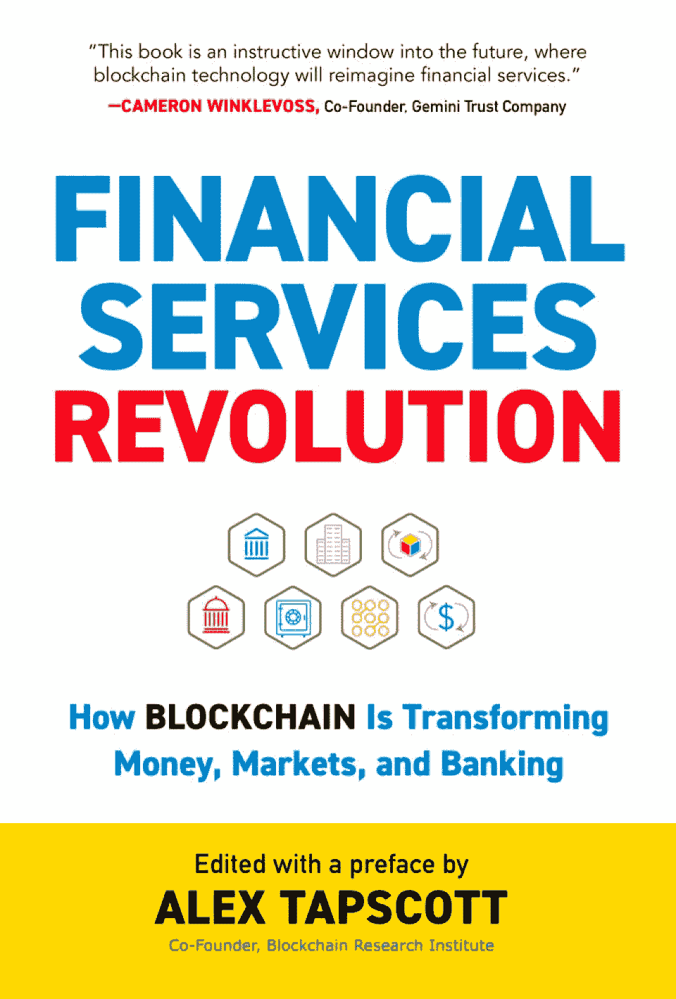**](https://geni.us/ytUg9)

*   **作者:**亚历克斯·塔普斯科特
*   **出版商:**巴洛出版社
*   **阅读水平:**中级/高级
*   **涵盖的主题:**金融行业和合规

这本书是 Don 和 Alex Tapscott 的区块链革命的续集，面向那些希望了解区块链对金融业的影响以及它将如何影响未来的人。

每章包含来自一些世界顶级区块链专家的贡献，涵盖的主题从开放金融、DeFi 和 Libra，到法规和合规性更具争议的一面。

[检查价格](https://geni.us/ytUg9)

[**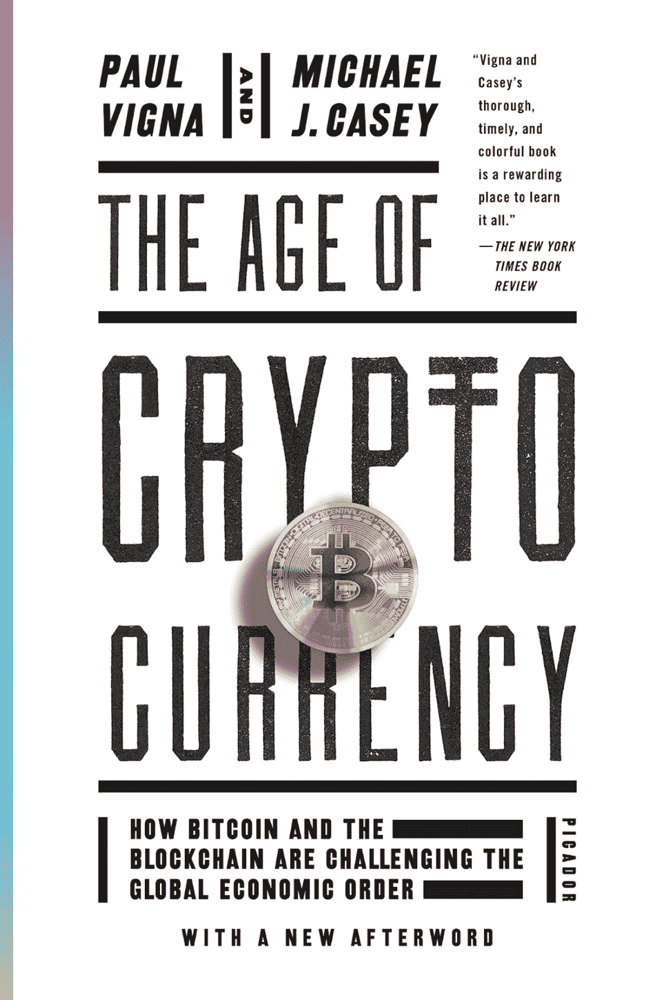**](https://geni.us/rqYQsZ)

*   **作者:**保罗·维格纳和迈克尔·j·凯西
*   **出版商:**皮卡多
*   **阅读水平:**中级/高级
*   **涵盖的主题:**网络经济、加密货币和历史

这本书经过精心研究，对加密货币和区块链的正反两方面进行了深入和公正的研究。

我不会向以前对加密货币知之甚少或一无所知的人推荐这本书，因为这本书花较少的时间解释加密的基础知识，而花更多的时间探索加密背后的技术、影响和问题。然而，对于那些对数字金融行业有点怀疑的人来说，这是最好的区块链书籍之一。

[检查价格](https://geni.us/rqYQsZ)

## **结论**

我们不能肯定地说，有一个区块链的书，涵盖了你需要知道的关于这个话题的一切。这份清单上的每本书都提供了自己的定义、历史叙述和对未来的预测。你甚至会发现不同作者的不同观点和信息。

无论你是试图第一次了解加密货币，还是寻找对数字金融世界的新见解，我们相信这些区块链书籍将为你提供独特的最新视角。

有我们错过的最喜欢的书吗？请在下面的评论中告诉我们。

想成为区块链专家吗？阅读我们对[最佳加密货币和区块链教程](https://hackr.io/blog/best-cryptocurrency-blockchain-tutorials)的总结，其中包括对区块链及其背后技术的深入解释。

对区块链提供的强大商业应用感兴趣？试试这个 5 周的课程:

**[区块链商业](https://getsmarter.sjv.io/c/2890636/1143774/13499)**

## **常见问题解答**

#### **1。可以从书本上学习投资 Crypto 吗？**

书籍是学习如何投资加密货币的绝佳方式，尤其是对于那些对市场了解不多的人来说。然而，你至少需要阅读几本书，以便对有关 crypto 的术语、历史和未来预测有一个坚实的理解。

除了这个列表中提到的关于区块链的书籍，你可以阅读我们的关于加密货币的最佳书籍列表，以了解更多关于加密的知识，并最终做出明智的投资决策。

#### **2。买 Crypto 前应该先了解区块链的工作原理吗？**

在投资任何东西之前，你都应该考虑它是否符合你的投资组合目标和风险状况——在涉及加密货币时尤其如此。市场波动很大，需要特别考虑。

为了理解加密货币以及最终数字金融世界的工作原理，你需要了解区块链。如果你想进一步拓展你的知识面，请阅读我们对区块链顶级课程和教程的深入比较。