# 2023 年最值得学习的 10 大区块链课程【排名】

> 原文：<https://hackr.io/blog/best-blockchain-courses>

区块链技术仍然是相当新的，但它的受欢迎程度逐年上升。虽然它是作为比特币等货币的金融分类账而创建的，但它已经发展成了很多。这项技术为各种商业和想法提供了一个去中心化的系统。

供应链、公用事业、医疗保健、政府和商业都与基于区块链的应用程序联系在一起。因此，对于那些愿意学习区块链技术的人来说，有很大的机会。

幸运的是，有几个区块链课程可供选择。在这里，我们讨论最受欢迎和最好的[区块链课程和教程](https://hackr.io/tutorials/learn-blockchain)。如果你对[区块链编程](https://hackr.io/blog/blockchain-programming-beginners-guide)完全是个新手也没关系。

首先，我们提供了一个区块链顶级课程的汇总列表，然后再详细讲解。

## **2023 年 10 大最佳区块链课程**

## **2023 年一门区块链课程值得吗？**

区块链发展课程让你为现在科技领域最热门的行业之一做好准备。它将教你如何推出区块链，以及如何开发智能合同。这很值得学习，尤其是因为工作机会非常多。

全球区块链市场预计将从 2023 年的 71.8 亿美元增长到 2029 年的 1638.3 亿美元。参加区块链课程会让你在迅速发展的网络 3 就业市场中抓住机遇。

## **最佳区块链课程**

[**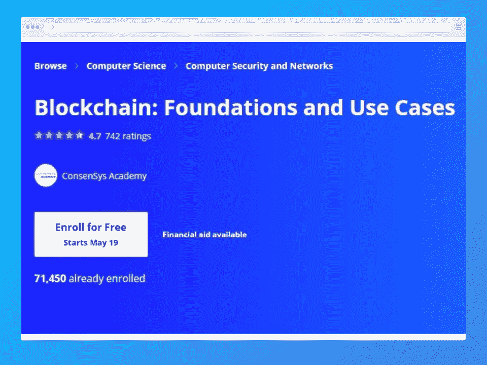**](https://coursera.pxf.io/NKv9ob?subId3=blog%2Fbest-blockchain-c_amcid-FQANsigleOigEigbszJ3A)

| **课程信息** | **课程大纲** |
| **先决条件:**无**难度:**初学者**时长:** 16 小时**费用:**免费 | 区块链基础

*   哈希函数和密码学
*   区块链和区块
*   公钥签名和加密
*   链、网络和节点
*   共识和信任框架
*   加密货币代币
*   智能合同
*   资产跟踪
*   供应链
*   Coursera 上的区块链:基础和用例课程对于非开发人员和希望深入了解区块链理工大学基础知识的开发人员来说都是理想的选择。该课程由区块链行业的知名企业 ConsenSys 提供。它还将介绍分散化的哲学概念及其在应用程序开发中的重要性。

 |

这个项目的第一课包括区块链基础知识和它所使用的技术。后来，它深入研究以太坊和比特币，同时向学生介绍下一代区块链的重要性。最好的部分是，借助真实的例子来解释这些概念。这意味着你会对实际的商业问题有一个很好的了解。

**[查看课程](https://coursera.pxf.io/NKv9ob?subId3=blog%2Fbest-blockchain-c_amcid-i2iYrZOxrOFEqsm2pbOi7)**

[****](https://coursera.pxf.io/vn9P1y?subId3=blog%2Fbest-blockchain-c_amcid-zZmIINqbANQVVIm2rOFlb)

**课程信息**

| **课程大纲** |  |
| **先决条件:**了解一门[编程语言](https://hackr.io/blog/what-is-programming-language)；面向对象设计、命令行界面、HTML、javascript 和 web 应用程序的基本思想。

*   **难度:**中级
*   **持续时间:** 4 个月
*   **费用:**免费
*   区块链基础知识

 | 智能合同

*   可靠性、密码学、比特币和以太坊
*   Remix IDE
*   MetaMask Client
*   块菌 IDE
*   分散应用
*   这个区块链专业化课程的重点是最关键的区块链概念，足以让你在该行业运行。该课程非常适合希望学习设计、部署、编码和执行智能合同的程序员。
*   该计划还详细概述了区块链生态系统，涵盖了各种挑战和区块链平台。此外，您还将深入了解其他去中心化模型，如 Hashgraph 和 IPFS。你会有大量的实践练习和作业来测试你的能力。

 |

**[查看课程](https://coursera.pxf.io/vn9P1y?subId3=blog%2Fbest-blockchain-c_amcid-VgmZ7Y2rrMeEgFZVzPAZI)**

[**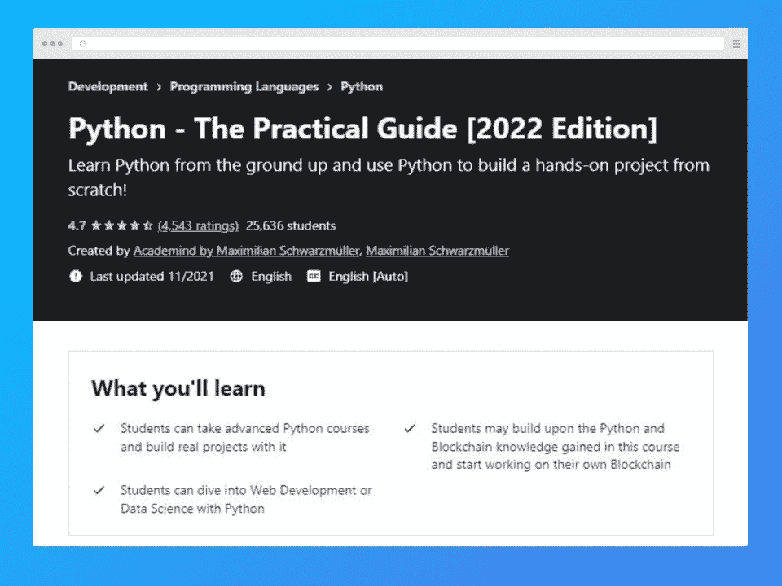**](https://click.linksynergy.com/deeplink?id=Qouy7GhEEFU&mid=39197&murl=https%3A%2F%2Fwww.udemy.com%2Fcourse%2Flearn-python-by-building-a-blockchain-cryptocurrency%2F&u1=blog%2Fbest-blockchain-courses_amcid-EYZ6U63bsQxioQozVPe37)

**课程信息**

**课程大纲**

|  | **先决条件:**无 |
| **难度:**初学者

*   **持续时间:** 17.5 小时
*   **费用:**50 美元
*   区块链简介
*   Python 简介

 | 数据类型和 REPL

*   变量、字符串和列表
*   循环和条件句
*   复杂的数据结构
*   [哎呀](https://hackr.io/blog/oops-concepts-in-java-with-examples)
*   处理错误和 HTTP 请求
*   排除故障
*   在本区块链课程中，您将了解 Python 和区块链技术，包括使用 Python 构建加密货币和区块链的成熟方法。你还将完成一项真实世界的作业来丰富你的作品集。
*   这个项目对于那些想学习他们的第一门编程语言的人来说是很好的。它还提供了关于执行配置和设置的指导。
*   **[查看课程](https://click.linksynergy.com/deeplink?id=Qouy7GhEEFU&mid=39197&murl=https%3A%2F%2Fwww.udemy.com%2Fcourse%2Flearn-python-by-building-a-blockchain-cryptocurrency%2F&u1=blog%2Fbest-blockchain-courses_amcid-3NpExUgPBxxezNizppF7J)**

 |

[**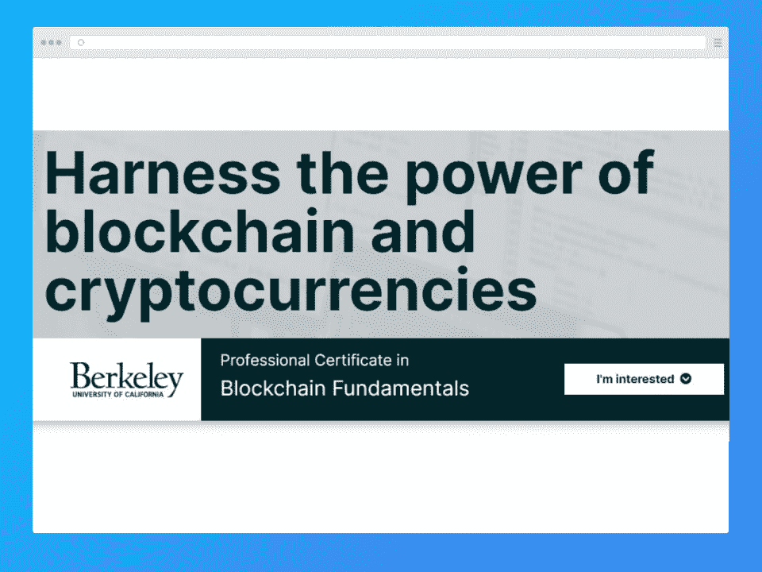**](https://www.awin1.com/cread.php?awinmid=6798&awinaffid=428263&ued=https%3A%2F%2Fwww.edx.org%2Fprofessional-certificate%2Fuc-berkeleyx-blockchain-fundamentals)

**课程信息**

**课程大纲**

| **先决条件:**无 | **难度:**初级-高级 |
| **持续时间:** 3 个月

*   费用:198 美元
*   比特币
*   加密货币
*   区块链技术

 | 区块链架构

*   分散应用
*   比特币替代品
*   这个 edX 区块链课程教你这个主题的技术和非技术方面，从探索生态系统到区块链的中心思想和技术。它还涵盖了区块链技术功能的机制，这将有助于您制定不同的假设和知情的模型。
*   课程的其他领域包括加密货币监管、未来范围和更广泛的影响。此外，本课程提供实践练习来测试知识和技能。
*   **[查看课程](https://www.awin1.com/cread.php?awinmid=6798&awinaffid=428263&ued=https%3A%2F%2Fwww.edx.org%2Fprofessional-certificate%2Fuc-berkeleyx-blockchain-fundamentals)**
*   [**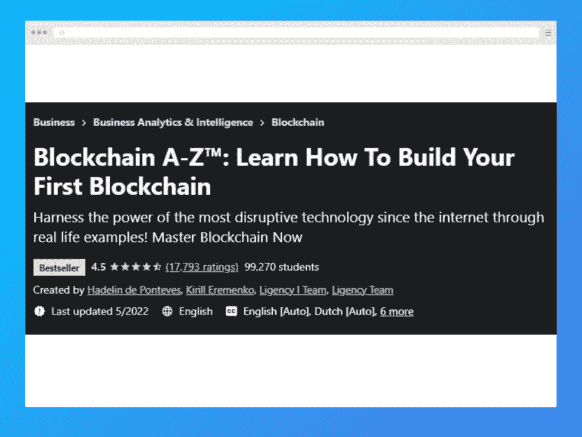**](https://click.linksynergy.com/deeplink?id=Qouy7GhEEFU&mid=39197&murl=https%3A%2F%2Fwww.udemy.com%2Fcourse%2Fbuild-your-blockchain-az%2F&u1=blog%2Fbest-blockchain-courses_amcid-BBrEYie3prNZbsAqpF6AO)

 |

**课程信息**

**课程大纲**

**先决条件:**Python 和数学的基础知识

**难度:**初学者

| **持续时间:** 14.5 小时 | **费用:**50 美元 |
| 区块链反应加密货币交易智能合同创建这个区块链课程教你如何建立你的第一个区块链。您将学习使用该技术创建高级应用程序。本教程有助于获得使用区块链理工加速的实践经验。 | 如果你主要关心的是获得实践技能，那么这个 Udemy 学习计划是达到这个目的的最佳选择之一。它还涉及智能合约，这是该行业的重要组成部分。

*   **[查看课程](https://click.linksynergy.com/deeplink?id=Qouy7GhEEFU&mid=39197&murl=https%3A%2F%2Fwww.udemy.com%2Fcourse%2Fbuild-your-blockchain-az%2F&u1=blog%2Fbest-blockchain-courses_amcid-expEbUEOBJAFrF7ZqrsVO)**
*   [**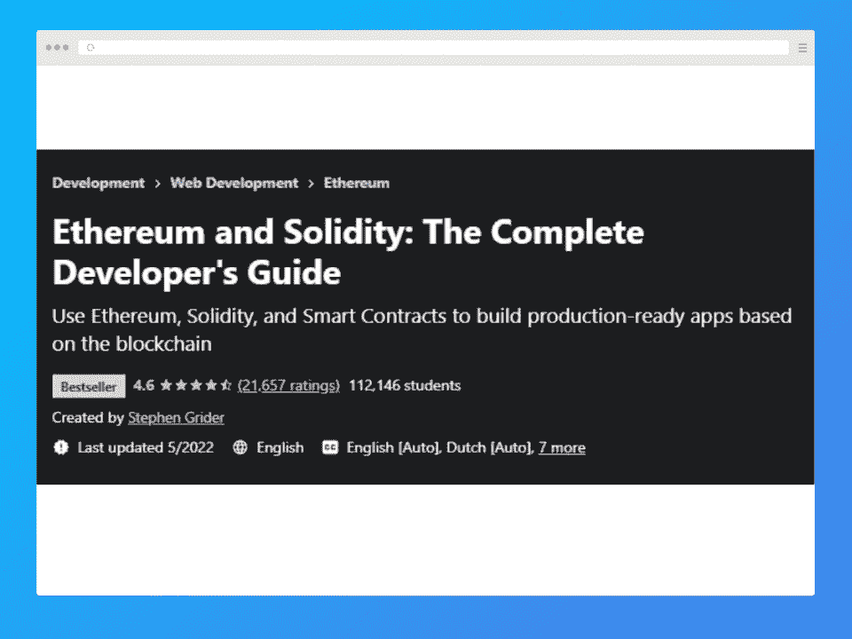**](https://click.linksynergy.com/deeplink?id=Qouy7GhEEFU&mid=39197&murl=https%3A%2F%2Fwww.udemy.com%2Fcourse%2Fethereum-and-solidity-the-complete-developers-guide%2F&u1=blog%2Fbest-blockchain-courses_amcid-7iiz7sOxPQZ6IBApsMbMo)
*   **课程信息**

 |

**课程大纲**

**必备:**NPM 和 Javascript 基础

**难度:**中级-高级

**持续时间:** 24 小时

| **费用:**50 美元 | 以太坊 |
| 可靠的智能合同封锁时间数组、映射和结构以太坊应用架构 | 活动合同设计

*   以太坊项目基础设施
*   高级多页前端
*   在这个以太坊和 Solidity 课程中，学生将学习后端和前端编程，同时对智能合约有更好的理解。最初的课程将向您介绍元掩码、语义 UI 和 React。
*   您将了解流行的区块链以太坊和构建专业应用程序的最佳技术。它还涵盖了不同的业务问题。这是最畅销的 Udemy 课程之一。然而，一定要查看以太坊是否有关于课程内容的更新，因为有些课程是很久以前设计的。
*   **[查看课程](https://click.linksynergy.com/deeplink?id=Qouy7GhEEFU&mid=39197&murl=https%3A%2F%2Fwww.udemy.com%2Fcourse%2Fethereum-and-solidity-the-complete-developers-guide%2F&u1=blog%2Fbest-blockchain-courses_amcid-NlzsU62x7Io7FBOz2IJeU)**
*   [**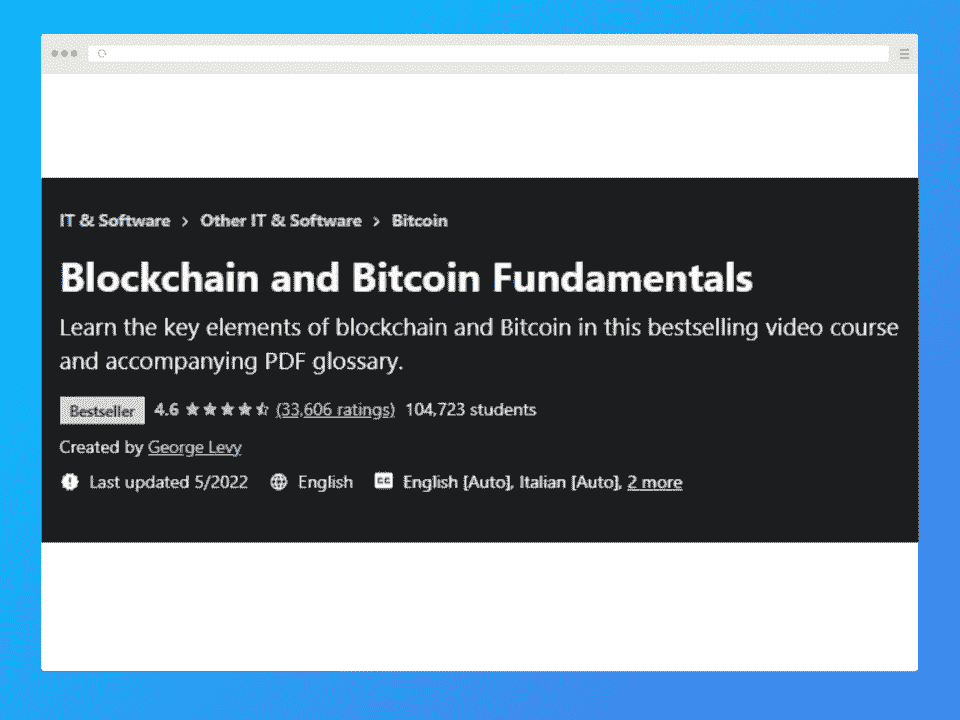**](https://click.linksynergy.com/deeplink?id=Qouy7GhEEFU&mid=39197&murl=https%3A%2F%2Fwww.udemy.com%2Fcourse%2Fblockchain-and-bitcoin-fundamentals%2F&u1=blog%2Fbest-blockchain-courses_amcid-UsIQpeNiPQ3ozieQUQYZg)
*   **课程信息**
*   **课程大纲**

 |

**先决条件:**无

**难度:**初学者

**持续时间:** 3 小时

**费用:**50 美元

| 区块链基础知识 | 比特币 |
| 加密货币数字代币比特币和区块链的关系区块链的未来 | 另一个畅销课程是 Udemy 上的区块链和比特币基础课程，该课程由屡获殊荣的讲师乔治·利维教授。这门课程让学生能够熟练掌握比特币的基础知识。

*   该课程涵盖数字代币、区块链基本面、智能合约、比特币、加密货币和网络。您还将了解比特币挖矿，以及围绕比特币和区块链的误解。
*   **[查看课程](https://click.linksynergy.com/deeplink?id=Qouy7GhEEFU&mid=39197&murl=https%3A%2F%2Fwww.udemy.com%2Fcourse%2Fblockchain-and-bitcoin-fundamentals%2F&u1=blog%2Fbest-blockchain-courses_amcid-UsIQpeNiPQ3ozieQUQYZg)**
*   **8。** [**成为具有以太坊和坚固性的区块链开发者**](https://click.linksynergy.com/deeplink?id=Qouy7GhEEFU&mid=39197&murl=https%3A%2F%2Fwww.udemy.com%2Fcourse%2Fgetting-started-with-ethereum-solidity-development%2F&u1=blog%2Fbest-blockchain-courses_amcid-JzEAqJemiz3YPNOroQBei)
*   [**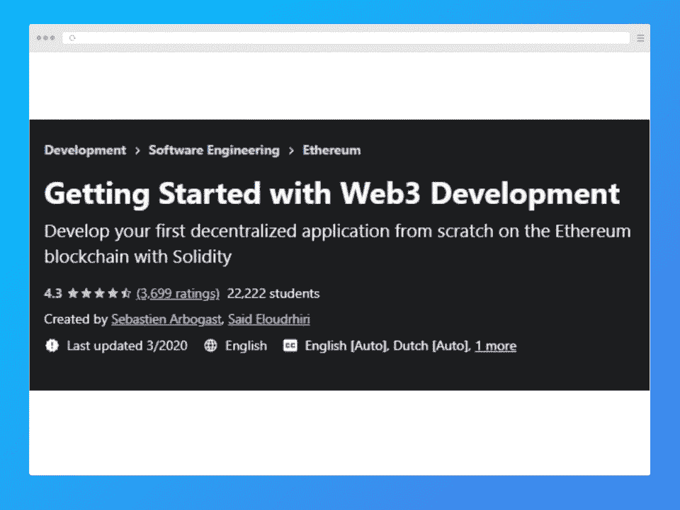**](https://click.linksynergy.com/deeplink?id=Qouy7GhEEFU&mid=39197&murl=https%3A%2F%2Fwww.udemy.com%2Fcourse%2Fgetting-started-with-ethereum-solidity-development%2F&u1=blog%2Fbest-blockchain-courses_amcid-JzEAqJemiz3YPNOroQBei)
*   **课程信息**
*   **课程大纲**

 |

**必备:**软件开发的基本知识和经验

**难度:**中级-高级

**持续时间:** 17 小时

**费用:**50 美元

区块链概述

| 区块链实施 | 三层模型 |
| 不对称密码术Linux 环境设置智能合同部署链表分散应用 | 这是另一个很好的学习如何用以太坊和 Solidity 创建智能合约的区块链课程。课程材料全面且结构合理，有助于建立区块链及相关概念的坚实基础。

*   您还将了解分散式应用程序开发以及不同以太坊实例的部署，包括 main net、private chain、testrpc 和 test chain。
*   **[查看课程](https://click.linksynergy.com/deeplink?id=Qouy7GhEEFU&mid=39197&murl=https%3A%2F%2Fwww.udemy.com%2Fcourse%2Fgetting-started-with-ethereum-solidity-development%2F&u1=blog%2Fbest-blockchain-courses_amcid-VPJs733eIM6UOeq2ieqOz)**
*   [**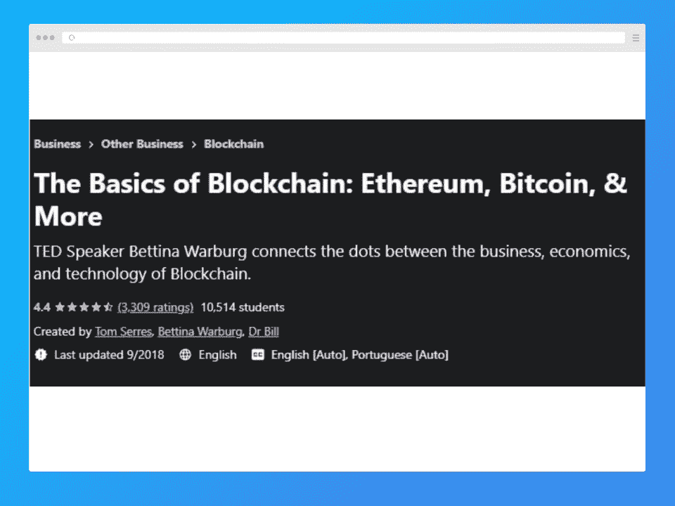**](https://click.linksynergy.com/deeplink?id=Qouy7GhEEFU&mid=39197&murl=https%3A%2F%2Fwww.udemy.com%2Fcourse%2Fthe-basics-of-blockchain%2F&u1=blog%2Fbest-blockchain-courses_amcid-lBZB6zA6mN33UE7i2Nq2F)
*   **课程信息**
*   **课程大纲**
*   **必备:**互联网基础知识。
*   **难度:**初级-高级

 |

**持续时间:** 3.5 小时

**费用:**50 美元

区块链简介

区块链特质

| 智能合同 | 比特币和以太坊的区别 |
| 与经济、技术和商业相关的区块链原则技术进步——详细概述由 Bill 博士、Tom Serres 和 [Bettina Warburg](https://hackr.io/bettina-warburg) 撰写的这个区块链培训项目是 Udemy 上另一个受欢迎的课程。你将了解区块链的技术、商业和经济是如何联系在一起的。该课程还详细概述了区块链理工学院对不同行业和企业的影响。借助商业世界的例子来解释这些概念。 | **[查看课程](https://click.linksynergy.com/deeplink?id=Qouy7GhEEFU&mid=39197&murl=https%3A%2F%2Fwww.udemy.com%2Fcourse%2Fthe-basics-of-blockchain%2F&u1=blog%2Fbest-blockchain-courses_amcid-PeprQZI6YZYE6e7ImoPAP)**

*   [**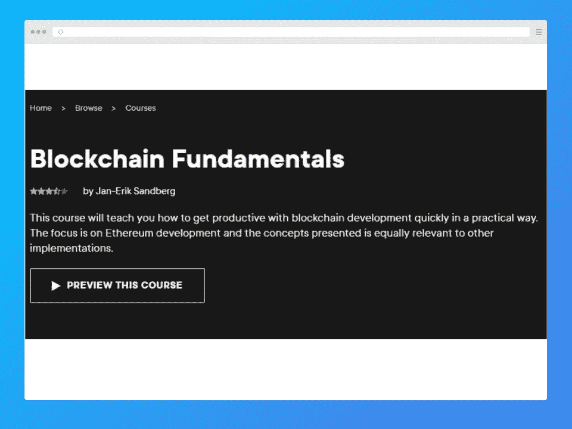**](https://pluralsight.pxf.io/3PE01v?subId3=blog%2Fbest-blockchain-c_amcid-l36JMN7iE6JQzFEgY2xYP)
*   **课程信息**
*   **课程大纲**
*   **先决条件:**对计算机科学、IT 和信息安全有基本的了解
*   **难度:**初学者
*   **时长:** 2 小时 20 分钟

 |

**费用:** $30 包月

区块链基础知识

DAPPS 和以太坊简介

安装和配置

| 智能合同开发 | 该区块链培训课程在 Pluralsight 上提供，深入探讨了区块链的基础知识。通过这个课程，Jan-Erik 解释了区块链和比特币之间的关系。学生们还将学习如何建立一个私人的区块链网络。 |
| 本培训课程旨在让学员亲身体验区块链技术的端到端实际应用。它还教授智能合同开发。**[查看课程](https://pluralsight.pxf.io/3PE01v?subId3=blog%2Fbest-blockchain-c_amcid-l36JMN7iE6JQzFEgY2xYP)****奖励课程** |  

*   [**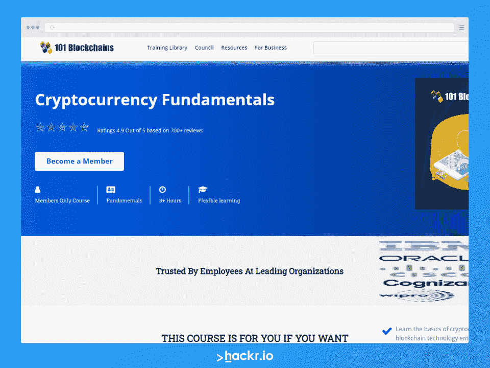**](https://shareasale.com/r.cfm?b=1696402&u=3031482&m=105464&urllink=&afftrack=)
*   **课程概述:**
*   加密货币基础课程是专门为雄心勃勃的专业人士开设的，他们希望缩小接受正规教育和成为世界级企业专家之间的技能差距。本课程不仅将为您提供简单的教育，还将通过实践洞察来理清所有加密货币的概念。
*   **如果你想的话，这个课程适合你:**

 |

了解加密货币的基础知识以及区块链技术支持加密货币的方式

确定加密货币对于传统金融基础设施的价值和相关性

回顾加密生态系统，确定主要参与者、监管进展、隐私影响和应用

## 评估与加密相关的风险以及使用区块链分析进行风险管理的方法

### [查看课程](https://shareasale.com/r.cfm?b=1696402&u=3031482&m=105464&urllink=&afftrack=)

[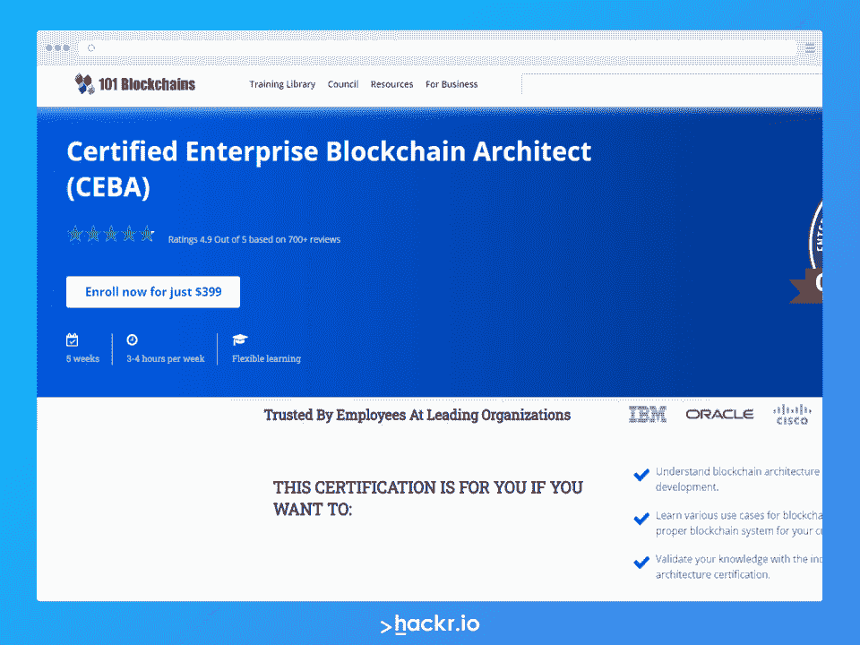](https://shareasale.com/r.cfm?b=1713895&u=3031482&m=105464&urllink=&afftrack=)

**课程概述:**

认证企业区块链架构师(CEBA)认证是一个受欢迎的以工作为中心的区块链证书，特别关注区块链解决方案架构。CEBA 认证是任何对设计区块链系统和解决方案感兴趣的专业人士的最佳选择。

CEBA 认证涵盖了与区块链发展相关的广泛主题。除了区块链架构和开发的基本概念之外，CEBA 认证还侧重于区块链使用案例和为企业需求选择合适的区块链系统。

*   CEBA 认证为那些希望成为专业企业区块链建筑师的人提供了最好的学习资源。
*   **如果你想的话，这个课程适合你::**
*   了解区块链建筑发展等先进理念。
*   了解区块链的各种使用案例，以及如何根据客户需求选择合适的区块链系统。

通过行业领先的区块链建筑认证来验证您的知识。

[查看课程](https://shareasale.com/r.cfm?b=1713895&u=3031482&m=105464&urllink=&afftrack=)

想要展示实用知识的区块链专业人员可以选择追求认证企业区块链专业人员(CEBP)认证。这种专业证书展示了咨询和管理角色所需的技能。

[查看课程](https://shareasale.com/r.cfm?b=1713885&u=3031482&m=105464&urllink=&afftrack=)

该认证提供了对基于区块链的系统的深入了解。它是为希望将区块链解决方案集成到企业系统中的人设计的，讲师指导课程来自区块链委员会。

[查看课程](https://click.linksynergy.com/fs-bin/click?id=jU79Zysihs4&offerid=980864.33&type=3&subid=0)

**结论**

上面列出的顶级区块链课程旨在让学员在处理区块链技术的不同垂直领域时足够高效。你将变得足够熟练，能够与企业高管打交道，并为他们的特定需求提供有效的解决方案。此外，这些培训计划将帮助您获得成为区块链专家所需的正确技能。

*   [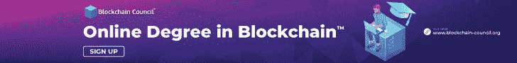](https://click.linksynergy.com/fs-bin/click?id=jU79Zysihs4&offerid=980864.50&subid=0&type=4)
*   **常见问题解答**

*   **1。学习区块链哪个课程最好？**

任何提供区块链技术基础的课程都是好的。上面列出的类都是不错的选择，所以从中挑选一个。

**2。一门区块链课程多少钱？**

如列表所示，最好的区块链开发者课程不一定需要任何费用。但是那些收费的通常要 50 美元左右。

**3。谁可以报读区块链课程？**

任何人都可以报名参加区块链课程。你不需要有很多技术经验，因为很多课程都是假设你是一个完全的初学者来教授的。

## **4。一张区块链证书值得吗？**

区块链证书是值得的，因为它可以快速推进你的发展经验。它会给你一个良好的技术基础，为你进入这个行业做好准备。

**人也在读:**

## **Frequently Asked Questions**

#### **1\. Which Course is Best for Learning Blockchain?**

Any course that offers a good ground in the basics of blockchain technology is good. The classes listed above are all good choices, so pick one from them.

#### **2\. How Much Does a Blockchain Course Cost?**

As the list shows, the best blockchain developer course doesn’t necessarily have to cost anything. But those that do have a fee typically cost around $50.

#### **3\. Who Can Enroll in a Blockchain Course?**

Anyone can enroll in a blockchain course. You don’t need to have a lot of technical experience, as many courses teach assuming you’re a complete beginner.

#### **4\. Is a Blockchain Certificate Worth It?**

A blockchain certificate can be worthwhile in that it can fast forward your development experiences. It’ll give you a good grounding in the basics of the technology and prepare you for the industry. 

**People are also reading:**