# 24 本关于加密货币的最佳书籍:2023 年学习加密

> 原文：<https://hackr.io/blog/best-books-on-cryptocurrency>

加密货币几乎让人感觉很深奥，只有少数拥有科技超能力的人才懂。加密的世界可能很快变得势不可挡，尤其是当面对奇怪的术语和术语，以及每天都冒出来的新硬币时。

但加密货币不一定要令人困惑或势不可挡。

了解加密世界的一些奇妙方式是在线课程、T2 教程或认证。或者，你可以阅读密码专家写的书。

准备好最终进入加密领域了吗？通过我们精心策划的 2023 年加密货币最佳书籍清单来丰富您的知识。请继续阅读，了解我们的最佳选择！

## **2023 年关于加密货币的最佳书籍**

作者:丹尼尔·德雷舍

[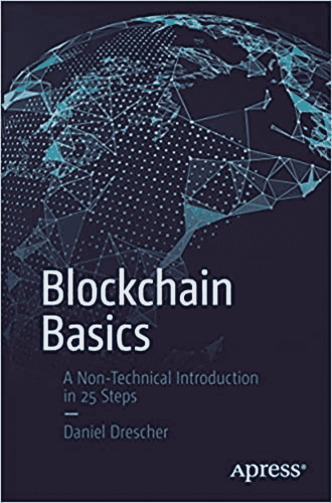](https://www.amazon.com/Blockchain-Basics-Non-Technical-Introduction-Steps/dp/B087YZTMPD/)

如果你是区块链和 T2 加密货币的新手，这是最好的加密货币书籍之一。

在*区块链基础知识:25 步非技术性介绍*中，丹尼尔·德雷舍对加密货币基础进行了深入但对初学者友好的介绍。Drescher 用简单的英语将区块链分解，所以你可以在不知道如何编码的情况下学习一切。

作者在本书中保持了平衡的观点，他解释了加密货币和区块链的好处和局限性。这样，你就不会在对潜在的不利因素毫无准备的情况下被卷入 crypto！

**[在亚马逊上购买](https://www.amazon.com/Blockchain-Basics-Non-Technical-Introduction-Steps/dp/B087YZTMPD/)**

**作者**:安德烈亚斯·m·安东诺普洛斯

[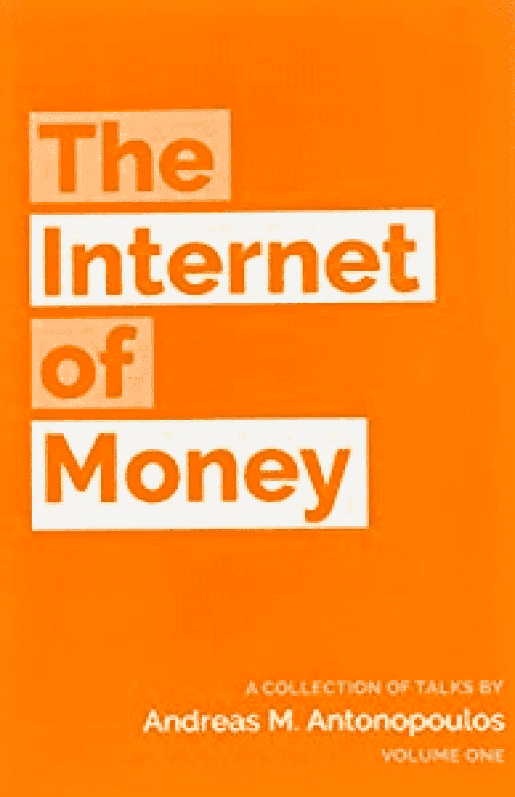](https://www.amazon.com/Internet-Money-Andreas-M-Antonopoulos/dp/1537000454)

《货币的互联网》是一个由三部分组成的系列书籍，密码爱好者应该在他们人生的某个阶段阅读。

Andreas M. Antonopoulos 是尼科西亚大学的教授，他经常谈论经济学、物物交换、贸易和技术中涉及的哲学——当然，都与加密有关。在这些书中，你会发现作者的现场演讲、广播节目和播客的直接转录版本。

这本书是总共三本书中的第一册。你可以在这里找到第二卷**和第三卷***。这三本书都有相同的标题。***

 ****[在亚马逊上购买。](https://www.amazon.com/Internet-Money-Andreas-M-Antonopoulos/dp/1537000454)** **3。** [**比特币标准:中央银行的分散替代**](https://www.amazon.com/Bitcoin-Standard-Decentralized-Alternative-Central-ebook/dp/B07BPM3GZQ)

**作者**:赛菲迪安·阿摩斯

[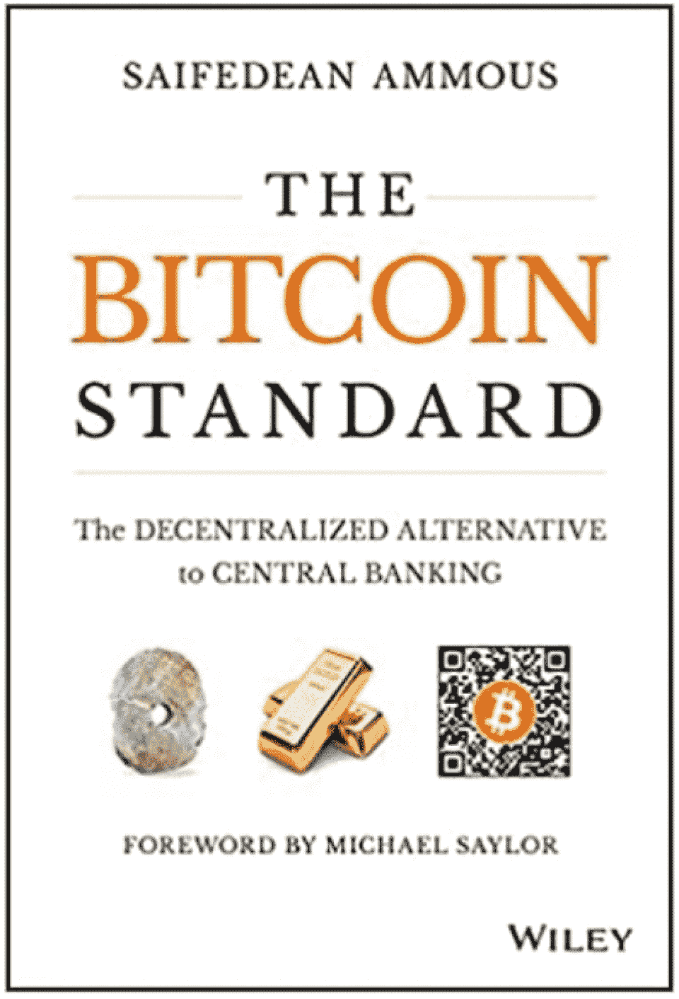](https://www.amazon.com/Bitcoin-Standard-Decentralized-Alternative-Central-ebook/dp/B07BPM3GZQ)

《比特币标准》是一本很好的书，适合那些想了解更多关于加密货币之王的人。

在本书中，作者 Saifedean Ammous 讨论了 BTC 的经济学，其价格是如何确定的，以及是什么赋予了它内在的价值。这本书深入探讨了各种其他主题，讨论了为什么社会可能会走向分散货币的未来。

**[在亚马逊上购买](https://www.amazon.com/Bitcoin-Standard-Decentralized-Alternative-Central-ebook/dp/B07BPM3GZQ)**

**作者** : [比特币集体](https://bitcoincollective.co.uk/about)(丹尼尔·麦克格兰、吉姆·达菲、露西-罗斯·沃克、乔丹·沃克、劳拉·麦康奈尔)

[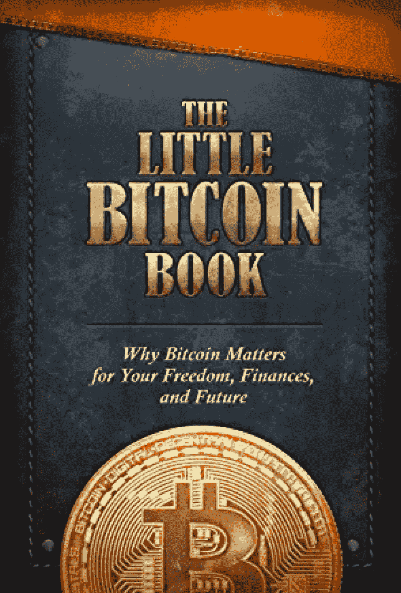](https://www.amazon.com/Little-Bitcoin-Book-Matters-Finances-ebook/dp/B07W957N7T)

比特币集体(Bitcoin Collective)的这本比特币小书包含了五位区块链工程师的专业知识。作者旨在提供一个准确而简洁的比特币功能描述。

如果你对比特币比对任何其他加密货币都更感兴趣，这本书是最好的选择。在阅读的过程中，你会了解到 Satoshi 历史、采矿、区块链，以及到底是什么赋予了比特币价值(经济学)。如果你想从这方面的专家那里了解更多关于比特币的知识，我们推荐这本书。

**[在亚马逊上购买](https://www.amazon.com/Little-Bitcoin-Book-Matters-Finances-ebook/dp/B07W957N7T)**

**作者**:尼克·帕特尔

[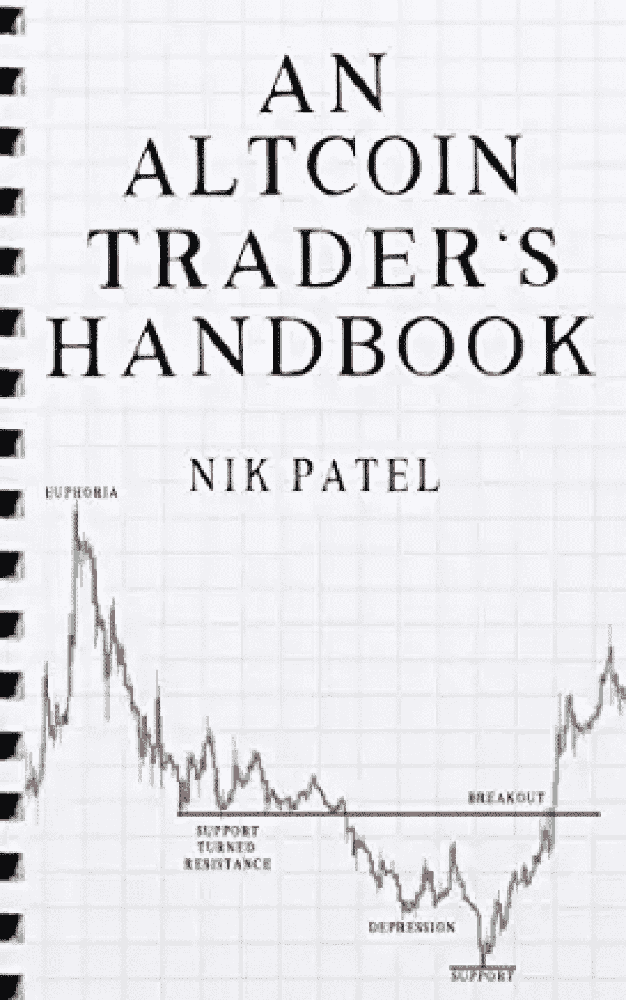](https://www.amazon.com/Altcoin-Traders-Handbook-Nik-Patel-ebook/dp/B07DK8J5XJ)

在一本另类硬币交易者手册中，作者尼克·帕特尔(Nik Patel)回顾了最近的过去——特别是加密货币最广泛的牛市。这里，我们指的是任何非比特币货币(也称为 alt coins)在 2017 年爆发之前的图表和模式。

并非本书中的所有观点在今天都是完全最新的或有效的，但许多智慧可以帮助您制定加密投资策略。

*值得一提的是，另类硬币在加密领域通常被称为“仙股”——由于市场固有的波动性，投资另类硬币的风险非常高。*

**[在亚马逊上购买](https://www.amazon.com/Altcoin-Traders-Handbook-Nik-Patel-ebook/dp/B07DK8J5XJ)**

**作者**:埃拉德·埃尔罗姆

[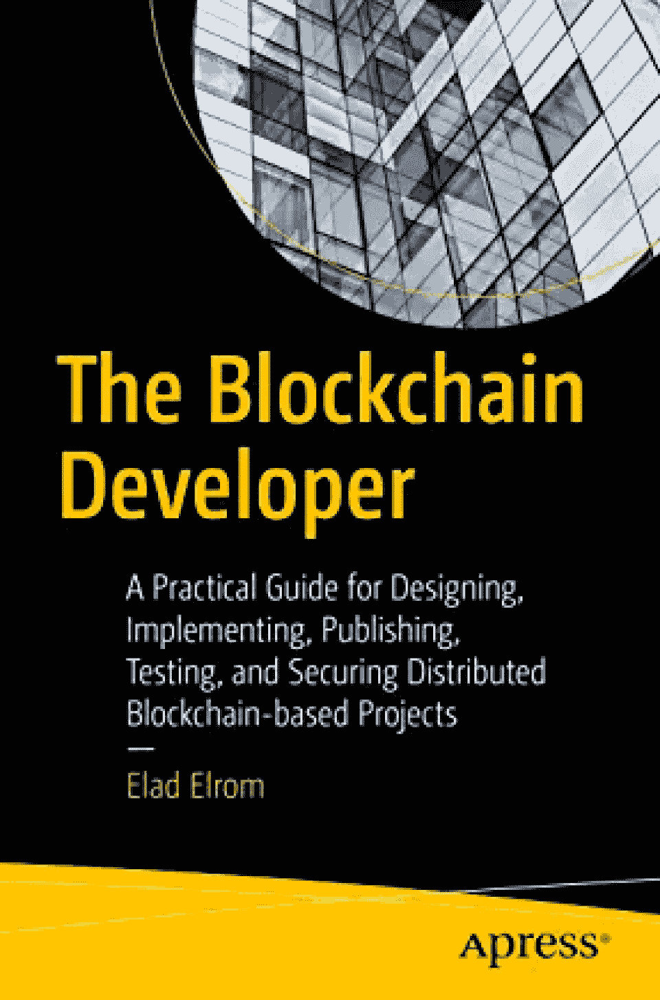](https://www.amazon.com/Blockchain-Developer-Implementing-Distributed-Blockchain-based-ebook/dp/B07VMD99YH/)

Elad Elrom 的区块链开发者专注于为开发者提供良好的阅读。这是关于加密和区块链技术方面的最好的加密货币书籍之一。您将了解区块链技术，其结构，如何创建自己的区块链，等等。

这本书最适合那些有一些编程和编码经验，熟悉更多技术内容的人。

**[在亚马逊上购买](https://www.amazon.com/Blockchain-Developer-Implementing-Distributed-Blockchain-based-ebook/dp/B07VMD99YH/)**

**作者**:瑞安·德罗索

[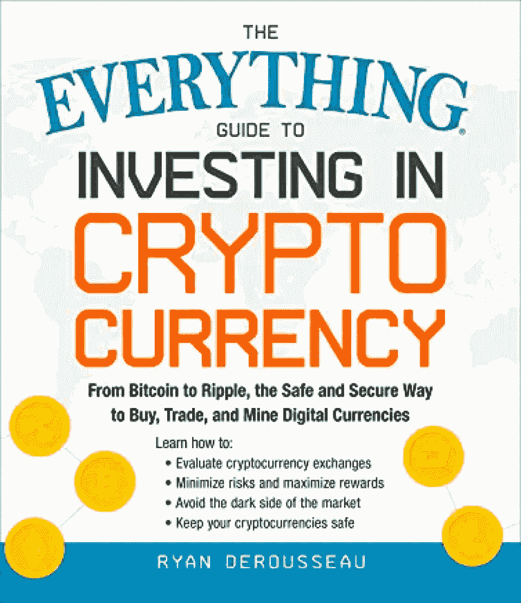](https://www.amazon.com/Everything-Guide-Investing-Cryptocurrency-Everything%C2%AE-ebook/dp/B07GNTLHZN)

这本书当然是加密货币最佳书籍的争夺者，内容符合预期，特别是如果你想作为一个新手从基础开始。

*投资加密货币的一切指南*教你加密的基础知识，加密挖掘如何工作，设置你的加密货币钱包，比特币与 XRP (ripple)等等。在你开始在交易所购买加密软件之前，你会学到你需要知道的一切。

**[在亚马逊上购买](https://www.amazon.com/Everything-Guide-Investing-Cryptocurrency-Everything%C2%AE-ebook/dp/B07GNTLHZN)**

**作者**:颜·普利兹克

[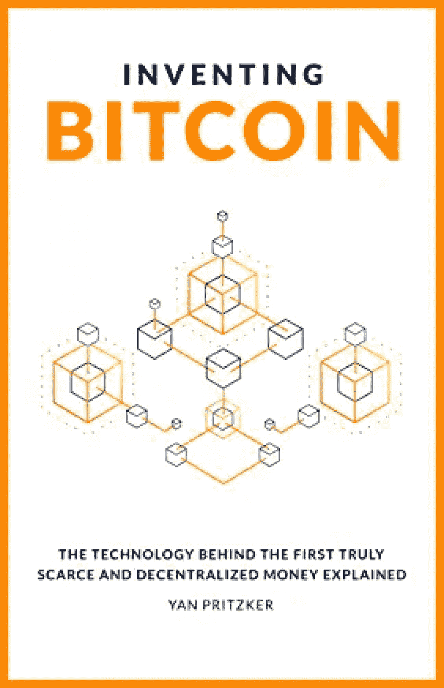](https://www.amazon.com/Inventing-Bitcoin-Technology-Decentralized-Explained-ebook/dp/B07MWXRWNB/)

如果你已经对加密货币有了相当的了解，*发明比特币:第一个真正稀缺的分散货币背后的技术*是一个很好的读物。这是最好的比特币书籍之一，可以帮助你了解比特币的历史及其工作原理。作者 Yan Pritzker 在一个简短但甜蜜的阅读中近距离地观察了 BTC 背后的技术——在短短两个小时内一口气读完！

**[在亚马逊上购买](https://www.amazon.com/Inventing-Bitcoin-Technology-Decentralized-Explained-ebook/dp/B07MWXRWNB/)**

作者:尼尔·梅塔，阿迪·阿加什，帕斯·德特罗哈

[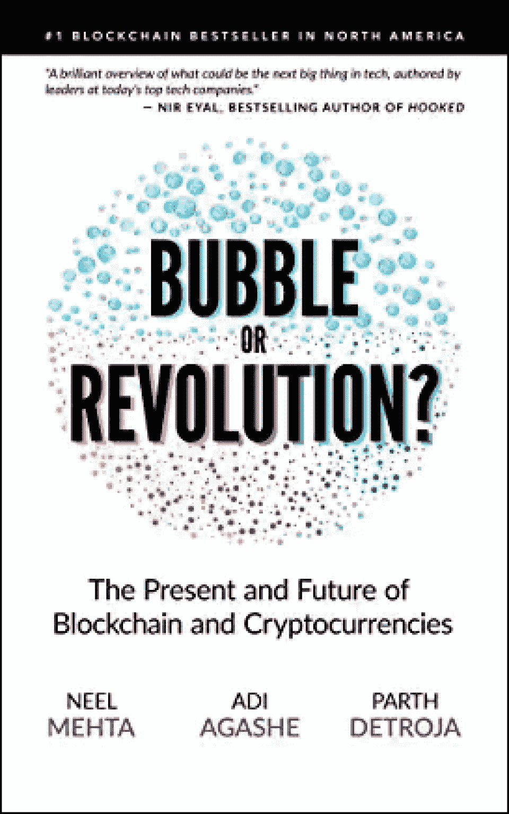](https://www.amazon.com/Blockchain-Bubble-Revolution-Present-Cryptocurrencies-ebook/dp/B07T13GP1Q/)

加密货币可能是一个两极分化的话题。你会发现有些人讨厌加密，有些人喜欢所有与加密和区块链相关的东西。

*区块链泡沫或革命*在关于区块链和密码的讨论中尽可能保持中立。然而，它的三位作者并不回避讨论密码的弱点，给你一个平衡的技术视角。

**[在亚马逊上购买](https://www.amazon.com/Blockchain-Bubble-Revolution-Present-Cryptocurrencies-ebook/dp/B07T13GP1Q/)**

**作者**:本·莫兹里奇

[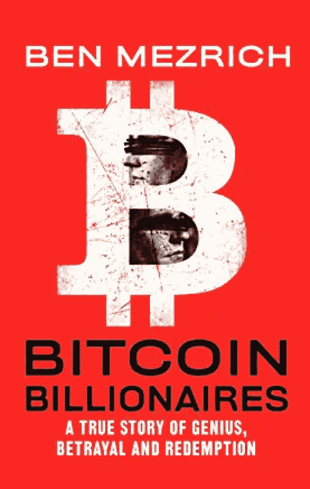](https://www.amazon.com/Bitcoin-Billionaires-Genius-Betrayal-Redemption-ebook/dp/B07GN8HWZW/)

《比特币亿万富翁》是一本有趣的读物，感觉可以改编成电影或电视剧。

在这本书里，你将了解比特币的历史，包括(你猜对了)第一批比特币亿万富翁。你会问，这些亿万富翁可能是谁？他们不是别人，正是脸书成名的文克莱沃斯双胞胎。是的，正是在脸书早期与马克·扎克伯格一决雌雄的那对双胞胎。

这本书最适合那些寻找历史和轻松读物的人，不太适合那些想学习如何投资或与区块链合作的人。

**[在亚马逊上购买](https://www.amazon.com/Bitcoin-Billionaires-Genius-Betrayal-Redemption-ebook/dp/B07GN8HWZW/)**

作者:纳撒尼尔·波普

[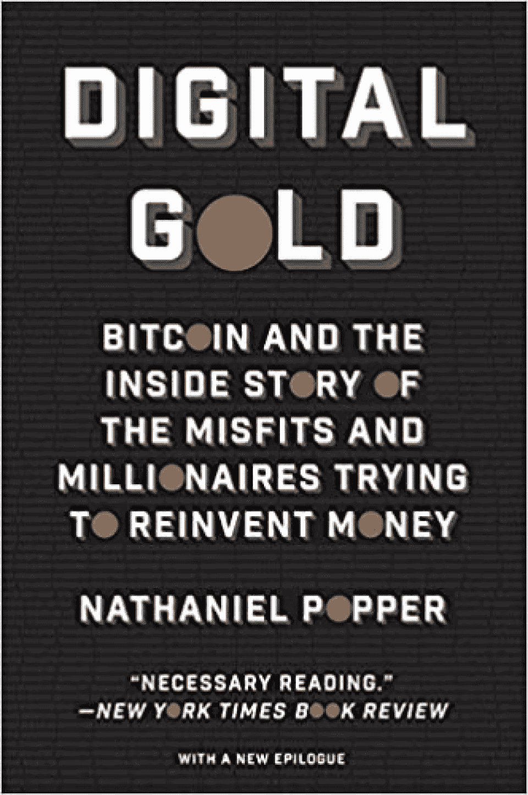](https://www.amazon.com/Digital-Gold-Bitcoin-Millionaires-Reinvent/dp/006236250X)

《数字黄金》由著名的《纽约时报》作者纳撒尼尔·波普撰写。很容易看出波普尔在讲述 BTC 早期时的新闻技巧。

在这本书里，你不一定会学到任何关于区块链或密码的技术知识和技能。然而，你会更深入地了解比特币历史的阴暗部分。

**[在亚马逊上购买](https://www.amazon.com/Digital-Gold-Bitcoin-Millionaires-Reinvent/dp/006236250X)**

作者:杰克·瑞安、巴瑞·亚当斯等。

[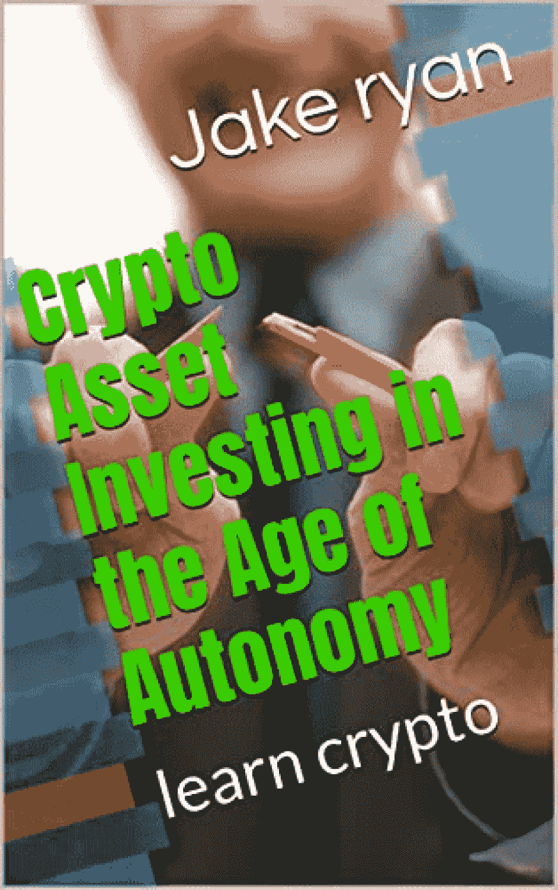](https://www.amazon.com/Crypto-Asset-Investing-Age-Autonomy/dp/B08SSR12NP)

在本书中，作者 Jake Ryan 对加密货币及其如何适应未来提出了一个发人深省而又富有教育意义的观点。它还讨论了加密投资如何适应经济和金融。如果你正在寻找一个简洁的关于加密的观点，这本书是给你的。

**[在亚马逊上购买](https://www.amazon.com/Crypto-Asset-Investing-Age-Autonomy/dp/B08SSR12NP)**

**作者**:安德烈亚斯·m·安东诺普洛斯

[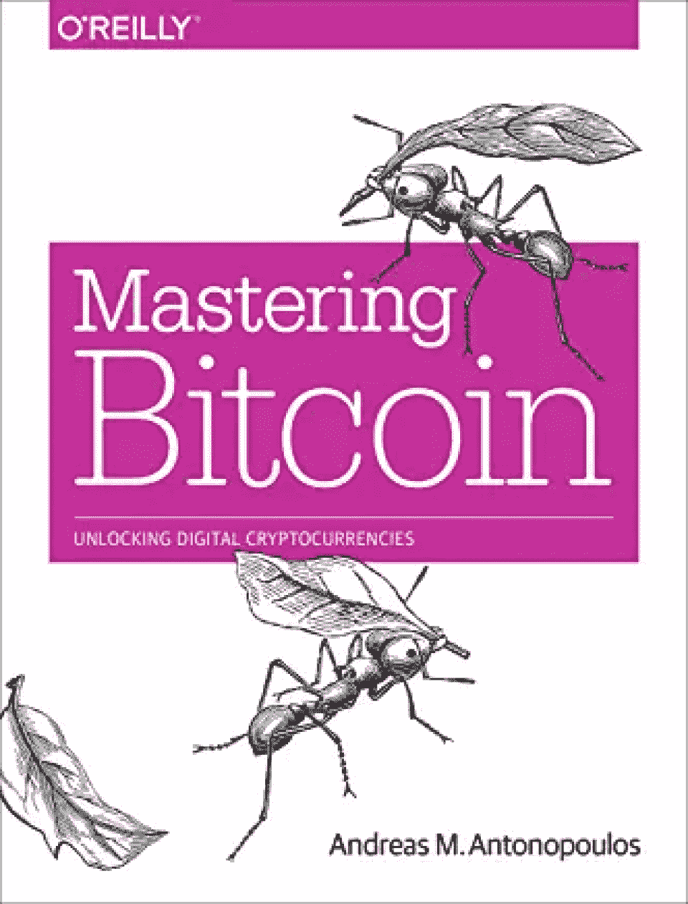](https://www.amazon.com/Mastering-Bitcoin-Unlocking-Digital-Cryptocurrencies/dp/1449374042/)

安德烈亚斯·m·安东诺普洛斯是这份名单上唯一提到两本独立书籍的作者。在这里，他深入研究了比特币和区块链的技术层面，包括比特币的开采、使用以及区块链和比特币的未来。

**[在亚马逊上购买](https://www.amazon.com/Mastering-Bitcoin-Unlocking-Digital-Cryptocurrencies/dp/1449374042/)**

**作者**:马修·雷辛

[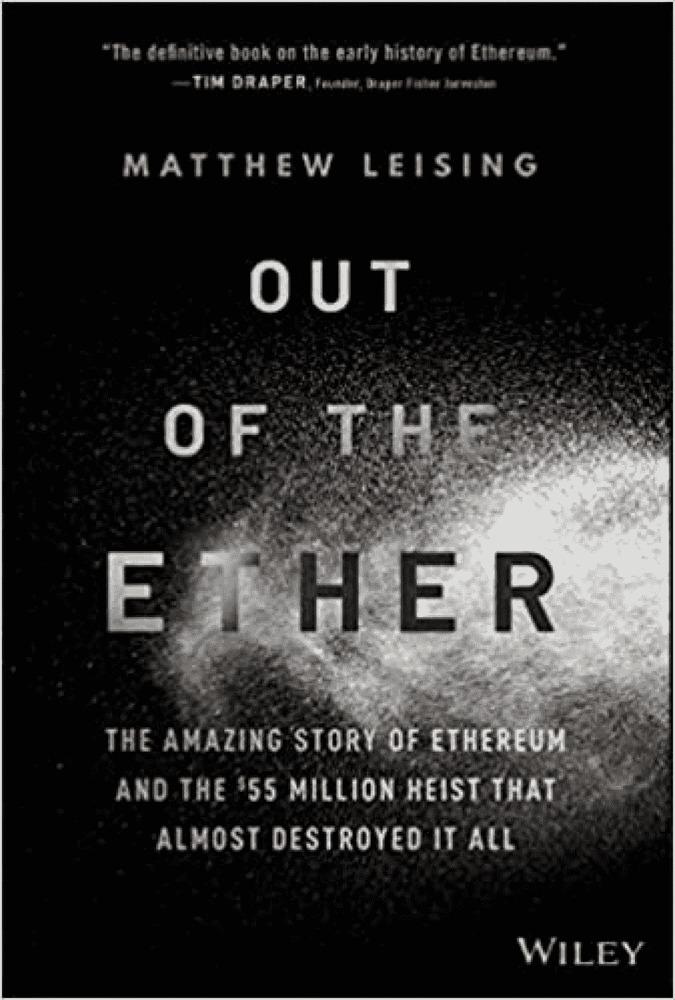](https://www.amazon.com/Out-Ether-Amazing-Ethereum-Destroyed/dp/1119602939/)

在我们所有关于加密货币的最佳书籍中，这本书更深入地研究了以太或以太坊——仅次于比特币的世界第二大加密货币。

在本书中，作者讨论了以太坊是如何工作的，以及一次价值 5500 万美元的黑客攻击和随之而来的盗窃是如何使以太坊开发团队调整他们的策略的。

以太坊是一个不断发展的区块链平台和加密货币。因此，你可能会发现这本书里的一些信息最终会过时。然而，它仍然值得一读！

**[在亚马逊上购买](https://www.amazon.com/Out-Ether-Amazing-Ethereum-Destroyed/dp/1119602939/)**

**作者**:卡蜜拉·鲁索

[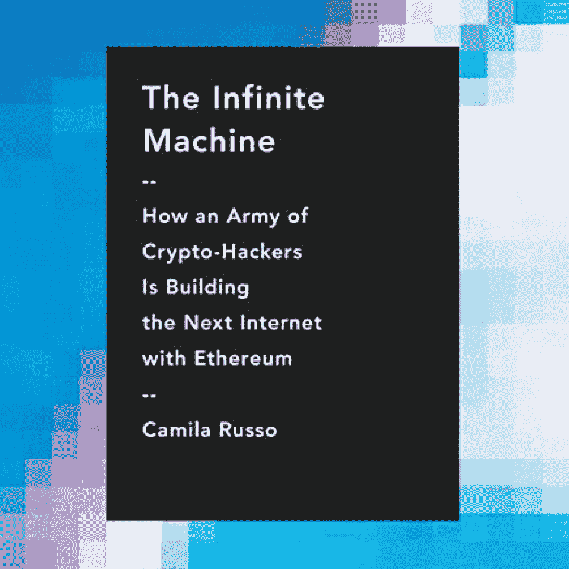](https://www.amazon.com/Infinite-Machine-Crypto-Hackers-Building-Internet/dp/B07XJ7WKXL/)

《无限机器:一群加密黑客如何用以太坊构建下一个互联网》是关于加密和以太坊的最佳书籍之一。作者卡蜜拉·鲁索是一名财经记者，他探索了以太坊相关的一切，包括它的历史、功能和未来。

**[在亚马逊上购买](https://www.amazon.com/Infinite-Machine-Crypto-Hackers-Building-Internet/dp/B07XJ7WKXL/)**

**作者**:克里斯·伯尼斯克，杰克·塔塔尔

[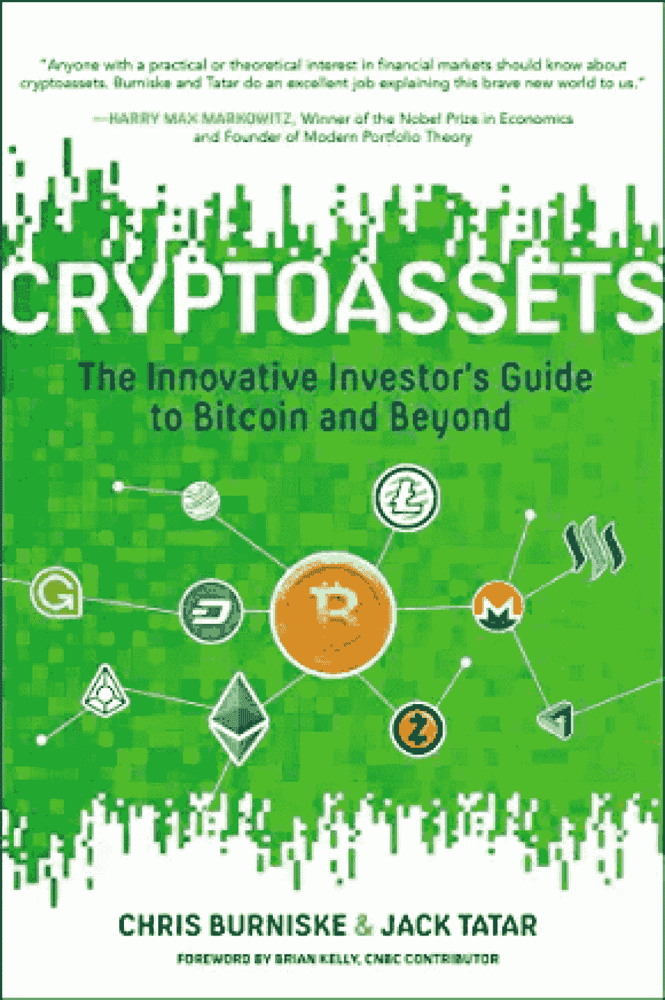](https://www.amazon.com/Cryptoassets-Innovative-Investors-Bitcoin-Beyond/dp/1260026671/)

《加密资产:创新投资者的比特币指南》是风险投资家克里斯·伯尼斯克和杰克·塔塔尔写的一本书。这是一本关于加密的顶级书籍，用于学习加密货币投资。

这本书最适合拥有传统市场和投资基础知识的人，他们现在想把他们的技能应用到加密中。

**[在亚马逊上购买](https://www.amazon.com/Cryptoassets-Innovative-Investors-Bitcoin-Beyond/dp/1260026671/)**

**作者**:布莱斯·保罗

[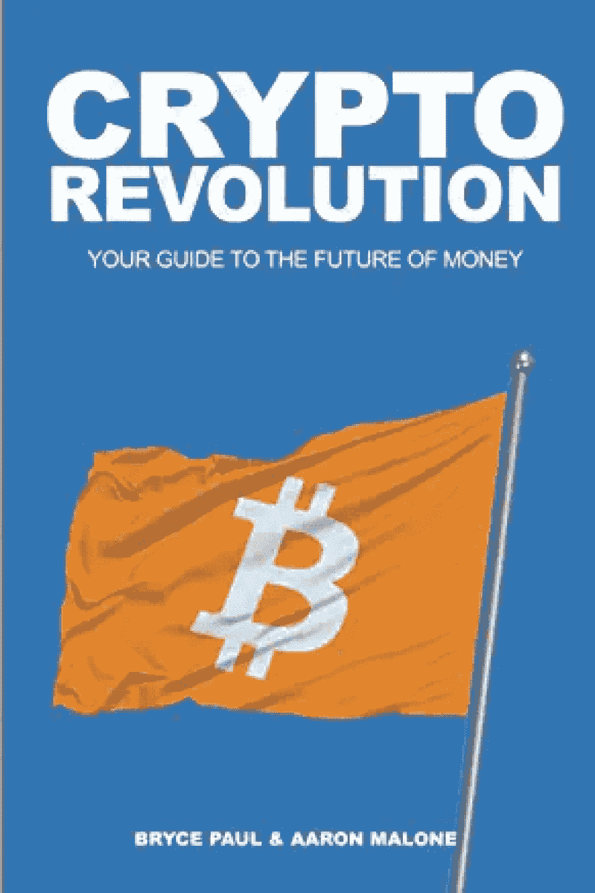](https://www.amazon.com/Crypto-Revolution-GUIDE-FUTURE-MONEY/dp/0983106339/)

这本书不仅仅是一本指南，还是一本历史书。在*Crypto Revolution:Your Guide to the Future of Money*中，你将了解更多关于加密货币的过去和未来，以及它如何改变我们的生活。

您将学习如何开始加密，投资，尽可能安全地购买，存储加密，等等。

**[在亚马逊上购买](https://www.amazon.com/Crypto-Revolution-GUIDE-FUTURE-MONEY/dp/0983106339/)**

作者:迈克尔·j·凯西，保罗·维格纳

[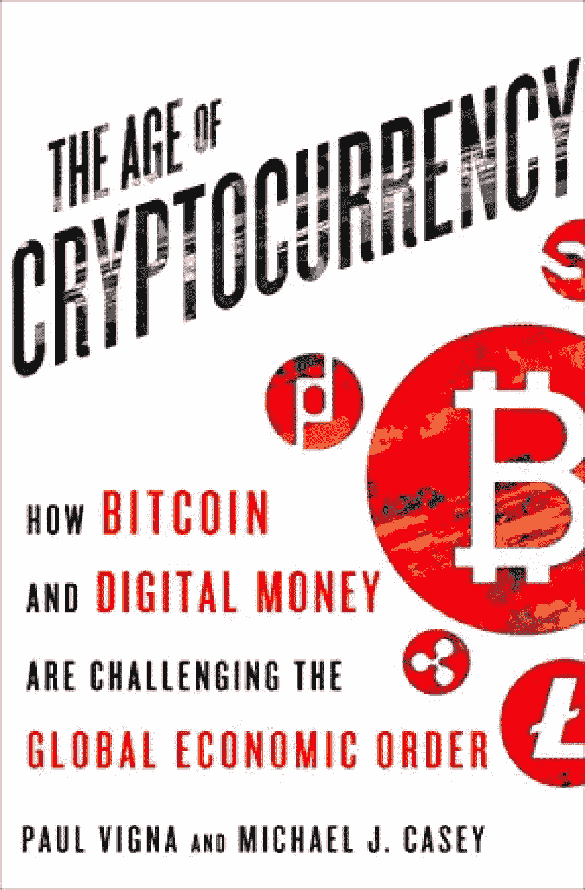](https://www.amazon.com/Age-Cryptocurrency-Bitcoin-Challenging-Economic-ebook/dp/B00L73JQ18)

作者 Paul Vigna 和 Michael J. Casey 带领你了解金钱及其历史，以及人类如何看待它。

一个独特的功能是采访最好的加密投资者。此外，这本书打破了复杂和混乱的主题，使它们更容易理解——这是初学者最佳密码书的主要竞争者。

**[在亚马逊上购买](https://www.amazon.com/Age-Cryptocurrency-Bitcoin-Challenging-Economic-ebook/dp/B00L73JQ18)**

**作者** : Kiana Danial

[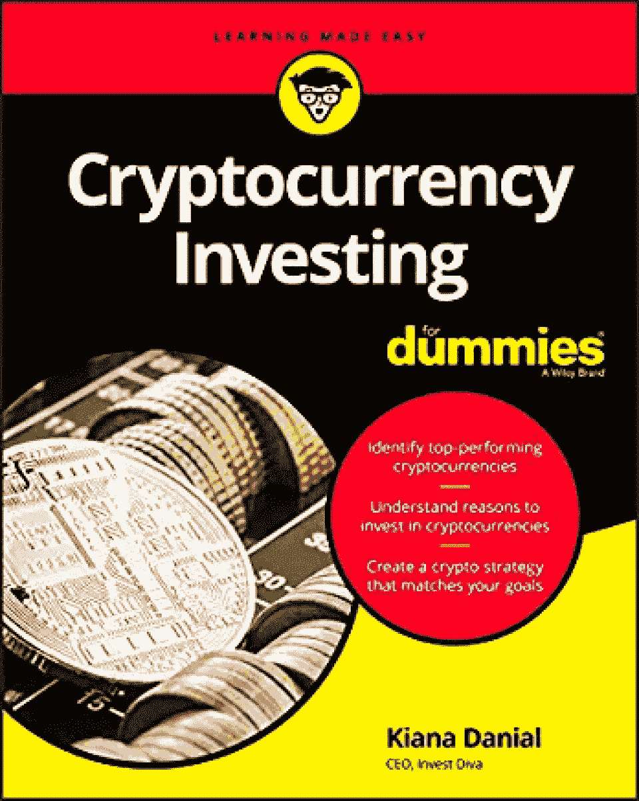](https://www.amazon.com/Cryptocurrency-Investing-Dummies-Kiana-Danial-ebook/dp/B07PBCJ8X7)

Kiana Danial 的*傻瓜加密货币投资*是完全没有任何加密货币投资知识的初学者的完美书籍。

它教你如何设置一个加密钱包，选择一个信誉良好的加密交易所，买卖资产(加密货币)，并保护你的投资。

除了你可以在指南中读到的，你也可以阅读一些对一些最好的加密投资者的采访。这些采访可以给你提供一些在其他地方可能得不到的见解。

**[在亚马逊上购买](https://www.amazon.com/Cryptocurrency-Investing-Dummies-Kiana-Danial-ebook/dp/B07PBCJ8X7)**

作者:亚伯拉罕·k·怀特

[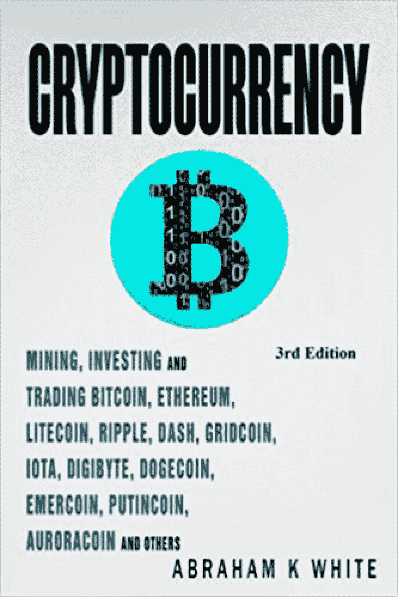](https://www.amazon.com/Cryptocurrency-Investing-Blockchain-including-Auroracoin/dp/1979003262/)

*加密货币:区块链中的采矿、投资和交易*为读者提供了加密货币基础知识的坚实基础。

这本书是针对初学者的，尤其是那些想学习更多关于采矿，交易和投资加密的人。然而，即使是更有经验的读者也可以把它作为复习资料。

**[在亚马逊上购买](https://www.amazon.com/Cryptocurrency-Investing-Blockchain-including-Auroracoin/dp/1979003262/)**

作者:安东尼·刘易斯

[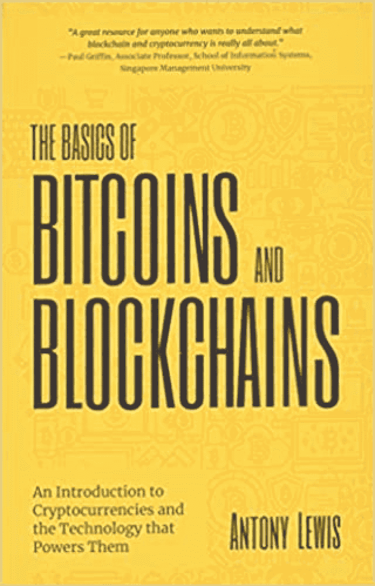](https://www.amazon.com/Basics-Bitcoins-Blockchains-Introduction-Cryptocurrencies/dp/1642506737)

*比特币和区块链的基础知识*是最佳加密书的竞争者——至少对于那些已经对加密货币和区块链有所了解的人来说。

读者喜欢文本客观而详细地涵盖了采矿、公钥和私钥、网络平衡，以及关于比特币利弊的一般论述。

然而，初学者最好从我们清单上的另一本书开始，因为这本书有点技术性。

**[在亚马逊上购买](https://www.amazon.com/Basics-Bitcoins-Blockchains-Introduction-Cryptocurrencies/dp/1642506737)**

**作者**:菲尔·香槟

[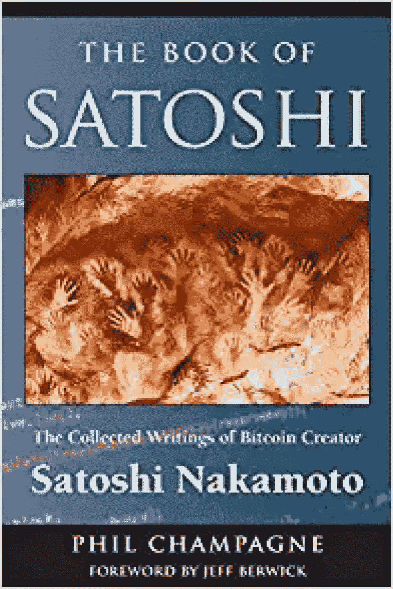](https://www.amazon.com/Book-Satoshi-Collected-Writings-Nakamoto/dp/0996061312)

软件工程师 Phil Champagne 写了《智慧之书:比特币创始人中本聪的作品全集》来探索比特币难以捉摸的创始人的遗产。

这本书涵盖了关于比特币的一切，从它的早期到它更技术性的方面。此外，Champagne 涵盖了工作证明、分权和交易类型等主题，以及从 Nakamoto 那里找到的有限通信。

**[在亚马逊上购买](https://www.amazon.com/Book-Satoshi-Collected-Writings-Nakamoto/dp/0996061312)**

**作者**:唐·塔斯考特，亚历克斯·泰普斯科特

[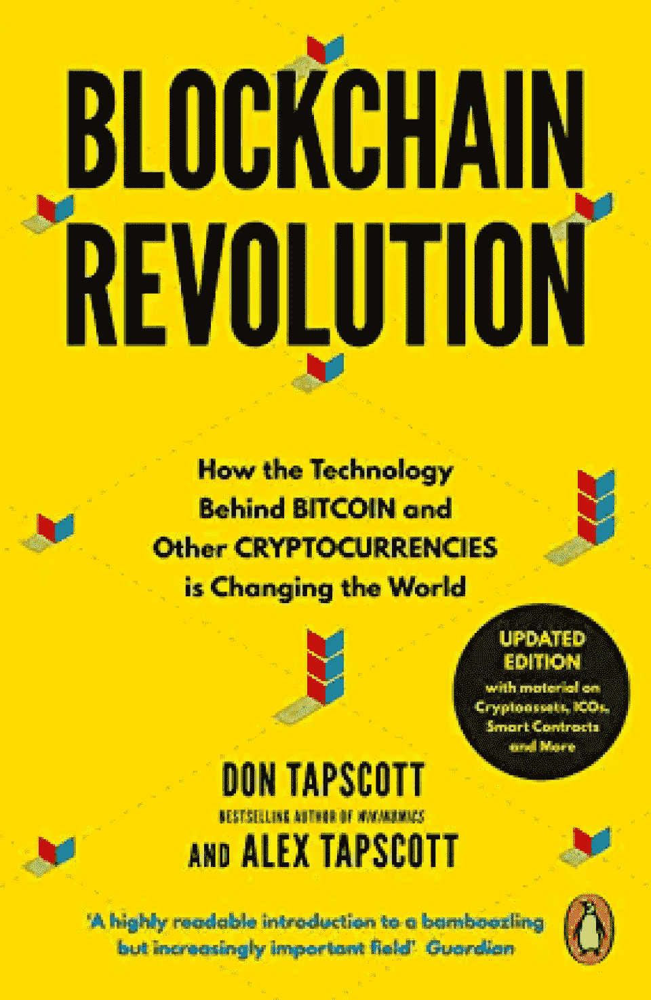](https://www.amazon.com/Blockchain-Revolution-Technology-Cryptocurrencies-Changing/dp/0241237866)

Don 和 Alex Tapscott 的书重点关注区块链技术及其在医疗保健和政治等各种行业中的潜在功能。在我们名单上的所有书籍中，Tapscotts 提供了一个鼓舞人心的乐观观点，即区块链在改善经济和金融系统方面的巨大潜力，包括在不发达国家。

最精彩的部分？区块链革命不需要金融背景就可以阅读——文本简单易懂，是新人的绝佳选择。

**[在亚马逊上购买](https://www.amazon.com/Blockchain-Revolution-Technology-Cryptocurrencies-Changing/dp/0241237866)**

**作者**:威廉·穆加亚尔

[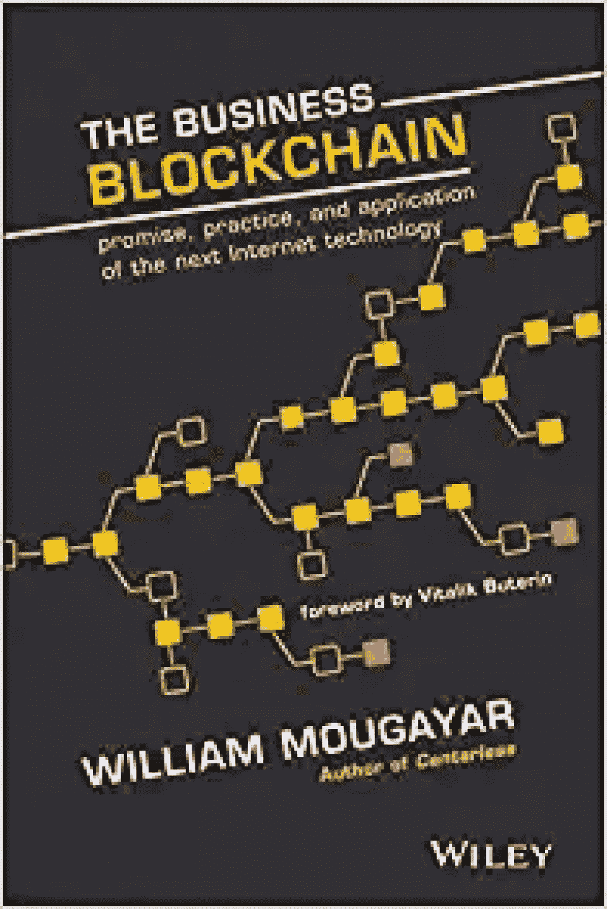](https://www.amazon.com/The-Business-Blockchain-audiobook/dp/B01LZ92RUS/)

对区块链在商界的潜力感到好奇吗？商业区块链是给你的！Mougayar 的平衡方法清楚地揭示了这项技术的优点和缺点，没有压倒性的偏见。它有助于读者对这项技术及其在社会中的潜力获得更现实或中立的理解。

**[在亚马逊上购买](https://www.amazon.com/The-Business-Blockchain-audiobook/dp/B01LZ92RUS/)**

## **结论**

密码书是极好的学习工具，支持你在区块链的投资之旅。我们希望这份关于加密货币的最佳书籍精选清单能够帮助您找到学习的起点！

准备好开始在区块链和加密的职业生涯了吗？

**[查看最佳专业区块链认证。](https://hackr.io/blog/blockchain-certifications)**

## **常见问题解答**

#### **1。对初学者来说最好的密码书是什么？**

有三本关于密码的书对初学者来说很棒:

*   区块链基础知识:非技术性介绍，25 个步骤，丹尼尔·德雷舍著
*   Ryan Derousseau 的加密货币投资指南
*   Kiana Danial 为傻瓜投资加密货币

#### **2。我如何学习加密货币？**

你可以通过我们关于加密货币的顶级书籍、[关于加密货币和区块链的课程](https://hackr.io/blog/best-blockchain-courses)，或者[加密和区块链教程](https://hackr.io/blog/best-cryptocurrency-blockchain-tutorials)来了解加密货币。此外，你可以加入论坛和小组，向其他更了解这个主题的成员学习。

#### **3。加密货币哪个课程最好？**

你有很好的加密货币课程选择。最好的两个是[完全加密货币&比特币交易课程](https://click.linksynergy.com/deeplink?id=jU79Zysihs4&mid=39197&murl=https%3A%2F%2Fwww.udemy.com%2Fcourse%2Fthe-complete-cryptocurrency-trading-course%2F)和[加密货币精通:完全加密交易课程](https://click.linksynergy.com/deeplink?id=jU79Zysihs4&mid=39197&murl=https%3A%2F%2Fwww.udemy.com%2Fcourse%2Fcryptocurrency-mastery-the-complete-crypto-trading-course%2F)。两者都在 Udemy 上，在平台上评价都很高。**