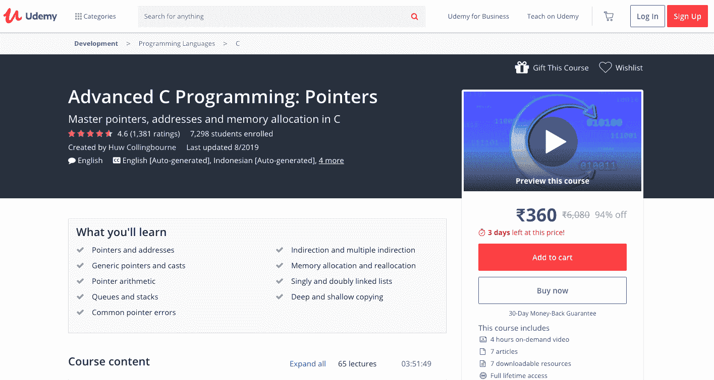
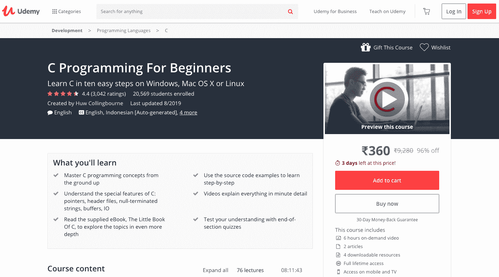
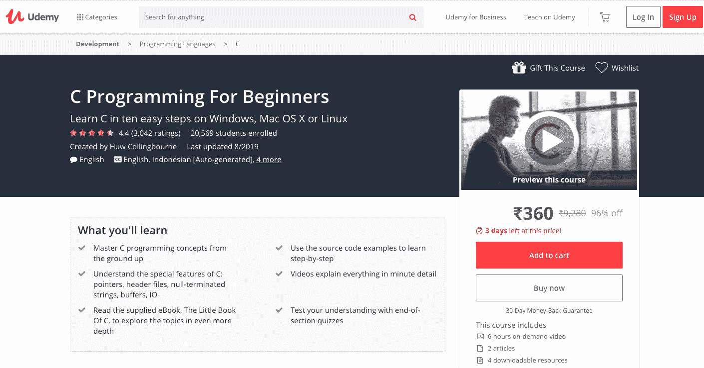
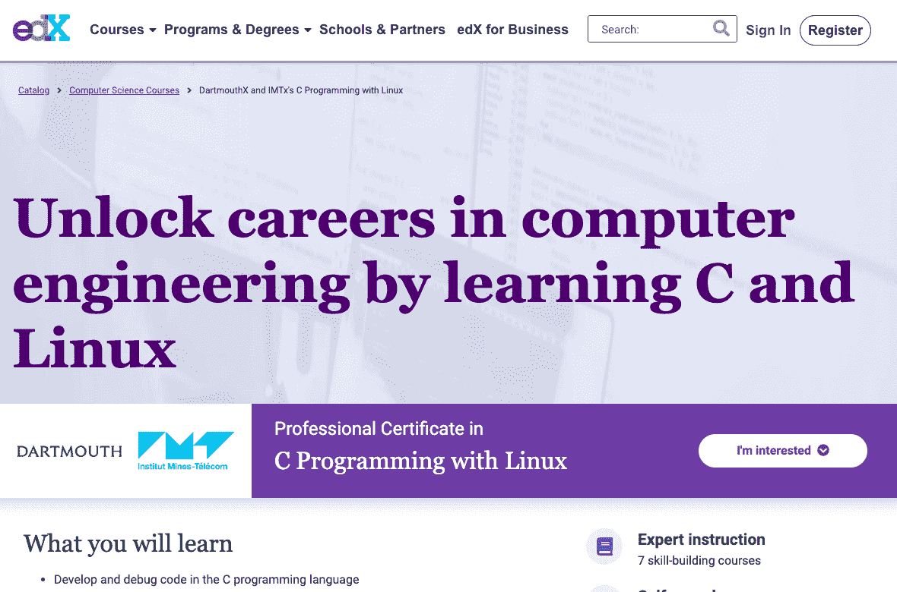
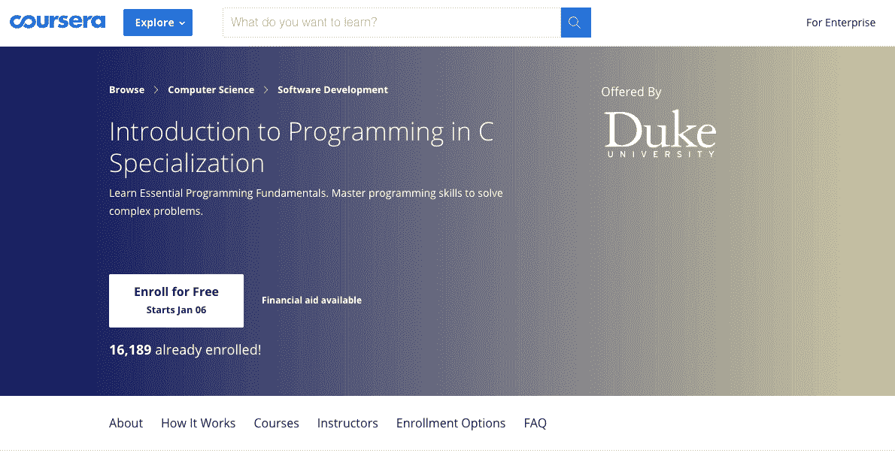
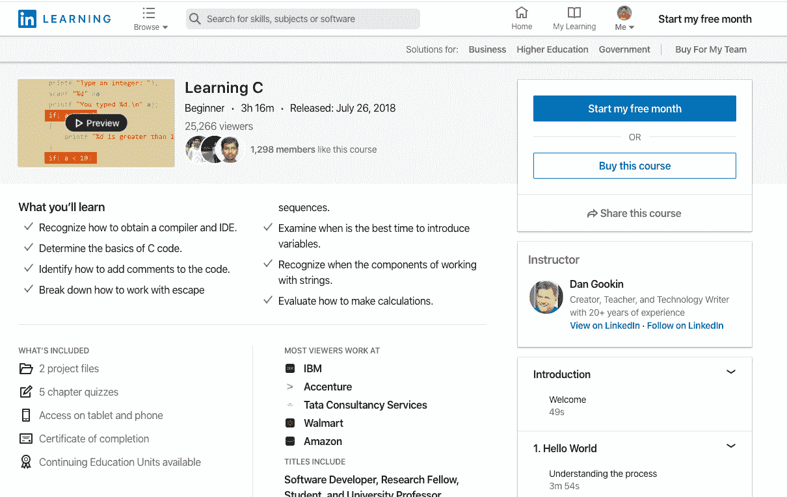
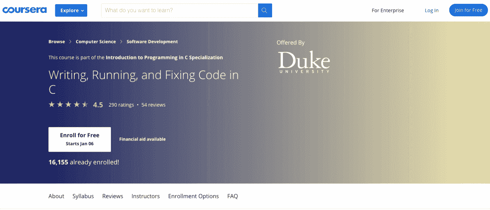
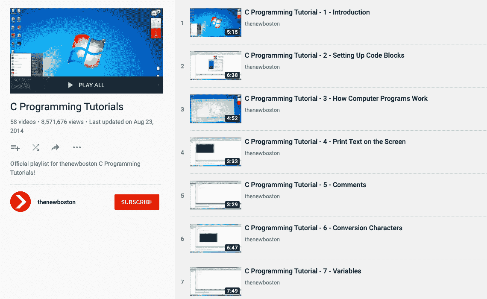
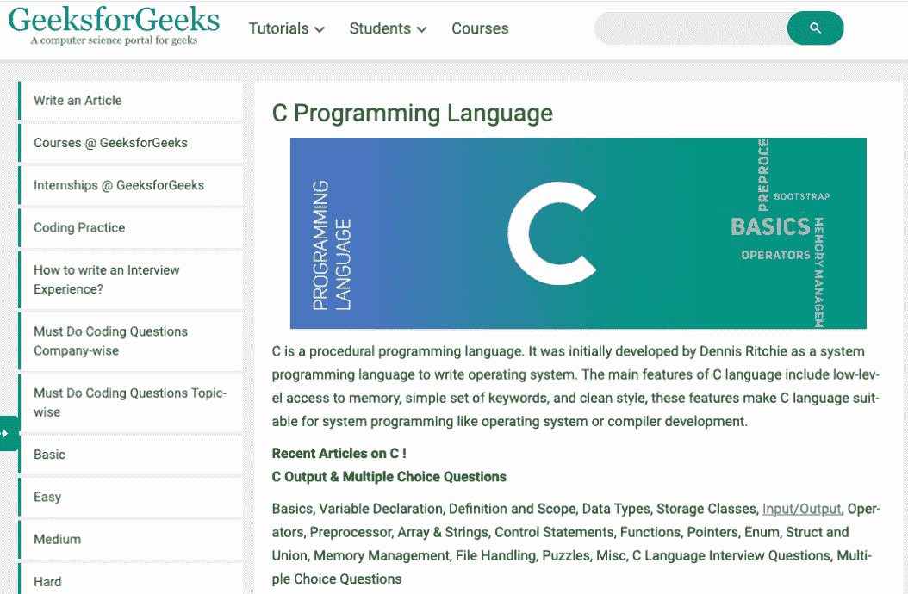
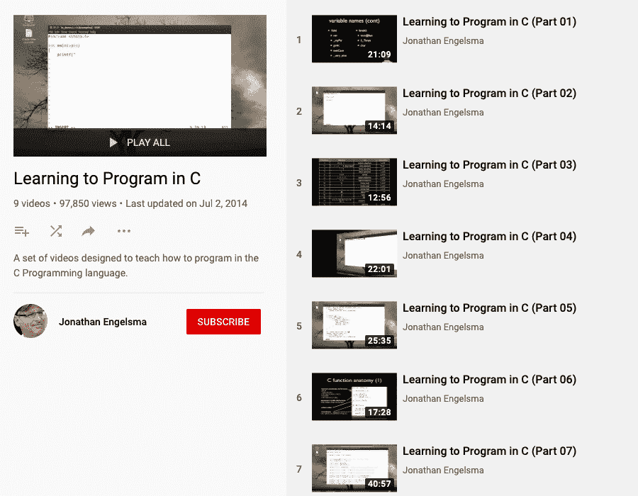

# 2023 年提升你技能的 10 门最佳 C 语言在线课程[更新]

> 原文：<https://hackr.io/blog/best-c-courses>

C 编程语言是现存最古老的编程语言之一。在其运行期间，这位编程界的资深成员影响了广泛的现代编程语言，如 Java、PHP 和 Python，并且直到今天还在继续这样做。

尽管已经有 45 年的历史，但 C 编程语言是许多领域不可或缺的一部分，包括游戏、机器人和电子。那么，学习 C 编程语言值得吗？当然是啦！

## **最值得学习的 C 语言课程**

然而，拥有用其他编程语言编写代码的能力会让你的未来前景更好。所以，无论你是想重新开始学习 C 语言，还是想在 C 语言上有所进步，以下是我们挑选的 10 门最佳 C 语言课程:

类型–教程
级别–高级

高级 C 编程:指针课程由 Huw Collingbourne 创建，旨在帮助学习者掌握 C 语言中指针、地址和内存分配的概念。凭借 4.6 星的耀眼评级，迄今已有超过 6k 名学生注册了 C 课程。

为了方便非英语使用者，Udemy 提供的高级 C 编程:指针课程也有印度尼西亚语、意大利语、波兰语、罗马尼亚语和泰语版本。像其他 Udemy 课程一样，你可以在购买后终身使用该课程。

高级 C 编程:指针课程附带 4 小时的点播视频和 7 篇文章。此外，还有 7 种可下载的资源可用于增强学习体验。成功完成后，学员将获得结业证书。

**涵盖的主题:**

*   常见指针错误
*   深层和浅层复制
*   泛型指针和类型转换
*   间接和多重间接
*   内存分配和重定位
*   指针算法
*   指针和地址
*   单向和双向链表
*   堆栈和队列

可以在这里报名[。](https://click.linksynergy.com/deeplink?id=jU79Zysihs4&mid=39197&murl=https://www.udemy.com/course/advanced-c-programming-pointers/)

类型-课程
级别-初学者

Udemy 提供的 C [编程初学者](https://hackr.io/blog/how-to-learn-programming)–掌握 C 语言课程，帮助你快速学习 C 编程语言，增加职业选择。这是 Udemy 上最畅销的课程之一，评分为 4.4 星，注册人数超过 24k。

C 课程由 Jason Fedin 和 Tim Buchalka 的 Learn Programming Academy 共同打造。为了让非英语国家的人从 C 语言初学者综合课程中受益，它提供了 7 种非英语语言，包括法语、印尼语、波兰语和罗马尼亚语。

面向初学者的 C 编程-掌握 C 语言课程从 C 基础开始，以编写高质量代码的技巧结束。课程中的 129 个讲座转化为 22.5 小时的视频，你可以以你认为最舒适的方式遍历。

**涵盖的主题:**

*   数组
*   C 编程语言的基本概念和特征
*   字符串
*   控制流
*   排除故障
*   文件输入和输出
*   功能
*   经营者
*   两颗北极指极星
*   结构
*   标准 C 库
*   变量和数据类型

可以在这里报名[。](https://click.linksynergy.com/deeplink?id=jU79Zysihs4&mid=39197&murl=https://www.udemy.com/course/c-programming-for-beginners-/)

类型–教程
级别–初学者

面向初学者的 C 编程课程旨在通过 10 个简单的步骤向学习者介绍 C 编程语言。通过本 Udemy 课程，您可以自由使用 Linux、macOS 或 Windows 三种主要操作系统中的任何一种来学习 C 语言。

由 Huw Collingbourne 创建的 C 编程初学者课程在超过 2.9k 的评论中平均获得 4.1 星的评级。迄今为止，已有超过 1.9 万名学员学习了该课程。除英语外，初级 C 语言课程还提供印尼语和泰语版本。

面向初学者的 C 编程课程包括 6 个小时的点播视频，分为多个讲座。此外，C 课程附带了 1 篇文章和 3 个可下载资源，以进一步帮助学习者掌握 C 编程语言。

**涵盖的主题:**

*   数组
*   二进制文件和内存分配
*   编辑器和 ide
*   c 编程基础
*   字符、字符串和指针
*   常量和变量
*   数据类型
*   文件处理
*   函数和参数
*   头文件和范围
*   循环和 break 语句
*   操作员、测试和用户输入
*   结构和枚举数据类型
*   Switch 语句

可以在这里报名[。](https://click.linksynergy.com/deeplink?id=jU79Zysihs4&mid=39197&murl=https://www.udemy.com/course/c-programming-for-beginners/)

类型-专业证书
级别-初学者

对于那些想要获得 Linux 平台上 C 语言编程专业认证的人来说，Linux 平台上的 C 语言编程是一个不错的选择。edX 提供，C 课程有两位导师；Petra Bonfert-Taylor 教授和 Rémi Sharrock 副教授。

使用 Linux 的 C 编程课程包括 7 门研究生水平的课程，以教育学习者关于 C 编程语言和 Linux 平台的知识。虽然这是一个自定进度的计划，但完成课程的最长持续时间是 4 个月。

任何希望从事嵌入式系统或高性能计算的人都必须非常熟悉 C 编程语言和 Linux 平台。因此，Linux 下的 C 编程课程为这些人提供了一箭双雕的机会。

**涵盖的主题:**

*   用 Linux 编译 C 代码
*   用 C 开发代码
*   调试 C 代码
*   开发计算机算法
*   C 语言、编程和 Linux 平台基础
*   用 C 语言管理进程、文件和内存
*   操作命令行
*   在 C 语言中使用指针来操作、观察和优化计算机内存

可以在这里报名[。](https://www.edx.org/professional-certificate/dartmouth-imtx-c-programming-with-linux)

类型-视频教程
级别-初学者

通过 coursera 和杜克大学提供的 C 语言编程入门课程，学习所有重要的编程基础知识。该计划依靠 4 门课程来培养开发高效解决问题算法的能力，并在学习者中将其转换为 C 代码。

对于那些希望进入利润丰厚的软件开发领域和其他计算领域的人来说，C 语言编程入门课程是一个很好的选择。这是一个初级课程，时间安排灵活，大约需要 3 个月才能完成。

除了英语，C 课程还有越南语版本。除了参加 4 门课程，学员还需要完成一个动手项目。在成功完成课程并提交动手项目后，将颁发结业证书。

**涵盖的课程:**

*   编程基础(课程 1)
*   用 C 语言编写、运行和修复代码(课程 2)
*   指针、数组和递归(课程 3)
*   与系统交互和管理内存(课程 4)

可以在这里报名[。](https://coursera.pxf.io/e454KQ)

该平台提供从初级到高级的一系列课程。您可以选择逐一完成所有培训，也可以选择适合您经验水平的培训。除此之外，还有专门为提高你的编码技能而设计的课程。代码诊所由流行的编码作业和实践解决方案组成。完成基础课程后，您可以选择学习基于嵌入式应用中 C 语言使用的课程，以整合您的知识并构建物联网解决方案。

类型-课程
级别-初学者到高级

**涵盖的主题**

*   IDE 安装
*   编译程序
*   数据类型
*   变量
*   头文件
*   功能
*   条件语句
*   环
*   两颗北极指极星
*   数组
*   文件处理
*   结构和枚举数据类型
*   Typedef、struct 和 union

可以在这里报名[。](https://www.linkedin.com/learning/learning-c-5)

用 C 语言编写、运行和修复代码是 coursera 与杜克大学联合开设的一门课程。

除了英语，C 课程还有越南语版本。这是一门 100%的在线课程，你可以按照自己的进度学习。你需要大约 25 个小时来完成课程，总共大约 4 周，每周学习 6 到 8 个小时。3 名讲师将在整个课程中为您提供帮助。

通过成功完成 C 语言程序的编写、运行和修复，你不仅能够用 C 语言编写代码，还能很好地理解 C 编译器和调试过程。你最终必须完成一个实践项目，才能获得结业证书。

类型-课程
级别-初学者

**涵盖的主题:**

*   C 语言基础
*   c 编译器
*   代码审查
*   编译器错误
*   编译概述和过程
*   控制执行
*   UNIX 平台的基础
*   宏和头文件
*   测试概述和流程
*   测试类型

可以在这里报名[。](https://coursera.pxf.io/mgJOra)

类型-视频系列
级别-初级/中级

想免费开始使用 C 吗？那么你应该看看 YouTube 上的 C 编程教程视频系列。由 thenewboston 创建和策划的 C 编程教程是 58 个视频的集合，在撰写本文时已经获得了超过 810 万次观看。

C 编程教程视频集中的大多数视频运行时间不到 10 分钟。只有少数超过 10 分钟。该系列中最大的视频长达 12 分 38 秒，而最小的视频只有 3 分 33 秒

C 编程教程视频系列涵盖了 C 编程语言的大部分基础/中级方面。因此，它有如此多的内容，以至于有人想开始学习 C 而不吝惜一分钱。

**涵盖的主题:**

*   数组和指针
*   C 编程语言基础
*   中断、继续和切换
*   字符功能
*   创建头文件
*   用 C 语言进行文件操作
*   全局与局部变量
*   环
*   嵌套 if 语句
*   [按引用传递与按值传递](https://hackr.io/blog/pass-by-reference-vs-pass-by-pointer)
*   付出和获得
*   字符串和指针
*   铅字铸造

可以在这里报名[。](https://www.youtube.com/playlist?list=PL6gx4Cwl9DGAKIXv8Yr6nhGJ9Vlcjyymq&ref=hackr.io)

类型–教程
级别–初级/中级/高级

虽然不完全是一个教程，但这是一个完整的极客教育网站上 C 编程语言相关文章的目录。对于极客来说，C - Geeks 最大的好处是它有一个全面的 C 主题列表，并且这个列表还在不断增长。

面向极客的 C - Geeks 是一个为每一个 C 程序员或有志之士准备的地方，不管他们的技能水平如何。从 C 编程语言的基础到用 C 处理文件，你都可以在这里找到。

你可以按照自己的进度学习，完全免费。不管你是否已经精通 C 语言，你仍然可以使用 C - Geeks for Geeks 作为你所有个人/专业项目的参考点或手册。

**涵盖的主题:**

*   数组和字符串
*   控制语句
*   [C 语言中的数据类型](https://hackr.io/blog/data-types-in-c)
*   枚举、结构和联合
*   用 C 语言处理文件
*   功能
*   C 语言基础
*   输入/输出
*   内存管理
*   经营者
*   两颗北极指极星
*   预处理程序
*   存储类别
*   变量声明、定义和范围

可以在这里报名[。](https://hackr.io/tutorial/c-geeks-for-geeks)

[****](https://www.youtube.com/playlist?list=PLkB3phqR3X40reMCBYSoNUPbDvM4kybMs&ref=hackr.io)

类型-视频系列
级别-初学者

YouTube 是一个学习几乎任何东西的好地方，至少是入门的好地方。对于 C 编程语言来说也是如此。《学习 C 语言编程》是一个 YouTube 视频系列，由计算机科学家、程序员和教师 Jonathan Engelsma 创作。

除了介绍 C 编程语言的基础知识之外，Engelsma 的 YouTube 频道还提供了大量讲解透彻的关于 Ruby 和 Swift 相关主题的教程视频。所有这些都是完全免费的。

学习编程 C 视频系列共包含 9 个视频，总运行时间 198 分 11 秒。截至目前，该视频系列已累积超过 96k 次观看。每个视频都有助于学习者向开始使用 c 语言编程迈进一步。

**涵盖的主题:**

*   算术和逻辑表达式
*   C 语言基础
*   数据类型
*   动态内存分配:calloc()、free()和 malloc()
*   函数:语法、定义、局部变量、按值调用、按引用调用和递归
*   使用 putchar/getchar 和 printf/scanf 的输入/输出
*   循环和分支
*   使用 C 标准 I/O 库中的函数读写文件
*   单维和多维数组
*   字符串和指针
*   Typedef、 [struct 和 union](https://hackr.io/blog/difference-between-structure-and-union)

你可以在这里报名[" target = " _ blank " rel = " noope ner ">。](https://www.youtube.com/playlist?list=PLkB3phqR3X40reMCBYSoNUPbDvM4kybMs&ref=hackr.io<span%20id=)

## **结论**

以上就是我们挑选的 10 大最佳 C 课程。您可以选择列表中提到的一门或多门课程，也可以与您的同事和朋友分享，他们希望开始学习 C 编程语言或在 C 编程语言方面有所进步。

记住，学习编程需要耐心、坚持和练习。对于学习像 c 这样的编程语言来说尤其如此，所以，继续努力吧。你最终会好起来的。如果你愿意，也可以看看这些最好的 C 教程。

**人也在读:**