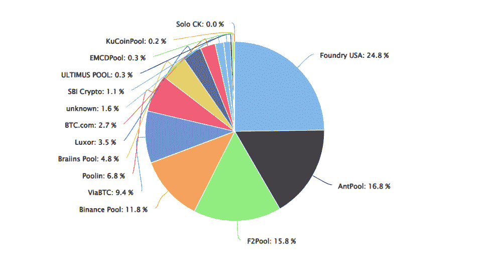
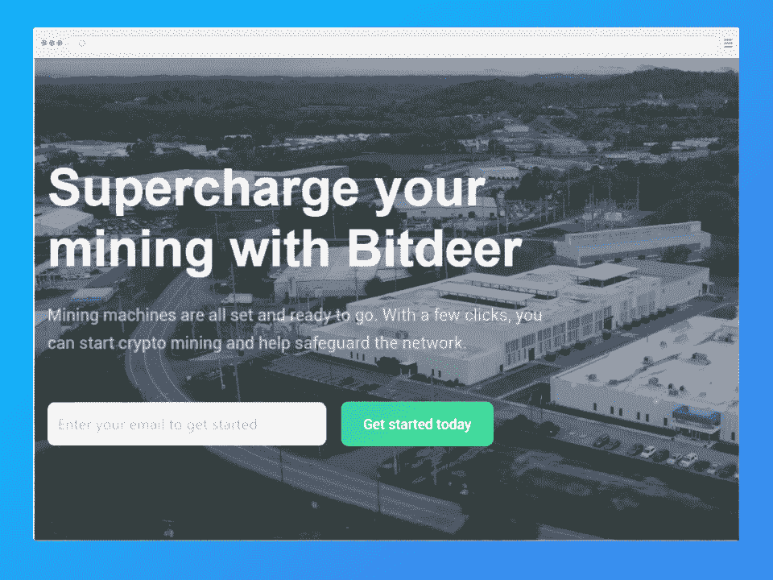
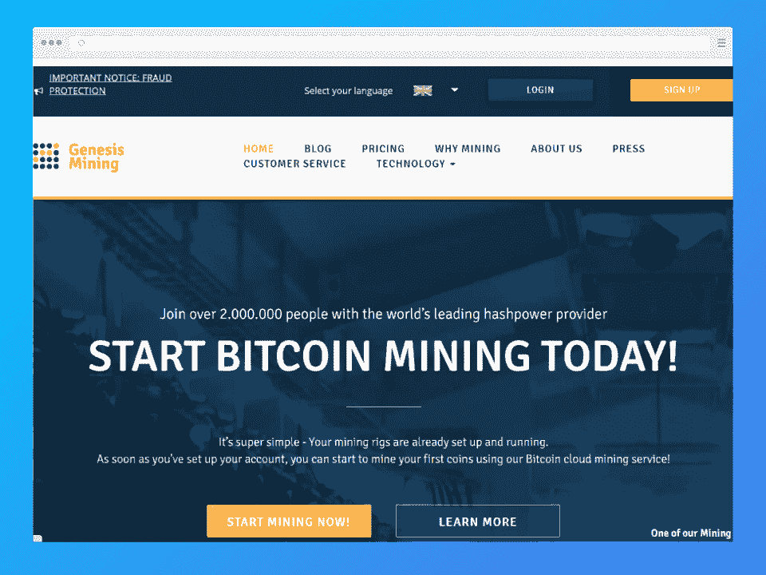
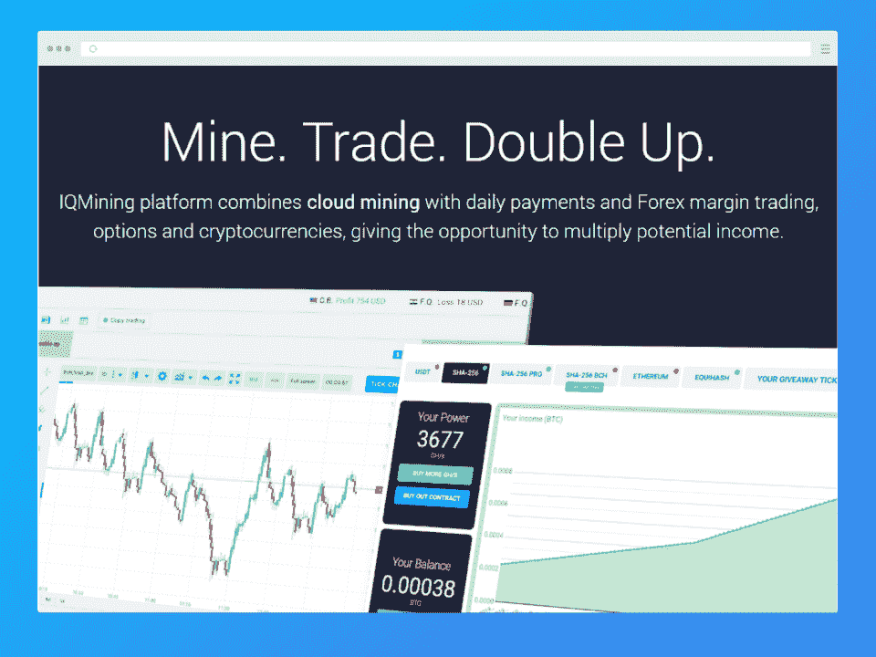
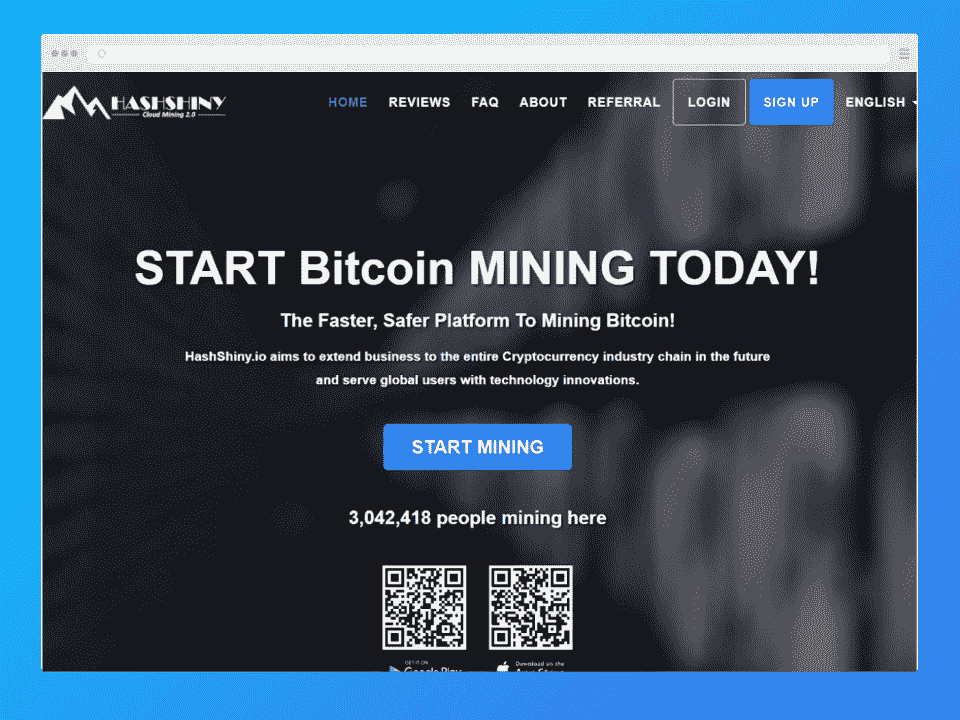
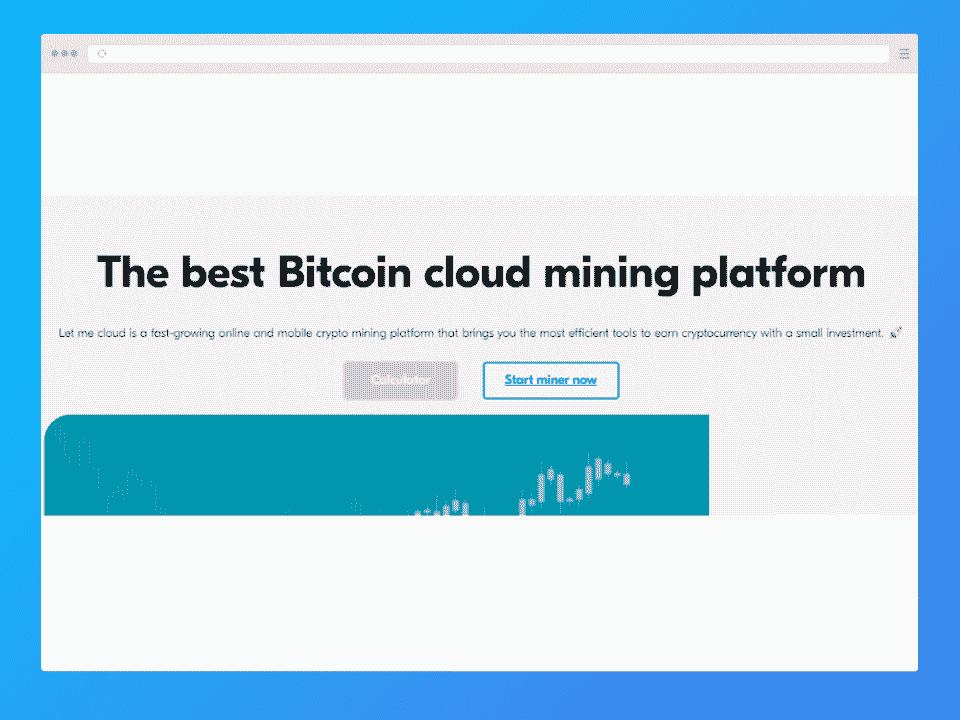
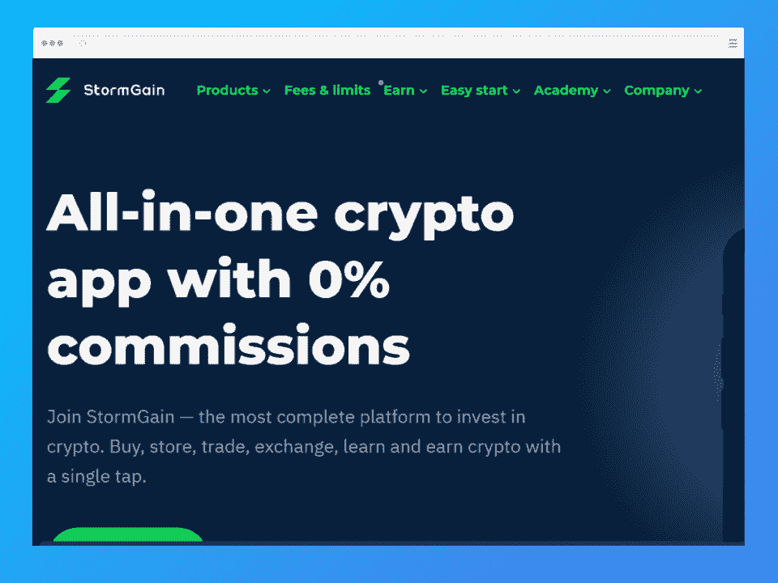

# 2023 年 8 个最佳云采矿网站[专家评论]

> 原文：<https://hackr.io/blog/best-cloud-mining-sites>

让我们回到比特币的早期。

当 crypto 首次推出时，人们可以在家里真实地“挖掘”硬币。他们使用计算机来解决复杂的方程，这将导致硬币被“开采”并创造价值。当时，矿工使用他们的中央处理器。很快，人们发现 GPU 从根本上更加有效。

但没过多久，开矿就变得不可行了。即使在比特币刚开始流行的时候，一个矿工可能会花几个月的时间来开采一枚比特币。因此，人们加入了采矿池，取而代之的是:将采矿工作结合起来，然后分发硬币碎片的服务器。

今天，我们有一个更好的答案来回答[区块链](https://hackr.io/blog/blockchain-programming-beginners-guide)矿业:最好的云矿业网站。

## **什么是云挖掘？**

云开采网站让你能够利用云的力量开采加密货币。您为处理能力和消耗的资源付费；否则，你只需要启动你的矿机，然后等待。

云挖掘服务器的工作方式与任何其他云服务器一样:您注册订阅(有时根据合同)，支付订阅费(和额外的资源使用)，并根据需要管理您的服务器。

然而，要“挖掘”密码，加密货币必须是一种“工作证明”硬币。工作证明币包括比特币、原始以太坊、莱特币和 Monero。

在很大程度上，大部分采矿活动仍由主要的 BTC 矿池完成:

这些是更传统的即插即用工具，个人维护他们的硬件。然而，云服务正在飞速发展。

| 赞成的意见 | 面向连接的网络服务(Connection Oriented Network Service) |
| ✅No 在硬件方面的前期投资✅Doesn't 需要物理空间✅Can:你想要多少我就有多少 | ❌Not 总是值得信赖的❌May 没有财务意义 |

## **概述:最值得信赖的 8 款云矿主板**

我们编制了一份 2023 年最佳和最值得信赖的云采矿网站列表。这些云挖掘服务已经存在了一段时间，支持快速取款，并提供卓越的服务和客户支持。

也就是说，即使是最好的云挖掘服务仍然存在相对较高的风险。尽职尽责，慢慢投资，能退出就退出。

| 位置 | 评级 | 确定的 | 哈希速率** | 量滴投资 |
| [比特迪尔](http://bitdeer.com) | ⭐⭐⭐⭐ | 2018 | 4.4EH/s (36.5%) | $208.50+ |
|  | ⭐⭐⭐ | 2017 | 各不相同) | $39+ |
| [ECOS](https://ripplecoinnews.com/go/ecos-nam/) | ⭐⭐⭐⭐ | 2018 | 高达每秒 516.19 次(BTC) | $149+ |
| [创世纪矿业](https://ripplecoinnews.com/go/genesis-mining/) | ⭐⭐ | 2013 | 变化 | $500+ |
| [IQMining](https://ripplecoinnews.com/go/iqmining/) | ⭐⭐ | 2016 | 高达 980.03 TH/s(以太网) | $56+ |
| [HashShiny](https://ripplecoinnews.com/go/hashshiny/) | ⭐⭐⭐⭐ | 2017 | 最低 10 千兆赫/秒(BTC) | 每 10 加仑/秒+0.38 美元 |
| [企业经济](https://ripplecoinnews.com/go/letmecloud/) | ⭐⭐⭐⭐⭐ | 2016 | 48000 GH/秒+ (BTC) | $500+ |
| [暴风云](http://stormgain.com) | ⭐⭐⭐⭐⭐ | 2019 | 变化 | $50 |

*截至 2022 年 9 月的所有数字。**基于挖掘的主要加密技术，请参阅综述了解更多信息。

### **挖掘难度、哈希率、合同条款**

不同的硬币更难挖掘。例如，BTC 极难开采。哈希速率表示处理器解决问题的速率，加密越难挖掘，哈希速率就越高。

当你看合同时，通常会给你一个最低散列率。你可以花更多的钱购买更昂贵的服务，以获得更强大的处理器，从而获得更高的哈希速率。当比较合同时，你必须看你得到的确切散列率。

一些公司提到他们的最小散列率、最大散列率或服务器的总散列率。在继续之前，确保你正在进行比较——在你开始之前，你可能想要[参加一个区块链课程](https://hackr.io/blog/best-blockchain-courses)或者浏览一个关于区块链的[简要概述](https://hackr.io/blog/best-cryptocurrency-blockchain-tutorials)。

[****](http://bitdeer.com)

课程:BTC、FIL、ZEC、CKB、HNS、LTC+DOGE、ETH、DCR、DASH 等

*   提供为期 180 天的自主云开采计划
*   价格因演出而异
*   高初始投资

自 2018 年以来， [Bitdeer](https://www.bitdeer.com/) 已在超过 200 个国家/地区提供可信云挖掘服务。Bitdeer 拥有广泛的附加服务，包括 iOS 和 Android 应用程序、24/7 客户支持、实时加密货币图表和各种云挖掘计划。费率和盈利能力因绩效而异。

对于比特币矿工来说，Bitdeer 的入门计划是他们的 **Antminer S19 Pro 计划**，提供 50 次/秒的哈希速率(最高 100 次/秒)，静态收益率 17.75%，初始成本 208.50 美元。

点击这里查看。

**货币:** BTC、瑞士联邦理工学院、长期贷款公司、DASH、XMR、XRP、BCH、ZEC

*   99.5%的正常运行时间和 24/7/365 全天候支持
*   货币历史和计算器等附加功能
*   即时硬币存款

HashGains 是一家位于得克萨斯州的营利性云挖掘网站，为许多财富 500 强公司提供服务。该网站拥有一支训练有素的员工队伍，以及遍布全球的令人印象深刻的工业数据中心。

HashGains 在全球拥有超过 80，000 名用户，大多数评论都对他们的服务表示满意。然而，一些在线评论者哀叹该网站是一个骗局，理由是支付问题。你可以从一系列固定和定制的两年计划中挑选，起价约为每月 30 美元。

[报名这里](https://www.hashgains.com/)

[****](https://ripplecoinnews.com/go/ecos-nam/)

**货币:** BTC

*   一个干净易用的网站和应用程序
*   易于定制、灵活的合同
*   快速、简单的设置

[ECOS](https://ecos.am/en#/) 是一个 DeFi 平台，包括钱包、交易所、云挖掘和投资组合管理。你可以用它来投资加密指数，存储你的钱包，挖掘加密货币。ECOS 任职期间拥有超过 100，000 名客户。

ECOS 让你定制自己的合同。如果你估计 BTC 的预测是 90，000 美元，那么 1.27 秒/秒的 24 个月合约将花费 100 美元。这将导致 404%的利润。

点击这里查看。

[****](https://ripplecoinnews.com/go/genesis-mining/)

**货币:** BTC、拉脱维亚、多哥、达什、瑞士法郎、蒙古元、兹卡什

*   快速支付
*   大量的备用硬币
*   接受信用卡
*   100%正常运行时间保证

[Genesis Mining](https://www.genesis-mining.com/) 为全球超过 200 万名加密矿工提供比特币和替代币的各种加密服务。自 2013 年以来，他们已经进行了超过 1 亿笔交易，并在全球范围内维持着农场。虽然开始时它们可能有点贵，但它们提供 100%的正常运行时间保证和可靠的支持。不幸的是，它们经常售完。

创世纪采矿计划的一个例子是他们的以太坊**辐射小型启动器**。此计划起价 499.99 美元，24 个月提供 12.50 MH/s。

点击这里查看。

[****](https://ripplecoinnews.com/go/iqmining/)

**货币:** BTC、USDT、瑞士法郎

*   提供 1 年、2 年或 5 年合同
*   高盈利水平和日常支出
*   灵活的定价和服务等级

IQMining 提供 BTC、USDT 和 ETH 合约，利率从 12 个月到 5 年不等。联系人的 SHA-256 合同默认为 5，000 GH/s。首先，您只需开立一个账户并选择一项计划。IQMining 提供快速支付和可靠的服务，而且经常打折。

他们合同的一个例子是一年期 SHA-256 合同，5000 天然气水合物/秒，56 美元。你可以通过支付更多的费用来增加你的盈利能力。

点击这里查看。

[****](https://ripplecoinnews.com/go/hashshiny/)

**货币:** BTC、DASH、LTC、ETH、ZEC、DCR、DOGE

*   多种多样的货币和杂凑汇率
*   加密中的自动支付
*   维护费用低
*   两年合同

[HashShiny](https://hashshiny.io/) 是一家成立于 2017 年的云挖掘服务，目前提供全球 1.5%的 BTC 哈希率。HashShiny 使用水电和风能、最新的数据中心硬件和先进的冷却系统，以最低的成本提供最好的云服务。截至 2022 年，哈什尼准备上市。

HashShiny 服务的一个例子包括其 **SHA-256 云采矿**平台，最低哈希速率为 10 GH/s，在 BTC 自动支付，速率为每 10gh/s 0.38 美元

点击这里查看。

[****](https://ripplecoinnews.com/go/letmecloud/)

**货币:** BTC

*   最低存款 500 美元
*   易于使用，可获得客户支持
*   每日支出

[LetMeCloud](https://letmecloud.com/?__cf_chl_tk=g4s9hWibkT2Topwn54ow4oDGoYaSiufUWPB4A8rAY2k-1666279938-0-gaNycGzNByU) 为比特币云开采提供一年期合同，每日支付。避开高额的最低存款额(500 美元)很容易，但这个平台是多功能的。在 LetMeCloud 上，你可以购买 70 多个国家的定制采矿合同。

LetMeCloud 提供一年的“Standart”服务，最低功率为 48，000 GH/s，租金为 500 美元。“标准”服务的利润率估计为 150%。

点击这里查看。

[****](http://stormgain.com)

**货币:** BTC

*   一体化加密货币应用
*   支持多种货币
*   应用内云钱包

StormGain 是一款零佣金的加密货币应用，提供广泛的服务:加密货币交易所、加密钱包、交易信号和(当然)BTC 云采矿。投资者可以在任何时候提取他们的资金——并且提款会直接进入他们的账户(尽管有最低提款金额)。

StormGain 有点独特，它让你免费挖掘少量比特币。每天最多可以开采 0.0318 BTC(截至 2022 年 9 月)。

点击这里查看。

## **如何选择加密云挖掘站点**

当选择一个云挖掘网站，有几件事你需要考虑。要知道加密货币诈骗很常见——尽管这个行业正在变得更好地监管，但它主要是靠口碑相传来运作的。

### **声誉**

即使是最著名的云开采网站也只有几年的历史。建立声誉的时间并不多，但一些公司已经通过卓越的客户服务和有影响力的支持者脱颖而出。

### **费用**

最低投资额从 50 美元到 500 美元不等。除此之外，你还要支付云服务费用。因为云服务差异如此之大，所以费用可能不会以相同的方式表示；一种服务可能固定收费 60 美元，而另一种可能按散列收费。使用盈利能力计算器来估算你将花费多少。

### **合同长度**

有些服务会将你锁定在一份为期五年的合同中，而其他服务可能是按月提供的。仔细阅读。如果你是按月付费的，被长期合同束缚是不好的。如果你支付统一费率，长期合同(显然)是首选。

### **哈希速率**

散列率表示您购买的电量。正如您在我们之前的图表中看到的，由于不同的货币(ETH vs. BTC)和不同的计划(starter vs. pro)，这种差异很大。确保通过比较您想要挖掘的货币的散列率来进行比较。

### **提款**

一定要选择一个容易收回资金的云矿网站。你会想要经常提取你的资金。有些服务只会让你用加密货币提现；其他服务会让你提取现金。

## **如何开始云挖掘**

一旦你决定了使用哪个云采矿网站，下一步就是注册一个账户。这通常是一个非常简单的过程——复杂的情况通常是由资金引起的。

一些云开采网站让你通过银行账户或信用卡支付。但是你可能会发现你的付款被拒绝——特别是信用卡公司，经常会因为欺诈而拒绝支付加密费用。您需要手动清除交易。

其他网站将要求你在 BTC 支付。如果是 StormGain 这样的一体机平台，可以拿着钱包，通过同一个 app 支付挖矿。否则，您需要对自己进行加密传输的能力充满信心。

## **云加密货币挖矿有哪些危险？**

挖掘加密货币需要有信誉的服务。

但是为什么呢？风险到底有多大？

加密货币开采的最大风险被称为“退出骗局”一项服务将会非常好地工作，直到它达到临界质量，在这一点上，运行服务的人将会拿走所有的钱并运行。一项服务在“退出骗局”之前可以运行数年。许多受欢迎的服务都有。

退出骗局在 crypto 中很流行，因为很难跟踪 crypto——也因为创办一家加密公司并不需要太多。加密不像金融那样受到监管，所以人们可以买卖加密而不受传统金融法规的约束。

加密挖掘的另一个问题是，当你还在维护合同和挖掘时，你无法知道给定的加密是否会崩溃。例如，你可以在 2022 年 BTC 为 2 万美元时开始一份加密合同，然后在 2023 年结束。合约结束时，BTC 可能是 10，000 美元或 50，000 美元——你的利润将根据这些波动而变化。

为了避免加密货币开采固有的大部分风险，你需要尽可能地取出你的钱。如果你定期取钱(并且没有提前支付很多钱)，你的风险将是有限的——你只需要知道何时(或是否)卖出。

## **最好的比特币挖矿网站是什么？**

大多数加密挖掘网站都是比特币挖掘网站——因为 BTC 是最初的工作证明货币。

较新的密码已经转向了利害关系证明(包括以太坊的最新版本)，以避免广泛的能量消耗。

我们列表中的任何云开采网站都将支持 BTC。StormGain、LetMeCloud 和 Bitdeer 都被认为是 BTC 最好的矿区之一。

## **最好的云矿以太坊站点是什么？**

ECOS 是以太坊最好的云开采地之一。

然而，ETH 最近从工作证明转向了利益证明。采矿已被关闭，因此现代以太坊的云采矿服务将不再工作。

## **最好的免费云挖矿服务是什么？**

没有真正“免费”的云采矿服务，但 **StormGain** 是少数几个可以让你免费开始的服务之一。如果你有兴趣了解更多关于云挖掘的信息(同时也交易和存储你的密码)，StormGain 是一个很好的选择。

## **云挖掘技巧和窍门**

你如何从云挖掘中获得最大收益？云开采令人困惑——加密货币也是如此。但不一定非要这样。

1.  查看云采矿网站的评论。这包括 Reddit 和其他专业论坛上的评论。声誉会告诉你更多关于该网站的做法。
2.  在你选择一个地点之前，比较一下费用。大多数公司都有盈利能力计算器，你可以用它来计算你的利润百分比。
3.  仔细阅读你的合同。不要被套牢在一个比你想要的更长或更贵的位置上。
4.  **使用专用银行账户或网上专用信用卡**。千万不要把这个账户和你的主银行账户联系起来。
5.  找一个没有提款限制的网站。如前所述，你需要经常退出——至少每天一次。
6.  测试客户支持。在你承诺之前联系客户支持团队，看看他们的反应有多快。

没有万无一失的方法来避免被骗——或者避免一项太贵而无法盈利的服务。因为 crypto 波动太大，没人知道谁会赚多少钱。这给我们带来了最后一个问题。

## **云采值得吗？**

云矿还是很赚钱的，但是币值决定盈利。如果花 20 美元开采目前价值 40 美元的 BTC，你就赚了 20 美元。但是如果价值跌到 10 美元，你什么也没赚到。如果价格飙升到 80 美元，你赚得更多。

显而易见的问题是:如果云开采有利可图，为什么这些公司不仅仅为自己开采呢？这是对风险的对冲。大多数云采矿服务都是为自己采矿，但他们也出售合同，因此他们可以对冲价值崩溃。

## **结论:最好的云矿业公司**

最好的云矿公司是你信任的公司。访问 2020 年以来的任何“最佳云开采网站”列表，你会发现其中一半已经被骗或倒闭。这是一个困难的行业——加密采矿云随时可能崩溃。

也就是说，有如此巨大的机会或成功，所以涉足才有意义——特别是如果你有兴趣了解更多关于加密货币的投资。

不过，在你开始花钱之前，请多了解一下 crypto 是如何工作的，以及是什么让它成为一种高风险但高回报的金融工具。你可以[观看区块链教程](https://hackr.io/blog/best-cryptocurrency-blockchain-tutorials)，参加[区块链课程](https://hackr.io/blog/best-blockchain-courses)，或者只是了解更多关于[区块链是如何编程的](http://hackr.io/blog/blockchain-programming-beginners-guide)。如果你真的想了解区块链？

**[获得区块链认证](https://hackr.io/blog/blockchain-certifications)**

## **常见问题解答**

#### **1。云矿有利可图吗？**

这取决于很多因素，比如比特币的价格，挖掘难度，云合同成本。截至 2022 年，云开采是投资加密货币最有利可图的方法——但这主要是由于市场内部的波动和云服务的效率。

#### **2。有合法的云开采吗？**

现在有很多知名的云开采公司。但是，也有很多骗局。当你与一家远程比特币采矿公司合作时，你承认可能存在潜在风险。不要投入太多，也不要在平台上持有 liquid crypto。

#### **3。云矿能赚多少？**

截至 2022 年 9 月，许多服务的利润率在 150%至 400%之间。但是请注意，云挖掘服务可能会有所不同。你需要高散列率和低成本。许多合同持续了几年，这在加密中是很长的一段时间。

#### **4。云密码挖掘值得吗？**

最优秀的云矿工都知道，它的价值与挖矿平台无关，一切与 crypto 的价格有关。像 BTC 或多吉这样的密码具有很高的不稳定性。挖矿的目标是让你以极低的成本(由于平台的能效)进入游戏。

#### **5。有没有可能在云端挖掘比特币？**

加密云挖掘是最有效的挖掘形式。一些服务，比如 ETH 云采矿，现在已经停止了，但是你仍然可以在云中开采 BTC。许多云服务使用太阳能、风能或水能来抵消成本，否则 BTC 的采矿将变得不可行。

#### **6。有没有免费挖矿比特币的方法？**

一些服务，如 StormGain，限制了自由 BTC 采矿。你可以在任何时候免费开采 BTC，如果你有设备的话，但是它消耗太多的能量。还不如花钱买个云服务。

#### **7。云挖矿有回报吗？**

这取决于你开采和出售密码的价格。看一下当前的利率。你不想花 20 美元去挖掘 20 美元的长期资本。但是你可能会花 20 美元去挖掘 25 美元的长期资本。你会意识到你的所有成本(比如给定散列率的成本)，但是一旦你完成挖掘，你就不会意识到加密的价值。