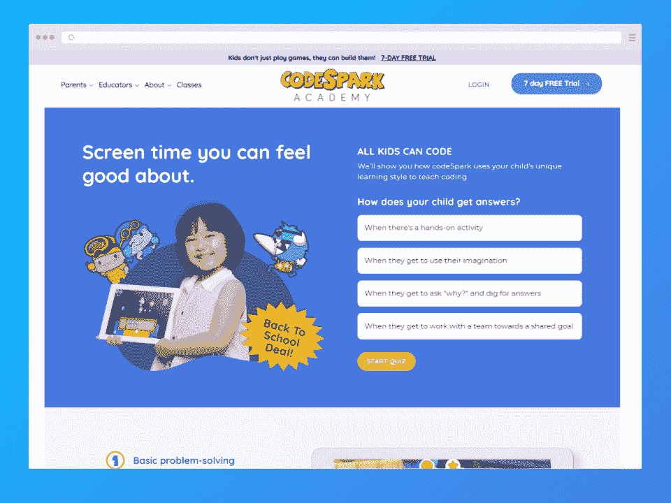
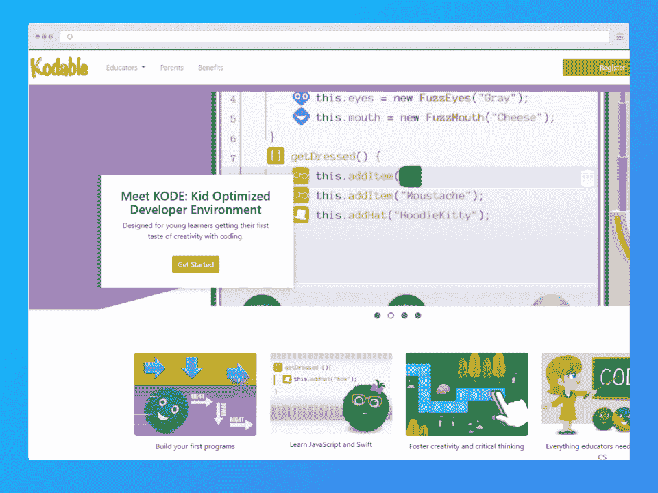
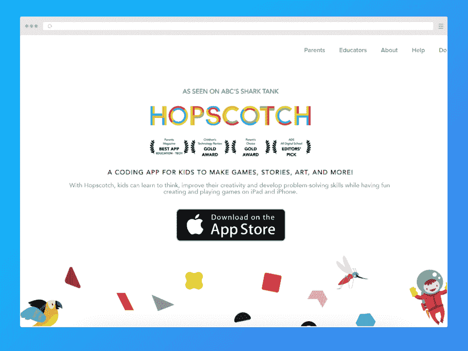
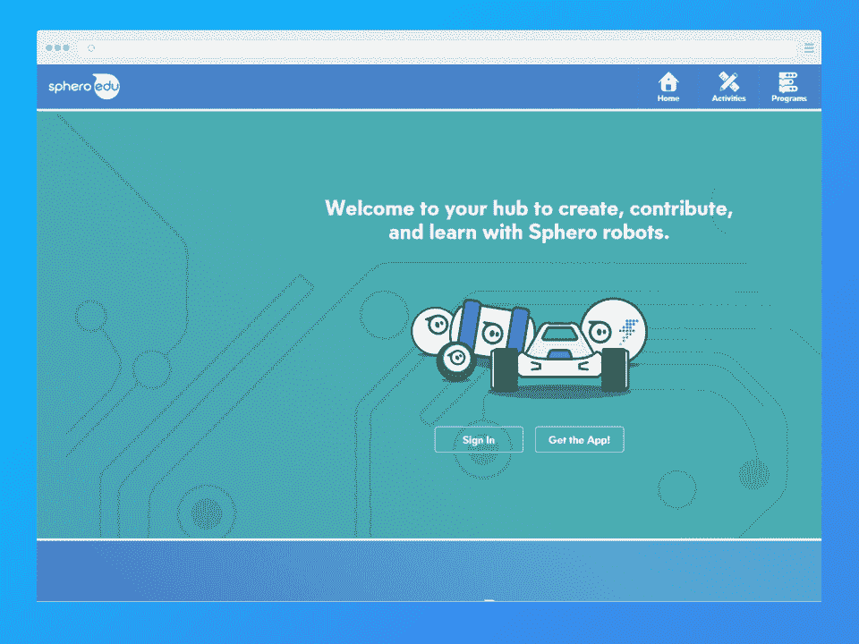
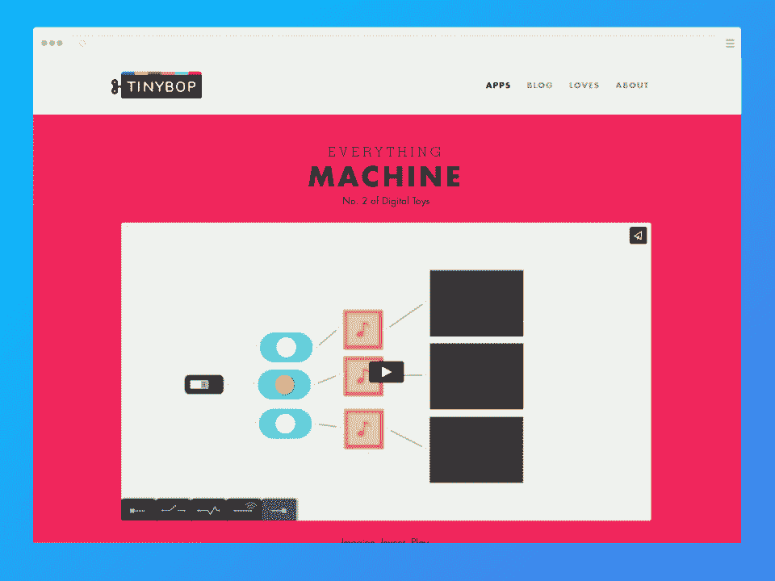
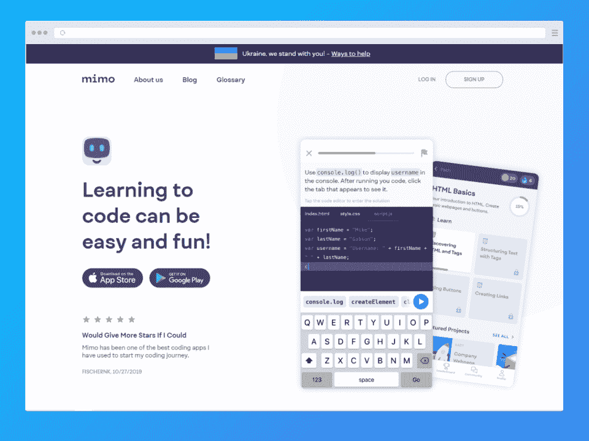
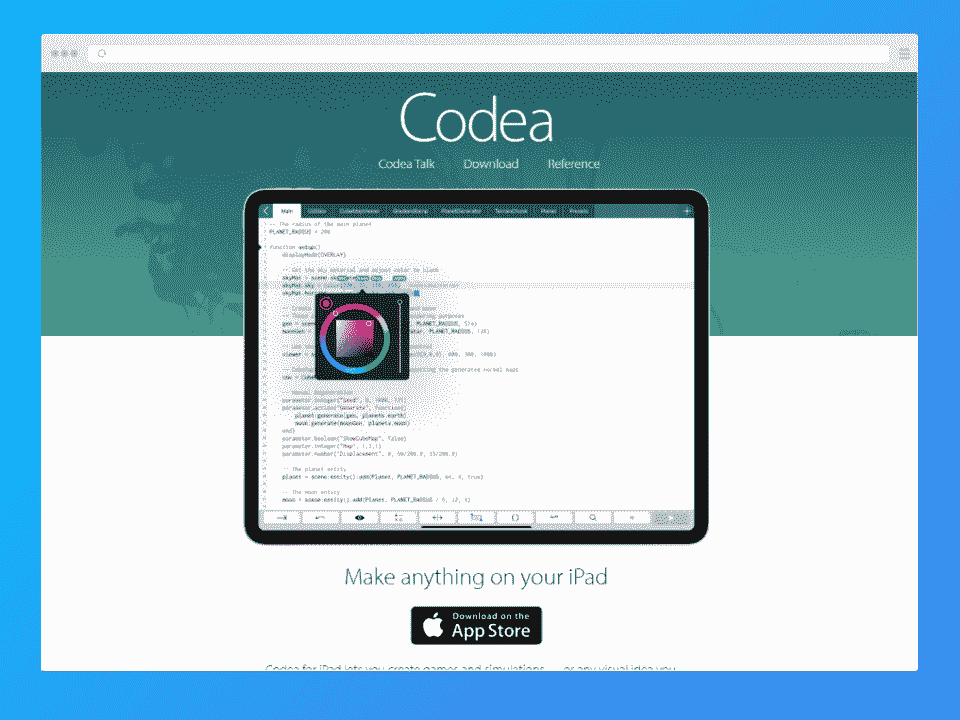
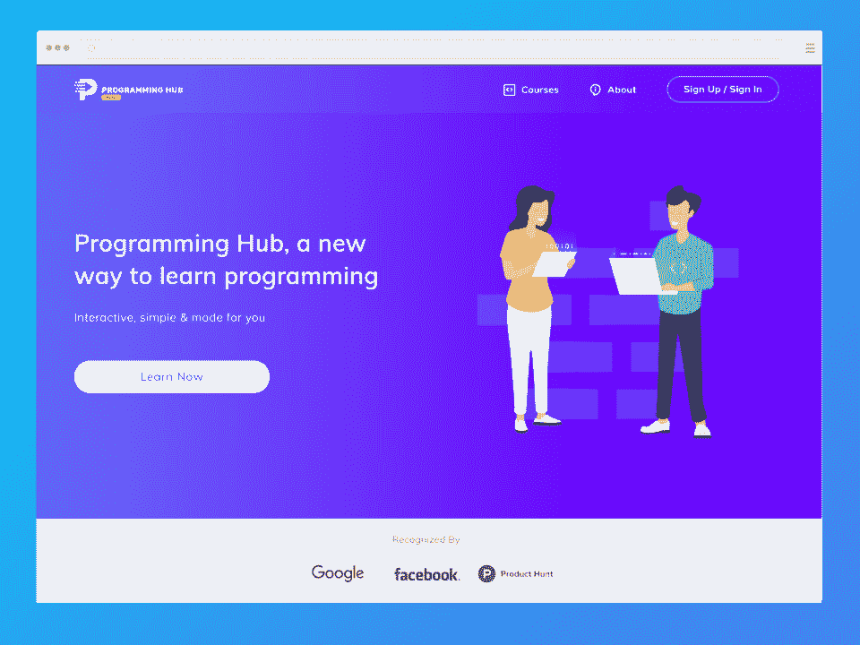

# 10 款适合 4 - 18 岁儿童的最佳编码应用[2023]

> 原文：<https://hackr.io/blog/best-coding-apps-for-kids>

乍看之下，为孩子编码可能感觉为时过早。然而，年轻的头脑非常适合数字技术。想想看，一个蹒跚学步的孩子如何拿起智能手机或平板电脑，并轻松地浏览它，比大多数成年人都要轻松！

今天的孩子在成长过程中获得了先进的计算机技能。此外，随着 STEM 工作主宰现代世界，学校正在强调孩子们的编程技能。但是，有没有一种你应该留意的专门针对孩子的编码软件？不完全是。学习代码很容易，因为有越来越多的儿童编码应用程序。

在你谷歌“儿童 iPad 编码”之前，请不要走开，我们会带你浏览最好的儿童编码应用程序！

## 为什么编码对孩子很重要？

编码已经成为几乎每个行业最受欢迎的技能之一。这种做法有着广泛的应用，该领域的合格专家可以获得几份有声望的工作。对于孩子来说，他们开始学习的时间越早，就越有可能成为该领域的专家。

作为父母，鼓励你的孩子从小学习编程可能是你为他们未来的职业生涯所能做的最好的事情之一。根据美国劳工统计局的数据，计算机和信息技术行业的工作预计在这十年将增长 13%。鉴于我们对数字技术的依赖，很难想象这种趋势不会继续下去，因此这一领域将为您的孩子提供一系列令人兴奋的机会。

有很多编码工具可用，包括免费的儿童编码应用程序。但是一个 8 岁的孩子学习编码的方式可能与一个 24 岁的孩子不同。这就是孩子们编写应用程序的用武之地——工具可以帮助孩子们通过挑战和刺激的游戏来发展基本技能和练习逻辑思维。

## **小学儿童最佳编码应用**

市面上有很多编码应用，但这些是最适合小学学龄儿童的。您的孩子将在学习一系列重要技能的同时获得乐趣。

CodeSpark Academy 是一款屡获殊荣的应用程序，它通过一系列互动活动来教育孩子有关计算机编程的知识。它以可爱的教师角色为特色，他们一步一步地完成谜题和游戏。该应用程序将跟踪您的孩子的进度和难度水平，以保持他们在新的挑战中受到刺激。

*   **价格**:7.99 美元至 119.99 美元的免费+应用内购买
*   **平台:**[iOS](https://apps.apple.com/us/app/codespark-academy-kids-coding/id923441570)&[Android](https://play.google.com/store/apps/details?id=org.codespark.thefoos&gl=US)
*   **年龄** : 4 到 9 岁

[在此查看更多](https://codespark.sjv.io/c/2890636/1002399/12972)

对于喜欢讲故事的孩子来说，Kodable 是一款完美的编码应用。这个应用程序通过一个引人入胜、丰富多彩的故事来鼓励认知发展。它的特点是一个外星人的家庭在一个神秘的星球上着陆。在整个游戏中，孩子们通过使用简单的命令来帮助他们探索迷宫。

这个应用程序教授编码语言 JavaScript 以及其他逻辑概念。

*   **价格:**4.99 美元至 29.99 美元的免费+应用内购买
*   **平台:**[iOS](https://itunes.apple.com/us/app/kodable/id577673067?mt=8)&Windows
*   **年龄:** 5-10 岁

[在此查看更多](https://www.kodable.com/)

对于小学生来说，这无疑是最有趣的编码应用之一。对于喜欢里程碑追踪和赛车的孩子来说，Code Karts 是最好的编程应用之一。顾名思义，玩家通过拖放代码在赛道上引导创造性设计的赛车。孩子们不需要阅读技能来玩这个游戏，难度随着每个里程碑的实现而增加。它具有一个比赛模式，允许玩家测试他们的编码速度和跟踪性能。

*   **价格:**免费+1.99 美元的应用内购买
*   **平台:**[iOS](https://apps.apple.com/us/app/code-karts-pre-coding-logic/id1222704761)&[Android](https://play.google.com/store/apps/details?id=com.edokiacademy.babycoding&gl=US)
*   **年龄:** 3 到 5 岁

[在此查看更多](https://apps.apple.com/us/app/code-karts-pre-coding-logic/id1222704761)

通过帮助可爱的动画机器人解决这个应用程序的难题，孩子们会爱上编码。然而，不要被可爱的图形所迷惑——对于喜欢挑战的孩子来说，这个游戏可能是最好的编码应用程序！如果您想要稍微复杂一点的东西来刺激孩子的思维并建立注意力，这是理想的选择，因为这个游戏需要更长的注意力持续时间。

[在此查看更多](http://lightbot.com/)

## **最适合中学生的编码应用**

这个受欢迎的应用程序教孩子们 STEM 和艺术科目。年轻用户可以使用一系列工具来虚拟地命令和控制大量的插图、设计和有趣的角色。孩子们学习关键的编程概念，并可以将它们应用到自己的项目中。

*   **价格:**免费+7.99 美元/月订阅或 79.99 美元/年订阅
*   **平台:** [iOS](https://apps.apple.com/us/app/hopscotch-programming-for-kids/id617098629)
*   **年龄:** 8-17 岁

[在此查看更多](https://www.gethopscotch.com/)

有了 Sphero，孩子们可以创造自己的景观——他们指挥一系列 Sphero 机器人，使用拖放代码块来创建路径和穿越障碍。如果年轻用户不想写代码文本，他们可以把他们的设备放在一边，享受一个无代码的遥控器。我们的份额？Sphero 是最先进的儿童编程软件之一。

*   **价格:**sp hero 机器人免费+$ 129.99；其他机器人的价格各不相同
*   **平台:**[iOS](https://apps.apple.com/us/app/sphero-edu/id1017847674)&[Android](https://play.google.com/store/apps/details?id=com.sphero.sprk&gl=US)
*   **年龄:** 5-13 岁

[在此查看更多](https://edu.sphero.com/)

Everything Machine 是对编程和工程的一个很好的介绍，它可以让孩子们创建一些很酷的功能，比如声音伪装和停止运动摄像机。这意味着孩子们有能力挑战自己——唯一的限制是他们的想象力。

*   价格: $2.99
*   **平台:** [iOS](https://apps.apple.com/us/app/everything-machine-by-tinybop/id1001244846)
*   **年龄:** 4 岁及以上

[在此查看更多](https://tinybop.com/apps/the-everything-machine)

## **适合高中生的最佳编码应用**

Mimo 是一款非常棒的应用，也是最适合儿童的免费编码应用之一。这个免费的应用程序是提高孩子编码技能的好方法，适合所有年龄的人。Mimo 的日常实践将按照孩子自己的节奏教他们重要的编码概念。Mimo 还编译并运行您孩子的代码，为您提供实时反馈。

*   **价格:**免费
*   **平台**:[iOS](https://apps.apple.com/us/app/mimo-learn-coding-programming/id1133960732)&[Android](https://play.google.com/store/apps/details?id=com.getmimo&gl=US)
*   **年龄:** 4 岁及以上

[在此查看更多](https://getmimo.com/)

Codea 是一个面向青少年的开放式编码应用程序，允许他们使用编程语言 Lua 创建创新的图形、吸引人的视觉效果和交互式游戏。有了这个应用程序，他们可以使用简单的触摸命令编写代码，并轻松地从菜单中加入图像、字符甚至声音。

*   价格: $14.99
*   **平台:** [iOS](https://apps.apple.com/us/app/codea/id439571171)
*   **年龄:** 13 岁以上

[在此查看更多](https://codea.io/)

如果你的孩子准备探索编码的本质，这个应用程序是为他们准备的。他们可以从 20 多种不同的[编程语言](https://hackr.io/blog/best-programming-languages-to-learn)中进行选择，并解决有趣的挑战，让编码变得更有趣、更平易近人。从高中生到成年人，每个人都一定会对使用编程中心进行编码产生兴趣。

*   **价格:**0.99 美元至 74.99 美元的免费+应用内购买
*   **平台:**[iOS](https://apps.apple.com/us/app/programming-hub-learn-coding/id1049691226)&[Android](https://play.google.com/store/apps/details?id=com.freeit.java&gl=US)
*   **年龄:** 13 岁以上

[在此查看更多](https://www.programminghub.io/)

## **父母如何帮助孩子学习编码**

你不需要任何计算机科学或编程方面的经验来让你的孩子对编码感兴趣。最重要的是让他们按照自己的节奏学习和培养对编码的兴趣。使用起来有趣并能给他们成就感的应用将大有作为。

以下是一些在孩子的编码之旅中支持他们的方法:

*   从适合孩子年龄的应用程序开始，让孩子自己设定节奏。
*   通过互动视频和有趣的应用程序让您的孩子对编码感兴趣。
*   随着年龄的增长和技能的提高，他们可以学习更复杂的语言和概念。
*   鼓励你的孩子通过结合编码应用程序以及[教程和课程](https://hackr.io/tutorials/learn-coding-for-kids)来学习。
*   看看结对编程——这让年轻的程序员结成伙伴，鼓励他们一起工作，建立社交和团队合作技能。
*   通过庆祝他们编码旅程中的小里程碑来巩固成就。

[无需编码即可构建移动应用-完整指南](https://click.linksynergy.com/deeplink?id=jU79Zysihs4&mid=39197&murl=https%3A%2F%2Fwww.udemy.com%2Fcourse%2Fbuild-mobile-apps-without-coding-the-complete-guide%2F)

## **关键要点**

为孩子们选择最好的编码应用可能是一项挑战，尤其是如果你没有计算机科学背景的话。但没必要感到不知所措。通过一些研究和对关键概念和应用程序功能的基本理解，您可以支持您的孩子学习编码。

最重要的是让你的孩子享受编码的乐趣。让他们探索自己的兴趣，按照自己的节奏学习。如果你想设身处地为孩子着想，你也可以看看一些针对成年人的编码应用程序！

## **常见问题解答**

#### **1。10 岁小孩能开始编码吗？**

十岁是孩子开始学习代码的最佳年龄。在这个年龄，他们不仅非常好奇，而且许多人已经熟悉基本的计算和编程概念。即使知识有限，10 岁的孩子也有必要的认知发展来理解复杂的想法，并在不同的背景下应用它们。

#### **2。七岁小孩可以学 Python 吗？**

当你的孩子学习编码时，坚持适合年龄的语言和概念是很重要的。Python 是一种高级计算语言，更适合 12 岁及以上的儿童。如果你的孩子比这个年龄小，你最好向他们介绍基于块的编程语言，比如 scratch 和 Blocky。

#### **3。孩子几岁可以开始编码？**

开始学习编码和编程的合适年龄会因孩子而异。这个列表中的一些应用适合四岁甚至三岁的孩子。然而，一般来说，大多数孩子在五六岁左右就可以学习编码。

关键是逐步引入每个编码方面，以免它们变得不堪重负。在这个年龄，他们可以开始学习编码的机制，尤其是在有趣的环境中。只要确保选择一个适合年龄的应用程序——总是检查推荐的年龄范围。

**人也在读:**