# 2023 年最佳编码应用:学习编码的最佳应用是什么？

> 原文：<https://hackr.io/blog/best-coding-apps>

最好的编码应用程序可以帮助你在旅途中学习编码，并在业余时间掌握编程。在早上通勤的时候温习一下你的 JavaScript 或者在休息的时候进行一些模拟练习。编码学习应用程序是在不倾家荡产的情况下为充满活力的职业市场获取有价值知识的绝佳方式。

我们已经编制了 2023 年最佳免费和付费编码应用的完整列表。这些应用将通过互动练习、课程计划，甚至实时反馈和指导来教你如何编码。

## **安卓和 iOS 最佳编码应用**

几乎每个编码应用都是免费下载的，但我们注意到有应用内购买或高级订阅的产品。

大多数编程应用程序都包括多种语言的课程——HTML、JavaScript 和 CSS 是最受欢迎的。虽然其中一些应用完全是移动的，但许多应用也集成了更广泛的网络门户。

在决定最佳编码应用时，寻找:

*   **支持**你想学的语言
*   符合你的时间表的自定进度课程
*   **激励工具**，如竞技团队
*   **一个** **适合你的学习策略**

有些人纯粹通过阅读来学习。但是其他人需要互动和测验。了解自己的学习风格，有助于找到合适的 app。

现在，让我们来看看 Android 和 iOS 的最佳编码应用。

[**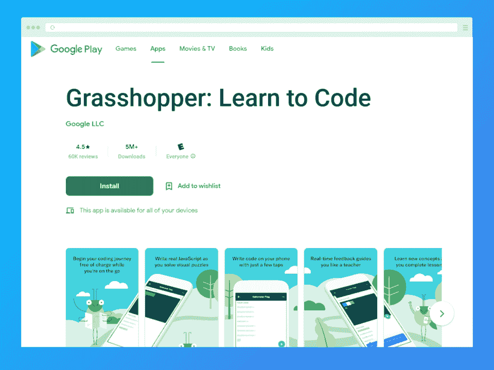**](https://play.google.com/store/apps/details?id=com.area120.grasshopper&hl=en_US&gl=US)

**最适合想要学习更多编程基础知识的初学者**

Grasshopper 是一款适合初学者的完整编码 app。它向用户介绍了一套有趣、快速的游戏，教授基本的编程原理。通过 Grasshopper，程序员将学习如何以引人入胜、有趣的格式编写真正的 JavaScript。此外，程序员将通过实时反馈和全面的课程计划稳步提升技能。

**特性:**

*   视觉难题
*   编码实践
*   实时反馈

**费用:**免费

**下载**:

[安卓](https://play.google.com/store/apps/details?id=com.area120.grasshopper&hl=en_US&gl=US)

[**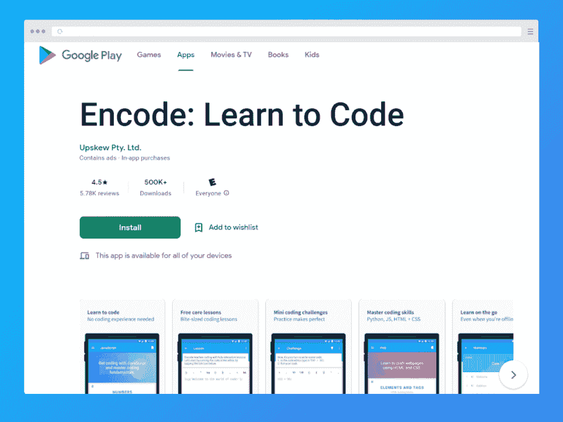**](https://play.google.com/store/apps/details?id=com.upskew.encode)

**最适合发展中的全栈开发人员**

使用这个自定进度的教程应用程序学习编码。Encode 为初学者提供小型编码课程，包括迷你编码挑战。用户可以学习 Python、JavaScript、HTML 和 CSS——成为全栈开发人员所需的一切。

**特性:**

*   自定进度的教程
*   支持多种语言
*   编码挑战

**费用:**免费(提供高级版本)

**下载**:

[安卓](https://play.google.com/store/apps/details?id=com.upskew.encode)

[iOS](https://apps.apple.com/us/app/encode-learn-to-code/id1198851756)

[**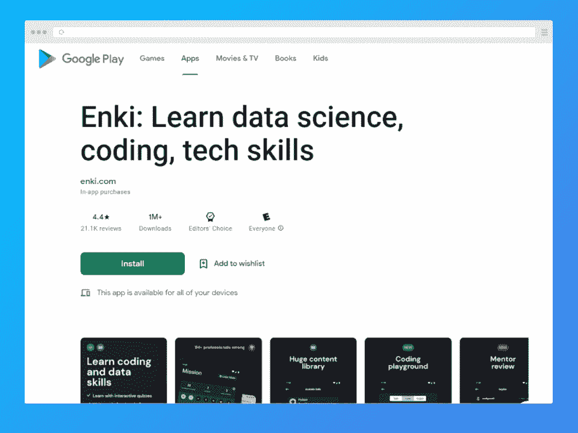**](https://play.google.com/store/apps/details?id=com.enki.insights)

**最适合未来也想学习编程的数据科学家**

如果你对编程和数据科学技能都感兴趣，Enki 是最好的编码应用。这个编码应用程序为所有经验水平提供编码、数据科学和一般技术技能方面的课程。通过编码挑战、互动测验和丰富的内容库进行学习。

**特点**:

*   强大的内容库
*   编码运动场
*   导师评审

**费用:**免费(应用内购买)

你知道吗？

数据科学是当今发展最快的领域之一。到 2026 年，数据科学领域的工作岗位预计将[增长 28%。](https://www.forbes.com/sites/bernhardschroeder/2021/06/11/the-data-analytics-profession-and-employment-is-exploding-three-trends-that-matter/?sh=2fe0595a3f81)

**下载**:

[安卓](https://play.google.com/store/apps/details?id=com.enki.insights)

[iOS](https://apps.apple.com/us/app/enki-coding-learn-to-code/id993753145)

[**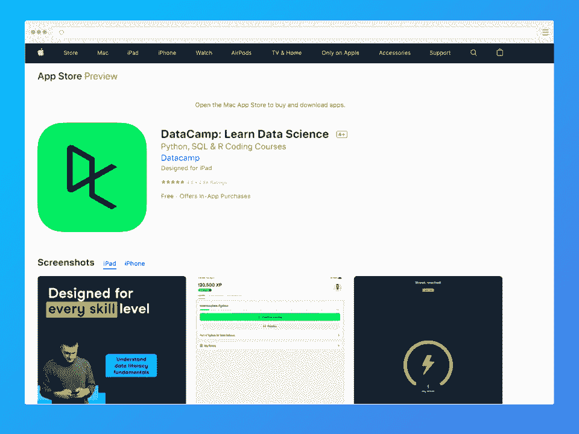**](https://play.google.com/store/apps/details?id=com.datacamp&hl=en_US&gl=US)

*最适合希望通过小课程学习的未来数据科学家*

对于那些想了解更多数据科学的人来说，DataCamp 是另一个选择。它专注于数据科学编程语言和工具，如 R、Python 和 [SQL](https://hackr.io/blog/how-to-learn-sql) 。DataCamp 是专注于数据科学开发人员的优秀应用程序。

**特点**:

*   教授 R、Python 和 SQL
*   主要关注数据科学
*   专为所有技能水平而设计

**费用:**免费(应用内购买)

**下载:**

[安卓](https://play.google.com/store/apps/details?id=com.datacamp&hl=en_US&gl=US)

[iOS](https://apps.apple.com/us/app/datacamp-learn-data-science/id1263413087)

[**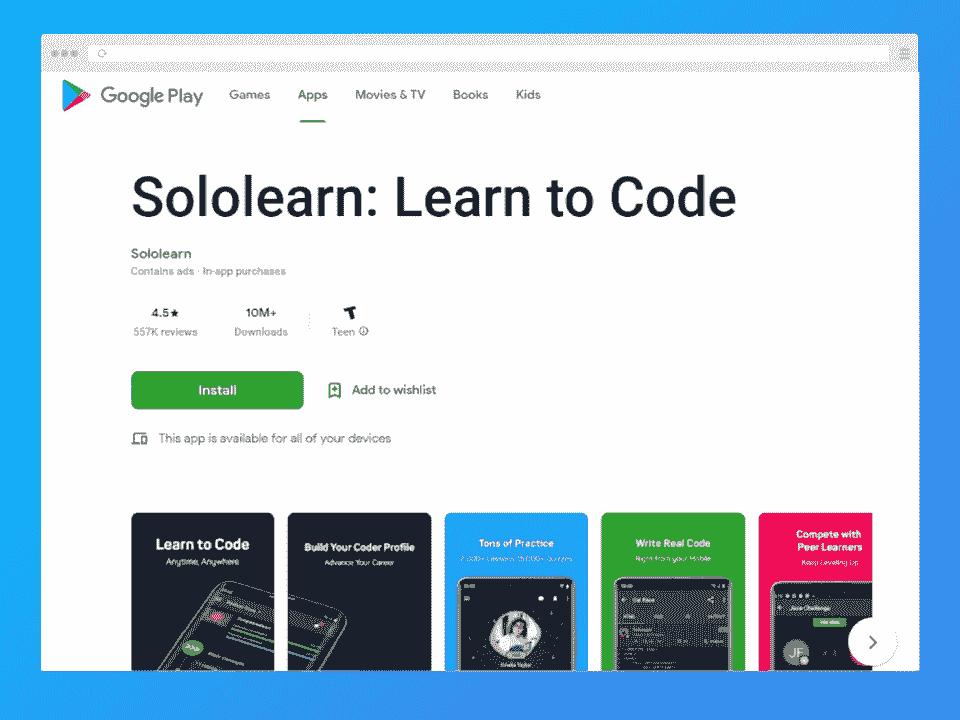**](https://play.google.com/store/apps/details?id=com.sololearn)

**最适合边做边学的程序员**

从头开始学习编码。SoloLearn 是初学者最好的编码应用程序之一，指导用户学习基本的编程基础和原理。课程分成几个部分，再分成几章。测验和活动确保用户在继续学习之前理解内容。

**特性:**

*   练习测验。
*   编码沙盒。
*   同伴学习。

**费用:**免费(应用内购买)

**下载:**

[安卓](https://play.google.com/store/apps/details?id=com.sololearn)

[iOS](https://apps.apple.com/us/app/sololearn-learn-to-code-apps/id1210079064)

[****](https://play.google.com/store/apps/details?id=com.freeit.java)

**最适合想学习多种语言的程序员**

通过编程中心学习 18 种不同的语言，这是一个从初学者到高级编码课程的完整连接。Programming Hub 提供 1，800 个程序，是学习多种语言编码的最佳应用程序之一。通过您的移动设备按照自己的节奏学习。

**特性:**

*   大量可供选择的语言
*   1800 个程序
*   自定进度学习

**费用:**免费(应用内购买)

**下载:**

[安卓](https://play.google.com/store/apps/details?id=com.freeit.java)

[iOS](https://apps.apple.com/us/app/programming-hub-learn-coding/id1049691226)

[**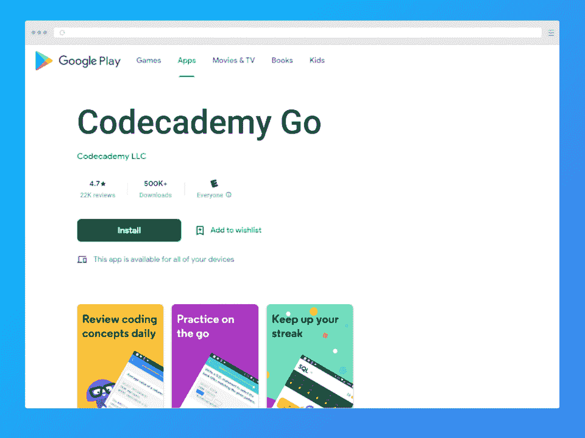**](https://play.google.com/store/apps/details?id=com.ryzac.codecademygo)

**最适合想要随时随地学习的 Codecademy 用户**

通过简单的手机 app 与著名的 Codecademy 平台互动。在 Codecademy Go 上，你可以练习编程，复习功课，保持学习的连续性。请注意，Codecademy 平台的全部功能无法通过该应用程序获得。

**特性:**

*   保持你的连胜。
*   复习功课
*   用抽认卡练习。

**费用:**免费(提供高级订阅)

**下载:**

[安卓](https://play.google.com/store/apps/details?id=com.ryzac.codecademygo)

[iOS](https://apps.apple.com/us/app/codecademy-go/id1376029326)

[**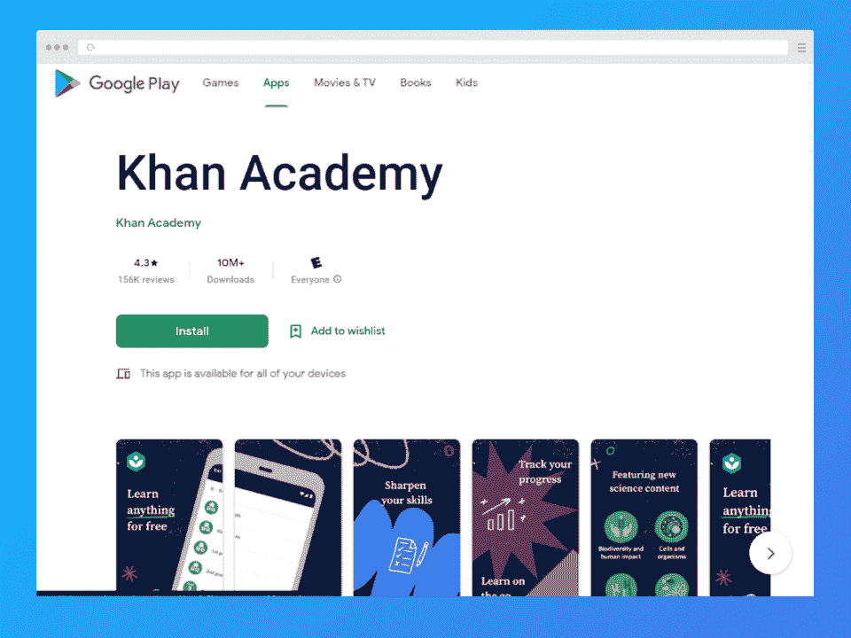**](https://play.google.com/store/apps/details?id=org.khanacademy.android)

**最适合想要学习多种语言和多种学科的开发人员**

Khan Academy 是现有的最强大的编程知识档案之一，也是学习编程的最佳免费应用程序之一。无论你是想学习应用编程还是全栈开发，可汗学院都能满足你。您可以零成本访问大量内容，包括视频教程和练习！

**特性:**

*   免费学习图书馆
*   编程和科学内容
*   多种语言

**费用:**免费

**下载:**

[安卓](https://play.google.com/store/apps/details?id=org.khanacademy.android)

[iOS](https://apps.apple.com/us/app/khan-academy/id469863705)

[**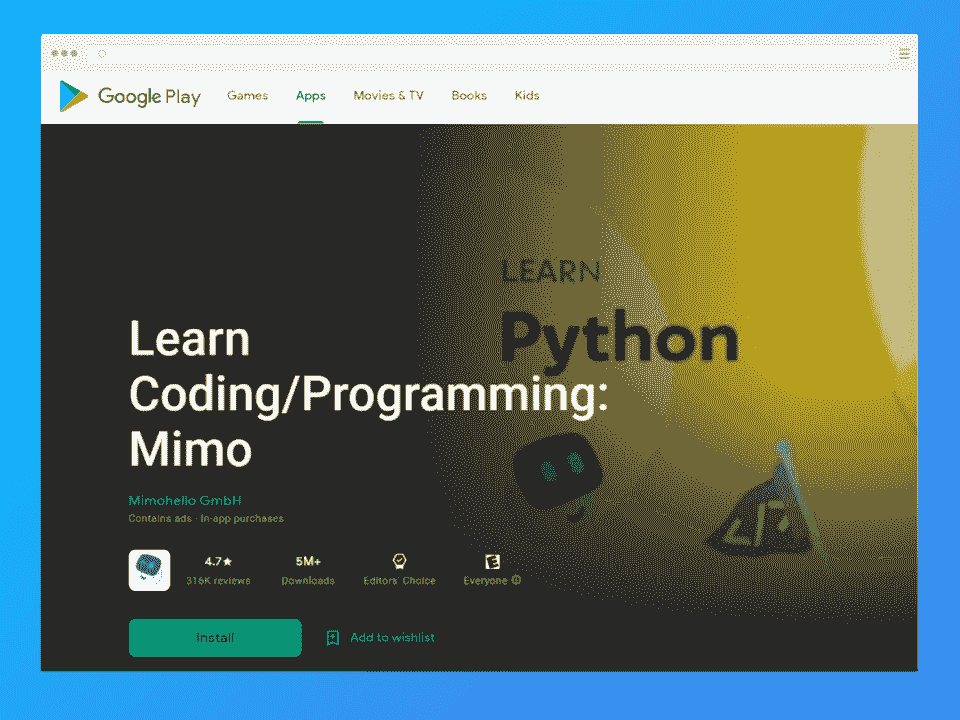**](https://play.google.com/store/apps/details?id=com.getmimo)

**最适合那些想在小型课程中学习的人**

每天只需五分钟就能学会编码。Mimo 拥有令人印象深刻的一系列语言，包括 Python、JavaScript 和 HTML。一个非常容易使用的平台(即使对于初学者来说)，对于那些想一次学一点点的人来说，Mimo 是学习编程的最佳应用程序。Mimo 是广告支持和免费的。

**特性:**

*   只需 5 分钟就能学会编码。
*   JavaScript、Python 和 HTML 课程。
*   广告支持。

**费用:**免费(广告支持)

**下载:**

[安卓](https://play.google.com/store/apps/details?id=com.getmimo)

[iOS](https://apps.apple.com/us/app/mimo-learn-coding-programming/id1133960732)

[**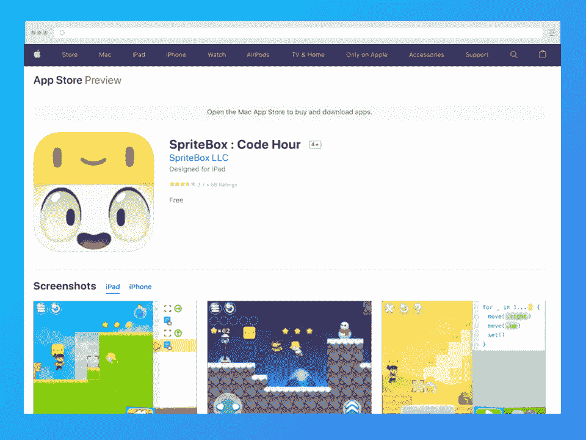**](https://play.google.com/store/apps/details?id=com.lightbot.SpriteBoxCoding&hl=en_US&gl=US)

**最适合想要学习开发游戏的孩子**

跑，跳，编码！SpriteBox 是儿童和内心年轻的成年人最好的编码应用之一。作为一个益智平台，SpriteBox 通过一个令人兴奋的探索性游戏向用户教授基本的编程原则。

**特性:**

*   吸引人的形式
*   教师认可的
*   进步的挑战

**费用:**免费

你知道吗？

儿童在 7 岁时就可以开始编程。编程不仅仅是一项伟大的职业技能；它教孩子们逻辑、数学和耐心。

**下载:**

[安卓](https://play.google.com/store/apps/details?id=com.lightbot.SpriteBoxCoding&hl=en_US&gl=US)

[iOS](https://apps.apple.com/us/app/spritebox-code-hour/id1161515477)

[**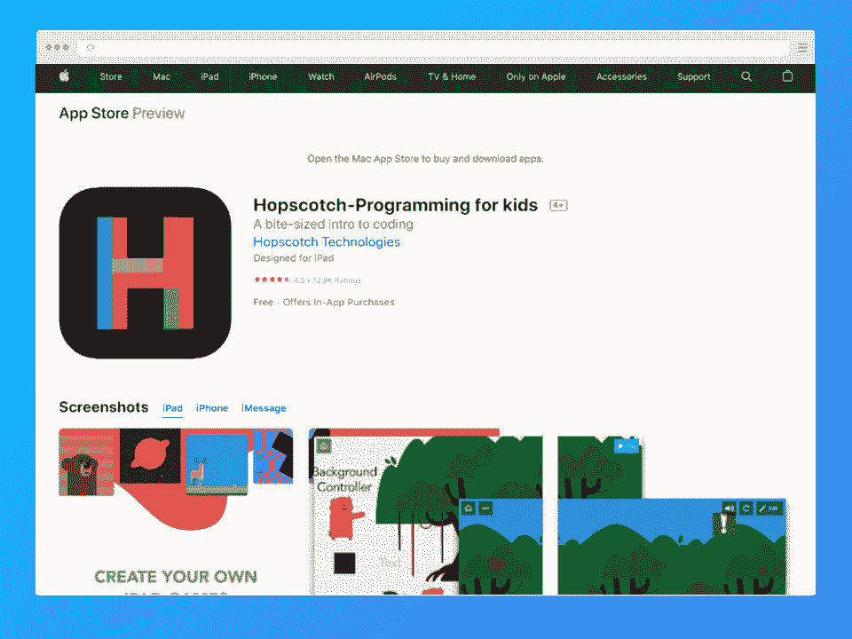**](https://play.google.com/store/apps/details?id=com.mockware.hopscotch&hl=en_US&gl=US)

**最适合想要真正开始开发游戏的孩子**

儿童(和成人)可以通过跳房子*和*学习如何编程，开发他们自己的游戏。跳房子已经被下载了超过 2400 万次，用户用它创造了 3600 万个游戏。这是让孩子们对编程和游戏开发感兴趣的最佳编码学习应用程序。

**特性:**

*   创建和推出游戏。
*   学习编码的原理。
*   专为儿童设计。

**费用:**免费(应用内购买)

**下载:**

[安卓](https://play.google.com/store/apps/details?id=com.mockware.hopscotch&hl=en_US&gl=US)

[iOS](https://apps.apple.com/us/app/hopscotch-make-games/id617098629)

[**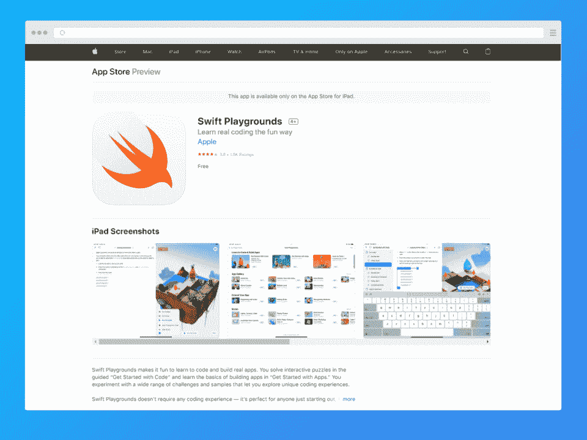**](https://apps.apple.com/us/app/swift-playgrounds/id908519492)

**最适合希望了解 Swift 更多信息的开发人员**

在带有 Swift Playgrounds 的 iPad 上学习 Swift 。Swift Playgrounds 包含几个构建练习，旨在帮助初学者更多地了解 [Swift 语言](https://hackr.io/blog/best-way-to-learn-swift)。在 Swift Playgrounds 中，您可以通过解决交互式难题立即开始开发。请注意，该应用程序只能在 iPad 上运行。

**特性:**

*   引人入胜、基于拼图的形式
*   自由学习
*   专为初学者打造

**费用:**免费

**下载:**

[仅限 iOS(iPad)](https://apps.apple.com/us/app/swift-playgrounds/id908519492)

## **真的可以通过一个 App 学习编程吗？**

是也不是。这些应用程序中的大多数为编程的工作方式和主要的基础知识提供了坚实的基础。你将学习变量、函数和语法。但是大量的编程实际上与实践相关——从头到尾构建编码项目。

当你使用这些编程应用时，可以考虑开发一个端到端的编程项目。这些编程应用会给你创建一个可靠的编程组合所需的知识，但没有什么能取代你通过实际创建和完成一个项目而建立的技能。

[无需编码即可构建移动应用-完整指南](https://click.linksynergy.com/deeplink?id=jU79Zysihs4&mid=39197&murl=https%3A%2F%2Fwww.udemy.com%2Fcourse%2Fbuild-mobile-apps-without-coding-the-complete-guide%2F)

## **结论**

最好的编码应用是那些为你工作的应用。该列表中的所有应用都有免费版本，请在注册订阅或应用内购买之前试用。

编写应用程序将向你介绍编程的基本原理。有些甚至包括交互式元素、模拟和编译器。但最终，你可能需要将你的学习过程转移到笔记本电脑或台式电脑上，以进一步超越。

最好的编码应用程序可以更新你的知识，帮助你在旅途中学习和实践。

如果你发现即使是学习编码的最好的应用程序也不适合你，考虑一种不同的学习方法。也许你会通过尝试一个新项目获得更多的经验。

## **常见问题解答**

#### **1。学习编码最好的 App 是哪个？**

根据流行评论，Grasshopper、Encode 和 Enki 是学习编码的最佳应用程序。如果你是初学者，请选择 Grasshopper 如果你想成为全栈开发人员，请选择 Encode 如果你对数据科学感兴趣，请选择 Enki。

#### **2。免费学编码哪个 App 最好？**

Khan Academy 提供大量免费的编程课程档案，以及其他技术和科学资源。其他优秀的编码应用包括 Grasshopper、Encode 和 Enki。

#### **3。我可以自学编码吗？**

是啊！许多程序员完全是自学成才的。下载一个编程应用程序，立即开始学习。只要每天练习几分钟，你就应该能够学会编程的基本原理。

#### **4。可以免费在手机上学习编码吗？**

有很多免费的手机编码 app，比如 Sololearn、Programming Hub、Codecademy go 等。但是要真正学会编程，你最终需要一台笔记本电脑或台式电脑。

#### **5。学习编程最好的 App 是哪个？**

有很多很棒的编程应用。根据评论，Android 的最佳编码应用程序分为 Encode、Enki 和 Sololearn。iOS 的最佳编码应用是 Mimo，尽管该列表中的其他应用也排名很高。

**人也在读:**