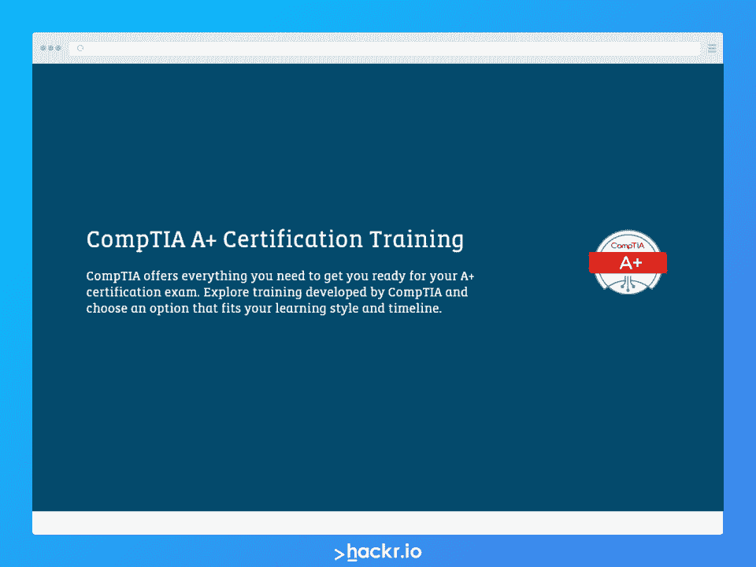
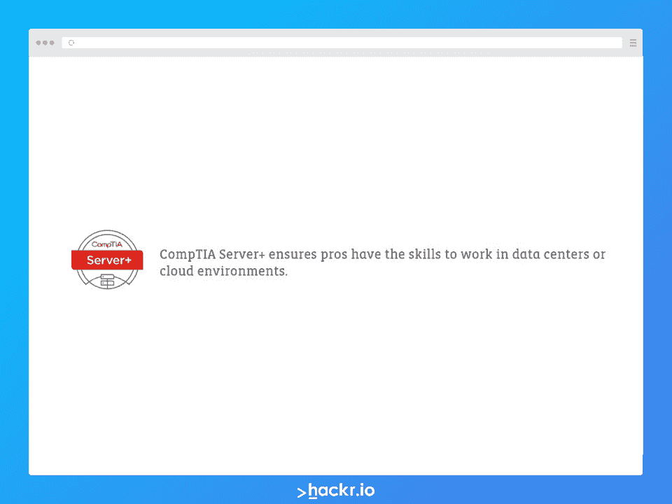
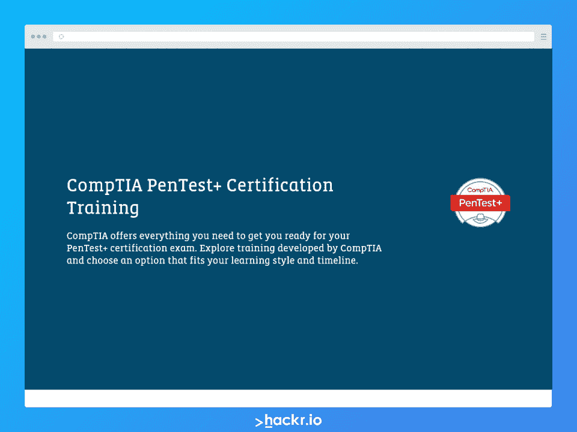
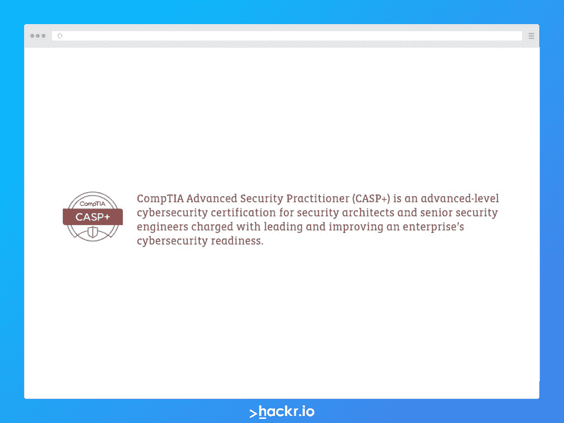
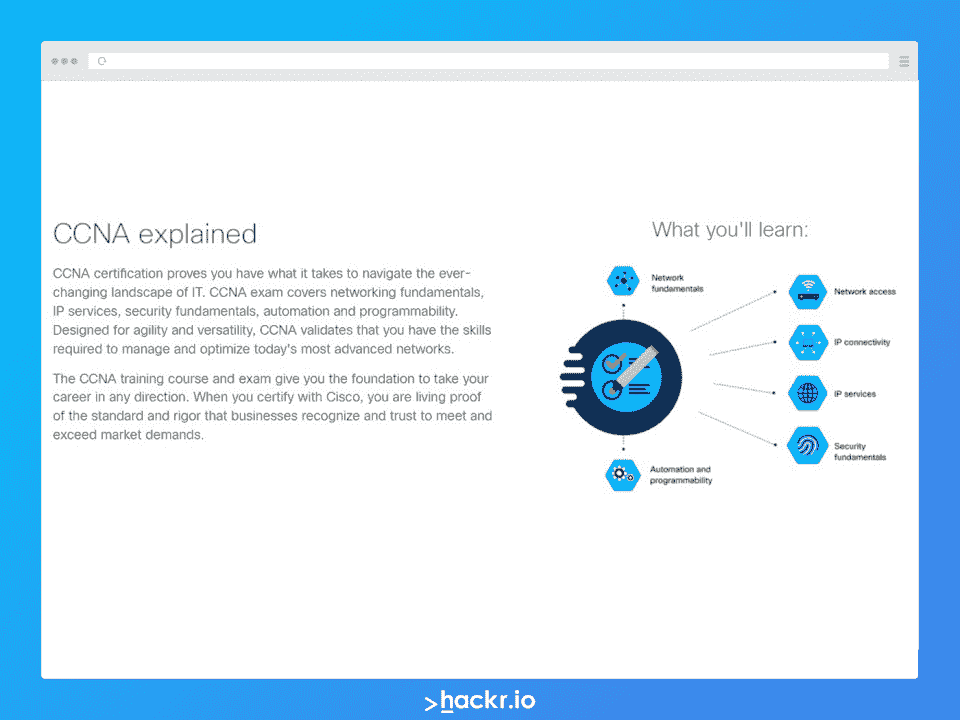
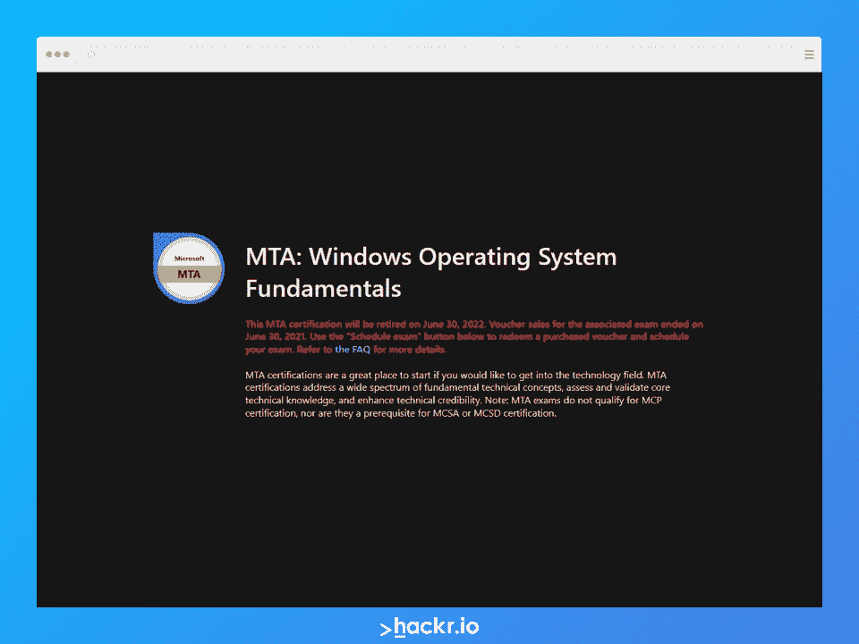
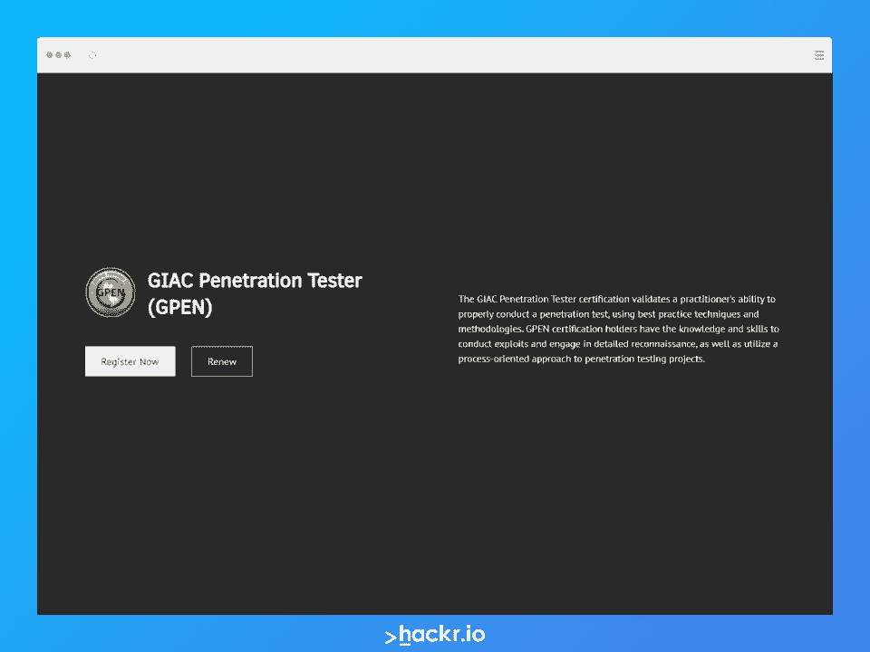

# 6 个最佳 CompTIA 认证计划(和 4 个受欢迎的替代方案)

> 原文：<https://hackr.io/blog/best-comptia-certification-programs>

IT 行业是世界上发展最快、竞争最激烈的市场之一。即使是利基市场——硬件、网络和网络安全——也在不断发展和变化。为了跟上所有的变化，并在你的职业生涯中保持一个理想的候选人，认证是重要的，并在很大程度上保持你的敏锐。

如果你想获得这个 IT 认证，你必须选择一个适合你的经验水平和期望的认证。幸运的是，有几种 IT 认证可以满足各种技能水平的需求。最受欢迎的 IT 认证提供商之一是 [CompTIA](https://www.comptia.org/home) 。

在这里，我们将回顾最佳 CompTIA 认证，详细介绍具体课程涵盖的内容以及它们如何帮助您。我们还提供了 CompTIA 替代产品列表。

## **什么是 CompTIA？**

CompTIA 成立于 1982 年，是一家非营利组织，近 40 年来一直提供严格的行业领先的信息技术认证。他们的目标是为 IT 行业培养一支有能力的员工队伍和可靠的职业道德。

CompTIA 认证项目得到了全球的认可，适合专业人士、初学者以及介于两者之间的任何人。它还提供教育专用的 It 利基，如硬件支持、网络和系统安全。

## **CompTIA A+认证值得吗？**

CompTIA 认证项目的一个引人注目的特点是它们在全球范围内得到广泛认可。雇主们确实会关注这一点，看看你在领域知识方面表现如何。考试并不轻松，因此它显示了对学习和成长的奉献精神。

他们甚至可以为你创造职业生涯，因为有些认证是入门级的。有很多这样的例子，由于努力获得认证，个人从失业变成了高薪工作。毫无疑问，它为你的职业生涯做好了准备。

选择 CompTIA 认证的其他令人信服的理由是:

*   根据最新动态定期更新
*   严谨的话题覆盖面
*   考试安排和学习的灵活性
*   完全基于网络的

##  **应该先挑哪个 CompTIA 认证？**

建议先从 CompTIA A+开始，然后再进行任何其他认证。事实上，CompTIA A+认证是一些认证的先决条件。

CompTIA 认证有一定的等级，A+是起点。专业人士通常会考虑网络+和安全+作为下一步。接下来，您可以选择基础设施途径(Server+、Linux+或 Cloud+)或网络安全途径(PenTest+、CASP+和 CySA+)。

CompTIA 也详细讨论了这一点，所以你可能想阅读他们的 [帖子](https://www.comptia.org/certifications/which-certification) 来了解更多关于 CompTIA 认证之路的信息。

## 哪些 CompTIA 认证很有价值？

没有具体的标准来比较各种 CompTIA 课程的价值，因为这取决于你想从学习中获得什么。

然而，CompTIA A+核心认证几乎是强制性的，因为它为未来的认证奠定了基础。从这个角度来看，CompTIA A+认证被认为是最有价值的。任何未来的认证都可以根据你的目标职业轨迹来决定。

## **CompTIA Project+会过期吗？**

不，CompTIA Project+认证不会过期，CompTIA Server+认证也不会过期。一旦你获得了认证，它对你的一生都有好处！

## 哪个 CompTIA 认证最难/最容易？

这完全是主观的。很多人说 CompTIA A+认证很难，也有人说很容易。然而，一般来说，CompTIA A+和 Security+认证似乎是最难的。难易程度取决于你的能力和你是否有经验。

至于最简单的，这里也有不同的意见，有人说 CompTIA Network+认证是最简单的，也有人说不是。

与其考虑哪个最难或最容易，不如专注于获得 A+认证，并按要求继续其他认证。它们并不太难，你永远也不会超过它们。

## **如何学习 CompTIA 认证？**

CompTIA认证考试有大量 [学习资源，帮助你更好地准备。在线视频、课程材料、书籍和练习考试。我们还在 Udemy](https://hackr.io/tutorials/learn-comptia-certification?q=comptia) 找到了各种各样的 [CompTIA 课程。这些也包括教学视频和实践测试。一个特别的平台](https://click.linksynergy.com/deeplink?id=jU79Zysihs4&mid=39197&murl=https%3A%2F%2Fwww.udemy.com%2Fcourse%2Fnew-comptia-a-2019-certification-1001-the-total-course%2F)[exam compass](https://www.examcompass.com/)在 CompTIA 认证考生中特别受欢迎。

你需要综合使用这些资源来为考试做最好的准备，所以不要仅仅局限于视频课程或阅读材料。结合起来，这应该有助于你在 CompTIA 认证道路上做得更好。

## **6 项最佳 CompTIA 认证**

CompTIA 提供多种认证，分为 5 组:核心、网络安全、基础设施、数据分析和附加专业。

以下是我们挑选的 6 个目前最受欢迎的 CompTIA 认证项目:

[****](https://www.comptia.org/training/by-certification/a)

**认证类型:** 核心

***历练等级:*** 条目

[【CompTIA A+】](https://www.comptia.org/training/by-certification/a)是一个入门级的 IT 认证，它已经成为许多 IT 职业生涯的起点。该认证在全球范围内获得认可，有助于聘用专注于终端管理和技术支持的候选人。

虽然是入门级 IT 认证，但 CompTIA 的 A+认证要求考生成功通过一项考试，该考试包括实践和基于表现的问题，以及理论/优先选择题。

认证相当严格，要求 CompTIA A+考生成功通过两项考试——核心 1 (220-1001)和核心 2(220-1002)——涵盖全面的 IT 和管理主题，包括:

*   基础 IT 基础设施和网络支持
*   变更管理、文档和脚本的最佳实践
*   基于客户端和基于云的软件管理
*   IT 支持的基本安全技能
*   实施基础数据备份和恢复方法
*   多设备配置和设置
*   一系列设备的操作系统配置
*   排除和解决核心 IT 服务和支持问题

CompTIA A+认证候选人被认为是公认的问题解决者，具备处理基础设施支持、安全性和云管理等标准 IT 问题所需的所有基本技能。

那么 CompTIA A+值得吗？当然，特别是如果你想继续 CompTIA 认证清单的话。

**评估的技能:**

*   硬件&网络故障排除
*   移动设备
*   联网
*   操作系统
*   操作程序
*   安全
*   软件故障排除
*   虚拟化&云计算

**适用于:**

*   助理网络工程师
*   数据支持技术人员
*   桌面支持管理员
*   最终用户计算技术人员
*   现场服务技术人员
*   服务台技术人员
*   服务台分析师
*   系统支持专家
*   技术支持专家

| **考试详情** |
| **课程代码** | 220-1001(核心 1)；220-1002(核心 2) |
| **持续时间** | 每次考试 90 分钟 |
| **语言** | 英语、德语、日语、葡萄牙语、西班牙语和泰语 |
| **及格分数** | 900 分中的 675 分(核心 1)；900 分中的 700 分(核心 2) |
| **先决条件** | 至少 9 个月的现场或实验室经验 |
| **评估** | 每门考试 90 道题，分别是 拖放式、多选式(和多选式)、表现式 |
| **有效期** | 3 年 |
| **价格** | $226 每场考试 |

**认证类型:** 核心

**历练等级:** 入门级

下一个条目是[【CompTIA Network+】](https://www.comptia.org/certifications/network)，是一个初学者友好的 IT 认证，旨在为有兴趣担任 IT 支持角色的候选人提供。Network+认证专家接受过安装、配置、维护、管理和排除基本网络基础设施故障的培训。他们的技能包括:

分析并确定现有网络配置的利弊

*   配置和管理各种网络设备
*   [创建虚拟化网络](https://hackr.io/blog/what-is-docker)
*   开发和实施功能齐全的计算机网络
*   修复网络问题
*   使用路由器、交换机等对网络流量进行分段。创建弹性网络
*   CompTIA Network+认证建立在 CompTIA A+认证之上。该认证涵盖了基本的计算机网络技能。此外，CompTIA 建议候选人在学术培训或网络管理或网络支持方面至少有 9 个月的经验。

**学到的技能:**

IT 基础设施

*   网络操作
*   网络安全
*   网络故障排除&工具
*   网络概念
*   **最适合:**

电脑技术人员

*   服务台技术人员
*   是顾问
*   初级网络管理员
*   初级系统工程师
*   网络分析师
*   网络现场工程师
*   网络现场技术人员
*   网络支持专家
*   系统工程师
*   **考试详情**

| **课程代码** |
| N10-007(2022 年 6 月退役)，N10-008 | **持续时间** |
| 90 分钟 | **语言** |
| 英语、日语、德语、葡萄牙语和西班牙语 | **及格分数** |
| 900 人中的 720 人 | **先决条件** |
| CompTIA A+认证(推荐)，至少 9 个月的网络经验。(推荐) | **评估** |
| 90 道题，分别是 拖放、多项选择(和多项回答)和基于表现的 | **有效期** |
| 3 年 | **价格** |
| $329 |  |

**认证类型:** 核心

**历练等级:** 入门级

[CompTIA Security+](https://www.comptia.org/certifications/security)认证是为希望从事网络安全 IT 职业的候选人设计的。它验证候选人执行核心 It 安全任务所需的强制性基础技能。

成为初学者友好型认证并不意味着 Security+严格意义上是针对新手的。它也可以作为使用基于网络的配置文件的专业人员的补充认证。在网络和网络安全方面拥有强大的技能可以大大提高求职者在 IT 就业市场的吸引力。

虽然 CompTIA Security+主要关注网络安全，但它也证明候选人能够熟练处理基于访问控制、网络基础设施和组织安全的任务。CompTIA Security+认证考试的最新修订版于 2020 年 11 月推出。

安全+认证关注以下领域的最新趋势和技术:

入侵检测

风险缓解

*   风险管理
*   威胁管理
*   CompTIA Security+认证考试不仅包括多项选择题，还包括旨在评估决策和解决问题技能的动手实践题。
*   **评估的技能:**

建筑&设计

密码学& PKI(公钥基础设施)

*   身份&门禁管理
*   风险管理
*   技术&工具
*   威胁、攻击&漏洞
*   **最适合:**
*   初级 IT 审计员

网络管理员

*   渗透测试仪
*   安全管理员
*   安全顾问
*   安全工程师
*   安全专家
*   系统管理员
*   **考试详情**
*   **课程代码**

| SY0-601 |
| **持续时间** | 90 分钟 |
| **语言** | 英语、日语、越南语、泰语和葡萄牙语 |
| **及格分数** | 900 人中的 750 人 |
| **先决条件** | CompTIA CompTIA Network+认证，至少 2 年 IT 管理经验，侧重于安全性 |
| **评估** | 90 题其中有 选择题和表现型 |
| **有效期** | 3 年 |
| **价格** | $349 |
|  | ***认证类型:*** 网络安全 |

***历练等级:*** 中级

专为专注于渗透测试和漏洞管理的网络安全专业人士设计的[CompTIA PenTest+](https://www.comptia.org/training/by-certification/pentest)认证评估候选人在渗透测试和漏洞管理方面的能力。这也是重点:

定制评估框架

最佳沟通实践

增强网络抵御安全攻击和威胁的能力

*   发现并报告安全漏洞
*   漏洞评估
*   除了具备应对具有挑战性的 pentest 和漏洞管理场景所需的技术技能外，pentest 认证还能确保候选人具备足够的管理技能，使团队和专业人员之间的信息交流更加容易。CompTIA PenTest+考试结合了动手操作、基于表现的实践题和选择题。
*   成功完成 CompTIA PenTest+认证后，专业人员将能够在不同的环境中测试不同的设备，无论是云环境、移动环境还是服务器环境。
*   **评估的技能:**

攻击&利用

信息收集&漏洞识别

渗透测试工具

*   规划&范围界定
*   汇报&沟通
*   **最适合:**
*   应用安全管理器
*   网络安全分析师

渗透测试仪

*   安全分析师
*   漏洞评估分析师
*   漏洞测试人员
*   **考试详情**
*   **课程代码**
*   PT0-002

| **持续时间** |
| 165 分钟 | **语言** |
| 英语和日语 | **及格分数** |
| 900 人中的 750 人 | **先决条件** |
| 相当于网络+/安全+认证的知识，至少 3 年信息安全或其他相关领域的经验 | **评估** |
| 85 道题，分别是 选择题和表现题 | **有效期** |
| 3 年 | **价格** |
| $359 |  |
| **认证类型:** 网络安全 | **历练等级:** 进阶 |

CompTIA 高级安全从业者，或[CompTIA CASP+](https://www.comptia.org/certifications/comptia-advanced-security-practitioner)，是一种培训网络安全技能的认证。这是 It 安全专业人员中最受欢迎的 CompTIA 认证之一，用于评估候选人在以下方面的高级能力:

企业安全

管理风险和预测

风险分析

企业安全是指保护各种规模的组织免受网络安全威胁的能力。CompTIA CASP+认证专家通常需要提出网络安全解决方案及其实施计划。CompTIA CASP+认证是 ISO 17024 认证，由美国国防部批准，符合 8140/8570.01-M 要求。

*   CompTIA 高级安全从业者认证是为那些希望在该领域保持活跃的专业人士而设计的，而不是完全参与严格管理的相关范例。
*   **评估的技能:**
*   企业安全架构和运营

研发&合作

风险管理

企业安全技术集成

*   **最适合:**
*   应用安全工程师
*   安全架构师
*   安全工程师

技术首席分析师

*   **考试详情**
*   **课程代码**
*   CAS-003(2022 年 4 月退役)，CAS-004
*   **持续时间**

| 165 分钟 |
| **语言** | 英语和日语 |
| **及格分数** | 没有及格分数，只有及格或不及格 |
| **先决条件** | 至少 10 年 IT 管理经验，包括至少 5 年 IT 安全(实际操作技术)经验 |
| **评估** | 90 题其中有 选择题和表现型 |
| **有效期** | 3 年 |
| **价格** | $452 |
|  | **认证类型:** 基础设施 |
| **历练等级:** 中级 | [CompTIA 服务器+认证](https://www.comptia.org/certifications/server) 是为数不多的全面覆盖流行服务器平台的服务器认证之一。拥有此认证可保证持有人具备开发、维护、支持和排除各种服务器软件和硬件技术故障所需的技能和知识。 |

在参加 CompTIA Server+认证考试之前，考生需要有至少 18 个月的 IT 工作经验。还建议获得 CompTIA A+认证。

虽然 CompTIA Server+认证专家可以在任何环境中工作，但他们的目标通常是在云环境和数据中心工作。CompTIA 服务器+认证考试评估候选人:

安全

存储

故障排除

服务器虚拟化

简而言之，CompTIA Server+认证确保候选人拥有承担服务器管理员角色的所有必要技能。

*   **学到的技能:**
*   灾难恢复
*   联网
*   安全

服务器架构

服务器管理

*   存储
*   故障排除
*   **最佳时间:**
*   IT 技术人员
*   服务器管理员
*   服务器支持技术人员
*   服务器技术人员

存储管理员

*   **考试详情**
*   **课程代码**
*   SK0-004(2022 年 1 月退役)，SK0-005
*   **持续时间**
*   90 分钟

| **语言** |
| 英语、简体中文和日语 | **及格分数** |
| 900 人中的 750 人 | **先决条件** |
| CompTIA A+认证，18 至 24 个月的 IT 工作经验 | **评估** |
| 100 道题分别是 选择题 | **有效期** |
| 3 年 | **价格** |
| $329 | **4 种最佳 CompTIA 替代品** |
| 如果您宁愿选择 CompTIA 之外的认证，但仍想获得类似的认证，那么以下 4 个是最佳的 CompTIA 认证选择: |  |
| **认证类型:** 基础设施 | **历练等级:** 中级 |

**提供者:** 思科

## 新重组的 [思科 CCNA 认证](https://www.cisco.com/c/en/us/training-events/training-certifications/certifications/associate/ccna.html) 是全球公认的基于思科解决方案的全面认证。该认证的最新版本于 2020 年推出，将所有之前的 CCNA 认证整合为一个全面的包。

CCNA 或思科认证网络助理是一项助理级别的 IT 认证，重点关注实施和管理 [计算机网络](https://hackr.io/tutorials/learn-computer-networks) 和 IT 基础设施所需的技术和工具。

CCNA 是 CompTIA Server+和 Network+认证的合适替代者。思科 CCNA 认证评估候选人在以下方面的能力:

自动化和可编程性

IP 连接

IP 服务

网络接入

网络基础知识

安全基础知识

*   有几种方法可以准备思科认证考试。您可以依靠思科提供的课程和学习材料，或者使用书籍、在线教程、实践经验等自行准备。或者使用这两种方法的组合。
*   思科甚至为 CCNA 的有志之士提供量身定制的课程。它被称为实施和管理思科解决方案。这是一门综合课程，深入探讨了支持 CCNA 认证所需的每个主题。
*   您还可以加入思科学习网络，选择 CCNA 备考包，参加讲师指导的培训课程，以及访问思科 Press 自学资源，为认证考试做准备。虽然 CCNA 认证不要求任何先决条件，但典型的 CCNA 候选人必须具备:
*   对网络基础知识的透彻理解
*   至少 1 年实施和管理思科解决方案的经验
*   基本 IP 寻址知识

准备参加考试的考生必须首先在 Pearson Vue 注册，因为考试将在其中一个 Pearson Vue 考试中心进行。

**考试大纲:**

自动化和可编程性(10%)

*   IP 连接(25%)
*   知识产权服务(10%)
*   网络接入(20%)

网络基础知识(20%)

安全基础知识(15%)

*   **学到的技能:**
*   思科 ASA 防火墙
*   组播:IPv4 和 IPv6
*   网络工程
*   网络路由和交换
*   运行支持

路由协议

*   **最适合:**
*   网络分析师
*   网络顾问
*   网络安全工程师
*   网络安全经理
*   系统管理员

统一通信工程师

*   网络电话工程师
*   **考试详情**
*   **课程代码**
*   CCNA 200-301 号
*   **持续时间**
*   120 分钟
*   **语言**

| 英语和日语 |
| **及格分数** | 1000 人中的 849 人 |
| **先决条件** | 无 |
| **评估** | 120 题 |
| **有效期** | 3 年 |
| **价格** | $255 |
| [****](https://www.giac.org/certifications/security-essentials-gsec/) | **认证类型:** 核心 |
| **历练等级:** 中级 | **提供者:** GIAC |
| 在提供网络安全和信息安全认证方面，全球信息保障认证或 GIAC 是一个享誉全球的名称。在他们丰富的认证产品中，有 GSEC 或 [GIAC 安全基础认证](https://www.giac.org/certifications/security-essentials-gsec/) 。 | GSEC 是 CompTIA Security+认证的合适替代方案。该认证涵盖了信息安全的基础知识以及与之相关的一些中间概念。GSEC 认证人员适合承担需要主动 IT 安全管理的角色。该认证评估候选人在以下方面的能力: |

访问控制和密码管理

密码术

可防御的网络架构

Linux 安全及相关安全工具和实用程序

网络安全

网络协议

Pentesting

*   风险管理
*   保护窗户
*   漏洞扫描
*   网络通信安全
*   所有 GIAC 认证考试都是监考和网络考试。选择 GSEC 考试时有两个选项:
*   通过 ProctorU 远程监督，或
*   通过 PearsonVUE 进行现场监督
*   一旦您支付了 GSEC 考试的费用，我们会通知您激活认证。您必须在考试启动之日起 120 天或之前参加考试。
*   考生可以自行准备通过 GSEC 认证考试，也可以报名参加培训机构提供的相关课程，或者两者结合。
*   **评估的技能:**
*   密码术

端点安全

*   事件处理和响应

*   Linux 和 Windows 安全

渗透测试

保护网络服务

虚拟化和云安全

*   **最适合:**
*   审计员
*   法医分析师，
*   具有信息系统和网络背景的信息安全初学者
*   IT 工程师/主管
*   操作人员
*   渗透测试仪

安全管理员

*   安全经理
*   安全专业人员
*   **考试详情**
*   **课程代码**
*   GSEC
*   **持续时间**
*   5 小时
*   **语言**
*   英语

| **及格分数** |
| 73% | **先决条件** |
| 无 | **评估** |
| 180 题哪些是 选择题 | **有效期** |
| 4 年 | **价格** |
| $399 或$499(见网站) |  |
|  | **认证类型:** 核心 |
| **历练等级:** 入门级 | **提供者:** 微软学习 |
| [MTA: Windows 操作系统基础认证](https://docs.microsoft.com/en-us/learn/certifications/mta-windows-operating-system-fundamentals/) 是 CompTIA A+认证的绝佳替代方案。MTA 认证是一个很好的入门方式。MTA:视窗操作系统基础确保候选人有所有必要的技能和知识，以建立，管理，故障排除，并在专业设置中更新视窗。 | 为了获得 MTA: Windows 操作系统基础，考生需要参加并通过微软学习的 Windows 操作系统基础考试。顾名思义，它衡量候选人使用最新 Windows 版本的能力。微软学习提供了两种备考方式: |

***在线免费:*** 免费使用的资源，称为学习路径，与考试相关

***讲师指导:*** 为期 3 天的 MTA 付费培训课程，涵盖考试 98-349: Windows 操作系统基础的全部课程大纲

许多求职者通常完成一些 MTA(微软技术助理)认证，以完成 MCSE 和微软的其他中级和高级 IT 认证。Windows 操作系统基础考试有 12 种语言版本。

**评估的技能:**

安装和升级客户端系统(15%至 20%)

管理:

应用(15-20%)，

1.  文件和文件夹(15%到 20%)，以及
2.  设备(15%至 20%)

了解操作系统:

配置(15%至 20%)

*   维护(15%至 20%)
*   **最适合:**

*   管理员
*   数据支持技术人员
*   桌面支持管理员

*   现场服务技术人员

*   服务台技术人员
*   服务台分析师

系统支持专家

*   技术支持专家
*   **考试详情**
*   **课程代码**
*   考试 98-349: Windows 操作系统基础
*   **持续时间**
*   45 分钟
*   **语言**
*   中文(简体)、中文(繁体)、英语、法语、德语、意大利语、日语、韩语、葡萄牙语(巴西)、俄语、西班牙语和西班牙语(墨西哥)

| **及格分数** |
| 1001 人中的 700 人 | **先决条件** |
| Windows 基础知识，Windows 10/11 操作能力 | **评估** |
| 40-60 题哪些是 选择题和多选题 | **有效期** |
| 寿命 | **价格** |
| $127 | [****](https://www.giac.org/certifications/penetration-tester-gpen/) |
| **认证类型:** 网络安全 | **历练等级:** 中级 |
| **提供者:** GIAC | [GIAC 渗透测试仪认证](https://www.giac.org/certifications/penetration-tester-gpen/) ，或 GPEN，是全球公认的来自 GIAC 的 IT 认证。这是 CompTIA PenTest+认证的合适替代方案。GPEN 认证的候选人可以执行: |
| 全面的测试规划、范围界定和调查 | 扫描和利用 |

密码攻击

后开发和旋转

Webapp 笔式测试

拥有 GPEN 认证的个人能够利用渗透测试——最佳实践、技术和方法——来处理各种网络安全和网络安全任务。这些专业人员能够:

进行剥削

进行深入侦察

*   实施面向流程的笔测试方法，并设定一组特定的目标和目的
*   由于网络安全专业人员需要在更大程度上采用试凑法来执行严格的操作，他们需要尽可能多地练习真实场景。GIAC 为 GPEN 的有志之士提供了利用 CyberLive 实现上述目标的机会。
*   CyberLive 测试创建了一个实验室环境，允许候选人利用虚拟机实时执行实际代码和实际程序。这可以让他们更好地准备 GPEN 考试。
*   **评估的技能:**
*   高级密码攻击

域名升级和持续攻击

*   开采基础
*   Kerberos 攻击
*   Metasploit 框架

Pentest 规划

漏洞扫描

Web 应用:注入攻击和侦察

*   **最适合:**
*   审计员
*   道德黑客
*   法医专家
*   渗透测试仪
*   系统安全人员
*   测试人员(红队和蓝队)
*   **考试详情**

**课程代码**

*   GPEN
*   **持续时间**
*   180 分钟
*   **语言**
*   英语
*   **及格分数**

| 75% |
| **先决条件** | 无 |
| **评估** | 82-115 题哪些是 选择题和表现型 |
| **有效期** | 4 年 |
| **价格** | $ 1999 |
| 还有更多这样的认证，我们有一个关于 [最佳渗透测试认证](https://hackr.io/blog/best-penetration-testing-certification) 的指南。 | **CompTIA 认证可以快速提升你的 IT 职业生涯** |
| 最好的 CompTIA 认证能真正帮助你开创或推进 IT 职业。在各种产品中，A+、Network+、Security+、Server+、PenTest+和 CASP+最为突出。通常，个人喜欢选择 2 或 3 个 CompTIA 认证，以成为任何 IT 团队的无价之宝。 | 如果你想促进你的职业发展并跟上最新的 IT 发展，那么参加 CompTIA 认证是绝对值得的。参加一门课程，按照上面描述的方式准备，并通过那些考试！ |
| **人也在读:** |  |
| **Price** | $1,999 |

There are more such certifications, and we have a guide on the [best penetration testing certifications](https://hackr.io/blog/best-penetration-testing-certification).

## **CompTIA Certifications Can Fastrack Your IT Career**

The best CompTIA certifications can really help you initiate or advance a career in IT. Among the various offerings, A+, Network+, Security+, Server+, PenTest+, and CASP+ stand out the most. Typically, individuals like to opt for 2 or 3 CompTIA certifications to become an invaluable addition to any IT team. 

If you’d like to boost your career and stay up to date on the latest IT developments, then it’s absolutely worth taking a CompTIA certification. Take a course, prepare in the manner described above, and pass those examinations!

**People are also reading:**