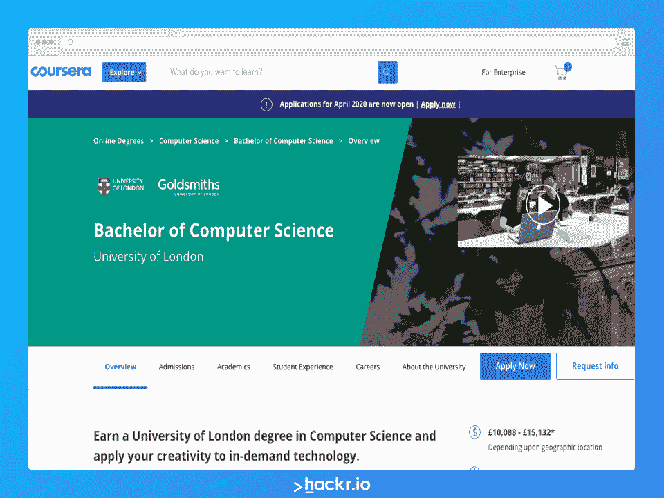
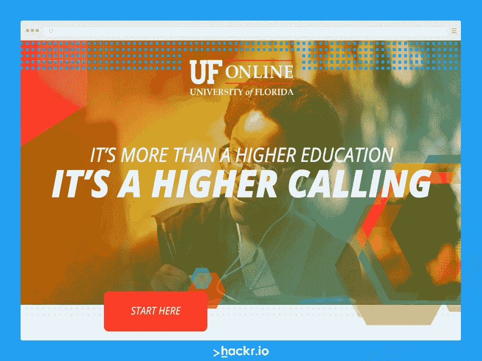
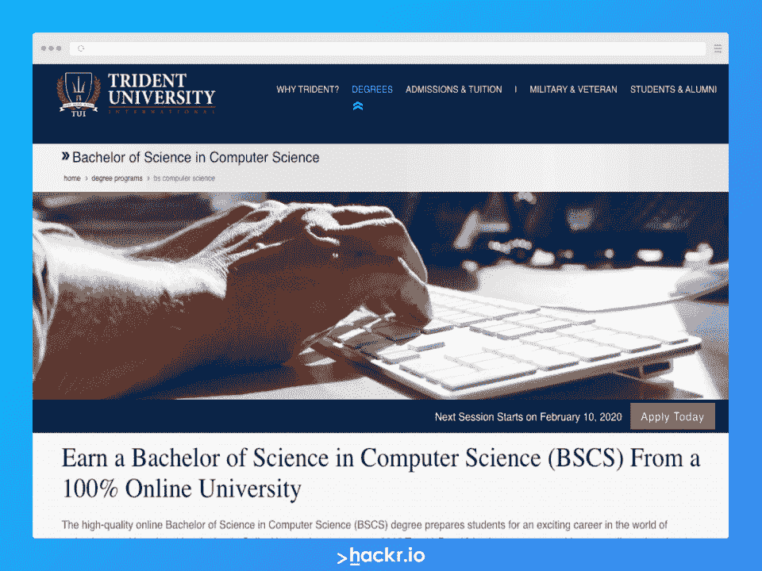
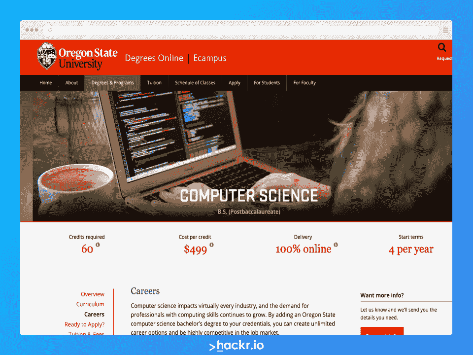
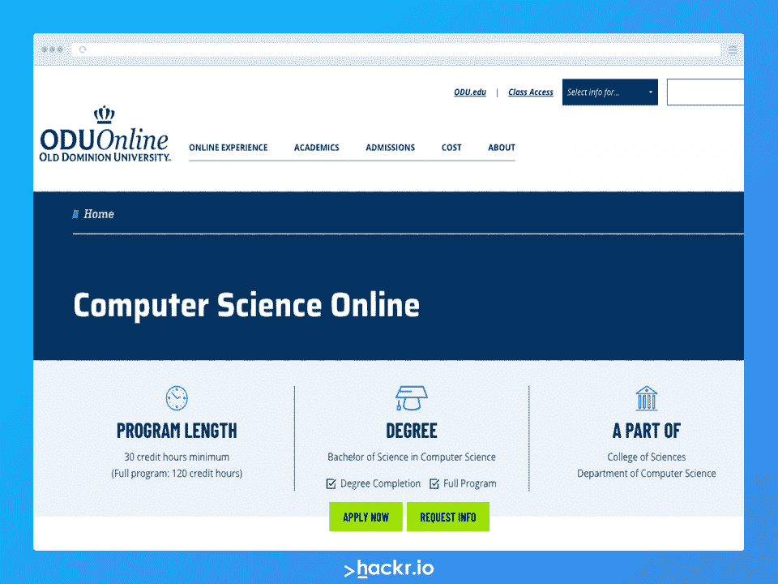
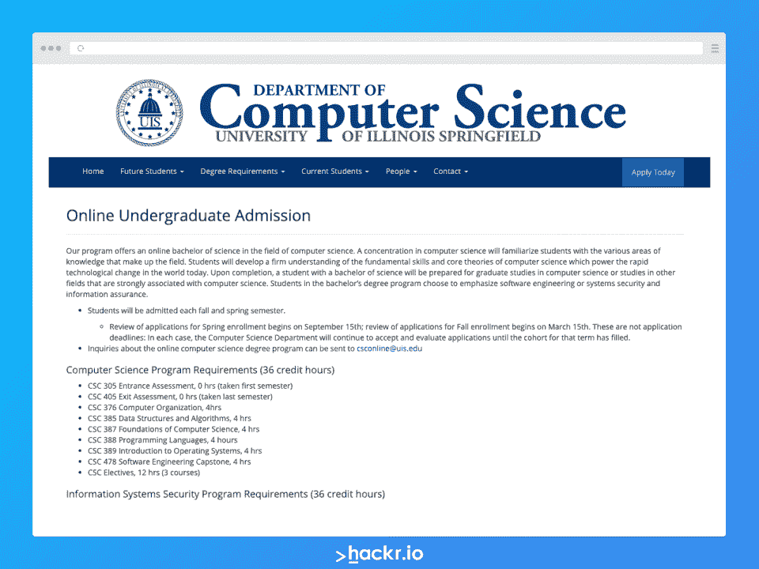
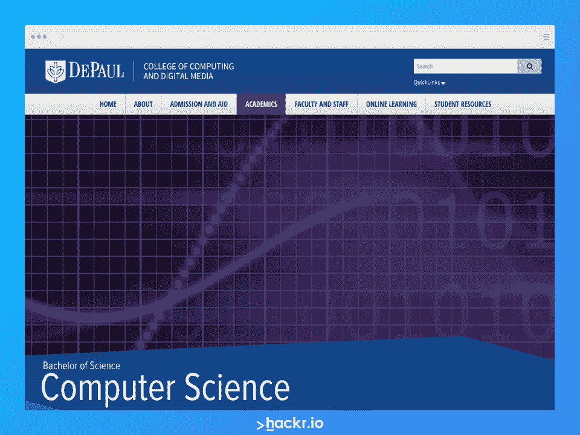
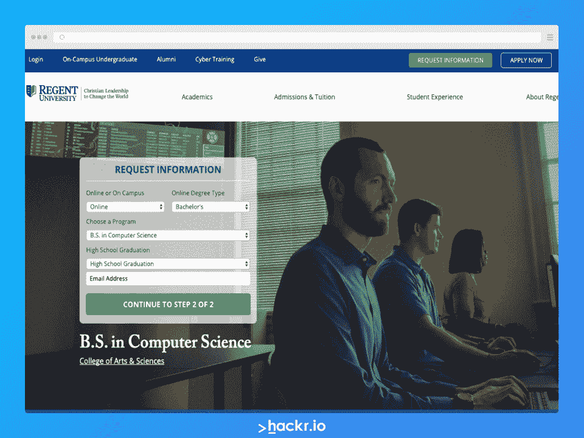
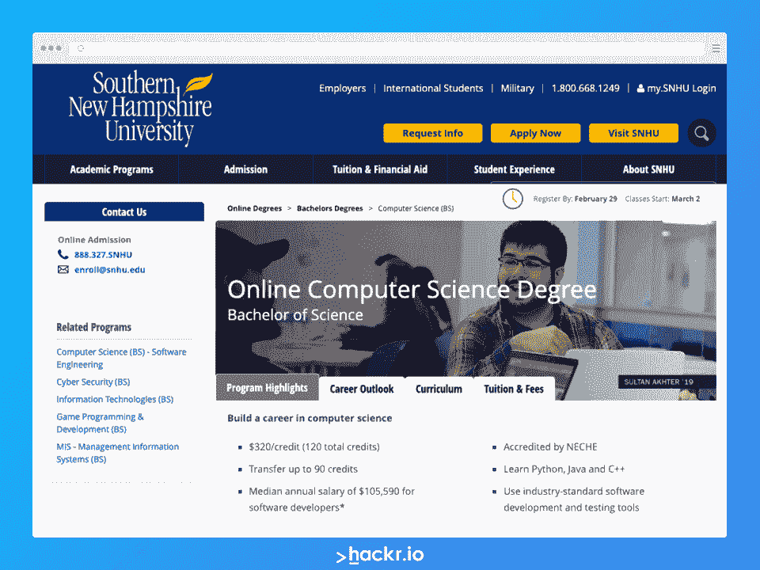

# 十大最佳计算机科学在线课程

> 原文：<https://hackr.io/blog/best-computer-science-courses-online>

Coursera、edX 和 Udemy 等在线学习平台的出现彻底改变了学生接受教育的方式。随着这一趋势，几所知名大学也开始在网上提供课程。这些大学的质量和他们的学习材料使他们成为人们可以获得的最好的在线计算机科学学位。

计算机科学学位为商业、创意产业、教育、工程、医学、科学和许多其他领域的求职者开辟了广阔的职业道路。

应用程序编程、网络管理员、软件工程师、系统分析师和视频游戏开发人员——这些只是拥有离线或在线学位的计算机科学毕业生可以承担的许多角色中的一部分。

## 为什么要攻读在线计算机科学学位？

随着越来越多的学校提供在线课程，在线学位在过去几年里取得了长足的进步。与 COVID 19 之前相比，您通过这些课程获得的认证现在也更加重要。

很明显，在这一点上，计算机科学相关行业是那些拥有 [最强劲增长轨迹和中等工资](https://www.bls.gov/ooh/computer-and-information-technology/home.htm) 的行业之一。如果你想改变你的职业生涯，那么选择在线计算机科学学位将是一个非常有利可图的选择。

就就业而言，你可能想知道在线学位是否有价值。如果你有不错的投资组合和知识，潜在的雇主会很乐意考虑你的申请，而且在评估后者时，在线课程不再是绊脚石。如果你能证明你有能力完成要求的任务，你会得到公平的考虑。

## 在线计算机科学学位对职业有什么帮助？

要不是因为它是在线的，顶尖的在线计算机科学课程实际上和校园课程是一样的。没错，你没有在校园里一样的社交潜力和社交元素，但除此之外，前景还是一样的。你学习同样的概念，参加同样的考试，并在课程结束时获得完全相同的证书。

一些最好的计算机科学在线学校甚至提供计算机科学的研究生学位。因此，无论你是即将进入该领域的准学士学生，还是希望提升技能和薪酬前景的专业人士，在线学位都有其价值。

只要你在一个公认的机构学习课程，在线学位对你的职业生涯会有巨大的价值。

## **职业前景如何？**

简单地说，计算机科学专业毕业生的就业前景明显好于大多数其他专业的毕业生。这是因为我们的世界依靠技术运行，随着我们生活的日益数字化，这种情况不会很快改变。

此外，科技行业的实际职业机会有很大的差异。你可以从事软件工程师、网络安全专家、开发/改进使用人工智能的应用程序，或者从事网站开发。通常，你会发现一些角色会相互融合，尤其是在初创公司，所以如果你愿意，还有转换角色的空间。

一些最受欢迎的计算机科学相关职位是计算机网络架构师、系统分析师、数据库管理员和架构师、软件开发人员、数据科学家以及网页开发人员和设计人员。

## **十大最佳在线计算机科学学位**

以下是 2023 年 10 个最佳在线计算机科学学位项目的列表。这个列表并不详尽，但是为你研究顶尖的在线计算机科学项目提供了一个很好的起点。

| **课程详情** |
| **注册** | 英国枢密院 |
| **所需学分** | **360** |
| **每信用成本** | 取决于你生活在发展中国家还是发达国家$ 515(A 级/发展中)$ 773(B 级/已开发) |
| **浓度** | 数据科学、游戏开发、机器学习和人工智能、物理计算和物联网、用户体验、虚拟现实、网络和移动开发 |
| **持续时间** | **3-6 年** |

伦敦大学与 Coursera 合作，为来自全球各地的有志之士提供计算机科学学士学位。该机构长期以来一直向 180 多个国家提供远程教育。根据你的地理位置，在线学位的持续时间从 3 年到 6 年不等。

伦敦大学提供的计算机科学学位有助于学生掌握所需的计算机技能，培养解决复杂现实问题的能力，并完善他们与生俱来的创新和创造力。

计算机科学理学学士学位遵循一种基于实践项目的方法，帮助学生发展所需的技术技能，以便进入他们选择的领域从事理想的工作。学生通过 Coursera 平台注册在线学位访问讲师，由 UoL 大学的教师和助教提供持续的评估和支持。

**亮点:**

创建一个课程文件夹，展示给当前或潜在的雇主

*   了解最新的行业应用和实践
*   众多专业
*   每年两次，分别在四月和十月
*   不符合直接入学学术标准的考生可获得基于表现的录取
*   一系列严格的作业和项目
*   多样化的课程材料，从初级科目到专业的深入科目
*   你可以在这里报名参加课程。

**课程详情**

| **注册** |
| 南方学院和学校协会(SACS) | **所需学分** |
| 70 | **每信用成本** |
| $T129.18 | **浓度** |
| [查看地点](http://info.ufonline.ufl.edu/lp/general) 了解更多详情 | **持续时间** |
| 4 年 | 佛罗里达大学在线提供的计算机科学学士学位为计算机科学打下了坚实的基础。该课程为学生作为计算机专业人员的就业做准备，同时也提供了选择其他非计算机领域课程的自由。后者涵盖了从人文学科、外语、社会和行为科学的强文科教育。 |

佛罗里达大学的计算机科学学士学位是专门为无法参加传统校园课程的学习者设计的。注册在线学位的学生获得了与那些离线注册的学生完全相同的学术选择。

用友在线提供的计算机科学理学学士课程还可以灵活地修改课程，以满足注册考生的学术实力、兴趣和技能。

这个学位非常适合那些希望获得计算机科学技术教育的学生，他们可以灵活地以证书或辅修的形式学习非技术课程，并且花更少的钱来获得这个学位。

**亮点:**

获得用友专属职业服务

专职学术顾问

*   灵活的学术选择
*   最实惠的机构之一，提供大量的经济援助和奖学金项目
*   要求基础课程至少 29 个学分，核心课程至少 35 个学分，主要选修课至少 6 个学分
*   支持课程等同要求
*   世界级的教员
*   [可以在这里报名参加课程。](http://info.ufonline.ufl.edu/lp/general)

**课程详情**

**注册**

| 西部学校和学院协会(WASC) |
| **所需学分** | 120 |
| **每信用成本** | $405(标准)，$330(合伙) |
| **浓度** | 网络安全、人机交互、信息安全与技术、网络与数据通信、信息系统维护 |
| **持续时间** | 4 年 |
| 三叉戟大学发现自己是获得商业、教育、健康和科学在线学位的最佳大学之一。它不仅提供本科课程，还提供研究生和博士课程。 | 三叉戟大学被认为是最好的军事友好型大学之一，它遵循以稳健的学习模式为中心的教学方法，提供实体校园式的支持服务、灵活性和高质量的教学。 |

三叉戟大学的计算机编程理学学士学位要求总共 120 个学分，提供计算机及相关技术的全面知识，重点是人机交互、信息安全以及信息系统的技术、网络和数据通信与维护。

你可以选择普通学位，也可以选择网络安全专业学位，重点是黑客、测试和信息安全。

**亮点:**

主动学习法

17:1 的师生比

一个互动的在线学习社区

*   完全在线，第一所获得地区认证的大学
*   为数不多的提供网络安全专业的机构之一
*   鲁棒学习模型
*   可用的转移政策
*   [可以在这里报名参加课程。](https://www.trident.edu/bachelors-degree-online/computer-science-degree-online/)

*   

**课程详情**

**注册**

西北大学委员会

| **所需学分** |
| 60 | **每信用成本** |
| $499 | **浓度** |
| [查看地点](https://ecampus.oregonstate.edu/online-degrees/undergraduate/computer-science/careers.htm) 了解更多详情 | **持续时间** |
| 1-4 年 | 位于科瓦利斯的俄勒冈州立大学是西海岸顶尖的研究型大学之一。它被卡耐基基金会归类为“社区参与大学”。OSU 获得了可观的研究经费，这使它成为研究人员的理想选择。 |
| OSU 大学的计算机科学学士课程由电气工程和计算机科学学院提供。虽然研究生学位不要求之前有计算机科学或工程经验，但候选人必须拥有任何学科的学士学位。 | 来自 OSU 的灵活的计算机科学学位可以在 1 年和 4 年内完成。它要求你完成 60 个学分，这是计算机科学学士学位通常要求的一半。 |

**亮点**

所有俄勒冈州立大学的教师都是计算机科学行业的专家

美国和其他 40 个国家提供在线课程

计算机科学学士学位提供 4 种不同级别的加速度

一年内就能完成学位

*   作为电子校园课程的一部分，该大学提供了 900 多门课程
*   可用的传输选项

*   [可以在这里报名参加课程。](https://ecampus.oregonstate.edu/online-degrees/undergraduate/computer-science/careers.htm)

*   

**课程详情**

**注册**

南方学院和学校协会学院委员会

**所需学分**

| 120 |
| **每信用成本** | $356(州内弗吉尼亚居民)，$407(州外学生) |
| **浓度** | [查看地点](https://online.odu.edu/programs/computer-science-degree-online) 了解更多详情 |
| **持续时间** | 4 年 |
| 旧自治领大学是弗吉尼亚最大的大学之一。2019 年，该大学的总入学人数超过 24，000 人。ODU 是美国最大的在线/远程教育提供商之一，拥有 168 个学位项目，其中 70 多个是在线模式，提供本科和研究生课程。旧自治领实际上是英格兰国王查理二世给弗吉尼亚起的绰号。 | ODU 大学的计算机科学学士学位是一个高质量的本科项目，由计算机科学系理学院维护和管理。尽管是一所私立大学，计算机科学学士学位课程是最实惠的在线计算机科学学位课程之一。 |
| 除了详细介绍计算机科学的基础知识，ODU 大学的计算机科学学士学位课程还涵盖了数据科学、计算机网络、信息安全、[编程范例](https://hackr.io/blog/programming-paradigms)以及其他热门的计算机科学子领域和姐妹领域，以及工程方法论和实验技术。 | **亮点:** |

比较实惠

所有在线课程都遵循 ODU 的常规教学日程

在 60 多个国家/地区提供

可从任何位置访问的课程材料

现役军校学生本科学费优惠

*   许多 ODU 大学的教授是他们各自领域的国家学会和专业组织的成员

*   [也可以在这里报名参加课程。](https://online.odu.edu/programs/computer-science-degree-online)

*   [****](https://pc.fsu.edu/computer-science/program-b.s.)
*   **课程详情**

**注册**

南方学院和学校协会学院委员会

**所需学分**

120

| **每信用成本** |
| $180(州内居民)，$686(州外学生) | **浓度** |
| 信息安全、数据通信/网络、计算机和网络系统管理、理论计算机科学和软件工程 | **持续时间** |
| 2-4 年 | 佛罗里达州立大学是美国排名前 50 的研究型大学之一。公共空间和赠地大学的主校区位于佛罗里达州的塔拉哈西，提供计算机科学的在线学士学位。 |
| FSU 提供的计算机科学学位是一个完全在线的项目，相当于它的离线课程。它要求学生拥有相当于 AA 的学位。全日制学生可以在 2 年内完成 BSCS 项目，而非全日制学生可能需要 4 年才能完成。 | 计算机科学学士学位的课程包括分布式系统和网络，主要接触 C、C++和汇编语言的编程，较少接触其他编程语言、系统设计和操作系统，以及其他科目。 |
| FSU 在 1989 年创造了第一台 ETA10-G/8 超级计算机，这是计算机科学领域的一项显著成就。它是佛罗里达州唯一一所拥有国家实验室的大学。该大学的目标是在未来几年内成为排名前 25 的国家公立研究型大学。 | **亮点:** |

美国排名前 50 的研究型大学

通过指定导师提供持续支持

弹性课程期限

ODL(远程学习办公室)，提供在线学生支持，评估&测试服务，并管理课程评估

BSCS 项目包括一个嵌入式数学辅修课程

*   [可以在这里报名参加课程。](https://pc.fsu.edu/computer-science/program-b.s.)

*   [****](https://csc.uis.edu/online-undergraduate-admission)
*   **课程详情**
*   **注册**

高等教育委员会(HLC)

**所需学分**

120

**每信用成本**

| $358.50 |
| **浓度** | [查看地点](https://csc.uis.edu/online-undergraduate-admission) 了解更多详情 |
| **持续时间** | 4 年 |
| 伊利诺伊大学春田分校是一所由高等教育委员会(HLC)认证的公立文科大学。它是伊利诺伊大学系统的一部分。UIS 遵循开放路径，这是一个 10 年周期，侧重于质量保证和持续改进。 | 除了 27 个本科学位和 20 个研究生学位，UIS 还提供公共管理博士学位。伊利诺伊大学被公认为中西部顶尖的公立学校之一。UIS 于 1999 年开始提供在线学位，这可以被视为在线学习的先驱。 |
| UIS 授予的计算机科学学士学位要求考生学习两个学期的 Java 编程和一个学期的微积分、离散或有限数学以及统计。这些先决条件可以通过伊利诺伊大学斯普林菲尔德分校的普通教育要求获得。 | 国土安全部和 NSA(国家安全局)称 UIS 是信息保障/网络防御教育的国家学术卓越中心。因此，这所顶级大学还提供信息系统安全学位。学生可以通过选修课同时获得该学位和 BSCS 学位。 |
| **亮点:** | 提供最实惠的计算机科学学位课程 |

最早采用在线学习模式的人之一

获得 NSA 和美国国土安全部的认可

学习信息保障(IA)相关课程的学生可能有资格获得美国国防部(DoD)的额外拨款和奖学金

曾经是两所高年级和研究生大学之一的 UIS 大学现在接受新生、转学生和研究生

[可以在这里报名参加课程。](https://csc.uis.edu/online-undergraduate-admission)

*   [****](https://www.cdm.depaul.edu/academics/Pages/BS-in-Computer-Science.aspx)
*   **课程详情**
*   **注册**
*   高等教育委员会(HLC)

**所需学分**

120

**每信用成本**

$655

| **浓度** |
| [查看地点](https://www.cdm.depaul.edu/academics/Pages/BS-in-Computer-Science.aspx) 了解更多详情 | **持续时间** |
| 4 年 | 德保罗大学是美国最大的天主教大学。它因注重基于服务和体验学习的高质量教学而受到认可和称赞。杜被认为是最懂技术的教育机构之一。它为学生提供了大量的跟踪和组织工具以及在线支持服务。 |
| 然而，德保罗大学是获得计算机科学学士学位费用较高的学院之一，但它是值得的，因为该大学以提供最先进的技术而闻名，同时通过其备受赞誉的计算机科学系教授计算机科学的基础和高级方面。 | 德保罗大学的计算机科学学士学位完全是在线提供的，不是自定进度的。尽管如此，学生可以在方便的时候自由观看和评论在校园里拍摄的讲师。 |
| 除了普通学位，德保罗大学还提供两个专业的 BSCS 课程。完成 BSCS 学位需要两个顶点项目，一个在大二，一个在大四。 | **亮点:** |
| 促进学生合作项目的计算机科学学会 | 备受推崇的计算机科学系 |

许多计算机科学学院的研究项目——属于人工智能、科学计算、软件工程、视觉计算、人机交互等等——都是由 NSF(国家科学基金会)资助的

全球 100 家最具创新性的信息技术组织之一

美国最多样化的学生团体之一

Studio X 是一个支持计算机和人文学科协同研究的教师发展中心，该中心的讲座和活动对公众免费开放

两个顶点项目

*   [可以在这里报名参加课程。](https://www.cdm.depaul.edu/academics/Pages/BS-in-Computer-Science.aspx)

*   [****](https://www.regent.edu/program/bs-in-computer-science/)
*   **课程详情**
*   **注册**
*   南方学院和学校协会学院委员会
*   **所需学分**

120+

**每信用成本**

$395(全日制)，$450(非全日制)

**浓度**

| [查看网站](https://www.regent.edu/program/bs-in-computer-science/) 了解更多详情 |
| **持续时间** | 4 年 |
| 在线计算机科学学位的另一个好选择是摄政大学。私立基督教研究大学位于弗吉尼亚州，提供副学士学位和博士学位，并提供广泛的在线课程，包括 BSCS。 | 这所大学有电影、法律和政治领域的知名校友。它多次被 OEDB 和美国新闻列为获得学士学位的前 20 所院校之一。 |
| 摄政大学提供的计算机科学学士学位非常实惠，该课程的学费是美国 15 个最实惠的课程之一。 | 在 BSCS 的常规课程中，学生还学习探索与计算机科学和技术职业相关的伦理和社会挑战，提高处理效率，以及解决复杂的计算问题。 |
| **亮点:** | 负担得起的学费 |
| 学生转学政策可用 | 顶级教师 |

各领域知名校友

[可以在这里报名参加课程。](https://www.regent.edu/program/bs-in-computer-science/)

[****](https://www.snhu.edu/online-degrees/bachelors/bs-in-computer-science)

**课程详情**

*   **注册**
*   新英格兰高等教育委员会
*   **所需学分**
*   120

**每信用成本**

$320

**浓度**

数据分析、信息安全、STEM 项目管理、软件工程

| **持续时间** |
| 4 年 | 南新罕布什尔大学的计算机科学学士学位课程强调计算机软件的设计和开发，为学生量化和解决现实世界的问题做准备。SNHU 大学的计算机科学学士学位包括使用行业首选的软件开发和测试工具，总学分为 120 学分。该机构得到了新英格兰高等教育委员会的认可。 |
| 您将学习如何应用协作策略、创建投资组合、使用 [敏捷软件方法学](https://hackr.io/blog/rapid-application-development-model) 设计和开发软件、进行全栈 web 开发以及保护信息系统。 | 这个在线计算机科学学位非常适合学习用户体验原则和全栈开发人员的最佳编码实践，以便选择自己的职业，例如网络分析师、 [、数据工程师](https://hackr.io/blog/how-to-become-a-data-engineer) 、数据库管理员、多语言程序员等等。 |
| **亮点:** | 与行业标准保持一致，采用顶级的开发和测试工具，如 Cucumber with Maven、Eclipse、Junit Testing、Python 和 OpenGL。 |
| 学位课程 | 通识教育班，包括基础、探索和综合课程 |
| 获得 IT 认证和证书的转移积分 | 可用的数学学分 |

提供基于云的虚拟环境，以展示最先进的技术

[可以在这里报名参加课程。](https://www.snhu.edu/online-degrees/bachelors/bs-in-computer-science)

计算机科学的在线学位极大地有益于职业生涯

*   这总结了我们的最佳在线计算机科学学位课程列表。当然，除了你的课程之外，你可以用额外的材料来加强你的计算机科学学习，但是这些课程提供了全面的教育。补充学习材料的示例包括 YouTube 课程、针对 [数据科学](https://hackr.io/tutorials/learn-data-science?ref=blog-post) 和 web 开发等主题的书面材料、研讨会等等。
*   拥有网络学位完全有可能进入计算机科学相关领域，除了你自己，没有什么能阻止你。最好的在线计算机科学学位不仅仅是为你的职业生涯做准备，而且和离线课程一样好。这完全取决于你付出的努力。
*   祝你学习顺利！
*   **人也在读:**
*   Math credits available
*   Offers cloud-based virtual environments to offer state-of-the-art technology exposure

[You can sign up for the course here.](https://www.snhu.edu/online-degrees/bachelors/bs-in-computer-science)

## **Online Degrees for Computer Science Hugely Benefit Careers**

That sums up our list of the best online computer science degree programs. You can reinforce your computer science learning with additional material other than your coursework, of course, but these courses offer a thorough education. Examples of supplementary learning material include YouTube lessons, written material for subjects like [data science](https://hackr.io/tutorials/learn-data-science?ref=blog-post) and web development, seminars, and much more.

It’s absolutely possible to break into computer science-related fields with an online degree, and there’s nothing stopping you but yourself. The best online computer science degrees more than prepare you for a career and can be as good as an offline course. It’s all down to the effort you put in.

Good luck with your learning!

**People are also reading:**