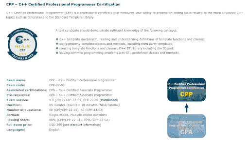
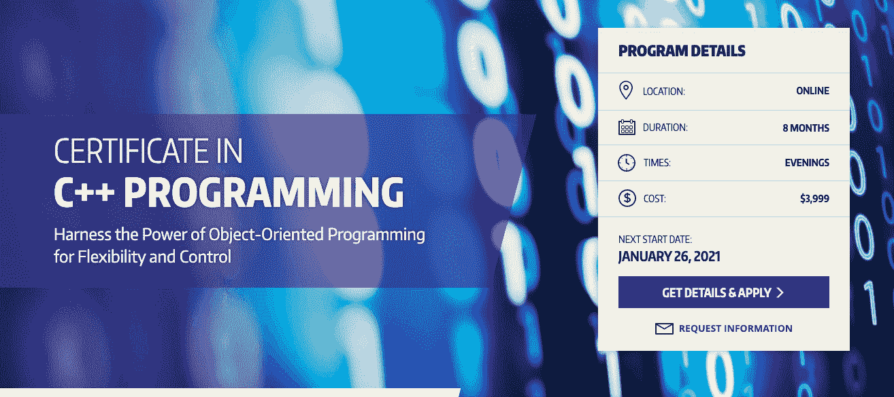
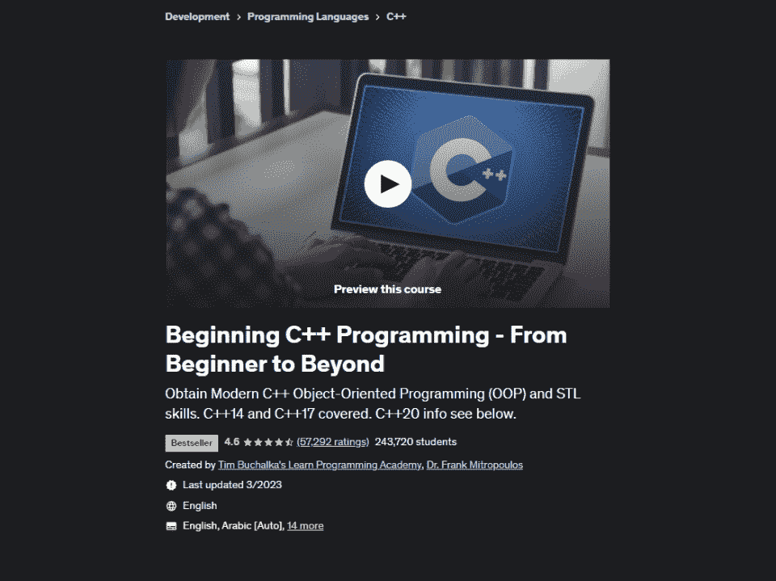
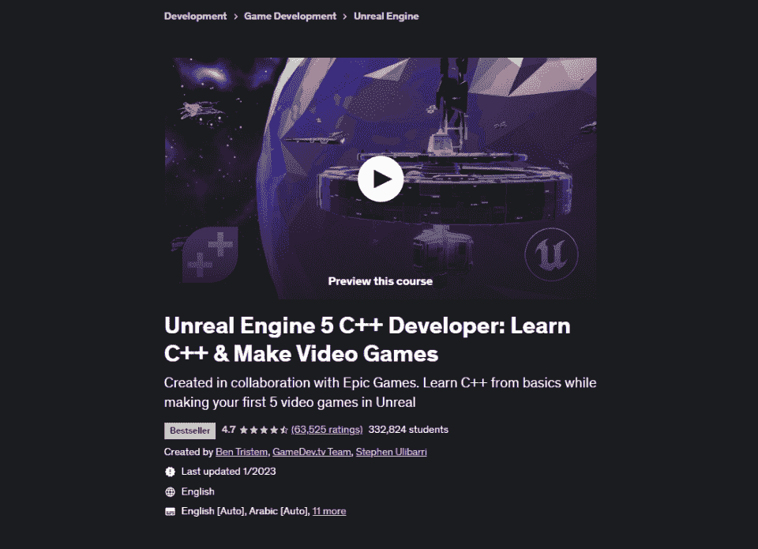

# 2023 年最佳 C++认证[更新]

> 原文：<https://hackr.io/blog/best-cpp-certification>

## **什么是 C++认证？**

[学习 C++](https://hackr.io/tutorials/learn-c-plus-plus?ref=blog-post) 的方法有很多。你可以通过在线课程、博客、书籍、真实项目、实践经验、课堂辅导等方式来学习。

嗯，每个人都这样做！

这就是为什么你需要一些东西来证明你的价值，而不仅仅是经验。

认证是你在特定课程中的经验和知识的证明。例如，甚至在去面试之前，一份被有效机构认可的证书将为你赢得比其他简历更好的分数。对于不同层次的知识有不同的认证，例如，如果你是初学者，你可以获得基础认证，如 CPA 或 Star 认证(我们将在后面讨论这些)，如果你想要更高级的知识，比如游戏目的或构建复杂的硬件，你将需要更多的学习，而不仅仅是指针和控制语句——这是对你的高级知识进行验证或证明的地方。

## 为什么需要 C++认证？

随着 Java、Python 和 PHP 等流行语言作为通用语言受到越来越多的关注，有人可能会认为 C++将会过时。

但是，这是错误的！

C++是专门用途所必需的，比如为硬件、嵌入式系统、游戏编写代码:基本上，只要你想要更快的性能和直接的内存操作。C++程序员在各种职位上都很吃香，比如视频游戏设计师、计算机程序员、嵌入式软件工程师等等。因此，C++证书会给你带来更好的工作机会，在职业和薪水方面更好的发展，对你技能的认可，最重要的是，比其他和你有相似经历的候选人更有竞争力。

## **最佳 C++认证**

C++学院颁发的证书:

C++ Institute 在世界范围内得到国际标准的认可，他们的认证可以让你在顶级公司获得更好的就业前景。该认证还会给你必要的技能和信心来处理复杂的项目。

该协会提供两种级别的认证:

这个 C++证书表明你精通 C++的基础知识，能够独立编写程序。有了这个证书，你应该对计算机编程、标准 C++库的使用、基本数据类型、解决代码问题等概念了如指掌。这门课程没有先决条件。以下是认证的详细信息:

**考试详情**

*   姓名:C++认证助理程序员
*   代码:CPA
*   语言:英语
*   问题数量:55
*   时长:考试 65 分钟，保密协议/教程 10 分钟
*   格式:多项选择，单项选择
*   及格分数:80%
*   价格:295 美元

**考试大纲**

*   编译过程、高级编程语言、变量、标量数据类型、基本 I/O 操作和流等基础知识。
*   控制语句、逻辑和浮点运算符
*   函数:声明和调用函数、参数传递、默认参数、内联函数、重载函数
*   数据访问和异常处理:字符串、对象、方法、属性、命名空间、异常
*   基本概念:类、对象、构造函数、组件、友元类、重载
*   单一和多重继承
*   多态、抽象类、虚方法
*   自定义异常:抛出/捕获异常

可以在这里报名[。](https://cppinstitute.org/cpa-c-certified-associate-programmer-certification)

这是下一级认证，前提是注册会计师认证。它是一个专业证书，证明你对高级 C++概念的知识，如模板、标准模板库、第三方模板、高级 STL 输入输出操作等。作为高级认证持有者，您应该能够创建和解决复杂的算法，并了解各种技术、习俗和高级库函数。费用是 295 美元，你可以在第一次失败后 15 天重考。你可以访问[官方 C++ CPP 页面](https://cppinstitute.org/cpp-c-certified-professional-programmer)获取更多关于这个认证的信息。

**考试详情**

*   姓名:C++认证专业程序员
*   代码:CPP-22-02
*   语言:英语
*   问题数量:40
*   时长:考试 65 分钟，保密协议/教程 10 分钟
*   格式:多项选择，单项选择
*   及格分数:70%
*   价格:295 美元

**考试大纲**

*   模板:语法，函数模板和类模板，使用模板的问题，模板的正确使用
*   STL 顺序容器:向量，队列，列表，堆栈，队列，优先级 Q
*   STL 关联容器:set/multiset & map/multimap 以及 API
*   非修改 STL 算法:find_if，count_if，for_each，search，equal 等。
*   修改 STL 算法:转换、交换、复制、反向复制、填充、替换等。
*   对 STL 操作进行排序:像 binary_search、equal_range、random_shuffle 等排序算法。
*   stl 合并操作:合并算法，如 merge，min_element，max_element 等，集合的 STL 操作
*   STL 实用程序和函数库
*   STL 高级输入输出:文件输入输出，控制台输入输出，字符串输入输出格式

可以访问[官方 C++ CPP 页面](https://cppinstitute.org/cpp-c-certified-professional-programmer)获取样题和其他学习资料。

可以在这里报名[。](https://cppinstitute.org/cpp-c-certified-professional-programmer)

## **其他 C++认证**

Star C++认证是美国强烈推荐的认证，可为您提供该领域的深入知识。认证课程从 OOPS 的基础开始，然后转移到更高级的主题，如 C++数据结构、指针、输入输出操作、异常处理等等。这是一门独特的课程，由行业专家设计，帮助你获得正确的编程技能，找到你梦想的工作。该认证被全世界接受。对于初学者和中级程序员来说是很好的。

**考试详情**

*   考试代码:C++ S07-111
*   语言:英语
*   时长:2 小时
*   问题类型:多项选择
*   问题数量:60
*   及格分数:70%

**考试大纲**

*   探索编程基础和 OOP 概念
*   C ++编程基础
*   C++中的标记、表达式和控制结构
*   管理输入和输出数据
*   数组
*   C++中的类和对象
*   在 C++中实现 OOPS 概念
*   构造函数和析构函数
*   功能
*   实现结构和联合
*   两颗北极指极星
*   文件管理
*   C++中的模板
*   异常处理
*   字处理
*   使用预处理器指令

可以在这里报名[。](https://starcertification.org/Certifications/Certificate/cpp)

[【PCE】](https://www.pce.uw.edu/certificates/c-plus-plus-programming)(专业与继续教育)，来自华盛顿大学，这是最杰出的公立大学之一。它提供各种学科的认证，可以大大提高你的简历的价值。C++认证计划是一个为期 8 个月的详细计划，涵盖了 C++编程的所有方面，从基础到高级。您应该对 C 编程语言基础有很好的理解，并且在高级编程语言方面有至少 2 年的编程经验，才能参加该认证。该课程是同类课程之一，由来自微软和西门子等机构的行业专家讲授。如果你觉得费用对你来说有点难以承受，大学还根据某些条件提供一些[经济资助](https://www.pce.uw.edu/help/registration-costs/financial-aid)。虽然今年的注册已经结束，但是这门课程仍然在我们的列表中，因为你可以在明年一月申请。

**课程详情**

*   持续时间:8 个月
*   模式:在线
*   结构:

1.  第一季度:简介(1333 美元)
    1.  第二季度:中级(1333 美元)
    2.  第三季度:高级(1333 美元)
    3.  成本-所有 3 个级别 3999 美元

*   **课程大纲**

基础课程:

哎呀原则

*   [C 中的数据类型](https://hackr.io/blog/data-types-in-c) ++
*   以对象为中心的程序设计、建模
*   C & C++和 C++扩展的比较
*   类构造、消息、对象
*   设计、编写和调试 C++程序。
*   缩小现实世界的项目
*   中级课程(9 周):

例外

*   STL 容器
*   迭代器
*   STL 算法
*   课程模板
*   功能模板
*   设计模式(单例、代理、模板方法、原型、观察者)
*   C++ 17 主题(元组类型、函数对象的多态包装、线程支持、线程本地存储和正则表达式)
*   高级课程:

面向接口和抽象的编程

*   职责分离
*   标准库深度:流、容器、迭代器、算法
*   智能指针
*   设计模式:原型，迭代器，装饰器，其他
*   右值引用和移动语义
*   Constexpr:广义常量表达式
*   基于哈希的无序标准集合
*   可以在这里报名[。](https://www.pce.uw.edu/certificates/c-plus-plus-programming)

[由于这是一门入门课程，因此没有任何先决条件。您将学习一些基本概念以及下一级(高级)课程的高级概述。](https://edx.sjv.io/c/2890636/1598007/17728?u=https%3A%2F%2Fwww.edx.org%2Fcourse%2Fintroduction-to-c-3)

**课程详情**

课程长度:4 周，每周 3-5 小时

*   价格:免费，认证证书 99 美元
*   语言:英语，有英语视频记录
*   研究所:微软
*   **课程大纲**

C++语言基础和语法

*   编写 C++函数
*   概述您将在中级和高级课程中学到的内容
*   可以在这里报名[。](https://edx.sjv.io/c/2890636/1598007/17728?u=https%3A%2F%2Fwww.edx.org%2Fcourse%2Fintroduction-to-c-3)

 这是 Udemy 的一门广泛的认证课程，从非常基础的知识开始(到设置和安装)，然后解释许多复杂的 C++概念，如模板、异常处理和 I/O 流。这门课程没有任何先决条件，会让你轻松通过许多重要的工作面试。课程有很多自学材料，你可以选择按照自己的进度完成。Udemy 提供了很多折扣，所以在购买课程之前先查看一下。

**课程详情**

自定进度学习

*   41.5 小时的点播视频(277 堂课)，2 篇文章，65 个资源下载，作业，37 个编码练习
*   测验、现场练习、挑战编码练习
*   从电视、手机或桌面访问
*   完工证书
*   语言:英语，有英语和其他 8 种语言的字幕选项
*   **课程内容**

简介–为什么 C++仍然重要，现代与标准 C++，课程期望

*   各种平台上的安装和设置
*   变量、数据类型、常数、数组、向量
*   语句、运算符、控制语句
*   字符和字符串
*   功能
*   指针和引用类型
*   高级 OOP 概念
*   运算符重载、多态性
*   遗产
*   唯一、共享和弱指针。
*   异常处理
*   I/O 和流
*   标准模板库
*   可以在这里报名[。](https://click.linksynergy.com/link?id=jU79Zysihs4&offerid=996030.1576854&type=2&murl=https%3A%2F%2Fwww.udemy.com%2Fcourse%2Fbeginning-c-plus-plus-programming%2F)

****

如果你进入游戏世界或者想进入游戏世界，这是一门你会终生热爱的课程。许多 OOPS 和 C++概念都是从实际游戏的角度教授的，所以你首先会知道为什么会有这些概念。该课程还侧重于通过遵循最佳实践来解决问题和编写干净的代码。本课程的先决条件是一些游戏经验，基本的 C++知识，向量的工作知识，以及 PC 上大量的空闲空间(15GB)。这门课程广受好评，并不断更新新内容。

**课程详情**

自定进度学习

*   48.5 小时点播视频(302 场讲座)，16 篇文章，14 个可下载资源，可在手机和电视上访问
*   竣工证明
*   语言:英语，带英语和其他 4 种语言字幕
*   **课程内容**

虚幻和设置简介

*   C++，TripleX 和 Gavin 简介:变量，函数，控制语句，参数
*   牛牛游戏:循环和控制语句，点运算符，布尔运算，参数和自变量，VS 代码中的光标使用，逻辑运算符，内存管理，结构等。
*   构建逃脱游戏:指针、向量和变换、使用 C++移动对象、引用、迭代器等。
*   战斗坦克游戏:设置 GitHub 库、风景、坦克控制系统、虚幻 UI、用 C++创建虚幻引擎、虚拟和覆盖函数、重载和多态、C++编译过程、用 C++编写 AI 控制器等。
*   可以在这里报名[。](https://click.linksynergy.com/link?id=jU79Zysihs4&offerid=996030.657932&type=2&murl=https%3A%2F%2Fwww.udemy.com%2Fcourse%2Funrealcourse%2F)

**c++认证专家的工作前景**

## 以下是一些公司向至少拥有一项认证的 C++程序员提供的顶级职位，以及支付的薪水:

视频游戏设计师

| 6 万美元到 10.2 万美元 | 视频游戏程序员 |
| $45k - $99k | C++ programmer |
| 38 万美元到 10 万美元 | 嵌入式软件工程师 |
| 6.3 万美元至 12.1 万美元 | 来源:[薪级表](https://www.payscale.com/research/US/Certification=C%2B%2B_Programming_Certificate/Salary) |

**结论**

## 我们已经看到了认证在丰富学习经验和获得更好的职业机会方面带来的好处。这给你的简历增加了必要的推动力，与没有证书的人相比，公司给有证书的人提供了更大和更具挑战性的职位。你的经验当然重要，但认证给你的职业生涯带来了另一个竞争优势。以上所有证书课程都是全球顶尖公司认可的。你可以从基础课程开始，或者如果你有一些工作经验，你可以直接参加自学课程。作为一名认真的 C++程序员，你应该考虑参加端到端或高级课程，因为熟练的 C++程序员和设计师需求量很大，尤其是在游戏世界。

**人也在读:**

**People are also reading:**