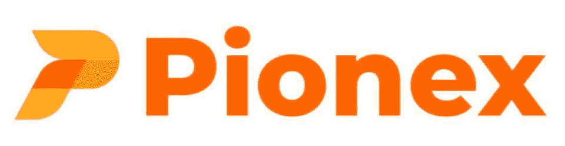
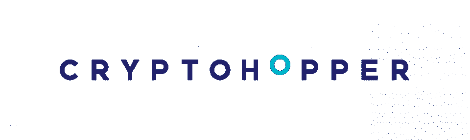
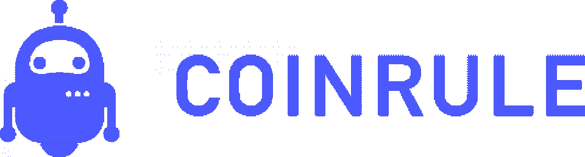
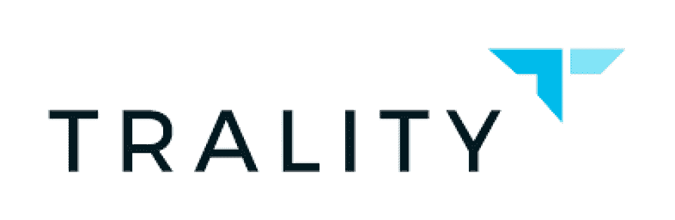
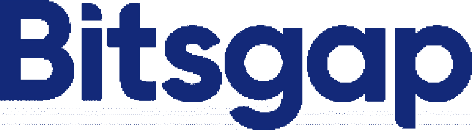
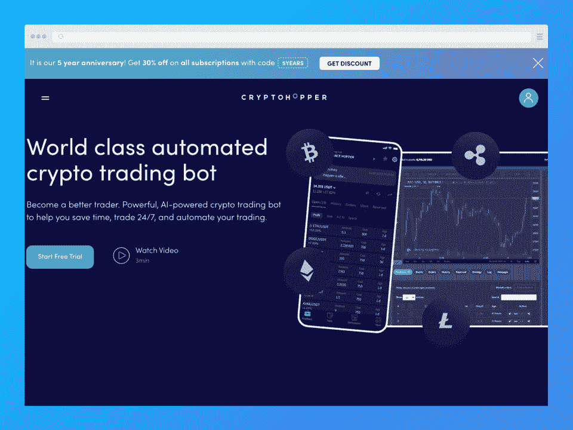
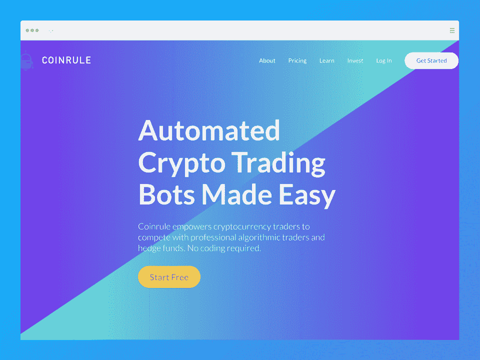
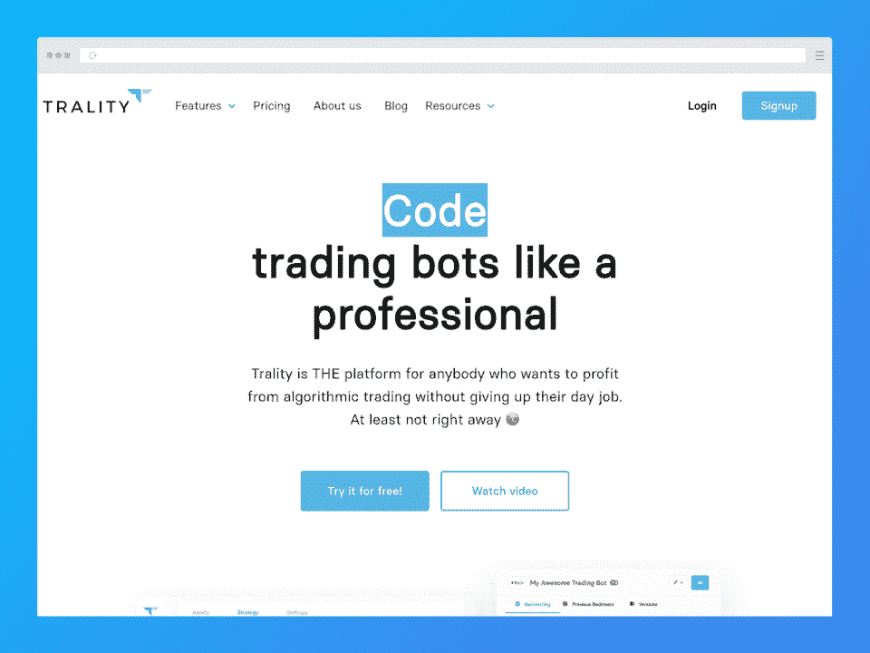

# 2023 年 9 月 7 款最佳加密套利机器人【排名】

> 原文：<https://hackr.io/blog/best-crypto-arbitrage-bots>

成千上万的人在区块链赚钱。每天，比特币至少确认 25 万笔交易。

但由于市场的高度波动性，加密货币交易是一项风险极高的工作。加密套利机器人可以通过自动化过程来降低风险。

在本指南中，我们将看看如何选择最适合你的加密套利机器人。我们还列出了七个可用的最佳机器人，请继续阅读以了解更多信息！

## **特色加密套利机器人:概述**

| 机器人 | **描述** | **价格** | **链接** |
| [****](https://www.pionex.com/en-US/)**Pionex** | 最佳免费加密套利机器人 | Bot 免费使用；0.05%做市商/收款商交易费 | [Pionex](https://www.pionex.com/en-US/) |
| [****](https://www.multitrader.io/)**MultiTrader.io** | 初学者的最佳机器人 | 自由的 | [MultiTrader.io](https://www.multitrader.io/) |
| [****](https://www.cryptohopper.com/)**隐漏斗** | 最适合期货和现货交易者 | 免费永久计划；7 天免费试用，然后计划从 16.58 美元/月开始 | [隐漏斗](https://www.cryptohopper.com/) |
| [****](https://coinrule.com/)**Coinrule** | 最适合预制的套利机器人规则 | 永久免费计划，计划起价为每月 29.99 美元 | [Coinrule](https://coinrule.com/) |
| [****](https://www.trality.com/)**Trality** | 最适合构建机器人 | 永久免费计划，然后计划从€9.99 英镑/月开始 | [Trality](https://www.trality.com/) |
| [****](https://bitsgap.com/)**Bitsgap** | 最适合 Exchange 兼容性 | 7 天免费试用，然后计划从每月 24 美元开始 | [Bitsgap](https://bitsgap.com/) |
| [****](https://3commas.io/)**3 条消息** | 最适合高级用户 | 免费永久计划；然后计划从 14.50 美元/月开始 | [3 条消息](https://3commas.io/) |

## **什么是套利加密交易？**

套利交易包括在一个交易所购买一种资产，在这里是密码，然后在另一个交易所出售。它利用了两个平台之间的价格差异，因此你可以低买高卖，从而获得利润。

主要目标？利用两个交易所之间的差价。

这种交易技术通常对新手有益，因为它比其他需要更多技术知识和分析的方法简单。此外，这种交易形式降低了市场波动的风险。

正如你可能猜到的，自动加密套利涉及使用机器人为你进行交易。

**相关:对区块链科技感兴趣？下面是一些** [**加密货币和区块链教程**](https://hackr.io/blog/best-cryptocurrency-blockchain-tutorials) **让你入门。**

### 加密套利有哪些风险？

尽管套利通常风险较低，但你仍会遇到一些风险，比如:

*   **监管注意事项和限制**:加密在很大程度上不受监管，但一些国家和地区已经制定了法律法规。这些因地点而异，这意味着位于不同地区的交易所可能在不同的规则下运作。

*   **费用** -交易所通常有自己的存款、交易和取款费用。由于加密是不受监管的，这些费用会突然增加，导致你损失一大笔利润。

*   **交易速度**:交易速度*快*，加密套利。套利是有帮助的，但是如果你反应不够快，你仍然可能会错过一些交易。

*   **平台或交换瓶颈**:个别平台和交换可能存在延迟和错误。例如，存款可能被卡住，需要人工批准(导致您错过交易窗口)。帐户锁定和禁止可能是灾难性的，导致你在这个过程中失去你所有的存款。

*   泵和转储，地毯拉，人为通货膨胀:诈骗计划可以人为抬高资产价格，以吸引新的买家。在阴谋者获得足够的利润后，他们可以简单地“拉出地毯”或“扔掉”加密货币，使资产变得一文不值。这种风险在套利交易中不太突出，但如果你不小心的话，还是会发生。

底线？加密交易总是有风险，套利不能完全消除风险。然而，它确实有助于你减轻它们。

[带有 Python 用户界面的加密货币交易机器人](https://click.linksynergy.com/deeplink?id=jU79Zysihs4&mid=39197&murl=https%3A%2F%2Fwww.udemy.com%2Fcourse%2Fcryptocurrency-trading-bot-with-user-interface-in-python%2F)

## 为什么要使用加密套利机器人？

如果你对使用加密货币套利机器人持观望态度，你可能会想:

这些机器人到底能做什么你自己做不到的事？

加密套利机器人经常使用可用的市场信息来进行有利可图的加密货币交易。他们自动化了整个套利过程，这意味着:

*   正确的机器人有助于减轻您的风险，并最大限度地减少市场波动对您的利润率的影响。
*   这些机器人可以发现你自己可能错过的交易机会。在这个过程中，他们往往能发现被低估或隐藏的宝石。
*   套利机器人的工作速度比人类快得多，这意味着错过交易窗口的风险更小。

## **选择套利机器人时需要考虑什么**

大多数套利交易机器人都提供竞争策略、定价和功能，因此很难选择最好的一个。以下是您在选择时需要考虑的一些事项:

### **安全**

你的资金或资产有多安全？寻找允许您为每个交换生成 API 密钥的 bot。为了增加一层安全性，在共享这些密钥之前关闭取款访问。

### **价格**

价格符合你的预算吗？你得到公平的价值了吗？一些机器人的价格比其他的要高，但是额外的功能可能会证明这个价格是合理的。

### **支持的交易所**

根据您的需求选择支持足够数量的交换的 bot 支持的交换越多，获利机会就越多！

用户社区围绕工具和软件成长；这同样适用于套利机器人。你可能会在某些工具上发现比其他工具更大的套利机器人加密社区。当你学习一个工具或遇到一个问题时，社区会很有帮助，所以选择一个有活跃用户群的机器人总是更好的。

### **用户友好度**

并非所有的机器人都是一样的——一些更加用户友好，而另一些更复杂，可能需要一些编码知识。现实一点，根据你的技能水平选择合适的工具。

## **最佳加密套利机器人**

### [**Pionex**](https://www.pionex.com/en-US/)**——最佳免费加密套利机器人**

[****](https://www.pionex.com/en-US/)

**价格**:

*   免费的加密套利机器人
*   0.05%做市商/收款商交易费

Pionex 总部位于新加坡，以自动化交易闻名。因此，许多感兴趣的初学者蜂拥而至。你可以在这个易于使用的平台上找到大量的教程，学习如何使用机器人以及自动化交易如何工作。

如果你不想花钱买一个加密套利机器人，试试 Pionex 吧。这个平台免费提供超过 16 个交易机器人，包括它的套利机器人。

**优点**

*   允许用户在特定的价格范围内低买高卖
*   使用户能够获得低风险的被动收入
*   允许从您的银行账户中存款或取款，并使用美元进行交易

**缺点**

*   不允许自定义交易策略

**[了解更多关于 Pionex](https://www.pionex.com/en-US/)**

[****](https://www.multitrader.io/)

**价格** : 100%免费，包括机器人使用

如果你是套利初学者，没有比 MultiTrader.io 更好的地方了。这个平台的专长是套利加密交易，所以这个机器人对这个过程进行了很好的调整。像 Pionex 一样，MultiTrader.io 完全免费提供其机器人。

这个 BTC 套利机器人适用于比特币，但也监控不同交易所的 90 种其他货币。它使用差价交易、跨交易所套利和自动再平衡策略。

**优点**

*   百分之百免费
*   大量对初学者有用的文章
*   有效套利策略
*   高级自动化交易服务

**缺点**

*   客户支持可能会非常缓慢
*   可以支持更多的交流

**[了解更多关于 multitrader . io](https://www.multitrader.io/)**

### ****——最适合期货和现货交易者****

 **[****](https://www.cryptohopper.com/)

**价格**:

*   先锋计划:永远免费(20 个仓位，手动交易，投资组合管理，所有可用的交易所)
*   7 天免费试用，然后:

*   探索者:每月 19 美元或每年 16.58 美元
*   冒险者:49 美元/月，按月支付或 41.58 美元/年支付
*   英雄:每月支付 99 美元或每年支付 83.25 美元

Cryptohopper 不仅是一个套利机器人，还是一个交易者投资组合管理的 app。这个平台支持 100 多种加密货币的管理和交易。通过人工智能，Cryptohopper 允许用户从其他用户或其他加密套利软件复制交易。

为了您资产的安全，这个 bot 允许您通过唯一的 API 密钥连接到交易所。

**优点**

*   先锋计划永远免费
*   允许在所有交易所交易，即使是永久免费计划
*   丰富的支付选择
*   使用 API 密钥保护

**缺点**

*   网站可能会落后
*   有限的技术支持

**[了解更多关于 Cryptohopper](https://www.cryptohopper.com/)**

### [**coin rule**](https://coinrule.com/)**——最适合预制套利的 Bot 规则**

[****](https://coinrule.com/)

**价格**:

*   启动计划:永远免费
*   业余爱好者计划:每月支付 39.99 美元或每年支付 29.99 美元
*   交易者计划:每月支付 79.99 美元或每年支付 59.99 美元
*   专业计划:每月支付 499.99 美元或每年支付 449.99 美元

Coinrule 成立于 2017 年，已经建立了坚实的交易者用户基础，通过加密套利获利。Coinrule 的机器人提供了 150 多种预制规则或策略供选择。然而，即使你是初学者，你也可以创造自己的策略！

**优点**

*   坚固的用户友好界面
*   免费注册和永远免费的基本计划
*   兼容 11 个交换机
*   150 多种预制策略和灵活性，让您自己创建

**缺点**

*   最高层非常昂贵
*   没有其他竞争对手那么多的功能

**[了解更多关于 Coinrule](https://coinrule.com/)**

### ****——最适合建造机器人****

 **[****](https://www.trality.com/)

**价格**:

*   典当计划:永远免费
*   骑士计划:€9.99 英镑/月按月支付或€95 英镑/年
*   岩石平面图:
*   女王计划:€59.99 英镑/月，按月支付，€575 英镑/年

总部位于澳大利亚的 Trality 成立于 2019 年，为全球用户提供套利机器人。由于其拖放功能，该平台为想要建立自己的策略和机器人的交易者提供了最佳体验之一。即使是初学者，也可以在没有编码知识的情况下定制自己的 bot。但是，高级用户可以使用 Trality 基于浏览器的代码编辑器(使用 [Python](https://hackr.io/blog/how-to-learn-python) )。

**优点**

*   端到端加密交易策略
*   实时交易(基于云)
*   拖放策略和指标；不需要编码知识
*   能够选择使用代码编辑器或规则生成器来构建机器人

**缺点**

*   可以使用更多的交流
*   没有移动应用程序

**[了解更多关于贸易的信息](https://www.trality.com/)**

### [**Bitsgap**](https://bitsgap.com/) **-交换兼容性最佳**

[****](https://bitsgap.com/)

**价格** : 7 天免费试用，然后(不含增值税):

*   基本计划:每月支付 29 美元或每 6 个月支付 24 美元
*   高级计划:每月支付 69 美元或每 6 个月支付 57 美元
*   专业计划:每月支付 149 美元或每 6 个月支付 123 美元

Bitsgap 是一个优秀的机器人，适合各种水平的用户。一个突出的特性是它支持许多交换平台，包括一些全球最流行的平台。

您还可以使用 Bitsgap 来跟踪和分析超过 10，000 对加密货币。Bitsgap 基于云的机器人会自动检测具有最佳潜在收益的硬币，从而使周围的用户更加方便。

**优点**

*   大量受支持的支付方式
*   拥有最多 exchanges 支持的机器人之一(15+)
*   简单易用，功能丰富

**缺点**

**[了解更多 Bitsgap](https://bitsgap.com/)**

### [**3 条消息**](https://3commas.io/)**——最适合高级用户**

[****](https://3commas.io/)

**价格**:

*   免费永久计划
*   入门计划:每月 29 美元，按月支付，或每月 14.50 美元
*   高级计划:每月 49 美元或每月 24.50 美元
*   专业计划:每月支付 99 美元或 49.50 美元
*   可用的企业计划

作为一个套利机器人，3Commas 在帮助用户增加利润，同时降低风险和减少损失方面做得非常出色。它允许用户 24/7 交易，使得全天候盈利成为可能。3Commas 还允许用户复制其他加密交易机器人的设置，从而使交易更加容易。此外，用户可以选择通过移动应用程序、web 应用程序、电子邮件或浏览器接收通知。

请记住，3Commas 最适合有经验的用户。陡峭的学习曲线对初学者来说很有挑战性。

**优点**

*   支持 18 个交换机
*   负担得起的
*   干净和用户友好的用户界面

**缺点**

*   陡峭的学习曲线；不适合新手

**[了解更多 3 条消息](https://3commas.io/)**

## **加密套利策略的类型**

一些机器人可能只支持一种类型的策略，而其他机器人可能提供更多的选择。你甚至可以找到包含所有可用策略的套利加密工具。但是这些策略到底是什么呢？让我们来看看:

*   **跨交易所套利**是这类交易中最常见的基本策略之一。跨交易所套利涉及从一个交易所购买密码，然后在另一个交易所出售，从而从差价中获利。很自然，你会在价格较低的平台上购买加密软件，然后在价格较高的交易所出售。

*   **三角套利**利用一种资产(加密货币)的价格来推测另一种资产的价格。这种策略包括用一种加密货币交易另一种加密货币，并立即以更高的价格出售买入的货币。这种策略的核心是利用两种资产之间的差价来获利。

*   **空间套利**是一种跨交易所套利形式，但有一点需要注意——交易所很可能位于世界各地的不同地点。你可以从一个价格较低的国家的交易所购买你的密码，然后在需求和价格较高的地方出售，从中获利。使用这种方法，你可以利用供求规律，并通过这种方式获利。

*   **没有资产转移的空间套利**与空间套利完全相同，但没有实际的资产转移。这种方法提供了空间套利策略的好处，同时降低了转移时间和过程中发生的成本所涉及的风险。虽然你可以通过这种方式避免一定的风险和费用，但你可能仍然需要考虑交易费用。

上面提到的四种策略是加密套利中最常用的。然而，您可能会遇到一两个采用其他策略的套利机器人，如 [**分散式交易所套利**](https://www.nansen.ai/research/arbitrage-on-decentralised-exchanges) ，在这种情况下，通过分散式交易所使用智能合约进行交易。

你还可能遇到**统计套利**，这涉及到比特币套利机器人对数学模型的依赖。在这种情况下，机器人在交易密码获利时会使用计算、计量经济学和统计技术。

最后，还有**价差套利**，它依赖于你在交易所之间买卖资产时的价差。

## **结论**

一个加密套利机器人可以帮助降低交易风险，增加利润。根据你的技术水平和预算选择合适的机器人可以让加密套利变得轻而易举！当然，每个密码交易者都是从头开始的。你最好的办法是进行大量的研究，甚至探索[区块链课程](https://hackr.io/blog/best-blockchain-courses)来开始。

对以密码为职业感兴趣吗？

**[查看专业区块链认证](https://hackr.io/blog/blockchain-certifications)**

## **常见问题解答**

#### **1。密码套利机器人有利可图吗？**

套利机器人密码交易员可以通过高性能的机器人和周到的交易策略获得可观的利润。其他因素，如市场需求、供应、波动性，也会影响利润。

#### **2。套利机器人有用吗？**

加密套利机器人工作得很好——它们可以自动检测交易机会，比人类更快地获利。加密货币套利软件通常基于人工智能、机器学习、算法和各种其他资产交易技术。

#### **3。加密套利合法吗？**

加密货币几乎不受监管。然而，一些国家可能有自己的关于加密的法律和规则。检查你所在国家的法律是否合法，但是到目前为止，加密套利从技术上来说并不违法。

#### **4。套利交易是无风险的吗？**

加密套利有其自身的风险，即价格变动和滑点。加密资产的价格波动令人难以置信，因为你可以获得前所未有的收益，而经历灾难性的损失。滑点指的是自从你开始交易某项资产后价格的变化。****