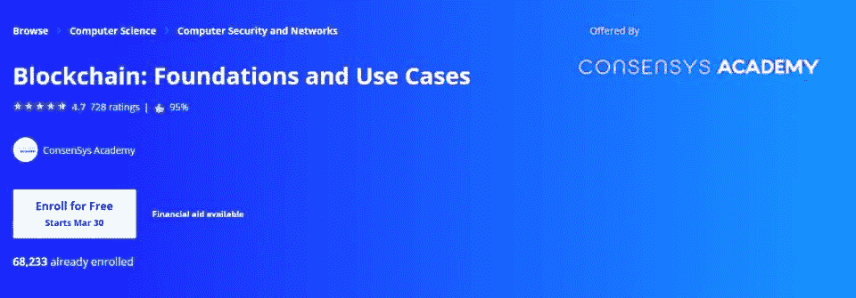
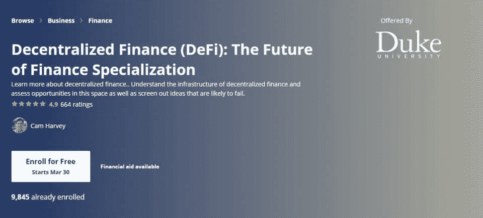
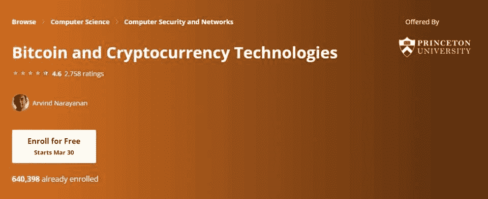
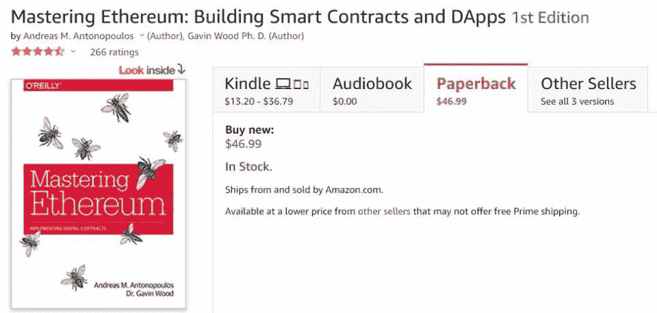
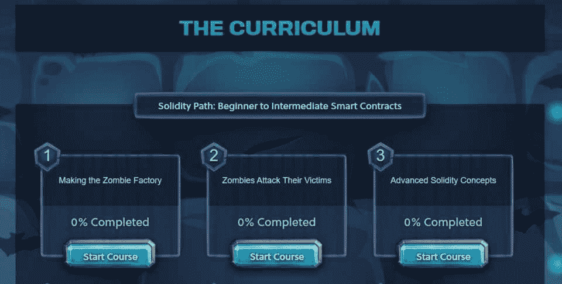
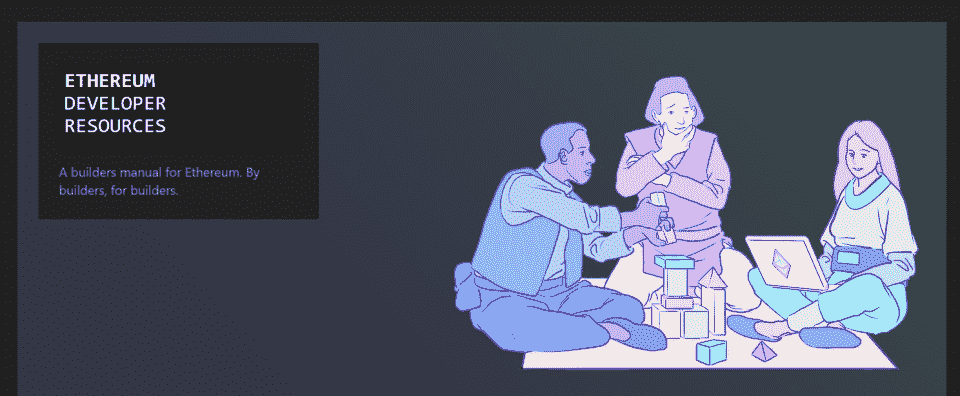
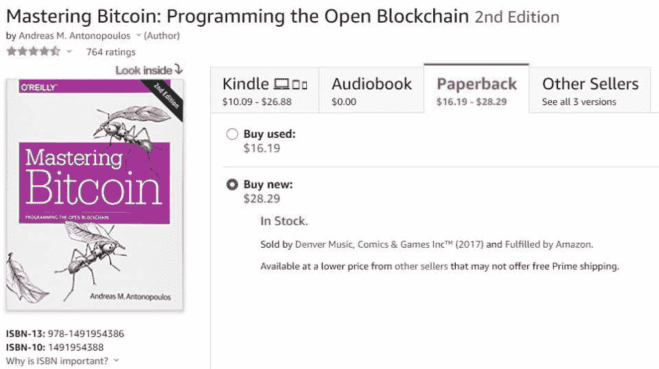

# 2023 年 10 大最佳加密货币和区块链教程

> 原文：<https://hackr.io/blog/best-cryptocurrency-blockchain-tutorials>

区块链技术和加密货币是过去十年最热门的技术趋势之一。支撑它的概念对许多人来说仍然是困惑的，但是它们将对我们的生活产生巨大的影响。

区块链是一个革命性的概念，它有可能影响几乎每一个领域，就像互联网在过去 20 年里推动了每一个领域一样。与其让我们的金融系统和技术平台集中在一个集团，我们更有可能拥有一个分散化的未来。

如果你有兴趣学习这种[新技术](https://hbr.org/1985/11/implementing-new-technology)，并在这一领域取得领先，这里有一个十大加密货币和区块链教程的列表。

## **什么是区块链？**

在这一点上，每个人都听说过，这是一个公司喜欢谈论的时髦词，就像人工智能和大数据一样。但就像后两者一样，它们所代表的东西实际上有一定的分量，它们有可能在深层次上改变我们相互之间的互动方式。

区块链的想法其实很简单:它是一个分布式账本。一个分类帐仅仅是一个数据的存储，不管那个数据或者 用例 可能是什么。它最典型的特点是它是去中心化的，也就是说，没有单一的实体来决定什么信息是对的，什么信息是错的。

以一家银行为例，它的主要目的是确保所有进出的钱都得到正确的记录。银行是一个中央集权的实体，确保其分类账中记录的财务数据准确无误。您可以相信银行会确保在您收到存款时，您的帐户会被记入贷方，而在汇款人汇款时，汇款人的帐户会被记入借方。

然而，集中式系统也有缺点，这些缺点可以大致分为安全性、成本和速度。这些问题产生于这样一个事实，即有一个中央机构处理所有的交易记录，它们可能受到服务器停机的影响，容易受到欺诈，并对交易收取更高的费用，特别是国际交易。

这就是分散式分类账显示其价值的地方。比特币和其他区块链消除了中介，交易记录是以这样一种方式进行的，即网络上的每个节点都被激励正确记录信息。因此，对于分布式网络，安全性更高，成本更低，交易确认更快。

## 区块链是如何工作的？

那么，知道了这些优势之后，区块链到底是如何运作的呢？我们将以 比特币 作为我们区块链的例子。

区块链包含一系列包含交易信息的块。这是一个共享的公共分类帐。这是存储交易和接收地址的地方，以及记录发送和接收的比特币数量的分类账信息。请记住，这些信息可以是任何东西，而不仅仅是与财务相关的数据。

如果你愿意，你可以自己下载比特币区块链，尽管它很大。您可以查看区块链上发生的所有交易。或者，你可以在线访问众多比特币区块链探索者之一。

用户有一个公共地址，你可以把它想象成一个银行账户。他们有私人钥匙-必须安全存放-可以用来访问他们的地址和存储的资金。资金通过这些公共地址发送和接收。

交易通过被称为挖掘的过程被验证并添加到区块链，这发生在工作证明网络中，比特币就是这样。他们这样做是有回报的，这也是中本聪的辉煌最明显的地方。这些不同的实体努力就区块链的状态达成一致，保存年表和真实性。值得注意的是，比特币挖掘的回报随着时间的推移而减少，因为挖掘区块所需的复杂数学的难度变得更难了。

这就是事情的概要。完整的解释在技术上要复杂得多，但这是比特币和区块链如何在 T2 运作的良好入门。除了工作证明之外，还有许多类型的共识，这些区块链的运作方式也不同。如果你感兴趣，你可以自己研究一下。

### **推荐区块链课程！**

[区块链专业化由 Coursera](https://imp.i384100.net/c/2890636/1242836/14726?prodsku=spzn%3AokkMhcTiEemTMg57eQs_yg&u=https%3A%2F%2Fwww.coursera.org%2Fspecializations%2Fuci-blockchain&intsrc=PUI2_9419)

## **学习区块链技术最好的方法是什么？**

学习区块链科技的最好方法就是亲自动手。当然，你应该好好利用区块链教程，但这对于实际构建区块链来说是次要的。将你的理论知识付诸实践。

## **学习区块链技术辛苦吗？**

学习如何建造区块链和所有相关概念并不比学习其他计算机技术难。有一些独特的考虑，但从根本上说是编程逻辑。区块链技术的一个例子是以太坊，它有很好的职业前景。

## **学习区块链技术需要多长时间？**

对于最基本的区块链来说，它不需要很长时间就能起飞。这可能需要几周到几个月的时间。然而，接下来的事情很有挑战性，因为不仅仅是推出区块链。事实上，如果你有轻微的技术爱好，创建一个基本的区块链可以在一天内完成。

但是，创造一个最低限度的可行产品，具有足够的安全性和功能，是一个更具挑战性的前景，可能需要一年或更长时间。

## **比特币是区块链吗？**

是的，比特币是建立在区块链之上的，它开启了当前区块链应用市场。比特币是由一个名叫中本聪的匿名开发商或开发商团体开发的。它使用之前解释的分散系统来确保关于区块链的信息是正确的。

## **最佳加密货币和区块链教程**

我们将这篇文章分成两个主要部分:首先是区块链教程，然后是加密货币教程(比特币和以太坊)

[****](https://click.linksynergy.com/deeplink?id=jU79Zysihs4&mid=39197&murl=https://www.udemy.com/build-your-blockchain-az)

**特性:**

*   加密货币和智能合约的初级课程
*   了解如何创建自己的加密货币和智能合约
*   被几家公司用来向员工介绍区块链技术
*   使用 Python
*   很少或没有必要的先决知识

Udemy上的 [区块链 A-Z 课程，用 14.5 个小时的内容，带你了解区块链的基本面及其背后的动机。它涵盖了加密货币和智能合约，甚至教你如何使用 Python 创建自己的加密货币和智能合约。](https://click.linksynergy.com/deeplink?id=jU79Zysihs4&mid=39197&murl=https://www.udemy.com/build-your-blockchain-az)

这是一个很好的[区块链初学者指南](https://hackr.io/blog/blockchain-programming-beginners-guide)，也是开始你的区块链技术教育的一个极好的方式。它也相当短，但同时启动并运行。

[查看课程](https://click.linksynergy.com/deeplink?id=jU79Zysihs4&mid=39197&murl=https://www.udemy.com/build-your-blockchain-az)

[****](https://coursera.pxf.io/NKv9ob)

**特性:**

*   由主要以太坊开发商之一 ConsenSys 提供
*   适合那些既有技术人员又有非技术人员的人
*   涵盖了 ConsenSys 的创业投资组合中的业务用例
*   包含区块链空间的内幕消息

在加密领域，ConsenSys 是一个非常著名的名字，负责许多突出的开发。该公司在 Coursera 上的 [区块链:基础和用例课程向你传授比特币和以太坊的知识，同时也从一个业内人士的角度提供关于创业公司和发展的信息。](https://imp.i384100.net/DVdVAd)

[查看课程](https://coursera.pxf.io/NKv9ob)

**特性:**

*   了解分散融资，这是区块链技术最重要的使用案例之一
*   涵盖 DeFi 的基础设施及其领先应用
*   也教你关于风险和机遇，以及空间的未来
*   与以太坊智能合约课程良好配对

杜克大学在 Coursera 上开设的 [分散式金融课程](https://imp.i384100.net/rnNne3) 是了解密码领域最热门的发展之一的绝佳途径。DeFi 仍然是市场的关键部分，并吸引了金融从业者的注意。您将了解从 DeFi 基础设施到主要协议的所有内容，以及风险和机遇。

[查看课程](https://coursera.pxf.io/VyvnEA)

[****](https://click.linksynergy.com/deeplink?id=jU79Zysihs4&mid=39197&murl=https://www.udemy.com/blockchain-and-bitcoin-fundamentals/)

**特性:**

*   快速而有效的基础课程
*   被几家公司用来向员工介绍区块链技术
*   没有必要的先决知识

本 [区块链与比特币基础课程](https://click.linksynergy.com/deeplink?id=jU79Zysihs4&mid=39197&murl=https://www.udemy.com/blockchain-and-bitcoin-fundamentals/) 是理论性的，用 2.5 小时的内容教你区块链背后的理论。它介绍了比特币，并教你其特殊的区块链是如何工作的。虽然它不是最深入的课程，但作为区块链技术的基础课程，它做得很好。

[查看课程](https://click.linksynergy.com/deeplink?id=jU79Zysihs4&mid=39197&murl=https://www.udemy.com/blockchain-and-bitcoin-fundamentals/)

[****](https://coursera.pxf.io/mgJ3nq)

**特性:**

*   教你一切，从比特币的工作原理到如何使用它
*   简要介绍加密货币的辅助领域，如政治和监管
*   普林斯顿大学提供
*   完全免费

Coursera 上的这门 [比特币和加密货币技术课程是由普林斯顿大学提供的，连同一本同名的书，应该能让你在成为区块链开发者的道路上做好准备。你将学习区块链发展的基本原理、数学、潜在的哲学和要求。](https://coursera.pxf.io/mgJ3nq)

本加密货币教程清晰透彻，然而，这些作业颇具挑战性，你可能需要一些时间来适应。但最终，这是非常有益的，因为你会了解区块链如何实现去中心化，如何挖掘和存储比特币，你还会被介绍到区块链生态系统和不同的替代硬币。

[查看课程](https://coursera.pxf.io/mgJ3nq)

[****](https://www.amazon.com/Mastering-Bitcoin-Programming-Open-Blockchain/dp/1491954388/)

**特性:**

*   最受欢迎的比特币书籍之一
*   非常适合拥有技术和非技术背景的个人
*   包括现实生活中的例子
*   电子书版本完全免费

安德烈亚斯·m·安托诺普洛斯的书 [*掌握比特币*](https://www.amazon.com/Mastering-Bitcoin-Programming-Open-Blockchain/dp/1491954388/) 是一本面向技术人员和非技术人员的书。作者 Andreas M. Antonopoulos 在加密社区中很有名，也很受尊重，他的书是比特币方面最著名的书之一。它介绍了区块链，在为非技术人员解释了一般概念后，它深入到更高级的概念，如闪电网络、隔离见证和支付渠道。这是一本视觉效果丰富的电子书，有真实的例子和代码片段，让你了解你正在学习的东西。

对许多人来说，这是他们第一次学习区块链开发教程。这很值得考虑，即使你不是书呆子。

[景书](https://www.amazon.com/Mastering-Bitcoin-Programming-Open-Blockchain/dp/1491954388/)

[****](https://click.linksynergy.com/deeplink?id=jU79Zysihs4&mid=39197&murl=https://www.udemy.com/ethereum-and-solidity-the-complete-developers-guide/)

**特性:**

*   区块链发展优秀实践课程
*   了解加密货币领域广泛使用的编程语言 Solidity
*   了解如何构建一个实际的区块链应用程序
*   包括区块链和采矿的实例

[Udemy 的以太坊和坚固性课程](https://click.linksynergy.com/deeplink?id=jU79Zysihs4&mid=39197&murl=https://www.udemy.com/ethereum-and-solidity-the-complete-developers-guide/) 教你以太坊和编程语言坚固性。您将很快了解什么是智能合约，以及如何使用 Solidity 构建应用程序。它还介绍了如何设计、构建和部署您的区块链应用程序，并提供了实际示例和编码教程，以便您可以开始构建自己的区块链应用程序。

[查看课程](https://click.linksynergy.com/deeplink?id=jU79Zysihs4&mid=39197&murl=https://www.udemy.com/ethereum-and-solidity-the-complete-developers-guide/)

[****](https://cryptozombies.io/)

**特性:**

*   了解如何在 Solidity 中创建智能合同
*   一个有趣的智能课程，结束时你将已经创建了一个密码收集游戏
*   课程虽小但内容丰富

与这个列表中的其他课程非常不同，[【crypto zombies】](https://cryptozombies.io/)是一个免费的区块链 dapp 开发课程，通过一个制作自己的密码收集游戏的课程，教你如何在 Solidity 中创建智能合同。它既有趣又有教育意义，受到了加密社区的热情欢迎。

对于希望立即看到结果的初学者来说，这是一个很好的加密货币教程。

[查看课程](https://cryptozombies.io/)

[****](https://www.ethereum.org/greeter)

**特性:**

*   由以太坊基金会自己提供
*   包括以太坊开发教程，以及让你动手实践的实验
*   包含各种主题的教程
*   提供大量文档

由以太坊基金会提供的本以太坊教程提供了以太坊开发的几个方面的文档和教程。这包括学习如何使用控制台在以太坊中创建一个简单的 hello world 契约。对于 hello world 程序来说，这似乎有点复杂，但是一旦你掌握了它的窍门，它就非常简单和直观。如果你不知道如何使用控制台，你可以试试图形用户界面教程。

[查看资源](https://www.ethereum.org/greeter)

[****](https://www.amazon.com/gp/product/1491971940/)

**特性:**

*   了解如何构建智能合同和 dapp
*   由 Andreas M. Antonopoulos 和 Gavin Wood 这两位资深的太空人物撰写
*   包含 Solidity、Vyper 和 JavaScript 中的示例
*   Ebook version is completely free

    [查看图书](https://www.amazon.com/gp/product/1491971940/)

作者安德烈亚斯·m·安托诺普洛斯的另一本恒星书， [*【掌握以太坊】*](https://www.amazon.com/gp/product/1491971940/) 在社区中好评如潮。如果您正在寻找以太坊协议的入门指南，或者已经有许多开源开发者、集成商和系统管理员在使用这个平台，那么 *【掌握以太坊】* 是一本关于这个主题的好书。

通过这本实用指南，Andreas M. Antonopoulos 和 Gavin Wood 提供了在以太坊和其他虚拟机区块链上构建智能合约和 dapp(分散应用)所需的一切信息。这本书向你展示了如何在这个不断增长和令人兴奋的新行业中发展成为创新者的必要技能。

## **利用这些区块链教程展开你的职业生涯**

区块链的发展正在巩固自己作为未来最有前途的领域之一。它仍处于早期阶段，这意味着对于那些付出努力的人来说，这可能是一个有回报的旅程。但是你可以用这里列出的最好的区块链教程，它足够重要，一些最负盛名的大学也提供课程。

的确，该领域在成熟度方面还有很多不足，但它正在积极发展，社区正在不同领域努力弥补这一不足，这项技术在全球的采用表明了它已经取得了多大的进步。

选择一本区块链教程并开始学习。假以时日，你可以尝试更多的 [【区块链】课程](https://hackr.io/blog/best-blockchain-courses) 巩固你的知识。如果你坚持做一个项目，你的职业生涯会有很好的回报！

**人也在读:**