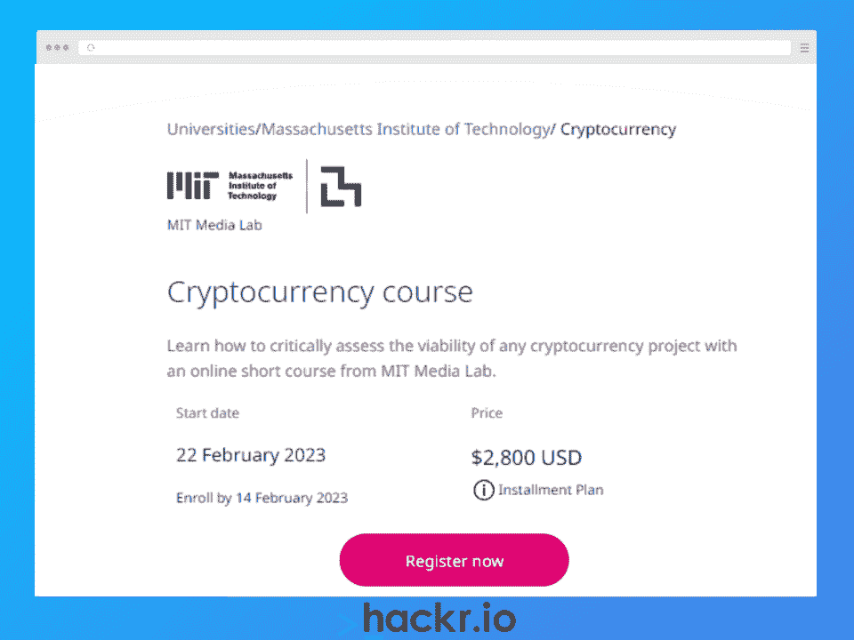
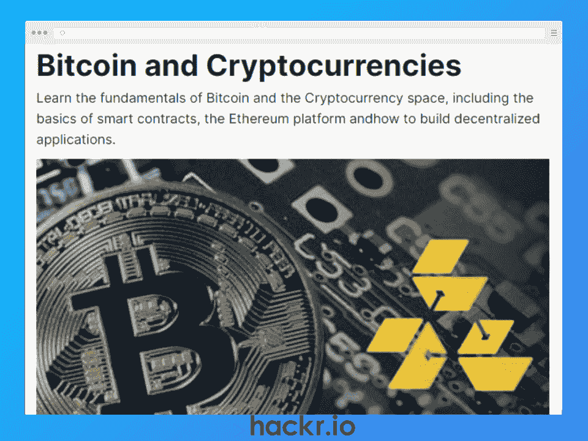
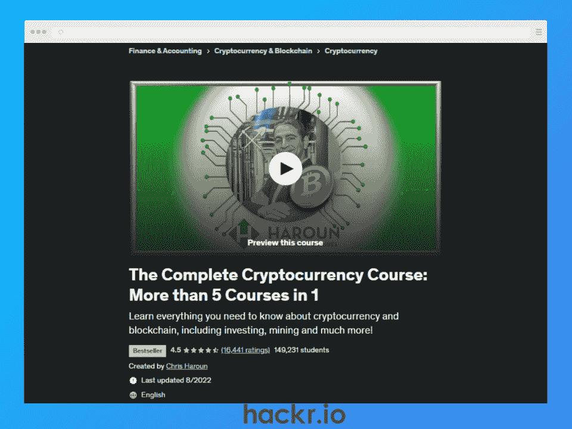
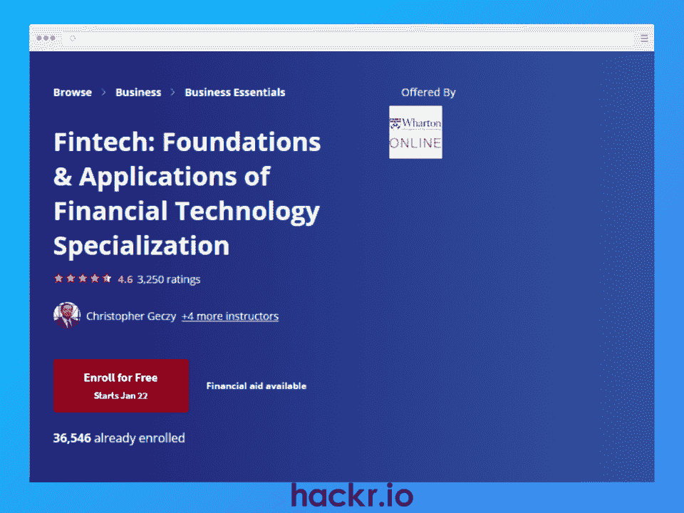
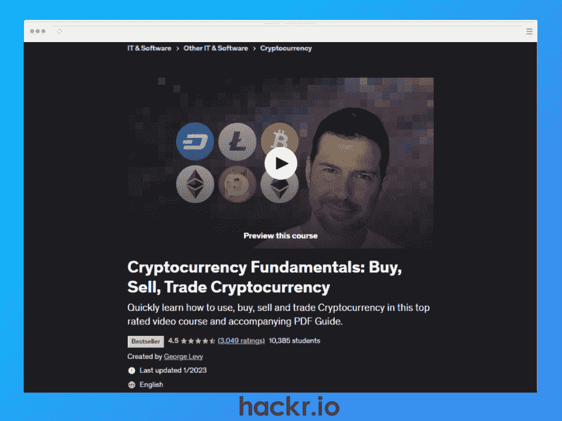
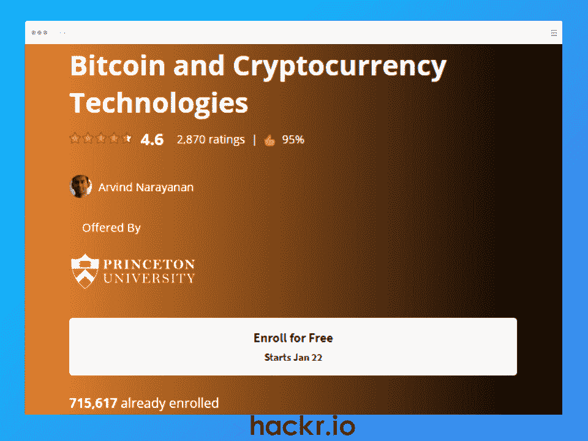
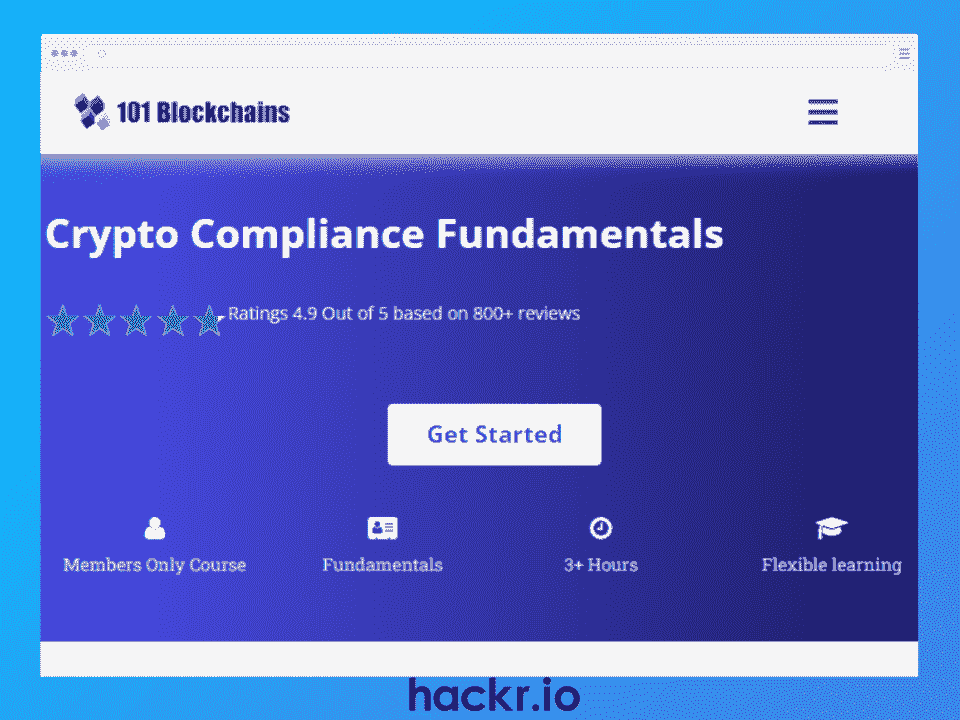
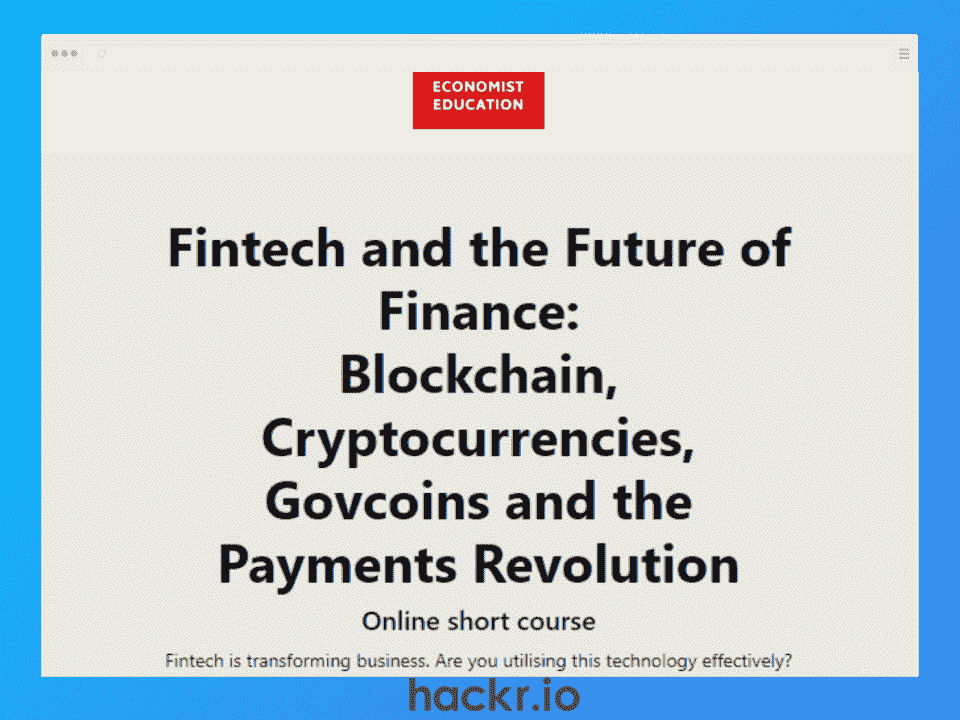

# 加密货币在线课程

> 原文：<https://hackr.io/blog/best-cryptocurrency-courses>

你准备好加入加密货币革命了吗？我们在互联网上搜寻 2023 年最好的加密货币课程。无论你是完全的初学者还是经验丰富的专业人士，这些课程都有适合每个人的东西。

从学习加密的基础知识到掌握技术分析和先进的交易策略，你会发现丰富的知识唾手可得。利用这个机会加入成功的加密货币投资者的行列。

请继续阅读，了解我精心挑选的 8 个加密货币类别，以帮助您将知识(和交易技能)提升到一个新的水平。

## **为什么要学习加密货币？**

如果你对是否学习加密货币犹豫不决，请考虑以下几点:

*   近年来，加密货币的价值爆炸式增长，一些投资者看到了数千%的回报。通过参加加密交易课程，你可以潜在地利用这种爆炸性的增长。
*   加密货币不仅仅是一种赚钱的方式——它是一种突破性的技术，可能会改变我们使用和思考货币的方式。通过参加加密培训，您可以站在这场技术革命的最前沿，了解这一激动人心的发展的全部潜力。
*   加密货币可能是一个复杂而令人生畏的话题，尤其是对那些新手来说。通过参加在线加密货币课程，您可以揭开这项令人兴奋的技术的神秘面纱，并获得自信驾驭它所需的知识和技能。

**时间紧迫？请查看下面的对比图表，快速了解 2023 年最佳加密货币课程。**

| **我们 2023 年的特色加密课程** |
| **课程** | **描述** | **长度** | **认证** | **价格** |
| [加密货币课程【麻省理工学院媒体实验室】](https://getsmarter.sjv.io/NK5Gb1) | 对加密货币行业的深入研究。 | 6 周，基于每周 1-10 小时的学习 | 是 | $2,800 |
| [比特币和加密货币【edX】](https://www.awin1.com/cread.php?awinmid=6798&awinaffid=428263&ued=https%3A%2F%2Fwww.edx.org%2Fcourse%2Fbitcoin-and-cryptocurrencies) | 比特币和加密货币的基本面，包括智能合约和以太坊。 | 6 周，基于每周 3-5 小时的学习 | 是的，使用验证过的轨道 | 受限访问免费，92 美元可升级为完全访问 |
| [加密货币完整教程【Udemy】](https://click.linksynergy.com/deeplink?id=jU79Zysihs4&mid=39197&murl=https%3A%2F%2Fwww.udemy.com%2Fcourse%2Fthe-complete-cryptocurrency-course-more-than-5-courses-in-1) | 加密货币和区块链的完整概述，包括投资和采矿。 | 24 小时视频点播 | 是 | 变化 |
| [Fintech:基础&金融科技专业化应用【Coursera】](https://imp.i384100.net/7mEXO5) | 金融科技和加密货币系列课程，包括一个应用学习项目。 | 4 个月，基于每周 1 小时的学习 | 是 | Coursera Plus 订阅免费。 |
| [加密货币基础知识:购买、出售、交易加密货币【Udemy】](https://click.linksynergy.com/deeplink?id=jU79Zysihs4&mid=39197&murl=https%3A%2F%2Fwww.udemy.com%2Fcourse%2Fcryptocurrency-fundamentals%2F) | 购买、出售和交易加密货币的快速视频课程。 | 2 小时视频点播 | 是 | 变化 |
| [比特币和加密货币技术【Coursera】](https://imp.i384100.net/MX177K) | 比特币和其他加密货币的深入技术概述。 | 23 小时视频点播 | 不 | Coursera Plus 订阅免费。 |
| [加密合规基础知识【101 区块链】](https://shrsl.com/3wa25) | 基于合规性、法律和法规的快速加密课程。 | 3 小时 | 是 | 101 区块链会员免费。 |
| [金融科技与金融的未来【经济学家教育】](https://getsmarter.sjv.io/Aodg3a) | 金融业未来的综合概述。 | 6 周，基于每周 6-8 小时的学习 | 是 | $1,794 |

## **2023 年最佳在线加密货币课程**

[****](https://getsmarter.sjv.io/NK5Gb1)

**[了解更多](https://getsmarter.sjv.io/NK5Gb1)**

**关键信息**

*   **价格:**2800 美元(可分期付款)
*   讲师:麻省理工学院媒体实验室的加里·詹斯勒和尼哈·纳鲁拉
*   **等级:**初学者
*   **要求:**无
*   **证书:**是
*   持续时间: 6 周，建议配速为每周 7-10 小时

麻省理工学院媒体实验室的加密货币课程被认为是最深入和最受尊敬的初学者加密货币课程之一。它深入探讨了加密货币的功能、局限性和经济意义。它也是少数几个基于群组的加密货币课程之一，提供对课程材料的无限制访问，包括视频和播客。

在麻省理工学院行业专家团队的带领下，本课程将为您提供分析加密项目的推理技能，并在不断发展的加密领域抓住机遇。此外，通过访问 2U 的职业参与网络，您将拥有所需的工具，将您的新知识提升到新的水平。

**优点:**

*   全面了解加密货币和评估加密项目所需的技能
*   涵盖各种各样的主题
*   由麻省理工学院领导并提供认证证书

**缺点:**

*   每周需要 7-10 小时的学习时间

[****](https://www.awin1.com/cread.php?awinmid=6798&awinaffid=428263&ued=https%3A%2F%2Fwww.edx.org%2Fcourse%2Fbitcoin-and-cryptocurrencies)

**[了解更多](https://www.awin1.com/cread.php?awinmid=6798&awinaffid=428263&ued=https%3A%2F%2Fwww.edx.org%2Fcourse%2Fbitcoin-and-cryptocurrencies)**

**关键信息**

*   **价格:**免费参加审核课程(有限的课程资料，没有证书)，€92 认证课程(全部资料、作业和结业证书)
*   指导老师: Rustie Lin 和 Wang，加州大学伯克利分校计算机科学专业的学生
*   **等级:**初学者
*   **要求:**无。建议对计算机科学或密码学有基本的了解
*   **证书:**是，有验证过的轨迹
*   **持续时间:** 6 周课程，建议每周 3-5 小时

edX 的比特币和加密货币课程提供了加密概念的全面概述，重点是比特币。它还涵盖了以太坊和区块链应用，这是加密货币的一个重要话题。如果你有兴趣了解更多关于区块链的信息，看看我们关于最佳区块链课程或证书的指南。

这个在线加密货币课程由来自伯克利区块链的行业专家 Rustie Lin 和 Wang 领导，这是一个由学生运营的组织，为加密和社区服务。它包括讲师指导的视频、分级作业和考试，帮助您深入了解该技术，以及如何应用它。

这对于那些对比特币感兴趣的人来说是完美的，对于任何希望将自己的加密知识提升到一个新水平的人来说也是必备的！

**优点:**

*   由伯克利的区块链开发，学分可用于大学提供的区块链基础专业证书
*   提供基本加密概念的全面概述
*   遵循基于群组的学习方法，促进社区和责任

**缺点:**

*   一旦课程结束，学生不能再提交作业或考试

[****](https://click.linksynergy.com/deeplink?id=jU79Zysihs4&mid=39197&murl=https%3A%2F%2Fwww.udemy.com%2Fcourse%2Fthe-complete-cryptocurrency-course-more-than-5-courses-in-1)

**[了解更多](https://click.linksynergy.com/deeplink?id=jU79Zysihs4&mid=39197&murl=https%3A%2F%2Fwww.udemy.com%2Fcourse%2Fthe-complete-cryptocurrency-course-more-than-5-courses-in-1)**

**关键信息**

*   **价格:**各不相同
*   **讲师:**克里斯·哈龙，哈龙 MBA 学位项目首席执行官
*   **等级:**初学者+
*   **要求:**无。建议使用 Excel 2013 或更高版本
*   **证书:**是
*   **时长:**24 小时视频点播

Udemy 的完整加密货币课程提供了关于所有加密内容的全面而深入的教育。它包括超过 5 个不同加密课程的全部内容，包括加密货币投资、加密货币挖掘、加密货币钱包、加密货币交易所和区块链。这是一个一站式商店。

这门加密培训课程由屡获殊荣的 MBA 教授 Chris Haroun 教授讲授，他自 2013 年以来一直投资加密公司并担任董事会成员，是一名真正的行业资深人士。你将从一个真正的行业老手那里学到东西。您将终身获得 24 小时视频点播和可下载资源，包括一个包含 30 多个练习的 Excel 电子表格。这是一门完美的课程，适合任何希望深入了解密码世界并将其知识提升到更高水平的人。

**优点:**

*   涵盖了大量关于加密货币的有用信息
*   由经验丰富的资深讲师授课
*   包括一个全面的 Excel 电子表格和练习

**缺点:**

*   教师在课程材料中加入了个人风格，这让一些学习者觉得这分散了他们对手头内容的注意力。

[****](https://imp.i384100.net/7mEXO5)

**[了解更多](https://imp.i384100.net/7mEXO5)**

**关键信息**

*   价格:Coursera Plus 免费订阅(7 天免费试用，每月 59 美元，或每年 399 美元，保证 14 天退款)
*   宾夕法尼亚大学沃顿商学院的克里斯多佛·格茨、杰西卡·沃希特、大卫·穆斯托、娜塔莎·沙林和莎拉·哈默
*   **等级:**初学者+
*   **要求:**建议对金融服务有基本了解
*   **证书:**是
*   **持续时间:** 4 个月的课程，建议速度为每周 1 小时

Coursera 的“金融科技:金融科技专业化的基础和应用”课程探索了金融科技的前沿世界。这是一个专业化计划，涵盖四门综合课程:

1.  金融科技:基础、支付和监管
2.  加密货币和区块链:数字货币简介
3.  借贷、众筹和现代投资
4.  人工智能、保险技术和房地产技术的应用

在宾夕法尼亚大学沃顿商学院(Wharton School of the University of Pennsylvania)专家团队的带领下，这个加密货币专业将为您提供对金融科技及其在商业和投资中的应用的透彻理解。通过 100 个讲师指导的视频和沃顿商学院领导的公司的实践应用学习项目，这种专业化是全面了解金融技术世界的最佳方式。

**优点:**

*   涵盖与四门单独课程相关的广泛主题，包括复杂法规、加密货币、投资组合优化、机器人建议、众筹、点对点贷款和区块链
*   包括数小时的视频点播内容(包括 100 多场讲师授课)
*   包括一个与沃顿商学院领导的公司合作的应用学习项目，让你能够学以致用

**缺点:**

*   由于其深入性，专业化认证需要 4 个月才能完成。
*   建议同学们对金融服务有基本的了解。

[****](https://click.linksynergy.com/deeplink?id=jU79Zysihs4&mid=39197&murl=https%3A%2F%2Fwww.udemy.com%2Fcourse%2Fcryptocurrency-fundamentals%2F)

**[了解更多](https://click.linksynergy.com/deeplink?id=jU79Zysihs4&mid=39197&murl=https%3A%2F%2Fwww.udemy.com%2Fcourse%2Fcryptocurrency-fundamentals%2F)**

**关键信息**

*   **价格:**各不相同
*   **讲师:**乔治·利维，区块链技术学院(BIT)讲师
*   **等级:**初学者+
*   **要求:**无
*   **证书:**是
*   **时长:**2 小时的视频点播

加密货币基本面:买入、卖出、交易 Udemy 的加密货币是该平台上评级最高的加密货币投资。它涵盖了购买、出售和交易多种加密货币的来龙去脉——不仅仅是比特币！

由畅销的区块链和加密货币演讲者 George Levy 主持，该加密交易课程提供 2 小时的视频点播、5 个可下载资源和测验，以确保对关键术语和概念的牢固理解。对于希望投资多种加密货币的人来说，本课程是一个完美的起点。

**优点:**

*   对加密货币的基础知识进行了简明扼要的介绍
*   包括如何购买，销售，交易和股份加密的实用信息
*   提供可下载的“加密货币交易所:入门指南”PDF，可以帮助您快速开始交易加密货币。

**缺点:**

*   课程相对较短，没有深入涵盖加密货币的所有方面。信息也呈现的很快。

[****](https://imp.i384100.net/MX177K)

**[了解更多](https://imp.i384100.net/MX177K)**

**关键信息**

*   价格:Coursera Plus 免费订阅(7 天免费试用，每月 59 美元，或每年 399 美元，保证 14 天退款)
*   普林斯顿大学的 Arvind Narayanan
*   **等级:**初学者+
*   **要求:**无
*   **证书:**否
*   **持续时间:** 23 小时

Coursera 的比特币和加密货币技术课程深入研究了比特币的技术层面——探索其监管和潜在的未来发展。它旨在为您提供将比特币理念融入您自己的项目所需的技能。

由普林斯顿大学的 Arvind Narayanan(数字技术的社会影响专家)领导，这个加密货币培训课程包括 23 个小时的内容和 60 多个讲师指导的视频。超过 700，000 名学生已经注册，这使得它成为最受欢迎的在线加密课程之一。

**优点:**

*   从技术上理解比特币的工作原理
*   由普林斯顿大学教授授课，确保高水平的专业知识
*   理想的视觉学习者，因为它包括 60 多个视频

**缺点:**

*   完成后不提供证书

[****](https://shareasale.com/r.cfm?b=2195763&u=3031482&m=105464&urllink=&afftrack=)

**[了解更多](https://shareasale.com/r.cfm?b=2195763&u=3031482&m=105464&urllink=&afftrack=)**

**关键信息**

*   **价格:**101 区块链免费会员(7 天免费试用，每月 25-150 美元，取决于首选套餐和销售价格)
*   **讲师:**贾斯汀·穆斯科利诺，区块链 101 的洞察主管
*   **等级:**中级
*   **要求:**了解区块链和加密货币
*   **证书:**是
*   **持续时间:** 3 个多小时

来自 101 区块链的加密合规基础课程非常适合任何想要成为加密货币相关法律法规专家的人。您将了解法规遵从性的基本要素、规则、重要术语以及控制加密的最佳实践。

它由区块链 101 大学的见解主任贾斯汀·穆斯科利诺领导，包括超过 3 小时的可下载内容，包括 56 个视频讲座。您还可以参加在线加密货币活动和网络研讨会。

**优点:**

*   涵盖加密行业中的一个特殊主题(合规性和法规)
*   学生可以参加互补的网络研讨会和会议
*   由一位著名的行业专家领导

**缺点:**

*   面向具有一定知识水平的行业专业人员，如合规专员、法律专员和业务分析师

[****](https://getsmarter.sjv.io/Aodg3a)

**[了解更多](https://getsmarter.sjv.io/Aodg3a)**

**关键信息**

*   **价格:【1,794 美元(可分期付款)**
*   讲师:《经济学人》财经记者马蒂厄·法瓦斯
*   **等级:**中级
*   **要求:**了解区块链和加密货币
*   **证书:**是
*   持续时间: 6 周，建议配速为每周 6-8 小时

经济学人教育的金融科技和金融的未来课程提供了对金融行业未来的全面了解，是业内公认的顶级加密货币在线课程之一。它揭穿了关于区块链和加密货币的常见神话和误解。

在《经济学人》首席财经记者 Matthieu Favas 的带领下，并以行业专家的贡献为特色，这一顶级认可的加密货币课程为您提供了各种材料，包括行业专家主持的视频和播客，以及 LinkedIn 上的官方经济学人教育校友小组。

**优点:**

*   全面了解技术对金融行业的影响
*   由《经济学人》的专家授课，提供独家见解，并无限制访问 LinkedIn 上的经济学人教育校友群
*   遵循基于群组的学习方法，促进社区和责任

**缺点:**

*   每周需要大约 6-8 小时的学习时间

## 什么是伟大的密码课程？【排名标准】

在为本文测试了超过 13 种不同的加密货币课程后，我可以自信地说，它们并不都是平等的。要找到满足您需求的最佳课程，需要考虑几个因素。

我列出的所有课程都基于这些关键标准:

*   综合内容:我寻找涵盖广泛主题的课程，从[区块链](https://hackr.io/blog/blockchain-programming-beginners-guide)和其他加密货币的基础知识到高级交易策略和技术分析。
*   经验丰富的讲师:我优先考虑由对市场有深刻理解的经验丰富的专业人士讲授的课程。
*   互动学习元素:我寻找包含互动元素的课程，如测验、活动和动手实践，以保持你的参与和积极性。
*   灵活的学习选项:我考虑提供各种学习选项的课程，包括自定进度和现场会议，以适应不同的学习风格。

通过考虑这些排名标准，我能够将我的发现缩小到这 8 个顶级加密货币课程的列表中，这些课程为您提供了全面而有趣的学习体验。

## **结论**

2023 年有很多很棒的加密货币课程可以帮助你学习你需要的技能。通过从这个列表中选择一门我亲手挑选的课程，你可以确信你得到了高质量的教育，这将帮助你实现你的目标。

有我们错过的最喜欢的加密课程吗？请在下面的评论中告诉我们。

想成为加密货币专家？你需要了解区块链，最终也要了解数字金融世界是如何运作的。阅读我们对区块链顶级课程的深入对比，继续您的学习之旅。

## **常见问题解答**

#### **1。一门加密货币课程要多少钱？**

加密货币课程的成本可能会有很大差异，这取决于许多因素，如课程的持续时间、教学水平以及讲师或机构的声誉。虽然有些课程是免费的，但它们通常不包括任何结业证明或认证。

#### **2。哪里可以学习加密货币？**

有很多地方可以让你学习加密货币，包括在线课程、大学、聚会和加密货币书籍。不可否认，知道哪些书适合你的特定知识水平可能有点令人困惑。我建议打开我们关于 2023 年 24 本最佳加密货币书籍的指南，找到一本符合你需求的书。

#### **3。加密货币哪个课程最好？**

我们不能肯定地说有一个加密货币课程是最好的。最终还是要看你的技能水平和具体要求。在这篇文章中，我们解释了为什么每门课程最适合不同类型的学习者。