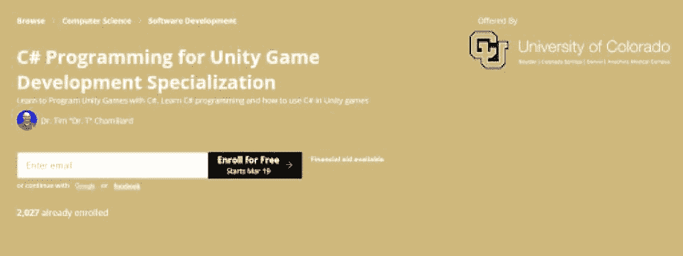
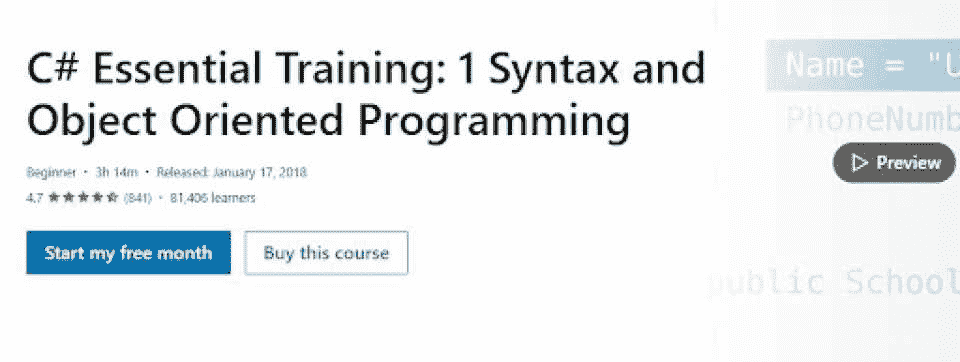
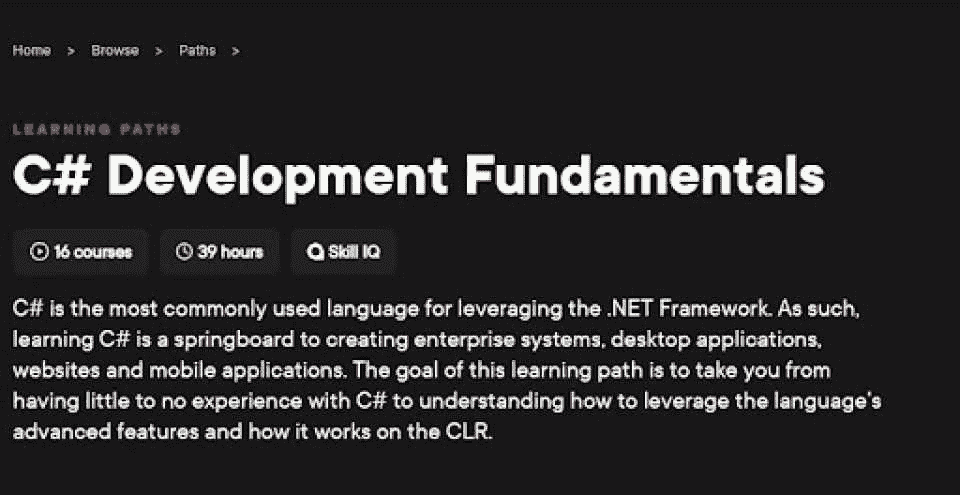
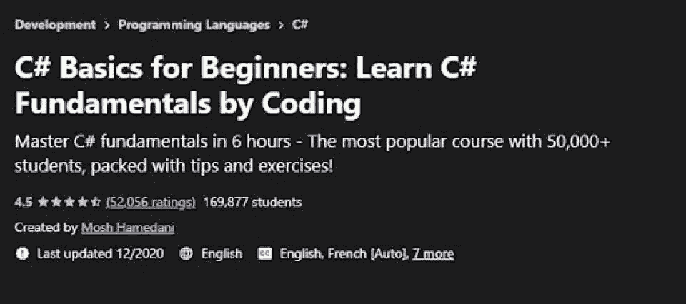
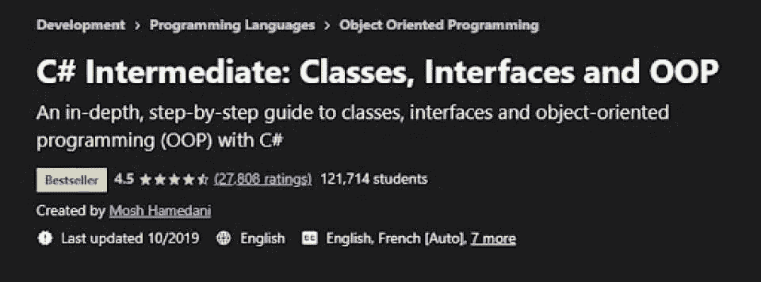
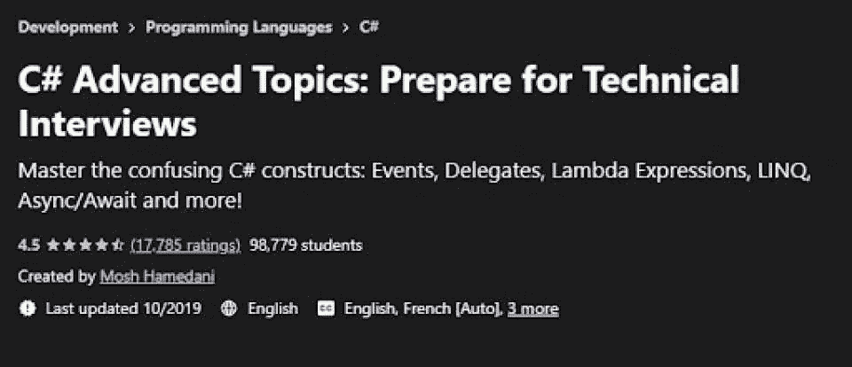
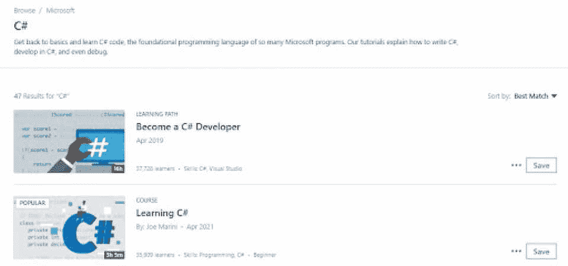
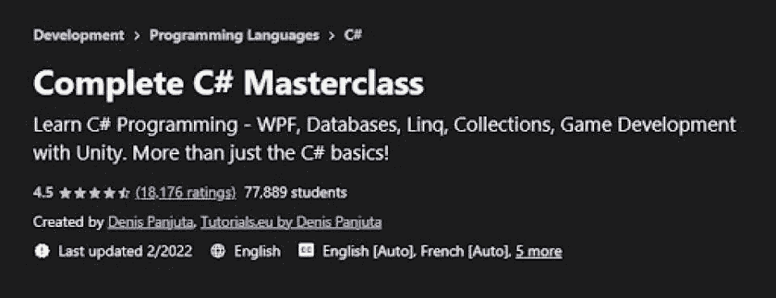
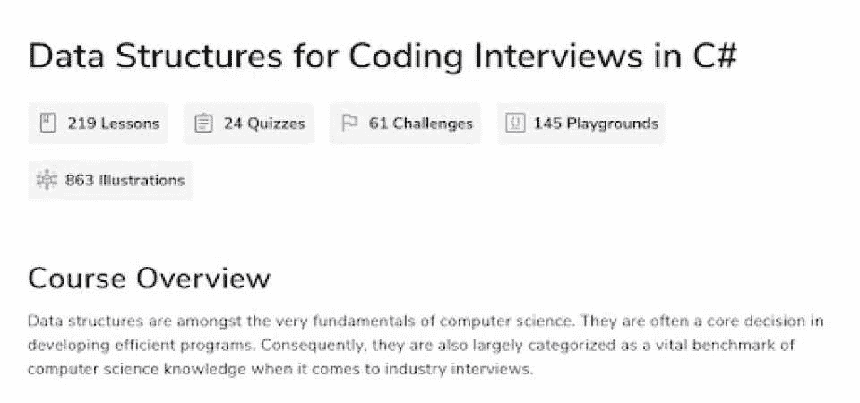
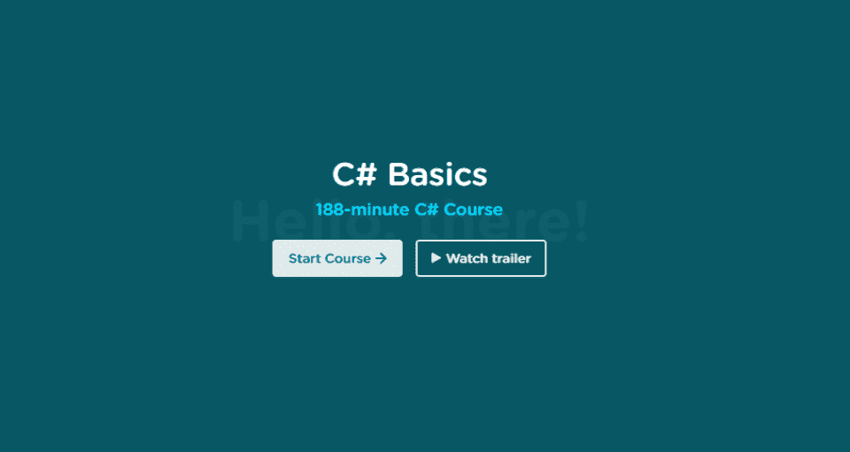

# 2023 年你应该选择的最佳 C#在线课程[最高评级]

> 原文：<https://hackr.io/blog/best-csharp-courses>

C#是继 Python、JavaScript 和 Java 之后使用最广泛的编程语言之一。它为开发人员打开了无数的工作和职业提升的机会，尤其是那些处理微软技术的人，包括 SQL Server 和 Windows。这种编程语言已经超越了 Java Swing，对于构建桌面图形用户界面至关重要。

如果你期待在这些领域中的任何一个领域建立职业生涯，那么 C#学习是必不可少的。我们列出了 10 门最好的 C#课程供您查阅。但是首先，让我们回顾一些关于 C#的常见问题。

## **8 门最佳在线 C#课程**

[****](https://imp.i384100.net/3P064v)

| **课程信息** | **课程大纲** |
| **先决条件:**无**难度:**初学者**学习材料:**测验、视频和作业持续时间:大约 5 个月 | C#编程简介

*   Unity(用户界面)
*   C#中级面向对象编程(Unity Games)
*   游戏开发者的设计模式和数据结构
*   Unity 游戏开发顶点课程的 C#编程
*   Coursera 已经提出了一个独特的 [C#培训课程](https://imp.i384100.net/3P064v)，允许学生学习 C#并使用这种编程语言创建 Unity 游戏。这门课程是专门为新程序员设计的。该材料分为五个专业，并涵盖所有主要议题。

 |

本课程的学习材料包括测验、视频教程和作业。此外，还有超过 15 个练习，允许学习者在 Unity Games 和 C#中测试他们的技能和知识。此外，在顶点课程中，学生有机会使用 C#和 unity 将他们的[游戏创意](https://hackr.io/blog/how-to-code-a-game)变为现实。

[查看课程](https://imp.i384100.net/3P064v)

**课程信息**

| **课程大纲** | **先决条件:**无 |
| **难度:**初学者**学习材料:**测验、视频和作业**持续时间:**大约 3.5 小时C#基础 | 变量和数据类型

*   字符串格式化程序
*   创建一个类
*   函数体表达式
*   用户界面创建
*   面向对象的程序
*   最佳 C#课程列表中的下一个是 Bruce Van Horn 的 [Linkedin Learning OOPs 课程](https://linkedin-learning.pxf.io/c/1238999/449670/8005?subId1=ddcsharp1&u=https%3A%2F%2Fwww.linkedin.com%2Flearning%2Fc-sharp-essential-training-1-syntax-and-object-oriented-programming)，它为那些完全不熟悉编程的人提供了一个极好的学习机会。本课程的独特之处在于对概念的解释非常清晰，便于快速理解。本课程包括真实世界的例子，这使得学习 C#成为一种更加有趣和令人兴奋的经历。
*   学生有几个练习练习，可以在线或离线访问，用于自定进度学习。通过课程的“离线查看”选项，学员可以参加离线课程。培训以测验的形式分为四个部分。注册后的第一个月，你可以免费使用 LinkedIn 学习课程。

 |

[查看课程](https://linkedin-learning.pxf.io/VyV6WO)

[****](https://pluralsight.pxf.io/EaymK4)

**课程信息**

**课程大纲**

| **先决条件:**对编程概念的基本理解，比如变量和循环 | **难度:**初级到高级 |
| **学习材料:**挑战、视频和作业**持续时间:**大约 27 小时异步编程防御性编码 | 自动化测试

*   Lambdas、事件和代表
*   面向对象的范例
*   字典、数组和列表
*   C#语法
*   LINQ
*   这是一门非常容易理解的 C#编程课程，分为几个部分。你仍然会面临真正的项目/任务，所以你会弄脏你的手。它还提供了处理各种挑战的机会，这进一步有助于提高编码水平。
*   您将获得关于使用这种编程语言进行编码实践的专家建议和技巧。即使你不知道[编程的基本概念](https://hackr.io/blog/c-sharp-vs-python)，这门 Pluralsight 课程也会被证明是很有帮助的。为了方便学习者，它包括练习、学习材料和视频。
*   [查看课程](https://pluralsight.pxf.io/EaymK4)

 |

[****](https://click.linksynergy.com/deeplink?id=jU79Zysihs4&mid=39197&murl=https://www.udemy.com/course/csharp-tutorial-for-beginners/)

**课程信息**

**课程大纲**

**先决条件:**无

| **难度:**初学者 | **学习材料:**测验、视频和作业 |
| **持续时间:**大约 5 小时数组和列表公式原始类型 | 班级

*   枚举
*   结构
*   Mosh Hamedani 独一无二地设计了初学者 C#基础课程，学生们通过编码学习 C#的概念。与同类课程不同，这门课程包括许多可下载的学习材料、点播视频、文章和[附加资源](https://hackr.io/blog/c-sharp-interview-questions)。
*   每个概念都充分阐述，使学习者更容易掌握的概念。NET 框架和 C#。现实世界的例子充实了这些解释。
*   本 Udemy 课程允许学生了解应用程序开发的最佳捷径和实践。学生将从编程练习、小型视频讲座和测验中受益。
*   [查看课程](https://click.linksynergy.com/deeplink?id=jU79Zysihs4&mid=39197&murl=https://www.udemy.com/course/csharp-tutorial-for-beginners/)

 |

[****](https://click.linksynergy.com/deeplink?id=jU79Zysihs4&mid=39197&murl=https://www.udemy.com/course/csharp-intermediate-classes-interfaces-and-oop/)

**课程信息**

**课程大纲**

先决条件:学习者应该了解 C#的基本概念，以提高他们构建应用程序的技能

**难度:**中级

| **学习材料:**测验、视频和作业 | **持续时间:**大约 5.5 小时 |
| 面向对象编程班级接口构造函数和继承 | 多态性

*   Udemy 上的这个中级 C#课程是提高你对 C#基本概念理解的好方法。它将帮助您学习构建应用程序的技术细节。
*   中级程序员可以从这门课程中受益匪浅，因为它提供了实践和理论的平衡体验。为学生设计的教程让他们有信心创建可扩展、松散耦合和可测试的应用程序。
*   有许多练习练习可以帮助学习者澄清疑惑，巩固他们在课程中学到的知识。每个主题都阐述得很好，并包括相关的例子。在这个项目中有超过 42 个讲座、四篇文章和其他额外的资源。
*   [查看课程](https://click.linksynergy.com/deeplink?id=jU79Zysihs4&mid=39197&murl=https://www.udemy.com/course/csharp-intermediate-classes-interfaces-and-oop/)

 |

[****](https://click.linksynergy.com/deeplink?id=jU79Zysihs4&mid=39197&murl=https://www.udemy.com/course/csharp-advanced/)

**课程信息**

**课程大纲**

先决条件:学习者应该对技术概念有清晰的基本了解，比如事件、委托和异步

**难度:**进阶

**学习材料:**测验、视频和作业

| **持续时间:**大约 3 小时 | 异常处理 |
| 代表无商标消费品λ表达式事件 | 可空类型

*   异步编程
*   LINQ
*   力学
*   扩展方法
*   这门 C#编程课程旨在帮助程序员了解 C#的高级功能。本课程的内容材料侧重于在现实世界中应用的高级概念。
*   Mosh Hamedani 很好地利用了他 13 年的行业经验来设计这个[高级 C#课程](https://click.linksynergy.com/deeplink?id=jU79Zysihs4&mid=39197&murl=https://www.udemy.com/course/csharp-advanced/)。这些概念以结构化、清晰和易于理解的方式进行了详细说明，以便学生对 C#功能有更深入的理解。这门 C 调课程节奏完美，所以在学习过程中很少有困惑或无聊的机会。
*   大约有 20 多个讲座和 4 篇文章作为学生的参考资料。你还可以终身学习这门课程。本课程的另一个主要特点是，你将获得构建应用程序的技能和知识，同时学习如何通过 C#技术面试。
*   [查看课程](https://click.linksynergy.com/deeplink?id=jU79Zysihs4&mid=39197&murl=https://www.udemy.com/course/csharp-advanced/)

*   [****](https://www.lynda.com/C-sharp-training-tutorials/1022-0.html)

 |

**课程信息**

**课程大纲**

先决条件:编程或编码的基础知识将有助于更好地理解概念

**难度:**初级到高级

**学习资料:**视频

**持续时间:**自定进度

| C#基础 | C#代码 |
| 在 C#中调试C#中的高级线程C#重构技巧和诀窍异步编程 | 用 C#面向对象

*   C#设计模式
*   LinkedIn 学习 C#课程非常适合那些希望成为熟练 C#开发者的人。课程材料包括与这种编程语言相关的广泛概念。从初学者到高级程序员，都有一个选项让大家增强理解。初学者可以从[基本编码问题](https://hackr.io/blog/what-is-coding-used-for)开始练习。像设计模式这样的高级主题是为高级开发人员准备的，这样他们可以获得更好的工作机会。
*   主题/课程有详尽的解释，可在线和离线访问。他们还提供许多机会，通过各种练习和评估来测试你的技能。
*   [查看课程](https://www.lynda.com/C-sharp-training-tutorials/1022-0.html)

*   [****](https://click.linksynergy.com/deeplink?id=jU79Zysihs4&mid=39197&murl=https://www.udemy.com/course/complete-csharp-masterclass/)
*   **课程信息**
*   **课程大纲**

 |

**先决条件:**无

**难度:**初学者

**学习材料:**测验、视频和作业

**持续时间:**大约 20 小时

变量和数据类型

| 决策 | 列表和数组 |
| 环面向对象编程排除故障多态参数 | 用 C#构建 unity 3D

*   Udemy 的[完整的 C#大师班](https://click.linksynergy.com/deeplink?id=jU79Zysihs4&mid=39197&murl=https://www.udemy.com/course/complete-csharp-masterclass/)将让你详细了解所有最重要的 C#概念，是学习游戏开发艺术的理想选择。您还将学习数据库的最佳使用。它的创建者和指导者 Denis Panjuta 通过丰富的学习材料帮助新程序员学习 C#的基础知识。
*   课程材料包括视频教程、70 种可下载资源、文章和其他学习资源。你将获得使用这些文件的实际经验。此外，学生还将获得有关使用 MS SQL Server 数据库的知识。
*   [查看课程](https://click.linksynergy.com/deeplink?id=jU79Zysihs4&mid=39197&murl=https://www.udemy.com/course/complete-csharp-masterclass/)

*   [****](https://www.educative.io/courses/data-structures-interviews-cs)
*   **课程信息**
*   **课程大纲**
*   **先决条件:**无

 |

**难度:**初学者

**学习材料:**测验、挑战和作业

**持续时间:**大约 20 小时

复杂性分析

列表和数组

| 图形和树 | 散列法 |
| 在 C#课程中，这个[用于编码面试的数据结构与其他的有些不同，它帮助你准备编码面试，特别是数据结构。这是面试过程中非常重要的一部分，所以这个会派上用场。](https://www.educative.io/courses/data-structures-interviews-cs)它涵盖了很多领域，并深入关注数据结构。这门课程完全是基于文本的，但它有超过 200 节课，24 个测验和 61 个挑战。你也可以直接在云上编程，所以没有设置时间。[查看课程](https://www.educative.io/courses/data-structures-interviews-cs) | [****](https://teamtreehouse.com/library/c-basics-2)

*   **课程信息**
*   **课程大纲**
*   **先决条件:**无
*   **难度:**初学者

 |

**学习材料:**测验、视频和作业

**持续时间:**大约 3.5 小时

变量和数据类型

句法

方法

变量和数据类型

| 条件语句 | 环 |
| 用 C#构建 unity 3D树屋 C#基础课程完全免费，这是它最大的卖点之一。这门课程涵盖了学习 C#的基础知识。主题包括语法、数据类型和条件语句等基本概念。如果你想要一些免费的东西，但仍然能让你运行起来，这是一个很好的课程。它会让你很好地体验用 C#编写程序的感觉，并且你可以在之后继续学习更高级的东西。[查看课程](https://teamtreehouse.com/library/c-basics-2) |  

*   **从今天开始学习 C#课程**
*   这里列出的#课程是一些最好的在线 C#课程。我们希望它能开启你的学习之旅。他们拥有追求高调 C#开发人员职业所需的一切。如果你想要我们的建议——初学者可能想试试 [C#初级课程](https://click.linksynergy.com/deeplink?id=jU79Zysihs4&mid=39197&murl=https://www.udemy.com/course/csharp-tutorial-for-beginners/)或 [Linkedin Learning OOPs 课程](https://linkedin-learning.pxf.io/c/1238999/449670/8005?subId1=ddcsharp1&u=https%3A%2F%2Fwww.linkedin.com%2Flearning%2Fc-sharp-essential-training-1-syntax-and-object-oriented-programming)，而高级学习者可以考虑 Mosh Hamedani 的[高级 C#课程](https://click.linksynergy.com/deeplink?id=jU79Zysihs4&mid=39197&murl=https://www.udemy.com/course/csharp-advanced/)。
*   除了为你提供开发桌面游戏和网络应用的技术基础的课程之外，你还应该尝试 C#项目来给你实践经验。
*   **常见问题解答**
*   **最好的 C#课程是哪个？**
*   这是一个见仁见智的问题，有些人会更喜欢某些课程的方法。在很大程度上，你想要一个有大量学习材料的 C#在线课程，尤其是项目。具体的讲师也很重要。
*   从我们的列表中，我们会推荐给初学者的 [C#基础课程](https://click.linksynergy.com/deeplink?id=jU79Zysihs4&mid=39197&murl=https://www.udemy.com/course/csharp-tutorial-for-beginners/)或给初学者的 [Linkedin Learning OOPs 课程](https://linkedin-learning.pxf.io/c/1238999/449670/8005?subId1=ddcsharp1&u=https%3A%2F%2Fwww.linkedin.com%2Flearning%2Fc-sharp-essential-training-1-syntax-and-object-oriented-programming)，以及给高级学习者的 Mosh Hamedani 的[高级 C#课程](https://click.linksynergy.com/deeplink?id=jU79Zysihs4&mid=39197&murl=https://www.udemy.com/course/csharp-advanced/)。

 |

**学习 C#需要多长时间？**

对于最基本的，预计需要几个月的时间来掌握它们。大约 3 - 6 个月后，取决于学习者和课程材料，你会发现自己正在向中级阶段迈进。当你可以自己构建一个项目时，你可以认为自己对 C#有相当的了解，互联网上有许多这样的项目想法。C#在线课程通常也有项目。

**在哪里可以学习 C#？**

你可以通过 Udemy、LinkedIn Learning 和 Coursera 等几个教育平台在线学习 C#。Hackr 还提供了一个[最佳 C#教程](https://hackr.io/tutorials/learn-c-sharp)的列表，为你提供了额外的选择。

## 学习 C#编程的最佳途径是什么？

说到[如何学习 C#](https://hackr.io/blog/how-to-learn-c-as-a-beginner) 是通过视频、小测验、作业和项目的结合。总之，它们将为您的 C#编程打下坚实的理论和实践基础。不要忘记，不管是哪种编程语言，你都必须在你的职业生涯中继续学习。因此，重温最好的 C#课程以跟上发展是值得的。

**人也在读:**

## **Frequently Asked Questions**

### **Which is the Best C# Course?**

This is a matter of opinion, and some individuals will prefer the methods of some courses over others. For the most part, you want a C# online course that has a good amount of learning material, and especially projects. The specific instructor also matters.

From our list, we would recommend the [C# Basics for Beginners course](https://click.linksynergy.com/deeplink?id=jU79Zysihs4&mid=39197&murl=https://www.udemy.com/course/csharp-tutorial-for-beginners/) or the [Linkedin Learning OOPs course](https://linkedin-learning.pxf.io/c/1238999/449670/8005?subId1=ddcsharp1&u=https%3A%2F%2Fwww.linkedin.com%2Flearning%2Fc-sharp-essential-training-1-syntax-and-object-oriented-programming) for beginners, and Mosh Hamedani’s [advanced C# course](https://click.linksynergy.com/deeplink?id=jU79Zysihs4&mid=39197&murl=https://www.udemy.com/course/csharp-advanced/) for advanced learners.

### **How Long Will it Take to Learn C#?**

For the very basics, expect to take a few months to get a good grasp on them. About 3 - 6 months in, depending on the learner and the course material, you’ll find yourself moving towards the intermediate stage. You can consider yourself decently knowledgeable on C# when you can build a project by yourself, and there are many such project ideas available on the internet. C# online courses typically have projects as well.

### **Where Can I Study C#?**

You can study C# online via several educational platforms like Udemy, LinkedIn Learning and Coursera. Hackr also provides a list of the [best C# tutorials](https://hackr.io/tutorials/learn-c-sharp), which provides additional choices for you.

### **What are the Best Avenues to Learn About C# Programming?**

When it comes to [how to learn C#](https://hackr.io/blog/how-to-learn-c-as-a-beginner) is through a combination of videos, quizzes, assignments and projects. Together, they’ll give you a strong theoretical and practical foundation for programming in C#. Don’t forget, regardless of the programming language, you have to continue learning over your career. As such, it’s worthwhile to to revisit the best C# courses to stay abreast of developments.

**People are also reading:**