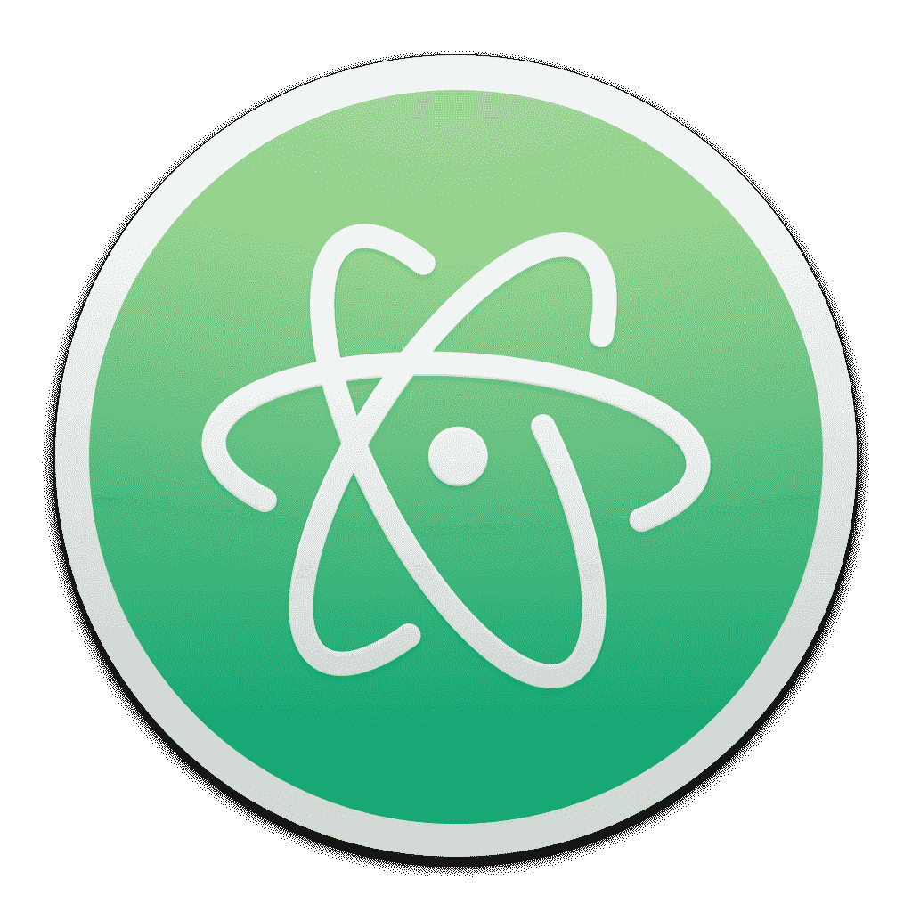
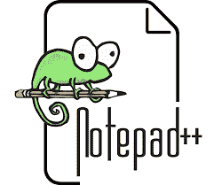
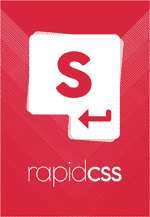

# 2023 年 Windows 和 Mac 的 10 个最佳 CSS 编辑器[更新]

> 原文：<https://hackr.io/blog/best-css-editor>

层叠样式表是一种流行的样式表语言。它用于描述网页或 web 文档的显示方式。通常，CSS 与 HTML 和 JavaScript 一起使用。

Web 设计者利用 css 编辑器轻松有效地对. CSS 文件进行修改。这也可以用于以有效的方式阅读代码，从而更容易发现错误和打字错误。

CSS 编辑器有多种形式。虽然有些是商业的付费工具，但其他的是免费的和/或开源的。在几种情况下，使用开源 CSS 编辑器是有益的。

可能是与开发人员和工程师合作开发一个成熟的项目，或者只是准备自己的网站设计。

在深入研究为什么应该选择开源 CSS 编辑器之前，让我们先简要了解一下为什么 CSS 比 HTML 更方便地呈现或设计网页。

## **为什么外观用 CSS 而不是 HTML？**

虽然 HTML 可以单独决定网页的外观，但是使用 CSS 可以使整个过程更加简单和高效。

单身。css 文件使开发者能够反映整个网站的各种变化。使用 HTML 这样做需要对每个 HTML 文件(网页)进行单独的更改，这显然不是一个有效的选择。

**小心！免费不开源**

有时人们会将自由软件或免费软件与开源混淆。请注意，两者部分相似，但不相同。开源软件工具允许用户下载和修改相同的源代码，同时完全免费使用相同的源代码。

自由软件工具，虽然完全免费使用，但不允许其源代码被下载和修改。有几个 CSS 编辑器可以免费使用，但不是开源的。例子包括 CoffeeCup 样式表生成器和 SimpleCSS。

### **选择开源 CSS 编辑器的理由**

选择开源的最佳 CSS 编辑器有几个很好的理由。最重要的是:

#### **1。与同事轻松协作**

使用开源 CSS 编辑器可以让你轻松地与同事协作，因为不需要购买多用途许可证。此外，开源工具不受用户数量或时间限制的限制，不像共享软件或工具的试用版。

#### **2。根据您的需求定制**

每个项目都有自己的范围和要求。因此，一刀切的策略似乎不适合这种情况。令人欣慰的是，开源 CSS 编辑器允许开发人员和团队根据他们的需求利用它来修改它。

有时有些问题需要和有经验的人讨论。大多数开源工具，不管是不是 CSS 编辑器，都有一个活跃的、不断扩大的社区，随时准备向有需要的人伸出援手。当处理具有独特需求的项目时，这可能是您的最佳选择。

## **8 位最佳 CSS 编辑(******)****

 **### **1\. Atom **

适用于 :

*   Linux RedHat 或 Ubuntu
*   macOS 10.9 或更高版本
*   Windows 7 或更高版本

开发者 - GitHub 初始发布-2014 年 2 月

被誉为“21 世纪可破解的文本编辑器”的 Atom 是目前最好的开源代码编辑器之一。它具有开发者期望从代码编辑器中得到的所有基本特性，可能是自动完成、文件系统浏览，或者支持一系列的[编程语言](https://hackr.io/blog/best-programming-languages-to-learn)。

很可能，Atom 最大的亮点是它使实时协作变得更加简单和高效。原子的跨平台能力是它所基于的平台的一个结果，这个平台就是 [电子](https://hackr.io/tutorials/learn-electron?ref=blog-post) 。

此外，Atom 提供了一个详尽的软件包列表，为文本编辑器配备了额外的特性和功能。花哨的文本编辑器也支持主题，由迅速发展的 Atom 社区创建和管理。

[用 HTML 和 CSS 构建响应式现实世界网站](https://click.linksynergy.com/deeplink?id=jU79Zysihs4&mid=39197&murl=https%3A%2F%2Fwww.udemy.com%2Fcourse%2Fdesign-and-develop-a-killer-website-with-html5-and-css3%2F)

### **2。括号**

### ****

适用于 :

*   Linux Mint 或 Ubuntu
*   macOS 10.14 或更高版本
*   Windows 7 或更高版本

开发者 - Adobe(原)，Adobe Systems(现) 初始发布-2014 年 11 月

另一个在开发者中流行的 CSS 编辑器是 Adobe 的括号。括号是专门为前端开发人员和 web 设计人员开发的，它提供了专门的可视化工具和预处理器支持。使用支架的一个重要优点是重量轻。

支架展示了一个实时预览功能，允许你在推送时查看对网站所做的更改。代码编辑器还通过对扩展的支持，提供了一定程度的定制支持。

括号的一个引人入胜的特性是内嵌编辑器，通过在你认为最重要的代码中打开一个内嵌窗口，可以省去你在文件标签间切换的麻烦。哦，顺便说一下，代码编辑器被翻译成超过 35 种不同的语言。

### **3。记事本++**

适用于 - Windows 7 或更高版本 开发者 - Don Ho 初始发布-2003 年 11 月

根据[2019 栈溢出开发者调查](https://insights.stackoverflow.com/survey/2019) ，Notepad++是第二受欢迎的代码编辑器。在全球范围内，Notepad++是开发人员的首选，他们更喜欢简单、轻量级、可扩展的 Windows 代码编辑器。

Notepad++是用 C++写的，它提供了快速执行和超小尺寸的惊人结合。代码编辑器通过利用纯 Win32 API 和 STL 成功地做到了这一点。

Notepad++提供了所有常用的代码编辑器特性，即自动完成、查找和替换以及选项卡式编辑。代码编辑器支持 20 多种编程语言，使其成为市场上最通用的代码编辑器之一。

### **4\. Komodo Edit **

适用于 :

*   Linux CentOS、Fedora、OpenSUSE、Red Hat Enterprise Linux、SUSE Linux Enterprise 或 Ubuntu
*   macOS 10.9 或更高版本
*   Windows XP 或更高版本

开发者 -活动状态 初始发布-2007 年 1 月

Komodo Edit 是流行的 Komodo IDE 的一个低调的代码编辑器。除了 CSS，代码编辑器也是一系列流行编程语言的首选，包括 JavaScript、Perl、PHP、Python、Ruby、SQL 和 XML。

从 Komodo Edit 4.3 开始，动态编程语言的代码编辑器建立在开放的 Komodo 项目之上。可以通过插件和宏进行定制。前者基于 Mozilla 插件。

不幸的是，代码编辑器缺少实时预览功能。此外，它不提供实时协作。然而，Komodo Edit 提供了一个强大的 转到任何地方 的功能，可以轻松导航到源代码的任何部分。

**推荐课程**

[【CSS-2023 年完整指南(包括 Flexbox，Grid&Sass)](https://click.linksynergy.com/deeplink?id=jU79Zysihs4&mid=39197&murl=https%3A%2F%2Fwww.udemy.com%2Fcourse%2Fcss-the-complete-guide-incl-flexbox-grid-sass%2F)

### **5。Visual Studio 代码**

适用于 :

*   Linux Debian、Fedora、RedHat、SUSE 或 Ubuntu
*   苹果电脑
*   Windows 7 或更高版本

开发者 -微软 初始发布-2015 年 4 月

根据 2019 年 Stack Overflow 开发者调查，Visual Studio Code 是最受欢迎的代码编辑器。因此，它提供了开发人员在代码编辑器中需要的所有功能。这包括自动完成、代码重构和语法突出显示。

通常，代码编辑器缺乏调试功能。但是，对于具有内置调试工具的 Visual Studio 代码来说，情况并非如此。使用扩展、主题、键盘快捷键和首选项，代码编辑器是高度可定制的。

此外，Visual Studio Code 的智能代码完成功能与通常的自动完成功能完全不同。它在函数定义、导入的模块和变量类型的基础上完成代码。成为最受欢迎的选择的另一个原因！

### **6。蓝鱼**

适用于 :

*   Linux ALT Linux、Debian、Fedora、Gentoo Linux、Slackware 或 Ubuntu
*   苹果电脑
*   OpenSolaris
*   Windows XP 或更高版本

开发者 - Bluefish 开发团队 初始发布 - 1997

Bluefish 是一个简单易学、基础但功能强大的 CSS 编辑器。这是一个先进的文本编辑器，带有大量的工具，用于编程和构建动态网站。建议开发者寻找一个真正的工具，就像它看起来那样。

除了 CSS，代码编辑器还支持 Ada、C、C++、Go、Java、PHP、Python、XML 和其他几种语言。虽然 Bluefish 是一个独立的应用程序，但它也可以通过与开源桌面环境 GNOME 集成来使用。

除了典型的代码编辑特性，如自动完成和语法突出显示，代码编辑器还有向导特性。这是一个高效完成任务的超级功能。还提供了一个支持编程代码的内嵌拼写检查器和一个 Unicode 字符浏览器。

### **7。闪烁光**

****

适用于 :

*   macOS 10.6 或更高版本
*   大闪蝶
*   带有 GTK+ 的类 Unix
*   Windows NT 或更高版本

开发者——尼尔·霍奇森等人 初始发布——1999 年 5 月

与列表中的其他条目不同，这个条目不完全是一个代码编辑器。相反，Scintilla 是一个免费的开源库，具有一个文本编辑组件，专注于源代码编辑的高级功能。

然而，Scintilla 的代码编辑能力可以轻松对抗专门的代码编辑器，这也是它上榜的原因。事实上，非常流行的 Notepad++代码编辑器使用了 Scintilla 编辑器组件。

Scintilla 的特色是语法突出显示，不局限于固定宽度的字体。还可以添加自动完成和代码折叠功能。除了错误指示器和语法样式之外，代码编辑组件还有一个基本的正则表达式搜索实现。

### **8。格迪特**

适用于 :

*   苹果电脑
*   使用 GNOME DE 的类 Unix 操作系统
*   窗户

开发者 -各种 初始发布-1999 年 2 月

gedit 用 C 和 Python 编写，是开源 GNOME 桌面环境的默认文本编辑器。然而，代码编辑器也可以在 macOS 和 Microsoft Windows 平台上使用。

遵循其母项目 GNOME 的理念，gedit 专注于易用性和简单性。因此，CSS 编辑器具有一个整洁、简单的图形用户界面。gedit 具有编辑源代码和结构化文本(如标记语言)的工具。

为了同时编辑几个文件，gedit 提供了 GUI 标签。此外，它还具有撤消和重做功能以及搜索和替换功能。语法高亮可以通过 GtkSourceView 添加到代码编辑器中。

## **如何选择最好的开源编辑器？**

为了在你的 CSS 努力中获胜，为 CSS 编辑器做出正确的选择是很重要的。你会怎么做？在选择时简单地考虑这些事情:

### **1。您拥有的操作系统**

不是每个 CSS 编辑器都兼容所有操作系统。因此，确保您将要选择的代码编辑器与您的操作系统兼容是非常重要的。此外，请确保您满足最低系统要求。

### **2。您需要的功能**

每个代码编辑器都有自己的特性列表。虽然某些特性在某些代码编辑器中是共有的，但有些特性可能是某些代码编辑器独有的。

确保你选择用来处理项目 CSS 部分的代码编辑器必须有你想要的特性。这些功能可以是:

*   自动完成。
*   颜色编码。
*   CSS 验证。
*   支持所有三种类型的 CSS。
*   绝对、浮动和相对定位的工作能力。

### **3。你需要学习的其他网络技术/语言**

大多数 CSS 编辑器为其他编程语言和技术，如 HTML、JavaScript 和 PHP，提供支持，至少是语法高亮显示。此外，几乎可以肯定的是，为了完成相关的项目，你还将使用其他一些语言。

因此，寻求一个支持所有，或者至少是一些你需要使用的语言/技术的 CSS 编辑器将会是富有成效的。

然而，请确保您计划选择的 CSS 编辑器能够支持您决定使用的语言和/或技术版本。如果不这样做，由此产生的问题是很难处理的。

### **4。询问你的同事/获得第二、第三或者第四种意见**

对于那些在团队中工作的人来说，在选择 CSS 编辑器之前征求团队成员的意见是很重要的。虽然不是强制性的，但是使用相同的开源代码编辑器可以使协作变得简单而有效。

## **在线 CSS 编辑器**

### **1。玩水**

适用于:

Developer: Lea Verou

Dabblet 是一个测试 CSS 和 HTML 代码片段的交互式平台。它是 NPOSL 3.0 许可下的开源在线编辑器。该编辑器由 Lea verou 和其他开发人员一起手工编写；这个名字是大卫·斯托里创造的。

Dabblet 提供了各种类似应用没有的独特功能。这些包括实时更新，不需要按下按钮或任何东西，即使在保存时也没有页面重新加载，CSS 值的小内联 previous。它还提供了许多熟悉的键盘快捷键，例如，使用 alt 键和向上/向下箭头来增加/减少<length>、和<angle>值。</angle></length>

Dabble 还提供了多种视图模式功能，视图模式可以保存为个人喜好或在 gists。

因为它的编辑器仍然是新的，它可用于流行的浏览器；然而，它也计划为歌剧发行。

### 2.代码沙箱

适用于:

开发商:艾夫斯·范·霍恩 上映日期:2017 年 8 月

代码沙盒通过允许开发者快速原型化、轻松实验和点击分享创造，允许快速的网络开发。

在线编辑器的完整开发环境加载了各种功能和代码模板，使编码更快更容易。

它是使用 Angular.js 和 React 等现代编程语言和技术高效构建的静态网站、全栈 web 应用程序或组件。

### 3.尝试一下

适用于:

发布日期:
开发单位:w3schools

这个在线免费的 CSS 编辑器是由 w3schools 开发的，具有易于使用的所见即所得界面，允许用户编辑 HTML/CSS & JS 代码并在浏览器中查看结果。Tryit 编辑器非常简单，只提供有限的特性和功能，比如保存到本地磁盘。它是测试新想法和技术的一个很好的工具。

### 4.Gitpod

适用于:

开发人:Jan Koehnlein
发布日期:2018 年 10 月

Gitpod 是一个云 IDE，在发布时提供现成的代码开发环境。这个编辑器提供了主要的开发环境，包括一个 VS 代码驱动的 IDE 和一个专门为 GitHub 或 GitLab 项目配置的基于云的 Linux 容器。

该编辑器是最好的在线编辑器之一，因为它提供了与 GitLab 的完全集成，并支持所有主要的前端和后端语言和框架。

费用:8 美元/月

## **其他(付费)优秀的 CSS 编辑**

### **1。崇高的文字**

适用于 :

*   Linux
*   macOS 10.6 或更高版本[崇高文本 2]/macOS 10.7 或更高版本[崇高文本 3]
*   窗户

开发商 -崇高总部 首发-2008 年 1 月

Sublime Text 是最流行的非自由代码编辑器之一。跨平台共享软件以 Python API 为特色，并为一系列编程和标记语言提供本地支持。这包括 JavaScript、Perl、PHP、Python 和 Ruby。

亮点 :

*   用 多选 将更改应用到代码的几个选定部分。
*   使用 JSON 文件进行高度定制。
*   项目间即时切换。
*   使用 快速导航到代码的任何部分，转到任何地方 。
*   并排编辑文件的分割编辑。

### **2。意式咖啡**

适用于 :

开发者 - MacRabbit(原)，Warewolf(现) 初始发布 - N/A

Espresso 是 macOS 设备专用的网络 CSS 编辑器。这是一个高级的、全功能的代码编辑器，允许提取和编辑实时编辑样式表。Espresso 除了重量轻、速度快之外，还提供了一个整洁的界面。

亮点 :

*   使用 CSSEdit 工具 构建顶级标准 CSS 以及模块化 SCSS。
*   快速导航用 导航仪 。
*   使用浏览器 Xray 进行实时预览，实时查看对网站所做的更改。
*   文件间快速切换。
*   重新缩进 允许应用自定义间距。

### **3。风格化**

适用于 :

*   macOS 10.9 或更高版本
*   Windows 7 或更高版本

开发者 - Skybound 初始发布 -不适用

Stylizer 是一个高级的所见即所得 CSS 编辑器，可用于 macOS 和 Windows 平台。它支持独一无二的实时预览功能，除了让您实时看到更改，还会为代码中的潜在错误生成警告。

亮点 :

*   它提供了一个 HTML DOM 的实时树。
*   他们在 Windows 上使用 F8，在 macOS 上使用 Command-8 进行快速评论。
*   实时 CSS 即时反映所有浏览器的变化。
*   作风随便用 牛眼 。
*   支持响应式跨浏览器设计。

### **4。快速 CSS **

适用于 :

开发者 - Blumentals 初始发布 -不适用

另一个顶级的 CSS 编辑器选项是 Rapid CSS。轻量级代码编辑器有助于轻松快速地创建现代 HTML 和 CSS 网站和用户界面。它具有一系列高级搜索和替换工具，并支持移动 web 开发。

亮点 :

*   代码片段库和代码模板。
*   内置多浏览器预览，支持屏幕尺寸测试、分屏模式和 x 射线。
*   智能 HTML 和 CSS 代码补全。
*   针对 ASP.NET、JavaScript、Perl、PHP、XML 等的强大语法突出显示。
*   支持 FTP、FTPS 和 s FTP。

### **5。风格大师**

适用于 :

*   macOS 10.4 或更高版本
*   Windows NT 或更高版本

开发者 -西方文明 初始发布 -不适用

Style Master 是一个 CSS 编辑器，它支持一个不仅对专家而且对新手都容易上手的界面。它有一个简单易用的界面。商业 CSS 编辑器允许通过 FTP 编辑样式表。

亮点 :

*   使用 MRI 为样式表制作最佳选择器。
*   基于 HTML 创建样式表。
*   动态生成网站的实时 CSS 编辑，包括 ASP.NET、PHP 和 Ruby。
*   使用 x 射线可视化网页布局。

### **6。Style Studio CSS 编辑器**

适用于 :

开发者 -高点点 初始发布 -不适用

有没有一个界面类似于 MS Office 2000 或 Windows XP 的 CSS 编辑器？有，有，叫 Style Studio CSS 编辑器。CSS 编辑器专为 Windows 平台提供，带有一系列预定义的模板和几个强大的功能。

亮点 :

*   用于检测无效属性的内置功能。
*   CSS 验证可用。
*   具有拾色器和色彩管理功能。
*   预览功能，可即时检查对样式表所做的更改。
*   支持语法颜色编码。

## **总结**

如果这还不能说服你去尝试一个开源的 CSS 编辑器，天知道什么能说服你！不管怎样，就这样了。别忘了分享你对文章的看法。他们已经很感激了！哪个 CSS 编辑器最好？请在评论中告诉我们。

**人也在读:****