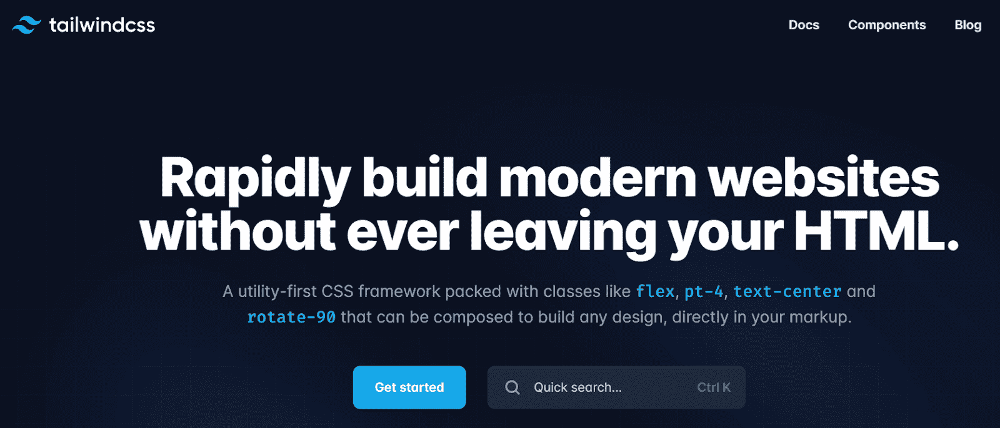
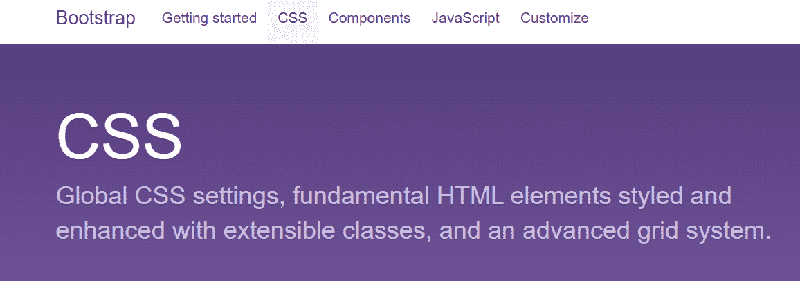
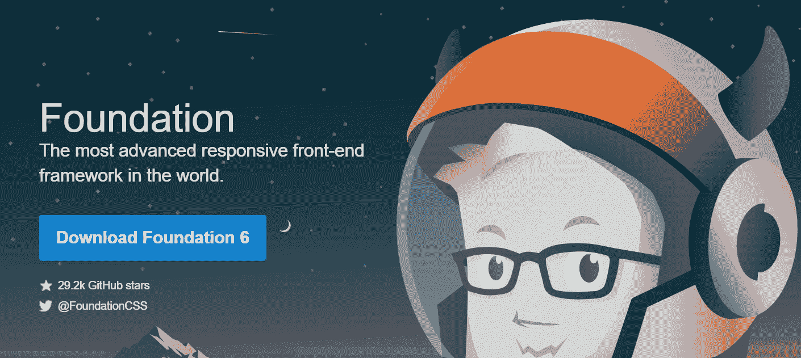
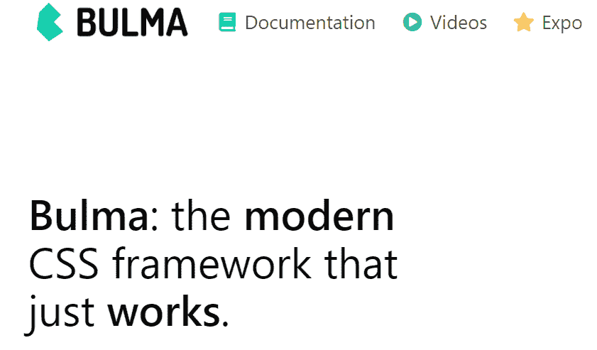
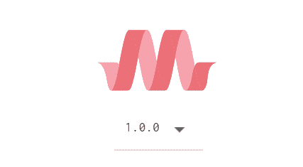
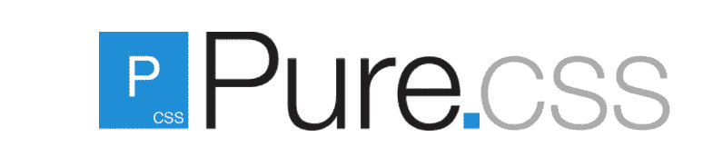
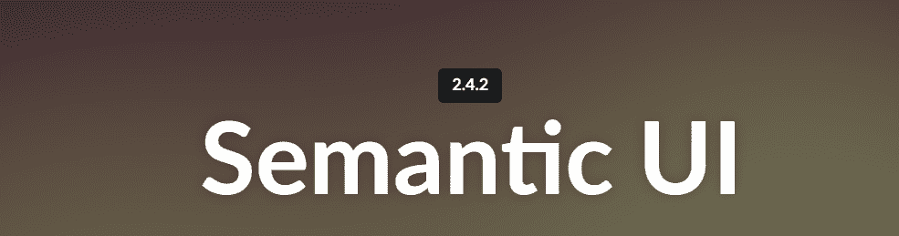
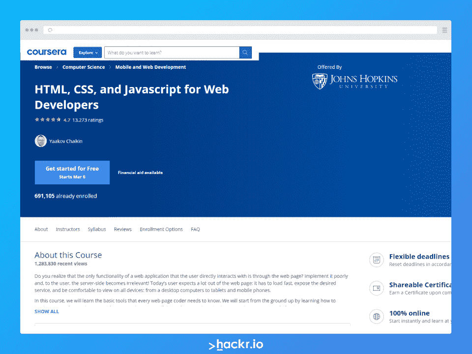

# 2023 年前端开发者最佳 CSS 框架

> 原文：<https://hackr.io/blog/best-css-frameworks>

你能想象没有 [CSS](https://hackr.io/tutorials/learn-css) 的 web 开发吗？对我们来说听起来很凄凉！级联样式表，通常称为 CSS，为您的网页或 HTML 元素提供独特的样式。您可以用一个样式元素控制多个网页的布局，或者为不同的元素编写自定义 CSS。

所有 CSS 组件都存储在。css 文件。随着网页数量的增加，样式元素也会增加，CSS 文件在某些时候会变得很大。另外，已经有一些不同的 CSS 类型了。如果更多的人在一个项目中工作，管理谁改变了什么风格就变得很困难，从而在代码中产生了随机性。但是什么是 CSS 框架呢？

CSS 框架是现成的 CSS 样式表或 CSS 库，具有已经编码的 web 设计，为 web 开发人员提供了一些帮助，因为他们节省了开发代码的一些工作。不同的框架适用于不同的项目需求，并且每个框架都有一些独特的特性。

你可能想阅读 [CSS 备忘单](https://hackr.io/blog/css-cheat-sheet)来快速温习你的 CSS 概念。

## 为什么我们需要 CSS 框架？

除了节省编码工作的时间之外，拥有 CSS 框架还有一些重要的好处:

*   跨浏览器兼容性
*   对称布局
*   可维护和设备友好的风格
*   良好的网页设计实践
*   高生产率和发展速度

## 2023 年顶级 CSS 框架

顺风使前端开发更快。代替默认的主题或者内置的 UI 组件，你将得到预先设计的窗口小部件菜单和工具类来构建你的网站。Tailwind 有模块化的组件，如果你在一个地方做了修改，你代码的其他部分不会受到影响。Tailwind 需要的学习量最少，而且简单易用。您还可以使用 Tailwind CSS helper 类定制您的网站。

主要特点:

*   它是一种实用优先的框架，提供教程。
*   它给了你选择网站设计的灵活性和自由度。
*   每个类的详细文档使您可以轻松地搜索您需要的内容。(即[网格](https://tailwindcss.com/docs/grid-template-columns)、[柔性盒](https://tailwindcss.com/docs/flex-direction)等。).
*   更高的生产率和更小的封装尺寸。
*   没有命名或上下文切换，即在 HTML 和 CSS 之间切换以查看变化。
*   您可以使用组件特性优雅地重用代码。

适合:小型企业和初学者

Github 链接:[https://github.com/tailwindlabs/tailwindcss](https://github.com/tailwindlabs/tailwindcss)

[尝试顺风](https://tailwindcss.com/)

Bootstrap 是全球最流行的 CSS 框架之一，由于其响应式的设计而立即受到欢迎。这也是第一个优先考虑移动设备的框架。有了 Bootstrap，就不需要为移动观看单独设计了。你只需要添加必要的类，网站就会根据设备来适应屏幕大小。网格是在 Bootstrap 中引入的，这大大减少了开发人员必须编写的代码。

主要特点:

*   兼容所有浏览器–无需编写特定于浏览器的代码，实现快速原型制作。
*   拥有广泛社区支持的最常用的 CSS 框架，
*   内置组件，如导航、表单、卡片、按钮、徽章等。
*   带有自定义 CDN 的优秀 JavaScript 组件。
*   免费使用-4.5 版有更多的预设布局和响应能力。
*   方便用户。

非常适合:既想要用户友好性又想要高度定制能力的个人和企业。

Github 链接:[https://github.com/twbs/bootstrap](https://github.com/twbs/bootstrap)

[尝试自举](https://getbootstrap.com/docs/3.4/)

[用 HTML 和 CSS 构建响应式现实世界网站](https://click.linksynergy.com/deeplink?id=jU79Zysihs4&mid=39197&murl=https%3A%2F%2Fwww.udemy.com%2Fcourse%2Fdesign-and-develop-a-killer-website-with-html5-and-css3%2F)

Foundation 是最先进、最复杂的 UI 框架之一，支持快速网站开发。就像 Bootstrap 一样，Foundation 遵循移动优先的方法，并具有全面的响应能力。它非常适合需要大量样式的大型 web 应用程序。Foundation 是可定制的、灵活的、语义化的。此外，Github 上有超过 2000 名贡献者，并有不错的社区支持。

主要特点:

*   好用。
*   一个加载了有用工具的完整前端框架，而不仅仅是一个 CSS 框架。
*   附带一个命令行界面(CLI ),用于将基础源代码编译为可在 HTML 标记中使用的 CSS。
*   它最初是由 ZURB 公司开发的，但现在由志愿者维护。
*   灵活、模块化和可扩展。
*   提供许多可选的模块化 JavaScript 组件和插件，如工具提示、提醒、传送带、下拉菜单、占位符、cookies 等。
*   灵活的导航模式节省了许多代码行，提高了生产率。

非常适合:重视隐私的高级开发人员(开源)。

Github 链接:[https://github.com/foundation/foundation-sites](https://github.com/foundation/foundation-sites)

[试粉底](https://get.foundation/)

尽管是新加入的，布尔玛已经迅速爬上了 CSS 框架的前十名。它没有 JavaScript 组件(没有 js)和可读性最强的 CSS 类。为了创建网格，布尔玛有一个强大的系统称为瓷砖，使页面优雅整洁。它高度模块化，简单易学。尽管很小，布尔玛有一个充满热情的社区，他们希望改变网站 CSS 的本质。

主要特点:

*   创新的设计与 SaaS 变量，使定制简单，即使是初学者。
*   多功能框架，带有排版、表格、垂直对齐组件、媒体对象、布局等。
*   免费和开源(麻省理工学院许可)。
*   基于 Flexbox，因此轻松创建垂直对齐的网格项目。
*   因为它是模块化的，所以您不需要导入所有东西——只需导入项目使用的组件。
*   它包含计算颜色、可见性、间距等的实用函数。

非常适合:预算有限的有抱负的开发人员。

Github 链接:[https://github.com/jgthms/bulma](https://github.com/jgthms/bulma)

[试试布尔玛](https://bulma.io/)

UI Kit 拥有 CSS、HTML 和 JS 组件的全面集合。它是模块化和轻量级的。UIKit 用于 iOS 应用开发，是最好的前端 CSS 框架之一。

你可以用这个框架定制你的应用到任何级别。它包含所有核心组件，如标签、按钮、表格视图等。有许多现成的主题，您可以使用相应的 SASS 或更少的 CSS 文件来使用它们。

主要特点:

*   附带许多预先构建的组件，如动画，图标导航，填充，警报，手风琴等。
*   干净简约的设计和现代的界面。
*   自包含系统，需要更多的努力来扩展或修改(与其他框架相比)。
*   易于设置。
*   一个可以在任何浏览器上运行的免费开源框架。

非常适合:需要用户友好界面的开发人员。

Github 链接:[https://github.com/uikit/uikit](https://github.com/uikit/uikit)

[舱壁舱壁舱壁舱壁舱壁舱壁舱壁舱壁舱壁舱壁舱壁舱壁舱壁舱壁舱壁舱壁舱壁舱壁舱壁舱壁舱壁舱壁舱壁舱壁舱壁舱壁舱壁舱壁舱壁舱壁舱壁舱壁舱壁舱壁舱壁](https://getuikit.com/)

Materialize 由谷歌在 2014 年创建，是一个针对网站和安卓应用的响应式 UI 框架。它提供了许多现成的组件、类和初学者模板。它与 Sass 兼容，并具有基于 Bootstrap 的 12 列网格格式的响应性布局。最精彩的部分？它丰富的调色板。所以，如果你想用 Material Design(谷歌的设计语言)工作，想在你的网站上创造出类似谷歌的效果，Materialize CSS 会是你绝佳的选择。

主要特点:

*   易于使用，并通过使用材料设计原则关注用户体验。
*   更好的内置动画和过渡以加快开发速度。
*   大量的主题和颜色。
*   优雅的填充和深度效果，如照明和阴影。
*   Materialize 只需要 jQuery(与 Bootstrap 不同，Bootstrap 需要 popper.js ),并提供 Bootstrap 提供的一切——颜色、阴影、网格、表格、徽章、卡片、芯片、导航条等。

理想对象:色彩丰富、富有创意的设计师。

Github 链接:[https://github.com/Dogfalo/materialize](https://github.com/Dogfalo/materialize)

[尝试物化](https://materializecss.com/)

顾名思义，骨架就是一个轻便的框架。如果你的网站小而简单，Skeleton 提供了必要的 CSS 元素集合来加速你的开发。它提供了样式简单的表单、标签、按钮等。您可以为您的项目获得一个响应式的网格、标准 CSS 和媒体查询，而没有更大框架的复杂性。对于想要学习 CSS 并快速创建漂亮而简单的网站的初学者来说，这是一个很好的框架。

主要特点:

*   只有 400 行源代码的最小框架。
*   易于学习和移动为重点的有限但重要的功能，如网格，按钮，排版，列表，表格，代码等。包括在内。
*   更像是样板文件，而不是成熟的框架。
*   不需要安装或编译——为新手提供一个快速的开始。

非常适合:小型项目。

Github 链接:[https://github.com/dhg/Skeleton](https://github.com/dhg/Skeleton&sa=D&source=editors&ust=1646597257955147&usg=AOvVaw1OnMhgLz1ADe6PgTIry2_U)

[试骨架](http://getskeleton.com/)

Pure 只有 3.7 KB，是目前最紧凑的 CSS 框架。在所有的 CSS 框架中，Pure 将帮助你在不牺牲空间的情况下创建令人敬畏的 CSS 代码。可以通过代码中的免费 unpkg CDN 添加 pure-min.css 来使用 pure。你也可以使用 npm、Grunt 等包管理器来安装 Pure。

主要特点:

*   只有 3.7 KB 大小(minified)，是所有最好的 CSS 框架中最小的，当你只需要一小组 CSS 特性时是理想的。
*   您可以在默认提供的现有元素的基础上编写自己的自定义元素和样式。
*   它由一个移动优先和使用网格响应 CSS 的响应网格系统组成。
*   与 Bootstrap 不同，它不支持固定布局。
*   易于定制，因为它的功能有限，不需要编译

非常适合:空间紧张的开发人员。

Github 链接:[https://github.com/pure-css/pure](https://github.com/pure-css/pure)

[试纯](https://purecss.io/)

语义有一个不同的概念——它围绕 UI 构建了一个共享的词汇表。语义基于自然语言原则，通过使代码更易于阅读和理解，为开发人员提供了更多的灵活性。除了 CSS 元素，语义还包括 HTML 元素和调试，并允许您定义元素、视图、模块、集合和 UI 元素行为。它反应灵敏，移动友好。

主要特点:

*   容易接近。
*   所有组件的广泛且组织良好的文档。
*   对于那些对 JavaScript 有基本了解的人来说很棒。
*   超过 3000 个主题变量和 50 个 UI 组件支持深度定制。
*   与其他 CSS 框架相比，更严格的编码约定。
*   可以轻松地与第三方库集成，如 Angular、React 和许多其他流行的框架，因此您可以将应用程序逻辑和 UI 组件组织在一起

非常适合:HTML 网站

Github 链接:[https://github.com/Semantic-Org/Semantic-UI](https://github.com/Semantic-Org/Semantic-UI)

[尝试语义 UI](https://semantic-ui.com/)

如果你不知道什么是图形设计，但希望你的 web 应用程序看起来有吸引力，心照不宣是一个显而易见的选择。加上心照不宣的-CSS-1.5.2.min.css，马上就能得到一个看起来很梦幻的网站。默许也符合 W3C 验证器的要求。该框架相对较新，仍在开发中，但其中一些特性值得使用，原因很简单，即使您对设计一无所知，它也能为您提供出色的设计！

主要特点:

*   不需要在 HTML 元素中提到 CSS 类名。
*   所有样式都应用于标准 HTML 元素，而不改变 HTML 本身。
*   这是小型项目的理想选择，您可以在框架之上为更复杂的项目编写自己的内联样式和类。
*   默会给予 HTML 比 CSS 更重要的地位，遵循一种非侵入式的样式方法。

非常适合:渴望简单有效的开发人员。

Github 链接:[https://github.com/yegor256/tacit](https://github.com/yegor256/tacit)

[试着心照不宣](https://yegor256.github.io/tacit/)

### 获得 CSS 认证

## 常见问题

#### 1.哪个是最好的 CSS 框架？

这取决于你想建立的网站。然而，最流行的 CSS 框架是 Bootstrap。

#### 2.什么是 CSS 框架？

CSS 框架是一个 CSS 样式表库，带有预先完成的代码，可以帮助你更快地设计网站。

#### 3.CSS 框架为什么要使用预处理器？

CSS 框架使用预处理器来自动化任务。

#### 4.CSS 框架需要哪些文件？

您需要来自各自框架的 CSS 文件，有时还需要 JavaScript 和 HTML 文件。

## 结论

CSS 框架有很多，但我们选择了 2023 年最重要的 CSS 框架。在这 10 种中，我们不能说哪一种是最好的，因为每一种都有自己的特点。通过为您的需求选择正确的 CSS 框架，所有复杂和耗时的样式都被处理掉，您可以专注于编写业务逻辑。

如果你刚刚开始使用 CSS 和 UI，那么选择默认的、纯粹的或框架的。然而，要构建更复杂的元素，您需要一个更具包容性的框架，如 Foundation、Tailwind 或 Bootstrap。你可以通过布尔玛或语义用户界面获得简单的学习曲线。

准备前端或全栈开发者面试？查看我们的 [CSS 面试问题](https://hackr.io/blog/css-interview-questions)。

**人也在读:**