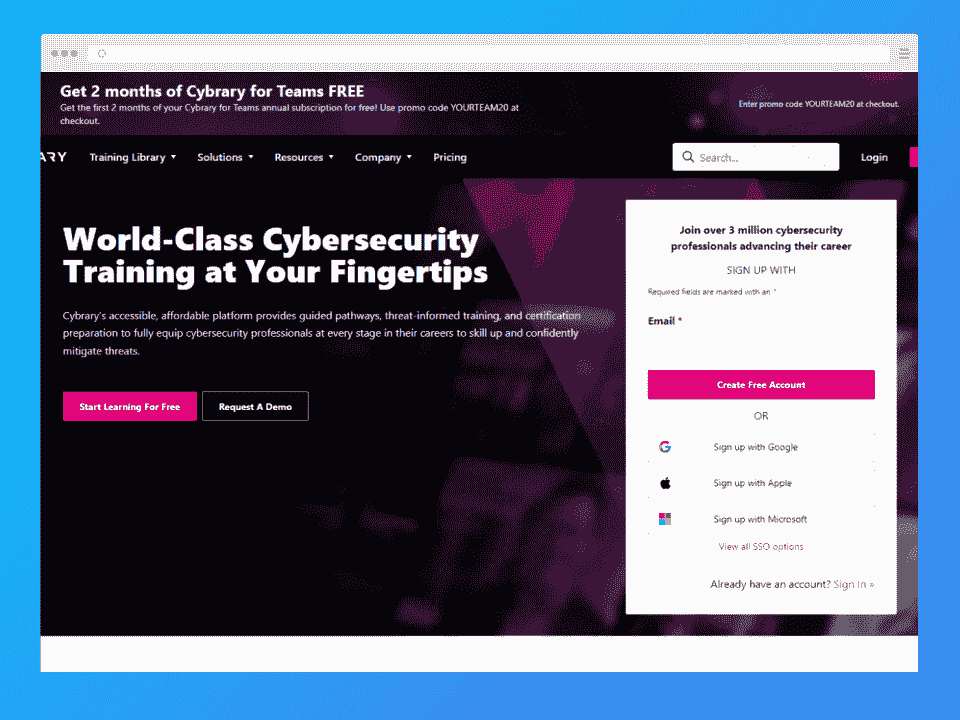
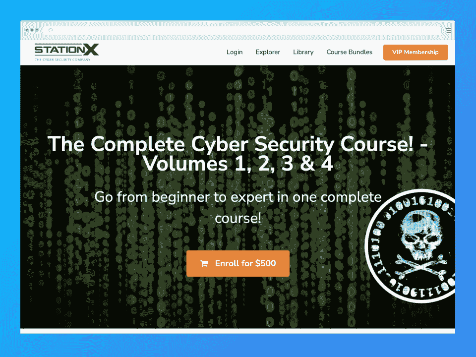
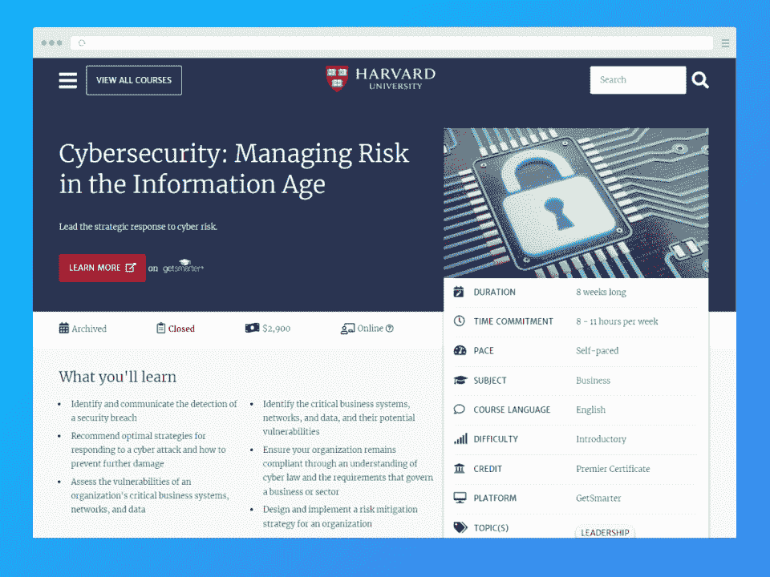
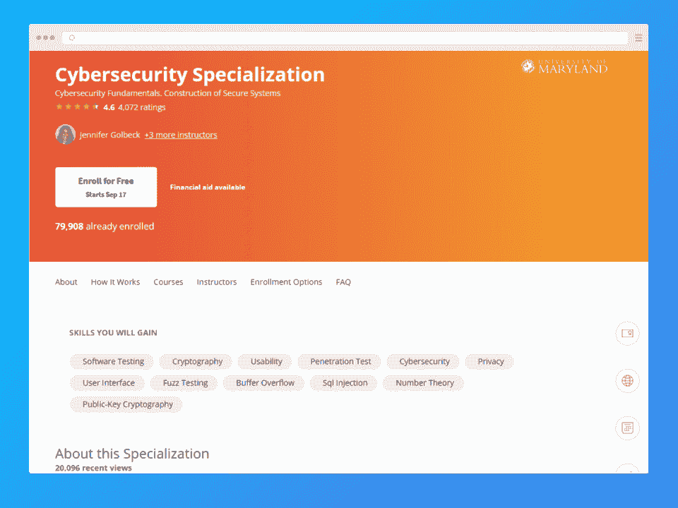
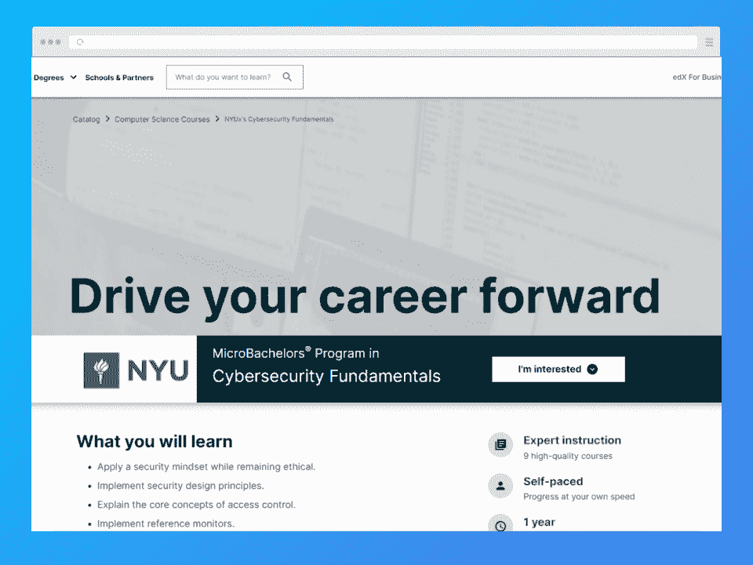
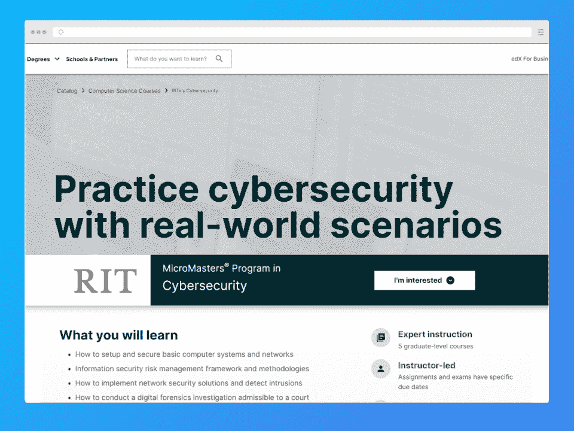

# 6 门最佳网络安全课程助你开启职业生涯[2023]

> 原文：<https://hackr.io/blog/best-cyber-security-courses>

网络安全是一个快速发展的领域，对专业人员的需求很高。开始职业生涯的最佳方式之一是参加网络安全课程。在这篇文章中，我们谈论一些最好的课程，以及如何选择适合你的课程。

## 最佳网络安全在线课程

*   提供广泛的免费课程
*   完整的网络安全课程(StationX) -初学者的最佳网络安全培训
*   哈佛网络安全:信息时代的风险管理——商业风险管理的最佳选择
*   马里兰大学(Coursera)的网络安全认证——最适合学习构建安全系统
*   网络安全基础(NYU | edX)的微型教师课程-最适合 CompTIA 安全+考试准备
*   网络安全硕士项目(RIT | edX) -最适合高级学习者

## 什么是网络安全？

如果你问的问题是什么是网络安全？，“我们简单来说:网络安全就是对计算机、软件系统、数据库、数字数据之类的防御。它可以防御黑客、诈骗者、垃圾邮件发送者和其他恶意实体等试图窃取、破坏或以其他方式危害数据和系统的不良行为者。

## 为什么要上网络安全课程？

网络犯罪是一个无处不在的问题，在这一点上，它已经成为日常生活的一部分。到处都有黑客、网络钓鱼者、诈骗者、垃圾邮件发送者和小偷，网络安全是抵御这些恶意者的最后一道防线。

网络安全专业人员负责该领域涉及的各种方面。如果你想成为这个行业的专业人士，参加课程是最好的方法之一。

原因如下:

*   **可以更快** -课程可以非常有助于你获得正确的知识和经验，而且启动速度相当快。如果你想在六个月到一年内开始你的职业生涯，从一个受人尊敬的机构学习高质量的课程是最好的方法之一。

*   **更实惠**——获得网络安全或计算机科学(专门研究网络安全)的学士或硕士学位是另一个敲门砖的绝佳途径。然而，传统教育可能花费成千上万，并可能让你负债累累。课程通常要便宜得多，即使有些课程可能要花你几千美元。

*   **可以帮助您更轻松地实现专业化** -提供网络安全各方面的课程。在你感兴趣的领域选择一个可以帮助你更有效地专业化。

也许在网上进行网络安全培训的最大原因是对网络安全专业人员本身的需求。网络安全已经发展了相当一段时间。预计 2022 年其收入将达到近 1600 亿美元。预计年增长率[为 13.33%，有理由预计到 2027 年市场规模将达到近 3000 亿美元。这可不是开玩笑的。](https://www.statista.com/outlook/tmo/cybersecurity/worldwide)

如此快速的增长带来了对职业人士的大量需求。网络安全是一个利润丰厚的领域，大多数专业人士的年薪超过六位数。看看 BLS 关于信息安全分析师的页面，他们的平均年薪是 102，600 美元。2020-2030 年的就业前景也是健康的 33%，比平均水平高出数倍。

## 2023 年顶级网络安全课程

### 1.Cybrary -提供广泛的免费课程

**我们的评分:** 4.4/5

**持续时间:**变化不定

**价格**:

*   近 500 门免费课程
*   每月支付 59 美元的升级费用，或每年支付 53 美元的升级费用

如你所料，这个聪明的名字 Cybrary 是一个关于 it、InfoSec 和网络安全相关资料的在线图书馆。创建一个免费帐户，你就可以访问他们提供的大量免费课程，你可以根据技能水平或供应商(微软、思科等)进行筛选。Cybrary 的许多课程专注于特定的网络安全领域，这有助于更容易地选择你的专业。

#### 赞成的意见

*   庞大的免费课程库，涵盖广泛的主题
*   课程涵盖该领域的许多(特定)方面，使专业化更容易
*   按难度轻松浏览和搜索课程

#### 骗局

**[了解更多关于 Cybrary](https://www.cybrary.it/)**

**我们的评分:** 4.6/5

**时长:**自定步调；50 小时的点播视频

价格:这门课程 65 美元(通常是 500 美元)，年度会员 149 美元(通常是 1199 美元)

完整的网络安全课程有四卷，涵盖由 StationX 首席执行官(和网络安全专家)内森·豪斯教授的主题。它包括你作为初学者需要学习的所有基础知识。你可以只需支付一笔费用就可以注册课程，或者注册一个年度会员，让你可以无限制地使用平台上的所有课程。

本课程的各卷也可以在 Udemy 上单独获得。仅第 1 卷就有超过 240，000 名学生，在超过 44，000 个评分中平均获得 4.5 颗星。

#### 赞成的意见

*   涵盖了从基础开始的一切
*   平价课程(特价时)，年度会员超值
*   定期更新

#### 骗局

*   课程有时会很复杂
*   很少有用户参与的课程材料，如测验和测试

**[了解更多完整的网络安全课程(statinx)](https://courses.stationx.net/p/the-complete-cyber-security-course)**

**我们的评分:** 4.7/5

**时长:**自定步调；8 周

**价格**:2900 美元

这门哈佛网络安全课程将教你一切你需要知道的关于降低企业网络安全风险的知识。它分为八个模块，每个模块需要一周时间。你可以预期每周花八到十一个小时在这门课程上。

完成这个短期课程将为你赢得哈佛大学的高级证书，这是你简历上的一个荣誉。然而，因为这是哈佛的课程，你可以期待哈佛的价格。

#### 赞成的意见

*   短期课程
*   涵盖企业网络安全的各个方面
*   有威望的

#### 骗局

*   昂贵的
*   你可能需要更多的课程来开始你的职业生涯

**[了解更多哈佛网络安全:信息时代的风险管理](https://pll.harvard.edu/course/cybersecurity-managing-risk-information-age?delta=0)**

**我们的评分:** 4.5/5

**持续时间:** 8 个月

**价格** : 7 天免费试用；然后是 59 美元/月或 399 美元/年的 [Coursera Plus](https://imp.i384100.net/oeMBVe)

Coursera 和马里兰大学的这个专业最适合中级学习者。如果只是想学，最后觉得不需要证书，可以免费旁听课程。如果你想要结业证书，你必须支付 Coursera Plus 会员资格的费用。

本课程有五个模块:可用安全性、软件安全性、密码学、硬件安全性和顶点工程。虽然本课程预计为期八个月，但也有自定进度的选项。有大量的阅读材料和视频，以及各种评分(有反馈)的作业和测验来帮助巩固你的新知识。

#### 赞成的意见

*   提供自定进度选项
*   大量互动学习材料(测验、编程作业等)
*   可以免费旁听课程(无需证书)

#### 骗局

*   如果你花时间学习，可能会很贵
*   不退款

**[了解更多关于马里兰大学(Coursera)](https://imp.i384100.net/ORdVPA)** 的网络安全认证

**我们的评分:** 4.7/5

**持续时间:**一年；大约每周 8 到 10 个小时；学生自定进程的

**价格**:1344.60 美元(通常为 1494 美元)

这个由 NYU 设计的微型 Bachelors 程序可以在 edX 上获得。它由九门课程组成，涵盖了从信息安全到网络安全和渗透测试的所有知识。如果你每周花八到十个小时学习，你可以在一年内完成这门课程。然而，由于它是自定进度的，如果你每周花更多的时间学习，你可能会完成得更快。

本课程还涵盖了 [CompTIA Security+](https://www.comptia.org/certifications/security) 认证评估中包含的大量材料。事实上，完成本课程将为您提供 36%的考试费折扣。

#### 赞成的意见

*   涵盖您需要了解的一切的全面计划
*   可以帮助您准备 CompTIA Security+认证考试
*   自定进度
*   专家授课

#### 骗局

*   与其他课程相比，需要更多的时间来学习
*   要求您已经了解网络、操作系统和编程

在网络安全基础(NYU | edX)中了解更多有关 MicroBachelors 计划的信息

**我们的评分:** 4.6/5

**持续时间:** 10 个月；讲师指导；每周 10 - 12 小时

**价格**:1436.40 美元(通常为 1596 美元)

罗彻斯特理工学院的这个微型硕士项目涵盖了基础知识以及更高级的主题，如计算机取证、网络安全和网络安全风险管理。与列表中的其他项目不同，这个项目是由教师指导的，而不是自定进度的。你需要把课程安排到你的时间表中。

#### 赞成的意见

*   获得一个可计入硕士学位学分的证书
*   涵盖高级主题，帮助您促进职业发展
*   有一个顶点项目来帮助你真正巩固你的知识

#### 骗局

*   比其他一些课程需要更长的学习时间
*   仅适用于高级学员

**[【微软网络安全硕士项目(RIT | edX)—](https://edx.sjv.io/c/2890636/1598007/17728?u=https%3A%2F%2Fwww.edx.org%2Fmicromasters%2Fritx-cybersecurity)**

## 如何选择最适合自己的网络安全课程

如果你刚刚开始进入这个领域，之前没有任何知识，你怎么知道哪些课程是好的，哪些应该跳过？在为初学者(或高级用户)寻找完美的网络安全课程时，你应该考虑什么？

以下因素可能值得研究:

*   难度等级 -当你选择课程时，首先要考虑的事情之一就是它的难度等级。对你来说最好的课程将取决于你在开始时将会带来多少知识和经验。

*   **认证** -完成网络安全课程可能会也可能不会为你赢得证书。如果你想把这份结业证书添加到你的简历中，你可能想找一些提供这种证书的课程。请注意，结业证书不是[专业认证](https://hackr.io/blog/best-cybersecurity-certification)，大多数课程只是*为你最终的认证评估做准备*。如果你最终想获得一个认证，比如 CompTIA 网络安全分析师+，你可能想寻找最能让你为此做好准备的课程。

*   **费用**——网络安全课程价格不等。有一些是完全免费的，还有一些可能要花费你几千美元。对你来说，最好的课程将是最适合你的预算，同时还包括你寻求学习的所有知识。

*   持续时间 -有些课程比其他课程长得多。如果你想尽快开始并运行，寻找适合你的时间框架的课程可能对你有好处。

## 从事网络安全新职业的提示

在一个全新的领域开始职业生涯通常会让人感到十分畏惧，尤其是对你来说这是一个全新的领域。除了网上最好的网络安全课程，下面的提示可能会帮助你开始。

*   确保这个领域适合你 -许多人直接进入一个新的领域，仅仅是因为他们听说这个领域有利可图或者需求量很大。虽然这没什么错，但在你完全投入之前，最好至少尽你所能确保你在某个领域感到舒适。毕竟，虽然在线网络安全课程可以在教育范围内负担得起，但你通常还是会花很多钱。

*   **探索网络安全的各个领域** -当你确认这个领域的职业是否适合你时，你也可以看看你可以专攻的各个领域。探索你所有的选择，你可能会找到一个让你感兴趣并让你充满激情的领域！

*   **加入网络安全社区和网络** -网络通常是成功的关键。加入以网络安全为中心的社区可以把你介绍给和你一样开始职业生涯的人。或者，你也可以遇到一位可以一路指导你的**导师**。

*   实践、实践、实践——如果你真的想为这个领域的职业生涯做准备，光知道做什么和怎么做是不够的——你还必须用经验来支撑。你可以通过个人项目实践、参加黑客马拉松或 bug bounties 等活动，甚至是在网络安全领域找一份实习工作来积累经验。在你开始找工作的时候，你也应该已经知道了足够的知识，能够自信地回答任何面试问题。

## 我们是如何选择这份名单上的网络安全课程的

如果你想[学习网络安全](https://hackr.io/tutorials/learn-cyber-security)，你可以从我们在本文中整理的课程开始。我们选择放在这个列表上的课程包括不同技能水平的选项，并且质量很高。

为了确保我们只把最好的网络安全课程放在这个名单上，我们确保做了大量的研究。除了搜索一些最受欢迎的选项，我们还确保采纳过去的学习者和网络安全专家的建议。

除此之外，我们还确保尽可能检查评论。我们还尽可能地研究了课程和教程，以确保课程对用户友好且相对容易掌握。

## 结论

网络安全课程可以帮助你尽快在这个非常受欢迎且利润丰厚的领域开始你的职业生涯。只要确保你在选择课程之前考虑了所有的选择。

如果你认为我们错过了这个列表中的任何课程，请在下面的评论中告诉我们！

## 常见问题

#### 1.网络安全哪门课程最好？

最好的网络安全课程是最符合你的技能水平、预算和需求的课程。如果你是初学者，我们推荐 [**由 statinx**](https://courses.stationx.net/p/the-complete-cyber-security-course)完成的网络安全课程。

#### 2.网络安全难学吗？

学习网络安全可能很有挑战性，尤其是如果你没有多少计算机背景的话。适合初学者的网络安全课程可以帮助你从基础开始，边学边学。

#### 3.网络安全需要什么资质？

你可以拥有的最好的资格之一是 IT、网络安全、计算机科学和网络工程等领域的学士或硕士学位，尽管其他 STEM 领域也有工作。如果你没有学位，那么你必须至少完成了一个受人尊敬的机构的网络安全课程。您还可以从专业的网络安全认证(如 CompTIA)中受益匪浅。最后，经验对被录用非常重要。

#### 4.2 个月能学会网络安全吗？

你也许可以，但这真的取决于你从什么水平开始，以及你投入了多少时间来学习。如果你在计算机方面已经比较有知识，并且愿意全职学习，两个月的时间足够了。