# 2023 年 10 大最佳网络安全工作(含薪酬)

> 原文：<https://hackr.io/blog/best-cyber-security-jobs>

随着我们在数字产业中不断前进，存在的威胁和风险也在增加。问题是缺乏训练有素的专业人员来处理这些问题。这使得网络安全领域的熟练技术人员非常吃香。

在这篇文章中，我们将探索网络安全行业的当前趋势，拥有相关工作的好处，以及 2023 年你可以考虑的最佳网络安全工作。

## **目前的网络安全行业是怎么回事？**

2023 年的网络安全领域出现了黑帽攻击的增加，这些攻击涉及勒索软件、物联网(IoT)漏洞和人工智能(AI)驱动的高级威胁。

但是这些问题只是众多网络问题中的三个。2022 年，对汽车应用编程接口的攻击大幅增加 [380%](https://upstream.auto/reports/global-automotive-cybersecurity-report/) ，即使已经采取了预防措施和强化网络安全保护。

云安全也是一个主要问题，尤其是随着越来越多的企业将其数据和运营转移到云。因此，2022 年前六个月的数据泄露非常猖獗，817 起事件影响了超过[5300 万](https://www.statista.com/statistics/273550/data-breaches-recorded-in-the-united-states-by-number-of-breaches-and-records-exposed/)个人。

根据美国联邦调查局(FBI)的 [2021 年互联网犯罪报告](https://www.ic3.gov/Media/PDF/AnnualReport/2021_IC3Report.pdf)，网络犯罪受害者损失约 69 亿美元。该报告还列举了 3，729 起与勒索软件有关的投诉和超过 11，000 起网络钓鱼案件。

美国劳工统计局预测，从 2021 年到 2031 年，网络安全行业的就业人数将增长 35%。随着网络威胁变得越来越复杂，急需能够有效捕捉和应对这些威胁的熟练专业人员。

**相关课程:**

**[网络安全:从初学者到专家](https://click.linksynergy.com/deeplink?id=jU79Zysihs4&mid=39197&murl=https%3A%2F%2Fwww.udemy.com%2Fcourse%2Fcybersecurity-from-beginner-to-expert%2F&u1=blog%2Fbest-cybersecurity-certification_amcid-ArF3olFN6ml2rVbYF27qr)**

## **网络安全职业的好处**

随着网络安全成为世界上最关键的行业之一，当你进入相关职业时，你可以获得很多好处。首先，鉴于对专家的需求很高且仍在增长，你失业的可能性很低(除非你选择失业)。

以下是获得网络安全工作的其他优势。

### **有竞争力的薪资**

与任何其他市场一样，某物或某人的价值随着其变得越来越稀少而增加。全球范围内缺乏训练有素的网络安全专业人员，这意味着更高的工作机会。

网络产业预计将继续发展，这也可能意味着更多的点可以被黑帽演员利用。随着该领域的发展，网络安全专家的工资可能会进一步上涨。当然，这也要看你完成到什么程度，以及你的技能水平。

**相关:**[2023 年十大网络安全度选项](https://hackr.io/blog/online-cyber-security-degree)

### **剩余工作岗位**

网络安全不局限于一个专业，因为它在网络安全和数字取证等方面至关重要。其他工作还涉及数据库管理、网络犯罪调查、道德黑客以及更多实践。这种多样性让你可以探索你感兴趣的领域，同时找到成长的机会。

### **无限技能增长**

随着新技术的引入，网络威胁只会继续发展并变得更加复杂。因此，一些今天有效的解决办法和预防措施在未来可能不再有效。

非常了解网络安全行业的最新趋势，例如任何形式的新发明的恶意软件和黑客技术，这是一项关键要求。虽然这似乎很难跟上，但它可以让你在奔跑中继续提升技能。这也能让你的职业生涯随着你面临的新挑战和学习曲线不断更新。

**相关:**[2023 年你需要的 5 项网络安全技能](https://hackr.io/blog/cybersecurity-skills)

### **远程工作设置**

网络安全职业最好但经常被忽视的好处之一是远程工作的自由。大多数网络安全工作可以在互联网上完成，实际上工作的每一部分都在互联网上进行。这可以让你更好地平衡工作和生活，增加工作的灵活性。

## **十大最佳网络安全工作**

最受欢迎的工作包括测试一个系统的强弱，设计网络安全，加强软件安全。发现网络安全领域的哪些职业会给你带来最好的薪水和发展机会。

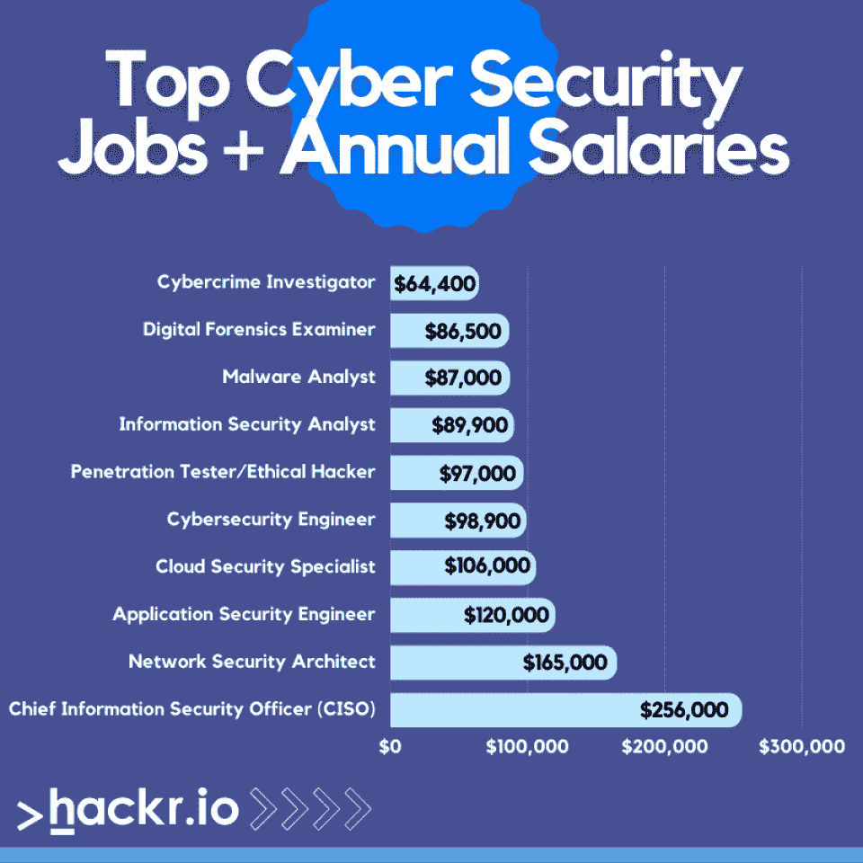

[**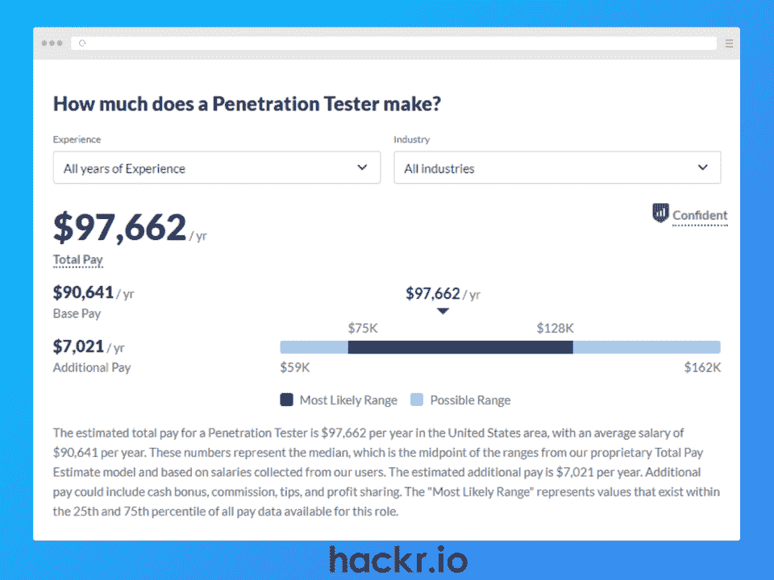**](https://www.glassdoor.com/Salaries/penetration-tester-salary-SRCH_KO0,18.htm?clickSource=careerNav)

**工资:** [【年薪 97000 美元](https://www.glassdoor.com/Salaries/penetration-tester-salary-SRCH_KO0,18.htm?clickSource=careerNav)

**资格**

*   计算机科学、信息技术、计算机工程或其他相关专业的学士学位
*   至少有一到四年的工作经验
*   使用 Kali Linux 和 Wireshark 等渗透测试工具的经验

所有的系统在被创建的那一刻就不是不可战胜的——它们布满了可以被利用的漏洞。这就是渗透测试人员或道德黑客介入的原因。

渗透测试人员模拟攻击，这将有助于找到特定系统中容易被突破的弱点。这涉及到渗透工具的使用，甚至是新工具的设计，来进行实验。

在进行模拟网络攻击时，pen 测试人员记录了他们如何绕过系统现有安全措施的每个细节。这揭示了一家公司成功挫败恶意黑客攻击的可能性有多大。

**主要职责**

*   设计和执行渗透测试，彻底检查不同系统的安全协议
*   根据考试的结果，以技术或非专业的语言组织基于观众的测试结果
*   建议进一步加强和消除测试系统中发现的弱点的步骤

**关键技能**

*   精通操作系统，如 Linus、Windows 和 UNIX
*   精通各种编程语言，包括 Bash、C、C++、Java、Perl、Python 和 Ruby
*   擅长黑盒测试
*   精通网络协议和实践
*   较强的书面和口头交流技能，能够解释和报告调查结果

**认证**

[**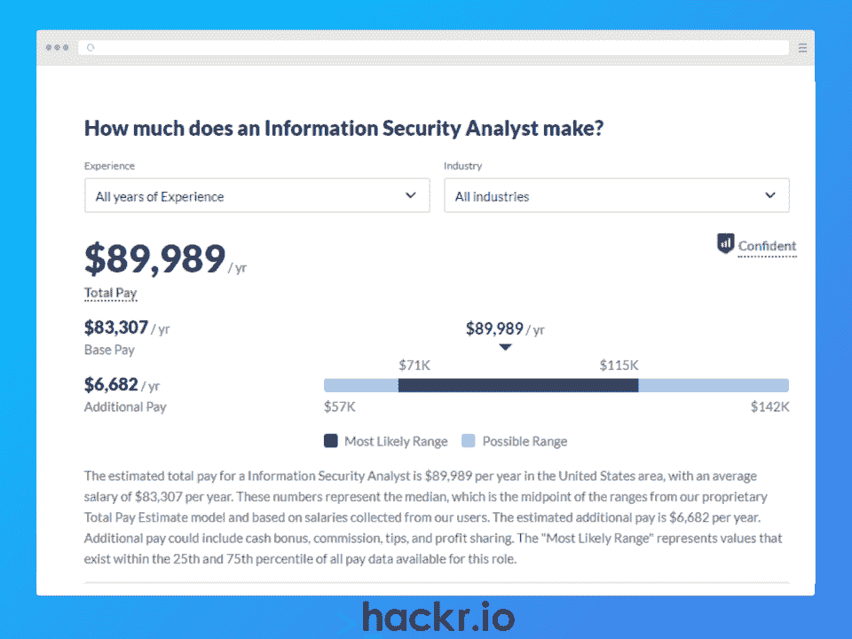**](https://www.glassdoor.com/Salaries/information-security-analyst-salary-SRCH_KO0,28.htm)

薪资:[【89900 美元/年](https://www.glassdoor.com/Salaries/information-security-analyst-salary-SRCH_KO0,28.htm)

**资格**

*   计算机科学学士学位或信息系统 MBA 学位
*   至少 3 年经验
*   精通防火墙和各种 IDPS 概念

网络攻击随时可能发生，通常很难被注意到。信息安全分析师的工作是监控公司网络的任何变化，并在出现可疑活动时做出正确的判断。

在解决攻击后，infosec 分析师还准备必要的文档。同时，了解网络安全的最新趋势也是他们的一项关键要求，这对于评估受监控系统至关重要。

对信息安全分析师需求很大的行业包括信息、计算机系统、保险和金融。

**主要职责**

*   关注公司的整体安全性，包括网络、软件和物理安全性
*   发生安全漏洞时的检测和调查
*   使用数据加密技术和防火墙保护私人信息
*   跟踪信息技术领域的最新新闻和趋势
*   设计和开发安全实践以确保最小风险
*   执行合规控制测试程序

**关键技能**

*   熟练使用 Apache Ant、Blackboard 和 Django 等标准工具
*   精通计算机系统和数字网络，能够分析安全增强点
*   非常注重细节，以便准确及时地检测网络威胁和攻击
*   出色的问题解决技能，可有效应对安全漏洞
*   制定信息安全风险防范措施的创新能力
*   较强的口头和书面沟通能力，能够报告调查结果并给出相关建议

**认证**

[**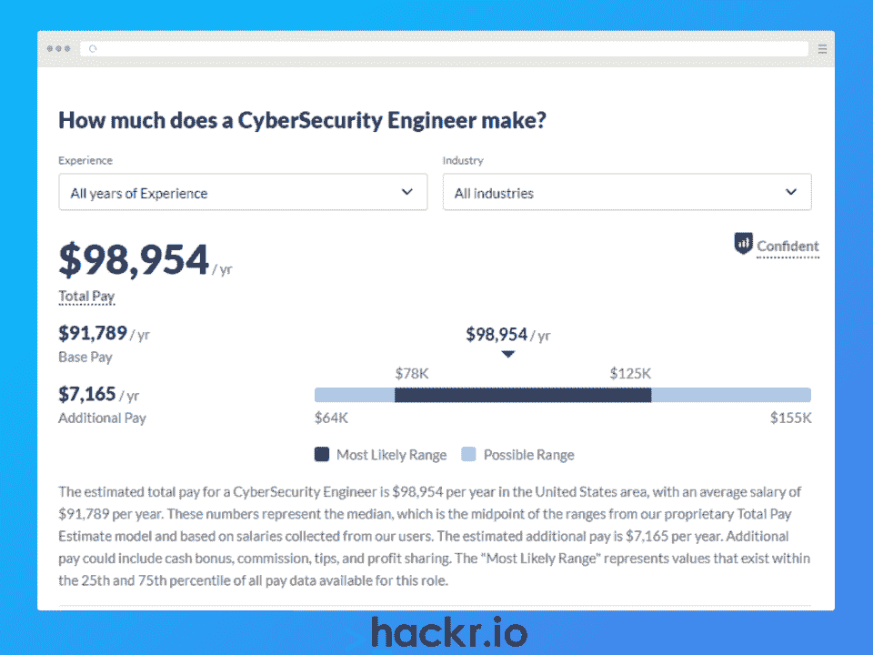**](https://www.glassdoor.com/Salaries/cybersecurity-engineer-salary-SRCH_KO0,22.htm)

**工资:**[【98900 美元/年](https://www.glassdoor.com/Salaries/cybersecurity-engineer-salary-SRCH_KO0,22.htm)

**资格**

*   计算机科学、系统工程、信息技术及相关背景的学士学位
*   至少 2 年网络安全经验
*   精通终端安全措施和防火墙的维护和操作

公司不需要等着有人攻击他们，然后再建立针对网络威胁的防御措施。这就是网络安全工程师的用武之地。他们负责设计和实施旨在挫败网络空间潜在威胁的措施。

在建立保护系统之后，他们还需要不断地监控和增强它们，以确保最新的安全性。一个很好的例子就是防火墙维护和各种路由方法的实施。

虽然网络安全工程职位通常需要学位，但那些至少有两到四年经验的人可能会获得这个职位。不过，要晋升到高级职位，你确实需要获得硕士学位。

**主要职责**

*   实施对确保机构的物理和网络安全至关重要的各种行动
*   评估组织的现有安全措施，并制定适当的增强措施和最佳做法
*   处理任何类型的网络安全漏洞
*   每天报告调查结果并监控文档
*   随时待命应对突发的安全漏洞
*   也可以处理渗透和漏洞测试

**关键技能**

*   包括 C、C++、Go、Node、PowerShell、Python 和 Java 在内的各种语言的优秀编码和脚本技术
*   强大的网络技能，包括 VPN、DNS 和路由方法的知识
*   精通各种操作系统，如 Linux、UNIX 和 Windows
*   熟悉防火墙和安全协议
*   良好的口头和书面沟通技巧

**认证**

[**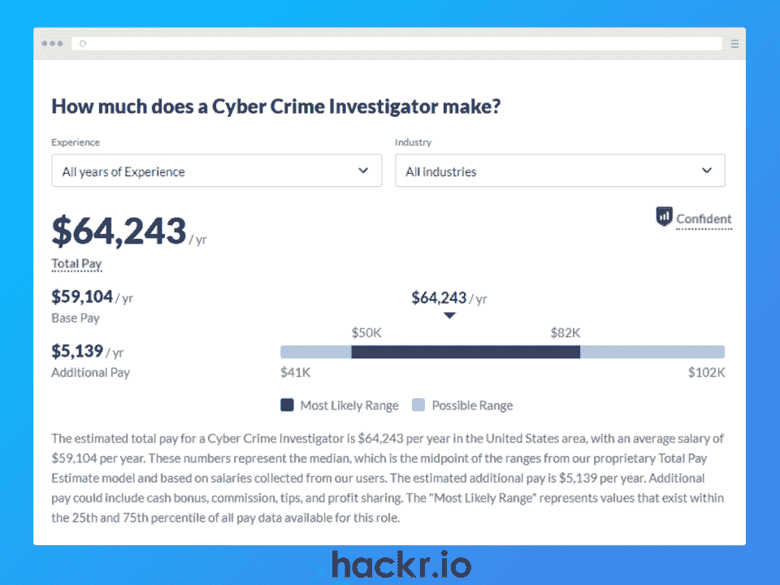**](https://www.glassdoor.com/Salaries/cyber-crime-investigator-salary-SRCH_KO0,24.htm)

薪资: [【年薪 64400 美元](https://www.glassdoor.com/Salaries/cyber-crime-investigator-salary-SRCH_KO0,24.htm)

**资格**

*   刑事司法、计算机科学和其他相关领域的学位
*   有与相关政府部门一起处理相关案件的经验

垃圾邮件、身份盗窃和个人信息泄露等问题是网络犯罪的几个例子，很容易变得非常严重。网络犯罪调查员的工作就是打击这些。

你通常会以调查员的身份加入咨询机构和执法机构。虽然渗透测试是您职责的一部分，但您的主要任务是收集证明网络犯罪的证据。

调查网络攻击还包括找到突破口，这意味着你也可以针对相同的安全风险提出预防措施。为此，您可能会与类似的角色合作，如数字取证分析师和渗透测试员。

**主要职责**

*   检测正常网络和黑暗网络中发生的网络犯罪
*   评估安全漏洞或网络事件的程度，以及是否需要采取法律和紧急措施
*   与政府机构、执法者和类似角色合作
*   通过受害者访谈和数字技术收集数据
*   检查和恢复受网络攻击影响的系统中的数据
*   记录并向技术和非技术受众报告调查结果

**关键技能**

*   熟练创建供法庭使用的网络犯罪文档
*   从被攻击的系统和网络中检索和恢复数据的技能
*   熟悉与相关机构的合作
*   信息技术调查和计算机取证方面的相关经验
*   使用 SQL 的经验

**认证**

[**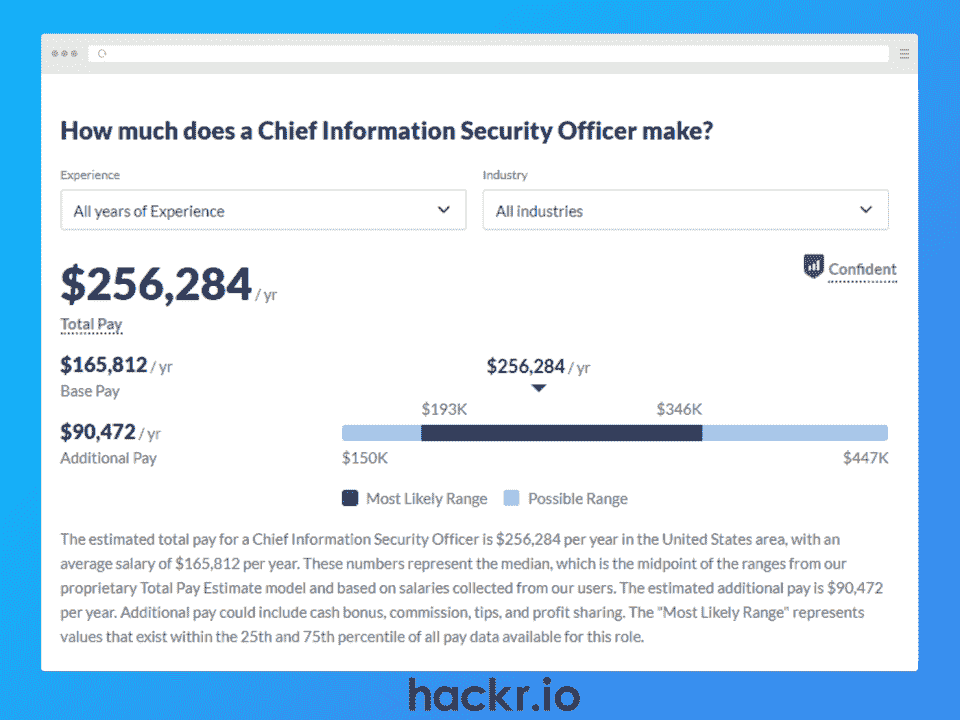**](https://www.glassdoor.com/Salaries/chief-information-security-officer-salary-SRCH_KO0,34.htm)

**薪资:** [【年薪 25.6 万美元](https://www.glassdoor.com/Salaries/chief-information-security-officer-salary-SRCH_KO0,34.htm)

**资格**

*   计算机科学、信息技术及相关领域的研究生学位或 MBA 学位
*   根据该职位的资历，至少有 8 年的工作经验
*   风险管理、编程语言和咨询方面的相关经验

这份工作可能是当前网络行业的最高基准，尤其是因为它是一个监督角色。作为首席信息安全官，您将负责监督贵公司在安全方面如何处理数据。

CISO 的任务是领导团队针对行业中的潜在威胁制定预防和防御措施。您还负责提供有效解决安全缺陷的指导。

成为 CISO 意味着你将坐在一个行政职位上。在这方面，您的见解也将成为实施新业务战略以确保机构网络和安全的关键因素。

**主要职责**

*   当您与担任管理角色的人员一起工作时，提供关于业务战略的安全相关见解
*   为您的机构构建和维护有效的安全基础设施
*   领导针对网络事件的响应和行动
*   确定不会造成额外伤害的安全技术投资
*   实施和确保合规控制实践

**关键技能**

*   口头和书面交流能力
*   监督网络安全事件响应
*   熟悉各种系统和云的架构
*   优秀的解决问题的策略，包括分析性思维
*   精通软件分析

**认证**

[**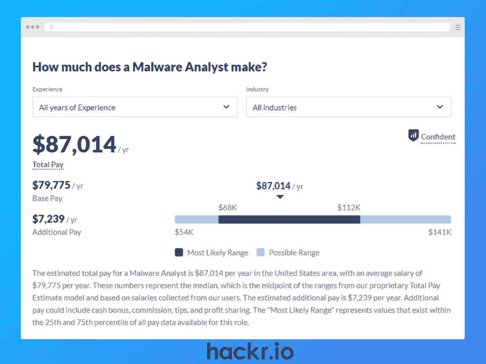**](https://www.glassdoor.com/Salaries/malware-analyst-salary-SRCH_KO0,15.htm)

**工资:** [【年薪 87000 美元](https://www.glassdoor.com/Salaries/malware-analyst-salary-SRCH_KO0,15.htm)

**资格**

*   计算机工程、计算机科学、网络安全或任何其他类似领域的学士学位
*   至少有一到五年的工作经验
*   有效处理各种恶意软件的经验

特洛伊木马、广告软件和勒索软件等恶意软件变种不仅会导致安全问题，还会造成经济损失。恶意软件分析师的工作是确定哪种恶意软件攻击了公司的系统，并采取相应的解决方案来阻止攻击。

作为一名优秀的恶意软件分析师，经验是必要的，因为它有助于在设计旨在将系统恢复到良好状态的计划时建立良好的判断。此外，恶意软件分析师最好是能准确报告网络攻击的细节和减轻攻击的方法的良好沟通者。

就教育而言，学士学位通常就足够了，尽管更高的学位会增加你获得该职位的机会。符合工作角色的同等经验也可能使你有资格成为恶意软件分析师。

**主要职责**

*   检测和评估影响系统的各种恶意软件
*   恢复被恶意软件破坏的系统和网络
*   开发和推荐防范恶意软件的实践和工具
*   不断了解业界最新的恶意软件相关新闻
*   创建增强的策略来加强安全性

**关键技能**

*   非常熟悉各种操作系统的架构，如 Windows、Linux 和 UNIX
*   熟练使用多种工具，如 RegShot、IDA Pro 和 TCP view
*   精通 C 和 C++等编程语言，能够对代码进行逆向工程
*   优秀的口头和书面沟通技巧，用于报告调查结果和建议

**认证**

[**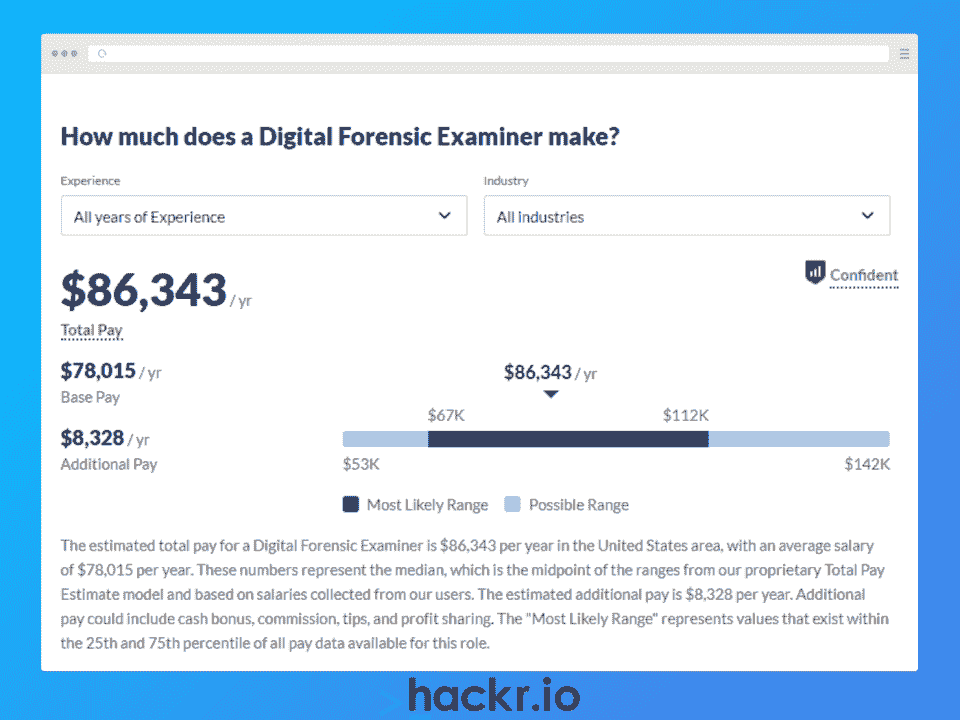**](https://www.glassdoor.com/Salaries/digital-forensic-examiner-salary-SRCH_KO0,25.htm)

**工资:** [【年薪 86500 美元】](https://www.glassdoor.com/Salaries/digital-forensic-examiner-salary-SRCH_KO0,25.htm)

**资格**

*   网络安全、计算机科学、计算机技术或其他相关专业的学士学位
*   至少两年该领域的经验
*   使用各种数字取证检查工具和从事刑事司法工作的经验

像儿童色情和诈骗这样的电子犯罪越来越猖獗。数字取证审查员的任务是从数字设备中收集数据，以证明此类犯罪在法庭上的发生。

数字取证包括检测针对网络犯罪的证据，然后进行保存和分析。然后对这些文件进行处理和记录，以便在法庭审判中出示。

在商业环境中，数字取证审查人员通常是事件响应的一部分，他们负责记录网络犯罪事件的详细信息，这些信息将提交给执法部门。

**主要职责**

*   测试受影响的设备，从计算机到更复杂的电子设备
*   提取证据和痕迹进行保存和分析
*   通过为数字调查提供支持，与执法机构合作
*   为法庭使用而收集的证据文件

**关键技能**

*   网络知识
*   网络安全知识
*   对法律和刑事调查的理解
*   善于分析，注重细节
*   很强的沟通技巧

**认证**

[**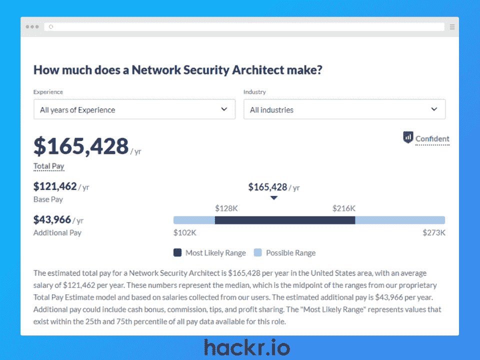**](https://www.glassdoor.com/Salaries/network-security-architect-salary-SRCH_KO0,26.htm)

**薪资:** [【年薪 16.5 万美元](https://www.glassdoor.com/Salaries/network-security-architect-salary-SRCH_KO0,26.htm)

**资格**

*   信息系统、计算机科学或任何其他类似领域的研究生学位
*   在信息技术领域至少有 5 到 10 年的经验
*   咨询、网络架构、事件响应和相关软件使用方面的经验

类似于设计建筑的架构师，网络安全架构师也负责设计安全可靠的数字系统。在设计之前，安全架构师必须首先确定系统的改进点。

因此，他们可能还负责执行渗透测试、道德黑客和类似的活动来检查漏洞。除此之外，他们还负责创建高效的路由和工作边界安全。

在分析了这些弱点(如果有的话)之后，他们开始开发能够成功抵御恶意软件等网络攻击的系统结构。由于这是一个高级角色，网络安全架构师还在安全相关问题上指导其他同事。

**主要职责**

*   彻底探索和掌握一个机构的系统和网络
*   为每个项目开发强大的安全架构
*   创建可靠的最佳实践来维护整体安全性
*   测试现有的和新创建的系统中容易绕过的弱点
*   执行全面测试，以确保设计的功能正常工作
*   维护和更新现有架构，以应对最新趋势和协议

**关键技能**

*   精通各种操作系统的架构，如 Linux、UNIX 和 Windows
*   有安装网络硬件的经验
*   精通网络访问控制、IDS/IPS 和防火墙等外围安全
*   风险评估和管理
*   良好的口头和书面沟通技巧

**认证**

[**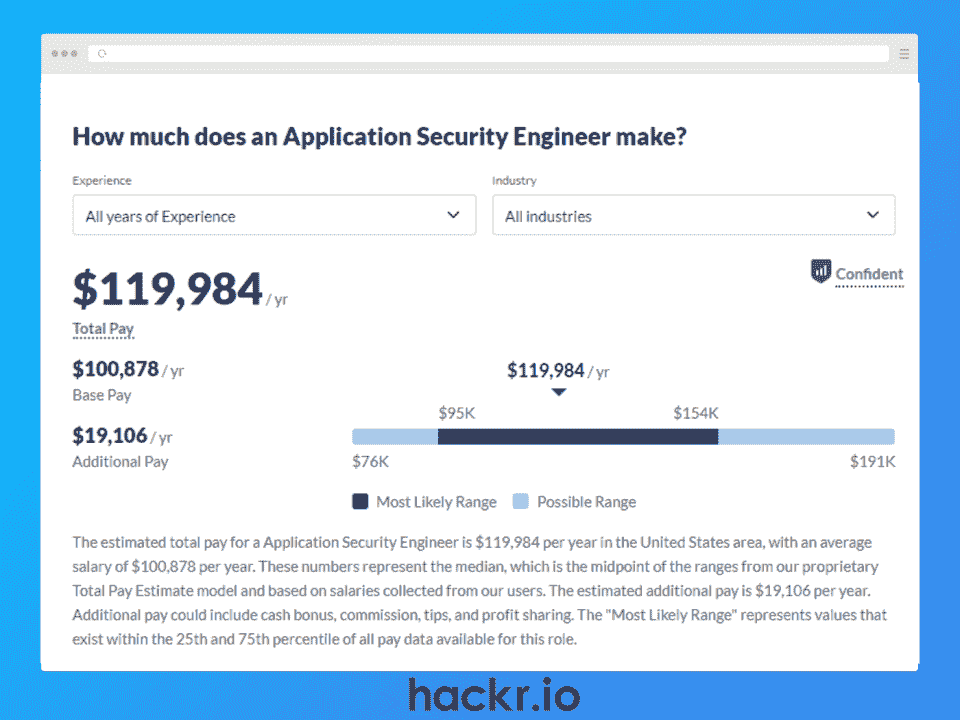**](https://www.glassdoor.com/Salaries/application-security-engineer-salary-SRCH_KO0,29.htm)

**薪资:** [【年薪 12 万美元](https://www.glassdoor.com/Salaries/application-security-engineer-salary-SRCH_KO0,29.htm)

**资格**

*   计算机科学或其他相关专业学士学位
*   至少 2 到 4 年的工作经验

开发应用程序总是涉及修复错误和加强安全弱点。确切地说，他们创建安全策略来抵御来自应用程序内部和外部的攻击。

这些任务由应用安全工程师执行。他们通常负责识别应用程序中的漏洞并修复它。这些观察结果被记录下来，并在第二天与其他工程师进行讨论。

通常，应用程序安全工程师倾向于与项目经理和软件开发团队合作。

**主要职责**

*   创建有助于维护应用程序安全性的策略
*   查找安全漏洞并修复它们
*   开发、实施和记录所使用的应用程序安全控制

**关键技能**

*   出色的编码和脚本编写体验，确保代码没有错误或错误最少
*   了解常见的网络威胁以及如何防御这些威胁
*   良好的道德黑客技术
*   识别应用程序中的漏洞并加强其安全性
*   通过加密技术确保数据安全的能力
*   熟练处理恶意软件攻击

**认证**

[**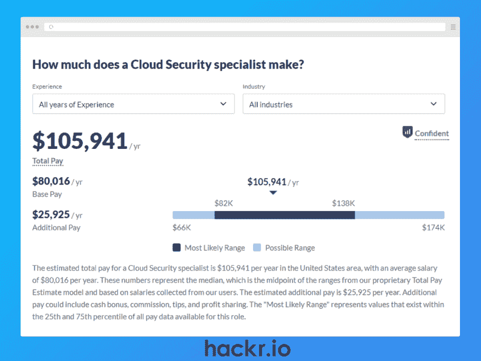**](https://www.glassdoor.com/Salaries/cloud-security-specialist-salary-SRCH_KO0,25.htm)

**工资:**[【10.6 万美元](https://www.glassdoor.com/Salaries/cloud-security-specialist-salary-SRCH_KO0,25.htm)

**资格**

*   信息安全、编程、计算机科学或任何其他类似领域的学士学位
*   至少五年的行业经验

越来越多的机构正在将他们的运营和数据转移到云上。虽然这在运营成本方面很大，但这也要求云安全专家在未经授权的情况下保持云中的数据不受影响。

企业对云的高度依赖增强了保持 it 功能和安全性的需求。这就是云安全专家发挥作用的地方。

他们负责检测潜在的未经授权的入侵，以及实施预防措施。更具体地说，他们创建策略来防止数据在没有适当授权的情况下被更改或访问。

**主要职责**

*   抵御网络攻击，保持云存储数据和基于云的系统的完整性
*   执行漏洞测试以识别系统中的弱点
*   实施预防性安全措施
*   防止数据泄露和对数据的未授权访问

**关键技能**

*   熟练掌握云安全的各种流程和工具
*   精通信息和网络技术的安全标准
*   较强的口头和书面交流能力
*   精通各种云计算标准，如 [CSA CCM](https://cloudsecurityalliance.org/research/cloud-controls-matrix/)

**认证**

## **结论**

对网络安全专业人员的需求达到了前所未有的高度，尤其是由于缺乏熟练人员而面临的威胁越来越多。因此，在网络安全行业工作让你享受有竞争力的工资和无限的技能增长。

这篇文章讨论了 2023 年最好的网络安全工作。无论你是纯粹的高技能爱好者还是拥有相关大学学位的人，网络安全行业都有适合你的工作。

准备好提升你的事业了吗？结账:

**[十大最佳网络安全认证](https://hackr.io/blog/best-cybersecurity-certification)**

## **常见问题解答**

### **1。哪些是薪酬最高的网络安全工作？**

总的来说，担任网络安全工程师、应用安全工程师、首席信息安全官和渗透测试员会让你享受到最具竞争力的薪水。平均薪酬从 9.7 万美元到 25.6 万美元不等。但是，当然，这也取决于你的技能水平、机构和教育。

### **2。网络安全哪个工作最好？**

决定“最佳”工作与你的专业、技能水平、工作偏好以及类似因素有很大关系。但总的来说，根据需求，最受欢迎的职位包括 CISO、渗透测试员和网络安全架构师。

如果你想进入高级职位，更高的技能、教育水平和证书可能会增加你的机会。

### **3。有哪些网络安全方面的工作很抢手？**

目前的网络安全行业正经历着专业人才的缺乏。因此，今天几乎没有一种工作是不受欢迎的。尽管如此，网络安全架构师、信息安全分析师和道德黑客仍然是三个最受欢迎的网络安全工作。

### **4。哪个国家对网络安全工作的需求最高？**

主要国家包括新加坡和美国(华盛顿特区)。信息和通信技术在新加坡蓬勃发展，而华盛顿特区是政府总部所在地。因此，网络安全工作在这两个地方大量存在就不足为奇了。

### **5。网络安全是个好职业吗？**

当然，是的。网络安全有很多好处，包括无限的个人成长、高薪、良好的工作生活平衡和工作多样性。根据你的教育水平和技能，你还可能获得其他优势。