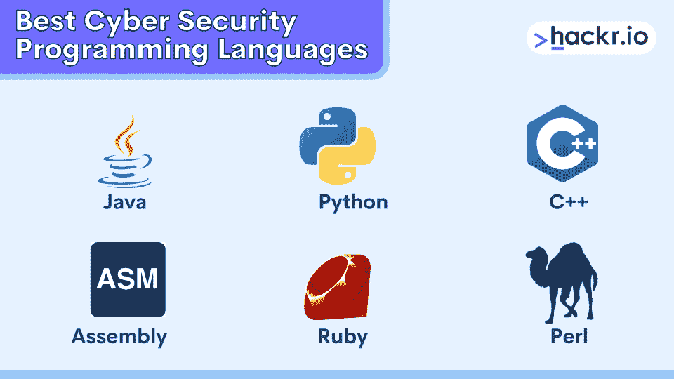

# 2023 年最值得学习的 6 种网络安全编程语言

> 原文：<https://hackr.io/blog/best-cyber-security-programming-languages>

如果你想成为一名网络安全专家，那么你需要知道如何编程。许多针对系统的攻击都涉及恶意代码，因此能够阅读网络安全编程语言并编写代码将有助于保护您的系统免受这些攻击。

现在，虽然学习语言基础知识并在以后解决其余问题的通常途径听起来很有吸引力，但它不会像针对网络安全的方法那样奏效。

几种用于网络安全的编程语言是常用的，包括 Java、Python、C++、汇编、Ruby 和 Perl。虽然这两种语言各有优缺点，但我们建议从 Java 或 Python 开始，将其作为网络安全的首选编码语言。这些都是广泛使用的、通用的、易于学习的，对于任何想要学习网络安全最佳编程语言的人来说，它们都是理想的起点。

## **最佳网络安全编程语言**

[****](https://hackr.io/blog/best-java-courses)

Java 是一种强大的编程语言，用于移动应用、web 开发和网络安全等。作为一种面向对象的语言，Java 使得在代码中加入复杂的数据结构变得很容易。Java 还提供了大量的库和框架，可以加速您的开发。

Java 能够在多种平台上运行，同时支持网络安全工具和网络攻击预防，是网络安全专业人员的绝佳选择。由于如此受欢迎，有抱负的 Java 开发人员可以访问各种在线资源和教程，快速有效地学习这门语言。如果你想为一个专注于网络安全的组织工作，Java 绝对是一个强有力的选择。

选择 Java 进行网络安全编程的主要好处之一是能够安全高效地使用机器。这些强大的安全功能允许您快速生成加密的安全密钥，并通过网络安全地传输数据。

Java 的跨平台支持还允许您只需编写一次代码，然后就可以在各种设备和操作系统上快速部署。

Java 简单的语法也使其易于阅读、理解和调试，这在处理复杂的网络攻击时特别有用。

**[查看这里最好的 Java 课程](https://hackr.io/blog/best-java-courses)。**

[****](https://hackr.io/blog/best-python-courses)

Python 是另一种流行且通用的网络安全编码语言，被专业人士广泛使用。Python 以其简单性和可读性著称，非常适合刚刚开始编码的初学者。

Python 还有一个丰富的模块库，可以用来快速构建和定制应用程序。

Python 是网络安全专业人员的一个很好的选择，因为它允许你快速准确地执行暴力攻击。

为网络安全编写自动化脚本也很容易，包括渗透测试、网络爬行和网络监控。

其他有用的功能包括安全地处理二进制数据，通过加密保护用户网站隐私，以及以最小的努力解析大量数据。

有了这些能力，难怪越来越多的网络安全专家转向 Python 来满足他们的编码需求。

如果您正在寻找开始网络安全编程的最简单的方法，我们强烈建议您学习 Python。无论您对渗透测试、网络攻击脚本还是自动化安全任务感兴趣，Python 都为您提供了完成工作所需的工具和功能。

**[查看这里最好的 Python 课程。](https://hackr.io/blog/best-python-courses)**

[****](https://hackr.io/blog/cpp-course)

C++通常是大多数计算机科学程序的一部分，因为它能够处理低级和高级编程概念。它还提供了一个广泛的预建函数库，允许您轻松地操作二进制数据并对大型数据集执行复杂的数学运算。

说到网络安全语言，C++是一个可靠的选择，因为它提供了复杂的数据加密支持，可以保护敏感信息免受网络攻击和威胁。

C++还提供了一系列网络安全库，如 like、Libmcrypt 和 Libtomcrypt，您可以将它们与其对网络取证、云存储、网络防御和网络情报的丰富支持结合起来。

无论您是想开发网络防御工具还是对其他系统进行复杂的网络攻击，这种强大的语言都可以为您提供在网络安全方面取得成功所需的能力。所以，如果你真的想成为一名网络安全专家，一定要在学习中学习 C++。

**[在这里查看最好的 C++课程](https://hackr.io/blog/cpp-course)。**

[****](https://hackr.io/tutorials/learn-assembly-language)

汇编作为比较高级的网络安全编程语言之一，往往被初学者所忽视。但是，如果你想真正理解网络攻击的内部工作原理，或者如果你想开发有效的网络防御工具，这是一门重要的语言。

汇编能够完全控制代码执行的每一步并操纵机器指令，为您提供创建高级网络防御或进行复杂网络攻击所需的能力和灵活性。而且，由于汇编程序是为特定的计算机体系结构设计的，你可以确信你的网络安全代码将在那些系统上完美地运行。

有人可能会说，如果 Java 是网络安全的语言，那么汇编就是网络防御的语言。如果你想成为一名在最高级别工作的网络安全专业人员，组装是在这个快速发展的领域取得成功的有力选择。

**[在这里查看最好的组装课程](https://hackr.io/tutorials/learn-assembly-language)。**

[****](https://hackr.io/tutorials/learn-ruby)

虽然像 Java 或 Python 这样的语言在网络安全方面确实更受欢迎，但许多专业人士转向 Ruby，因为它独特地结合了速度和灵活性。

无论你是在开发网络安全应用程序，还是对你的对手进行复杂的网络攻击，Ruby 固有的灵活性让你可以快速迭代代码。此外，凭借丰富的预建函数库以及对低级和高级编程概念的支持，Ruby 可以轻松开发复杂的网络安全工具或自动化日常任务。

在具体的用例方面，Ruby 倾向于用于网络情报、网络取证、网络防御和云存储。

对于初学者来说，Ruby 也是一个很好的选择，他们可能会问自己，为了网络安全，我应该学习什么编程语言？这是因为它提供了网络安全编程的温和介绍，而没有牺牲功能或灵活性。

学习 Ruby 还可以帮助现有的专业人士变得更加全面，特别是当它与 Python 或 JavaScript 等语言结合起来创建网络安全工具和应用程序时。

**[查看这里最好的红宝石球场](https://hackr.io/tutorials/learn-ruby)**

[****](https://hackr.io/tutorials/learn-perl)

作为一种鲜为人知的网络安全语言，Perl 经常被忽视，而被 Java 和 Python 这样的流行语言所青睐。然而，Perl 提供了几个基本特性，使它成为网络专业人员的一个有价值的工具。Perl 还使得快速成为熟练的网络程序员变得容易，而不必学习更复杂的网络语言。

Perl 独特地融合了灵活性和易用性，允许您快速开发网络防御工具和应用程序，进行复杂的网络攻击，或修改现有的网络安全代码。其他好处包括为常见任务预先构建的功能，以及对面向对象编程(OOP)和过程编程(P)等编码范例的支持。

当与 Python 和 JavaScript 等语言结合使用时，Perl 可用于开发强大的网络安全应用程序，这些应用程序超越了简单的网络防御。因此，无论您想要创建一个网络智能程序还是自动化日常网络任务，Perl 对于想要保持领先的网络安全专家来说都是一种可靠的编码语言。

在这里查看最好的 Perl 课程。

## **为什么学习编程对网络安全很重要？**

你有没有看过这样的电影，你知道，就是那种(凭记忆)输入几个命令，然后说“我进来了！”一个看起来很酷的程序员能够侵入一个超级复杂的网络？

嗯，现实生活并不完全是这样的，事实是，学习网络安全编程对于任何参与网络防御的人来说都是至关重要的。

因此，无论你是一名寻求加强数字防御的经验丰富的网络专业人士，还是一名寻求开发强大网络攻击的有抱负的网络攻击者，学习如何编程都是必不可少的。

从本质上讲，网络安全编程语言旨在为网络专业人士提供开发高级网络防御或实施复杂网络攻击所需的工具和灵活性。因此，如果你正在寻找创建网络安全应用程序，自动化日常任务，或者只是在你的网络游戏中保持领先，掌握至少一种网络安全编码语言是必不可少的。

如果你还在问自己，为什么学习编程对网络安全如此重要？嗯，这里有几个重要的原因:

1.  **卓越的灵活性和功能:**无论是自动化日常网络任务还是创建复杂的网络攻击策略，掌握一门编程语言都有助于你保持领先地位
2.  **广泛的适用性:**鉴于网络安全在各行各业的重要性与日俱增，会编码的网络专业人才备受追捧。因此，学习网络安全编码语言可以让你将专业知识应用到多个领域和行业
3.  **对网络攻击和防御的前沿见解:**学习至少一种网络安全编程语言可以让你对网络攻击和防御的内部运作有更深入的了解，这对于在网络威胁面前保持领先至关重要
4.  建立你的网络职业生涯的机会:无论你是刚刚起步还是想要提升你的网络职业生涯，学习如何编程都会对你有所帮助。成为一名网络安全编程专家可以带来很多好处，从新的工作机会到增加收入的潜力

## **哪种网络安全编码语言最适合初学者？**

网络安全没有单一的最佳编程语言，因为许多不同的语言可以用来建立网络防御或发动网络攻击。

也就是说，一些最好的网络安全编码语言包括 Java、Python、C++、汇编、Ruby 和 Perl。

如果你是编程新手，并且你想在你的第一次经历中学习一门网络安全编码语言，我们推荐一些简单的东西，比如 **Python 或者 Perl。**这两者都是对编程的很好介绍，同时也是网络防御和网络攻击的强大工具。

另一个强有力的选择是 **Ruby on Rails** ，因为它被广泛用于网络安全测试和应用。

## **提示&学习网络安全语言的最佳方法建议**

学习网络安全编程语言的最佳方式是探索你的选择，并找到一种符合你的特定兴趣和目标的语言。如果你打算学习计算机科学专业或者参加网络安全培训机构，你肯定会学到广泛的网络编程语言技能。

但是，如果你想自学网络编程，最好的方法是开始编程！

第一步是为自己找到一个路线图，在你学习必要的技能时为你提供指导。然后可以从学习 Java 或者 Python 开始。这两种网络安全编码语言都非常受欢迎，并且有许多网络教程和其他有用的材料可供您入门。

但最终，学习网络编程的最佳方式是潜心钻研并开始编码:有了耐心和坚持，你将获得在这个令人兴奋和充满活力的领域脱颖而出所需的知识和技能。

我的建议是专注于你的最终目标。例如，如果你想成为一名白帽网络安全分析师，专注于网络防御、网络攻击模拟、网络漏洞检测和网络防御策略。对于这些领域，你需要精通网络编程语言，比如 Python、Java、Ruby on Rails，甚至 JavaScript。

另一方面，如果你想成为一名有道德的黑客或网络渗透测试员，那么我建议你在学习 C++和汇编语言的同时关注网络攻击和利用。

此外，如果你想成为一名网络安全工程师或架构师，最好专注于网络攻击建模工具和编码最佳实践。

无论你的目标是什么，选择学习一门网络安全编程语言只是一个开始。你将需要投入时间和精力来真正掌握网络编程，但如果你做到了，你将在成为网络安全专家的道路上走得很好。

**结论**

## 网络安全是一个快速发展的领域，对大多数行业和商业部门都至关重要。

因此，毫不奇怪，对网络安全专业人员的需求也在不断增长，以确保系统安全，免受网络攻击。

如果你渴望成为一名[网络安全专家](https://hackr.io/tutorials/learn-cyber-security)，那么你真的需要知道如何用许多网络安全编程语言中的至少一种来编码。

虽然有一系列语言非常适合网络安全，但最常用的是 Java、Python、C++、Assembly、Ruby 和 Perl。

如果你是这个领域的新手，我们建议你从 Python 或 Perl 开始，但是如果你是一个有经验的专业人士，将这些语言中的任何一种加入你的武器库都可以帮助你在职业发展的道路上提高你的表现。

**想提升你的网络安全技能吗？结账:**

**[最好的网络安全课程。](https://hackr.io/blog/best-cyber-security-courses)**

**[最佳网络安全认证。](https://hackr.io/blog/best-cybersecurity-certification)**

**常见问题解答**

## **网络安全需要哪些编码经验？**

#### 这个问题没有确定的答案，因为不同的编程语言对于网络安全领域中的不同角色和任务是有用的。对有抱负的网络安全专业人员有帮助的一些常见编码语言包括 Java、Python、C++、C 和 Ruby on Rails。

无论你选择学习哪种语言，获得一个网络安全认证也是有帮助的。

**c++对网络安全有好处吗？**

#### C++非常适合网络安全领域，如 web 安全、网络安全和漏洞开发。虽然对于某些任务和挑战来说，它可能并不总是最好的编码语言，但它在网络安全专业人士中很受欢迎，因为它相对容易学习，并且对于大多数网络安全应用程序来说足够灵活。

**Python 对网络安全有好处吗？**

#### 由于其多功能性和易用性，Python 成为网络安全领域最值得学习的编程语言之一。

Python 在构建渗透测试、恶意软件分析、取证等工具和框架方面非常流行。它还被广泛用于网络自动化和情报收集。

具体来说，Python 用于 web 应用程序安全、数据库安全和加密。

**黑客用什么编程语言？**

#### 大多数黑帽黑客不使用特定的编程语言，因为他们的工作主要是利用不同平台和应用程序的弱点。

另一方面，[白帽黑客](https://hackr.io/blog/best-ethical-hacking-courses)使用 Java、Python、Ruby on Rails、C++等语言进行渗透测试、网络监控、数据收集/情报分析、恶意软件分析等。

所以，无论你是白帽黑客，甚至是黑帽黑客(我们不一定推荐这个！)，掌握各种编程语言的扎实知识对于在网络安全领域取得成功至关重要。

So, whether you're a white hat hacker or even a black hat hacker (we don’t necessarily recommend this!), having a solid knowledge of various programming languages is essential to succeeding in cybersecurity.