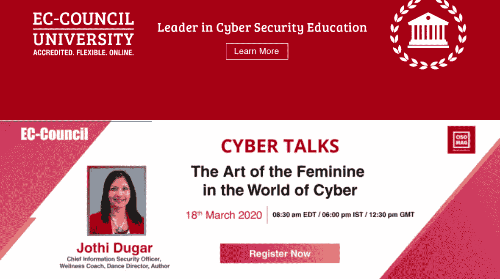
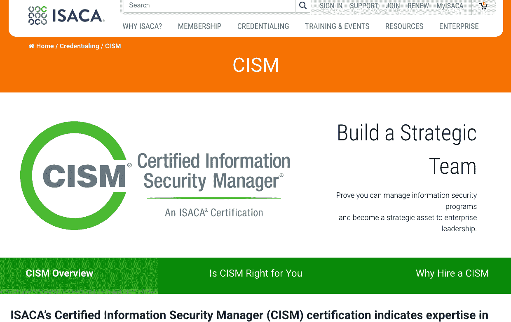
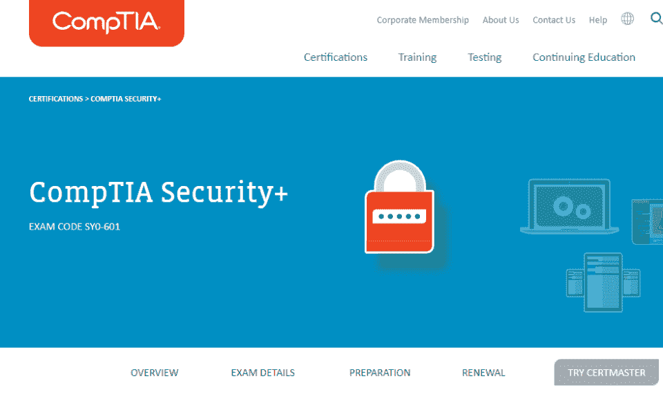
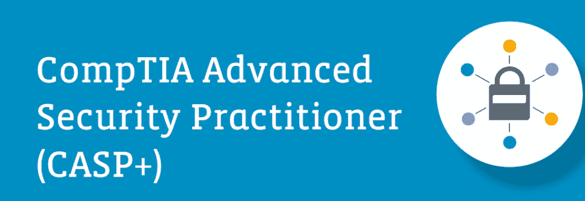
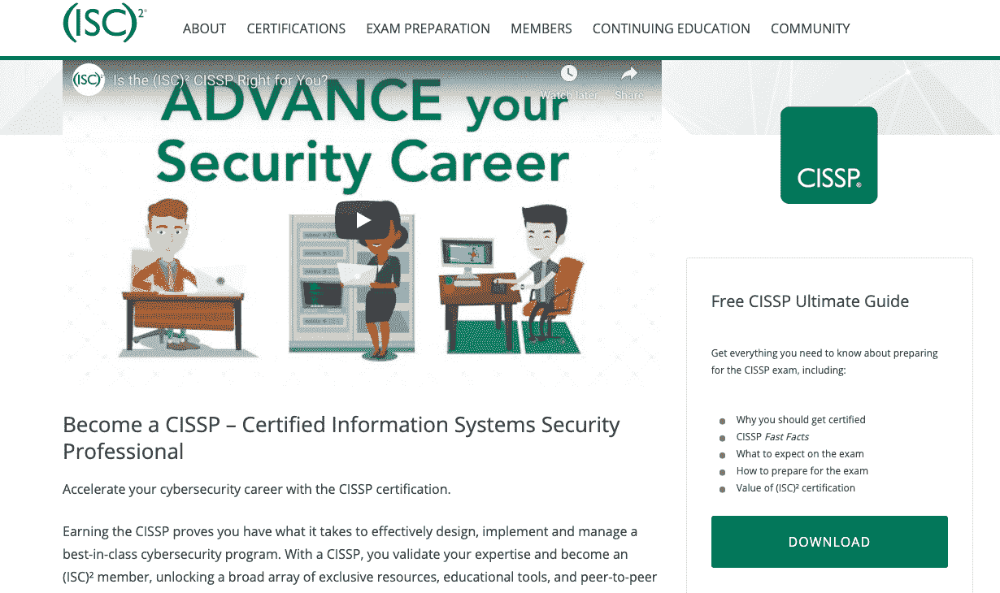
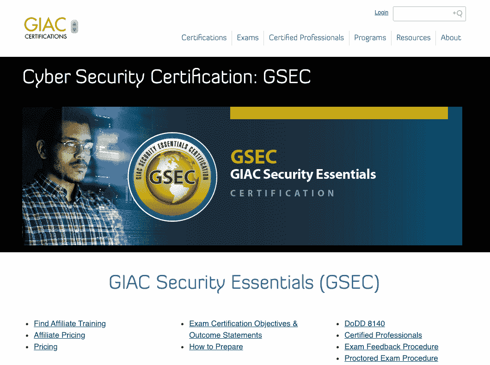
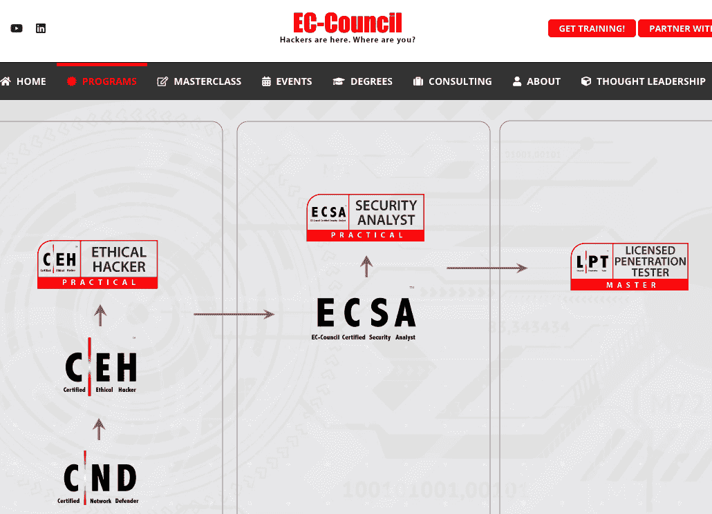
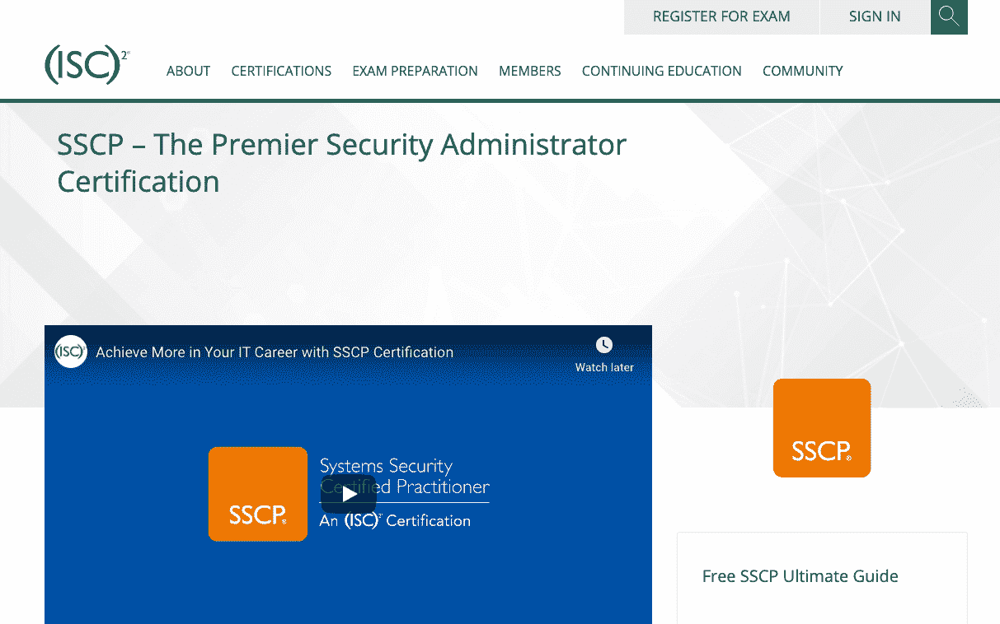
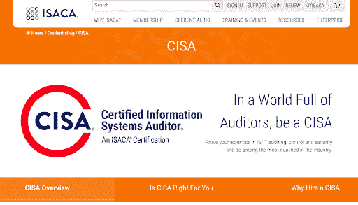

# 10 大最佳网络安全认证，助力您的职业发展

> 原文：<https://hackr.io/blog/best-cybersecurity-certification>

[网络安全](https://hackr.io/tutorial/cybersecurity-training)是一个快速增长的领域，从 2020 年到 2030 年，预计将有 33%的[市场增长](https://www.bls.gov/ooh/computer-and-information-technology/information-security-analysts.htm)。考虑到其他行业的平均水平是 8%，这是相当可观的！这也难怪，考虑到数据泄露的增加，包括[政府黑客](https://edition.cnn.com/2022/03/08/politics/china-hacking-state-governments-mandiant/index.html)寻求重要数据。

如今，你会在各种工作论坛上发现大量的网络安全工作，可能名称略有不同，如“信息安全分析师”或“数据安全顾问”你可以考虑通过网络安全认证来获得这些职位！

让我们来看看网络安全证书如何帮助你的职业生涯，以及在选择顶级网络安全证书时要寻找什么属性。

首先，有什么样的网络安全工作？

## **网络安全工作选项和要求**

作为一名网络安全专业人员，您的主要目标是保护数据。具体的工作职责可能会因您所从事的领域而异，例如，政府、金融、技术和医疗保健组织在处理网络安全方面可能会有不同的细微差别。

以下是一些不同的职业选择，供您在寻求网络安全职业时选择:

*   网络安全专家
*   信息安全或漏洞分析师
*   渗透测试仪
*   网络安全架构师
*   安全或网络安全工程师
*   安全或网络安全管理员
*   安全管理员
*   安全审计员
*   安全主管
*   安全顾问
*   译解密码者
*   首席信息安全官
*   漏洞评估员
*   事件响应者
*   司法鉴定人
*   源代码审计员
*   安全经理

你能获得这些拥有网络安全认证的角色吗？不完全是。大多数招聘人员都希望至少获得计算机科学或相关领域的四年学士学位。本科教育通常会涵盖编程、人工智能、密码学、统计学和道德黑客方面的基础。

你从竞争中脱颖而出的下一个方法是获得计算机科学或相关领域的硕士学位。研究生课程将涵盖伦理学、生物统计学、密码学、数字法医学等。这通常不是上述职位的要求。然而，你会经常看到它被列为“首选”或“最好拥有”

也许你既有学士学位又有硕士学位，或者你只是一个学士学位。但最重要的是网络安全认证。

## **最佳网络安全认证**

以下是对每项认证的快速概述，有助于您对它们进行比较:

| **认证** | **成本** | **先决条件** | **最适合** |
| CEH:认证道德黑客(CEH) | $950-$1,199 | 2 年信息安全工作经验；欧洲委员会培训的毕业生 | 对渗透测试员角色感兴趣的程序员。 |
| CISM:注册信息安全经理(CISM) | 会员 575 美元；非会员 760 美元 | 5 年与信息安全相关的管理经验 | 对巩固他们的管理经验感兴趣的程序员 |
| CompTIA Security+ | $381 | 建议有 2 年的 IT 安全经验，但不是必需的 | 有志的网络安全专业人士刚刚开始他们的职业生涯 |
| CompTIA 高级安全从业者(CASP) | $480 | 没有正式要求，但考试提供商只向至少有 10 年经验的 IT 专业人员推荐该认证考试 | 寻求更高级的企业安全角色的安全工程师和架构师 |
| CISSP(注册信息系统安全专家) | $749 | 在至少两个网络安全主题领域有 5 年的经验，如安全和风险管理、安全工程、软件开发安全、通信和网络安全等。 | 希望进入管理和高级职位的网络安全专业人士 |
| GSEC: GIAC 安全要素 | $2,499 | 没有具体的前提条件；然而，我们建议在注册之前熟悉基础计算机科学 | 网络安全初学者 |
| ECSA:欧盟委员会认证安全分析师 | $250 | 2 年经验或完成欧洲委员会培训课程 | 对渗透测试职业感兴趣的网络安全初学者。 |
| SSCP:系统安全认证从业者 | $249 | 没有具体的前提条件；然而，我们建议在注册之前熟悉基础计算机科学 | 网络安全初学者 |
| CISA:注册信息系统审计师 | 会员 575 美元；非会员 760 美元 | 5 年 IT 审计或担保经验。ISACA 也承认学位课程取代了每两年的经验要求 | 经验丰富的网络安全专业人士希望巩固他们的审计经验。 |
| GIAC 认证事故处理员(CIH) | $2,499 | 没有正式的先决条件，但我们建议您对安全原则和网络协议有基本的了解和相关的经验 | 希望专注于事件响应的初级网络安全专业人员 |

最安全的组织如何保护自己免受黑客攻击？道德黑客。一个有道德的黑客通过试图侵入一个组织的系统来测试他们的软件安全性。这个认证教你如何像黑客一样思考和行动。主题包括黑客技术、最新的漏洞、信息安全法律和标准。学生们将经历实时场景，接触黑客技术，并学习如何扫描、攻击和保护他们的系统免受黑客攻击。本课程有益于安全专业人员、站点管理员和任何关心网络安全的人。在申请渗透测试职位之前，用这个证书武装自己。

**费用:**950-1199 美元

**任职条件:** 2 年信息安全工作经验；欧洲委员会培训的毕业生

**最适合:**对渗透测试员角色感兴趣的程序员。

[查看认证](https://www.eccouncil.org/)

该认证为您提供了在网络安全管理方面脱颖而出的工具。一些感兴趣的主题包括:

*   安全风险管理
*   程序开发和管理
*   管理
*   事故管理和响应

**费用:**会员 575 美元；非会员 760 美元

**先决条件:** 5 年信息安全相关管理工作经验

最适合:对巩固自己的管理经验感兴趣的程序员

[查看认证](https://www.isaca.org/credentialing/cism)

[网络安全:从初学者到专家(2023)](https://click.linksynergy.com/deeplink?id=jU79Zysihs4&mid=39197&murl=https%3A%2F%2Fwww.udemy.com%2Fcourse%2Fcybersecurity-from-beginner-to-expert%2F)

CompTIA 是网络安全行业备受尊敬的权威，提供各种认证以支持网络安全职业和教育的发展。CompTIA Security+认证对于刚进入安全领域的 IT 专业人员来说是一个很好的网络安全证书。该考试涵盖广泛的主题，如网络攻击、事件响应、体系结构和设计、治理和合规性、风险管理和密码学。

费用:381 美元

**先决条件:**建议有 2 年的 IT 安全经验，但不是必需的

**最适合:**有志于网络安全的专业人士，刚刚开始他们的职业生涯

[查看认证](https://www.comptia.org/certifications/security)

在 CompTIA 的认证阶梯上，CASP 是一项高级网络安全认证，具有安全工程和架构方面的实践经验。涵盖的其他主题包括密码学和治理。尽管水平很高，但对管理者来说，这不是最好的网络安全认证之一；相反，它更适合希望从事建筑师和工程师等技术工作的专业人士。

费用:480 美元

**先决条件:**没有正式要求，但考试提供商只向至少有 10 年经验的 IT 专业人员推荐该认证考试

**最适合:**寻求企业安全领域更高级角色的安全工程师和架构师

[查看认证](https://www.comptia.org/certifications/comptia-advanced-security-practitioner)

[****](https://www.isc2.org/Certifications/CISSP)

CISSP 是程序员和专业人士寻求在该行业发展职业生涯的最佳网络安全认证之一。它当然不适合初学者，需要 5 年以上的经验。拥有这一头衔的安全工程师和首席信息官并不少见；然而，他们可能还有许多其他的。CISSP 认证是网络安全职位发布最常见的要求或首选资格。

费用:749 美元

**先决条件:**在至少两个网络安全主题领域有 5 年的经验，如安全和风险管理、安全工程、软件开发安全、通信和网络安全等。

**最适合:**希望进入管理和高级职位的网络安全专业人士

[查看认证](https://www.isc2.org/Certifications/CISSP)

[****](https://www.giac.org/certification/security-essentials-gsec)

全球安全基础认证(GSEC)是面向希望深入网络安全领域的初级程序员的顶级网络安全认证之一。作为一项入门级认证，GSEC 是为渴望担任“动手”安全角色的专业人士而设计的。涵盖的一些主题包括主动防御、密码学、云安全和事件响应。此外，毕业生将有一个强大的基础，在这些领域的角色中拥有权威:

*   信息安全计划开发和管理
*   信息安全管理
*   软件开发工程
*   信息技术审计

费用:2499 美元

**先决条件:**没有具体的先决条件；然而，我们建议在注册之前熟悉基础计算机科学

**最适合:**网络安全初学者

[查看认证](https://www.giac.org/certification/security-essentials-gsec)

[****](https://cert.eccouncil.org/)

同样由 ECSA 提供(像 CEH 认证)，欧盟委员会认证分析师认证是对渗透测试职位感兴趣的专业人士的一个伟大的选择。该认证类似于 CEH 认证。这个认证让你了解黑客工具和最新的技术。该证书适合申请更多的角色，如网络服务器管理员、信息安全测试员、防火墙管理员、系统管理员、风险评估专家等。

**费用:**250 美元

**先决条件:** 2 年经验或完成欧盟委员会培训课程

**最适合:**对渗透测试职业感兴趣的网络安全初学者。

[查看认证](https://cert.eccouncil.org/)

[****](SSCP:%20Systems%20Security%20Certified%20Practitioner)

该认证由(ISC)2 提供，可确保您具备高级技术技能，能够使用网络安全专家制定的最佳安全实践、程序和策略来实施、监控和管理 IT 基础架构。该认证认为您能够胜任的一些主题包括安全管理、应用程序安全、事件响应和风险识别。如果你预算有限，SCCP 是网络安全方面最好的认证之一，价格合理，为 249 美元。

费用:249 美元

**先决条件:**没有具体的先决条件；然而，我们建议在注册之前熟悉基础计算机科学

**最适合:**网络安全初学者

[查看认证](https://www.isc2.org/Certifications/SSCP)

[****](CISA:%20Certified%20Information%20Systems%20Auditor)

该认证由 ISACA 提供，展示了您在控制实施、漏洞评估和合规性报告方面的实力。作为一个著名的审计认证，CISA 需要丰富的经验。CISA 认证的专业人士倾向于从事以下领域的职业:

*   信息系统审计
*   IT 管理和治理
*   信息资产的保护

**费用:**会员 575 美元；非会员 760 美元

先决条件: 5 年 IT 审计或担保经验。ISACA 也承认学位课程取代了每两年的经验要求

**最适合:**经验丰富的网络安全专业人士，希望巩固他们在审计方面的经验。

[查看认证](CISA:%20Certified%20Information%20Systems%20Auditor)

[****](https://www.giac.org/certifications/certified-incident-handler-gcih/)

由 GIAC 提供的事件处理者认证是一个很好的网络安全证书，适用于渴望巩固其在威胁检测和安全事件响应方面的权威的专业人士。获得该认证的专业人员将具备关于常见攻击技术和媒介的认证知识。

费用:2499 美元

**先决条件:**没有正式的先决条件，但是我们建议您对安全原则和网络协议有基本的了解和相关的经验

**最适合:**希望专注于事件响应的初级网络安全专业人员

[查看认证](https://www.giac.org/certifications/certified-incident-handler-gcih/)

## **如何选择最适合自己的网络安全认证**

有这么多有声望的认证机构和各种各样的认证，你如何选择一个最适合你的情况？

考虑一下你想从事的网络安全职业。您对事件响应更感兴趣吗？渗透测试？安全架构？你会想缩小你的兴趣范围，选择一个涵盖这些领域的认证。

你也应该对工作机会进行调查。你梦想中的工作需要或要求哪些认证？例如，如果大多数招聘广告都不需要认证，你可能就不太愿意花数千美元在认证上。

## **结论**

网络安全是科技领域中一个快速发展的行业，为像您这样的 IT 专业人士提供了大量的工作机会。无论你申请的是网络安全工程师还是数据分析师，网络安全认证都是让你在就业市场获得竞争优势的好方法。

在支付认证费用之前，试着积累一些经验，以确保你在考试中取得好成绩。一个开始的好地方？[网络安全教程](https://hackr.io/tutorials/learn-cyber-security)！

## **常见问题解答**

#### **1。一个网络安全认证值得吗？**

是的，一个网络安全认证是值得的。许多张贴在招聘栏上的网络安全职位都要求这种证书，即使他们不要求，这种证书也会帮助你从其他申请者中脱颖而出。

#### **2。如何获得网络安全认证？**

你必须首先被认证项目接受，然后在考试中取得好成绩。

#### **3。应该先拿到哪个网络安全认证？**

如果你在网络安全领域的经验不足两年，我们建议你从初级认证开始。EC-Council 认证安全分析师是一个很好的起点。

#### **4。网络安全认证需要多长时间？**

当考虑预备课程和准备时间时，大多数网络安全专业人员需要长达两年的时间才能获得认证。然而，如果你已经有了丰富的工作经验，你可能不需要那么多时间来获得认证。

#### **5。网络安全需要编码吗？**

初级网络安全角色通常不需要大量编码，但以防万一，您应该掌握基本的编码技能。随着你在网络安全职业阶梯上的攀升，将需要更多的编码。

#### **6。网络安全是个好职业吗？**

是的。网络安全专业人士可以预计，从 2020 年到 2030 年，市场将增长 33%，这将保证就业安全。薪水也相当高，从 7 万美元到 12 万美元不等，高管职位的薪水甚至更高。

**人也在读:**