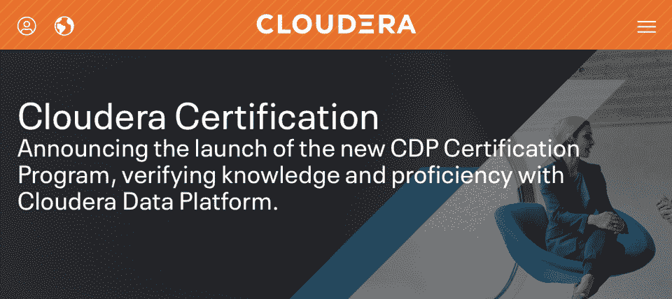
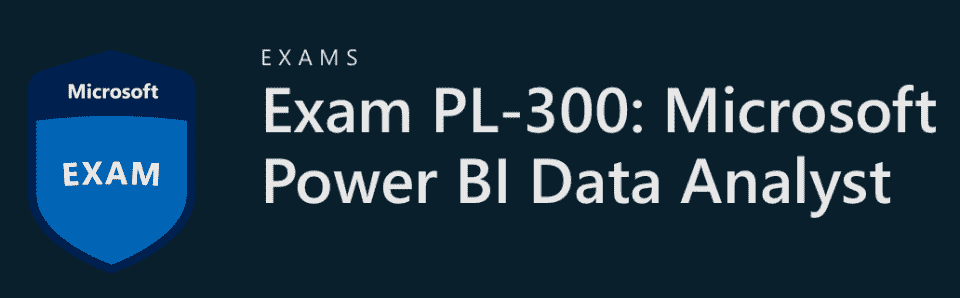
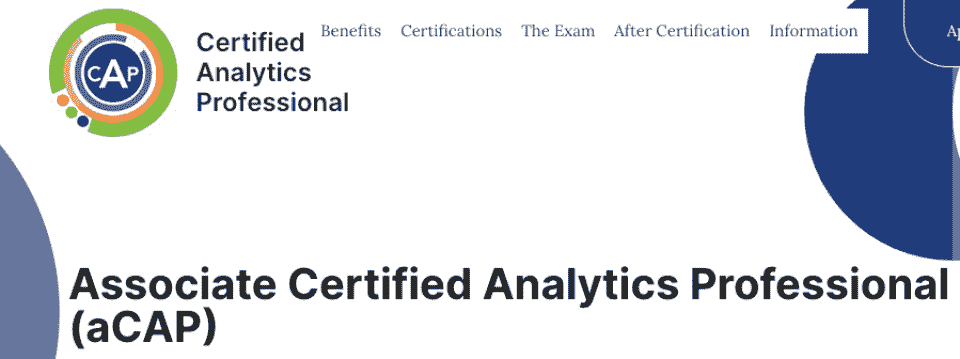
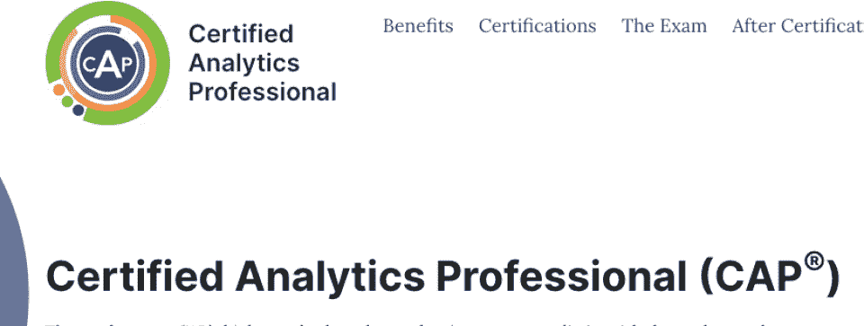
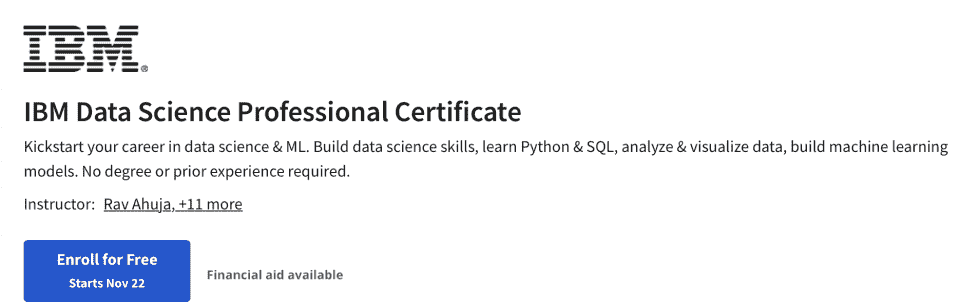
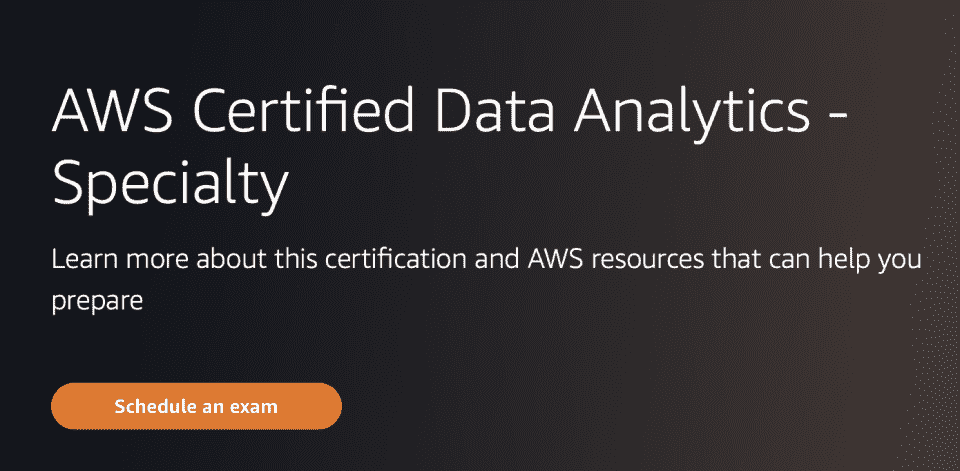
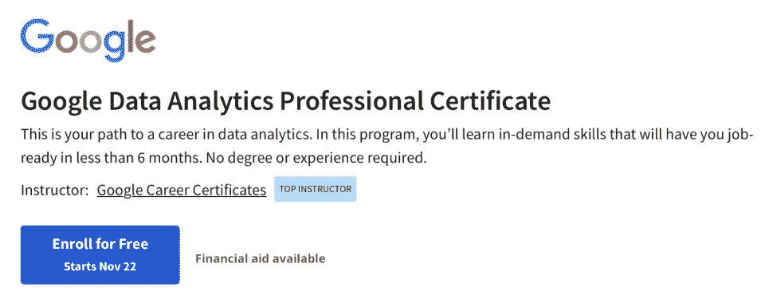

# 最佳数据分析认证:2023 年前 7 名

> 原文：<https://hackr.io/blog/best-data-analytics-certification>

当我们集体生产和消费比以往更多的数据时，越来越多的公司开始理解它的重要性。数据对于指导商业决策变得如此重要，以至于一些公司甚至开始收集和出售大量数据。

正因为如此，许多组织现在都在采用数据驱动的业务战略，以实现高级分析功能。出于这些原因，令人兴奋的数据分析领域正在蓬勃发展，预计 2020 年至 2030 年间，T2 的就业岗位将增长 25%。

你可以参加各种[课程](https://hackr.io/blog/data-analytics-courses)或观看 YouTube 视频来学习数据分析，但你最好的选择是数据分析认证。通过获得认证，你可以提高你的市场竞争力，获得有价值的知识，而花费的时间和成本只是传统大学学位的一小部分。

但是哪个是最好的数据分析认证呢？有这么多选择，你如何做出最好的选择来帮助你推进你的职业生涯呢？

所以，如果你发现自己想知道最好的分析认证，你来对地方了。本文将介绍一些最好的程序及其优缺点。最终，你将顺利成为一名认证数据分析师，甚至可能成为一名数据科学家。

准备好了吗？我们开始吧！

## **数据分析认证和数据分析证书有什么区别？**

证书和认证听起来如此相似，你可能会认为它们是同一个东西。尽管听起来很像，但它们根本不同。

完成一门课程，你就可以获得证书。例如，如果您参加了 Udacity 课程或参加了面对面的培训，您将在结束时获得结业证书。

这意味着你可以使用证书来证明你已经完成了一些培训或获得了知识和技能。例如，作为一名数据分析师或科学家，你可以加入最好的数据分析计划来学习 SQL，并在完成后获得证书。

另一方面，**证书**可能更难获得。要获得认证，您必须参加*和*并通过评估考试。

通过考试表明你拥有必要的知识和技能，可以成为某个领域、技能或利基的*认证专家*。一些雇主可能要求求职者出具证明。例如，公司可能会招聘经过认证的数据科学家或分析师。

证书和**证书**都有助于你的职业发展。但是在它们之间做出决定取决于你的职业目标和抱负。如果你有足够的资源，我们建议你参加最好的数据分析项目来获得一些证书。一旦你做好准备，就要争取数据分析认证。

## **获得数据分析师认证值得吗？**

数据分析认证值得花费时间和资金吗？

数据分析师**证书**可以向潜在雇主展示你已经花了时间和精力去学习更多关于某个主题的知识。证明你参加了一门课程，尤其是如果它是一个由备受尊敬的供应商提供的高质量课程，可能意味着雇主会更青睐你的简历。

但是**认证**呢？

在 BLS 的这份 2020/21 [报告](https://www.bls.gov/cps/aa2020/cpsaat54.pdf)中，你可以清楚地看到，有证书者的周工资中值高于无证书者——即使他们没有执照(如果适用的话)。当然，这份报告涵盖了广泛的职业范围，但它确实表明了通过获得最佳数据分析师认证来提高收入的潜力。

这份 2020/21 年 BLS [报告](https://www.bls.gov/cps/aa2020/cpsaat50.pdf)还显示，有证书的人的失业率可能比没有证书的人低得多。

以下是信息一览。在这个例子中，我们关注的是 25-54 岁的人群。

| **周收入中位数** | **失业率** |
| 没有证书或执照 | $955 | 8.1% |
| 有证书，但没有执照 | $1,318 | 5.0% |
| 有执照 | $1,188 | 4.2% |

总之，BLS 的数据表明，最好的数据分析师认证可以让你给潜在的雇主留下更好的印象，同时也提高了你的收入和就业机会。

## **最佳数据分析认证:2023 年最佳选择**

以下是我们为数据分析师职业道路列出的最佳认证:

让我们进入我们列表中的第一个数据分析师认证！

### **1。** [**CDP 数据分析师认证**](https://www.cloudera.com/about/training/certification.html) **【原 Cloudera 认证助理(CCA 数据分析师)】**

****

Cloudera Certified Associate 或 CCA Data Analyst 是一项数据分析认证，面向

*   商业智能专家
*   数据库管理员
*   数据分析师
*   开发商
*   系统架构师

CCA 数据分析师认证是为希望在竞争中脱颖而出的 SQL 开发人员设计的。该数据分析认证要求您成功

*   在 Impala 和 Hive 中使用 QL(查询语言)语句分析集群数据
*   使用 ETL(提取、传输、加载)过程为查询准备数据
*   使用 DDL(数据定义语言)语句在 Impala 和 Hive 使用的 metastore 中更改或创建结构

120 分钟的考试要求你用一个独特的大型数据集和一个 CDH 集群解决 8-12 个问题。

然而，Cloudera 最近**取消了 CCA 数据分析师**认证，代之以 **CDP 认证计划**。这一新计划包含四项认证:CDP 通才、CDP 管理员-私有云基础、CDP 数据开发人员和 CDP 数据分析师。

[**CDP 数据分析师**](https://www.cloudera.com/about/training/certification/cdp-dataanalyst-exam-cdp-4001.html) 认证费用为 300 美元(该计划中的每个认证都是一样的)，这意味着您将花费 1200 美元来获得所有四项认证。50 个问题的考试测试您对 Cloudera 数据平台的数据分析知识。

**先决条件:**

*   熟悉 Salesforce、BI 工具、Google Sheets、MS Excel 和 Python/R
*   关于所涵盖主题的更多信息，请点击[此处](https://www.cloudera.com/about/training/certification/cdp-dataanalyst-exam-cdp-4001.html)

价格:300 美元

**考试总题:** 50 道

**内容:**测试您对 Cloudera 数据平台的了解以及其他相关技能

**持续时间** : 120 分钟

最适合谁？:商业智能专家、数据库管理员、数据分析师、开发人员和系统架构师

可以在这里报名[。](https://education.cloudera.com/store/2891290-cdp-4001-data-analyst-exam)

****

微软提供一系列技术认证，Power BI 数据分析师助理认证(DA-100)享有盛誉。然而，2022 年初，微软让 DA-100 退役，取而代之的是微软 Power BI Data Analyst (PL-300)。

该认证测试您通过使用高级分析技能从业务数据资产中收集价值的能力。因此，它在对数据建模、数据分析、数据可视化和数据准备有深刻理解的数据专业人员和商业智能分析师中很受欢迎。

**先决条件:**

*   数据处理和存储库的知识
*   各种微软预备课程(推荐)

价格: $165

**考试总题:** 40-60

**内容:**单项和多项选择题

**持续时间** : 180 分钟

最适合谁？:数据专业人员和商业智能分析师

可以在这里报名[。](https://docs.microsoft.com/en-us/learn/certifications/power-bi-data-analyst-associate/)

****

你是一个几乎没有经验的入门级分析专家吗？你对[开始数据分析职业](https://hackr.io/blog/become-data-analyst-with-no-experience)有全面的了解和希望吗？然后你应该去看看助理认证分析专家(aCAP)认证。获得 aCAP 证明你

*   拥有某种形式的数据分析硕士学位，即数据分析和相关技术的理论知识
*   符合分析道德准则
*   是有能力的数据分析专家

aCAP 认证基于分析流程的七个方面

*   商业问题框架
*   分析问题框架
*   数据
*   方法选择
*   模型结构
*   部署
*   生命周期管理

**先决条件:**

*   相关领域的文学硕士
*   三年以下工作经验

**价格:**

*   200 美元(通知成员)
*   300 美元(其他人)

**总考题** : 100 道

**内容:**选择题

**持续时间**:三小时

最适合谁？:经验不多但知识丰富的入门级数据专业人士；考生必须拥有相关领域的硕士学位

可以在这里报名[。](https://www.certifiedanalytics.org/associate_cap.php)

****

认证分析专家(CAP)认证无疑是顶级数据分析认证的竞争对手。

从 aCAP 更进一步，通过严格的 CAP 考试让你在竞争中脱颖而出。该认证证明了在各种数据领域的能力，如回归、预测和规定分析、模式识别、工作任务分析、数据可视化等。

要获得该认证，您需要

*   满足教育和经验要求
*   掌握“软技能”的艺术
*   遵守 CAP 道德准则
*   通过 CAP 考试

CAP 认证需要通过专业开发单位每三年更新一次。该数据分析认证因其基于计算机的测试而具有全球影响力。

首先，您必须将您的申请提交给 CAP 小组进行审核。如果他们批准你的申请，你就可以参加考试了。CAP 是基于分析专业人员实践的便携式凭证。

**先决条件**:

*   要么本科毕业 5 年专业经验，要么硕士毕业 3 年专业经验

**价格**:

*   495 美元(通知成员)
*   350 美元(aCAP 认证候选人)
*   695 美元(其他人)

**总提问:** 100

**内容:**四选项，多项选择题

**持续时间**:三小时

最适合谁？:符合 aCAP 标准的数据专业人员，但也有至少五年的工作经验和必要的软技能

可以在这里报名[。](https://www.certifiedanalytics.org/for_professionals.php)

****

IBM 数据科学专业证书是一套课程，旨在教授您数据科学的基础知识，包括如何像数据科学专业人员一样思考。您将获得数据科学工具和方法、Python 数据分析和可视化、Python 机器学习等方面的实践经验和知识。

与认证不同，IBM 数据科学专业证书不要求您通过考试。

你通过 [Coursera 的专业证书课程](https://www.coursera.support/s/article/115004712226-Professional-Certificates?language=en_US)获得该证书。这些是结构化的课程，帮助你学习在某个职业领域开始职业生涯所必需的知识和技能。因此，当您完成课程时，您将获得课程提供商颁发的证书和 IBM 自己颁发的数字徽章。

获得这个证书最大的好处是你将有一个证书来帮助你改变职业生涯。事实上，IBM 数据科学专业人员是那些希望将职业生涯转移到利润丰厚的数据科学领域的人的最佳数据分析证书计划之一。

**先决条件**:

*   Coursera Plus 订阅

**价格**:

*   “免费”，意思是你不需要为 Coursera Plus 订阅额外付费
*   Coursera Plus 每月收费 59 美元(如果按月付费的话)或每年预付 399 美元，并有 14 天退款保证

持续时间:十一个月，如果你每周学习时间不超过四个小时的话(如果时间多的话会更快)

最适合谁？:任何想要学习在数据分析和数据科学领域取得成功所必需的职业技能的人——欢迎初学者

可以在这里报名[。](https://imp.i384100.net/Xx6233)

****

如果你想展示你的亚马逊网络服务(AWS)的经验和能力，那么 AWS 认证数据分析认证是一个很好的选择。

该认证专为那些已经有 AWS 工作经验的人设计，构建和维护这个亚马逊云平台的分析解决方案。因此，对于希望提高成功几率的初入职场的数据分析专业人士来说，这是最好的选择。

**先决条件**:

*   虽然不是必需的，但亚马逊建议至少五年的各种数据分析技术经验，以及至少两年的 AWS 实际工作经验

**价格**:300 美元

**总提问:** 65

**内容:**多项选择或多项回答问题

**持续时间** : 180 分钟

最适合谁？:有 AWS 服务经验者。亚马逊推荐几年使用 AWS 设计、构建、保护和维护分析解决方案的经验

可以在这里报名[。](https://aws.amazon.com/certification/certified-data-analytics-specialty/)

****

谷歌的数据分析专业证书是一个面向零经验的绝对初学者的在线课程。

提供的课程教学生清理、可视化和分析数据的过程，以及如何使用 SQL、电子表格和 R 编程语言。如果你能保证每周学习 10 小时，你可以在六个月内完成这门课程。

很像上面讨论的 IBM 证书，这个课程是 Coursera 和 Google 合作的。因此，一旦你完成了课程，你将获得谷歌职业证书和 Coursera 证书。

**先决条件**:

*   注册此计划没有先决条件

**价格**:

*   “免费”，意思是你不需要为 Coursera Plus 订阅额外付费
*   Coursera Plus 每月收费 59 美元(如果按月付费的话)或每年预付 399 美元，并有 14 天退款保证

持续时间:如果你承诺每周学习 10 个小时，那就是 6 个月

最适合谁？:任何人，包括初学者，想要学习数据分析职业所需的技能

可以在这里报名[。](https://imp.i384100.net/BXjRoJ)

## **最佳数据分析认证对比**

我们介绍的每一项数据分析认证都有助于您的职业发展。为了便于您进行比较，我们在下表中比较了它们的主要特性。

| **认证** | **价格** | **持续时间** | **最适合** |
| Cloudera 数据平台数据分析师认证(CDP 数据分析师) | $300 | 50 个问题，120 分钟 | 使用 Cloudera 的 SQL 开发人员和数据分析师 |
| 微软认证:Power BI 数据分析师 | $165 | 40-60 个问题，180 分钟 | 数据和商业智能专业人员 |
| 助理认证分析专家(aCAP) | 200 美元(通知成员)300 美元(其他人) | 100 个问题，3 个小时 | 入门级数据专业人员 |
| 认证分析专家 | 495 美元(通知成员)350 美元(aCAP 认证候选人)695 美元(其他人) | 100 个问题，3 个小时 | 经验丰富的数据专家拥有硕士学位和五年以上的工作经验 |
| IBM 数据科学专业证书 | 免费，但需要 Coursera Plus 订阅；每月 59 美元或每年 399 美元 | 如果你每周学习 4 小时，11 个月 | 任何想要学习在数据分析和数据科学领域取得成功所必需的职业技能的人——欢迎初学者 |
| 亚马逊 AWS 认证数据分析 | $300 | 65 个问题，180 分钟 | 至少有五年工作经验的处于职业生涯早期阶段的数据专业人员 |
| 谷歌数据分析专业证书 | 免费，但需要 Coursera Plus 订阅；每月 59 美元或每年 399 美元 | 如果你承诺每周学习 10 小时，6 个月 | 任何人，包括初学者，都想学习开始数据分析职业生涯所需的技能 |

## **如何选择数据分析师的最佳认证**

随着与数据相关的职业越来越受欢迎，专业人士争相填补人才缺口，让自己与众不同的最佳方式之一就是获得认证。

正因为如此，更多的认证一直在出现。选择越多，选择越难，以至于你会发现自己犹豫不决。

### **你的预算**

有一点是肯定的——认证并不便宜！

它们是很好的投资，因为你可能会增加被雇佣的机会或者增加你的收入。但是如果你没有太多的可支配收入，在选择认证之前考虑一下你的预算是个好主意。

一些认证项目将带你从零知识到认证就绪，同时提供支付计划，使其更实惠。所以你可以考虑这些选项，但你仍然需要支付认证本身！

### **你的知识和经验水平**

最适合您的数据分析认证将符合您的经验和知识水平。如果你试图参加一个远远超出你目前水平的认证评估考试，很有可能你是在浪费时间和金钱。

如果你是一个初学者，目标是为初级到中级专业人员设计的认证。

如果你真的着眼于某个特定的认证，那么最好的方法是从一门课程或顶级数据分析认证课程开始。预备课程也可以帮助你快速提高你的水平，达到认证所要求的水平。

### **认证提供者**

有些认证比其他认证更可信。不要把你的时间、金钱和精力浪费在不被业界认可或尊重的供应商的认证上。

在决定之前，做你的尽职调查，研究认证和供应商的问题。

### **您选择的平台**

在使用特定系统时，有些认证比其他认证更好。

例如，如果你想在 AWS 工作，你可能想获得 AWS 认证。如果你想提高你的谷歌分析技能，最好是获得一个证书，为你的专业做好准备。

### **认证持续时间和更新频率**

技术飞速发展。因此，许多认证的有效期只有几年。当您获得认证后，很有可能需要每隔几年更新一次以保持其有效性。

此外，一些认证有“版本”，这意味着如果您认证的是以前的版本而不是当前的版本，您将不再有资格。与网络安全等领域相比，版本在数据分析中不太常见，但仍然需要记住！

最后要考虑的是认证的维护成本。有的可能要求你交年费，有的只要求你续证时再交。

## **获得数据分析认证的好处**

除了潜在的增加收入和被雇用的机会，认证还可以提供进一步的好处，增加你作为数据分析师的成功机会。让我们仔细看看这些好处。

*   **为你准备一份非常赚钱的职业** **有足够的工作保障:**评估考试很难，证书是出了名的难以获得，所以这让你在通过后与众不同。但这也意味着你可能需要参加一个课程，一个数据分析认证项目，或者进行密集的自学

*   更有吸引力和竞争力的简历:如果雇主*对某个职位要求*证书，你可以随时准备申请，让你脱颖而出。更不用说，一份有很多资历和证书的简历对雇主来说更有吸引力

*   让你的能力立刻为人所知:在简历上有一个证书可以让招聘经理立刻知道你拥有这份工作所需的知识和技能，而无需深究你的简历

*   **加深你的知识&通过实践经验巩固你的技能**:cert 准备的严格性和具有挑战性的考试增加了你对特定领域的理解。你还可以从结构化的学习方法中受益，这样就不会再从一个话题跳到另一个话题，或者不知道如何继续下去

除了这些好处，还有一个事实是，越来越多的雇主希望雇佣有证书的个人。因此，拥有证书会让你在公司中更有吸引力。

## **结论**

目前，各行各业对数据专业人员的需求几乎无法满足。尽管有这种需求，人才缺口仍然存在，这使得企业很难找到他们需要的员工。开始数据分析师或数据科学家的职业生涯可能是成功的最佳途径之一，尤其是如果你从一开始就设定自己要成功。

为自己的数据分析职业生涯做准备的最好方法之一是完成一些课程，获得一两个证书(或者你想要多少就有多少！).但是如果你可以的话，获得一个证书真的可以增加你被雇佣的机会，因为它向雇主展示了你拥有这份工作所需的知识和技能。

然而，你也应该记住，即使是最好的数据分析认证也不能保证你有一个成功和令人满意的职业生涯。你还需要经验和“积极进取”的态度来不断拓展你的知识。提高你的软技能也非常有益。祝你好运！

***准备好开始你的数据分析生涯了吗？了解更多关于工作所需的*** [***数据分析工具***](https://hackr.io/blog/top-data-analytics-tools) ***！***

## **常见问题解答**

#### **1。数据分析证书值得吗？**

我们认为，在找工作时，证书比证书更有价值，可以提高你的市场竞争力。然而，当涉及到扩展你的知识时，证书和认证都是值得的。

#### **2。有了数据分析证书可以得到什么工作？**

通过数据分析证书，您可以增加获得各种数据工作的机会，例如

*   商业智能分析师
*   数据分析师
*   数据科学家
*   数据分析顾问
*   运营分析师
*   营销分析师

#### **3。获得数据分析认证需要多长时间？**

这取决于具体的项目和你投入学习的时间。你可能需要学习几个月才能通过认证考试，但对于其他人来说，可能需要几年的时间来收集先决条件和知识。

#### **4。哪种认证最适合数据分析？**

最佳数据分析认证符合您的职业需求、生活方式和个人兴趣。

例如，[微软 Power BI 数据分析师](https://docs.microsoft.com/en-us/learn/certifications/power-bi-data-analyst-associate/)认证是这个名单上最具成本效益的认证之一，它也非常适合数据分析和商业智能专业人士。

#### **5。谷歌分析是一种技能吗？**

谷歌分析对许多人来说是一个有价值的工具，包括，你可能已经猜到了，数据分析师和科学家。所以答案是肯定的，谷歌分析是一项可以提升你职业前景和薪水潜力的技能。

#### **6。当今数据分析领域最受欢迎的资格是什么？**

数据行业非常需要许多技能和资格，例如

*   精通 Python 和 R
*   SQL/NoSQL 知识
*   数据可视化技能
*   云相关技能
*   数学和统计技能
*   人工智能和机器学习

#### **7。数据分析哪个认证好？**

许多认证有助于促进您的数据分析职业生涯。本文涵盖了一些最好的认证，包括 Google 数据分析专家认证或 Microsoft Certified Power BI 数据分析师认证。但是如果你不确定一个认证是否可信，研究一下供应商及其行业声誉。

**人也在读:**